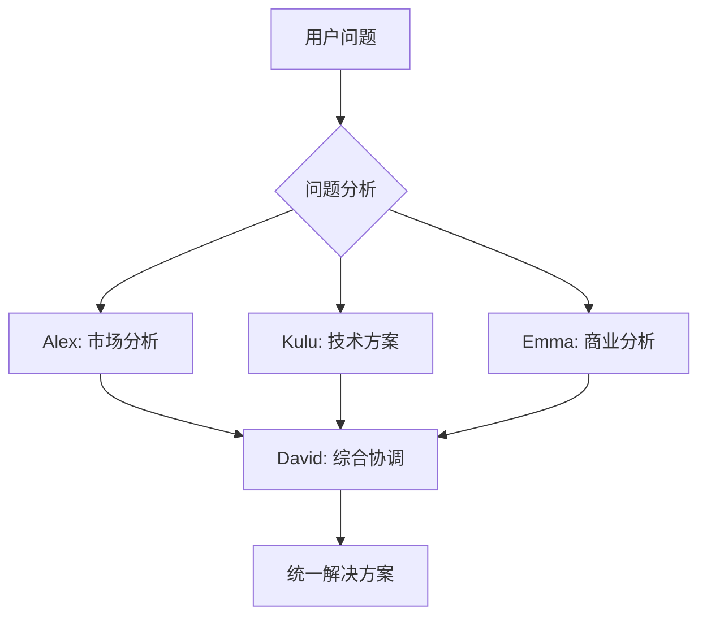
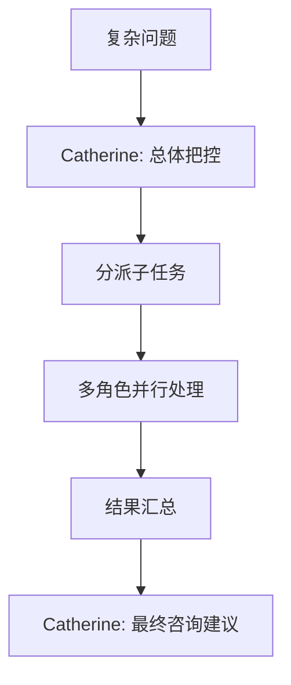

# 六角色智能分配机制

## 概述

智链平台通过六个AI角色实现智能化任务分配和协作，每个角色具备独特的专业能力和视觉标识，通过智能编排系统为用户提供最优解决方案。

## 六角色定义体系

### Alex - 需求理解专家 🧠
**核心定位**: Requirements Understanding Expert  
**专业领域**: 深度需求挖掘、隐性需求识别、业务意图推理、用户场景分析

```typescript
interface AlexCapabilities {
  needsDiscovery: {
    deepRequirementsExploration: boolean;
    hiddenNeedsIdentification: boolean;
    businessIntentAnalysis: boolean;
    userScenarioMapping: boolean;
  };
  
  gapAnalysis: {
    infrastructureGapDetection: boolean;  // 识别数据基建缺失
    capabilityMissingAnalysis: boolean;   // 发现能力缺失
    processInefficiencySpotting: boolean; // 流程低效识别
    digitizationNeedsAssessment: boolean; // 数字化需求评估
  };
  
  requirementsTranslation: {
    businessToTechnicalMapping: boolean;
    implicitNeedsExplicitiation: boolean;
    priorityRanking: boolean;
    valuePropositionDefinition: boolean;
  };
}
```

**触发条件**:
- 用户描述业务需求或痛点
- 需要深度挖掘真实需求
- 识别用户未明说的基础能力缺失（如数据向量化、文档数字化等）
- 销售增强场景的需求分析

### Sarah - 技术架构师 ⚙️
**核心定位**: Technical Architect  
**专业领域**: 技术基础设施评估、系统架构设计、技术风险识别、集成方案规划

```typescript
interface SarahCapabilities {
  infrastructureAssessment: {
    existingTechStackEvaluation: boolean;
    scalabilityAnalysis: boolean;
    performanceBottleneckIdentification: boolean;
    securityVulnerabilityAssessment: boolean;
  };
  
  gapIdentification: {
    technicalCapabilityGaps: boolean;        // 技术能力缺失识别
    integrationComplexityAssessment: boolean; // 集成复杂度评估
    dataArchitectureReview: boolean;         // 数据架构审查
    cloudReadinessEvaluation: boolean;       // 云就绪性评估
  };
  
  solutionArchitecture: {
    technicalBlueprintDesign: boolean;
    implementationStrategyPlanning: boolean;
    riskMitigationPlanning: boolean;
    technologyRecommendation: boolean;
  };
}
```

**触发条件**:
- 用户描述现有技术环境
- 需要技术基础设施评估
- 识别技术实现障碍和风险
- 制定技术实施方案

### Mike - 体验设计师 🎨
**核心定位**: User Experience Designer  
**专业领域**: 用户体验痛点识别、交互流程设计、界面优化建议、可用性分析

```typescript
interface MikeCapabilities {
  userExperienceAnalysis: {
    painPointIdentification: boolean;        // 用户体验痛点识别
    userJourneyMapping: boolean;             // 用户旅程映射
    usabilityGapDetection: boolean;          // 可用性缺陷发现
    interactionFlowOptimization: boolean;    // 交互流程优化
  };
  
  designSolutioning: {
    interfaceDesignRecommendation: boolean;  // 界面设计建议
    workflowSimplification: boolean;         // 工作流程简化
    accessibilityImprovement: boolean;       // 可访问性改进
    mobileResponsivenessPlanning: boolean;   // 移动响应性规划
  };
  
  experienceOptimization: {
    conversionOptimization: boolean;         // 转化优化
    engagementEnhancement: boolean;          // 参与度提升
    satisfactionMetricsDesign: boolean;      // 满意度指标设计
    feedbackLoopImplementation: boolean;     // 反馈循环实现
  };
}
```

**触发条件**:
- 用户描述界面使用困难或体验问题
- 需要优化用户交互流程
- 提升用户满意度和转化率
- 设计更好的用户体验方案

### Emma - 数据分析师 📊
**核心定位**: Data Analysis Expert  
**专业领域**: 数据基础设施诊断、数据质量评估、分析策略制定、指标体系设计

```typescript
interface EmmaCapabilities {
  dataInfrastructureDiagnosis: {
    dataQualityAssessment: boolean;          // 数据质量评估
    dataArchitectureAnalysis: boolean;       // 数据架构分析  
    dataGovernanceEvaluation: boolean;       // 数据治理评估
    dataProcessingCapabilityGaps: boolean;   // 数据处理能力缺口
  };
  
  analyticsStrategy: {
    analyticsFrameworkDesign: boolean;       // 分析框架设计
    kpiMetricsSystemDesign: boolean;         // KPI指标体系设计
    dataVisualizationStrategy: boolean;      // 数据可视化策略
    predictiveAnalyticsPlanning: boolean;    // 预测分析规划
  };
  
  dataTransformation: {
    dataCleaningStrategy: boolean;           // 数据清洗策略
    dataIntegrationPlanning: boolean;        // 数据集成规划
    vectorizationRecommendation: boolean;    // 向量化建议
    dataModelingApproach: boolean;           // 数据建模方法
  };
}
```

**触发条件**:
- 用户描述数据相关问题或需求
- 需要诊断数据基础设施状况
- 识别数据处理和分析能力缺失
- 制定数据分析和可视化策略

### David - 项目管理师 📋
**核心定位**: Project Management Expert  
**专业领域**: 实施路径规划、项目分解管理、风险识别管控、资源配置优化

```typescript
interface DavidCapabilities {
  implementationPlanning: {
    projectBreakdownStructure: boolean;     // 项目分解结构
    timelineEstimation: boolean;            // 时间线估算
    resourceRequirementPlanning: boolean;   // 资源需求规划
    dependencyMapping: boolean;             // 依赖关系映射
  };
  
  executionManagement: {
    milestoneDefinition: boolean;           // 里程碑定义
    progressTrackingStrategy: boolean;      // 进度跟踪策略
    qualityControlPlanning: boolean;        // 质量控制规划
    communicationPlanDesign: boolean;       // 沟通计划设计
  };
  
  riskAndResourceManagement: {
    riskIdentificationAssessment: boolean;  // 风险识别评估
    resourceOptimization: boolean;          // 资源优化配置
    contingencyPlanning: boolean;           // 应急计划制定
    performanceMetricsDef: boolean;         // 绩效指标定义
  };
}
```

**触发条件**:
- 需要制定实施计划和时间表
- 项目复杂度较高需要专业管理
- 风险识别和资源配置优化
- 协调多个角色的工作成果

### Catherine - 战略顾问 👑
**核心定位**: Strategic Business Consultant  
**专业领域**: 商业价值分析、ROI计算评估、战略建议制定、竞争优势分析

```typescript
interface CatherineCapabilities {
  businessValueAnalysis: {
    roiCalculationModeling: boolean;         // ROI计算建模
    businessImpactAssessment: boolean;       // 业务影响评估
    valuePropositionDesign: boolean;         // 价值主张设计
    costBenefitAnalysisDeep: boolean;        // 成本效益深度分析
  };
  
  strategicAdvising: {
    competitiveAdvantageAnalysis: boolean;   // 竞争优势分析
    marketPositioningStrategy: boolean;      // 市场定位策略
    businessModelOptimization: boolean;      // 商业模式优化
    transformationRoadmapping: boolean;      // 转型路线图制定
  };
  
  executiveInsights: {
    industryBenchmarkAnalysis: boolean;      // 行业基准分析
    investmentPrioritization: boolean;       // 投资优先级排序
    strategicDecisionSupport: boolean;       // 战略决策支持
    longTermValuePlanning: boolean;          // 长期价值规划
  };
}
```

**触发条件**:
- 需要计算和评估商业价值与ROI
- 制定商业策略和竞争定位
- 高级别商业决策支持
- 整合所有角色分析提供最终战略建议

## 智能分配算法

### 问题分析引擎
```typescript
interface QuestionAnalysisEngine {
  // 文本语义分析
  semanticAnalysis: {
    keywordExtraction: string[];
    intentRecognition: Intent;
    domainClassification: Domain;
    complexityScore: number; // 0-100
  };
  
  // 上下文理解
  contextualUnderstanding: {
    conversationHistory: Message[];
    userProfile: UserProfile;
    previousSolutions: Solution[];
    preferredRoles: AIRole[];
  };
  
  // 角色匹配
  roleMatching: {
    primaryRole: AIRole;
    supportingRoles: AIRole[];
    confidenceScore: number;
    alternativeOptions: AIRole[];
  };
}
```

### 分配优先级矩阵

| 问题类型 | Alex | Sarah | Mike | Emma | David | Catherine |
|---------|------|-------|------|------|-------|-----------|
| 需求理解与隐性需求识别 | 95% | 20% | 30% | 25% | 40% | 60% |
| 技术基础设施评估 | 30% | 95% | 20% | 70% | 50% | 40% |
| 用户体验优化 | 40% | 25% | 95% | 20% | 30% | 50% |
| 数据基建诊断 | 35% | 60% | 15% | 95% | 45% | 55% |
| 实施路径规划 | 50% | 70% | 40% | 60% | 95% | 70% |
| 商业价值与ROI分析 | 60% | 30% | 40% | 50% | 60% | 95% |
| 销售增强场景分析 | 90% | 40% | 80% | 60% | 70% | 85% |
| 数字化转型需求 | 85% | 80% | 60% | 90% | 80% | 90% |

### 协作编排规则

#### 隐性需求识别工作流
```typescript
interface HiddenNeedsWorkflow {
  trigger: {
    userDescribesBusinessProblem: boolean;
    salesEnhancementScenario: boolean;
    targetIndustry: 'legal' | 'medical' | 'ecommerce';
  };
  
  execution: {
    step1_alexLeadAnalysis: {
      role: 'Alex';
      action: '深度需求挖掘，识别显性和隐性需求';
      output: '结构化需求清单 + 隐性需求发现';
      duration: '60-90s';
    };
    
    step2_parallelAssessment: {
      roles: ['Sarah', 'Emma'];
      actions: {
        sarah: '技术基础设施评估，识别技术缺口';
        emma: '数据基建诊断，发现数据能力缺失';
      };
      coordination: 'parallel';
      duration: '90-120s';
    };
    
    step3_experienceOptimization: {
      role: 'Mike';
      action: '基于需求分析设计用户体验改进方案';
      input: 'Alex + Sarah + Emma的分析结果';
      duration: '60s';
    };
    
    step4_synthesisAndRecommendation: {
      leadRole: 'David';
      supportRole: 'Catherine';
      action: '综合所有分析，制定实施计划和ROI评估';
      output: '完整解决方案 + 产品推荐清单';
      duration: '90s';
    };
  };
}
```

#### 产品推荐协作机制
```typescript
interface ProductRecommendationCollaboration {
  hybridRecommendationApproach: {
    individualRecommendations: {
      alex: {
        criteria: '基于需求理解推荐功能匹配产品';
        weight: 25;
        focus: 'workforce匹配度';
      };
      sarah: {
        criteria: '基于技术栈推荐兼容产品';
        weight: 20;
        focus: 'expert_module技术适配';
      };
      mike: {
        criteria: '基于用户体验推荐易用产品';
        weight: 20;
        focus: '用户友好度评估';
      };
      emma: {
        criteria: '基于数据需求推荐数据处理产品';
        weight: 15;
        focus: '数据处理能力匹配';
      };
      david: {
        criteria: '基于实施复杂度推荐合适产品组合';
        weight: 10;
        focus: '实施可行性评估';
      };
      catherine: {
        criteria: '基于ROI推荐价值回报最优产品';
        weight: 10;
        focus: '商业价值最大化';
      };
    };
    
    collaborativeFiltering: {
      process: '6角色独立推荐 → 交叉验证 → 协同过滤 → 综合排序';
      conflictResolution: 'Catherine仲裁 + David综合平衡';
      finalRanking: '加权算法 + 业务规则调整';
    };
  };
}
```

#### 销售增强专项工作流
```typescript
interface SalesEnhancementWorkflow {
  trigger: {
    salesOptimizationRequest: boolean;
    industryContext: 'legal' | 'medical' | 'ecommerce';
    currentSalesProcessAnalysis: boolean;
  };
  
  execution: {
    stage1_processAnalysis: {
      primaryRole: 'Alex';
      supportRoles: ['Emma', 'Mike'];
      focus: '销售流程分析 + 痛点识别 + 效率缺失诊断';
      output: '销售流程优化需求清单';
    };
    
    stage2_technologySolution: {
      primaryRole: 'Sarah';
      supportRole: 'Emma';
      focus: '销售技术栈评估 + CRM集成分析 + 自动化机会识别';
      output: '技术解决方案建议';
    };
    
    stage3_experienceDesign: {
      primaryRole: 'Mike';
      focus: '销售人员工作体验优化 + 客户交互体验设计';
      output: '用户体验改进方案';
    };
    
    stage4_implementationPlanning: {
      primaryRole: 'David';
      focus: '销售增强项目实施规划 + 变更管理策略';
      output: '详细实施计划';
    };
    
    stage5_roiAndStrategy: {
      primaryRole: 'Catherine';
      focus: '销售增强ROI计算 + 竞争优势分析 + 长期战略建议';
      output: '商业价值分析报告';
    };
  };
}
```

#### 渐进式深入
```typescript
interface ProgressiveDeepDive {
  stages: {
    initial: {
      role: AIRole;
      scope: 'overview' | 'surface';
      duration: '1-2min';
    };
    
    intermediate: {
      roles: AIRole[];
      scope: 'detailed_analysis';
      duration: '3-5min';
    };
    
    advanced: {
      roles: AIRole[];
      scope: 'comprehensive_solution';
      duration: '5-10min';
      expertValidation: boolean;
    };
  };
}
```

## 动态角色调度

### 负载均衡机制
```typescript
interface LoadBalancingSystem {
  currentLoad: {
    alex: number;    // 0-100 当前处理负载
    kulu: number;
    mike: number;
    emma: number;
    david: number;
    catherine: number;
  };
  
  queueManagement: {
    priorityQueue: Request[];     // 优先级队列
    standardQueue: Request[];     // 标准队列
    backgroundQueue: Request[];   // 后台队列
  };
  
  adaptiveScheduling: {
    peakHourAdjustment: boolean;  // 高峰时段调节
    userTierPriority: boolean;    // 用户等级优先
    emergencyOverride: boolean;   // 紧急情况覆盖
  };
}
```

### 专业化深度控制
```typescript
interface SpecializationControl {
  expertiseThreshold: {
    basic: 60;      // 基础专业度阈值
    intermediate: 80; // 中级专业度阈值
    expert: 95;     // 专家级专业度阈值
  };
  
  escalationRules: {
    autoEscalate: boolean;        // 自动升级
    userRequestEscalation: boolean; // 用户请求升级
    crossValidation: boolean;     // 交叉验证
  };
}
```

## 角色协作模式

### 并行协作模式


### 串行深入模式


### 专家咨询模式


## 质量保证机制

### 回答质量评估
```typescript
interface QualityAssessment {
  contentQuality: {
    accuracy: number;      // 准确性评分
    completeness: number;  // 完整性评分
    relevance: number;     // 相关性评分
    clarity: number;       // 清晰度评分
  };
  
  userSatisfaction: {
    immediateRating: number; // 即时评分
    followUpSuccess: boolean; // 后续成功率
    recommendationAcceptance: number; // 建议采纳率
  };
  
  peerReview: {
    crossValidation: boolean; // 角色间交叉验证
    expertApproval: boolean;  // 专家角色审批
    consensusScore: number;   // 共识度评分
  };
}
```

### 持续优化循环
1. **数据收集** → 用户反馈、使用行为、成功案例
2. **模式分析** → 识别高效分配模式、发现优化机会
3. **算法调优** → 调整权重、优化规则、增强协作
4. **效果验证** → A/B测试、指标监控、用户满意度

## 商业价值转换

### 角色价值链（对齐最新定位）
- **Alex**: 隐性需求识别 → 真实痛点发现 → 精准解决方案匹配 → 客户满意度提升
- **Sarah**: 技术基础评估 → 实施风险预防 → 技术方案优化 → 项目成功率保障
- **Mike**: 用户体验优化 → 采用率提升 → 使用满意度改善 → 客户留存增强
- **Emma**: 数据基建诊断 → 数据能力补强 → 分析洞察实现 → 决策质量提升
- **David**: 实施路径规划 → 执行效率优化 → 风险管控 → 交付成功保障
- **Catherine**: 商业价值量化 → ROI优化 → 战略建议 → 长期价值最大化

### 销售增强价值链
针对法律、医生、电商三大行业的销售增强场景：

#### 法律行业销售增强
- **Alex**: 识别律所获客难点 → 发现案件管理效率问题 → 挖掘客户关系维护需求
- **Sarah**: 评估法律科技栈成熟度 → 识别文档管理系统缺失 → 推荐法律AI集成方案
- **Mike**: 优化律师工作流程体验 → 简化客户沟通界面 → 提升案件跟踪效率
- **Emma**: 诊断法律数据分析能力 → 识别判例研究效率问题 → 推荐法律数据处理方案
- **David**: 制定律所数字化转型计划 → 规划法律AI部署路径 → 管理变更风险
- **Catherine**: 计算律所效率提升ROI → 分析竞争优势 → 制定可持续发展策略

#### 医疗行业销售增强  
- **Alex**: 识别医疗机构患者获取难点 → 发现诊疗效率瓶颈 → 挖掘服务质量提升需求
- **Sarah**: 评估医疗信息系统现状 → 识别HIS/EMR集成问题 → 推荐医疗AI解决方案
- **Mike**: 优化医生工作流程 → 改善患者就诊体验 → 提升医疗服务满意度
- **Emma**: 诊断医疗数据利用水平 → 识别临床决策支持不足 → 推荐医疗数据分析方案
- **David**: 制定医疗数字化转型规划 → 规划医疗AI实施步骤 → 确保合规性要求
- **Catherine**: 计算医疗效率改善ROI → 分析患者满意度提升 → 制定医疗服务战略

#### 电商行业销售增强
- **Alex**: 识别电商流量转化问题 → 发现客户体验痛点 → 挖掘运营效率提升机会
- **Sarah**: 评估电商技术架构 → 识别数据处理瓶颈 → 推荐电商AI优化方案
- **Mike**: 优化购物流程体验 → 改善客户服务界面 → 提升用户留存率
- **Emma**: 诊断电商数据分析能力 → 识别个性化推荐不足 → 推荐用户行为分析方案
- **David**: 制定电商数字化升级计划 → 规划AI功能部署 → 管理业务连续性风险
- **Catherine**: 计算电商转化率提升ROI → 分析市场竞争优势 → 制定增长策略

### 差异化竞争优势
1. **专业深度**: 每个角色在特定领域的专业性超越通用AI
2. **协作效应**: 多角色协作产生1+1>2的价值效应
3. **人格化体验**: 用户与不同角色建立情感连接和信任关系
4. **学习进化**: 角色能力随用户交互持续优化升级

---

*此文档定义了智链平台六角色系统的智能分配机制，确保为用户提供最专业、最高效的AI服务体验。*