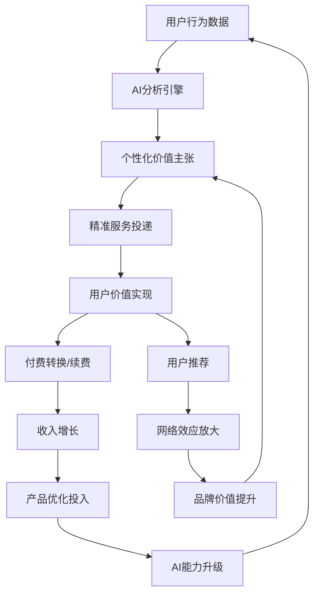

# 价值转换与商业闭环

## 概述

智链平台通过构建完整的价值转换体系，将用户从初次接触到深度合作的每个环节都转化为可衡量的商业价值，形成自强化的商业闭环，实现平台、用户、生态伙伴的多方共赢。

## 价值转换模型

### 核心价值转换引擎
```typescript
interface ValueConversionEngine {
  // 价值识别层
  valueIdentification: {
    userPainPointAnalysis: PainPoint[];           // 用户痛点分析
    businessOpportunityMapping: Opportunity[];    // 商业机会映射
    solutionValueQuantification: ValueMetrics;    // 解决方案价值量化
    competitiveAdvantageAssessment: CompetitiveValue; // 竞争优势评估
  };
  
  // 价值创造层
  valueCreation: {
    aiCapabilityDeployment: CapabilityDeployment; // AI能力部署
    customSolutionGeneration: SolutionGeneration; // 定制解决方案生成
    knowledgeAssetLeveraging: KnowledgeAsset[];   // 知识资产利用
    expertiseAmplification: ExpertiseAmplifier;   // 专业能力放大
  };
  
  // 价值传递层
  valueDelivery: {
    personalizedExperienceDesign: ExperienceDesign; // 个性化体验设计
    progressiveValueRevelation: ValueRevelation;     // 渐进式价值揭示
    realTimeValueDemonstration: ValueDemo[];         // 实时价值演示
    outcomeBasedDelivery: OutcomeDelivery;          // 结果导向交付
  };
  
  // 价值货币化层
  valueMonetization: {
    dynamicPricingOptimization: PricingOptimization; // 动态定价优化
    valueBasedPricingModel: ValueBasedPricing;       // 价值驱动定价模型
    revenueOptimizationEngine: RevenueOptimization;  // 收入优化引擎
    profitMarginMaximization: ProfitMaximization;    // 利润率最大化
  };
}
```

### 多维价值转换矩阵

| 用户层级 | 价值输入 | 转换机制 | 价值输出 | 商业化路径 |
|---------|---------|---------|---------|-----------|
| **Level 0 观察者** | 注意力时间 | 内容展示 + 行为分析 | 意向识别 | 数据资产积累 |
| **Level 1 体验者** | 基础需求 | AI角色体验 + 解决方案演示 | 初步信任 | 免费增值转换 |
| **Level 2 合作者** | 具体项目 | 深度协作 + 定制方案 | 实际成果 | 订阅付费模式 |
| **Level 3 专家** | 战略合作 | 生态共建 + 价值共创 | 长期伙伴关系 | 高价值服务 |

## 分层级价值转换策略

### Level 0 → Level 1: 认知价值转换
```typescript
interface CognitiveValueConversion {
  // 价值展示策略
  valueShowcasing: {
    successStoryHighlights: SuccessStory[];       // 成功案例高亮
    realTimeValueDemonstration: LiveDemo[];       // 实时价值演示
    industryBenchmarkComparison: Benchmark[];     // 行业基准对比
    potentialROICalculation: ROICalculator;       // 潜在ROI计算
  };
  
  // 信任建立机制
  trustBuildingMechanisms: {
    expertCredentialDisplay: ExpertCredential[];  // 专家资质展示
    clientTestimonialShowcase: Testimonial[];     // 客户推荐展示
    securityComplianceBadges: ComplianceBadge[];  // 安全合规徽章
    transparencyDemonstration: TransparencyDemo; // 透明度演示
  };
  
  // 参与引导设计
  engagementGuidance: {
    interactiveOnboarding: OnboardingFlow;        // 交互式入驻流程
    gamifiedExploration: GamificationElement[];   // 游戏化探索
    progressiveDisclosure: DisclosureStrategy;    // 渐进式信息披露
    socialProofIntegration: SocialProof[];        // 社会证明集成
  };
  
  // 转换优化
  conversionOptimization: {
    exitIntentIntervention: ExitIntervention;     // 退出意图干预
    personalizedValueProposition: ValueProp;      // 个性化价值主张
    frictionReductionMeasures: FrictionReduction; // 摩擦减少措施
    urgencyCreationTechniques: UrgencyTechnique[]; // 紧迫感创造技术
  };
}
```

### Level 1 → Level 2: 体验价值转换
```typescript
interface ExperienceValueConversion {
  // 价值实现加速
  valueRealizationAcceleration: {
    quickWinIdentification: QuickWin[];           // 快速胜利识别
    immediateValueDelivery: ImmediateValue[];     // 即时价值交付
    progressTrackingVisualization: ProgressViz;  // 进度跟踪可视化
    milestoneAchievementRecognition: Milestone[]; // 里程碑成就认可
  };
  
  // 深度参与促进
  deepEngagementPromotion: {
    complexProblemSolvingOpportunity: ComplexProblem[]; // 复杂问题解决机会
    collaborativeWorkflowIntroduction: CollabWorkflow; // 协作工作流介绍
    advancedFeatureGradualUnlock: FeatureUnlock[];      // 高级功能逐步解锁
    expertConsultationAccessProvision: ExpertAccess;   // 专家咨询访问提供
  };
  
  // 付费价值证明
  paymentValueJustification: {
    freemiumLimitationDemonstration: LimitationDemo;   // 免费版限制演示
    premiumFeatureBenefitShowcase: PremiumBenefit[];   // 高级功能优势展示
    costSavingCalculation: CostSavingCalc;             // 成本节约计算
    timeValueOptimizationProof: TimeValueProof;       // 时间价值优化证明
  };
  
  // 支付摩擦消除
  paymentFrictionElimination: {
    flexiblePaymentOptions: PaymentOption[];          // 灵活支付选项
    riskFreeTrialPeriod: TrialPeriod;                 // 无风险试用期
    moneyBackGuarantee: Guarantee;                    // 退款保证
    incrementalCommitmentPath: CommitmentPath;        // 递增承诺路径
  };
}
```

### Level 2 → Level 3: 战略价值转换
```typescript
interface StrategicValueConversion {
  // 战略合作价值创造
  strategicPartnershipValueCreation: {
    businessTransformationOpportunity: TransformationOpp; // 业务转型机会
    competitiveAdvantageGeneration: CompetitiveAdvantage;  // 竞争优势生成
    marketExpansionPossibility: MarketExpansion;          // 市场扩张可能
    innovationCapabilityEnhancement: InnovationEnhancement; // 创新能力增强
  };
  
  // 生态价值整合
  ecosystemValueIntegration: {
    partnerNetworkAccess: PartnerNetwork;                 // 合作伙伴网络访问
    knowledgeExchangePlatform: KnowledgeExchange;         // 知识交换平台
    collaborativeInnovationProjects: InnovationProject[]; // 协作创新项目
    industryInfluenceOpportunity: InfluenceOpportunity;   // 行业影响机会
  };
  
  // 长期价值共创
  longTermValueCoCreation: {
    jointProductDevelopment: JointDevelopment;            // 联合产品开发
    sharedRevenueModel: SharedRevenue;                    // 共享收入模式
    intellectualPropertyCollaboration: IPCollaboration;  // 知识产权协作
    marketLeadershipBuilding: LeadershipBuilding;        // 市场领导力建设
  };
}
```

## 商业闭环机制

### 数据驱动的价值闭环


### 多方价值闭环生态
```typescript
interface MultiStakeholderValueEcosystem {
  // 用户价值闭环
  userValueLoop: {
    problemSolving: ProblemSolution;              // 问题解决
    skillEnhancement: SkillUpgrade;               // 技能提升
    efficiencyImprovement: EfficiencyGain;       // 效率改进
    businessGrowth: BusinessGrowth;              // 业务增长
    networkExpansion: NetworkExpansion;          // 网络扩展
  };
  
  // 平台价值闭环
  platformValueLoop: {
    userAcquisition: UserAcquisition;            // 用户获取
    revenueGeneration: RevenueGeneration;        // 收入生成
    dataAssetAccumulation: DataAsset;           // 数据资产积累
    aiCapabilityEnhancement: AIEnhancement;     // AI能力增强
    competitiveAdvantageStrengthening: CompetitiveAdvantage; // 竞争优势强化
  };
  
  // 生态伙伴价值闭环
  partnerValueLoop: {
    marketAccessExpansion: MarketAccess;         // 市场准入扩张
    capabilityComplementation: CapabilityComp;  // 能力互补
    revenueSharing: RevenueShare;               // 收入共享
    brandAssociation: BrandAssociation;         // 品牌关联
    innovationCollaboration: InnovationCollab; // 创新协作
  };
  
  // 社会价值闭环
  societalValueLoop: {
    knowledgeDemocratization: KnowledgeDemo;    // 知识民主化
    innovationAcceleration: InnovationAccel;   // 创新加速
    economicEfficiencyImprovement: EconomicEfficiency; // 经济效率改进
    digitalTransformationFacilitation: DigitalTransformation; // 数字化转型促进
    skillGapReduction: SkillGapReduction;       // 技能差距减少
  };
}
```

## 收入模型优化

### 多元化收入流
```typescript
interface DiversifiedRevenueStreams {
  // 订阅收入模型
  subscriptionRevenue: {
    freemiumToBasic: SubscriptionTier;          // 免费增值到基础版
    basicToPremium: SubscriptionTier;           // 基础版到高级版
    premiumToEnterprise: SubscriptionTier;      // 高级版到企业版
    enterpriseToCustom: SubscriptionTier;       // 企业版到定制版
  };
  
  // 服务收入模型
  serviceRevenue: {
    consultingServices: ConsultingRevenue;      // 咨询服务
    implementationServices: ImplementationRevenue; // 实施服务
    trainingServices: TrainingRevenue;          // 培训服务
    maintenanceServices: MaintenanceRevenue;    // 维护服务
  };
  
  // 平台收入模型
  platformRevenue: {
    transactionCommission: CommissionRevenue;   // 交易佣金
    partnerReferralFees: ReferralRevenue;      // 合作伙伴推荐费
    dataLicensingRevenue: DataLicensingRevenue; // 数据许可收入
    whitelabelLicensing: WhitelabelRevenue;    // 白标许可
  };
  
  // 创新收入模型
  innovativeRevenue: {
    successBasedPricing: SuccessBasedRevenue;   // 成功导向定价
    valueShareModel: ValueShareRevenue;        // 价值分享模式
    intellectualPropertyLicensing: IPRevenue;  // 知识产权许可
    ecosystemOrchestrationFees: OrchestrationRevenue; // 生态编排费用
  };
}
```

### 动态定价策略
```typescript
interface DynamicPricingStrategy {
  // 价值基础定价
  valueBasedPricing: {
    customerValueMetrics: ValueMetrics;         // 客户价值指标
    willingsToPayAnalysis: WillingnessAnalysis; // 支付意愿分析
    competitiveValuePosition: ValuePosition;   // 竞争价值定位
    priceElasticityModeling: ElasticityModel;  // 价格弹性建模
  };
  
  // 细分市场定价
  segmentedPricing: {
    industrySpecificPricing: IndustryPricing[]; // 行业特定定价
    companyScalePricing: ScalePricing[];        // 公司规模定价
    geographicPricing: GeoPricing[];            // 地理定价
    usagePatterBasedPricing: UsagePricing[];    // 使用模式定价
  };
  
  // 时间敏感定价
  timeSensitivePricing: {
    launchPromotionPricing: PromoPricing;       // 发布促销定价
    seasonalPricingAdjustment: SeasonalPricing; // 季节性定价调整
    demandBasedPricing: DemandPricing;          // 需求基础定价
    lifecyclePricing: LifecyclePricing;         // 生命周期定价
  };
  
  // 个性化定价
  personalizedPricing: {
    behaviorBasedPricing: BehaviorPricing;      // 行为基础定价
    relationshipValuePricing: RelationshipPricing; // 关系价值定价
    potentialValuePricing: PotentialPricing;    // 潜力价值定价
    loyaltyRewardPricing: LoyaltyPricing;       // 忠诚度奖励定价
  };
}
```

## 客户生命周期价值最大化

### 价值最大化策略矩阵
```typescript
interface CLVMaximizationMatrix {
  // 获取阶段优化
  acquisitionOptimization: {
    targetCustomerProfiling: CustomerProfile;   // 目标客户画像
    acquisitionCostOptimization: CostOptimization; // 获取成本优化
    conversionRateImprovement: ConversionImprovement; // 转化率改进
    qualityScoreEnhancement: QualityEnhancement; // 质量评分增强
  };
  
  // 激活阶段优化
  activationOptimization: {
    onboardingExperienceDesign: OnboardingDesign; // 入驻体验设计
    timeToValueReduction: TimeToValueReduction;   // 价值实现时间缩短
    featureAdoptionAcceleration: FeatureAdoption; // 功能采用加速
    earlySuccessCreation: EarlySuccess;           // 早期成功创造
  };
  
  // 留存阶段优化
  retentionOptimization: {
    churnPredictionAndPrevention: ChurnPrevention; // 流失预测与预防
    engagementMaintenanceStrategy: EngagementStrategy; // 参与维护策略
    valueRealizationContinuation: ValueContinuation; // 价值实现延续
    relationshipDeepening: RelationshipDeepening; // 关系深化
  };
  
  // 扩展阶段优化
  expansionOptimization: {
    upsellOpportunityIdentification: UpsellOpportunity; // 追加销售机会识别
    crossSellStrategyExecution: CrossSellStrategy;      // 交叉销售策略执行
    usageBoundaryExpansion: UsageExpansion;            // 使用边界扩展
    newUseCaseExploration: UseCaseExploration;         // 新用例探索
  };
  
  // 倡导阶段优化
  advocacyOptimization: {
    referralProgramDesign: ReferralProgram;            // 推荐计划设计
    caseStudyDevelopment: CaseStudyDevelopment;        // 案例研究开发
    thoughtLeadershipPositioning: ThoughtLeadership;  // 思想领导力定位
    communityBuildingFacilitation: CommunityBuilding; // 社区建设促进
  };
}
```

## 价值衡量与优化

### 关键价值指标体系
```typescript
interface ValueMetricsFramework {
  // 用户价值指标
  userValueMetrics: {
    problemResolutionRate: number;              // 问题解决率
    timeToResolutionReduction: number;          // 解决时间缩短
    decisionQualityImprovement: number;         // 决策质量改进
    productivityGainMeasurement: number;        // 生产力获得衡量
    costSavingRealization: number;              // 成本节约实现
  };
  
  // 商业价值指标
  businessValueMetrics: {
    revenuePerUser: number;                     // 每用户收入
    customerLifetimeValue: number;              // 客户生命周期价值
    paybackPeriod: number;                      // 回收期
    netPromotionScore: number;                  // 净推荐值
    marketShareGrowth: number;                  // 市场份额增长
  };
  
  // 平台价值指标
  platformValueMetrics: {
    networkEffectStrength: number;              // 网络效应强度
    dataAssetValueGrowth: number;               // 数据资产价值增长
    ecosystemHealthScore: number;               // 生态系统健康评分
    innovationCapabilityIndex: number;          // 创新能力指数
    competitiveMoatStrength: number;            // 竞争护城河强度
  };
  
  // 社会价值指标
  societalValueMetrics: {
    knowledgeAccessibilityImprovement: number;  // 知识可及性改进
    skillDevelopmentFacilitation: number;       // 技能发展促进
    innovationAccelerationMeasurement: number;  // 创新加速衡量
    economicEfficiencyContribution: number;     // 经济效率贡献
    sustainabilityImpactAssessment: number;     // 可持续性影响评估
  };
}
```

### 持续优化机制
1. **实时监控** → 价值指标仪表板 → 异常预警 → 快速响应
2. **定期分析** → 趋势分析 → 瓶颈识别 → 优化策略制定
3. **A/B测试** → 假设验证 → 效果评估 → 最佳实践固化
4. **用户反馈** → 质性分析 → 量化验证 → 产品迭代

---

*此文档定义了智链平台完整的价值转换与商业闭环体系，为实现可持续的商业成功提供战略指导。*