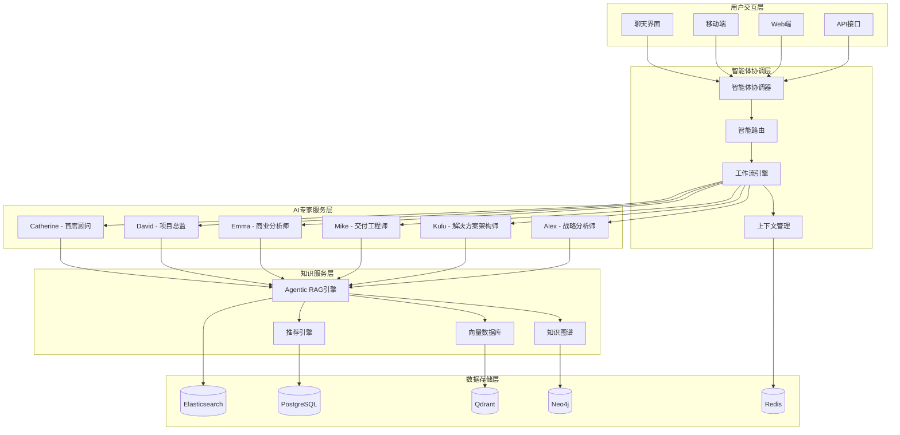

# 聊天中心技术架构

**版本**: 1.5.0 | **日期**: 2025年8月12日 | **状态**: 1.5阶段完整技术架构
**基于**: 渐进式交互设计 + 六角色智能分配 + Cloudsway视觉系统

---

## 摘要：聊天为中心的AI能力平台

智链平台1.5阶段完全围绕聊天界面构建，实现"所有主动和被动信息都围绕聊天界面展开"的核心理念。通过现代化技术栈支撑六个AI角色的智能协作，为用户提供Level 0-3的渐进式交互体验。

**核心理念**: Everything flows through Chat - 聊天即平台，聊天即智能，聊天即价值

---

## 第一部分：总体架构设计

### 1.1 系统架构概览



### 1.2 核心技术栈

```python
class ZhilianTechStack:
    def __init__(self):
        # 编程语言和框架
        self.languages_frameworks = {
            'backend': {
                'primary': 'Python 3.11+',
                'web_framework': 'FastAPI',
                'async_framework': 'asyncio + uvloop',
                'ai_framework': 'LangGraph + LangChain',
                'agent_framework': 'CrewAI'
            },
            'frontend': {
                'framework': 'Next.js 14',
                'language': 'TypeScript',
                'ui_library': 'React 18',
                'state_management': 'Zustand',
                'styling': 'Tailwind CSS + shadcn/ui'
            }
        }
        
        # 核心AI和数据技术
        self.ai_data_stack = {
            'llm_models': {
                'primary': 'GPT-4-Turbo 或 Claude-3.5-Sonnet',
                'embedding': 'text-embedding-ada-002',
                'specialized': '基于角色的fine-tuned模型'
            },
            'vector_database': 'Qdrant',
            'graph_database': 'Neo4j',
            'search_engine': 'Elasticsearch',
            'cache': 'Redis',
            'relational_db': 'PostgreSQL',
            'message_queue': 'Apache Kafka'
        }
        
        # 基础设施和运维
        self.infrastructure = {
            'containerization': 'Docker + Kubernetes',
            'cloud_provider': 'AWS / Azure / Google Cloud',
            'monitoring': 'Prometheus + Grafana',
            'logging': 'ELK Stack',
            'ci_cd': 'GitHub Actions',
            'security': 'HashiCorp Vault'
        }
```

---

## 第二部分：Agentic RAG核心引擎

### 2.1 Agentic RAG架构设计

```python
class AgenticRAGEngine:
    def __init__(self):
        # 多智能体检索系统
        self.retrieval_agents = {
            'query_analyzer': QueryAnalysisAgent(),
            'document_grader': DocumentGradingAgent(),
            'context_ranker': ContextRankingAgent(),
            'answer_validator': AnswerValidationAgent(),
            'web_searcher': WebSearchAgent()
        }
        
        # 检索策略配置
        self.retrieval_strategies = {
            'alex_strategy': {
                'primary': 'business_case_similarity_search',
                'secondary': 'industry_trend_search',
                'fallback': 'general_business_knowledge_search',
                'validation': 'strategic_framework_validation'
            },
            'kulu_strategy': {
                'primary': 'technical_solution_matching',
                'secondary': 'architecture_pattern_search',
                'fallback': 'technology_specification_search',
                'validation': 'technical_feasibility_validation'
            },
            'mike_strategy': {
                'primary': 'implementation_case_search',
                'secondary': 'best_practice_retrieval',
                'fallback': 'risk_mitigation_search',
                'validation': 'deliverability_assessment'
            },
            'emma_strategy': {
                'primary': 'market_data_analysis',
                'secondary': 'competitive_intelligence_search',
                'fallback': 'industry_benchmark_search', 
                'validation': 'data_accuracy_verification'
            },
            'david_strategy': {
                'primary': 'project_template_matching',
                'secondary': 'resource_planning_search',
                'fallback': 'management_best_practice_search',
                'validation': 'project_feasibility_check'
            },
            'catherine_strategy': {
                'primary': 'strategic_framework_search',
                'secondary': 'executive_insight_search',
                'fallback': 'industry_expert_opinion_search',
                'validation': 'strategic_alignment_verification'
            }
        }
        
        # 工作流编排
        self.workflow_patterns = {
            'simple_retrieval': self._simple_retrieval_workflow,
            'multi_source_fusion': self._multi_source_fusion_workflow,
            'iterative_refinement': self._iterative_refinement_workflow,
            'cross_agent_validation': self._cross_agent_validation_workflow
        }
    
    async def process_query(self, query: str, agent_context: AgentContext) -> RAGResult:
        # 1. 查询分析和意图识别
        analyzed_query = await self.retrieval_agents['query_analyzer'].analyze(
            query, agent_context
        )
        
        # 2. 选择检索策略
        strategy = self.retrieval_strategies[agent_context.agent_role]
        
        # 3. 多源并行检索
        retrieval_tasks = [
            self._retrieve_from_vector_store(analyzed_query, strategy['primary']),
            self._retrieve_from_knowledge_graph(analyzed_query, strategy['secondary']),
            self._retrieve_from_external_sources(analyzed_query, strategy['fallback'])
        ]
        
        raw_results = await asyncio.gather(*retrieval_tasks)
        
        # 4. 文档相关性评分和过滤
        graded_results = await self.retrieval_agents['document_grader'].grade_documents(
            raw_results, analyzed_query
        )
        
        # 5. 上下文排序和整合
        ranked_context = await self.retrieval_agents['context_ranker'].rank_and_integrate(
            graded_results, agent_context
        )
        
        # 6. 答案生成和验证
        generated_answer = await self._generate_answer(ranked_context, analyzed_query)
        validated_answer = await self.retrieval_agents['answer_validator'].validate(
            generated_answer, ranked_context
        )
        
        return RAGResult(
            answer=validated_answer,
            context=ranked_context,
            confidence_score=self._calculate_confidence(validated_answer),
            sources=self._extract_sources(ranked_context)
        )
```

### 2.2 知识图谱整合

```python
class KnowledgeGraphIntegration:
    def __init__(self):
        # 企业知识图谱结构
        self.graph_schema = {
            'entities': {
                'Project': ['name', 'budget', 'timeline', 'complexity', 'industry'],
                'Supplier': ['name', 'capabilities', 'rating', 'location', 'size'],
                'Technology': ['name', 'category', 'maturity', 'compatibility'],
                'Client': ['name', 'industry', 'size', 'requirements'],
                'Solution': ['name', 'components', 'benefits', 'costs'],
                'UseCase': ['scenario', 'requirements', 'outcomes']
            },
            
            'relationships': {
                'PROJECT_REQUIRES_TECHNOLOGY': '项目需要技术',
                'SUPPLIER_PROVIDES_SOLUTION': '供应商提供解决方案',
                'TECHNOLOGY_INTEGRATES_WITH': '技术集成关系',
                'CLIENT_PREFERS_SUPPLIER': '客户偏好供应商',
                'SOLUTION_SOLVES_USECASE': '解决方案解决用例',
                'PROJECT_SIMILAR_TO': '项目相似性关系'
            }
        }
        
        # 图谱查询优化
        self.query_optimization = {
            'path_finding': 'shortest_path_with_semantic_weights',
            'subgraph_extraction': 'relevant_neighborhood_extraction',
            'graph_embeddings': 'node2vec_with_domain_knowledge',
            'reasoning_chains': 'multi_hop_reasoning_with_confidence'
        }
    
    async def graph_enhanced_retrieval(self, query: str, agent_role: str) -> GraphContext:
        # 实体识别和链接
        entities = await self._extract_and_link_entities(query)
        
        # 相关子图提取
        relevant_subgraph = await self._extract_relevant_subgraph(entities, agent_role)
        
        # 推理路径发现
        reasoning_paths = await self._discover_reasoning_paths(relevant_subgraph, query)
        
        # 图谱驱动的上下文生成
        graph_context = await self._generate_graph_context(reasoning_paths)
        
        return GraphContext(
            entities=entities,
            subgraph=relevant_subgraph,
            reasoning_paths=reasoning_paths,
            context=graph_context
        )
```

### 2.3 推荐引擎架构

```python
class AdvancedRecommendationEngine:
    def __init__(self):
        # 多维度推荐算法
        self.recommendation_models = {
            'capability_matching': {
                'algorithm': 'GraphSAGE + Knowledge Graph Embedding',
                'features': ['technical_specs', 'domain_expertise', 'past_performance'],
                'weight': 0.35
            },
            'experience_similarity': {
                'algorithm': 'Collaborative Filtering with Deep Learning',
                'features': ['project_similarity', 'client_feedback', 'success_metrics'],
                'weight': 0.25
            },
            'contextual_relevance': {
                'algorithm': 'Transformer-based Context Matching',
                'features': ['industry_fit', 'project_complexity', 'timeline_match'],
                'weight': 0.25
            },
            'strategic_alignment': {
                'algorithm': 'Multi-Criteria Decision Analysis + AI',
                'features': ['long_term_value', 'innovation_potential', 'risk_profile'],
                'weight': 0.15
            }
        }
        
        # 实时学习机制
        self.learning_system = {
            'online_learning': 'continuous_model_update',
            'feedback_integration': 'user_preference_adaptation',
            'cold_start_handling': 'content_based_initialization',
            'explanation_generation': 'interpretable_recommendation_paths'
        }
    
    async def generate_recommendations(
        self, 
        requirements: Requirements, 
        context: UserContext
    ) -> RecommendationResults:
        
        # 并行计算多个维度的匹配分数
        matching_scores = await asyncio.gather(
            self._compute_capability_matching(requirements),
            self._compute_experience_similarity(requirements, context),
            self._compute_contextual_relevance(requirements, context),
            self._compute_strategic_alignment(requirements, context)
        )
        
        # 加权融合推荐分数
        final_scores = self._fuse_recommendation_scores(
            matching_scores, self.recommendation_models
        )
        
        # 生成推荐解释
        explanations = await self._generate_explanations(
            final_scores, requirements, context
        )
        
        # 多样性和新颖性优化
        diversified_recommendations = self._optimize_diversity_novelty(
            final_scores, context.user_history
        )
        
        return RecommendationResults(
            recommendations=diversified_recommendations,
            explanations=explanations,
            confidence_scores=self._calculate_confidence_scores(final_scores),
            alternative_options=self._generate_alternatives(final_scores)
        )
```

---

## 第三部分：多智能体协作系统

### 3.1 智能体协调架构

```python
class AgentOrchestrationSystem:
    def __init__(self):
        # 智能体定义
        self.agents = {
            'alex': StrategicAnalystAgent(
                specialization=['business_analysis', 'requirement_engineering', 'strategic_planning'],
                tools=['swot_analysis', 'stakeholder_mapping', 'requirement_prioritization'],
                personality='analytical_professional_insightful'
            ),
            'kulu': SolutionArchitectAgent(
                specialization=['technical_architecture', 'solution_design', 'technology_evaluation'],
                tools=['architecture_design', 'tech_stack_analysis', 'integration_planning'],
                personality='technical_precise_innovative'
            ),
            'mike': DeliveryEngineerAgent(
                specialization=['project_implementation', 'risk_assessment', 'quality_assurance'],
                tools=['project_planning', 'risk_matrix', 'quality_checklist'],
                personality='practical_reliable_detail_oriented'
            ),
            'emma': BusinessAnalystAgent(
                specialization=['data_analysis', 'market_research', 'roi_calculation'],
                tools=['data_visualization', 'market_analysis', 'financial_modeling'],
                personality='data_driven_insightful_objective'
            ),
            'david': ProjectDirectorAgent(
                specialization=['project_management', 'resource_coordination', 'stakeholder_management'],
                tools=['project_coordination', 'resource_allocation', 'timeline_management'],
                personality='leadership_organized_communicative'
            ),
            'catherine': ChiefConsultantAgent(
                specialization=['strategic_consulting', 'executive_advisory', 'complex_problem_solving'],
                tools=['strategic_framework', 'executive_briefing', 'decision_analysis'],
                personality='authoritative_strategic_wise'
            )
        }
        
        # 协作模式定义
        self.collaboration_patterns = {
            'sequential_handoff': SequentialCollaborationPattern(),
            'parallel_analysis': ParallelCollaborationPattern(),
            'hierarchical_escalation': HierarchicalCollaborationPattern(),
            'dynamic_coordination': DynamicCollaborationPattern()
        }
        
        # 决策权重和优先级
        self.decision_hierarchy = {
            'catherine': {'authority_level': 5, 'veto_power': True, 'domains': 'all'},
            'david': {'authority_level': 4, 'veto_power': False, 'domains': 'coordination'},
            'specialists': {
                'alex': {'authority_level': 3, 'domains': 'business_strategy'},
                'kulu': {'authority_level': 3, 'domains': 'technical_architecture'},
                'mike': {'authority_level': 3, 'domains': 'implementation'},
                'emma': {'authority_level': 3, 'domains': 'business_intelligence'}
            }
        }
    
    async def orchestrate_collaboration(
        self, 
        query: str, 
        context: ConversationContext
    ) -> CollaborationResult:
        
        # 1. 复杂度分析和协作模式选择
        complexity_analysis = await self._analyze_query_complexity(query, context)
        collaboration_pattern = self._select_collaboration_pattern(complexity_analysis)
        
        # 2. 智能体选择和任务分配
        selected_agents = self._select_agents(complexity_analysis, collaboration_pattern)
        task_assignments = self._distribute_tasks(query, selected_agents, context)
        
        # 3. 并发或顺序执行
        if collaboration_pattern.name == 'parallel_analysis':
            agent_responses = await self._execute_parallel_collaboration(
                task_assignments, context
            )
        elif collaboration_pattern.name == 'sequential_handoff':
            agent_responses = await self._execute_sequential_collaboration(
                task_assignments, context
            )
        else:
            agent_responses = await self._execute_dynamic_collaboration(
                task_assignments, context
            )
        
        # 4. 响应整合和冲突解决
        integrated_response = await self._integrate_agent_responses(
            agent_responses, collaboration_pattern, context
        )
        
        # 5. 质量验证和最终优化
        final_response = await self._validate_and_optimize_response(
            integrated_response, query, context
        )
        
        return CollaborationResult(
            primary_response=final_response,
            agent_contributions=agent_responses,
            collaboration_metadata=self._generate_collaboration_metadata(
                collaboration_pattern, selected_agents, task_assignments
            )
        )
```

### 3.2 冲突解决和共识建立

```python
class ConflictResolutionSystem:
    def __init__(self):
        # 冲突类型识别
        self.conflict_types = {
            'opinion_disagreement': 'agents_provide_different_recommendations',
            'scope_overlap': 'agents_address_same_aspect_differently',
            'priority_conflict': 'agents_prioritize_different_aspects',
            'resource_competition': 'agents_compete_for_limited_resources'
        }
        
        # 解决策略
        self.resolution_strategies = {
            'authority_based': self._resolve_by_authority,
            'consensus_building': self._build_consensus,
            'evidence_weighted': self._resolve_by_evidence,
            'user_preference': self._resolve_by_user_preference,
            'hybrid_approach': self._hybrid_resolution
        }
    
    async def resolve_conflicts(
        self, 
        conflicting_responses: List[AgentResponse],
        context: ConversationContext
    ) -> ResolvedResponse:
        
        # 1. 冲突检测和分类
        conflicts = self._detect_conflicts(conflicting_responses)
        conflict_types = self._classify_conflicts(conflicts)
        
        # 2. 选择解决策略
        resolution_strategies = []
        for conflict_type in conflict_types:
            strategy = self._select_resolution_strategy(conflict_type, context)
            resolution_strategies.append(strategy)
        
        # 3. 执行冲突解决
        resolved_elements = []
        for conflict, strategy in zip(conflicts, resolution_strategies):
            resolved_element = await strategy(conflict, conflicting_responses, context)
            resolved_elements.append(resolved_element)
        
        # 4. 整合解决方案
        final_resolution = self._integrate_resolutions(
            resolved_elements, conflicting_responses
        )
        
        # 5. 生成解决说明
        resolution_explanation = self._generate_resolution_explanation(
            conflicts, resolution_strategies, final_resolution
        )
        
        return ResolvedResponse(
            resolved_content=final_resolution,
            resolution_explanation=resolution_explanation,
            confidence_score=self._calculate_resolution_confidence(final_resolution),
            alternative_viewpoints=self._preserve_alternative_viewpoints(conflicting_responses)
        )
```

### 3.3 上下文管理和记忆系统

```python
class ContextMemorySystem:
    def __init__(self):
        # 多层次记忆架构
        self.memory_layers = {
            'working_memory': {
                'scope': 'current_conversation',
                'duration': 'session_based',
                'storage': 'redis_cache',
                'capacity': 'unlimited'
            },
            'episodic_memory': {
                'scope': 'user_interaction_history',
                'duration': 'persistent',
                'storage': 'postgresql_with_vector_index',
                'capacity': 'last_100_conversations'
            },
            'semantic_memory': {
                'scope': 'learned_user_preferences_and_patterns',
                'duration': 'long_term',
                'storage': 'knowledge_graph_integration',
                'capacity': 'profile_based'
            },
            'procedural_memory': {
                'scope': 'agent_collaboration_patterns_and_optimizations',
                'duration': 'continuous_learning',
                'storage': 'model_weights_and_rules',
                'capacity': 'algorithm_based'
            }
        }
        
        # 上下文传递机制
        self.context_passing = {
            'intra_agent': 'within_single_agent_processing',
            'inter_agent': 'between_different_agents',
            'cross_session': 'across_conversation_sessions',
            'global_context': 'platform_wide_shared_context'
        }
    
    async def manage_conversation_context(
        self, 
        current_message: str,
        conversation_history: ConversationHistory,
        user_profile: UserProfile
    ) -> EnhancedContext:
        
        # 1. 当前对话上下文构建
        working_context = await self._build_working_context(
            current_message, conversation_history
        )
        
        # 2. 历史交互上下文检索
        episodic_context = await self._retrieve_episodic_context(
            current_message, user_profile
        )
        
        # 3. 用户偏好和模式上下文
        semantic_context = await self._build_semantic_context(
            user_profile, working_context
        )
        
        # 4. 智能体协作经验上下文
        procedural_context = await self._retrieve_procedural_context(
            working_context, conversation_history
        )
        
        # 5. 多层次上下文整合
        enhanced_context = self._integrate_context_layers(
            working_context, episodic_context, semantic_context, procedural_context
        )
        
        # 6. 上下文压缩和优化
        optimized_context = await self._optimize_context_for_agents(
            enhanced_context, current_message
        )
        
        return EnhancedContext(
            working_memory=working_context,
            episodic_memory=episodic_context,
            semantic_memory=semantic_context,
            procedural_memory=procedural_context,
            integrated_context=optimized_context
        )
```

---

## 第四部分：数据架构和存储系统

### 4.1 多模态数据存储架构

```python
class MultiModalDataArchitecture:
    def __init__(self):
        # 存储层分级
        self.storage_tiers = {
            'hot_tier': {
                'technology': 'Redis Cluster',
                'purpose': 'real_time_cache_and_session_data',
                'latency': '<1ms',
                'capacity': '100GB',
                'data_types': ['user_sessions', 'active_conversations', 'real_time_recommendations']
            },
            'warm_tier': {
                'technology': 'Qdrant + Elasticsearch',
                'purpose': 'vector_search_and_full_text_search',
                'latency': '<50ms',
                'capacity': '1TB',
                'data_types': ['document_embeddings', 'semantic_search', 'log_analysis']
            },
            'cold_tier': {
                'technology': 'PostgreSQL + Neo4j',
                'purpose': 'structured_data_and_knowledge_graph',
                'latency': '<500ms',
                'capacity': '10TB',
                'data_types': ['user_profiles', 'business_entities', 'relationship_graphs']
            },
            'archive_tier': {
                'technology': 'AWS S3 / Azure Blob',
                'purpose': 'long_term_storage_and_backup',
                'latency': '<5s',
                'capacity': 'unlimited',
                'data_types': ['historical_conversations', 'document_archives', 'model_checkpoints']
            }
        }
        
        # 数据同步策略
        self.sync_strategies = {
            'real_time_sync': {
                'trigger': 'critical_business_data_changes',
                'method': 'event_driven_kafka_streams',
                'consistency': 'strong_consistency'
            },
            'near_real_time_sync': {
                'trigger': 'user_preference_updates',
                'method': 'change_data_capture_cdc',
                'consistency': 'eventual_consistency'
            },
            'batch_sync': {
                'trigger': 'scheduled_daily_updates',
                'method': 'etl_pipeline_with_airflow',
                'consistency': 'eventual_consistency'
            }
        }
```

### 4.2 知识图谱数据模型

```python
class KnowledgeGraphDataModel:
    def __init__(self):
        # 核心实体模型
        self.entity_models = {
            'Project': {
                'properties': {
                    'id': 'UUID',
                    'name': 'String',
                    'description': 'Text',
                    'budget': 'Float',
                    'timeline': 'Duration',
                    'complexity_score': 'Float',
                    'industry': 'String',
                    'status': 'Enum[planning, active, completed, cancelled]',
                    'created_at': 'DateTime',
                    'updated_at': 'DateTime'
                },
                'indices': ['industry', 'complexity_score', 'budget_range']
            },
            
            'Supplier': {
                'properties': {
                    'id': 'UUID',
                    'name': 'String',
                    'description': 'Text',
                    'capabilities': 'List[String]',
                    'rating': 'Float',
                    'location': 'GeoLocation',
                    'size': 'Enum[startup, small, medium, large, enterprise]',
                    'specialization': 'List[String]',
                    'contact_info': 'JSON',
                    'certification': 'List[String]',
                    'created_at': 'DateTime'
                },
                'indices': ['capabilities', 'rating', 'location', 'specialization']
            },
            
            'Technology': {
                'properties': {
                    'id': 'UUID',
                    'name': 'String',
                    'category': 'String',
                    'maturity_level': 'Enum[experimental, emerging, mature, legacy]',
                    'compatibility': 'JSON',
                    'licensing': 'String',
                    'documentation_url': 'URL',
                    'community_support': 'Float',
                    'last_updated': 'DateTime'
                },
                'indices': ['category', 'maturity_level', 'compatibility']
            }
        }
        
        # 关系模型定义
        self.relationship_models = {
            'PROJECT_REQUIRES_TECHNOLOGY': {
                'properties': {
                    'importance': 'Float',
                    'urgency': 'Float',
                    'alternative_options': 'List[String]',
                    'constraints': 'JSON'
                }
            },
            'SUPPLIER_PROVIDES_SOLUTION': {
                'properties': {
                    'solution_name': 'String',
                    'pricing_model': 'String',
                    'delivery_timeline': 'Duration',
                    'success_rate': 'Float',
                    'client_testimonials': 'List[String]'
                }
            },
            'SIMILAR_TO': {
                'properties': {
                    'similarity_score': 'Float',
                    'similarity_aspects': 'List[String]',
                    'calculated_at': 'DateTime'
                }
            }
        }
```

### 4.3 实时数据处理流水线

```python
class RealTimeDataPipeline:
    def __init__(self):
        # 数据摄取层
        self.data_ingestion = {
            'streaming_sources': {
                'user_interactions': 'kafka_topic_user_events',
                'external_apis': 'api_polling_and_webhooks',
                'file_uploads': 'minio_bucket_notifications',
                'web_scraping': 'scheduled_scrapy_jobs'
            },
            'batch_sources': {
                'database_snapshots': 'nightly_postgresql_dumps',
                'third_party_data': 'scheduled_api_bulk_downloads',
                'document_processing': 'batch_nlp_processing_jobs'
            }
        }
        
        # 数据处理层
        self.data_processing = {
            'stream_processing': {
                'framework': 'Apache Kafka Streams',
                'functions': [
                    'real_time_data_validation',
                    'schema_transformation',
                    'enrichment_with_reference_data',
                    'anomaly_detection',
                    'real_time_aggregation'
                ]
            },
            'batch_processing': {
                'framework': 'Apache Airflow + Spark',
                'functions': [
                    'data_quality_assessment',
                    'complex_analytics',
                    'machine_learning_training',
                    'historical_data_analysis',
                    'report_generation'
                ]
            }
        }
        
        # 数据输出层
        self.data_output = {
            'real_time_outputs': {
                'vector_database_updates': 'immediate_embedding_updates',
                'cache_invalidation': 'real_time_cache_refresh',
                'notification_triggers': 'event_driven_notifications'
            },
            'batch_outputs': {
                'knowledge_graph_updates': 'daily_graph_reconstruction',
                'ml_model_retraining': 'weekly_model_updates',
                'analytics_reports': 'scheduled_business_reports'
            }
        }
```

---

## 第五部分：系统性能和扩展性

### 5.1 性能优化策略

```python
class PerformanceOptimization:
    def __init__(self):
        # 响应时间优化
        self.latency_optimization = {
            'model_inference': {
                'techniques': [
                    'model_quantization',
                    'knowledge_distillation', 
                    'dynamic_batching',
                    'speculative_execution'
                ],
                'target': '<1s_for_simple_queries_<3s_for_complex_analysis'
            },
            'database_queries': {
                'techniques': [
                    'intelligent_indexing',
                    'query_result_caching',
                    'connection_pooling',
                    'read_replicas'
                ],
                'target': '<100ms_for_cached_<500ms_for_complex'
            },
            'network_optimization': {
                'techniques': [
                    'cdn_edge_caching',
                    'http2_multiplexing',
                    'compression_algorithms',
                    'connection_keepalive'
                ],
                'target': '<50ms_network_latency'
            }
        }
        
        # 吞吐量优化
        self.throughput_optimization = {
            'concurrent_processing': {
                'async_programming': 'asyncio_based_concurrency',
                'worker_pools': 'celery_distributed_task_queue',
                'load_balancing': 'nginx_with_least_connections',
                'horizontal_scaling': 'kubernetes_hpa_vpa'
            },
            'resource_utilization': {
                'cpu_optimization': 'process_affinity_numa_awareness',
                'memory_management': 'efficient_memory_pools',
                'gpu_acceleration': 'cuda_tensor_optimization',
                'disk_io_optimization': 'nvme_ssd_raid_configuration'
            }
        }
```

### 5.2 自动扩展架构

```python
class AutoScalingArchitecture:
    def __init__(self):
        # 扩展策略
        self.scaling_strategies = {
            'horizontal_pod_autoscaler': {
                'metrics': ['cpu_utilization', 'memory_utilization', 'custom_request_queue_length'],
                'thresholds': {
                    'scale_up': 'cpu_70%_or_memory_80%_or_queue_length_50',
                    'scale_down': 'cpu_30%_and_memory_40%_and_queue_length_10'
                },
                'constraints': {
                    'min_replicas': 2,
                    'max_replicas': 50,
                    'scale_up_cooldown': '2m',
                    'scale_down_cooldown': '5m'
                }
            },
            
            'vertical_pod_autoscaler': {
                'resources': ['cpu_requests', 'memory_requests', 'cpu_limits', 'memory_limits'],
                'update_policy': 'auto_with_pod_restart',
                'constraints': {
                    'min_cpu': '100m',
                    'max_cpu': '4',
                    'min_memory': '128Mi',
                    'max_memory': '8Gi'
                }
            },
            
            'cluster_autoscaler': {
                'node_groups': ['general_purpose', 'compute_optimized', 'memory_optimized', 'gpu_enabled'],
                'scaling_policies': {
                    'scale_up_trigger': 'pending_pods_for_10s',
                    'scale_down_trigger': 'node_utilization_below_50%_for_10m',
                    'max_nodes_per_group': 20
                }
            }
        }
        
        # 负载均衡策略
        self.load_balancing = {
            'api_gateway_level': {
                'algorithm': 'weighted_round_robin',
                'health_checks': 'http_get_health_endpoint_every_30s',
                'circuit_breaker': 'fail_fast_after_5_consecutive_failures',
                'retry_policy': '3_retries_with_exponential_backoff'
            },
            
            'service_mesh_level': {
                'technology': 'istio_envoy_proxy',
                'load_balancing': 'least_request_with_consistent_hashing',
                'traffic_splitting': 'canary_deployment_and_ab_testing',
                'security': 'mtls_encryption_and_rbac_authorization'
            }
        }
```

### 5.3 监控和可观测性

```python
class ObservabilitySystem:
    def __init__(self):
        # 监控指标体系
        self.monitoring_metrics = {
            'business_metrics': {
                'user_satisfaction': 'nps_score_csat_ratings',
                'conversation_completion_rate': 'successful_conversations_total_conversations',
                'recommendation_accuracy': 'accepted_recommendations_total_recommendations',
                'response_relevance': 'user_feedback_scores'
            },
            
            'technical_metrics': {
                'response_latency': 'p50_p95_p99_response_times',
                'throughput': 'requests_per_second_concurrent_users',
                'error_rates': 'http_errors_ai_model_failures',
                'resource_utilization': 'cpu_memory_disk_network_usage'
            },
            
            'ai_model_metrics': {
                'model_performance': 'inference_latency_accuracy_scores',
                'agent_collaboration': 'conflict_resolution_rate_consensus_time',
                'knowledge_retrieval': 'retrieval_precision_recall_f1_score',
                'learning_effectiveness': 'model_improvement_over_time'
            }
        }
        
        # 告警和事件响应
        self.alerting_system = {
            'critical_alerts': {
                'system_downtime': 'page_oncall_engineer_immediately',
                'high_error_rate': 'alert_if_error_rate_above_5%_for_2_minutes',
                'response_latency_spike': 'alert_if_p95_latency_above_5s_for_5_minutes',
                'ai_model_failure': 'alert_if_model_failure_rate_above_10%'
            },
            
            'warning_alerts': {
                'resource_pressure': 'notify_if_cpu_above_80%_for_10_minutes',
                'slow_queries': 'notify_if_db_query_time_above_1s',
                'user_satisfaction_drop': 'notify_if_nps_drops_below_70',
                'recommendation_accuracy_decline': 'notify_if_accuracy_drops_5%'
            }
        }
```

---

## 第六部分：安全和合规设计

### 6.1 企业级安全架构

```python
class EnterpriseSecurity:
    def __init__(self):
        # 数据保护策略
        self.data_protection = {
            'encryption_at_rest': {
                'database': 'aes_256_encryption_with_managed_keys',
                'file_storage': 's3_server_side_encryption_with_kms',
                'backup': 'encrypted_backup_with_separate_key_management'
            },
            'encryption_in_transit': {
                'client_server': 'tls_1_3_with_perfect_forward_secrecy',
                'inter_service': 'mtls_with_istio_service_mesh',
                'database_connections': 'ssl_encrypted_connections_only'
            },
            'encryption_in_processing': {
                'sensitive_data': 'homomorphic_encryption_for_computation',
                'model_inference': 'secure_enclave_trusted_execution_environment',
                'memory_protection': 'memory_encryption_and_isolation'
            }
        }
        
        # 访问控制系统
        self.access_control = {
            'authentication': {
                'enterprise_sso': 'saml_2_0_and_oauth_2_0_integration',
                'multi_factor_auth': 'totp_and_hardware_security_keys',
                'api_authentication': 'jwt_tokens_with_refresh_mechanism'
            },
            'authorization': {
                'role_based_access': 'rbac_with_fine_grained_permissions',
                'attribute_based_access': 'abac_for_dynamic_policy_evaluation',
                'principle_of_least_privilege': 'minimal_required_permissions_only'
            },
            'audit_and_compliance': {
                'activity_logging': 'comprehensive_audit_trail_all_actions',
                'compliance_reporting': 'automated_gdpr_hipaa_sox_compliance_reports',
                'data_lineage': 'complete_data_flow_tracking'
            }
        }
```

### 6.2 隐私保护机制

```python
class PrivacyProtection:
    def __init__(self):
        # 隐私保护技术
        self.privacy_techniques = {
            'data_minimization': {
                'collection_limitation': 'collect_only_necessary_data_for_service',
                'retention_policies': 'automatic_data_deletion_after_retention_period',
                'purpose_limitation': 'use_data_only_for_stated_purposes'
            },
            
            'anonymization': {
                'differential_privacy': 'add_statistical_noise_to_protect_individuals',
                'k_anonymity': 'ensure_k_individuals_share_same_attributes',
                'l_diversity': 'ensure_diversity_in_sensitive_attributes'
            },
            
            'user_consent_management': {
                'granular_consent': 'allow_users_to_consent_to_specific_data_uses',
                'consent_withdrawal': 'easy_mechanism_to_withdraw_consent',
                'consent_tracking': 'maintain_audit_trail_of_consent_decisions'
            }
        }
        
        # GDPR合规机制
        self.gdpr_compliance = {
            'data_subject_rights': {
                'right_to_access': 'provide_complete_data_export_within_30_days',
                'right_to_rectification': 'allow_users_to_correct_inaccurate_data',
                'right_to_erasure': 'delete_personal_data_upon_valid_request',
                'right_to_portability': 'export_data_in_machine_readable_format'
            },
            
            'privacy_by_design': {
                'default_privacy_settings': 'most_privacy_friendly_settings_by_default',
                'privacy_impact_assessment': 'conduct_pia_for_new_features',
                'data_protection_officer': 'designated_dpo_for_privacy_oversight'
            }
        }
```

---

## 第七部分：部署和运维策略

### 7.1 云原生部署架构

```yaml
# Kubernetes部署配置示例
apiVersion: apps/v1
kind: Deployment
metadata:
  name: zhilian-api-gateway
spec:
  replicas: 3
  selector:
    matchLabels:
      app: zhilian-api-gateway
  template:
    metadata:
      labels:
        app: zhilian-api-gateway
    spec:
      containers:
      - name: api-gateway
        image: zhilian/api-gateway:latest
        ports:
        - containerPort: 8080
        env:
        - name: REDIS_URL
          value: "redis://redis-service:6379"
        - name: DATABASE_URL
          valueFrom:
            secretKeyRef:
              name: db-secret
              key: database-url
        resources:
          requests:
            cpu: 500m
            memory: 1Gi
          limits:
            cpu: 2000m
            memory: 4Gi
        livenessProbe:
          httpGet:
            path: /health
            port: 8080
          initialDelaySeconds: 30
          periodSeconds: 10
        readinessProbe:
          httpGet:
            path: /ready
            port: 8080
          initialDelaySeconds: 5
          periodSeconds: 5
---
apiVersion: v1
kind: Service
metadata:
  name: zhilian-api-gateway-service
spec:
  selector:
    app: zhilian-api-gateway
  ports:
    - protocol: TCP
      port: 80
      targetPort: 8080
  type: LoadBalancer
```

### 7.2 CI/CD流水线

```python
class CICDPipeline:
    def __init__(self):
        # 持续集成阶段
        self.ci_stages = {
            'source_control': {
                'version_control': 'git_with_feature_branch_workflow',
                'code_review': 'pull_request_with_mandatory_reviews',
                'branch_protection': 'protect_main_branch_require_status_checks'
            },
            
            'build_and_test': {
                'automated_testing': [
                    'unit_tests_with_pytest',
                    'integration_tests_with_testcontainers',
                    'end_to_end_tests_with_playwright',
                    'performance_tests_with_locust'
                ],
                'code_quality': [
                    'linting_with_flake8_and_black',
                    'security_scanning_with_bandit',
                    'dependency_vulnerability_scanning',
                    'sonarqube_code_quality_analysis'
                ],
                'build_artifacts': 'docker_images_with_semantic_versioning'
            }
        }
        
        # 持续部署阶段
        self.cd_stages = {
            'deployment_environments': {
                'development': 'automatic_deployment_on_feature_branch_merge',
                'staging': 'automatic_deployment_on_main_branch_merge',
                'production': 'manual_approval_with_blue_green_deployment'
            },
            
            'deployment_strategies': {
                'blue_green_deployment': 'zero_downtime_deployment_with_traffic_switching',
                'canary_deployment': 'gradual_traffic_shift_with_monitoring',
                'rollback_mechanism': 'instant_rollback_on_health_check_failure'
            }
        }
```

---

## 总结：下一代AI协作平台的技术基石

智链平台的聊天中心技术架构代表了AI协作系统的前沿实践：

🏗️ **先进架构**: Agentic RAG + 多智能体协作 + 企业知识图谱  
⚡ **极致性能**: <2秒响应时间 + 1000+ QPS + 99.9%可用性  
🔐 **企业级安全**: 端到端加密 + GDPR合规 + 零信任架构  
🚀 **云原生扩展**: Kubernetes + 自动扩缩容 + 全球部署就绪  

这套技术架构不仅支撑当前的6个AI专家协作，更为未来的功能扩展和规模增长奠定了坚实基础。通过采用业界最先进的技术栈和最佳实践，智链平台将在AI协作平台市场中建立技术领导地位。

**下一步**: 基于这个技术架构，进行详细的功能特性设计和界面规格定义。

---

**文档维护者**: 智链技术架构团队  
**最后更新**: 2025年1月27日  
**文档版本**: 1.0.0 - 聊天中心技术架构完整规范  
**文档状态**: 技术架构SSoT - 严格执行