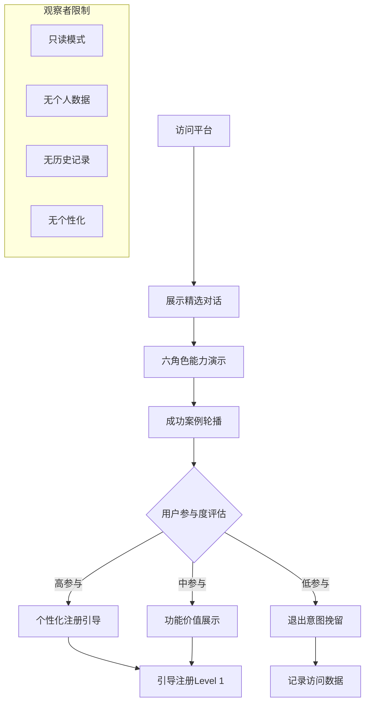
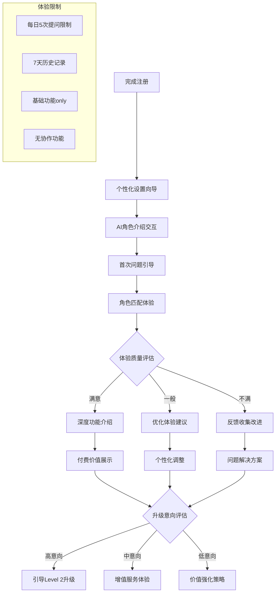
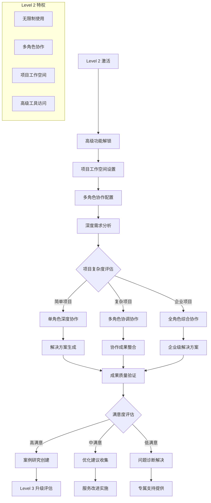
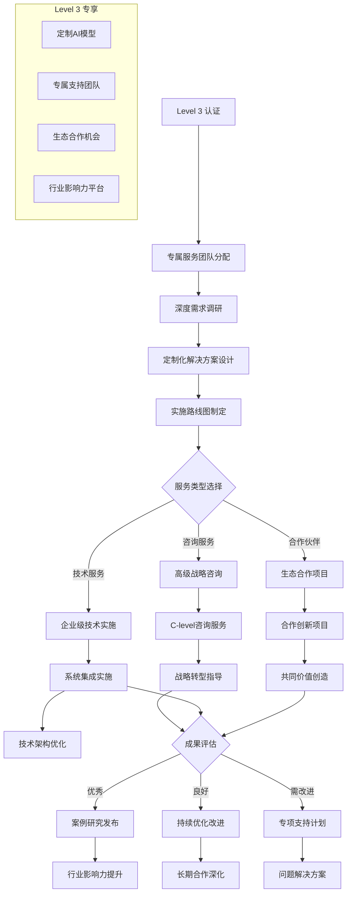

# 渐进式交互功能流程

**版本**: 1.5.0 | **日期**: 2025年8月12日 | **状态**: Level 0-3 完整功能流程规格

---

## 概述

智链平台的渐进式交互系统通过四个层级（Level 0-3）为用户提供递进式的功能体验，每个层级都有明确的功能边界、升级触发条件和价值实现路径。

## Level 0: 观察者阶段功能流程

### 核心功能定义
```typescript
interface Level0ObserverFunctions {
  // 观察权限
  viewPermissions: {
    publicConversations: true;        // 查看公开对话
    showcaseContent: true;           // 查看展示内容
    roleIntroductions: true;         // 查看角色介绍
    successStories: true;            // 查看成功案例
    featurePreviews: true;          // 查看功能预览
  };
  
  // 交互限制
  interactionLimitations: {
    canNotInitateChat: true;         // 不能发起对话
    canNotSaveContent: true;         // 不能保存内容
    canNotAccessHistory: true;       // 不能查看历史
    canNotCustomizeInterface: true;  // 不能自定义界面
  };
  
  // 数据收集
  dataCollection: {
    behaviorTracking: true;          // 行为追踪
    interestAnalysis: true;          // 兴趣分析
    engagementMetrics: true;         // 参与度指标
    conversionPotential: true;       // 转化潜力评估
  };
}
```

### 观察者体验流程


### 升级触发机制
```typescript
interface Level0UpgradeTriggers {
  // 时间基础触发
  timeBasedTriggers: {
    sessionDuration: {
      threshold: 180; // 3分钟停留
      action: "显示注册价值主张";
    };
    
    returnVisit: {
      threshold: 3; // 3次回访
      action: "强化注册激励";
    };
    
    pageViews: {
      threshold: 10; // 10个页面浏览
      action: "展示深度功能预览";
    };
  };
  
  // 行为基础触发
  behaviorBasedTriggers: {
    scrollDepth: {
      threshold: 70; // 70%滚动深度
      action: "内容深度参与提示";
    };
    
    clickPatterns: {
      threshold: 5; // 5次有意义点击
      action: "交互意图识别";
    };
    
    contentInterest: {
      threshold: "high_engagement_score";
      action: "相关功能推荐";
    };
  };
  
  // 意图基础触发
  intentBasedTriggers: {
    exitIntent: {
      trigger: "鼠标移向关闭按钮";
      action: "挽留弹窗with价值主张";
    };
    
    featureExploration: {
      trigger: "尝试点击受限功能";
      action: "功能解锁引导";
    };
    
    contentSharing: {
      trigger: "尝试分享内容";
      action: "注册后解锁分享";
    };
  };
}
```

## Level 1: 体验者阶段功能流程

### 核心功能解锁
```typescript
interface Level1ExplorerFunctions {
  // 基础交互权限
  basicInteractions: {
    dailyFreeQuestions: 5;           // 每日5次免费提问
    roleSelectionExperience: true;   // 角色选择体验
    basicPersonalization: true;      // 基础个性化
    conversationHistory: "7_days";   // 7天历史记录
  };
  
  // 体验功能
  experienceFeatures: {
    aiRoleInteraction: {
      alex: "business_consultation_demo";
      kulu: "solution_architecture_preview";
      mike: "implementation_guidance_sample";
      emma: "data_analysis_example";
      david: "project_coordination_demo";
      catherine: "strategic_advice_teaser";
    };
    
    contentGeneration: {
      basicReports: true;            // 基础报告生成
      simpleAnalysis: true;          // 简单分析功能
      templateAccess: "limited";     // 有限模板访问
      exportOptions: "basic";        // 基础导出选项
    };
  };
  
  // 增值服务预览
  premiumPreviews: {
    advancedFeatures: "limited_access"; // 高级功能限时体验
    collaborationTools: "demo_mode";    // 协作工具演示模式
    integrationOptions: "preview_only"; // 集成选项仅预览
    customization: "basic_themes";      // 基础主题定制
  };
}
```

### 体验者功能流程


### Level 1 价值实现路径
```typescript
interface Level1ValueRealization {
  // 即时价值体验
  immediateValue: {
    problemSolving: {
      businessQuestions: "即时商业问题解答";
      technicalGuidance: "技术指导建议";
      marketInsights: "市场洞察分享";
      bestPractices: "最佳实践推荐";
    };
    
    learningExperience: {
      roleCapabilities: "深度了解AI角色能力";
      platformFeatures: "全面体验平台功能";
      industryKnowledge: "获取行业知识积累";
      personalizedInsights: "个性化洞察获得";
    };
  };
  
  // 转化价值展示
  conversionValueDisplay: {
    advancedCapabilities: "展示付费版高级能力";
    efficiencyGains: "计算效率提升价值";
    costSavings: "显示成本节约潜力";
    competitiveAdvantage: "展示竞争优势获得";
  };
  
  // 社交价值创造
  socialValueCreation: {
    networkEffect: "引入用户网络效应";
    knowledgeSharing: "知识分享价值体现";
    collaborationPreview: "协作价值预览";
    communityAccess: "社区价值展示";
  };
}
```

## Level 2: 合作者阶段功能流程

### 深度功能解锁
```typescript
interface Level2CollaboratorFunctions {
  // 无限制交互
  unlimitedInteractions: {
    questionsPerDay: "unlimited";    // 无限制提问
    conversationHistory: "permanent"; // 永久历史记录
    fileUploadAnalysis: true;        // 文件上传分析
    multiSessionProjects: true;      // 多会话项目管理
  };
  
  // 高级协作功能
  advancedCollaboration: {
    multiRoleOrchestration: {
      simultaneousRoles: 6;          // 同时激活6个角色
      roleConflictResolution: true;  // 角色冲突解决
      consensusBuilding: true;       // 共识建立机制
      qualityAssurance: true;        // 质量保证系统
    };
    
    projectWorkspace: {
      dedicatedWorkspaces: true;     // 专属工作空间
      collaborativeEditing: true;    // 协作编辑功能
      versionControl: true;          // 版本控制系统
      teamInvitation: "limited";     // 有限团队邀请
    };
  };
  
  // 企业级工具
  enterpriseTools: {
    knowledgeBaseAccess: true;       // 知识库完全访问
    customWorkflows: true;           // 自定义工作流
    integrationAPIs: "standard";     // 标准API集成
    reportingDashboard: true;        // 报告仪表板
  };
}
```

### 合作者工作流程


### 合作价值创造
```typescript
interface Level2ValueCreation {
  // 实际业务价值
  businessValueDelivery: {
    strategicPlanning: {
      marketAnalysis: "深度市场分析报告";
      competitiveStrategy: "竞争策略制定";
      businessModelOptimization: "商业模式优化";
      investmentPlanning: "投资规划建议";
    };
    
    operationalEfficiency: {
      processOptimization: "业务流程优化";
      technologyImplementation: "技术实施方案";
      riskManagement: "风险管理体系";
      performanceImprovement: "绩效提升计划";
    };
  };
  
  // 协作效率提升
  collaborationEfficiencyGains: {
    timeReduction: "项目时间缩短40-60%";
    qualityImprovement: "解决方案质量提升";
    costOptimization: "实施成本优化";
    riskReduction: "项目风险降低";
  };
  
  // 知识资产积累
  knowledgeAssetAccumulation: {
    organizationalKnowledge: "组织知识库建设";
    bestPracticesLibrary: "最佳实践库构建";
    lessonsLearnedCapture: "经验教训沉淀";
    innovationInsights: "创新洞察积累";
  };
}
```

## Level 3: 专家阶段功能流程

### 专家级功能解锁
```typescript
interface Level3ExpertFunctions {
  // 定制化服务
  customizedServices: {
    aiModelPersonalization: true;    // AI模型个性化训练
    enterpriseIntegration: true;     // 企业系统深度集成
    whitelabelSolution: true;        // 白标解决方案
    dedicatedSupport: true;          // 专属支持团队
  };
  
  // 战略合作功能
  strategicPartnership: {
    coInnovationProjects: true;      // 共同创新项目
    revenueSharing: true;            // 收入分享计划
    exclusiveFeatures: true;         // 独享功能特性
    thoughtLeadershipPlatform: true; // 思想领导力平台
  };
  
  // 生态系统权限
  ecosystemPrivileges: {
    partnerNetworkAccess: true;      // 合作伙伴网络访问
    industryExpertConsultation: true; // 行业专家咨询
    globalBestPractices: true;       // 全球最佳实践
    futureFeatureEarlyAccess: true;  // 未来功能提前访问
  };
}
```

### 专家级服务流程


## 跨级别升级机制

### 智能升级触发系统
```typescript
interface IntelligentUpgradeSystem {
  // 使用行为分析
  usageBehaviorAnalysis: {
    frequency: "使用频率分析";
    depth: "功能使用深度";
    complexity: "问题复杂度趋势";
    satisfaction: "满意度变化趋势";
  };
  
  // 价值实现评估
  valueRealizationAssessment: {
    businessImpact: "业务影响评估";
    timesSaved: "时间节约计算";
    costBenefit: "成本效益分析";
    qualityImprovement: "质量提升测量";
  };
  
  // 个性化推荐时机
  personalizedUpgradeTiming: {
    optimalMoment: "最佳升级时机识别";
    contextualRelevance: "上下文相关性分析";
    emotionalState: "用户情绪状态考虑";
    decisionReadiness: "决策准备度评估";
  };
}
```

### 升级成功率优化
```typescript
interface UpgradeSuccessOptimization {
  // A/B测试优化
  abTestOptimization: {
    upgradeTiming: "升级时机A/B测试";
    messageFraming: "信息框架A/B测试";
    incentiveStructure: "激励结构A/B测试";
    userInterface: "界面设计A/B测试";
  };
  
  // 摩擦减少策略
  frictionReductionStrategies: {
    oneClickUpgrade: "一键升级机制";
    trialExtension: "试用期延长";
    gradualFeatureUnlock: "渐进式功能解锁";
    socialProof: "社会证明展示";
  };
  
  // 个性化定价
  personalizedPricing: {
    valueBased: "基于价值实现的定价";
    usageBased: "基于使用量的定价";
    industrySpecific: "行业特定定价策略";
    loyaltyDiscount: "忠诚度折扣机制";
  };
}
```

---

*此文档详细定义了智链平台四个层级的完整功能流程，为产品设计和用户体验优化提供指导框架。*