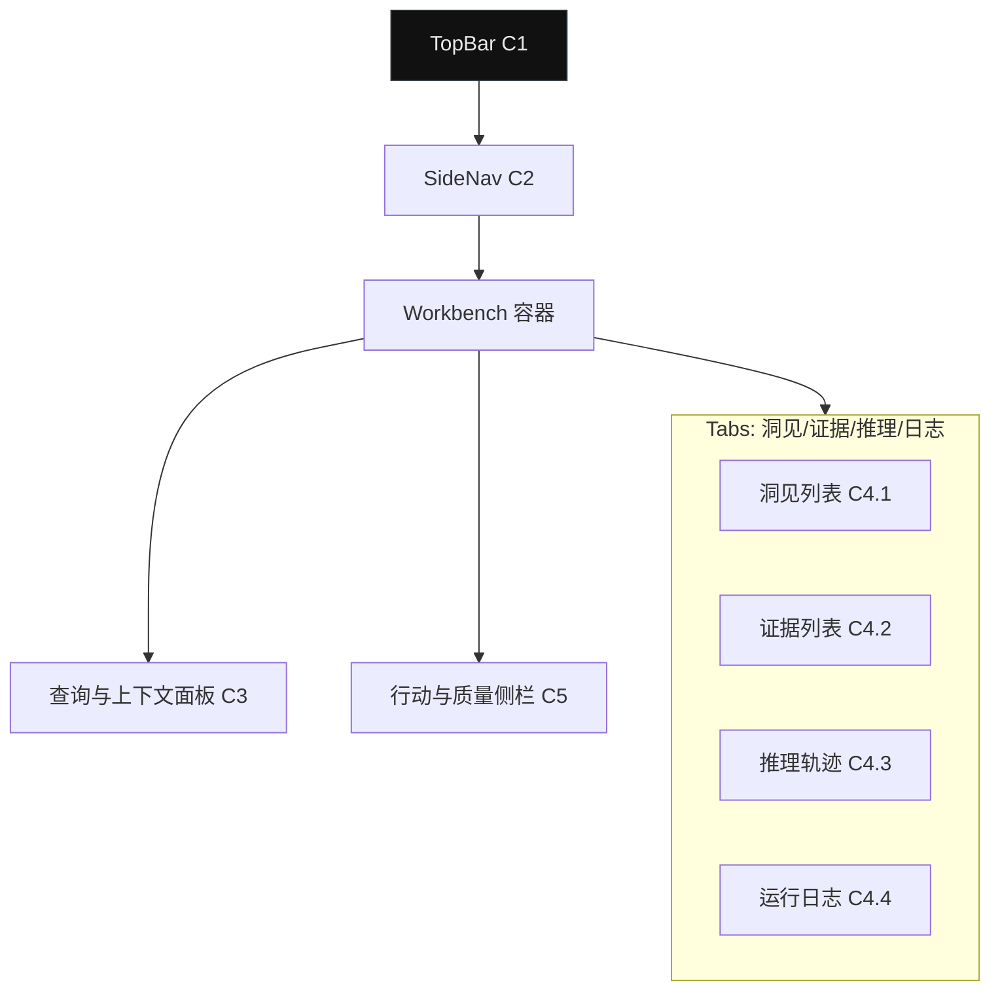

## Me² Info² 工作台 — 详细线框（逐屏标注）

本线框面向桌面优先，兼容平板/移动端；与 `Me2_界面规范与组件库.md`、`Me2_交互流程与状态规范.md` 对齐。

### A. 默认桌面态（1440×）


组件标注：
- C1 TopBar：全局搜索、最近任务、分身切换、通知、用户菜单。
- C2 SideNav：Info² 分组（工作台、任务、设置），支持收起。
- C3 查询与上下文面板：
  - 输入框（支持 `/` 命令）、来源选择（web/kb）、上下文标签（可删除）。
  - 参数区：隐含需求抽取开/关、交叉验证阈值、Top-K。
  - 操作：运行（Run）、清空、保存为模板。
- C4 洞见工作区 Tabs：
  - C4.1 洞见列表：`InsightCard` 卡片（标题/要点/证据锚点/置信度/行动）。
  - C4.2 证据列表：来源、时间、可信度、引用位置；支持筛选与跳转。
  - C4.3 推理轨迹：分步推演与权重可视化；节点可展开查看因素贡献。
  - C4.4 运行日志：WS 事件流与耗时，便于问题定位。
- C5 行动与质量侧栏：
  - `QualityBar`（整体与维度细分）；
  - 推荐行动（勾选导出/复制）；
  - 导出（MD/HTML）；
  - 反馈（👍/👎 + 结构化原因 + 即时调整）。

交互主流程：
1) 点击 Run → `POST /tasks` → 立即订阅 `taskId`（WS）。
2) 分段事件 10/25/50/75/90/100 到达时：在 C4 Tabs 中展示对应中间结果；C5 同步刷新质量条。
3) 在 50/75/90 节点可展开“中间快照”。
4) 质量分数 < 阈值（默认 0.8）→ 触发“二次优化”微流程，C5 显示细进度。
5) 用户提交反馈（含即时调整）→ 触发 `adjust_me2_behavior`，当前会话热调整。

无障碍与键盘：
- `F` 聚焦查询输入；`Cmd/Ctrl+Enter` 运行；`[`/`]` 切换 Tab；`Esc` 关闭弹层。
- 组件具备 aria-label；状态变化通过 `aria-live` 公告。

加载与骨架：
- C4 卡片型骨架（标题 + 3 行要点）> 200ms 显示；证据列表使用行骨架。

错误处理：
- 顶部内联错误条 + 重试；若 WS 断开 3 分钟内自动重连并补发缺失分段。

### B. 空状态（首次进入）
- C3 展示引导文案与 3 个示例查询（可一键填充）。
- C4 洞见区显示“如何构造高质量请求”的最佳实践小卡。

### C. 窄屏（≤960px）
- 改为上下结构：TopBar 固定；SideNav 替换为抽屉。
- C3 折叠为顶部折叠面板；C5 变为底部抽屉（手势上拉）。

### D. 组件属性（重点片段）
```ts
// QueryPanel
type QueryPanelProps = {
  value: string;
  contextTags: string[];
  sources: ("web"|"kb:me2")[];
  params: { implicitNeeds: boolean; validationThreshold: number; topK: number };
  onRun: (payload) => void;
};

// InsightCard
type InsightCardProps = {
  title: string;
  bullets: { text: string; evidenceAnchor?: string; confidence: number }[];
  onJumpToEvidence?: (anchor: string) => void;
};
```

### E. 逐屏操作说明（典型路径）
1) 填写查询 → 选择来源与上下文 → Run。
2) 10/25 到达：显示意图解析与查询增强；50：初步检索摘要；75：专业推理要点；90：行动建议初稿；100：质量评估完成。
3) 点击某个洞见要点上的“证据锚点”→ 跳转证据列表对应行，高亮 6 秒。
4) 质量 < 阈值 → 侧栏出现“已启动优化（预计 ≤20s）”；完成后对比提升幅度。
5) 导出 → 选择 MD/HTML；默认勾选今日日期与分身版本信息。

### F. 指标覆盖（UI 层）
- 首屏可交互 < 2s，进度事件呈现 < 200ms；
- 骨架与实际内容版式一致，避免跳动；
- 任务耗时、错误码与用户反馈均埋点。


