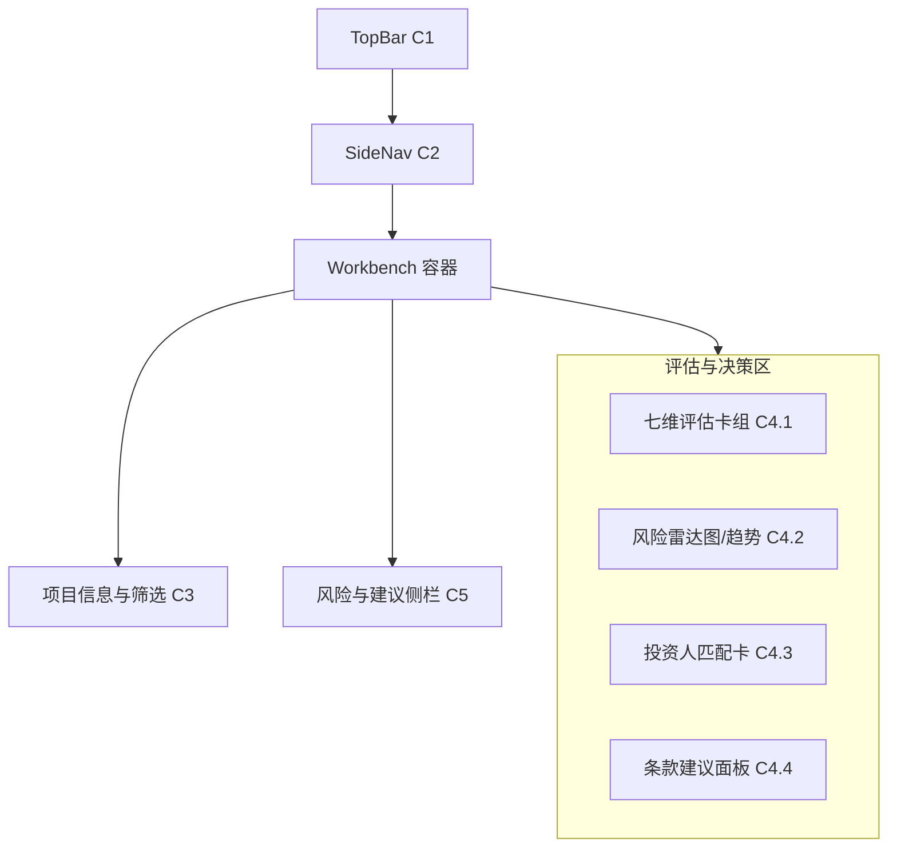

## Me² Invest² 工作台 — 详细线框（逐屏标注）

面向投资分析的七维评估与决策支持，沿用 Info² 架构并扩展评估与匹配组件。

### A. 默认桌面态（1440×）


组件标注：
- C3 项目信息与筛选：
  - 项目选择（搜索/收藏/最近）
  - 评估场景（早期/成长期/并购）
  - 权重方案（默认/自定义 sliders）
  - 操作：开始评估（Run）/ 重新评估（Re-run）
- C4.1 七维评估卡组：
  - `technology/team/market/business/competition/financial/risk`
  - 每卡：得分、置信度、关键因子、改进建议、证据数
  - 点击卡片 → 打开详情抽屉（证据与因子贡献）
- C4.2 风险雷达图/趋势：
  - 维度雷达 + 时间序列（若有历史）；
  - 支持“对比另一个项目”
- C4.3 投资人匹配卡：
  - 匹配分、适配原因、冲突点；
  - 选择投资人组后影响条款建议
- C4.4 条款建议：
  - 估值区间、轮次规模、清算优先、里程碑；
  - 一键生成投资备忘录（含证据附录）
- C5 风险与建议侧栏：
  - `QualityBar`（综合/各维度）；
  - 高风险提示（列表，点击跳转维度卡）；
  - 导出与反馈（结构化 + 即时调整）

交互主流程：
1) 选择项目与场景 → 设定权重 → Run → 后端启动评估任务。
2) WS 分段到达时：先出基础洞见，再出维度卡，随后生成匹配与条款建议。
3) 权重调整（sliders）后点 Re-run：仅重算汇总与条款（可配置是否重跑检索）。
4) 点击维度卡“证据数” → 证据抽屉；在抽屉内可筛选来源与时间。
5) 匹配卡选择不同投资人组 → 实时刷新条款建议。
6) 质量 < 阈值 → 启动二次优化（优先补足证据/更新基线）。

空/加载/错误：
- 空：给出示例项目与权重模板；
- 加载：维度卡骨架（卡头 + 4 行）；雷达 skeleton；
- 错误：在侧栏展示错误与建议（如数据不足/维度不可评）；

### B. 评估详情抽屉（维度级）
内容：
- 得分拆解：因子列表（影响力、正/负向、证据数）
- 证据列表：来源、时间、可信度；
- 行动建议：改善路径与优先级

交互：
- 点击因子 → 高亮关联证据；
- 勾选证据 → 加入备忘录附录；

### C. 条款建议面板（结构）
```yaml
valuation_range: { low: xxx, high: xxx, confidence: 0.82 }
round_size: { currency: "USD", amount: 3_000_000 }
liquidation_preference: { multiple: 1.0x, participating: false }
milestones: [ { name: "MVP", target: "Q4", risk: "medium" } ]
```

### D. 组件属性（重点片段）
```ts
type DimensionCardProps = {
  dimension: 'technology'|'team'|'market'|'business'|'competition'|'financial'|'risk';
  score: number; // 0-100 or 0-1 内部统一
  confidence: number;
  keyFactors: { name: string; impact: number; direction: 'pos'|'neg'; evidence: number }[];
  onOpenDetail: () => void;
};

type InvestorMatchProps = {
  groupId: string;
  compatibility: number;
  reasons: string[];
  conflicts: string[];
  onChangeGroup: (id: string) => void;
};
```

### E. 逐屏操作说明（典型路径）
1) 选择项目 A（早期）→ 权重方案：技术 25/团队 20/市场 20/商业 15/竞争 10/财务 5/风险 5 → Run。
2) 25：意图/上下文校验；50：维度卡初版；75：匹配与风险图；90：条款草案；100：质量验证。
3) 将“市场”卡打开详情 → 勾选 3 条关键证据 → 生成备忘录时自动加入附录。
4) 切换投资人组为“成长基金” → 条款建议更新（金额、里程碑约束改变）。
5) 质量 < 阈值 → 触发补证据；若提升 <5% 给出手动改进指引。

### F. 可达性与性能
- 维度卡/雷达/匹配卡具备 aria-label；键盘可聚焦与展开抽屉；
- 骨架与真实卡片占位一致；雷达在低性能设备退化为条形图。


