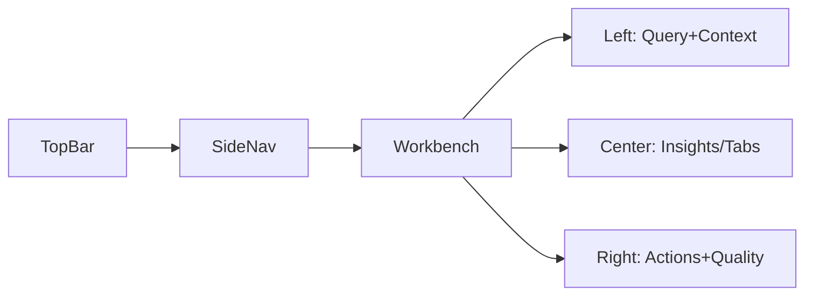

## Me² 线框与页面结构（低保真）

### 1) 仪表盘 Dashboard（可重排卡片）
- 顶栏：全局搜索 | 最近任务 | 分身切换 | 通知 | 用户
- 主区四卡：
  - 最近任务（列表）
  - 分身概览（可切换）
  - 质量趋势（折线）
  - 系统告警（列表）

### 2) 分身创建向导 AvatarWizard
- 步骤：访谈 → 引擎 → 验证 → 激活
- 右侧：步骤说明与提示；下方：上一步/下一步/保存草稿

### 3) Info² 工作台（核心）
- 左栏：查询与上下文（可折叠、历史记录、参数）
- 中栏：Tabs（洞见 | 证据 | 推理 | 日志）
- 右栏：行动建议 + 质量条 + 导出

### 4) 任务详情页
- 顶部：任务标题、状态、执行时间、导出
- 左：时间轴（分段 10/25/50/75/90/100）
- 右：中间结果快照与反馈记录

### 5) 协作房间（简版）
- 顶部：房间信息与成员
- 左：事件流（加入/反馈/进度）
- 右：任务面板（只读）

### 组件对位
- InsightCard：中栏洞见卡
- QualityBar：右栏质量条
- CollaborationPanel：协作页主体

