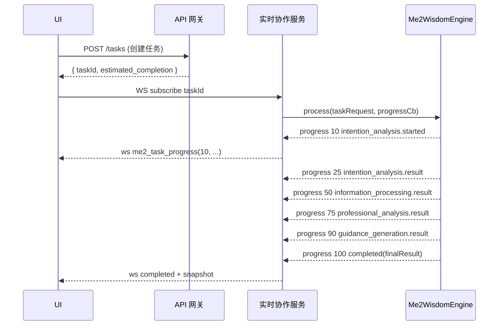

## Me² 交互流程与状态规范（Interaction Spec）

本规范与 `05_界面规格/Me2_界面规范与组件库.md` 配套，覆盖 Info² / Invest² 的关键任务流、实时通信事件、状态机、错误与重试策略、可观测点。

### 1. 任务总流程（WebSocket 分段进度）
事件分段：10/25/50/75/90/100（与引擎实现一致）。



UI 要求：
- 每个分段以时间轴节点呈现；允许用户在 50/75/90 三个节点查看中间结果。
- 丢包重连：断线 < 3 分钟，使用 `lastEventId` 从 RT 服务补发缺失段。

### 2. 分身创建向导（4 步状态机）
```yaml
states:
  idle -> interview -> engine_setup -> validation -> activation -> done
transitions:
  idle -> interview: start
  interview -> engine_setup: interview.saved && score >= threshold
  engine_setup -> validation: vectorDbReady && modelTuned && weightsCalibrated
  validation -> activation: passRate >= 0.8
  activation -> done: userConfirmed
guards:
  threshold: 0.7
```

错误处理：
- `engine_setup` 失败自动重试 2 次（指数退避 1s/3s），仍失败进入人工参数校准。
- `validation` 失败允许选择低配激活或返回前一步继续微调。

### 3. 实时协作会话（Collaboration Room）
频道划分：`room:{id}`, `task:{id}`, `presence:{room}`。

事件定义：
```json
{
  "type": "presence_update",
  "roomId": "r-123",
  "userId": "u-1",
  "status": "online|away|typing|reviewing",
  "ts": 1734570000
}
```

冲突解决：
- 同一任务参数编辑采用“最后写入胜 + 冲突合并提示”，关键字段（阈值、可见性）需双确认。

### 4. 质量评估与二次优化
触发条件：`qualityScore < qualityThreshold (默认 0.8)`。
流程：
1) 记录失败维度（accuracy/completeness/relevance/professionalism/usability）
2) 自动选择最小代价改进路径（重跑某步或追加证据检索）
3) 新结果与旧结果对齐比对；若提升 < 5%，提示人工反馈

UI 表达：在进度条下方出现“优化中”细条进度，最长 20 秒。

### 5. 反馈模型（Structured Feedback）
```json
{
  "taskId": "t-1",
  "userId": "u-1",
  "vote": "+1" | "-1",
  "reasons": ["content", "structure", "evidence", "tone", "timeliness"],
  "immediateAdjustments": { "tone": "more-formal", "depth": "+1", "evidence": "+2" },
  "comment": "",
  "ts": 1734570123
}
```

即时调整：当包含 `immediateAdjustments` 时，RT 触发 `adjust_me2_behavior`，引擎在当前会话内热调整。

### 6. 数据契约（前后端）

6.1 任务创建请求
```json
{
  "query": "生成对比分析",
  "context": { "domain": "media", "sources": ["web", "kb:me2"] },
  "goals": ["提炼要点", "给出行动建议"],
  "qualityThreshold": 0.8
}
```

6.2 任务进度事件（WS）
```json
{
  "type": "me2_task_progress",
  "taskId": "t-1",
  "progress": 75,
  "intermediate_results": { "stage": "professional_analysis", "summary": "..." }
}
```

6.3 最终结果
```json
{
  "taskId": "t-1",
  "insights": [ { "title": "...", "confidence": 0.86, "evidence": ["url#L12"] } ],
  "guidance": { "summary": "...", "actions": ["...", "..."] },
  "qualityScore": 0.83,
  "executionTime": 12890,
  "confidence": 0.8,
  "suggestions": ["..." ]
}
```

### 7. 错误与重试策略
- 分类：`client_error(4xx) / transient(5xx/网络) / policy(权限/合规)`。
- 重试：瞬时错误重试 3 次（200/800/2000ms），其余提示用户并提供逐步指引。
- 断点续跑：在 25/50/75/90 四个分段可作为恢复点。

### 8. 可观测性埋点（前端）
- 任务生命周期：创建/订阅/各分段/完成/失败；耗时与错误码。
- 交互：关键按钮点击、参数变更、反馈提交、导出行为。
- 性能：首屏、交互延迟、WS RTT 与丢包率、重连次数。

### 9. 安全与隐私（交互层）
- 敏感字段打码显示；分享范围在每次导出/分享前二次确认。
- 协作房间权限：主持人可锁定房间与字段编辑权。

### 10. 与 UI 的联动
- 所有状态变化通过事件驱动更新，对应在 UI 中的组件：QualityBar、InsightCard、CollaborationPanel 必须可订阅 task/room 频道。


