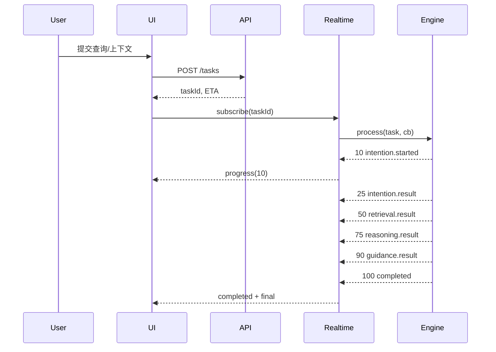
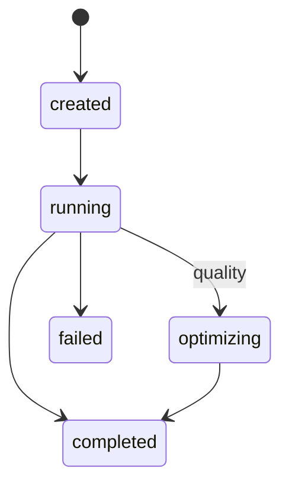

## Me² 泳道图：端到端任务流

### Sequence（MVP）

```mermaid
sequenceDiagram
  participant User
  participant UI
  participant API
  participant RT as Realtime
  participant ENG as Engine

  User->>UI: 提交查询/上下文
  UI->>API: POST /tasks
  API-->>UI: taskId, ETA
  UI->>RT: subscribe(taskId)
  RT->>ENG: process(task, cb)
  ENG-->>RT: 10 intention.started
  RT-->>UI: progress(10)
  ENG-->>RT: 25 intention.result
  ENG-->>RT: 50 retrieval.result
  ENG-->>RT: 75 reasoning.result
  ENG-->>RT: 90 guidance.result
  ENG-->>RT: 100 completed
  RT-->>UI: completed + final
```

### State（任务）

```mermaid
stateDiagram-v2
  [*] --> created
  created --> running
  running --> completed
  running --> optimizing: quality<threshold
  optimizing --> completed
  running --> failed
```

断线恢复：客户端携带 `lastEventId` 发起补发，服务器按任务缓冲队列回放。

