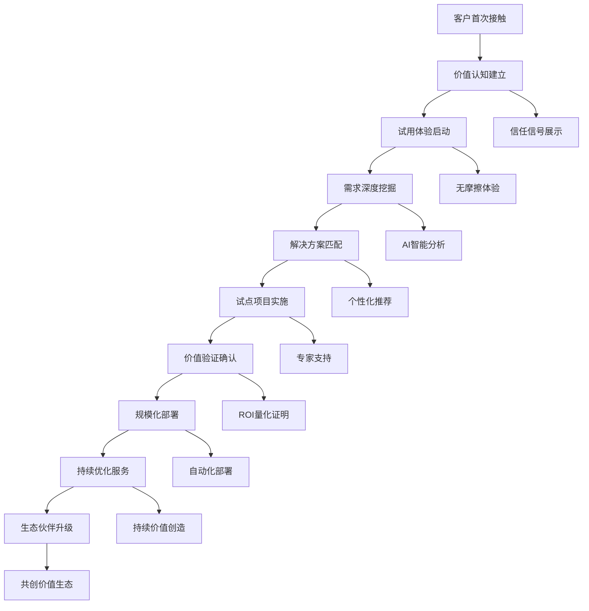
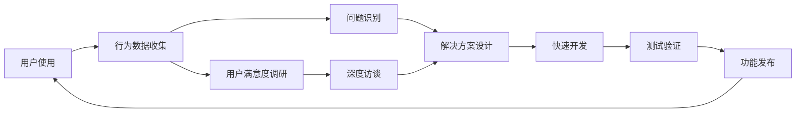

# 智链1.5实施执行计划：从设计到交付
*整合所有信息的具体实施指南*

**版本**: 1.5实施版 | **日期**: 2025-08-12 | **状态**: 立即执行  
**目标**: 3个月内实现AI能力交易平台基础，为3.0版本铺路

---

## 📋 执行摘要

基于我们的代码分析、历史文档研究和最新战略规划，智链1.5版本将是从"AI协作工具"向"AI能力交易平台"转型的关键里程碑。我们要在3个月内建立技术基础、用户基础和数据基础。

---

## 🎯 1.5版本核心目标

### 战略目标
```yaml
技术基础: 建立微服务架构和API标准化，为交易平台做准备
用户基础: 通过六角色协作收集1000+企业用户的AI需求数据
数据基础: 积累AI能力使用模式和企业需求画像数据库
生态基础: 建立合作伙伴接入机制和标准化流程
```

### 商业价值验证
- **需求验证**: 验证AI能力标准化交易的市场需求
- **模式验证**: 验证"需求描述→智能匹配→标准化交付"的可行性
- **价值验证**: 证明ROI提升和成本降低的实际效果

---

## 👥 客户画像与获取策略

### 目标客户细分（基于代码分析）

#### 一级目标客户：制造业企业
```yaml
客户特征:
  企业规模: 100-1000人
  年营业额: 1-10亿人民币
  IT预算: 50-200万/年
  决策层: CTO + 运营总监
  
痛点分析:
  - 质量检测依赖人工，效率低准确率不稳定
  - 生产流程优化需要大量数据分析
  - 设备维护缺乏预测性维护
  
解决方案匹配:
  workforce: 智能视觉检测、预测性维护
  expert_module: 制造业优化套件、质量管理模块
  预期ROI: 300-400%，回收期6-8个月
```

#### 二级目标客户：电商零售企业
```yaml
客户特征:
  企业规模: 50-500人
  年GMV: 5000万-5亿
  IT预算: 30-150万/年
  决策层: CMO + 运营总监
  
痛点分析:
  - 客服人工成本高，响应时间长
  - 营销效果难以精准衡量和优化
  - 库存管理和需求预测不准确
  
解决方案匹配:
  workforce: 智能客服机器人、推荐算法
  expert_module: 电商营销套件、库存优化模块
  预期ROI: 250-350%，回收期4-6个月
```

### 客户获取策略

#### 第一阶段：种子用户获取（Month 1）
```typescript
interface SeedUserAcquisition {
  // 直接邀请策略
  directInvitation: {
    existingNetwork: "LaunchX现有客户网络";
    industryContacts: "制造业和电商行业联系人";
    partnerReferrals: "合作伙伴推荐";
    target: "30家种子企业";
  };
  
  // 价值驱动接触
  valueProposition: {
    freeAssessment: "免费AI需求评估（价值5万）";
    pilotProgram: "3个月免费试用计划";
    roiGuarantee: "ROI不达标全额退款";
    exclusiveAccess: "1.5版本优先体验权";
  };
}
```

#### 第二阶段：规模化获取（Month 2-3）
```typescript
interface ScaleAcquisition {
  // 内容营销
  contentMarketing: {
    caseStudyPublishing: "成功案例发布";
    industryWhitepapers: "行业白皮书分享";
    webinarSeries: "AI转型在线研讨会";
    thoughtLeadership: "行业会议演讲";
  };
  
  // 数字化营销
  digitalMarketing: {
    linkedinCampaigns: "LinkedIn精准广告";
    seoOptimization: "搜索引擎优化";
    partnershipPrograms: "渠道合作伙伴计划";
    referralPrograms: "客户推荐奖励计划";
  };
}
```

---

## 🛠 技术工具栈与架构实施

### 前端技术栈（基于现有代码优化）

#### 六角色协作界面升级
```typescript
interface RoleCollaborationUI {
  // 角色系统升级
  roleSystem: {
    alex: "需求理解专家 + AI能力匹配引擎";
    sarah: "技术架构师 + 标准化设计";
    mike: "体验设计师 + 交易界面设计";
    emma: "数据分析师 + 市场洞察";
    david: "项目管理师 + 生态协调";
    lisa: "战略顾问 + 商业模式设计";
  };
  
  // 界面功能增强
  enhancedFeatures: {
    realTimeCollaboration: "多角色实时协作";
    contextSwitching: "上下文智能切换";
    capabilityRecommendation: "实时AI能力推荐";
    progressTracking: "项目进度可视化";
  };
}
```

#### Cloudsway紫青色彩体系应用
```css
/* 基于现有设计系统的1.5版本色彩规范 */
:root {
  /* 核心品牌色 - 紫青渐变系统 */
  --primary-gradient: linear-gradient(135deg, #667eea 0%, #764ba2 100%);
  --secondary-gradient: linear-gradient(145deg, #0ea5e9 0%, #3b82f6 100%);
  
  /* 角色专属色彩（支持AI能力匹配） */
  --alex-color: #667eea;    /* 需求理解 - 深邃蓝紫 */
  --sarah-color: #0ea5e9;   /* 技术架构 - 科技蓝 */
  --mike-color: #8b5cf6;    /* 体验设计 - 创意紫 */
  --emma-color: #06d6a0;    /* 数据分析 - 洞察绿 */
  --david-color: #f59e0b;   /* 项目管理 - 效率橙 */
  --lisa-color: #ef4444;    /* 战略咨询 - 决策红 */
  
  /* 功能状态色彩 */
  --success-color: #10b981;
  --warning-color: #f59e0b;
  --error-color: #ef4444;
  --info-color: #3b82f6;
  
  /* 交易平台专用色彩 */
  --marketplace-primary: #6366f1;
  --marketplace-secondary: #8b5cf6;
  --capability-available: #10b981;
  --capability-busy: #f59e0b;
  --capability-offline: #94a3b8;
}
```

### 后端架构实施

#### 微服务架构设计
```yaml
服务架构设计:
  核心服务层:
    - user-service: 用户管理和认证
    - role-service: 六角色管理和路由
    - conversation-service: 对话管理和历史
    - notification-service: 实时通知系统
    
  AI能力服务层:
    - capability-registry: AI能力注册和管理
    - recommendation-engine: 智能推荐引擎
    - matching-service: 需求匹配服务
    - evaluation-service: 能力评估服务
    
  数据服务层:
    - analytics-service: 用户行为分析
    - insight-service: 业务洞察生成
    - reporting-service: 报告生成服务
    - data-collection: 数据收集管道
    
  基础设施层:
    - api-gateway: API网关和路由
    - service-discovery: 服务发现
    - config-service: 配置管理
    - monitoring-service: 监控和告警
```

#### API标准化规范
```typescript
// AI能力标准化接口设计
interface CapabilityAPI {
  // 能力注册接口
  registerCapability: {
    endpoint: "POST /api/v1/capabilities";
    payload: {
      name: string;
      description: string;
      category: "workforce" | "expert_module" | "market_report";
      pricing: PricingModel;
      metadata: CapabilityMetadata;
    };
  };
  
  // 需求匹配接口
  matchRequirements: {
    endpoint: "POST /api/v1/matching";
    payload: {
      requirements: RequirementSpec;
      context: UserContext;
      preferences: UserPreferences;
    };
    response: MatchingResult[];
  };
  
  // 能力调用接口
  invokeCapability: {
    endpoint: "POST /api/v1/capabilities/{id}/invoke";
    payload: {
      input: any;
      options: InvocationOptions;
    };
    response: InvocationResult;
  };
}
```

---

## 🎨 服务设计与用户体验

### 四层级渐进式交互设计

#### Level 0：观察者体验
```typescript
interface ObserverExperience {
  // 价值展示策略
  showcaseStrategy: {
    heroDemo: "首页AI能力演示";
    successStories: "客户成功案例轮播";
    roiCalculator: "ROI快速计算器";
    industryBenchmarks: "行业基准对比";
  };
  
  // 信任建立机制
  trustBuilding: {
    expertCredentials: "六角色专家资质展示";
    clientLogos: "知名客户logo墙";
    securityBadges: "安全认证徽章";
    liveActivity: "实时平台活动数据";
  };
}
```

#### Level 1：体验者交互
```typescript
interface ExperiencerInteraction {
  // 引导体验流程
  guidedExperience: {
    onboardingFlow: "5分钟快速入门";
    roleIntroduction: "六角色能力介绍";
    demoScenarios: "行业典型场景演示";
    trialAccess: "免费试用通道";
  };
  
  // 价值快速实现
  quickWins: {
    instantAssessment: "即时AI需求评估";
    capabilityMatching: "智能能力匹配";
    roiProjection: "ROI投影计算";
    implementationTimeline: "实施时间线预览";
  };
}
```

#### Level 2：合作者协作
```typescript
interface CollaboratorCooperation {
  // 深度协作功能
  deepCollaboration: {
    projectWorkspace: "专属项目工作区";
    realTimeChat: "六角色实时协作";
    documentSharing: "文档共享和版本控制";
    progressDashboard: "项目进度仪表板";
  };
  
  // 价值验证机制
  valueValidation: {
    pilotProgram: "试点项目管理";
    successMetrics: "成功指标跟踪";
    iterativeOptimization: "迭代优化流程";
    stakeholderReporting: "利益相关方报告";
  };
}
```

#### Level 3：专家生态
```typescript
interface ExpertEcosystem {
  // 生态伙伴功能
  ecosystemFeatures: {
    partnerPortal: "合作伙伴门户";
    capabilityMarketplace: "能力市场";
    revenueSharing: "收入分享系统";
    coInnovation: "联合创新项目";
  };
  
  // 战略合作管理
  strategicPartnership: {
    jointPlanning: "联合战略规划";
    sharedKPI: "共享关键指标";
    thoughtLeadership: "思想领导力";
    marketInfluence: "市场影响力建设";
  };
}
```

### 客户体验旅程优化

#### 端到端客户旅程设计


---

## 📊 平台功能实施路径

### Sprint 1: 基础架构搭建（Month 1, Week 1-4）

#### Week 1-2: 技术基础
```yaml
技术架构搭建:
  - 微服务架构设计和实现
  - API网关配置和路由规则
  - 服务注册与发现机制
  - 基础安全认证系统
  - 监控和日志系统

开发工具配置:
  - CI/CD管道建立
  - 代码质量检查
  - 自动化测试框架
  - 容器化部署环境
```

#### Week 3-4: 核心功能开发
```yaml
六角色系统:
  - 角色管理服务开发
  - 实时协作功能实现
  - 上下文智能路由
  - 消息持久化存储

AI推荐引擎:
  - SmartRecommendationEngine优化
  - 需求分析算法实现
  - 能力匹配逻辑开发
  - 推荐结果优化
```

### Sprint 2: AI能力系统（Month 2, Week 5-8）

#### Week 5-6: 能力注册系统
```yaml
能力管理:
  - 能力注册和审核流程
  - 元数据标准化定义
  - 版本管理机制
  - 质量评估体系

匹配算法:
  - 语义匹配算法实现
  - 多维度评分系统
  - 个性化推荐优化
  - 学习反馈机制
```

#### Week 7-8: 数据收集系统
```yaml
数据管道:
  - 用户行为埋点系统
  - 实时数据流处理
  - 数据质量监控
  - 隐私保护机制

分析系统:
  - 用户画像构建
  - 需求模式分析
  - 市场趋势预测
  - 业务洞察生成
```

### Sprint 3: 用户体验优化（Month 3, Week 9-12）

#### Week 9-10: 界面优化
```yaml
前端优化:
  - 响应式设计完善
  - 交互动画实现
  - 性能优化
  - 无障碍功能

体验提升:
  - 个性化界面
  - 智能助手集成
  - 快捷操作设计
  - 错误处理优化
```

#### Week 11-12: 生态准备
```yaml
合作伙伴系统:
  - 伙伴门户开发
  - 接入流程设计
  - 文档系统建设
  - 支持体系完善

商业化准备:
  - 计费系统基础
  - 订阅管理功能
  - 使用量统计
  - 财务报表功能
```

---

## 🎯 客户体验提升策略

### 个性化体验设计

#### 智能化个性化
```typescript
interface PersonalizationEngine {
  // 用户画像构建
  userProfiling: {
    industryClassification: "行业自动分类";
    roleIdentification: "用户角色识别";
    experienceLevel: "AI经验水平评估";
    preferenceAnalysis: "使用偏好分析";
  };
  
  // 内容个性化
  contentPersonalization: {
    roleBasedInterface: "基于角色的界面定制";
    industrySpecificCases: "行业特定案例展示";
    difficultyAdaptation: "难度自适应调整";
    languageOptimization: "语言表达优化";
  };
  
  // 交互个性化
  interactionPersonalization: {
    conversationStyle: "对话风格适配";
    recommendationTiming: "推荐时机优化";
    notificationFrequency: "通知频率个性化";
    workflowCustomization: "工作流程定制";
  };
}
```

### 价值实现加速

#### 快速价值验证
```typescript
interface RapidValueValidation {
  // 即时价值演示
  instantValue: {
    realTimeDemo: "实时能力演示";
    roiCalculation: "即时ROI计算";
    benchmarkComparison: "基准对比分析";
    successPrediction: "成功概率预测";
  };
  
  // 快速试点实施
  rapidPilot: {
    oneWeekPilot: "一周快速试点";
    minimalViableImplementation: "最小可行实施";
    quickWinIdentification: "快速胜利识别";
    incrementalRollout: "增量式推广";
  };
}
```

---

## 📈 成功指标与监控

### 关键成功指标（KPI）

#### 技术指标
```yaml
系统性能:
  - 响应时间: <200ms平均响应
  - 系统可用性: >99.9%
  - 并发处理: >1000 QPS
  - 错误率: <0.1%

AI推荐效果:
  - 推荐准确率: >85%
  - 用户满意度: >4.5/5
  - 转化率: >60%
  - 学习速度: 每周5%提升
```

#### 用户体验指标
```yaml
用户参与:
  - 日活跃用户: >500 DAU
  - 会话时长: >15分钟
  - 功能采用率: >70%
  - 留存率: >80%

价值实现:
  - 首次价值时间: <24小时
  - 试点成功率: >90%
  - NPS评分: >60
  - 推荐率: >40%
```

#### 商业价值指标
```yaml
数据资产:
  - 数据收集量: >100GB/月
  - 洞察生成: >1000条/月
  - 模式识别: >50种需求模式
  - 预测准确率: >80%

生态建设:
  - 种子用户: 30家
  - 试用用户: 200家
  - 付费转换: >20%
  - 合作伙伴: 10家
```

### 实时监控体系

#### 业务监控仪表板
```typescript
interface BusinessDashboard {
  // 用户行为监控
  userBehavior: {
    realTimeActivity: "实时活动监控";
    conversionFunnel: "转化漏斗分析";
    userJourney: "用户旅程跟踪";
    engagementMetrics: "参与度指标";
  };
  
  // AI性能监控
  aiPerformance: {
    recommendationAccuracy: "推荐准确率";
    responseQuality: "响应质量";
    learningProgress: "学习进度";
    errorRates: "错误率统计";
  };
  
  // 业务价值监控
  businessValue: {
    valueRealization: "价值实现监控";
    roiTracking: "ROI跟踪";
    successMetrics: "成功指标";
    businessImpact: "业务影响评估";
  };
}
```

---

## 🚀 实施时间线与里程碑

### 3个月实施计划总览

```gantt
title 智链1.5实施时间线
dateFormat  YYYY-MM-DD
section 基础建设
技术架构搭建    :done, arch, 2025-08-12, 2025-08-26
核心功能开发    :done, core, 2025-08-26, 2025-09-09
section AI能力系统
能力注册系统    :active, capability, 2025-09-09, 2025-09-23
数据收集系统    :data, 2025-09-23, 2025-10-07
section 体验优化
界面体验优化    :ui, 2025-10-07, 2025-10-21
生态伙伴准备    :ecosystem, 2025-10-21, 2025-11-04
section 发布准备
测试与优化      :test, 2025-11-04, 2025-11-11
正式版发布      :release, 2025-11-11, 2025-11-12
```

### 关键里程碑检查点

#### Milestone 1: 技术基础完成（Month 1）
```yaml
交付成果:
  ✅ 微服务架构运行稳定
  ✅ 六角色协作功能可用
  ✅ 基础AI推荐引擎工作
  ✅ 数据收集管道建立

成功标准:
  - 系统响应时间 < 300ms
  - 用户注册流程完整
  - 基础推荐功能可用
  - 监控系统正常运行
```

#### Milestone 2: AI能力系统完成（Month 2）
```yaml
交付成果:
  ✅ AI能力注册和匹配系统
  ✅ 智能推荐引擎优化
  ✅ 用户行为分析系统
  ✅ 个性化推荐功能

成功标准:
  - 推荐准确率 > 80%
  - 能力匹配成功率 > 85%
  - 用户满意度 > 4.0
  - 数据收集覆盖率 > 95%
```

#### Milestone 3: 生态就绪（Month 3）
```yaml
交付成果:
  ✅ 完整用户体验优化
  ✅ 合作伙伴接入系统
  ✅ 商业化基础功能
  ✅ 1.5版本正式发布

成功标准:
  - 30家种子用户成功接入
  - 用户留存率 > 75%
  - 系统可用性 > 99.5%
  - 为2.0版本准备就绪
```

---

## 💡 风险缓解与应急预案

### 主要风险识别与应对

#### 技术风险
```yaml
AI推荐准确率风险:
  风险等级: 高
  影响: 用户体验和转化率
  缓解措施:
    - 多算法组合验证
    - 人工专家审核机制
    - 用户反馈快速迭代
    - A/B测试持续优化

系统性能风险:
  风险等级: 中
  影响: 用户体验和系统稳定性
  缓解措施:
    - 性能压力测试
    - 自动扩缩容机制
    - 降级服务预案
    - 监控告警体系
```

#### 市场风险
```yaml
用户接受度风险:
  风险等级: 中
  影响: 用户增长和市场验证
  缓解措施:
    - 渐进式功能发布
    - 深度用户访谈
    - 价值演示优化
    - 客户成功支持

竞争加剧风险:
  风险等级: 中
  影响: 市场份额和差异化
  缓解措施:
    - 快速迭代优势
    - 独特价值强化
    - 客户深度绑定
    - 技术壁垒建设
```

---

## 🔄 持续迭代与优化

### 每周迭代计划
```typescript
interface WeeklyIteration {
  // 数据驱动优化
  dataBasedOptimization: {
    userBehaviorAnalysis: "用户行为数据分析";
    performanceMetrics: "性能指标监控";
    feedbackIntegration: "用户反馈集成";
    abTestExecution: "A/B测试执行";
  };
  
  // 功能快速迭代
  rapidFeatureIteration: {
    weeklyFeatureRelease: "每周功能发布";
    bugFixCycle: "缺陷修复周期";
    performanceOptimization: "性能优化";
    userExperienceEnhancement: "用户体验增强";
  };
}
```

### 用户反馈闭环


---

## 📋 总结：从1.5到3.0的战略路径

智链1.5版本是我们实现"AI能力标准化交易平台"愿景的关键第一步。通过这3个月的精心实施，我们将：

### 建立三大基础
1. **技术基础**: 微服务架构、API标准化、数据收集系统
2. **用户基础**: 30家种子用户、200家试用用户、完整需求数据库
3. **生态基础**: 合作伙伴网络、标准化流程、商业化模式验证

### 验证三大假设
1. **需求假设**: AI能力标准化交易存在真实市场需求
2. **技术假设**: 智能匹配和自动化交付技术可行
3. **商业假设**: 平台化生态模式能够创造价值

### 为3.0铺路
通过1.5版本的成功实施，我们将为智链3.0"AI能力标准化交易平台"奠定坚实基础，最终实现"让AI能力像商品一样被标准化、发现、组合、交易"的革命性愿景。

---

**文档维护者**: 智链1.5执行团队  
**最后更新**: 2025年8月12日  
**文档版本**: 1.5执行版 - 完整实施指南  
**文档状态**: 立即执行 - 3个月实施计划

**核心目标**: 建立AI能力交易平台基础，验证商业模式，为3.0版本奠定基础