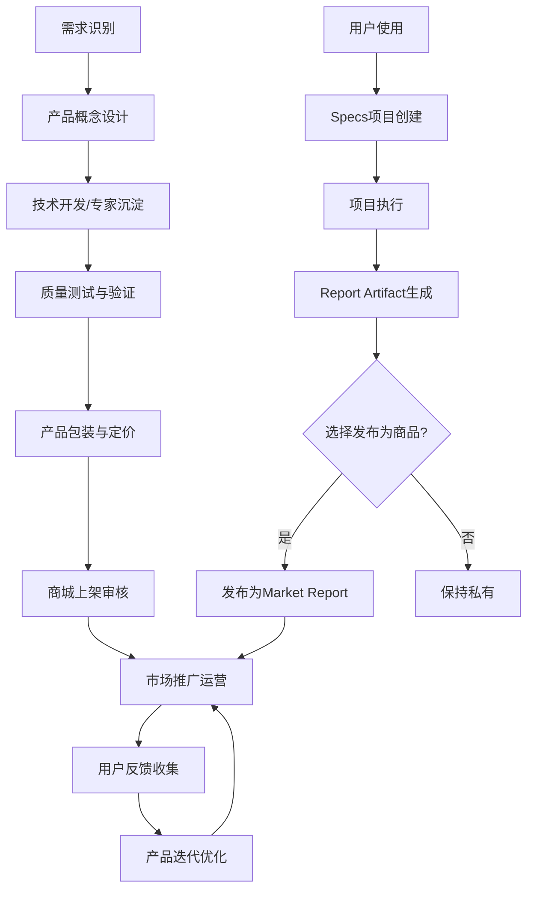
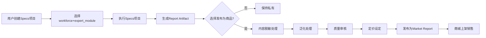

# 智链平台产品服务手册

**版本**: 产品服务v1.0 | **日期**: 2025-08-12 | **状态**: 运营指导手册  
**目标**: 为产品团队和运营团队提供三大产品类型的详细管理和服务指导

---

## 🚀 产品体系总览

### 统一产品分类（商品层）

智链平台的所有可售商品分为三大类型，统一在zhilink商城中展示和销售：

```typescript
interface ProductTypesOverview {
  // 三大商品类型
  productTypes: {
    workforce: {
      definition: "可独立调用的AI原子能力";
      characteristics: "标准化、可组合、按需付费";
      examples: "文档处理器、数据分析引擎、客服机器人";
      targetUsers: "个人用户、开发者、中小企业";
    };
    
    expert_module: {
      definition: "专家沉淀的知识/提示词/策略模块（脑力插件）";
      characteristics: "专业化、可复用、场景特定";
      examples: "法律分析模板、医疗诊断辅助、销售流程优化";
      targetUsers: "专业用户、企业客户、行业专家";
    };
    
    market_report: {
      definition: "从Report Artifact发布的结果型商品";
      characteristics: "深度洞察、行业专业、即时价值";
      examples: "行业分析报告、竞品对比研究、市场趋势预测";
      targetUsers: "企业决策者、投资机构、研究人员";
    };
  };
  
  // 非商品层（用户项目/产出）
  userAssets: {
    specs_project: {
      definition: "用户编排多个商品形成的方案项目";
      nature: "私有项目，不是商品";
      purpose: "执行业务流程，产出结果";
    };
    
    report_artifact: {
      definition: "Specs执行后的具体交付结果";
      nature: "默认私有，可选择发布为商品";
      transformation: "可发布为market_report类型商品";
    };
  };
}
```

### 产品生命周期管理

#### 产品从概念到商品化的完整流程


---

## 🔧 AI劳动力（Workforce）产品服务

### 产品定义与特征

#### 核心定义
```yaml
产品类型: AI劳动力 (AI Workforce)
英文标识: workforce
产品性质: 标准化的、可独立调用的AI原子能力
服务模式: API即服务、工具即服务
技术特点: 微服务架构、容器化部署、弹性扩缩容
```

#### 技术架构要求
```typescript
interface WorkforceArchitecture {
  // 标准化接口
  standardInterface: {
    inputFormat: "统一JSON格式输入";
    outputFormat: "标准化结构输出";
    errorHandling: "标准错误码和错误信息";
    authentication: "统一身份认证和授权";
  };
  
  // 性能要求
  performanceRequirements: {
    responseTime: "< 30秒（复杂任务可扩展到300秒）";
    availability: "> 99.5%";
    throughput: "> 100 RPS";
    scalability: "支持水平扩展";
  };
  
  // 集成能力
  integrationCapability: {
    apiGateway: "通过平台API网关调用";
    webhooks: "支持异步回调通知";
    batchProcessing: "支持批量处理任务";
    realTimeStreaming: "支持实时流式处理";
  };
}
```

### 典型Workforce产品案例

#### 1. 文档智能处理器
```yaml
产品名称: "DocuMaster - 智能文档处理器"
产品描述: "支持多格式文档解析、信息提取、结构化转换的AI工具"

核心功能:
  文档解析:
    - 支持PDF、Word、Excel、PPT等格式
    - OCR文字识别，准确率>98%
    - 表格结构识别和提取
    - 图片内容理解和描述
    
  信息提取:
    - 关键信息自动提取
    - 实体识别和关系抽取
    - 文档摘要生成
    - 关键词标签自动生成
    
  结构化转换:
    - 非结构化文档结构化
    - 多种输出格式支持
    - 自定义模板适配
    - 数据质量验证

技术规格:
  输入支持: "最大50MB文件，支持批量处理"
  处理速度: "平均2-10秒/页"
  准确率: ">95%信息提取准确率"
  并发能力: "支持1000并发处理"

定价模式:
  免费额度: "每月100页免费处理"
  按量付费: "0.1元/页，批量优惠"
  包月套餐: "299元/月，5000页额度"
  企业版: "定制价格，无限制使用"

适用场景:
  - 法律文档批量处理
  - 合同信息自动提取
  - 财务报表数据整理
  - 学术论文信息挖掘

成功案例:
  客户: "某律师事务所"
  场景: "合同审查自动化"
  效果: "合同处理效率提升80%，错误率降低90%"
  ROI: "6个月收回成本，年化ROI 300%"
```

#### 2. 智能数据分析引擎
```yaml
产品名称: "DataInsight - 智能数据分析引擎"
产品描述: "自动化数据清洗、分析、可视化的一站式数据处理平台"

核心功能:
  数据处理:
    - 多数据源自动接入
    - 智能数据清洗和去重
    - 缺失值自动补全
    - 异常值检测和处理
    
  智能分析:
    - 自动统计分析
    - 趋势预测和预警
    - 关联性分析发现
    - 异常模式识别
    
  可视化输出:
    - 自动图表生成
    - 交互式仪表板
    - 报告自动生成
    - 多格式导出支持

技术规格:
  数据处理: "支持TB级数据处理"
  响应时间: "秒级查询响应"
  准确率: ">92%预测准确率"
  并发支持: "支持500并发查询"

定价模式:
  入门版: "99元/月，10GB数据额度"
  专业版: "499元/月，100GB数据额度"
  企业版: "1999元/月，1TB数据额度"
  定制版: "按需定价，无限制"

ROI案例:
  客户: "某电商公司"
  应用: "用户行为分析和精准营销"
  效果: "营销转化率提升45%，分析效率提升60%"
  投资回报: "3个月回本，年化ROI 400%"
```

#### 3. 智能客服机器人
```yaml
产品名称: "ServiceBot - 智能客服机器人"
产品描述: "多渠道智能客服，支持文本、语音、视频等交互方式"

核心功能:
  多渠道接入:
    - 网站在线客服
    - 微信小程序客服
    - 电话语音客服
    - APP内置客服
    
  智能对话:
    - 自然语言理解
    - 上下文记忆管理
    - 情绪识别和处理
    - 多轮对话支持
    
  知识管理:
    - 知识库自动构建
    - FAQ智能匹配
    - 学习型知识更新
    - 人机协作学习

性能指标:
  响应速度: "< 1秒响应时间"
  理解准确率: ">90%意图识别准确率"
  解决率: ">80%问题首次解决率"
  满意度: ">4.2/5.0用户满意度"

定价策略:
  基础版: "199元/月，500次对话"
  标准版: "599元/月，5000次对话"
  高级版: "1299元/月，50000次对话"
  企业版: "按需定制，无限对话"

部署选项:
  - SaaS云端部署
  - 私有云部署
  - 本地化部署
  - 混合部署模式
```

### Workforce产品管理流程

#### 产品上架审核流程
```yaml
审核阶段:
  1. 基础审核（1-2个工作日）:
     检查项目:
       - 产品信息完整性
       - 功能描述准确性
       - 定价合理性
       - 合规性初审
     
     审核标准:
       - 产品描述清晰准确 ✓
       - 功能演示完整可用 ✓
       - 定价策略合理 ✓
       - 无违法违规内容 ✓
  
  2. 技术审核（2-3个工作日）:
     检查项目:
       - API接口规范性
       - 性能指标验证
       - 安全性评估
       - 稳定性测试
     
     技术标准:
       - API响应时间合格 ✓
       - 错误处理规范 ✓
       - 安全认证完善 ✓
       - 并发性能达标 ✓
  
  3. 业务审核（1-2个工作日）:
     检查项目:
       - 市场需求评估
       - 竞争力分析
       - 商业价值判断
       - 生态适配性
     
     业务标准:
       - 有明确市场需求 ✓
       - 具备竞争优势 ✓
       - 商业模式清晰 ✓
       - 平台生态匹配 ✓

审核结果:
  - 通过: 产品立即上架，开始销售
  - 修改后通过: 需要完成修改再次提交
  - 拒绝: 提供详细拒绝理由和改进建议
```

#### 产品质量监控
```yaml
监控维度:
  性能监控:
    - 响应时间监控（P50/P95/P99）
    - 成功率监控（> 99.5%）
    - 并发处理能力监控
    - 资源使用率监控
    
  用户体验监控:
    - 用户满意度评分
    - 使用频率统计
    - 错误反馈收集
    - 功能使用分析
    
  商业指标监控:
    - 销售数量和收入
    - 用户增长趋势
    - 市场占有率
    - 竞争对比分析

预警机制:
  红色预警（立即处理）:
    - 系统可用性 < 95%
    - 响应时间 > 60秒
    - 用户满意度 < 3.0
    - 严重安全漏洞
    
  黄色预警（24小时内处理）:
    - 系统可用性 95-99%
    - 响应时间 30-60秒
    - 用户满意度 3.0-3.5
    - 性能下降趋势
    
  绿色正常（持续优化）:
    - 系统可用性 > 99%
    - 响应时间 < 30秒
    - 用户满意度 > 3.5
    - 性能稳定提升
```

### 供应商管理与支持

#### 供应商分级管理
```yaml
钻石供应商（年收入>100万）:
  权益:
    - 专属客户成功经理
    - 优先技术支持
    - 营销资源倾斜
    - 平台首页推荐位
    - 新功能优先体验
    
  责任:
    - 7*24小时服务保障
    - 月度服务报告
    - 用户培训支持
    - 产品持续优化
    
黄金供应商（年收入50-100万）:
  权益:
    - 专业技术支持
    - 定期业务回顾
    - 营销活动参与
    - 产品推荐机会
    
  责任:
    - 工作时间服务保障
    - 季度服务报告
    - 基础用户支持
    - 产品定期更新
    
白银供应商（年收入10-50万）:
  权益:
    - 标准技术支持
    - 基础营销支持
    - 社区资源共享
    
  责任:
    - 基础服务保障
    - 半年度服务报告
    - 产品维护更新
    
铜牌供应商（年收入<10万）:
  权益:
    - 自助服务支持
    - 文档资源获取
    
  责任:
    - 基本功能保障
    - 年度状态更新
```

#### 供应商赋能支持
```yaml
技术赋能:
  开发支持:
    - API开发文档和SDK
    - 开发沙盒环境
    - 技术培训课程
    - 专家技术咨询
    
  测试支持:
    - 自动化测试工具
    - 性能压力测试
    - 安全性检测
    - 用户体验测试
    
  部署支持:
    - 容器化部署指导
    - 云端基础设施
    - 监控告警系统
    - 日志分析平台

营销赋能:
  内容营销:
    - 产品推广素材制作
    - 成功案例包装
    - 技术文章撰写
    - 视频教程制作
    
  渠道推广:
    - 平台首页展示
    - 邮件营销推送
    - 社交媒体推广
    - 线下活动参与
    
  数据支持:
    - 用户行为分析
    - 市场趋势洞察
    - 竞争对比分析
    - 定价策略建议

商业赋能:
  收益优化:
    - 定价策略咨询
    - 收益模式优化
    - 用户价值挖掘
    - 市场扩展建议
    
  运营支持:
    - 客户服务培训
    - 质量管理指导
    - 流程优化建议
    - 团队能力建设
```

---

## 🧠 专家模块（Expert Module）产品服务

### 产品定义与特征

#### 核心定义
```yaml
产品类型: 专家模块 (Expert Module)
英文标识: expert_module
产品性质: 专家沉淀的知识/提示词/策略模块（脑力插件）
服务模式: 知识即服务、模板即服务
核心价值: 专业经验复用、决策支持增强
```

#### 产品特征要求
```typescript
interface ExpertModuleCharacteristics {
  // 专业性要求
  professionalRequirements: {
    domainExpertise: "来自行业专家或经验证的成功实践";
    knowledgeDepth: "具备深度专业知识和实战经验";
    practicalValue: "能够解决实际业务问题";
    resultOriented: "以结果为导向的解决方案";
  };
  
  // 可复用性设计
  reusabilityDesign: {
    parameterization: "支持参数化配置和定制";
    templateStructure: "标准化模板结构";
    scenarioAdaptation: "适应不同业务场景";
    scalableComplexity: "支持复杂度递增使用";
  };
  
  // 集成能力
  integrationCapability: {
    specsIntegration: "可编排进Specs项目";
    workforceCompatibility: "与AI劳动力产品协同";
    dataIntegration: "支持外部数据接入";
    apiInteraction: "提供标准API调用";
  };
}
```

### 典型Expert Module产品案例

#### 1. 法律分析专家模块
```yaml
产品名称: "LegalMind - 法律案件分析专家模块"
开发者: "某知名律师事务所合伙人"
专业背景: "20年执业经验，处理1000+复杂案件"

核心能力:
  案件分析框架:
    - 案件事实梳理和分析
    - 法律关系识别和判断  
    - 适用法条检索和匹配
    - 争议焦点提炼和分析
    - 胜诉概率评估模型
    
  风险评估体系:
    - 诉讼风险等级划分
    - 证据充分性评估
    - 时效风险识别
    - 执行风险分析
    - 成本效益评估
    
  策略建议生成:
    - 诉讼策略制定
    - 和解方案设计
    - 证据收集指导
    - 庭审要点准备
    - 上诉策略规划

技术实现:
  知识体系: "10万+案例数据库 + 专家经验规则"
  推理引擎: "多层次逻辑推理 + 概率计算模型"
  更新机制: "法规更新自动同步 + 案例持续学习"
  准确率: ">85%分析准确率，>90%风险预警准确率"

应用场景:
  - 案件接收前的快速评估
  - 复杂案件的深度分析
  - 年轻律师的专业指导
  - 律所业务质量控制

定价策略:
  基础版: "599元/月，50次分析"
  专业版: "1599元/月，500次分析"
  事务所版: "5999元/月，无限次使用"
  定制版: "根据需求定制价格"

成功案例:
  用户: "某中型律师事务所"
  应用: "民商事案件分析"
  效果: "案件分析效率提升70%，胜诉率提升15%"
  反馈: "显著提升了年轻律师的专业水平"
```

#### 2. 医疗诊断辅助专家模块
```yaml
产品名称: "MedAssist - 临床诊断辅助专家模块"
开发者: "三甲医院主任医师团队"
专业背景: "30年临床经验，10万+诊疗案例"

核心功能:
  症状分析引擎:
    - 多症状综合分析
    - 症状权重评估
    - 疾病概率排序
    - 鉴别诊断建议
    - 进一步检查建议
    
  辅助诊断系统:
    - 影像学结果解读
    - 实验室指标分析
    - 病理结果判断
    - 综合诊断建议
    - 治疗方案推荐
    
  风险预警机制:
    - 危重症预警
    - 药物相互作用检查
    - 过敏反应预防
    - 并发症风险评估
    - 预后评估分析

技术特点:
  知识库: "医学教科书 + 指南共识 + 临床经验"
  算法模型: "深度学习 + 规则引擎 + 概率推理"
  准确率: ">92%诊断建议准确率"
  覆盖范围: "涵盖内、外、妇、儿等主要科室"

合规认证:
  - 医疗器械软件备案
  - 数据安全合规认证
  - 隐私保护认证
  - 临床验证报告

定价模式:
  个人版: "299元/月，个人医生使用"
  科室版: "1999元/月，科室团队使用"
  医院版: "9999元/月，全院使用授权"
  定制版: "根据医院规模定制"

应用效果:
  试点医院: "某三甲医院急诊科"
  使用情况: "月均辅助诊断5000+例次"
  效果评估: "诊断准确率提升12%，漏诊率降低25%"
  医生反馈: "特别对年轻医生帮助很大"
```

#### 3. 电商销售优化专家模块
```yaml
产品名称: "SalesBooster - 电商销售优化专家模块"
开发者: "电商运营专家 + 数据科学团队"
专业背景: "帮助500+电商企业实现业绩翻倍"

核心模块:
  流量优化引擎:
    - 关键词优化策略
    - 广告投放优化
    - SEO提升方案
    - 社交媒体推广
    - 内容营销策略
    
  转化率提升系统:
    - 商品页面优化
    - 购买流程优化
    - 价格策略调整
    - 促销活动设计
    - 用户体验改善
    
  客户价值管理:
    - 客户分群策略
    - 个性化推荐
    - 复购率提升
    - 客户生命周期管理
    - 客户服务优化

技术实现:
  数据分析: "多维度数据分析 + 实时监控"
  策略引擎: "机器学习 + 专家经验规则"
  效果预测: "A/B测试 + 效果预测模型"
  更新频率: "策略每周更新，模型持续学习"

适用场景:
  - 新品上线推广策略
  - 老品销量提升
  - 店铺整体优化
  - 竞品分析和应对

定价方案:
  入门版: "399元/月，适合小型店铺"
  成长版: "999元/月，适合中型电商"
  企业版: "2999元/月，适合大型企业"
  定制版: "按需定制，包含专家咨询"

客户案例:
  客户: "某美妆电商品牌"
  应用: "全店销售优化"
  周期: "3个月优化期"
  效果: "GMV提升80%，转化率提升45%"
  ROI: "投入产出比1:15"
```

### Expert Module开发与管理

#### 专家招募与认证体系
```yaml
专家认证标准:
  基础要求:
    - 相关领域5年以上实战经验
    - 具备显著的专业成就和认可
    - 能够将经验抽象为可复用模式
    - 愿意分享知识和经验
    
  认证流程:
    1. 资质审核（学历、证书、工作经历）
    2. 专业能力评估（案例分析、专业测试）
    3. 知识输出能力测试（模块设计、文档撰写）
    4. 同行专家评议（同行评价、推荐信）
    
  认证等级:
    初级专家: "基础认证，可开发通用模块"
    高级专家: "高级认证，可开发复杂模块"
    首席专家: "最高认证，可指导其他专家"

专家激励机制:
  收益分成:
    - 初级专家: 60%收益分成
    - 高级专家: 70%收益分成  
    - 首席专家: 80%收益分成
    
  非财务激励:
    - 专家认证证书
    - 行业影响力提升
    - 知识产权保护
    - 专业社区建设
    - 培训和发展机会
```

#### 模块开发流程管控
```yaml
开发阶段管控:
  需求分析阶段:
    - 市场需求调研
    - 用户痛点分析
    - 竞品对比研究
    - 商业价值评估
    
  设计阶段:
    - 知识框架设计
    - 参数化方案设计
    - 接口规范设计
    - 用户交互设计
    
  开发阶段:
    - 知识库构建
    - 规则引擎开发
    - 算法模型训练
    - 接口开发测试
    
  验证阶段:
    - 专业准确性验证
    - 用户可用性测试
    - 性能压力测试
    - 安全合规检测

质量保证体系:
  专业质量:
    - 同行专家评议
    - 用户试用反馈
    - 效果数据验证
    - 持续质量监控
    
  技术质量:
    - 代码质量审查
    - 接口规范检查
    - 性能基准测试
    - 安全漏洞扫描
    
  商业质量:
    - 市场接受度测试
    - 定价合理性评估
    - 商业模式验证
    - 收益预期分析
```

#### 知识产权保护机制
```yaml
保护措施:
  技术保护:
    - 核心算法加密
    - 知识库访问控制
    - API调用频次限制
    - 使用行为监控
    
  法律保护:
    - 知识产权协议签署
    - 商业机密保护条款
    - 不正当竞争防范
    - 违约责任约定
    
  商业保护:
    - 独家合作协议
    - 非竞争条款约定
    - 收益分享机制
    - 品牌联合推广

争议处理机制:
  - 内部协商调解
  - 第三方专家仲裁
  - 法律途径解决
  - 损失补偿机制
```

---

## 📊 市场报告（Market Report）产品服务

### 产品定义与特征

#### 核心定义
```yaml
产品类型: 市场报告 (Market Report)
英文标识: market_report
产品来源: 从Report Artifact发布转化而来
产品性质: 结果型商品，即时价值交付
核心价值: 深度洞察、专业分析、决策支持
```

#### 产品转化流程


### 报告类型与规格

#### 按内容深度分类
```yaml
快速洞察报告:
  页数: 5-15页
  制作周期: 1-3天  
  定价范围: 99-299元
  内容特点:
    - 核心问题快速分析
    - 关键数据洞察
    - 简明结论和建议
    - 图表化展示为主
  
  适用场景:
    - 快速市场调研
    - 竞品分析概览
    - 趋势判断参考
    - 决策前期参考

标准分析报告:
  页数: 20-50页
  制作周期: 1-2周
  定价范围: 499-1999元
  内容特点:
    - 系统性分析框架
    - 多维度数据分析
    - 深入原因剖析
    - 详细建议方案
  
  适用场景:
    - 业务战略制定
    - 投资决策支持
    - 产品规划参考
    - 市场进入分析

深度研究报告:
  页数: 50-100页
  制作周期: 2-4周
  定价范围: 2999-9999元
  内容特点:
    - 全面深度研究
    - 原创数据调研
    - 专家访谈洞察
    - 前瞻性预测分析
  
  适用场景:
    - 行业全景研究
    - 重大战略决策
    - 投融资尽调
    - 政策影响分析
```

#### 按行业领域分类
```yaml
法律行业报告:
  典型报告:
    - "2024年法律科技应用趋势报告"
    - "律师事务所数字化转型实践分析"  
    - "AI在法律服务中的应用效果评估"
    - "法律服务市场竞争格局分析"
    
  核心价值:
    - 行业发展趋势洞察
    - 技术应用案例分析
    - 商业模式创新总结
    - 监管政策影响评估

医疗行业报告:
  典型报告:
    - "医疗AI应用落地现状与前景分析"
    - "互联网医院发展模式研究报告"
    - "医疗数据安全与隐私保护研究"
    - "基层医疗服务能力提升路径分析"
    
  核心价值:
    - 医疗技术发展趋势
    - 政策环境变化影响
    - 商业模式可行性分析
    - 投资机会识别

电商行业报告:
  典型报告:
    - "2024年电商行业数字化升级报告"
    - "直播电商发展趋势与机会分析"
    - "跨境电商市场格局研究"
    - "电商供应链优化最佳实践"
    
  核心价值:
    - 市场规模和增长预测
    - 消费者行为变化洞察
    - 技术应用效果分析
    - 运营策略优化建议
```

### 报告质量标准与审核

#### 内容质量标准
```yaml
数据质量要求:
  数据来源:
    - 权威机构数据（政府、行业协会）
    - 一手调研数据（问卷、访谈）
    - 公开企业数据（财报、公告）
    - 第三方数据服务商
    
  数据处理:
    - 数据清洗和验证
    - 数据来源标注
    - 数据更新时间标明
    - 数据局限性说明
    
  数据可信度:
    - >90%数据来源可追溯
    - >95%数据逻辑一致性
    - <5%数据缺失率
    - 数据交叉验证通过

分析质量要求:
  分析方法:
    - 科学的分析框架
    - 合适的分析工具
    - 规范的分析流程
    - 客观的分析态度
    
  分析深度:
    - 问题根因深度挖掘
    - 多角度综合分析
    - 历史趋势对比分析
    - 同行业对标分析
    
  分析结论:
    - 逻辑推理清晰
    - 结论有据可循
    - 建议具体可行
    - 风险提示充分

内容呈现要求:
  结构组织:
    - 逻辑结构清晰
    - 章节安排合理
    - 内容层次分明
    - 重点突出明确
    
  语言表达:
    - 专业术语准确
    - 表述简洁明了
    - 逻辑性强
    - 可读性好
    
  视觉设计:
    - 图表设计专业
    - 数据可视化清晰
    - 版面设计美观
    - 品牌识别统一
```

#### 审核流程管控
```yaml
三级审核机制:
  
  一级审核（内容审核）:
    审核人: 行业专家
    审核内容:
      - 专业准确性
      - 内容完整性
      - 逻辑一致性
      - 创新价值性
    审核标准:
      - 专业错误 = 0
      - 内容完整度 > 90%
      - 逻辑一致性 > 95%
      - 价值创新性评分 > 4.0/5.0
      
  二级审核（质量审核）:
    审核人: 质量管理专员
    审核内容:
      - 格式规范性
      - 数据引用规范
      - 版权合规性
      - 质量标准符合度
    审核标准:
      - 格式规范100%符合
      - 数据来源100%标注
      - 版权问题 = 0
      - 质量评分 > 85分
      
  三级审核（商业审核）:
    审核人: 商业分析师
    审核内容:
      - 市场需求匹配度
      - 商业价值评估
      - 定价合理性
      - 竞争力分析
    审核标准:
      - 市场需求匹配度 > 80%
      - 商业价值评分 > 4.0/5.0
      - 定价合理性通过
      - 竞争力评分 > 3.5/5.0

审核时效要求:
  - 一级审核: 2-3个工作日
  - 二级审核: 1-2个工作日  
  - 三级审核: 1个工作日
  - 总体时效: 5个工作日内完成
```

### 报告运营与推广

#### 内容营销策略
```yaml
发布前预热:
  预告发布:
    - 社交媒体预告
    - 邮件订阅推送
    - 合作媒体发布
    - KOL意见领袖推广
    
  内容预览:
    - 核心观点提前释放
    - 重要图表数据展示
    - 专家观点摘录
    - 用户痛点共鸣

发布期推广:
  多渠道发布:
    - 平台首页推荐
    - 专题页面展示
    - 搜索结果优化
    - 相关产品推荐
    
  媒体合作:
    - 行业媒体独家发布
    - 专业论坛深度讨论
    - 直播解读分享
    - 专家访谈推广

发布后维护:
  用户反馈处理:
    - 及时回复用户咨询
    - 收集改进建议
    - 处理投诉问题
    - 维护用户关系
    
  内容更新维护:
    - 定期数据更新
    - 错误信息修正
    - 补充最新发展
    - 版本迭代升级
```

#### 定价策略优化
```yaml
动态定价模型:
  基础定价因子:
    - 内容页数和深度（权重30%）
    - 数据独家程度（权重25%）
    - 专家权威性（权重20%）
    - 时效性价值（权重15%）
    - 市场需求热度（权重10%）
    
  市场调节因子:
    - 竞品价格对比
    - 用户支付意愿
    - 季节性需求变化
    - 经济环境影响
    
  动态调价规则:
    - 发布前3天：预售价格8折
    - 发布后1周：标准价格
    - 发布后1月：根据销量调价
    - 发布后3月：价值衰减定价

捆绑销售策略:
  报告套餐:
    - 行业系列报告打包
    - 年度报告订阅服务
    - 报告+咨询服务套餐
    - 企业定制报告包
    
  增值服务:
    - 专家电话解读
    - 定制化数据分析
    - 后续跟踪报告
    - 行业社群访问权
```

#### 客户成功服务
```yaml
售前服务:
  咨询服务:
    - 报告内容详细介绍
    - 适用场景分析
    - 价值评估说明
    - 购买决策支持
    
  试读服务:
    - 免费章节试读
    - 核心图表预览
    - 执行摘要获取
    - 专家观点摘录

售中服务:
  交付服务:
    - 多格式文件提供
    - 高清图表单独提供
    - 数据表格Excel提供
    - 移动端阅读优化
    
  技术支持:
    - 下载问题解决
    - 格式转换支持
    - 阅读工具推荐
    - 技术问题答疑

售后服务:
  增值服务:
    - 内容解读服务
    - 数据更新通知
    - 相关报告推荐
    - 专家咨询机会
    
  持续支持:
    - 报告使用指导
    - 应用案例分享
    - 社群讨论参与
    - 反馈收集处理
```

---

## 🔄 产品生态协同机制

### 三类产品协同设计

#### 产品组合推荐引擎
```typescript
interface ProductCombinationEngine {
  // 基于用户需求的智能推荐
  needsBasedRecommendation: {
    // 场景1: 销售效率提升需求
    salesEfficiencyScenario: {
      workforceRecommendation: [
        "CRM数据分析引擎",
        "客户行为预测工具", 
        "智能邮件营销助手"
      ];
      expertModuleRecommendation: [
        "B2B销售流程优化模块",
        "客户画像分析专家系统",
        "销售话术优化模板"
      ];
      marketReportRecommendation: [
        "行业销售趋势分析报告",
        "竞品销售策略研究",
        "销售技术应用效果评估"
      ];
      
      combinationValue: "workforce提供基础能力 + expert_module提供专业方法 + market_report提供行业洞察";
      expectedROI: "综合使用ROI提升40-60%";
    };
    
    // 场景2: 数字化转型需求  
    digitalTransformationScenario: {
      phaseBasedRecommendation: {
        assessment: "数据现状评估workforce + 数字化成熟度评估expert_module";
        planning: "转型规划expert_module + 行业转型案例market_report";
        implementation: "自动化工具workforce + 实施管理expert_module";
        optimization: "效果分析workforce + 持续优化expert_module";
      };
    };
  };
  
  // 基于使用历史的协同推荐
  usageBasedRecommendation: {
    complementaryProducts: "识别互补产品组合";
    upgradePath: "产品升级路径推荐";  
    crossSelling: "交叉销售机会识别";
    bundleOptimization: "套餐组合优化";
  };
}
```

#### Specs项目中的产品协同
```yaml
协同机制设计:
  工作流编排:
    数据处理阶段:
      - workforce: 数据清洗和预处理
      - expert_module: 数据质量评估模板
      - market_report: 行业数据基准参考
      
    分析处理阶段:
      - workforce: 统计分析和建模
      - expert_module: 专业分析框架
      - market_report: 同行业对比数据
      
    结果输出阶段:  
      - workforce: 报告自动生成
      - expert_module: 结论验证和建议
      - market_report: 行业最佳实践参考

协同价值创造:
  单独使用价值: 70分
  两类产品组合: 90分  
  三类产品全组合: 100分
  
  协同效应:
    - workforce + expert_module: 专业能力增强25%
    - workforce + market_report: 行业对比洞察30%
    - expert_module + market_report: 决策准确性提升35%
    - 三类全组合: 综合价值提升50%
```

### 产品互补生态

#### 供需匹配机制
```yaml
供给侧优化:
  产品gap识别:
    - 基于用户搜索行为识别需求gap
    - 基于Specs项目分析产品缺失
    - 基于客户反馈识别改进需求
    - 基于竞品分析识别机会点
    
  供应商指导:
    - 优先开发品类指导
    - 市场需求数据共享
    - 成功案例模式复制
    - 技术开发资源支持

需求侧引导:
  用户教育:
    - 产品组合使用案例分享
    - 最佳实践指导
    - ROI计算和展示
    - 成功客户经验分享
    
  需求挖掘:
    - 潜在需求识别和激发
    - 升级需求引导
    - 跨品类需求发现
    - 场景化需求包装
```

#### 质量协同保障
```yaml
质量标准统一:
  技术标准:
    - API接口规范统一
    - 数据格式标准统一
    - 安全认证标准统一
    - 性能要求标准统一
    
  服务标准:
    - 响应时间标准
    - 可用性标准
    - 支持服务标准
    - 更新维护标准
    
  用户体验标准:
    - 界面设计规范
    - 交互流程规范
    - 文档标准规范
    - 错误处理规范

协同测试机制:
  集成测试:
    - 产品间集成测试
    - 端到端流程测试
    - 性能协同测试
    - 用户场景测试
    
  兼容性测试:
    - 版本兼容性测试
    - 平台兼容性测试
    - 数据兼容性测试
    - 功能兼容性测试
```

---

## 📈 产品运营与优化

### 产品生命周期管理

#### 产品成长阶段管理
```yaml
导入期（0-3个月）:
  关键指标:
    - 产品认知度 < 20%
    - 用户试用率 < 10%
    - 收入贡献 < 5%
    
  运营重点:
    - 市场教育和认知建设
    - 种子用户获取和培育
    - 产品功能完善和优化
    - 初期反馈收集和改进
    
  成功标准:
    - 完成100个试用用户
    - 获得20个付费客户
    - 产品稳定性 > 95%
    - 用户满意度 > 3.5/5.0

成长期（3-12个月）:
  关键指标:
    - 月度用户增长 > 20%
    - 付费转化率 > 15%
    - 收入月度增长 > 30%
    
  运营重点:
    - 规模化用户获取
    - 产品功能增强和扩展
    - 渠道合作和分销
    - 用户成功案例打造
    
  成功标准:
    - 累计用户数 > 1000
    - 月度收入 > 10万元
    - 用户留存率 > 70%
    - NPS推荐值 > 30

成熟期（12个月以上）:
  关键指标:
    - 市场份额稳定增长
    - 盈利能力持续改善
    - 用户忠诚度高
    
  运营重点:
    - 市场地位巩固
    - 盈利能力优化
    - 产品生态扩展
    - 新市场拓展
    
  衰退期应对:
    - 产品升级改造
    - 新技术整合
    - 细分市场挖掘
    - 生态价值挖掘
```

#### 产品迭代优化机制
```yaml
数据驱动优化:
  核心指标监控:
    用户行为指标:
      - 活跃用户数（DAU/MAU）
      - 产品使用时长
      - 功能使用深度
      - 用户留存率
      
    商业指标:
      - 收入增长率
      - 客户获取成本
      - 客户生命周期价值
      - 盈利能力指标
      
    质量指标:
      - 系统稳定性
      - 响应速度
      - 错误率
      - 用户满意度
      
  优化决策框架:
    高优先级优化:
      - 影响核心业务指标
      - 用户反馈强烈要求
      - 竞争劣势明显
      - 技术债务严重
      
    中优先级优化:
      - 用户体验改善
      - 功能完善补强
      - 性能效率提升
      - 成本结构优化
      
    低优先级优化:
      - 界面美化升级
      - 边缘功能增加
      - 技术架构重构
      - 长期战略准备

用户反馈驱动优化:
  反馈收集渠道:
    - 产品内反馈功能
    - 用户满意度调研
    - 客户成功访谈
    - 社区论坛讨论
    - 客服工单分析
    
  反馈分析处理:
    - 反馈分类和标签化
    - 问题严重程度评估
    - 影响用户范围分析
    - 解决方案可行性评估
    - 投入产出比计算
    
  改进实施跟踪:
    - 改进计划制定
    - 开发资源分配
    - 进度监控管理
    - 效果验证评估
    - 用户通知反馈
```

### 产品营销与推广

#### 内容营销策略
```yaml
教育型内容营销:
  知识科普:
    - 行业趋势分析文章
    - 技术应用案例分享
    - 最佳实践指导
    - 常见问题解答
    
  使用指导:
    - 产品使用教程
    - 功能详解视频
    - 实操演示直播
    - 技巧分享社区
    
  价值展示:
    - 客户成功案例
    - ROI计算模型
    - 效果对比分析
    - 用户评价展示

社群营销策略:
  用户社群建设:
    - 产品用户微信群
    - 专业技能交流群
    - 行业趋势讨论组
    - VIP客户专属群
    
  KOL合作营销:
    - 行业专家合作
    - 意见领袖推荐
    - 网红博主种草
    - 媒体记者报道
    
  活动营销推广:
    - 产品发布会
    - 用户大会
    - 行业峰会参展
    - 线上直播活动
```

#### 渠道合作拓展
```yaml
合作伙伴体系:
  技术合作伙伴:
    - 系统集成商
    - 软件开发商
    - 云服务提供商
    - 数据服务商
    
  销售渠道伙伴:
    - 代理商和经销商
    - 咨询服务公司
    - 系统实施商
    - 行业解决方案商
    
  战略合作伙伴:
    - 行业龙头企业
    - 投资机构
    - 政府机构
    - 高等院校

渠道激励机制:
  佣金激励:
    - 销售佣金分成
    - 业绩奖金奖励
    - 排名竞赛奖品
    - 年度表彰奖励
    
  资源支持:
    - 营销资源支持
    - 技术培训支持
    - 销售工具提供
    - 品牌联合推广
    
  能力赋能:
    - 产品知识培训
    - 销售技能培训
    - 行业洞察分享
    - 成功经验交流
```

### 产品成功指标体系

#### 关键业绩指标（KPI）
```yaml
用户增长指标:
  新用户获取:
    - 月度新注册用户数
    - 渠道获客成本
    - 获客转化漏斗
    - 用户获取质量
    
  用户活跃度:
    - 日活跃用户数（DAU）
    - 月活跃用户数（MAU）
    - 用户粘性指标（DAU/MAU）
    - 功能使用深度
    
  用户留存:
    - 次日留存率
    - 7日留存率
    - 30日留存率
    - 长期留存率

商业价值指标:
  收入指标:
    - 月度经常性收入（MRR）
    - 年度经常性收入（ARR）
    - 收入增长率
    - 人均收入贡献
    
  盈利指标:
    - 毛利率
    - 净利率
    - 投资回报率
    - 盈亏平衡点
    
  效率指标:
    - 客户获取成本（CAC）
    - 客户生命周期价值（LTV）
    - LTV/CAC比率
    - 回收期

产品质量指标:
  可用性指标:
    - 系统可用性（Uptime）
    - 响应时间
    - 错误率
    - 性能稳定性
    
  用户满意度:
    - 净推荐值（NPS）
    - 客户满意度评分
    - 产品使用满意度
    - 客服满意度评分
```

---

**文档维护者**: 产品运营团队  
**最后更新**: 2025年8月12日  
**文档版本**: 1.0.0 - 产品服务完整管理手册  
**核心价值**: 为产品团队提供三大产品类型的全生命周期管理指导