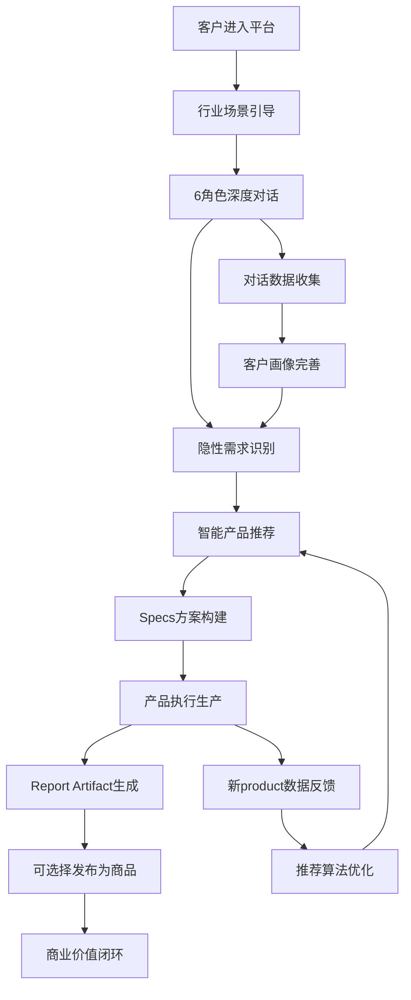

# 智链平台前端交互设计：从商业目标到完整闭环

**版本**: 前端设计v1.0 | **日期**: 2025-08-12 | **状态**: 核心设计方案  
**目标**: 基于纠正后的商业逻辑，设计完整的前端交互和商业闭环

---

## 🎯 核心商业目标与设计原则

### 明确的商业目标
```typescript
interface BusinessObjectives {
  // 首要目标行业
  primaryIndustries: ["法律", "医生", "电商"];
  
  // 核心业务场景
  coreScenario: "销售增强";
  
  // 技术分工
  technicalFocus: "前端设计与交互（后端AI由合作方提供）";
  
  // 深度客户理解
  customerInsightGoal: "识别客户未明说的基础能力缺失";
}
```

### 设计核心原则
1. **隐性需求识别优先** - 通过6个agent对话挖掘客户真实痛点
2. **产品化一切价值** - 对话过程中的所有产出都可产品化
3. **闭环商业设计** - 从需求识别到产品交付的完整闭环
4. **多身份无缝切换** - 购买者/供应商/分销商角色流动

---

## 🏗️ 整体前端架构设计

### 1. 核心页面架构
```typescript
interface PlatformArchitecture {
  // 首页入口层
  landingPages: {
    home: "智链平台主页";
    industryLanding: "行业专题页（法律/医生/电商）";
    salesEnhancement: "销售增强解决方案页";
  };
  
  // 商品发现层
  discoveryPages: {
    marketplace: "zhilink商城主页";
    workforceStore: "AI劳动力商店";
    expertModuleStore: "专家模块商店";
    marketReportStore: "市场报告商店";
    search: "智能搜索页";
  };
  
  // 对话交互层
  conversationPages: {
    chatHub: "6角色对话中心";
    needsAnalysis: "需求分析工作台";
    solutionBuilder: "方案构建器";
    specDesigner: "Specs项目设计器";
  };
  
  // 产品生产层
  productionPages: {
    specWorkspace: "Specs执行工作台";
    reportGenerator: "报告生成器";
    artifactManager: "制品管理中心";
    publishingStudio: "产品发布工作室";
  };
  
  // 商业运营层
  businessPages: {
    vendorDashboard: "供应商控制台";
    distributorPortal: "分销伙伴门户";
    analyticsCenter: "数据分析中心";
    revenueManagement: "收益管理系统";
  };
}
```

### 2. 核心交互流程设计

#### 主流程：从隐性需求到产品交付


---

## 💬 6角色对话系统前端设计

### 核心对话界面设计
```typescript
interface ConversationInterface {
  // 主对话区域
  chatArea: {
    layout: "左侧角色面板 + 中间对话区 + 右侧洞察面板";
    rolePanel: {
      alex: "需求理解专家 - 深度挖掘客户真实需求";
      sarah: "技术架构师 - 识别技术基础设施缺失";
      mike: "体验设计师 - 发现用户体验痛点";
      emma: "数据分析师 - 识别数据基建问题";
      david: "项目管理师 - 梳理实施路径";
      catherine: "战略顾问 - 商业价值分析";
    };
    
    conversationFlow: {
      welcomeStage: "行业背景了解";
      discoveryStage: "痛点深度挖掘";
      analysisStage: "隐性需求识别";
      solutionStage: "产品方案推荐";
      buildingStage: "Specs构建指导";
    };
    
    insightPanel: {
      hiddenNeeds: "识别的隐性需求";
      missingInfrastructure: "缺失的基础设施";
      recommendedProducts: "推荐的产品组合";
      valueProposition: "价值主张分析";
    };
  };
}
```

### 隐性需求识别引擎设计
```typescript
interface HiddenNeedsDetection {
  // 数据基建缺失检测
  infrastructureGaps: {
    dataDigitization: {
      detection: "询问文档处理方式，识别纸质文档数字化需求";
      solution: "推荐文档数字化workforce";
      priority: "高";
    };
    
    vectorization: {
      detection: "询问数据检索方式，识别向量化需求";
      solution: "推荐数据向量化expert_module";
      priority: "高";
    };
    
    dataIntegration: {
      detection: "了解系统集成情况，识别数据孤岛问题";
      solution: "推荐数据集成workforce";
      priority: "中";
    };
  };
  
  // 销售流程缺失检测
  salesProcessGaps: {
    leadQualification: {
      detection: "询问客户筛选流程，识别自动化需求";
      solution: "推荐销售线索评分expert_module";
      priority: "高";
    };
    
    followUpAutomation: {
      detection: "了解客户跟进方式，识别自动化机会";
      solution: "推荐客户跟进自动化workforce";
      priority: "高";
    };
    
    performanceTracking: {
      detection: "询问销售数据分析，识别分析能力缺失";
      solution: "推荐销售分析dashboard expert_module";
      priority: "中";
    };
  };
  
  // 行业特定缺失检测
  industrySpecificGaps: {
    legal: {
      caseManagement: "案件管理系统缺失";
      documentReview: "文档审核自动化需求";
      clientCommunication: "客户沟通标准化需求";
    };
    medical: {
      patientRecords: "病历数字化需求";
      appointmentOptimization: "预约优化需求";
      diagnosticSupport: "诊断辅助需求";
    };
    ecommerce: {
      inventoryOptimization: "库存优化需求";
      customerSegmentation: "客户细分需求";
      priceOptimization: "定价优化需求";
    };
  };
}
```

---

## 🛒 智链商城（zhilink marketplace）设计

### 商城主页设计
```typescript
interface MarketplaceDesign {
  // 顶部导航
  navigation: {
    categories: ["AI劳动力", "专家模块", "市场报告"];
    industryFilters: ["法律", "医生", "电商"];
    scenarioFilters: ["销售增强", "客户服务", "运营优化"];
  };
  
  // 核心展示区域
  showcaseAreas: {
    featuredProducts: "精选产品轮播";
    industrySpotlight: "行业聚焦";
    salesEnhancementHub: "销售增强专区";
    newArrivals: "新品上架";
    topRated: "热门好评";
  };
  
  // 智能推荐引擎
  recommendationEngine: {
    personalizedForYou: "基于对话历史的个性化推荐";
    frequentlyBoughtTogether: "经常一起购买";
    similarProducts: "相似产品推荐";
    industryTrending: "行业趋势产品";
  };
}
```

### 产品详情页设计
```typescript
interface ProductDetailPage {
  // 产品信息展示
  productInfo: {
    heroSection: {
      title: "产品名称";
      subtitle: "一句话价值描述";
      type: "workforce | expert_module | market_report";
      vendor: "供应商信息";
      rating: "评分和评价数";
      pricing: "定价模式";
    };
    
    detailSections: {
      overview: "产品概述";
      features: "功能特性";
      useCases: "使用场景";
      integration: "集成说明";
      documentation: "文档资料";
    };
  };
  
  // 社会化证明
  socialProof: {
    customerReviews: "客户评价";
    usageStatistics: "使用统计";
    successStories: "成功案例";
    industryEndorsements: "行业认可";
  };
  
  // 行动引导
  actionElements: {
    tryNowButton: "立即试用";
    addToSpecButton: "添加到Specs";
    buyNowButton: "立即购买";
    contactVendorButton: "联系供应商";
  };
}
```

---

## 🔧 Specs项目设计器

### Specs构建界面
```typescript
interface SpecsBuilder {
  // 项目配置区域
  projectConfig: {
    basicInfo: {
      title: "项目标题";
      industry: "所属行业";
      useCase: "使用场景";
      objectives: "项目目标";
    };
    
    targetOutcome: {
      expectedResults: "预期结果";
      successMetrics: "成功指标";
      timeline: "时间计划";
      budget: "预算范围";
    };
  };
  
  // 产品编排区域
  productOrchestration: {
    workforceSelection: {
      availableWorkforce: "可选AI劳动力";
      selectedWorkforce: "已选择的workforce";
      workflowDesign: "工作流设计";
    };
    
    expertModuleIntegration: {
      availableModules: "可选专家模块";
      selectedModules: "已选择的expert_module";
      parameterConfiguration: "参数配置";
    };
    
    dataFlowDesign: {
      inputSources: "输入数据源";
      processingSteps: "处理步骤";
      outputFormat: "输出格式";
    };
  };
  
  // 预览和验证
  previewAndValidation: {
    flowVisualization: "流程可视化";
    costEstimation: "成本估算";
    timelineProjection: "时间预估";
    riskAssessment: "风险评估";
  };
}
```

### Specs执行工作台
```typescript
interface SpecsExecutionWorkspace {
  // 执行监控
  executionMonitoring: {
    currentStatus: "当前状态";
    progressTracking: "进度跟踪";
    stepByStepProgress: "分步进度";
    realTimeMetrics: "实时指标";
  };
  
  // 中间结果展示
  intermediateResults: {
    stepOutputs: "各步骤输出";
    dataValidation: "数据验证";
    qualityChecks: "质量检查";
    errorHandling: "错误处理";
  };
  
  // 人工干预接口
  humanIntervention: {
    reviewPoints: "人工审核点";
    adjustmentInterface: "参数调整";
    feedbackInput: "反馈输入";
    approvalWorkflow: "审批流程";
  };
}
```

---

## 📊 报告制品（Report Artifact）管理

### Artifact生成界面
```typescript
interface ArtifactGeneration {
  // 报告组装
  reportAssembly: {
    contentSections: {
      executiveSummary: "执行摘要";
      methodology: "方法论";
      keyFindings: "核心发现";
      recommendations: "建议方案";
      appendices: "附录材料";
    };
    
    dataVisualization: {
      charts: "图表生成";
      tables: "表格数据";
      infographics: "信息图表";
      interactiveElements: "交互元素";
    };
    
    formatOptions: {
      pdfReport: "PDF报告";
      webDashboard: "Web仪表板";
      presentationSlides: "演示文稿";
      dataExport: "数据导出";
    };
  };
  
  // 质量保证
  qualityAssurance: {
    contentReview: "内容审核";
    dataValidation: "数据验证";
    formatChecking: "格式检查";
    complianceVerification: "合规验证";
  };
  
  // 分享和发布
  sharingAndPublishing: {
    privateSharing: "私有分享";
    teamCollaboration: "团队协作";
    clientDelivery: "客户交付";
    marketplacePublishing: "市场发布";
  };
}
```

### 商品发布工作室
```typescript
interface PublishingStudio {
  // 商品化配置
  productConfiguration: {
    marketInfo: {
      title: "市场标题";
      description: "产品描述";
      tags: "标签分类";
      targetAudience: "目标受众";
    };
    
    pricingStrategy: {
      pricingModel: "定价模式";
      basePrice: "基础价格";
      tieredPricing: "分层定价";
      discountStrategy: "折扣策略";
    };
    
    distributionRights: {
      exclusiveRights: "独家权利";
      distributorCommission: "分销佣金";
      territoryLimitations: "地域限制";
      usageLicensing: "使用许可";
    };
  };
  
  // 营销材料
  marketingMaterials: {
    productImages: "产品图片";
    demoVideos: "演示视频";
    successStories: "成功案例";
    testimonials: "客户推荐";
  };
  
  // 发布流程
  publishingWorkflow: {
    contentReview: "内容审核";
    complianceCheck: "合规检查";
    qualityAssurance: "质量保证";
    marketplaceApproval: "市场审批";
  };
}
```

---

## 🔄 商业闭环设计

### 数据流闭环
```typescript
interface DataFlowLoop {
  // 用户行为数据收集
  userBehaviorCollection: {
    conversationData: "对话数据";
    browsingBehavior: "浏览行为";
    purchasePatterns: "购买模式";
    usageMetrics: "使用指标";
  };
  
  // AI学习和优化
  aiLearningOptimization: {
    needsDetectionImprovement: "需求识别改进";
    recommendationAccuracy: "推荐准确性";
    conversationQuality: "对话质量";
    productMatching: "产品匹配";
  };
  
  // 产品生态丰富
  productEcosystemEnrichment: {
    newProductGeneration: "新产品生成";
    existingProductOptimization: "现有产品优化";
    crossProductIntegration: "跨产品集成";
    qualityImprovement: "质量提升";
  };
  
  // 商业价值实现
  businessValueRealization: {
    revenueGrowth: "收入增长";
    customerSatisfaction: "客户满意度";
    ecosystemHealth: "生态健康度";
    marketExpansion: "市场扩张";
  };
}
```

### 收益分配系统
```typescript
interface RevenueDistribution {
  // 基础分成模型
  basicCommissionModel: {
    platformFee: "平台服务费 15%";
    vendorRevenue: "供应商收入 70%";
    distributorCommission: "分销佣金 15%";
  };
  
  // 动态分成调整
  dynamicCommissionAdjustment: {
    performanceBonus: "绩效奖金";
    volumeDiscount: "批量折扣";
    loyaltyReward: "忠诚度奖励";
    qualityIncentive: "质量激励";
  };
  
  // 特殊产品分成
  specialProductCommission: {
    exclusiveProducts: "独家产品";
    premiumProducts: "高端产品";
    collaborativeProducts: "合作产品";
    platformStrategicProducts: "平台战略产品";
  };
}
```

---

## 🎨 前端技术实现架构

### 核心技术栈
```typescript
interface FrontendTechStack {
  // 框架和库
  coreFramework: {
    nextjs: "Next.js 14 - 服务端渲染和路由";
    react: "React 18 - 组件化开发";
    typescript: "TypeScript - 类型安全";
    tailwindcss: "Tailwind CSS - 原子化样式";
  };
  
  // 状态管理
  stateManagement: {
    zustand: "全局状态管理";
    reactQuery: "服务端状态管理";
    contextAPI: "组件间状态共享";
    localState: "本地状态管理";
  };
  
  // UI组件库
  uiComponents: {
    shadcnUI: "shadcn/ui - 基础组件";
    radixUI: "Radix UI - 无样式组件";
    framerMotion: "Framer Motion - 动画";
    lucideIcons: "Lucide Icons - 图标";
  };
  
  // 数据通信
  dataCommunication: {
    apiClient: "封装的API客户端";
    websocket: "实时通信";
    serverSentEvents: "服务端推送";
    graphqlClient: "GraphQL查询";
  };
}
```

### 组件架构设计
```typescript
interface ComponentArchitecture {
  // 布局组件
  layoutComponents: {
    AppLayout: "应用主布局";
    HeaderNavigation: "顶部导航";
    SidebarMenu: "侧边菜单";
    FooterSection: "底部区域";
  };
  
  // 业务组件
  businessComponents: {
    ConversationInterface: "对话界面组件";
    ProductCard: "产品卡片组件";
    SpecsBuilder: "方案构建器组件";
    ReportViewer: "报告查看器组件";
  };
  
  // 通用组件
  commonComponents: {
    SearchBar: "搜索栏";
    FilterPanel: "筛选面板";
    LoadingSpinner: "加载动画";
    ErrorBoundary: "错误边界";
  };
  
  // 特殊组件
  specializedComponents: {
    AIChat: "AI对话组件";
    ProductRecommendation: "产品推荐组件";
    DataVisualization: "数据可视化组件";
    FileUploader: "文件上传组件";
  };
}
```

---

## 📱 响应式设计和移动端优化

### 移动端交互优化
```typescript
interface MobileOptimization {
  // 对话界面移动端适配
  conversationMobile: {
    verticalLayout: "垂直布局优化";
    swipeGestures: "滑动手势导航";
    voiceInput: "语音输入支持";
    quickActions: "快捷操作按钮";
  };
  
  // 商城移动端体验
  marketplaceMobile: {
    cardBasedLayout: "卡片式布局";
    infiniteScroll: "无限滚动";
    touchOptimizedFilters: "触摸优化筛选";
    oneClickPurchase: "一键购买";
  };
  
  // 报告查看移动端
  reportViewingMobile: {
    adaptiveContentDisplay: "自适应内容展示";
    pinchToZoom: "缩放手势";
    offlineReading: "离线阅读";
    shareFunctionality: "分享功能";
  };
}
```

---

## 🚀 实施路线图

### Phase 1: 核心对话系统（Month 1-2）
```yaml
目标: 建立6角色对话系统和隐性需求识别
关键功能:
  - 6角色对话界面
  - 基础需求识别
  - 简单产品推荐
  - 用户注册和身份管理

技术实现:
  - React组件架构搭建
  - WebSocket实时通信
  - 基础状态管理
  - 移动端响应式适配
```

### Phase 2: 商城和产品管理（Month 3-4）
```yaml
目标: 完成商城功能和产品管理系统
关键功能:
  - 三类产品展示
  - 搜索和筛选
  - 产品详情页
  - 购买和支付流程

技术实现:
  - 产品数据管理
  - 支付系统集成
  - 用户权限管理
  - 性能优化
```

### Phase 3: Specs系统和报告生成（Month 5-6）
```yaml
目标: 实现完整的Specs构建和执行系统
关键功能:
  - Specs设计器
  - 执行监控工作台
  - 报告生成系统
  - 商品发布功能

技术实现:
  - 复杂工作流管理
  - 文件生成和处理
  - 数据可视化
  - 批量操作优化
```

---

## 📊 成功指标和监控

### 关键业务指标
```typescript
interface BusinessMetrics {
  // 用户参与指标
  userEngagement: {
    conversationCompletionRate: "对话完成率 > 85%";
    hiddenNeedsDetectionRate: "隐性需求识别率 > 70%";
    productRecommendationAccuracy: "产品推荐准确率 > 80%";
    userRetentionRate: "用户留存率 > 75%";
  };
  
  // 商业转化指标
  businessConversion: {
    browseToConversationRate: "浏览到对话转化率 > 25%";
    conversationToPurchaseRate: "对话到购买转化率 > 15%";
    specsCompletionRate: "Specs完成率 > 60%";
    artifactToProductRate: "制品商品化率 > 30%";
  };
  
  // 平台生态指标
  platformEcosystem: {
    vendorGrowthRate: "供应商增长率 > 20%/月";
    distributorActiveRate: "分销商活跃率 > 65%";
    productDiversityIndex: "产品多样性指数";
    crossPlatformSynergy: "跨平台协同效应";
  };
}
```

---

**文档维护者**: 前端架构团队  
**最后更新**: 2025年8月12日  
**文档版本**: 1.0.0 - 完整前端交互设计方案  
**核心价值**: 从商业目标到技术实现的完整前端架构设计