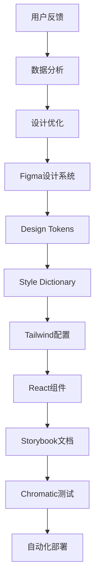

# 智链平台v2设计系统与技术实现集成指南

**版本**: v2.0 | **日期**: 2025-08-12 | **状态**: 设计系统集成标准  
**目标**: 建立设计系统与技术实现的无缝集成，确保设计理念的完整落地

---

## 🎯 集成架构总览

### 设计系统技术栈
```yaml
设计层:
  - Figma: 设计稿和设计系统库
  - Design Tokens: 设计令牌标准化
  - Storybook: 组件文档和测试

开发层:
  - Next.js 15 + React 19: 前端框架
  - TypeScript: 类型安全保障
  - Tailwind CSS + 自定义令牌: 样式系统
  - Framer Motion: 动效实现
  - Radix UI: 无障碍基础组件

集成工具链:
  - Figma Tokens: 设计令牌同步
  - Style Dictionary: 令牌转换工具
  - Chromatic: 视觉回归测试
  - GitHub Actions: CI/CD自动化
```

### 集成工作流程


---

## 🎨 Design Tokens 实现系统

### 核心令牌架构
```json
{
  "cloudsway": {
    "color": {
      "primitive": {
        "slate": {
          "50": { "value": "#f8fafc" },
          "900": { "value": "#0f172a" }
        },
        "indigo": {
          "400": { "value": "#818cf8" },
          "500": { "value": "#6366f1" },
          "600": { "value": "#4f46e5" }
        }
      },
      "semantic": {
        "background": {
          "main": { "value": "{cloudsway.color.primitive.slate.900}" },
          "card": { "value": "{cloudsway.color.primitive.slate.800}" },
          "glass": { "value": "rgba(30, 41, 59, 0.8)" }
        },
        "text": {
          "primary": { "value": "{cloudsway.color.primitive.slate.50}" },
          "secondary": { "value": "{cloudsway.color.primitive.slate.300}" },
          "muted": { "value": "{cloudsway.color.primitive.slate.500}" }
        },
        "brand": {
          "primary": { "value": "{cloudsway.color.primitive.indigo.500}" },
          "secondary": { "value": "{cloudsway.color.primitive.cyan.500}" },
          "accent": { "value": "{cloudsway.color.primitive.purple.500}" }
        }
      }
    },
    "typography": {
      "scale": {
        "xs": { "value": "0.75rem" },
        "sm": { "value": "0.875rem" },
        "base": { "value": "1rem" },
        "lg": { "value": "1.125rem" },
        "xl": { "value": "1.25rem" },
        "2xl": { "value": "1.5rem" },
        "3xl": { "value": "1.875rem" },
        "4xl": { "value": "2.25rem" }
      },
      "weight": {
        "normal": { "value": "400" },
        "medium": { "value": "500" },
        "semibold": { "value": "600" },
        "bold": { "value": "700" }
      },
      "lineHeight": {
        "tight": { "value": "1.25" },
        "normal": { "value": "1.5" },
        "relaxed": { "value": "1.75" }
      }
    },
    "spacing": {
      "scale": {
        "1": { "value": "0.25rem" },
        "2": { "value": "0.5rem" },
        "3": { "value": "0.75rem" },
        "4": { "value": "1rem" },
        "6": { "value": "1.5rem" },
        "8": { "value": "2rem" },
        "12": { "value": "3rem" },
        "16": { "value": "4rem" },
        "20": { "value": "5rem" },
        "24": { "value": "6rem" }
      }
    },
    "radius": {
      "none": { "value": "0" },
      "sm": { "value": "0.25rem" },
      "base": { "value": "0.5rem" },
      "md": { "value": "0.75rem" },
      "lg": { "value": "1rem" },
      "xl": { "value": "1.5rem" },
      "full": { "value": "9999px" }
    },
    "shadow": {
      "sm": { "value": "0 1px 3px 0 rgba(0, 0, 0, 0.1)" },
      "base": { "value": "0 1px 3px 0 rgba(0, 0, 0, 0.1), 0 1px 2px -1px rgba(0, 0, 0, 0.1)" },
      "md": { "value": "0 4px 6px -1px rgba(0, 0, 0, 0.1)" },
      "lg": { "value": "0 10px 15px -3px rgba(0, 0, 0, 0.1)" },
      "brand": { "value": "0 10px 30px rgba(99, 102, 241, 0.2)" },
      "glass": { "value": "0 20px 40px rgba(0, 0, 0, 0.1), 0 0 0 1px rgba(255, 255, 255, 0.05)" }
    },
    "motion": {
      "duration": {
        "fast": { "value": "150ms" },
        "base": { "value": "300ms" },
        "slow": { "value": "500ms" }
      },
      "easing": {
        "ease": { "value": "cubic-bezier(0.4, 0, 0.2, 1)" },
        "easeIn": { "value": "cubic-bezier(0.4, 0, 1, 1)" },
        "easeOut": { "value": "cubic-bezier(0, 0, 0.2, 1)" },
        "easeInOut": { "value": "cubic-bezier(0.4, 0, 0.2, 1)" }
      }
    }
  }
}
```

### Style Dictionary配置
```javascript
// style-dictionary.config.js
const StyleDictionary = require('style-dictionary');

// 自定义转换器
StyleDictionary.registerTransform({
  name: 'size/tailwind',
  type: 'value',
  matcher: (token) => token.attributes.category === 'size',
  transformer: (token) => {
    const value = parseFloat(token.value);
    if (value === 0) return '0';
    return `${value / 16}rem`;
  }
});

// 自定义格式化器
StyleDictionary.registerFormat({
  name: 'css/tailwind-utilities',
  formatter: (dictionary) => {
    return dictionary.allTokens.map(token => {
      const cssVar = `--${token.name.replace(/\./g, '-')}`;
      return `  ${cssVar}: ${token.value};`;
    }).join('\n');
  }
});

module.exports = {
  source: ['tokens/**/*.json'],
  platforms: {
    css: {
      transformGroup: 'css',
      buildPath: 'src/styles/',
      files: [{
        destination: 'tokens.css',
        format: 'css/variables',
        options: {
          outputReferences: true
        }
      }]
    },
    tailwind: {
      transformGroup: 'css',
      buildPath: 'src/styles/',
      files: [{
        destination: 'tailwind-tokens.js',
        format: 'javascript/module-flat'
      }]
    }
  }
};
```

---

## 🧩 组件系统实现

### 基础组件架构
```tsx
// src/components/ui/button/button.tsx
import * as React from 'react';
import { Slot } from '@radix-ui/react-slot';
import { cva, type VariantProps } from 'class-variance-authority';
import { cn } from '@/lib/utils';

const buttonVariants = cva(
  // 基础样式 - 直接映射Design Tokens
  [
    'inline-flex items-center justify-center whitespace-nowrap',
    'rounded-md text-sm font-medium transition-colors',
    'focus-visible:outline-none focus-visible:ring-2',
    'focus-visible:ring-offset-2 disabled:pointer-events-none disabled:opacity-50',
  ],
  {
    variants: {
      variant: {
        // 主要按钮 - 使用品牌色彩令牌
        primary: [
          'bg-gradient-to-r from-brand-primary to-brand-accent',
          'text-white hover:from-brand-primary/90 hover:to-brand-accent/90',
          'shadow-brand hover:shadow-brand-lg',
          'transform hover:-translate-y-0.5 active:translate-y-0',
        ],
        // 次要按钮 - 使用语义化令牌
        secondary: [
          'bg-background-glass border border-semantic-border-primary',
          'text-text-primary hover:bg-background-overlay',
          'backdrop-blur-lg',
        ],
        // 幽灵按钮
        ghost: [
          'text-brand-primary hover:bg-brand-primary/10',
          'hover:text-brand-primary-600',
        ],
        // 危险按钮
        destructive: [
          'bg-red-500 text-white hover:bg-red-600',
          'shadow-sm hover:shadow-md',
        ],
      },
      size: {
        sm: 'h-8 px-3 text-xs',
        md: 'h-10 px-4 py-2',
        lg: 'h-12 px-6 text-base',
        xl: 'h-14 px-8 text-lg',
      },
    },
    defaultVariants: {
      variant: 'primary',
      size: 'md',
    },
  }
);

export interface ButtonProps
  extends React.ButtonHTMLAttributes<HTMLButtonElement>,
    VariantProps<typeof buttonVariants> {
  asChild?: boolean;
  loading?: boolean;
  leftIcon?: React.ReactNode;
  rightIcon?: React.ReactNode;
}

const Button = React.forwardRef<HTMLButtonElement, ButtonProps>(
  ({ 
    className, 
    variant, 
    size, 
    asChild = false, 
    loading = false,
    leftIcon,
    rightIcon,
    children,
    disabled,
    ...props 
  }, ref) => {
    const Comp = asChild ? Slot : 'button';
    
    return (
      <Comp
        className={cn(buttonVariants({ variant, size }), className)}
        ref={ref}
        disabled={disabled || loading}
        {...props}
      >
        {loading && (
          <svg 
            className="mr-2 h-4 w-4 animate-spin" 
            xmlns="http://www.w3.org/2000/svg" 
            fill="none" 
            viewBox="0 0 24 24"
          >
            <circle 
              className="opacity-25" 
              cx="12" 
              cy="12" 
              r="10" 
              stroke="currentColor" 
              strokeWidth="4"
            />
            <path 
              className="opacity-75" 
              fill="currentColor" 
              d="M4 12a8 8 0 018-8V0C5.373 0 0 5.373 0 12h4zm2 5.291A7.962 7.962 0 014 12H0c0 3.042 1.135 5.824 3 7.938l3-2.647z"
            />
          </svg>
        )}
        {leftIcon && !loading && (
          <span className="mr-2">{leftIcon}</span>
        )}
        {children}
        {rightIcon && (
          <span className="ml-2">{rightIcon}</span>
        )}
      </Comp>
    );
  }
);

Button.displayName = 'Button';

export { Button, buttonVariants };
```

### 复合组件实现
```tsx
// src/components/ui/product-card/product-card.tsx
import React from 'react';
import { Card, CardContent, CardFooter, CardHeader } from '@/components/ui/card';
import { Button } from '@/components/ui/button';
import { Badge } from '@/components/ui/badge';
import { Avatar, AvatarFallback, AvatarImage } from '@/components/ui/avatar';
import { Star, Heart, Download, Play, Eye } from 'lucide-react';
import { cn } from '@/lib/utils';
import { motion } from 'framer-motion';

interface ProductCardProps {
  product: {
    id: string;
    name: string;
    subtitle: string;
    description: string;
    type: 'workforce' | 'expert_module' | 'market_report';
    vendor: {
      name: string;
      avatar: string;
    };
    pricing: {
      model: 'free' | 'trial' | 'one_time' | 'subscription';
      price: number;
      unit?: string;
    };
    stats: {
      likes: number;
      installs: number;
      runs: number;
      rating: number;
    };
    tags: string[];
    matchScore?: number;
  };
  variant?: 'market' | 'recommendation';
  onTry?: () => void;
  onPurchase?: () => void;
  onAddToSpecs?: () => void;
}

// 产品类型样式映射 - 使用Design Tokens
const typeStyles = {
  workforce: {
    border: 'border-brand-primary/20',
    background: 'bg-brand-primary/5',
    badge: 'bg-brand-primary/20 text-brand-primary border-brand-primary/40',
    label: 'AI劳动力'
  },
  expert_module: {
    border: 'border-brand-accent/20',
    background: 'bg-brand-accent/5',
    badge: 'bg-brand-accent/20 text-brand-accent border-brand-accent/40',
    label: '专家模块'
  },
  market_report: {
    border: 'border-brand-secondary/20',
    background: 'bg-brand-secondary/5',
    badge: 'bg-brand-secondary/20 text-brand-secondary border-brand-secondary/40',
    label: '市场报告'
  },
};

const ProductCard: React.FC<ProductCardProps> = ({
  product,
  variant = 'market',
  onTry,
  onPurchase,
  onAddToSpecs
}) => {
  const typeStyle = typeStyles[product.type];

  return (
    <motion.div
      initial={{ opacity: 0, y: 20 }}
      animate={{ opacity: 1, y: 0 }}
      whileHover={{ y: -4 }}
      transition={{ 
        duration: 0.2, 
        ease: [0.4, 0, 0.2, 1] // 使用Design Token的easing
      }}
    >
      <Card className={cn(
        'group relative overflow-hidden transition-all duration-300',
        'hover:shadow-brand border-2',
        typeStyle.border,
        typeStyle.background,
        variant === 'recommendation' && 'border-l-4 border-l-brand-primary'
      )}>
        {/* 产品类型标识 */}
        <div className="absolute top-4 right-4 z-10">
          <Badge className={cn('text-xs font-medium border', typeStyle.badge)}>
            {typeStyle.label}
          </Badge>
        </div>

        <CardHeader className="pb-4">
          {/* 供应商信息 */}
          <div className="flex items-center gap-2 mb-3">
            <Avatar className="w-6 h-6">
              <AvatarImage src={product.vendor.avatar} alt={product.vendor.name} />
              <AvatarFallback className="text-xs">
                {product.vendor.name.slice(0, 2)}
              </AvatarFallback>
            </Avatar>
            <span className="text-xs text-text-muted">{product.vendor.name}</span>
          </div>

          {/* 产品标题 */}
          <div>
            <h3 className="text-lg font-semibold text-text-primary mb-2 line-clamp-2">
              {product.name}
            </h3>
            <p className="text-sm text-text-secondary line-clamp-2">
              {product.subtitle}
            </p>
          </div>
        </CardHeader>

        <CardContent className="pb-4">
          {/* 产品描述 */}
          <p className="text-sm text-text-muted mb-4 line-clamp-3">
            {product.description}
          </p>

          {/* 标签 */}
          <div className="flex flex-wrap gap-1.5 mb-4">
            {product.tags.slice(0, 3).map((tag, index) => (
              <Badge key={index} variant="outline" className="text-xs">
                {tag}
              </Badge>
            ))}
            {product.tags.length > 3 && (
              <Badge variant="outline" className="text-xs">
                +{product.tags.length - 3}
              </Badge>
            )}
          </div>

          {/* 统计信息 */}
          <div className="flex items-center justify-between text-xs text-text-muted mb-4">
            <div className="flex items-center gap-4">
              <div className="flex items-center gap-1">
                <Heart className="w-3 h-3" />
                <span>{product.stats.likes}</span>
              </div>
              <div className="flex items-center gap-1">
                <Download className="w-3 h-3" />
                <span>{product.stats.installs}</span>
              </div>
              <div className="flex items-center gap-1">
                <Play className="w-3 h-3" />
                <span>{product.stats.runs}</span>
              </div>
            </div>
            <div className="flex items-center gap-1">
              <Star className="w-3 h-3 fill-yellow-400 text-yellow-400" />
              <span>{product.stats.rating.toFixed(1)}</span>
            </div>
          </div>

          {/* 匹配度（推荐卡片专用） */}
          {variant === 'recommendation' && product.matchScore && (
            <motion.div 
              className="flex items-center justify-between mb-4 p-2 bg-brand-primary/10 rounded-lg border border-brand-primary/20"
              initial={{ scale: 0.95 }}
              animate={{ scale: 1 }}
              transition={{ delay: 0.1 }}
            >
              <div className="flex items-center gap-2">
                <span className="text-lg font-bold bg-gradient-to-r from-brand-primary to-brand-accent bg-clip-text text-transparent">
                  {product.matchScore}%
                </span>
                <span className="text-xs text-text-muted">匹配度</span>
              </div>
              <span className="text-xs text-text-secondary">智能推荐</span>
            </motion.div>
          )}

          {/* 定价信息 */}
          <div className="flex items-center justify-between">
            <div className="flex items-baseline gap-1">
              <span className="text-xl font-bold text-text-primary font-mono">
                {product.pricing.model === 'free' ? '免费' : `¥${product.pricing.price}`}
              </span>
              {product.pricing.unit && (
                <span className="text-xs text-text-muted">/{product.pricing.unit}</span>
              )}
            </div>
            <Badge variant="outline" className="text-xs">
              {product.pricing.model === 'free' && '免费'}
              {product.pricing.model === 'trial' && '试用'}
              {product.pricing.model === 'one_time' && '一次性'}
              {product.pricing.model === 'subscription' && '订阅'}
            </Badge>
          </div>
        </CardContent>

        <CardFooter className="pt-0">
          <div className="flex gap-2 w-full">
            {variant === 'market' ? (
              <>
                <Button 
                  variant="ghost" 
                  size="sm" 
                  className="flex-1"
                  onClick={onTry}
                  leftIcon={<Eye className="w-4 h-4" />}
                >
                  试用
                </Button>
                <Button 
                  variant="primary" 
                  size="sm" 
                  className="flex-2"
                  onClick={onPurchase}
                >
                  立即购买
                </Button>
              </>
            ) : (
              <>
                <Button 
                  variant="secondary" 
                  size="sm" 
                  className="flex-1"
                  onClick={onTry}
                >
                  试用
                </Button>
                <Button 
                  variant="ghost" 
                  size="sm" 
                  className="flex-1"
                  onClick={() => {/* 查看详情 */}}
                >
                  详情
                </Button>
                <Button 
                  variant="primary" 
                  size="sm" 
                  className="flex-2"
                  onClick={onAddToSpecs}
                >
                  添加到方案
                </Button>
              </>
            )}
          </div>
        </CardFooter>
      </Card>
    </motion.div>
  );
};

export default ProductCard;
```

---

## 📚 Storybook集成配置

### Storybook主配置
```typescript
// .storybook/main.ts
import type { StorybookConfig } from '@storybook/nextjs';

const config: StorybookConfig = {
  stories: [
    '../src/**/*.stories.@(js|jsx|ts|tsx|mdx)',
    '../src/**/*.story.@(js|jsx|ts|tsx|mdx)',
  ],
  addons: [
    '@storybook/addon-essentials',
    '@storybook/addon-interactions',
    '@storybook/addon-a11y',
    '@storybook/addon-design-tokens',
    '@chromatic-com/storybook',
  ],
  framework: {
    name: '@storybook/nextjs',
    options: {},
  },
  docs: {
    autodocs: 'tag',
  },
  typescript: {
    check: false,
    reactDocgen: 'react-docgen-typescript',
    reactDocgenTypescriptOptions: {
      shouldExtractLiteralValuesFromEnum: true,
      propFilter: (prop) => (prop.parent ? !/node_modules/.test(prop.parent.fileName) : true),
    },
  },
};

export default config;
```

### 组件Story示例
```typescript
// src/components/ui/button/button.stories.tsx
import type { Meta, StoryObj } from '@storybook/react';
import { fn } from '@storybook/test';
import { Button } from './button';
import { Heart, Download, Star } from 'lucide-react';

const meta = {
  title: 'UI/Button',
  component: Button,
  parameters: {
    layout: 'centered',
    docs: {
      description: {
        component: '按钮组件基于Design Tokens构建，支持多种变体和尺寸。所有样式都与Figma设计系统保持一致。',
      },
    },
  },
  tags: ['autodocs'],
  argTypes: {
    variant: {
      control: { type: 'select' },
      options: ['primary', 'secondary', 'ghost', 'destructive'],
      description: '按钮变体，对应不同的使用场景',
    },
    size: {
      control: { type: 'select' },
      options: ['sm', 'md', 'lg', 'xl'],
      description: '按钮尺寸',
    },
    loading: {
      control: 'boolean',
      description: '加载状态',
    },
    disabled: {
      control: 'boolean',
      description: '禁用状态',
    },
  },
  args: { onClick: fn() },
} satisfies Meta<typeof Button>;

export default meta;
type Story = StoryObj<typeof meta>;

// 基础用法
export const Default: Story = {
  args: {
    children: '按钮',
  },
};

// 变体展示
export const Variants: Story = {
  render: () => (
    <div className="flex gap-4 flex-wrap">
      <Button variant="primary">主要按钮</Button>
      <Button variant="secondary">次要按钮</Button>
      <Button variant="ghost">幽灵按钮</Button>
      <Button variant="destructive">危险按钮</Button>
    </div>
  ),
};

// 尺寸展示
export const Sizes: Story = {
  render: () => (
    <div className="flex gap-4 items-center">
      <Button size="sm">小尺寸</Button>
      <Button size="md">中尺寸</Button>
      <Button size="lg">大尺寸</Button>
      <Button size="xl">超大尺寸</Button>
    </div>
  ),
};

// 带图标
export const WithIcons: Story = {
  render: () => (
    <div className="flex gap-4 flex-wrap">
      <Button leftIcon={<Heart className="w-4 h-4" />}>
        收藏
      </Button>
      <Button rightIcon={<Download className="w-4 h-4" />}>
        下载
      </Button>
      <Button leftIcon={<Star className="w-4 h-4" />} rightIcon={<Download className="w-4 h-4" />}>
        评价并下载
      </Button>
    </div>
  ),
};

// 状态展示
export const States: Story = {
  render: () => (
    <div className="flex gap-4 flex-wrap">
      <Button>正常状态</Button>
      <Button loading>加载中</Button>
      <Button disabled>禁用状态</Button>
    </div>
  ),
};

// 产品场景应用
export const ProductScenarios: Story = {
  render: () => (
    <div className="flex gap-4 flex-col max-w-md">
      <div className="p-4 bg-background-glass rounded-lg border border-semantic-border-primary">
        <h3 className="font-semibold mb-2">产品卡片操作</h3>
        <div className="flex gap-2">
          <Button variant="ghost" size="sm">试用</Button>
          <Button variant="primary" size="sm">立即购买</Button>
        </div>
      </div>
      
      <div className="p-4 bg-background-glass rounded-lg border border-semantic-border-primary">
        <h3 className="font-semibold mb-2">Chat页面操作</h3>
        <div className="flex gap-2">
          <Button variant="secondary" size="sm">查看详情</Button>
          <Button variant="primary" size="sm">添加到方案</Button>
        </div>
      </div>
    </div>
  ),
  parameters: {
    docs: {
      description: {
        story: '展示按钮在实际产品场景中的应用，确保与设计系统的一致性。',
      },
    },
  },
};
```

---

## 🔄 自动化测试与质量保证

### Visual Regression Testing
```typescript
// .circleci/config.yml (或GitHub Actions)
version: 2.1

jobs:
  chromatic-deployment:
    docker:
      - image: cimg/node:18.17
    working_directory: ~/repo
    steps:
      - checkout
      - restore_cache:
          keys:
            - v1-dependencies-{{ checksum "package.json" }}
      - run: npm ci
      - run:
          name: Run Chromatic
          command: |
            npx chromatic --project-token=$CHROMATIC_PROJECT_TOKEN \
                         --build-script-name=build-storybook \
                         --exit-zero-on-changes
      - store_artifacts:
          path: storybook-static

workflows:
  ui-tests:
    jobs:
      - chromatic-deployment:
          filters:
            branches:
              only:
                - main
                - develop
```

### Design Token同步验证
```javascript
// scripts/validate-tokens.js
const fs = require('fs');
const path = require('path');

// 读取设计令牌
const tokens = JSON.parse(fs.readFileSync('./tokens/cloudsway.json', 'utf8'));

// 读取Tailwind配置
const tailwindConfig = require('./tailwind.config.js');

// 验证令牌同步
function validateTokenSync() {
  const errors = [];
  
  // 验证颜色令牌
  const colorTokens = tokens.cloudsway.color.semantic;
  const tailwindColors = tailwindConfig.theme.extend.colors.cloudsway;
  
  Object.keys(colorTokens).forEach(category => {
    Object.keys(colorTokens[category]).forEach(key => {
      const tokenPath = `cloudsway.${category}.${key}`;
      const tailwindPath = `cloudsway-${category}-${key}`;
      
      if (!tailwindColors[category] || !tailwindColors[category][key]) {
        errors.push(`Missing Tailwind color: ${tailwindPath}`);
      }
    });
  });
  
  // 验证间距令牌
  const spacingTokens = tokens.cloudsway.spacing.scale;
  const tailwindSpacing = tailwindConfig.theme.extend.spacing;
  
  Object.keys(spacingTokens).forEach(key => {
    if (!tailwindSpacing[key]) {
      errors.push(`Missing Tailwind spacing: ${key}`);
    }
  });
  
  if (errors.length > 0) {
    console.error('Token synchronization errors:');
    errors.forEach(error => console.error(`  - ${error}`));
    process.exit(1);
  } else {
    console.log('✅ All tokens are synchronized');
  }
}

validateTokenSync();
```

### 组件API一致性测试
```typescript
// src/__tests__/component-api.test.tsx
import { render, screen } from '@testing-library/react';
import userEvent from '@testing-library/user-event';
import { Button } from '@/components/ui/button';
import { ProductCard } from '@/components/ui/product-card';

describe('Component API Consistency', () => {
  describe('Button Component', () => {
    it('should render all variants correctly', () => {
      const variants = ['primary', 'secondary', 'ghost', 'destructive'] as const;
      
      variants.forEach(variant => {
        render(<Button variant={variant}>Test Button</Button>);
        const button = screen.getByRole('button', { name: 'Test Button' });
        expect(button).toHaveClass(`btn-${variant}`);
      });
    });

    it('should handle loading state', () => {
      render(<Button loading>Loading Button</Button>);
      const button = screen.getByRole('button');
      expect(button).toBeDisabled();
      expect(screen.getByRole('img', { hidden: true })).toBeInTheDocument(); // spinner
    });

    it('should support keyboard navigation', async () => {
      const user = userEvent.setup();
      const handleClick = jest.fn();
      
      render(<Button onClick={handleClick}>Clickable Button</Button>);
      const button = screen.getByRole('button');
      
      await user.tab();
      expect(button).toHaveFocus();
      
      await user.keyboard('{Enter}');
      expect(handleClick).toHaveBeenCalledTimes(1);
    });
  });

  describe('ProductCard Component', () => {
    const mockProduct = {
      id: '1',
      name: 'Test Product',
      subtitle: 'Test Subtitle',
      description: 'Test Description',
      type: 'workforce' as const,
      vendor: { name: 'Test Vendor', avatar: '/test-avatar.jpg' },
      pricing: { model: 'free' as const, price: 0 },
      stats: { likes: 10, installs: 100, runs: 1000, rating: 4.5 },
      tags: ['test', 'ai'],
    };

    it('should render product information correctly', () => {
      render(<ProductCard product={mockProduct} />);
      
      expect(screen.getByText('Test Product')).toBeInTheDocument();
      expect(screen.getByText('Test Subtitle')).toBeInTheDocument();
      expect(screen.getByText('Test Vendor')).toBeInTheDocument();
      expect(screen.getByText('AI劳动力')).toBeInTheDocument();
    });

    it('should handle different product types', () => {
      const types = ['workforce', 'expert_module', 'market_report'] as const;
      const labels = ['AI劳动力', '专家模块', '市场报告'];
      
      types.forEach((type, index) => {
        const product = { ...mockProduct, type };
        render(<ProductCard product={product} />);
        expect(screen.getByText(labels[index])).toBeInTheDocument();
      });
    });
  });
});
```

---

## 🚀 CI/CD集成流程

### GitHub Actions工作流
```yaml
# .github/workflows/design-system.yml
name: Design System CI/CD

on:
  push:
    branches: [ main, develop ]
    paths: 
      - 'src/components/**'
      - 'tokens/**'
      - 'src/styles/**'
  pull_request:
    branches: [ main ]
    paths:
      - 'src/components/**'
      - 'tokens/**'
      - 'src/styles/**'

jobs:
  validate-design-tokens:
    runs-on: ubuntu-latest
    steps:
      - uses: actions/checkout@v4
      - uses: actions/setup-node@v4
        with:
          node-version: '18'
          cache: 'npm'
      
      - name: Install dependencies
        run: npm ci
      
      - name: Build design tokens
        run: npm run build:tokens
      
      - name: Validate token synchronization
        run: node scripts/validate-tokens.js

  test-components:
    runs-on: ubuntu-latest
    steps:
      - uses: actions/checkout@v4
      - uses: actions/setup-node@v4
        with:
          node-version: '18'
          cache: 'npm'
      
      - name: Install dependencies
        run: npm ci
      
      - name: Run component tests
        run: npm run test:components
      
      - name: Run accessibility tests
        run: npm run test:a11y

  visual-regression:
    runs-on: ubuntu-latest
    steps:
      - uses: actions/checkout@v4
        with:
          fetch-depth: 0
      
      - uses: actions/setup-node@v4
        with:
          node-version: '18'
          cache: 'npm'
      
      - name: Install dependencies
        run: npm ci
      
      - name: Build Storybook
        run: npm run build-storybook
      
      - name: Run Chromatic
        uses: chromaui/action@v1
        with:
          projectToken: ${{ secrets.CHROMATIC_PROJECT_TOKEN }}
          buildScriptName: 'build-storybook'
          exitZeroOnChanges: true

  build-design-system:
    needs: [validate-design-tokens, test-components]
    runs-on: ubuntu-latest
    if: github.ref == 'refs/heads/main'
    steps:
      - uses: actions/checkout@v4
      - uses: actions/setup-node@v4
        with:
          node-version: '18'
          cache: 'npm'
      
      - name: Install dependencies
        run: npm ci
      
      - name: Build design system package
        run: npm run build:design-system
      
      - name: Publish to npm
        if: github.event_name == 'push'
        run: |
          echo "//registry.npmjs.org/:_authToken=${{ secrets.NPM_TOKEN }}" > ~/.npmrc
          npm publish --access public
        env:
          NODE_AUTH_TOKEN: ${{ secrets.NPM_TOKEN }}
```

### 自动化部署脚本
```bash
#!/bin/bash
# scripts/deploy-design-system.sh

set -e

echo "🚀 Starting design system deployment..."

# 1. 验证设计令牌
echo "📊 Validating design tokens..."
node scripts/validate-tokens.js

# 2. 构建设计令牌
echo "🎨 Building design tokens..."
npm run build:tokens

# 3. 运行测试
echo "🧪 Running tests..."
npm run test:components
npm run test:a11y

# 4. 构建Storybook
echo "📚 Building Storybook..."
npm run build-storybook

# 5. 运行视觉回归测试
echo "👀 Running visual regression tests..."
npx chromatic --exit-zero-on-changes

# 6. 构建设计系统包
echo "📦 Building design system package..."
npm run build:design-system

# 7. 生成变更日志
echo "📝 Generating changelog..."
npm run changelog

echo "✅ Design system deployment completed!"
```

---

## 📊 设计系统监控与指标

### 使用情况追踪
```typescript
// src/lib/design-system-analytics.ts
interface ComponentUsageEvent {
  component: string;
  variant?: string;
  props: Record<string, any>;
  timestamp: number;
  userId?: string;
  sessionId: string;
}

class DesignSystemAnalytics {
  private events: ComponentUsageEvent[] = [];

  trackComponentUsage(
    component: string, 
    variant?: string, 
    props: Record<string, any> = {}
  ) {
    if (process.env.NODE_ENV === 'production') {
      const event: ComponentUsageEvent = {
        component,
        variant,
        props: this.sanitizeProps(props),
        timestamp: Date.now(),
        sessionId: this.getSessionId(),
      };

      this.events.push(event);
      this.sendToAnalytics(event);
    }
  }

  private sanitizeProps(props: Record<string, any>) {
    // 移除敏感信息，只保留设计相关的属性
    const allowedProps = ['size', 'variant', 'loading', 'disabled'];
    return Object.keys(props)
      .filter(key => allowedProps.includes(key))
      .reduce((obj, key) => {
        obj[key] = props[key];
        return obj;
      }, {} as Record<string, any>);
  }

  private sendToAnalytics(event: ComponentUsageEvent) {
    // 发送到分析平台
    if (window.gtag) {
      window.gtag('event', 'design_system_component_usage', {
        component: event.component,
        variant: event.variant,
        custom_parameters: event.props,
      });
    }
  }

  getUsageStats() {
    // 返回组件使用统计
    const stats = this.events.reduce((acc, event) => {
      const key = `${event.component}:${event.variant || 'default'}`;
      acc[key] = (acc[key] || 0) + 1;
      return acc;
    }, {} as Record<string, number>);

    return Object.entries(stats)
      .sort(([,a], [,b]) => b - a)
      .slice(0, 10); // 返回前10个最常用的组件
  }

  private getSessionId(): string {
    // 获取会话ID的逻辑
    return sessionStorage.getItem('sessionId') || 'anonymous';
  }
}

export const designSystemAnalytics = new DesignSystemAnalytics();

// React Hook for component usage tracking
export function useComponentTracking(componentName: string) {
  return {
    trackUsage: (variant?: string, props?: Record<string, any>) => {
      designSystemAnalytics.trackComponentUsage(componentName, variant, props);
    }
  };
}
```

### 性能监控
```typescript
// src/lib/design-system-performance.ts
interface PerformanceMetric {
  component: string;
  renderTime: number;
  timestamp: number;
}

class DesignSystemPerformance {
  private metrics: PerformanceMetric[] = [];

  measureComponentRender<T>(
    componentName: string,
    renderFunction: () => T
  ): T {
    const startTime = performance.now();
    const result = renderFunction();
    const endTime = performance.now();

    this.metrics.push({
      component: componentName,
      renderTime: endTime - startTime,
      timestamp: Date.now(),
    });

    // 如果渲染时间超过阈值，发出警告
    const renderTime = endTime - startTime;
    if (renderTime > 16) { // 大于一帧的时间
      console.warn(`🐌 Slow component render: ${componentName} took ${renderTime.toFixed(2)}ms`);
    }

    return result;
  }

  getPerformanceReport() {
    const componentStats = this.metrics.reduce((acc, metric) => {
      if (!acc[metric.component]) {
        acc[metric.component] = {
          count: 0,
          totalTime: 0,
          avgTime: 0,
          maxTime: 0,
        };
      }

      const stats = acc[metric.component];
      stats.count++;
      stats.totalTime += metric.renderTime;
      stats.avgTime = stats.totalTime / stats.count;
      stats.maxTime = Math.max(stats.maxTime, metric.renderTime);

      return acc;
    }, {} as Record<string, any>);

    return Object.entries(componentStats)
      .map(([component, stats]) => ({ component, ...stats }))
      .sort((a, b) => b.avgTime - a.avgTime);
  }
}

export const designSystemPerformance = new DesignSystemPerformance();
```

---

## 📋 设计系统维护检查清单

### 日常维护任务
```yaml
每日检查:
  - [ ] 监控组件使用情况和性能指标
  - [ ] 检查Chromatic视觉回归测试结果
  - [ ] 处理设计系统相关的GitHub Issues
  - [ ] 同步Figma设计文件更新

每周任务:
  - [ ] 审查设计令牌同步状态
  - [ ] 更新组件文档和示例
  - [ ] 运行完整的可访问性审计
  - [ ] 分析组件使用数据

每月任务:
  - [ ] 评估设计系统性能指标
  - [ ] 计划下个月的改进和新功能
  - [ ] 更新设计系统版本和变更日志
  - [ ] 团队培训和最佳实践分享

季度任务:
  - [ ] 全面的用户体验审查
  - [ ] 设计系统架构优化
  - [ ] 第三方库版本更新
  - [ ] 设计系统影响力评估
```

### 质量保证流程
```yaml
代码审查检查清单:
  设计一致性:
    - [ ] 使用正确的Design Tokens
    - [ ] 遵循组件API规范
    - [ ] 符合视觉设计指南

  可访问性:
    - [ ] ARIA属性正确使用
    - [ ] 键盘导航支持
    - [ ] 颜色对比度达标

  性能:
    - [ ] 组件渲染性能优化
    - [ ] 代码分割合理
    - [ ] 依赖包大小控制

  测试覆盖:
    - [ ] 单元测试覆盖率
    - [ ] 视觉回归测试
    - [ ] 交互测试完整

发布前检查:
  - [ ] 所有测试通过
  - [ ] 文档更新完整
  - [ ] 变更日志准确
  - [ ] 版本号符合语义化版本规范
```

---

## 🎯 总结与展望

### 集成成果
通过建立完整的设计系统与技术实现集成框架，我们实现了：

1. **设计一致性保证**: Design Tokens确保设计与代码的完全同步
2. **开发效率提升**: 标准化组件减少重复开发工作
3. **质量自动保障**: 自动化测试和CI/CD流程确保代码质量
4. **可维护性增强**: 完整的文档和监控体系支持长期维护

### 持续改进计划
1. **智能化设计系统**: 基于使用数据的自动优化建议
2. **AI辅助设计**: 自动生成组件变体和样式
3. **跨平台扩展**: 支持移动端和其他平台的设计系统
4. **社区生态**: 建立开源社区和插件生态系统

---

**文档维护**: 设计系统团队  
**最后更新**: 2025年8月12日  
**版本控制**: v2.0.0 - 设计系统集成指南版  
**核心价值**: 建立设计与技术的无缝集成，确保智链平台v2设计系统的可持续发展