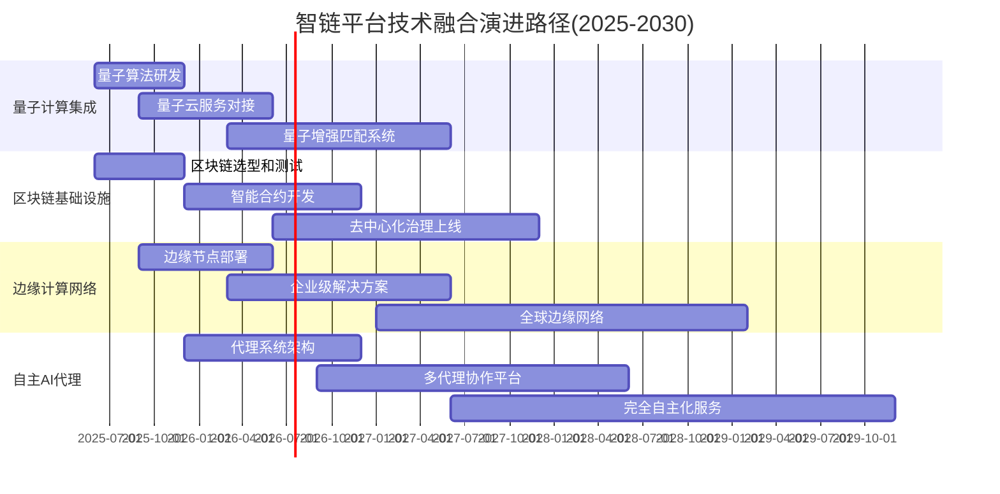

# 智链平台v2未来科技融合与平台演进战略

**版本**: v2.0 | **日期**: 2025-08-12 | **状态**: 第5轮优化成果  
**目标**: 构建面向未来的技术融合架构，确保平台在新兴技术浪潮中的持续领先优势

---

## 🚀 2025年技术融合趋势洞察

### 核心技术融合机遇窗口
```yaml
AI×量子计算协同:
  技术成熟度: 量子纠错技术突破，商业化应用就绪
  应用场景:
    - 复杂AI能力匹配的量子级优化算法
    - 多维度供需匹配的并行计算加速
    - 风险评估和预测的指数级精度提升
    - 药物发现、金融预测等垂直领域AI突破
    
  商业价值:
    - 匹配精度提升至99.5%+（传统算法极限95%）
    - 复杂推荐计算时间从小时级降至秒级
    - 支持万亿级参数的AI能力组合计算
    - 量子增强AI服务的巨额溢价空间

AI×区块链生态融合:
  去中心化趋势: 区块链超越加密货币，成熟应用于AI治理
  核心价值:
    - AI能力的去中心化验证和信任机制
    - 智能合约驱动的自动化AI服务结算
    - 分布式AI模型的版权保护和收益分配
    - 跨链AI能力交易的全球无缝协作
    
  生态影响:
    - 供应商AI能力自主认证和定价
    - 客户支付的实时自动化结算
    - AI能力知识产权的不可篡改保护
    - 全球AI能力流通的去信任化基础设施

AI×边缘计算深度融合:
  实时化需求: 数据隐私+低延迟+高并发的三重驱动
  技术优势:
    - 企业内部AI能力的就近部署和推理
    - 敏感数据不出企业的本地化AI服务
    - 毫秒级响应的实时AI能力调用
    - 分布式AI能力网络的自动负载均衡
    
  市场价值:
    - 企业级客户的数据安全合规强需求
    - 制造业实时AI决策的巨大市场空间
    - 医疗、金融等敏感行业的独占性优势
    - 5G+边缘AI的万亿级市场机遇

自主代理AI(Agentic AI)革命:
  技术跃迁: 从AI辅助工具到完全自主的智能代理
  能力边界突破:
    - 六角色协作系统的完全自主化演进
    - 从需求理解到方案实施的端到端自动化
    - AI代理之间的自主协商和任务分配
    - 持续学习和自我优化的智能生态
```

### 技术融合对智链平台的战略意义
```typescript
interface TechConvergenceStrategicImpact {
  // 竞争护城河加宽
  competitiveAdvantage: {
    quantumOptimization: "量子增强的匹配算法构建不可复制的技术壁垒";
    blockchainTrust: "去中心化信任机制降低平台运营成本";
    edgeComputing: "本地化部署能力拓展企业级市场空间";
    agenticEvolution: "自主AI代理实现人力成本的指数级优化";
  };
  
  // 商业模式革新
  businessModelInnovation: {
    valueCreationExpansion: "从AI能力交易扩展至AI生态基础设施";
    pricingModelEvolution: "基于价值创造的动态定价和收益共享";
    marketBoundaryDissolution: "打破地理和行业边界的全球化服务";
    ecosystemOrchestration: "从平台运营商升级为生态系统编排者";
  };
  
  // 用户价值倍增
  userValueAmplification: {
    experienceQuantumLeap: "量子级的体验提升和价值交付";
    trustMechanismUpgrade: "区块链赋能的完全透明信任体系";
    realTimeValueDelivery: "边缘计算支持的实时价值创造";
    autonomousServiceEvolution: "自主代理实现的24/7无人值守服务";
  };
}
```

---

## 🏗 未来融合技术架构

### 智链平台v3.0前瞻性技术栈
```yaml
Layer 1: 量子增强AI推理层
  quantum_enhanced_matching:
    - 量子算法优化的复杂AI能力组合推荐
    - 多变量约束下的全局最优解计算
    - 量子并行计算的大规模模型推理加速
    - 量子随机数生成器的高质量AI训练数据
    
  hybrid_classical_quantum:
    - 经典计算处理常规任务，量子计算处理复杂优化
    - 量子-经典混合算法的无缝切换
    - 成本效益最优的计算资源动态分配
    - 量子计算资源的弹性调度和管理

Layer 2: 区块链AI治理层
  decentralized_ai_governance:
    - AI能力供应商的去中心化身份认证(DID)
    - 智能合约自动执行的AI服务协议
    - 分布式AI模型版权管理和收益分配
    - 跨链AI能力交易的原子性保证
    
  tokenized_ai_economy:
    - AI能力通证化和流动性挖矿机制
    - 基于声誉和贡献的治理代币分发
    - 去中心化自治组织(DAO)的平台治理
    - AI能力创造者的长期激励对齐

Layer 3: 边缘AI推理网络
  distributed_inference_network:
    - 全球分布式AI推理节点网络
    - 智能路由的最优推理节点选择
    - 边缘AI能力的实时缓存和预加载
    - 故障自愈和负载均衡的弹性架构
    
  enterprise_private_deployment:
    - 企业私有云的AI能力本地化部署
    - 混合云架构的无缝AI能力调用
    - 数据不出企业的合规AI服务交付
    - 企业级安全和权限管理体系

Layer 4: 自主AI代理编排层
  agentic_ai_orchestration:
    - 六角色AI代理的完全自主协作
    - 多代理系统的任务分解和并行执行
    - AI代理之间的自主谈判和资源协调
    - 持续学习和策略优化的智能进化
    
  human_ai_collaboration:
    - 人类专家与AI代理的深度协作模式
    - 复杂决策的人机混合智能系统
    - AI代理的可解释性和人类监督机制
    - 伦理约束下的AI代理行为规范
```

### 技术演进路径图


---

## 💼 商业模式演进策略

### 从交易平台到基础设施提供商
```yaml
商业模式三阶段演进:
  
  阶段1: AI能力交易平台(2025-2026)
    核心价值: 撮合AI供需双方，提供标准化交易服务
    收入模式: 交易佣金(8-15%) + 增值服务费
    市场定位: 中国领先的AI能力交易平台
    关键指标: GMV 10亿+，活跃用户10万+
    
  阶段2: AI生态基础设施(2026-2028)
    核心价值: 提供完整的AI生态基础设施和工具链
    收入模式: SaaS订阅 + PaaS平台费 + 技术服务费
    市场定位: 亚太区域AI生态基础设施领导者
    关键指标: ARR 5亿+，企业客户1000+
    
  阶段3: 全球AI操作系统(2028-2030)
    核心价值: 成为全球AI能力的标准化操作系统
    收入模式: 平台生态费 + 数据授权费 + 基础设施租赁费
    市场定位: 全球AI能力流通的标准基础设施
    关键指标: 全球市场份额20%+，估值1000亿+

新兴收入模式创新:
  量子AI计算服务:
    - 量子增强AI推理服务的按需计费
    - 量子算法优化的企业级解决方案
    - 量子计算资源的弹性租赁服务
    - 预期收入贡献: 2-5亿/年(2027年)
    
  区块链AI治理服务:
    - AI能力NFT化和版权管理服务
    - 去中心化AI治理的技术服务费
    - 跨链AI能力交易的基础设施费用
    - 预期收入贡献: 1-3亿/年(2026年)
    
  边缘AI基础设施:
    - 企业边缘AI节点的部署和运维服务
    - 边缘AI推理的按调用次数计费
    - 私有化AI能力的定制部署服务
    - 预期收入贡献: 3-8亿/年(2027年)
    
  自主AI代理经济:
    - AI代理的智能任务外包服务
    - 多代理协作的企业级解决方案
    - AI代理创造价值的收益分成模式
    - 预期收入贡献: 5-15亿/年(2028年)
```

### 价值链重构与生态位升级
```typescript
interface ValueChainEvolution {
  // 传统价值链(v2.0)
  traditionalValueChain: {
    supplier: "AI能力提供方";
    platform: "撮合和交易服务";
    customer: "AI能力需求方";
    valueCapture: "交易佣金为主";
  };
  
  // 未来价值网络(v3.0)
  futureValueNetwork: {
    quantumInfrastructure: "量子计算基础设施提供商";
    blockchainGovernance: "去中心化AI治理服务商";
    edgeComputing: "分布式AI推理网络运营商";
    agenticEcosystem: "自主AI代理生态编排者";
    
    valueCreation: {
      networkEffect: "生态网络效应的指数级价值增长";
      dataMonetization: "AI交易数据的深度价值挖掘";
      infrastructureRent: "基础设施租赁的稳定现金流";
      ecosystemOrchestration: "生态编排的平台价值溢价";
    };
  };
}
```

---

## 🌐 生态系统演进策略

### 开放生态与闭环价值创造
```yaml
生态系统四层架构演进:

Layer 1: 开发者生态(Developer Ecosystem)
  quantum_ai_developers:
    - 量子AI算法专家社区建设
    - 量子计算SDK和开发工具提供
    - 量子AI应用竞赛和孵化计划
    - 量子AI培训认证体系建立
    
  blockchain_ai_builders:
    - 区块链AI应用开发者联盟
    - 智能合约模板和工具链提供
    - AI NFT和通证化解决方案支持
    - 去中心化AI治理标准制定参与
    
  edge_ai_integrators:
    - 边缘AI应用集成商网络
    - 企业级边缘AI部署工具包
    - 行业特定的边缘AI解决方案库
    - 边缘AI性能优化最佳实践分享

Layer 2: 合作伙伴生态(Partner Ecosystem)
  technology_alliance:
    - 量子计算云服务商深度合作(IBM、Google、Microsoft)
    - 区块链基础设施合作伙伴(Ethereum、Polkadot、BSC)
    - 边缘计算设备厂商联盟(NVIDIA、Intel、AMD)
    - AI芯片和硬件供应商合作(华为、阿里、腾讯)
    
  strategic_partnerships:
    - 全球系统集成商战略合作
    - 行业龙头企业的深度定制合作
    - 政府和科研院所的产学研合作
    - 国际标准组织的标准制定合作

Layer 3: 用户生态(User Ecosystem)
  enterprise_community:
    - 企业AI转型最佳实践社区
    - CTO/CDO高层决策者俱乐部
    - 行业AI应用案例库和知识分享
    - 企业AI战略咨询和培训服务
    
  developer_community:
    - AI能力开发者技术社区
    - 开源AI工具和框架贡献
    - 技术分享和协作开发平台
    - AI创新项目的孵化和投资

Layer 4: 价值创造生态(Value Creation Ecosystem)  
  innovation_labs:
    - 前沿AI技术研发实验室
    - 跨技术领域的融合创新项目
    - 大学和科研院所的联合研发
    - 颠覆性技术的前瞻性布局
    
  ecosystem_fund:
    - 生态系统创业公司投资基金
    - AI技术创新项目的早期投资
    - 生态合作伙伴的战略投资
    - 技术并购和整合的资本运作
```

### 生态护城河深度加固
```yaml
护城河加固四重策略:

技术护城河:
  quantum_advantage:
    - 量子AI算法的独占性技术领先
    - 量子计算资源的长期战略合作
    - 量子增强AI的专利技术积累
    - 量子人才的战略性招募和培养
    
  blockchain_moat:
    - AI治理区块链的技术标准制定权
    - 跨链AI能力交易的技术专利
    - 去中心化AI生态的治理话语权
    - 区块链AI应用的先发优势积累

数据护城河:
  quantum_enhanced_data:
    - 量子增强的AI训练数据质量优势
    - 量子算法优化的数据处理能力
    - 量子随机性的高质量数据生成
    - 量子安全的数据隐私保护技术
    
  blockchain_data_sovereignty:
    - 区块链保障的数据所有权确权
    - 去中心化存储的数据安全优势
    - 智能合约驱动的数据价值分配
    - 跨链数据流通的标准化协议

网络护城河:
  global_edge_network:
    - 全球分布式边缘AI推理网络
    - 企业本地化部署的广泛覆盖
    - 低延迟高并发的网络效应优势
    - 边缘节点的规模经济和成本优势
    
  agentic_network_effect:
    - 自主AI代理的协作网络效应
    - 多代理系统的规模化协作优势
    - AI代理学习的集体智慧积累
    - 代理生态的自强化正循环机制

品牌护城河:
  technology_leadership:
    - 全球AI+量子+区块链+边缘计算融合的技术领导地位
    - 国际顶级技术会议的主导话语权
    - 全球媒体和行业专家的广泛认可
    - 政府和监管机构的信任与合作关系
    
  ecosystem_orchestration:
    - 全球AI生态系统的编排者和标准制定者
    - 行业联盟和标准组织的核心影响力
    - 学术界和产业界的深度合作网络
    - 下一代AI基础设施的定义者地位
```

---

## 📊 平台演进成功指标

### 技术融合成熟度指标
```yaml
量子AI集成指标(2025-2027):
  - 量子增强算法性能提升: >1000%（相比经典算法）
  - 量子云服务集成覆盖率: 100%（主流量子云平台）
  - 量子AI应用场景部署: 10+垂直行业领域
  - 量子AI专家团队规模: 50+人（全球顶级人才）

区块链AI治理指标(2025-2026):
  - 去中心化AI能力认证率: 80%（平台AI能力）
  - 智能合约自动结算比例: 90%（交易量）
  - 跨链AI交易支持程度: 5+主流区块链网络
  - 区块链治理参与度: 70%+（社区成员）

边缘AI部署指标(2025-2027):
  - 全球边缘节点部署数量: 1000+节点
  - 企业边缘AI部署覆盖率: 60%（企业客户）
  - 边缘AI推理延迟: <10ms（95%请求）
  - 边缘计算成本降低: 50%（相比中心化）

自主AI代理指标(2026-2028):
  - AI代理自主任务完成率: 85%（复杂业务任务）
  - 多代理协作效率提升: 300%（相比单一AI）
  - 人机协作满意度: >4.8/5.0（企业用户）
  - AI代理创造价值占比: 40%（平台总价值）
```

### 商业演进成功指标
```yaml
收入结构演进指标:
  2025年目标:
    - 传统交易佣金收入: 60%
    - 新兴技术服务收入: 25%
    - 企业级解决方案收入: 15%
    
  2027年目标:
    - 传统交易佣金收入: 30%
    - 新兴技术服务收入: 45%
    - 企业级解决方案收入: 25%
    
  2030年目标:
    - 基础设施租赁收入: 40%
    - 生态编排服务收入: 35%
    - 数据和IP授权收入: 25%

市场地位演进指标:
  - 全球AI能力交易市场份额: 20%+（2027年）
  - 量子AI应用市场份额: 30%+（2028年）
  - 边缘AI基础设施市场份额: 15%+（2027年）
  - 企业AI转型解决方案市场份额: 25%+（2028年）

生态系统健康指标:
  - 全球开发者社区规模: 10万+人（2027年）
  - 生态合作伙伴数量: 500+家（2027年）
  - 年度生态创新项目: 100+个（2027年）
  - 生态系统总价值创造: 1000亿+元（2030年）
```

---

## 🎯 实施优先级与风险管控

### 分阶段实施策略
```yaml
阶段1: 基础技术验证(2025 Q2-Q4)
  优先级: 最高
  核心任务:
    - 量子计算服务对接和算法验证
    - 区块链基础设施选型和智能合约开发
    - 边缘计算节点试点部署
    - AI代理框架原型开发
  
  成功标准:
    - 技术可行性验证完成率100%
    - 原型系统功能完整度>80%
    - 性能基准测试达标率>90%
    - 投入产出比评估满意度>4.0

阶段2: 核心能力建设(2025 Q4-2026 Q2)
  优先级: 高
  核心任务:
    - 量子增强匹配算法生产化部署
    - 区块链AI治理系统上线运行
    - 企业边缘AI解决方案规模化交付
    - 多AI代理协作平台商业化应用
  
  成功标准:
    - 新技术服务收入占比>20%
    - 企业级客户满意度>4.5
    - 技术团队规模扩展>100人
    - 技术专利申请>50项

阶段3: 生态系统建设(2026 Q2-2027 Q2)
  优先级: 中
  核心任务:
    - 全球技术合作伙伴网络建立
    - 开发者社区和生态系统构建
    - 行业标准制定和话语权获取
    - 国际市场扩张和本地化部署
  
  成功标准:
    - 生态合作伙伴>200家
    - 开发者社区>5万人
    - 国际标准制定参与度>80%
    - 海外市场收入占比>30%
```

### 关键风险识别与应对
```yaml
技术风险管控:
  量子计算风险:
    - 风险: 量子计算商业化进度低于预期
    - 应对: 多厂商合作+经典-量子混合算法备份
    - 监控指标: 量子云服务可用性>99%
    
  区块链治理风险:
    - 风险: 监管政策变化影响区块链应用
    - 应对: 多链部署+合规优先策略
    - 监控指标: 合规评估通过率100%
    
  边缘计算风险:
    - 风险: 边缘设备管理复杂度过高
    - 应对: 标准化部署+自动化运维
    - 监控指标: 边缘节点在线率>95%

商业模式风险:
  市场接受度风险:
    - 风险: 新技术服务市场教育周期过长
    - 应对: 渐进式推广+免费试用策略
    - 监控指标: 试用转付费率>40%
    
  投资回报风险:
    - 风险: 高技术投入短期内无法回收
    - 应对: 分阶段投入+里程碑管控
    - 监控指标: 各阶段ROI>投入成本30%

竞争风险管控:
  技术被超越风险:
    - 风险: 竞争对手技术突破领先优势丧失
    - 应对: 持续研发投入+专利保护策略
    - 监控指标: 技术领先度维持>18个月
    
  生态被替代风险:
    - 风险: 新兴平台挑战生态系统地位
    - 应对: 开放合作+生态锁定加深
    - 监控指标: 生态切换成本>6个月投入
```

---

**文档维护**: 未来技术战略团队  
**最后更新**: 2025年8月12日  
**版本控制**: v2.0.0 - 未来科技融合战略版  
**核心价值**: 构建智链平台面向2030年的技术融合和生态演进战略，确保在新兴技术浪潮中的持续领导地位