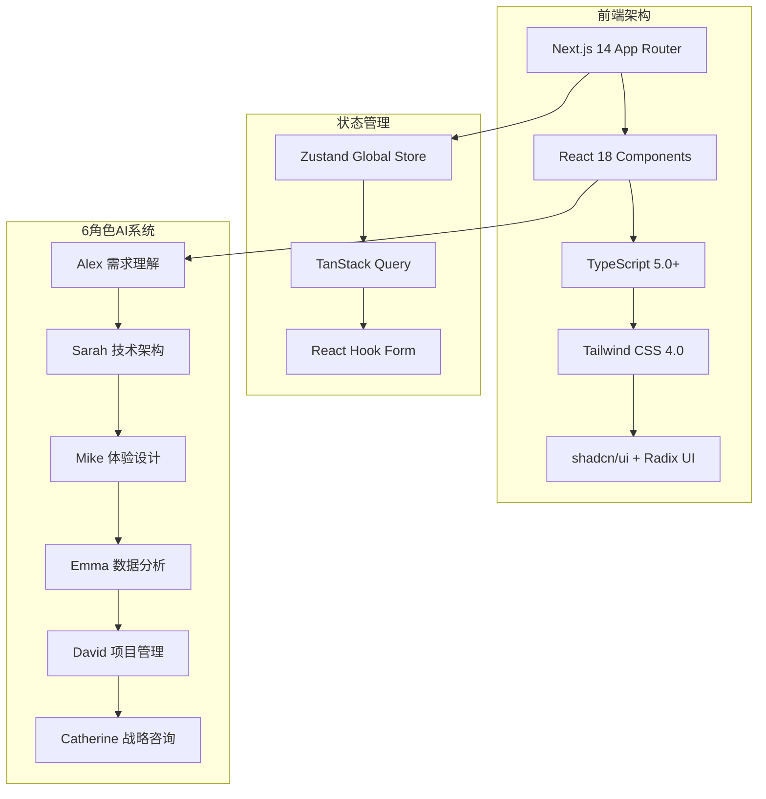
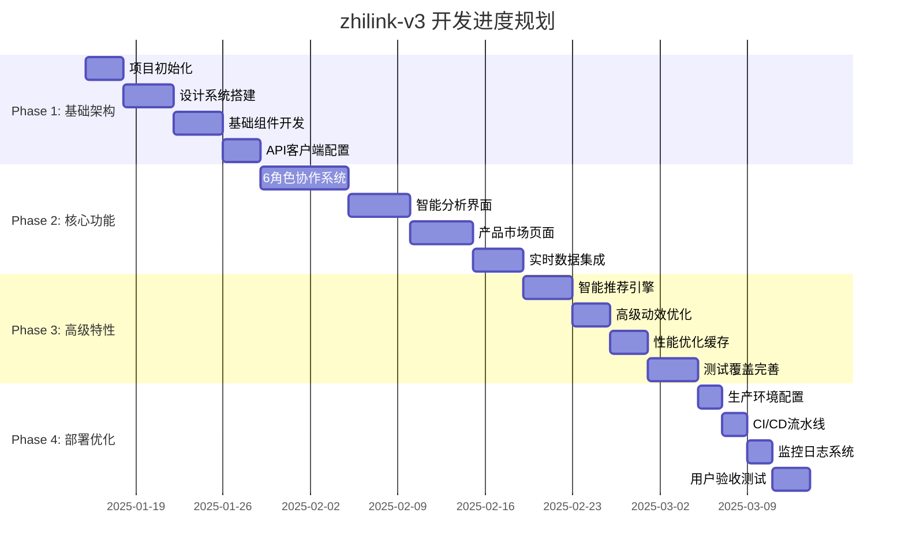
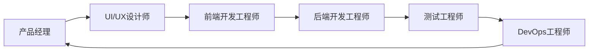

# zhilink-v3: LaunchX智链平台

> **基于6角色AI协作系统的B2B AI能力市场平台**  
> **Cloudsway 2.0 "拂晓深空" 设计体系**  
> **Next.js 14 + React 18 + TypeScript企业级架构**

[](https://github.com/launchx/zhilink-v3)
[](https://github.com/launchx/zhilink-v3/releases)
[](./LICENSE)
[](https://www.typescriptlang.org/)
[](./docs/README.md)

---

## 🎯 项目概览

**LaunchX智链平台v3**是一个面向法律、医疗、电商三大行业的B2B AI能力市场平台。通过革命性的**6角色AI协作系统**，为企业客户提供精准的AI解决方案推荐和交易服务。

### 🚀 核心价值主张

- **🤖 6角色智能协作**: Alex、Sarah、Mike、Emma、David、Catherine六位AI专家协同分析
- **🏪 三大产品类型**: workforce(AI劳动力) + expert_module(专家模块) + market_report(市场报告)
- **🎨 Cloudsway 2.0设计**: "拂晓深空"视觉体系，融合专业与温暖
- **⚡ 2025年技术前沿**: AI个性化界面、3D微交互、预测性用户体验

---

## 📋 项目总纲

### 🏗️ 技术架构总览



### 📂 文档架构体系

| 文档类别 | 文档名称 | 描述 | 状态 |
|---------|---------|------|------|
| **📋 总纲** | `README.md` | 项目总览和快速开始 | ✅ |
| **🏗️ 架构** | `01_项目架构设计.md` | 技术栈、项目结构、API设计 | ✅ |
| **🎨 设计** | `02_视觉设计系统.md` | Cloudsway 2.0色彩、字体、组件 | ✅ |
| **📱 布局** | `03_页面布局方案.md` | 5核心页面布局设计 | 🚧 |
| **⚡ 交互** | `04_交互动效设计.md` | 微交互、动画、6角色可视化 | 🚧 |
| **🧩 组件** | `05_组件库规范.md` | 组件设计规范和实现指南 | 🚧 |
| **📡 数据** | `06_数据交互设计.md` | API集成、状态管理、数据流 | 🚧 |
| **🛠️ 开发** | `07_开发指南.md` | 开发环境、代码规范、测试 | 🚧 |

---

## 🚀 快速开始

### 📋 环境要求

- **Node.js**: ≥ 18.0.0
- **包管理器**: pnpm (推荐) / npm / yarn
- **操作系统**: macOS / Windows / Linux
- **浏览器**: Chrome 90+ / Firefox 88+ / Safari 14+ / Edge 90+

### ⚡ 安装与启动

```bash
# 1. 克隆项目
git clone https://github.com/launchx/zhilink-v3.git
cd zhilink-v3

# 2. 安装依赖
pnpm install

# 3. 复制环境变量
cp .env.example .env.local

# 4. 启动开发服务器
pnpm dev

# 5. 在浏览器打开
open http://localhost:3000
```

### 🔧 开发命令

```bash
# 开发相关
pnpm dev              # 启动开发服务器 (端口3000)
pnpm dev:turbo        # 使用Turbopack启动 (更快)
pnpm build            # 生产环境构建
pnpm start            # 启动生产服务器
pnpm preview          # 预览生产构建

# 代码质量
pnpm lint             # ESLint检查
pnpm lint:fix         # 自动修复lint问题
pnpm typecheck        # TypeScript类型检查
pnpm format:check     # 检查代码格式
pnpm format:write     # 格式化代码

# 测试
pnpm test             # 运行单元测试
pnpm test:coverage    # 生成测试覆盖率报告
pnpm test:e2e         # 运行端到端测试

# 分析
pnpm analyze          # 构建分析
pnpm scan             # React性能扫描
```

---

## 🎨 设计系统概览

### 🌈 Cloudsway 2.0 "拂晓深空"

```css
/* 核心色彩变量 */
:root {
  --cloudsway-primary: #6366f1;      /* 深邃紫色 */
  --cloudsway-secondary: #06b6d4;    /* 清澈青色 */
  --cloudsway-accent: #8b5cf6;       /* 神秘紫罗兰 */
  --cloudsway-background: #0f172a;   /* 深空背景 */
}
```

### 🤖 6角色色彩系统

| 角色 | 姓名 | 专长 | 主色 | 象征 |
|------|------|------|------|------|
| 🎯 | Alex | 需求理解专家 | `#3b82f6` | 信任与洞察 |
| ⚡ | Sarah | 技术架构师 | `#8b5cf6` | 专业与创新 |
| 🎨 | Mike | 体验设计师 | `#10b981` | 创意与活力 |
| 📊 | Emma | 数据分析师 | `#f59e0b` | 洞察与智慧 |
| 📋 | David | 项目管理师 | `#6366f1` | 执行与秩序 |
| 🌟 | Catherine | 战略顾问 | `#ec4899` | 远见与价值 |

---

## 📱 核心页面架构

### 🎯 页面优先级定义

#### **P0级 - 核心体验** (首批上线)
- **🏠 首页** (`/`) - Hero展示 + 产品概览 + 客户案例
- **💬 智能分析** (`/chat`) - 6角色协作分析界面
- **🏪 AI市场** (`/market`) - 产品浏览 + 搜索筛选
- **📦 产品详情** (`/product/[id]`) - 详细信息 + 购买决策

#### **P1级 - 增强功能** (第二批)
- **📋 需求规格** (`/specs`) - 项目需求管理
- **📊 智能报告** (`/reports`) - 分析报告展示
- **⚙️ 用户仪表板** (`/dashboard`) - 个人工作台

#### **P2级 - 管理功能** (后续迭代)
- **🏢 供应商门户** (`/vendor`) - 供应商管理
- **🎛️ 平台控制台** (`/admin`) - 系统管理

### 📐 黄金比例布局系统

```css
/* φ = 1.618 黄金比例应用 */
.layout-golden {
  --sidebar-width: 38.2%;    /* φ⁻¹ × 100% */
  --content-width: 61.8%;    /* φ⁻² × 100% */
}

/* 三栏布局 (1:3:6) */
.layout-triple {
  --nav-width: 10%;          /* 导航栏 */
  --side-width: 30%;         /* 侧边栏 */
  --main-width: 60%;         /* 主内容区 */
}
```

---

## 🔄 开发工作流

### 📅 8周开发计划



### 🔀 Git工作流规范

```bash
# 分支命名规范
feature/新功能名称     # 新功能开发
bugfix/问题描述       # 问题修复
hotfix/紧急修复       # 紧急修复
release/版本号        # 发布分支

# 提交信息规范
feat: 添加6角色协作可视化组件
fix: 修复产品搜索筛选器bug
docs: 更新API文档
style: 优化按钮hover动效
refactor: 重构状态管理架构
test: 添加组件单元测试
chore: 更新依赖包版本
```

---

## 🧪 质量保证体系

### 📊 测试策略

```typescript
// 测试金字塔
interface TestingPyramid {
  unit: {
    coverage: '90%+';
    tools: ['Jest', 'Testing Library'];
    focus: ['utils', 'hooks', 'stores'];
  };
  
  integration: {
    coverage: '80%+';
    tools: ['Testing Library', 'MSW'];
    focus: ['components', 'pages', 'api'];
  };
  
  e2e: {
    coverage: 'critical-paths';
    tools: ['Playwright'];
    focus: ['user-journeys', 'cross-browser'];
  };
}
```

### 🎯 质量标准

| 指标类别 | 具体指标 | 目标值 | 验证方式 |
|---------|---------|--------|----------|
| **性能** | 首屏加载时间 | < 1.5s | Lighthouse |
| **性能** | 页面切换响应 | < 100ms | Web Vitals |
| **质量** | TypeScript覆盖率 | 100% | tsc --noEmit |
| **质量** | 单元测试覆盖率 | > 90% | Jest Coverage |
| **兼容** | 浏览器支持 | 95%+ | Browserslist |
| **无障碍** | WCAG等级 | AA级 | axe-core |

---

## 🛡️ 安全与合规

### 🔒 安全措施

```typescript
// 安全配置概览
const SECURITY_CONFIG = {
  authentication: 'JWT + httpOnly Cookies',
  authorization: 'RBAC + ABAC',
  dataEncryption: 'AES-256',
  communication: 'TLS 1.3',
  inputValidation: 'Zod Schema',
  xssProtection: 'DOMPurify',
  csrfProtection: 'SameSite Cookies'
} as const;
```

### 📋 合规要求

- **🇪🇺 GDPR**: 欧盟数据保护法规合规
- **🇨🇳 个保法**: 中国个人信息保护法合规
- **🏢 SOC 2**: Type II 安全认证
- **♿ WCAG 2.1**: AA级无障碍标准

---

## 📈 性能监控

### 📊 核心指标监控

```typescript
// 性能指标定义
interface PerformanceMetrics {
  webVitals: {
    LCP: '<2.5s';     // 最大内容绘制
    FID: '<100ms';    // 首次输入延迟
    CLS: '<0.1';      // 累积布局偏移
    TTFB: '<800ms';   // 首字节时间
  };
  
  customMetrics: {
    chatLoadTime: 'Time to first agent response';
    searchLatency: 'Product search response time';
    analysisSpeed: '6-agent collaboration completion time';
  };
}
```

### 🚨 监控与告警

- **实时性能监控**: Vercel Analytics + Core Web Vitals
- **错误追踪**: Sentry 错误监控和性能分析
- **用户行为分析**: 自建埋点 + 隐私优先分析
- **API监控**: 接口响应时间和错误率监控

---

## 🤝 贡献指南

### 👥 团队协作



### 📝 代码贡献流程

1. **Fork项目** - 创建个人分支
2. **创建功能分支** - `git checkout -b feature/amazing-feature`
3. **提交更改** - `git commit -m 'feat: add amazing feature'`
4. **推送分支** - `git push origin feature/amazing-feature`
5. **创建Pull Request** - 描述变更内容和影响
6. **代码审查** - 至少2人审查通过
7. **合并代码** - 通过CI/CD检查后合并

### 📋 代码规范

- **TypeScript严格模式** - 零any类型，完整类型定义
- **ESLint + Prettier** - 统一代码风格和质量
- **组件设计原则** - 原子设计方法论
- **性能优化** - 懒加载、缓存、代码分割

---

## 📚 学习资源

### 🔗 官方文档

- [Next.js 14 文档](https://nextjs.org/docs) - App Router 和 Server Components
- [React 18 文档](https://react.dev/) - 并发特性和 Hooks
- [TypeScript 手册](https://www.typescriptlang.org/docs/) - 类型系统指南
- [Tailwind CSS](https://tailwindcss.com/docs) - 原子化CSS框架
- [shadcn/ui](https://ui.shadcn.com/) - 可访问的组件库

### 🎨 设计资源

- [Cloudsway 2.0 设计系统](./docs/02_视觉设计系统.md) - 完整设计规范
- [Figma 设计文件](https://figma.com/zhilink-v3) - 设计稿和原型
- [图标库](https://lucide.dev/) - Lucide React 图标库
- [字体资源](https://fonts.google.com/) - Inter + JetBrains Mono

### 🛠️ 开发工具

- [VS Code 插件推荐](https://marketplace.visualstudio.com/) - TypeScript, ES7+, Prettier
- [Chrome 开发工具](https://developer.chrome.com/docs/devtools/) - 调试和性能分析
- [React Developer Tools](https://chrome.google.com/webstore/detail/react-developer-tools/) - React调试
- [Storybook](https://storybook.js.org/) - 组件开发和文档

---

## 📞 支持与联系

### 🐛 问题报告

如果你发现bug或有功能建议，请通过以下方式联系我们：

- **GitHub Issues**: [创建Issue](https://github.com/launchx/zhilink-v3/issues)
- **邮件支持**: support@launchx.com
- **微信群**: 扫描二维码加入开发者群

### 📖 文档反馈

文档有问题或需要改进？

1. 在对应文档页面点击"编辑"按钮
2. 提交Pull Request改进文档
3. 或者创建Issue说明问题

### 🎯 商业咨询

- **官方网站**: https://launchx.com
- **商务合作**: business@launchx.com
- **技术咨询**: tech@launchx.com

---

## 📄 许可证

本项目基于 [MIT 许可证](./LICENSE) 开源。

---

## 🙏 致谢

感谢所有为zhilink-v3项目做出贡献的开发者、设计师和用户！

特别感谢：
- **Next.js团队** - 提供出色的React框架
- **shadcn** - 优秀的UI组件库设计理念  
- **Vercel** - 强大的部署和分析平台
- **开源社区** - 无私的技术分享和支持

---

<div align="center">

**🚀 让AI能力连接世界，让智能创造价值 🚀**

Made with ❤️ by [LaunchX Team](https://launchx.com)


</div>

---

## 📚 文档导航

### 🎯 快速开始
- [📋 项目总览](./README.md) - 本文档，项目概况和快速开始
- [📖 文档规范](./DOCUMENTATION_STANDARDS.md) - 文档编写和维护规范
- [🎨 设计系统](./LAUNCHX_DESIGN_SYSTEM_V3.md) - 完整的设计系统文档
- [🚀 开发方法论](./PROJECT_DEVELOPMENT_METHODOLOGY.md) - 项目开发流程和方法
- [📅 下阶段计划](./NEXT_PHASE_ACTION_PLAN.md) - 项目发展路线图

### 📁 详细文档 
> 📍 [完整文档索引](./docs/README.md)

| 分类 | 文档 | 说明 |
|------|------|------|
| **🏗️ 架构** | [系统架构设计](./docs/architecture/01_系统架构设计.md) | 技术架构和系统设计 |
| **🎨 设计** | [视觉设计系统](./docs/design/02_视觉设计系统.md) | Cloudsway色彩体系和视觉规范 |
| | [交互动效设计](./docs/design/04_交互动效设计.md) | 交互逻辑和动画效果规范 |
| | [组件库规范](./docs/design/05_组件库规范.md) | UI组件设计和使用规范 |
| **💻 开发** | [页面布局方案](./docs/development/03_页面布局方案.md) | 页面结构和布局设计 |
| | [开发指南](./docs/development/07_开发指南.md) | 编码规范和最佳实践 |
| | [首页设计计划](./docs/development/HOMEPAGE_DESIGN_PLAN.md) | 首页实现的详细计划 |
| **🔌 API** | [API配置指南](./docs/api/API_SETUP_GUIDE.md) | API接口配置和使用 |
| | [数据交互设计](./docs/api/06_数据交互设计.md) | 数据流和接口设计 |

### 🔄 文档版本管理
- **当前版本**: v3.0 (标准化重组版本)
- **上次更新**: 2025-08-14
- **文档状态**: ✅ 已标准化
- **备份位置**: `./backup/` 目录

---

**最后更新**: 2025年8月14日  
**文档版本**: v3.0.0  
**维护团队**: LaunchX智链平台开发团队