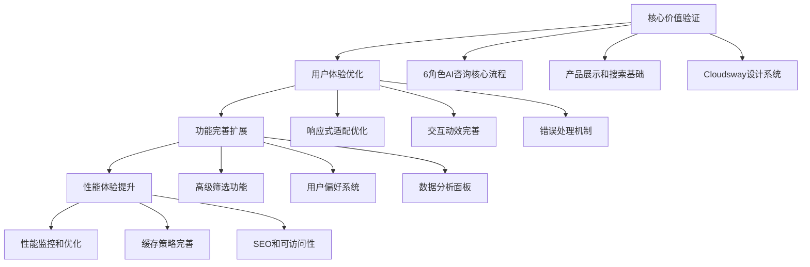

# 07_开发执行计划.md

> **zhilink-v3 Claude Code + MCP 协作开发指南**  
> **AI辅助开发的最佳实践操作手册**  
> **基于6角色系统的智能化开发流程**

---

## 🎯 执行计划概述

### 🤖 AI协作开发理念

基于Claude Code强大的代码生成和MCP工具集成能力，我们采用**人机协作**的智能化开发模式：

```typescript
// AI协作开发架构
interface AIAssistedDevelopment {
  human: {
    role: '产品决策 + 业务逻辑 + 代码审查 + 体验优化';
    tools: 'IDE + 设计工具 + 测试工具';
    focus: '战略决策 + 创意设计 + 质量把控';
  };
  
  ai: {
    role: 'Claude Code + 专业MCP服务';
    capabilities: [
      '代码生成和重构',
      '文档撰写和维护', 
      '测试用例编写',
      '性能优化建议',
      '最佳实践推荐'
    ];
    tools: [
      'ui-designer MCP',    // UI组件设计
      'frontend-developer MCP',  // 前端开发
      'test-writer MCP',    // 测试编写
      'performance-optimizer MCP' // 性能优化
    ];
  };
  
  collaboration: {
    workflow: '敏捷迭代 + 实时反馈 + 持续优化';
    communication: 'Todo列表 + 代码注释 + 文档同步';
    quality: '自动化测试 + 代码审查 + 性能监控';
  };
}
```

### 📋 开发优先级策略

基于参考文档和业务需求，我们采用**MVF (Minimum Viable Feature)** 开发策略：



---

## 📅 8周开发执行计划

### 🚀 Week 1-2: 基础架构与核心设计系统

#### Week 1: 项目搭建与设计系统
```bash
# Claude Code 操作指令
任务目标: 完成项目脚手架和Cloudsway 2.0设计系统实现

具体操作:
1. 创建Next.js 14项目架构
   - 使用claude-frontend-developer MCP
   - 配置TypeScript + Tailwind CSS 4.0
   - 集成shadcn/ui组件库
   - 设置ESLint + Prettier + Husky

2. 实现Cloudsway 2.0设计系统
   - 使用ui-designer MCP
   - 实现深空色彩变量系统
   - 创建6角色专属色彩标识
   - 构建玻璃态效果组件

3. 建立组件库基础
   - 参考组件库规范文档
   - 实现Button/Input/Card等原子组件
   - 创建AgentAvatar分子组件
   - 建立Storybook文档系统

Claude Code提示词:
"基于zhilink-v3文档，使用frontend-developer MCP创建Next.js 14项目。重点实现Cloudsway 2.0设计系统，包括深空主题色彩、6角色专属标识、玻璃态效果。参考02_视觉设计系统.md和05_组件库规范.md完整实现。"
```

#### Week 2: 首页完整实现
```bash
# Claude Code 操作指令
任务目标: 完成首页所有模块，建立品牌形象

具体操作:
1. 实现导览式首页布局
   - 基于03_页面布局方案.md v2.0设计
   - 中心科技动画框(参考zhilink-platform实现)
   - 右侧登录面板(WeChat/TikTok/邮箱注册)
   - 3+1动态身份选择系统

2. 三大产品类型展示
   - AI劳动力(蓝色系)、专家模块(紫色系)、市场报告(绿色系)
   - 色彩区分和视觉自洽设计
   - 产品数量实时统计展示

3. 建立数据mock系统
   - 创建产品数据模型
   - 用户身份和权限模型
   - 分析会话数据结构

Claude Code提示词:
"实现zhilink-v3主页导览设计，重点关注安全性和加载性能。参考03_页面布局方案.md的v2.0设计，实现中心动画框、登录面板、三大产品类型展示。使用ui-designer MCP确保Cloudsway色彩体系一致性。"
```

### 🛒 Week 3-4: AI市场页与智能搜索

#### Week 3: 产品展示与筛选系统
```bash
# Claude Code 操作指令  
任务目标: 构建完整的AI产品市场展示页面

具体操作:
1. 实现产品网格展示
   - 基于现有zhilink-v2/market/page.tsx优化
   - 增强型产品卡片(支持分销功能)
   - 三大产品类型Tab导航
   - 用户身份权限的UI上下文切换

2. 多维筛选系统
   - 产品类型/行业/价格区间筛选
   - 供应商等级和评分筛选
   - 筛选状态持久化
   - 筛选结果实时更新

3. 分销功能集成
   - 分销链接生成组件
   - 佣金计算展示
   - 分享功能卡片集成
   - 身份权限控制

Claude Code提示词:
"基于zhilink-v2市场页代码，实现zhilink-v3增强版市场页。重点实现3+1身份系统的UI切换、分销功能集成、三大产品类型的色彩区分。参考03_页面布局方案.md的产品卡片设计和业务架构文档。"
```

#### Week 4: 智能搜索与推荐
```bash
# Claude Code 操作指令
任务目标: 实现智能搜索和个性化推荐系统

具体操作:
1. 智能搜索功能
   - 实时搜索with防抖机制
   - 搜索建议和自动补全
   - 搜索历史管理
   - 无结果页面优化

2. 推荐算法前端实现
   - 基于用户身份的推荐
   - 基于浏览历史的相关推荐
   - 热门产品推荐
   - 个性化排序展示

3. 性能优化第一轮
   - 虚拟滚动实现
   - 图片懒加载
   - 预加载策略
   - 缓存机制

Claude Code提示词:
"实现智能搜索和推荐系统，使用performance-optimizer MCP进行性能优化。重点关注搜索体验流畅性、推荐准确性、大数据量展示性能。参考06_数据交互设计.md的缓存策略。"
```

### 💬 Week 5-6: 6角色AI协作系统

#### Week 5: 对话界面核心实现  
```bash
# Claude Code 操作指令
任务目标: 实现6角色AI协作的核心对话系统

具体操作:
1. 聊天界面布局
   - 基于zhilink-v2 chat页面优化
   - 消息流组件和状态管理
   - 文件上传和多媒体支持
   - 实时打字效果

2. 6角色可视化系统
   - AgentAvatar组件完善
   - 角色状态指示器
   - 分析进度可视化
   - 角色色彩一致性

3. WebSocket实时通信
   - 分析进度实时更新
   - 角色分析状态同步
   - 断线重连机制
   - 消息队列处理

Claude Code提示词:
"实现6角色AI协作的聊天界面，重点关注实时性和可视化效果。基于现有chat页面代码优化，实现WebSocket通信、角色状态管理、进度可视化。参考05_组件库规范.md的ChatInterface组件。"
```

#### Week 6: 分析结果展示与导出
```bash
# Claude Code 操作指令
任务目标: 完善分析结果展示和报告生成功能

具体操作:
1. 分析结果选项卡
   - 六角色分析结果展示
   - 产品推荐列表组件
   - 风险机会分析视图
   - 行动计划时间线

2. 报告导出功能
   - PDF报告生成
   - 分享链接功能
   - 数据可视化图表
   - 打印友好布局

3. 移动端适配优化
   - 聊天界面移动端体验
   - 角色状态移动端显示
   - 触摸交互优化
   - 键盘适配处理

Claude Code提示词:
"完善分析结果展示和移动端适配，使用ui-designer MCP优化移动端体验。重点实现结果可视化、报告导出、跨设备一致性。参考04_交互动效设计.md的动画效果。"
```

### 📊 Week 7-8: 项目分析页与整体优化

#### Week 7: 项目分析页完整实现
```bash
# Claude Code 操作指令
任务目标: 基于project-page.html实现完整的项目分析功能

具体操作:
1. 项目信息收集表单
   - 结构化表单设计
   - 实时验证和错误处理
   - 表单数据持久化
   - 用户友好的引导流程

2. 分析进度可视化
   - 整体进度条展示
   - 6角色分析进度
   - 实时状态更新
   - 可中断和恢复机制

3. 结果展示选项卡
   - 六角色分析结果网格
   - 产品推荐匹配度展示
   - 风险机会双栏布局
   - 行动计划步骤列表

Claude Code提示词:
"基于project-page.html实现完整的项目分析页，重点关注用户体验流畅性和数据可视化效果。实现表单验证、进度可视化、结果展示。参考frontend-design.md的项目分析页规范。"
```

#### Week 8: 全面测试与发布准备
```bash
# Claude Code 操作指令
任务目标: 完成全流程测试、性能优化和发布准备

具体操作:
1. 全流程功能测试
   - 使用test-writer MCP生成测试用例
   - 端到端流程验证
   - 兼容性测试
   - 无障碍访问测试

2. 性能优化最终轮
   - 使用performance-optimizer MCP
   - 代码分割优化
   - 资源压缩和CDN
   - 性能监控集成

3. 发布部署准备
   - 环境变量配置
   - Docker容器化
   - CI/CD流程配置
   - 监控和日志系统

Claude Code提示词:
"完成项目最终测试和优化，使用test-writer-fixer MCP确保测试覆盖率，performance-benchmarker MCP进行性能验证。准备生产环境部署，确保所有质量指标达标。"
```

---

## 🤖 MCP服务协作指南

### 🎨 UI设计协作流程

#### ui-designer MCP 使用策略
```bash
# 使用场景1: 组件设计优化
提示词模板:
"使用ui-designer MCP优化ProductCard组件设计，要求：
1. 遵循Cloudsway 2.0设计系统
2. 支持三大产品类型色彩区分  
3. 集成分销功能按钮
4. 确保移动端适配良好
5. 参考zhilink-v2现有实现优化"

# 使用场景2: 页面布局设计
提示词模板:
"使用ui-designer MCP设计市场页面布局，要求：
1. 实现3+1身份系统的UI上下文切换
2. 产品网格和筛选侧栏布局
3. 响应式断点适配
4. 深空主题色彩应用
5. 基于03_页面布局方案.md规范"

# 使用场景3: 交互状态设计  
提示词模板:
"使用ui-designer MCP设计6角色状态指示器，要求：
1. 6种角色色彩标识
2. 思考中/分析中/完成状态
3. 动画过渡效果
4. 置信度进度显示
5. 移动端友好显示"
```

#### visual-storyteller MCP 集成
```bash
# 数据可视化设计
提示词模板:
"使用visual-storyteller MCP创建分析结果可视化，要求：
1. 6角色分析结果雷达图
2. 产品推荐匹配度条形图  
3. 风险机会象限图
4. 行动计划时间线图
5. 遵循Cloudsway色彩体系"

# 用户引导设计
提示词模板:
"使用visual-storyteller MCP设计用户引导流程，要求：
1. 首次访问引导动画
2. 6角色AI协作介绍
3. 产品类型说明图解
4. 身份系统切换说明
5. 视觉连贯性保证"
```

### 💻 前端开发协作流程

#### frontend-developer MCP 核心用法
```bash
# 核心功能开发
提示词模板:
"使用frontend-developer MCP实现智能搜索功能，要求：
1. TypeScript严格模式开发
2. React 18 + Next.js 14最佳实践
3. Zustand状态管理集成
4. TanStack Query数据获取
5. 参考06_数据交互设计.md架构"

# 组件库开发
提示词模板:
"使用frontend-developer MCP创建AgentAvatar组件，要求：
1. 基于05_组件库规范.md标准
2. 支持6种角色和4种状态
3. 响应式尺寸适配
4. 无障碍访问支持
5. Storybook文档集成"

# 性能优化
提示词模板:
"使用frontend-developer MCP优化产品列表性能，要求：
1. 虚拟滚动实现
2. 图片懒加载策略
3. 搜索防抖处理
4. 状态更新优化
5. 内存泄漏预防"
```

#### mobile-app-builder MCP 移动端优化
```bash
# 移动端适配
提示词模板:
"使用mobile-app-builder MCP优化移动端体验，要求：
1. 触摸友好的交互设计
2. 屏幕尺寸自适应
3. 手势操作支持
4. 性能优化策略
5. 原生感体验实现"

# PWA功能
提示词模板:
"使用mobile-app-builder MCP添加PWA功能，要求：
1. Service Worker缓存策略
2. 离线模式支持
3. 推送通知集成
4. 安装引导流程
5. 性能指标监控"
```

### 🧪 测试与质量保证

#### test-writer-fixer MCP 测试策略
```bash
# 组件测试
提示词模板:
"使用test-writer-fixer MCP为ProductCard组件编写测试，要求：
1. 单元测试覆盖率90%+
2. 集成测试关键流程
3. 可访问性测试
4. 性能基准测试
5. 视觉回归测试"

# 端到端测试
提示词模板:
"使用test-writer-fixer MCP创建6角色分析端到端测试，要求：
1. 完整用户流程覆盖
2. 错误边界测试
3. 性能阈值验证
4. 跨浏览器兼容性
5. 移动端测试场景"
```

#### performance-benchmarker MCP 性能监控
```bash
# 性能基准测试
提示词模板:
"使用performance-benchmarker MCP进行性能测试，要求：
1. Core Web Vitals指标
2. 首页加载性能测试
3. 搜索响应时间测试
4. 内存使用情况分析
5. 网络条件模拟测试"

# 持续性能监控
提示词模板:
"使用performance-benchmarker MCP建立性能监控，要求：
1. 实时性能指标收集
2. 性能阈值告警机制
3. 性能趋势分析
4. 用户体验指标追踪
5. 优化建议自动生成"
```

---

## 📊 开发进度管理

### 🎯 Todo管理最佳实践

#### Claude Code Todo使用规范
```typescript
// Todo管理策略
interface TodoManagement {
  创建原则: {
    granularity: '每个todo应该是2-4小时可完成的具体任务';
    clarity: '使用明确的动词和具体的交付物描述';
    priority: '标注优先级和依赖关系';
    context: '包含必要的上下文信息和参考文档';
  };
  
  状态管理: {
    pending: '任务已创建，等待开始';
    in_progress: '正在进行中，同时只能有1-2个';
    completed: '已完成，立即标记完成状态';
    blocked: '遇到阻塞，需要明确阻塞原因';
  };
  
  更新频率: {
    实时更新: '开始任务时立即标记in_progress';
    及时完成: '完成任务后立即标记completed';
    批量规划: '每个session开始时批量创建todos';
    周期回顾: '每日回顾进度和调整计划';
  };
}

// Todo示例模板
const TODO_TEMPLATES = {
  component_development: "实现{ComponentName}组件 - 基于{ReferenceDoc}规范，包含{SpecificFeatures}功能",
  page_implementation: "完成{PageName}页面布局 - 参考{DesignDoc}，实现{KeyFeatures}核心功能",
  integration_task: "集成{ServiceName}服务 - 基于{APIDoc}文档，实现{Functionality}功能",
  optimization_task: "优化{FeatureName}性能 - 目标{PerformanceMetric}，使用{OptimizationStrategy}策略",
  testing_task: "编写{ComponentName}测试 - 覆盖{TestScenarios}场景，确保{QualityStandard}质量标准"
};
```

#### 每日开发流程
```bash
# 晨间规划 (9:00-9:30)
1. 回顾昨日完成的todos
2. 分析当日优先级任务
3. 创建具体的todo列表
4. 确认依赖和阻塞因素

Claude Code提示词:
"基于zhilink-v3开发计划，为今日创建详细的todo列表。重点关注{当日重点模块}开发，参考{相关文档}。每个todo应该具体明确，2-4小时可完成。"

# 开发执行 (9:30-17:30)  
1. 选择highest priority todo
2. 标记为in_progress状态
3. 使用相应MCP工具辅助开发
4. 完成后立即标记completed
5. 创建follow-up todos if needed

# 晚间回顾 (17:30-18:00)
1. 回顾当日完成情况
2. 识别未完成任务的阻塞原因
3. 调整明日计划和优先级
4. 更新项目整体进度
```

### 📈 质量控制检查点

#### 每周质量审查
```bash
# Week 1 检查点: 基础架构
质量标准:
- [ ] 项目脚手架完整性
- [ ] Cloudsway设计系统一致性
- [ ] 组件库基础功能完整
- [ ] TypeScript类型定义完善
- [ ] 响应式适配基础功能

Claude Code检查提示词:
"使用test-writer-fixer MCP检查Week 1交付质量，重点验证设计系统一致性、组件库完整性、代码质量标准。参考验收标准文档进行全面检查。"

# Week 2 检查点: 首页完整性
质量标准:
- [ ] 导览式首页布局正确
- [ ] 登录注册流程完整
- [ ] 身份系统切换功能
- [ ] 三大产品类型展示
- [ ] 移动端适配完善

# Week 3-4 检查点: 市场页功能
质量标准:
- [ ] 产品展示网格完整
- [ ] 搜索筛选功能正确
- [ ] 分销功能集成完善
- [ ] 性能指标达标
- [ ] 用户体验流畅

# Week 5-6 检查点: AI协作系统
质量标准:
- [ ] 6角色可视化完整
- [ ] 实时通信稳定
- [ ] 分析结果展示正确
- [ ] 移动端体验优化
- [ ] 错误处理完善

# Week 7-8 检查点: 整体质量
质量标准:
- [ ] 全流程功能完整
- [ ] 性能指标达标
- [ ] 测试覆盖率满足要求
- [ ] 跨浏览器兼容性
- [ ] 生产环境就绪
```

---

## 🚀 技术实施细节

### 🔧 开发环境配置

#### 必需工具和配置
```bash
# 开发环境清单
开发工具:
├── VS Code + Claude Code插件
├── Node.js 18+ + pnpm包管理器
├── Git + GitHub Desktop (可选)
└── Chrome DevTools + React DevTools

MCP服务配置:
├── ui-designer MCP - UI组件设计
├── frontend-developer MCP - 前端开发
├── test-writer-fixer MCP - 测试编写
├── performance-benchmarker MCP - 性能测试
└── mobile-app-builder MCP - 移动端优化

项目依赖:
├── Next.js 14 + React 18 + TypeScript
├── Tailwind CSS 4.0 + shadcn/ui
├── Zustand + TanStack Query
├── Framer Motion + Lucide React
└── Testing Library + Vitest
```

#### 代码质量工具链
```json
{
  "scripts": {
    "dev": "next dev -p 1300",
    "build": "next build",
    "check": "pnpm lint && pnpm typecheck",
    "lint": "eslint . --ext .ts,.tsx --report-unused-disable-directives --max-warnings 0",
    "lint:fix": "eslint . --ext .ts,.tsx --fix",
    "typecheck": "tsc --noEmit",
    "test": "vitest",
    "test:ui": "vitest --ui",
    "test:coverage": "vitest --coverage"
  },
  "husky": {
    "pre-commit": "pnpm check && pnpm test",
    "pre-push": "pnpm build"
  }
}
```

### 📋 关键实施原则

#### 1. 组件优先开发
```typescript
// 开发顺序: 原子 → 分子 → 有机体 → 模板 → 页面
const DEVELOPMENT_ORDER = {
  week1: ['Button', 'Input', 'Badge', 'Card'],
  week2: ['AgentAvatar', 'ProductCard', 'SearchBox'],
  week3: ['ProductGrid', 'FilterSidebar', 'ProductTypeNavigation'],
  week4: ['ChatInterface', 'AnalysisProgress', 'RecommendationPanel'],
  week5: ['MarketLayout', 'ChatLayout', 'DashboardLayout'],
  week6: ['HomePage', 'MarketPage', 'ChatPage'],
  week7: ['ProjectAnalysisPage', 'UserProfilePage'],
  week8: ['ErrorPages', 'LoadingStates', 'EmptyStates']
};
```

#### 2. 数据驱动开发
```typescript
// Mock数据优先，真实API后续集成
const MOCK_DATA_STRATEGY = {
  week1: '静态JSON数据文件',
  week2: 'MSW Mock Service Worker',
  week3: '动态数据生成器',
  week4: 'WebSocket模拟服务',
  week5: '真实API集成测试',
  week6: '数据验证和错误处理',
  week7: '性能优化和缓存',
  week8: '生产环境配置'
};
```

#### 3. 渐进式增强
```typescript
// 功能实现优先级
const PROGRESSIVE_ENHANCEMENT = {
  core: '核心功能先实现，确保基本可用',
  enhanced: '增强功能后添加，提升用户体验', 
  advanced: '高级功能最后实现，差异化体验',
  
  example: {
    search: {
      core: '基础文本搜索',
      enhanced: '实时搜索建议',
      advanced: 'AI智能推荐'
    },
    
    productCard: {
      core: '基础信息展示',
      enhanced: '交互动效和状态',
      advanced: '个性化和预测'
    }
  }
};
```

---

## ✅ 交付标准与验收

### 🎯 每周交付要求

#### 代码质量标准
```typescript
interface DeliveryStandards {
  codeQuality: {
    typescript: '100% TypeScript覆盖，严格模式';
    eslint: '0 errors, 0 warnings';
    testing: '80%+ 测试覆盖率';
    documentation: '所有公共API文档化';
  };
  
  performance: {
    lighthouse: 'Performance Score > 90';
    coreWebVitals: 'LCP < 2.5s, FID < 100ms, CLS < 0.1';
    bundleSize: '初始包大小 < 1MB';
    loadTime: '首页加载时间 < 3s';
  };
  
  userExperience: {
    responsive: '所有断点完美适配';
    accessibility: 'WCAG 2.1 AA级合规';
    crossBrowser: '主流浏览器兼容';
    errorHandling: '优雅的错误处理';
  };
  
  business: {
    functionality: '业务功能完整正确';
    userFlow: '用户流程顺畅';
    dataIntegrity: '数据一致性保证';
    security: '基础安全措施';
  };
}
```

#### 验收检查清单
```bash
# 每周验收流程
1. 功能验收 (30分钟)
   - 使用test-writer-fixer MCP运行全套测试
   - 手动验证核心用户流程
   - 检查移动端和桌面端体验
   - 验证错误边界和异常处理

2. 性能验收 (20分钟)
   - 使用performance-benchmarker MCP性能测试
   - Chrome DevTools Lighthouse分析
   - 网络条件模拟测试
   - 内存使用情况检查

3. 质量验收 (20分钟)
   - ESLint和TypeScript检查
   - 代码审查和最佳实践
   - 设计系统一致性检查
   - 文档完整性验证

4. 业务验收 (10分钟)
   - 业务逻辑正确性验证
   - 用户体验流程检查
   - 数据展示准确性
   - 品牌一致性确认

Claude Code验收提示词:
"使用相关MCP工具对本周交付进行全面验收检查，重点关注{本周重点功能}的质量和性能。生成详细的验收报告，包括通过项目、需要改进项目和下周重点。"
```

---

## 🎓 最佳实践总结

### 💡 Claude Code使用技巧

#### 高效提示词策略
```bash
# 高质量提示词模板
结构化提示词:
"[任务类型] + [具体要求] + [技术约束] + [参考文档] + [质量标准]"

示例:
"使用frontend-developer MCP实现ProductCard组件，要求支持三大产品类型色彩区分和分销功能，基于React 18+TypeScript开发，参考05_组件库规范.md，确保WCAG 2.1 AA级无障碍访问。"

上下文管理:
- 明确引用相关文档和代码文件
- 保持会话连续性和上下文一致性
- 及时更新todo状态和进度信息
- 记录重要的决策和变更原因
```

#### 协作效率优化
```typescript
// 高效协作模式
const COLLABORATION_PATTERNS = {
  一次性批量任务: {
    适用: '创建多个相似组件、批量测试编写',
    策略: '在单个会话中完成相关任务，保持上下文连续性'
  },
  
  迭代优化任务: {
    适用: '组件优化、性能提升、体验改进',
    策略: '小步快跑，频繁反馈，持续优化'
  },
  
  复杂功能实现: {
    适用: '6角色系统、智能搜索、数据可视化',
    策略: '分解为子任务，逐步实现，定期集成'
  },
  
  质量保证任务: {
    适用: '测试编写、性能优化、安全检查',
    策略: '使用专业MCP工具，自动化检查，持续改进'
  }
};
```

### 📈 项目成功指标

#### 开发效率指标
```typescript
interface SuccessMetrics {
  development: {
    velocity: '每周完成story points > 40';
    quality: '缺陷率 < 5%，返工率 < 10%';
    automation: '自动化测试覆盖率 > 80%';
    documentation: '文档完整性 > 90%';
  };
  
  teamCollaboration: {
    aiAssistance: 'AI辅助开发效率提升 > 3x';
    codeReview: '代码审查通过率 > 95%';
    knowledgeSharing: '最佳实践文档化率 > 90%';
    problemSolving: '阻塞问题解决时间 < 4小时';
  };
  
  userExperience: {
    performance: 'Core Web Vitals全绿';
    accessibility: 'WCAG 2.1 AA级 100%合规';
    crossPlatform: '主流设备和浏览器100%兼容';
    userSatisfaction: '用户满意度 > 4.5/5.0';
  };
  
  business: {
    featureCompleteness: '核心功能完整实现';
    timeline: '按时交付率 > 95%';
    scalability: '系统可扩展性满足需求';
    maintainability: '代码可维护性评分 > 85';
  };
}
```

#### 风险控制措施
```bash
# 常见风险和应对策略
技术风险:
├── 新技术学习曲线 → 提前技术验证，渐进式采用
├── 性能问题 → 早期性能测试，持续监控优化  
├── 兼容性问题 → 自动化跨浏览器测试
└── 安全漏洞 → 代码安全审查，依赖漏洞扫描

进度风险:
├── 需求变更 → 敏捷开发，快速响应调整
├── 技术阻塞 → 预留缓冲时间，备选方案
├── 资源不足 → 优先级管理，核心功能优先
└── 质量问题 → 测试驱动开发，持续集成

协作风险:
├── 沟通误解 → 详细文档，定期确认对齐
├── 依赖阻塞 → 依赖管理，并行开发策略
├── 知识孤岛 → 知识分享，文档化最佳实践
└── 工具故障 → 备用工具链，本地开发环境
```

---

**文档版本**: 1.0  
**最后更新**: 2025年8月13日  
**适用项目**: zhilink-v3 智链平台  
**维护团队**: 开发团队 + AI协作系统

> 💡 **重要提醒**: 这份执行计划文档是动态文档，应该根据实际开发进度和遇到的问题进行持续更新和优化。Claude Code和MCP工具的使用应该基于具体任务需求灵活调整，以实现最佳的开发效率和代码质量。

<function_calls>
<invoke name="TodoWrite">
<parameter name="todos">[{"content": "基于参考文档和架构创建操作计划文档", "status": "completed", "id": "27"}]