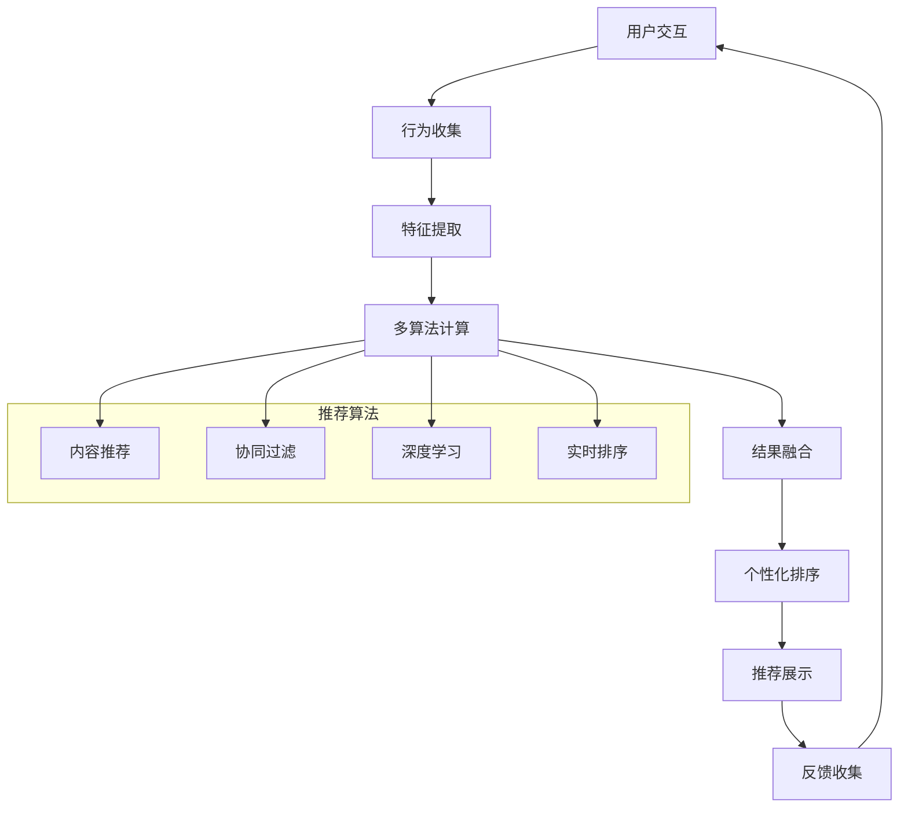
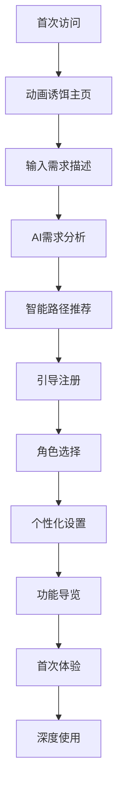
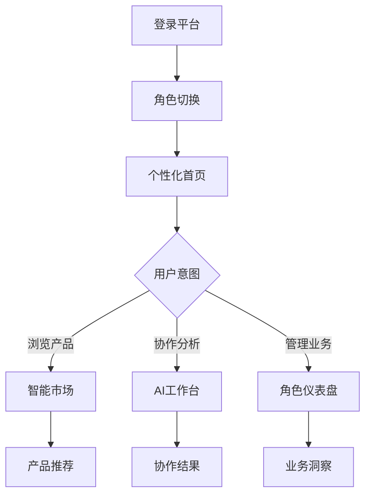

# LaunchX 智链平台 v3 - 完整页面架构设计

## 🎯 项目概述

基于现有的 zhilink-v3 项目，设计完整的二级、三级页面功能架构，包括动画诱饵主页、真实功能交互页面、智能推荐系统和完整的用户路径设计。

## 📋 目录结构

```
zhilink-v3/
├── src/
│   ├── app/                          # Next.js 15 App Router
│   │   ├── page.tsx                  # 🎭 Level 0: 动画诱饵主页
│   │   ├── market/                   # 🛍️ Level 1: AI能力市场
│   │   │   ├── page.tsx             # 市场主页 - 产品展示
│   │   │   ├── search/              # 搜索和筛选
│   │   │   │   └── page.tsx
│   │   │   ├── category/            # 分类浏览
│   │   │   │   └── [slug]/page.tsx
│   │   │   └── compare/             # 产品对比
│   │   │       └── page.tsx
│   │   ├── product/                 # 🔍 Level 2: 产品详情
│   │   │   ├── [id]/
│   │   │   │   ├── page.tsx         # 产品详情页
│   │   │   │   ├── demo/page.tsx    # 产品演示
│   │   │   │   └── reviews/page.tsx # 用户评价
│   │   │   └── bulk/page.tsx        # 批量选择页面
│   │   ├── workspace/               # 💼 Level 1: 智能工作台
│   │   │   ├── page.tsx             # 工作台首页
│   │   │   ├── projects/            # 项目管理
│   │   │   │   ├── page.tsx
│   │   │   │   ├── [id]/page.tsx
│   │   │   │   └── new/page.tsx
│   │   │   ├── specs/               # Specs 需求分析
│   │   │   │   ├── page.tsx
│   │   │   │   ├── [id]/page.tsx
│   │   │   │   └── new/page.tsx
│   │   │   └── collaboration/       # AI协作会话
│   │   │       ├── page.tsx
│   │   │       └── [sessionId]/page.tsx
│   │   ├── chat/                    # 💬 Level 1: AI智能对话
│   │   │   ├── page.tsx             # 对话主页
│   │   │   ├── [sessionId]/page.tsx # 具体对话会话
│   │   │   └── history/page.tsx     # 对话历史
│   │   ├── dashboard/               # 📊 Level 1: 多角色仪表盘
│   │   │   ├── buyer/               # 采购方仪表盘
│   │   │   │   ├── page.tsx
│   │   │   │   ├── orders/page.tsx
│   │   │   │   └── favorites/page.tsx
│   │   │   ├── vendor/              # 供应商仪表盘
│   │   │   │   ├── page.tsx
│   │   │   │   ├── products/page.tsx
│   │   │   │   └── analytics/page.tsx
│   │   │   └── distributor/         # 分销商仪表盘
│   │   │       ├── page.tsx
│   │   │       ├── links/page.tsx
│   │   │       └── earnings/page.tsx
│   │   ├── auth/                    # 🔐 Level 2: 用户认证
│   │   │   ├── login/page.tsx
│   │   │   ├── register/page.tsx
│   │   │   ├── verify/page.tsx
│   │   │   └── onboarding/page.tsx
│   │   ├── profile/                 # 👤 Level 2: 用户档案
│   │   │   ├── page.tsx
│   │   │   ├── settings/page.tsx
│   │   │   ├── security/page.tsx
│   │   │   └── billing/page.tsx
│   │   └── admin/                   # 🛠️ Level 2: 管理后台
│   │       ├── page.tsx
│   │       ├── products/page.tsx
│   │       ├── users/page.tsx
│   │       └── analytics/page.tsx
│   ├── components/                  # 组件库
│   │   ├── layout/                  # 布局组件
│   │   ├── navigation/              # 导航组件
│   │   ├── recommendation/          # 推荐系统组件
│   │   ├── collaboration/           # 协作系统组件
│   │   ├── product/                 # 产品展示组件
│   │   └── dashboard/               # 仪表盘组件
│   ├── services/                    # 服务层
│   │   ├── recommendation-engine.ts # 智能推荐引擎
│   │   ├── collaboration-service.ts # AI协作服务
│   │   ├── product-service.ts       # 产品管理服务
│   │   └── analytics-service.ts     # 数据分析服务
│   └── types/                       # 类型定义
└── prisma/                          # 数据库
```

## 🎭 Level 0: 动画诱饵主页 (/)

### 设计理念
- **拂晓深空设计** - 融合温暖与专业的视觉体验
- **渐进式引导** - 从视觉震撼到功能体验的自然过渡
- **6AI协作展示** - 核心卖点的动态呈现

### 核心功能
1. **大对话框中心设计** - 全屏对话输入框
2. **AI角色动态展示** - 6个AI专家的动画介绍
3. **智能引导系统** - 基于用户输入的智能路径推荐
4. **背景动画效果** - 星空、光效、浮动元素

### 跳转逻辑
```typescript
// 用户输入分析 -> 路径推荐
const analyzeUserIntent = (input: string) => {
  if (input.includes('产品') || input.includes('购买')) 
    return '/market';
  if (input.includes('需求') || input.includes('分析')) 
    return '/workspace/specs/new';
  if (input.includes('对话') || input.includes('咨询')) 
    return '/chat';
  return '/market'; // 默认路径
};
```

## 🛍️ Level 1: AI能力市场 (/market)

### 页面结构

#### 主市场页面 (/market)
- **产品展示网格** - 三大产品类型统一展示
- **智能筛选系统** - 基于14个分类的动态筛选
- **实时推荐** - 基于用户行为的个性化推荐
- **产品对比功能** - 多产品并行对比

#### 搜索页面 (/market/search)
- **高级搜索** - 支持多维度组合搜索
- **搜索建议** - 智能搜索补全和纠错
- **搜索历史** - 个人搜索记录管理

#### 分类浏览 (/market/category/[slug])
- **分类详情** - 特定分类的深度展示
- **分类推荐** - 分类内的智能推荐
- **相关分类** - 交叉推荐系统

#### 产品对比 (/market/compare)
- **并行对比** - 最多5个产品同时对比
- **功能矩阵** - 详细功能对比表格
- **价格分析** - TCO（总拥有成本）分析

## 🔍 Level 2: 产品详情 (/product/[id])

### 页面功能

#### 产品详情主页
- **产品信息** - 完整的产品描述和规格
- **供应商信息** - 供应商资质和信誉展示
- **定价模型** - 详细的定价结构和计算器
- **用户评价** - 真实用户评价和评分
- **相关推荐** - 相似产品和互补产品推荐

#### 产品演示 (/product/[id]/demo)
- **在线试用** - 产品功能的实时演示
- **API测试** - 开发者友好的API调试工具
- **使用案例** - 实际业务场景演示

#### 用户评价 (/product/[id]/reviews)
- **评价展示** - 详细的用户评价和反馈
- **评价分析** - 评价数据的智能分析
- **评价筛选** - 按评分、时间、角色筛选

## 💼 Level 1: 智能工作台 (/workspace)

### 核心理念
基于用户角色的个性化工作空间，支持项目管理、需求分析和AI协作。

#### 工作台首页 (/workspace)
- **角色仪表盘** - 根据当前角色显示相关功能
- **快速入口** - 常用功能的快速访问
- **进度追踪** - 项目和任务的进度可视化
- **智能提醒** - 基于AI的工作提醒和建议

#### 项目管理 (/workspace/projects)
- **项目列表** - 所有项目的统一管理
- **项目详情** - 单个项目的详细信息和进度
- **新建项目** - 项目创建向导和模板

#### Specs需求分析 (/workspace/specs)
- **需求管理** - 需求文档的创建和管理
- **AI分析** - 6角色协作的需求分析
- **需求匹配** - 需求与产品的智能匹配

#### AI协作会话 (/workspace/collaboration)
- **协作历史** - 所有协作会话的管理
- **实时协作** - 与6AI专家的实时对话
- **协作结果** - 协作成果的整理和导出

## 💬 Level 1: AI智能对话 (/chat)

### 功能特性

#### 对话主页 (/chat)
- **会话列表** - 历史对话的管理和搜索
- **快速开始** - 预设话题的快速对话入口
- **AI角色选择** - 选择特定AI专家进行对话

#### 对话会话 (/chat/[sessionId])
- **实时对话** - 与AI的实时聊天界面
- **多媒体支持** - 文本、图片、文档的上传和处理
- **对话记录** - 对话历史的保存和搜索

#### 对话历史 (/chat/history)
- **历史管理** - 对话记录的分类和搜索
- **导出功能** - 对话内容的导出和分享
- **数据分析** - 对话数据的统计分析

## 📊 Level 1: 多角色仪表盘 (/dashboard)

### 角色适配

#### 采购方仪表盘 (/dashboard/buyer)
- **采购概览** - 采购统计和趋势分析
- **订单管理** - 订单状态和历史记录
- **收藏管理** - 收藏的产品和供应商

#### 供应商仪表盘 (/dashboard/vendor)
- **销售概览** - 销售数据和趋势分析
- **产品管理** - 产品上架和更新管理
- **客户分析** - 客户行为和反馈分析

#### 分销商仪表盘 (/dashboard/distributor)
- **分销概览** - 分销业绩和佣金统计
- **链接管理** - 分销链接的创建和管理
- **收入分析** - 佣金收入的详细分析

## 🔐 Level 2: 用户认证系统 (/auth)

### 认证流程

#### 登录页面 (/auth/login)
- **多种登录方式** - 邮箱、手机、第三方登录
- **安全验证** - 双因子认证和风险检测
- **角色选择** - 登录后的角色选择

#### 注册页面 (/auth/register)
- **分步注册** - 引导式的注册流程
- **角色注册** - 不同角色的差异化注册
- **企业认证** - 企业用户的资质验证

#### 邮箱验证 (/auth/verify)
- **邮箱验证** - 注册邮箱的验证流程
- **验证码管理** - 验证码的发送和验证

#### 用户引导 (/auth/onboarding)
- **角色引导** - 不同角色的功能介绍
- **偏好设置** - 个人偏好和通知设置
- **首次体验** - 新用户的产品体验引导

## 👤 Level 2: 用户档案系统 (/profile)

### 个人中心

#### 个人资料 (/profile)
- **基础信息** - 个人和企业信息管理
- **头像设置** - 头像上传和裁剪
- **资质展示** - 认证资质和徽章展示

#### 账户设置 (/profile/settings)
- **通知设置** - 各类通知的开关和配置
- **隐私设置** - 隐私权限的精细化控制
- **语言设置** - 界面语言和时区设置

#### 安全中心 (/profile/security)
- **密码管理** - 密码修改和强度检测
- **登录历史** - 登录记录和安全日志
- **设备管理** - 登录设备的管理和控制

#### 计费管理 (/profile/billing)
- **账单历史** - 历史账单和付款记录
- **付款方式** - 银行卡和支付方式管理
- **发票管理** - 发票申请和下载

## 🛠️ Level 2: 管理后台 (/admin)

### 管理功能

#### 后台首页 (/admin)
- **系统概览** - 系统状态和关键指标
- **操作日志** - 管理员操作的审计日志
- **系统通知** - 系统级别的通知和告警

#### 产品管理 (/admin/products)
- **产品审核** - 新产品的审核和上架
- **产品分类** - 产品分类的管理和维护
- **质量监控** - 产品质量的监控和评估

#### 用户管理 (/admin/users)
- **用户列表** - 所有用户的管理和查询
- **角色管理** - 用户角色的分配和权限管理
- **行为分析** - 用户行为的统计和分析

#### 数据分析 (/admin/analytics)
- **平台统计** - 平台整体的数据统计
- **收入分析** - 平台收入的详细分析
- **趋势预测** - 基于AI的趋势预测和建议

## 🤖 智能推荐系统架构

### 推荐算法设计

#### 1. 基于内容的推荐
```typescript
interface ContentBasedRecommendation {
  // 产品特征向量
  productFeatures: {
    type: ProductType;
    category: string;
    capabilities: string[];
    priceRange: string;
    tags: string[];
  };
  
  // 用户偏好向量
  userPreferences: {
    preferredTypes: ProductType[];
    budgetRange: [number, number];
    industryFocus: string[];
    technicalLevel: string;
  };
  
  // 相似度计算
  calculateSimilarity: (product: ProductData, preferences: UserPreferences) => number;
}
```

#### 2. 协同过滤推荐
```typescript
interface CollaborativeFiltering {
  // 用户-产品交互矩阵
  userItemMatrix: Map<string, Map<string, number>>;
  
  // 用户相似度计算
  calculateUserSimilarity: (userId1: string, userId2: string) => number;
  
  // 产品相似度计算
  calculateItemSimilarity: (productId1: string, productId2: string) => number;
  
  // 推荐生成
  generateRecommendations: (userId: string, k: number) => ProductRecommendation[];
}
```

#### 3. 深度学习推荐
```typescript
interface DeepLearningRecommendation {
  // 用户嵌入向量
  userEmbedding: number[];
  
  // 产品嵌入向量
  itemEmbedding: number[];
  
  // 上下文特征
  contextFeatures: {
    timeOfDay: string;
    deviceType: string;
    accessPattern: string;
    sessionDuration: number;
  };
  
  // 神经网络预测
  predictRating: (userId: string, productId: string, context: any) => number;
}
```

#### 4. 混合推荐策略
```typescript
interface HybridRecommendationEngine {
  // 多算法融合
  algorithms: {
    contentBased: ContentBasedRecommendation;
    collaborative: CollaborativeFiltering;
    deepLearning: DeepLearningRecommendation;
  };
  
  // 权重分配
  weights: {
    contentWeight: number;
    collaborativeWeight: number;
    deepLearningWeight: number;
  };
  
  // 最终推荐
  generateFinalRecommendations: (
    userId: string,
    context: RecommendationContext
  ) => ProductRecommendation[];
}
```

### 实时推荐流程



## 🗂️ 产品信息标注规范

### 产品分类体系

#### 14个核心分类
```typescript
enum ProductCategory {
  // 基础AI能力
  TEXT_PROCESSING = "文本处理",
  IMAGE_PROCESSING = "图像处理", 
  VOICE_PROCESSING = "语音处理",
  VIDEO_PROCESSING = "视频处理",
  
  // 行业专业能力
  LEGAL_PROFESSIONAL = "法律专业",
  MEDICAL_PROFESSIONAL = "医疗专业",
  FINANCE_PROFESSIONAL = "金融专业",
  EDUCATION_PROFESSIONAL = "教育专业",
  
  // 业务功能能力
  CUSTOMER_SERVICE = "客户服务",
  DATA_ANALYSIS = "数据分析",
  CONTENT_CREATION = "内容创作",
  AUTOMATION = "流程自动化",
  
  // 新兴技术
  ROBOTICS = "机器人技术",
  IOT_INTEGRATION = "物联网集成"
}
```

#### 产品标签体系
```typescript
interface ProductTagging {
  // 技术标签
  techTags: {
    aiModel: string[];        // AI模型类型
    framework: string[];      // 技术框架
    deployment: string[];     // 部署方式
    integration: string[];    // 集成方式
  };
  
  // 业务标签
  businessTags: {
    industry: string[];       // 适用行业
    useCase: string[];       // 使用场景
    userType: string[];      // 用户类型
    complexity: string;      // 复杂度等级
  };
  
  // 质量标签
  qualityTags: {
    certification: string[]; // 认证资质
    compliance: string[];    // 合规标准
    security: string[];      // 安全等级
    performance: string[];   // 性能指标
  };
}
```

### 产品质量评估模型

```typescript
interface ProductQualityAssessment {
  // 功能性评估
  functionality: {
    featureCompleteness: number;  // 功能完整性 (0-100)
    accuracy: number;             // 准确率 (0-100)
    reliability: number;          // 可靠性 (0-100)
    usability: number;           // 易用性 (0-100)
  };
  
  // 性能评估
  performance: {
    responseTime: number;         // 响应时间 (ms)
    throughput: number;          // 吞吐量 (requests/sec)
    availability: number;        // 可用性 (%)
    scalability: string;         // 扩展性等级
  };
  
  // 安全性评估
  security: {
    dataProtection: number;      // 数据保护 (0-100)
    accessControl: number;       // 访问控制 (0-100)
    auditTrail: number;         // 审计追踪 (0-100)
    compliance: string[];        // 合规认证
  };
  
  // 商业价值评估
  businessValue: {
    roi: number;                // 投资回报率 (%)
    costEfficiency: number;     // 成本效率 (0-100)
    marketFit: number;         // 市场匹配度 (0-100)
    customerSatisfaction: number; // 客户满意度 (0-100)
  };
}
```

## 🔄 用户交互流程设计

### 完整用户旅程

#### 新用户旅程


#### 回访用户旅程


### 状态管理架构

```typescript
// 全局状态管理
interface AppState {
  // 用户状态
  user: {
    profile: User | null;
    currentRole: UserRole;
    preferences: UserPreferences;
    permissions: Permission[];
  };
  
  // UI状态
  ui: {
    theme: 'light' | 'dark' | 'system';
    sidebarCollapsed: boolean;
    activeModals: string[];
    notifications: Notification[];
  };
  
  // 业务状态
  business: {
    selectedProducts: string[];
    currentProject: Project | null;
    collaborationSession: CollaborationSession | null;
    searchFilters: SearchFilters;
  };
  
  // 推荐状态
  recommendations: {
    products: ProductRecommendation[];
    lastUpdated: Date;
    loading: boolean;
    context: RecommendationContext;
  };
}

// 状态操作
interface AppActions {
  // 用户操作
  setUser: (user: User) => void;
  switchRole: (role: UserRole, context: string) => void;
  updatePreferences: (preferences: Partial<UserPreferences>) => void;
  
  // UI操作
  toggleTheme: () => void;
  showNotification: (notification: Notification) => void;
  openModal: (modalId: string, props?: any) => void;
  
  // 业务操作
  selectProduct: (productId: string) => void;
  startCollaboration: (query: string) => void;
  applyFilters: (filters: SearchFilters) => void;
  
  // 推荐操作
  refreshRecommendations: (context?: RecommendationContext) => void;
  recordInteraction: (interaction: UserInteraction) => void;
}
```

## 🚀 技术实现要点

### 1. 性能优化
- **代码分割** - 基于路由的懒加载
- **缓存策略** - 多层缓存架构
- **CDN优化** - 静态资源和API缓存
- **图片优化** - WebP格式和响应式图片

### 2. 用户体验
- **渐进式加载** - 骨架屏和加载状态
- **离线支持** - PWA和Service Worker
- **响应式设计** - 移动端优先设计
- **无障碍访问** - WCAG 2.1 AA级别合规

### 3. 安全保障
- **认证授权** - JWT + RBAC权限控制
- **数据保护** - 端到端加密和数据脱敏
- **API安全** - 请求签名和速率限制
- **内容安全** - XSS防护和CSRF保护

### 4. 监控运维
- **性能监控** - Core Web Vitals跟踪
- **错误监控** - 实时错误捕获和报告
- **用户行为** - 用户旅程和转化分析
- **业务指标** - 关键业务指标监控

## 📈 数据驱动优化

### 关键指标设计

#### 用户体验指标
```typescript
interface UXMetrics {
  // 页面性能
  pageLoadTime: number;
  timeToInteractive: number;
  cumulativeLayoutShift: number;
  
  // 用户行为
  sessionDuration: number;
  pageViews: number;
  bounceRate: number;
  conversionRate: number;
  
  // 功能使用
  featureAdoption: Record<string, number>;
  userJourneyCompletion: number;
  errorRate: number;
}
```

#### 业务指标
```typescript
interface BusinessMetrics {
  // 平台指标
  activeUsers: number;
  newUserRegistration: number;
  userRetention: number;
  
  // 交易指标
  grossMerchandiseVolume: number;
  averageOrderValue: number;
  transactionSuccessRate: number;
  
  // 推荐效果
  recommendationClickRate: number;
  recommendationConversionRate: number;
  recommendationRevenue: number;
}
```

### A/B测试框架

```typescript
interface ABTestFramework {
  // 实验定义
  experiments: {
    id: string;
    name: string;
    description: string;
    variants: Variant[];
    targetingRules: TargetingRule[];
    metrics: string[];
  }[];
  
  // 用户分组
  assignVariant: (userId: string, experimentId: string) => string;
  
  // 指标收集
  trackEvent: (userId: string, event: string, properties: any) => void;
  
  // 结果分析
  analyzeResults: (experimentId: string) => ExperimentResults;
}
```

## 🎯 未来扩展计划

### Phase 1: 核心功能完善 (当前)
- 完整页面架构实现
- 基础推荐系统
- 用户认证和角色管理
- 产品展示和搜索

### Phase 2: 智能化增强 (Q2 2024)
- 高级推荐算法
- AI协作系统优化
- 实时数据分析
- 个性化体验增强

### Phase 3: 生态系统建设 (Q3 2024)
- 开发者API平台
- 第三方集成框架
- 合作伙伴生态
- 国际化支持

### Phase 4: 企业级功能 (Q4 2024)
- 企业级部署方案
- 高级安全功能
- 定制化服务
- 专业技术支持

---

## 📝 总结

这个完整的页面架构设计为LaunchX智链平台v3提供了：

1. **清晰的页面层级** - 从动画诱饵到深度功能的完整路径
2. **智能推荐系统** - 多算法融合的个性化推荐
3. **完整用户旅程** - 新用户到专业用户的全生命周期支持
4. **技术架构保障** - 现代化的技术栈和最佳实践
5. **数据驱动优化** - 完整的指标体系和A/B测试框架

这个架构将支撑平台的快速发展，为用户提供卓越的AI解决方案发现和采购体验。