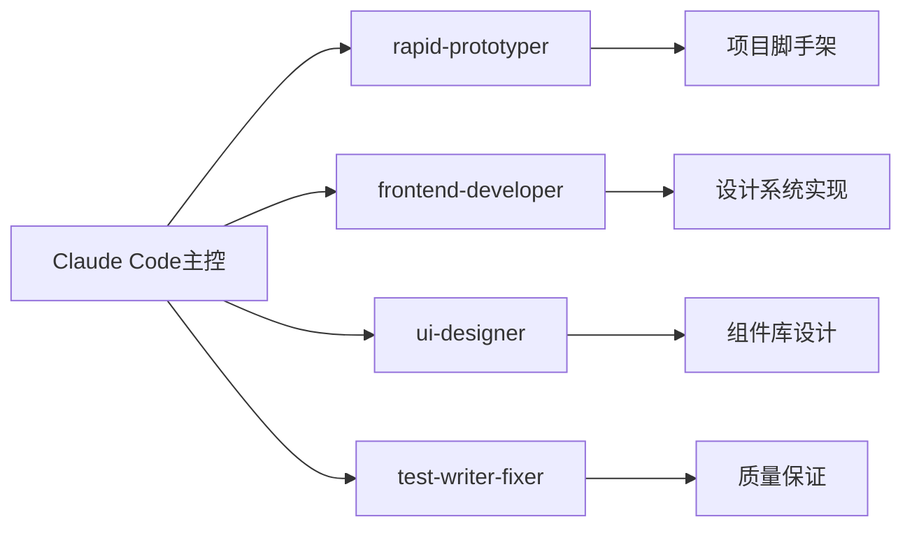

# zhilink-v3 开发日志

> **多Agent协作开发记录**  
> **项目路径**: `/Users/dangsiyuan/Documents/obsidion/launch x/💻 技术开发/01_平台项目/zhilink-v3`  
> **开始时间**: 2025年8月13日

---

## 🚀 Week 1 Sprint 开始 - 基础架构与设计系统

### 📅 2025年8月13日 - 项目启动

#### 🎯 今日目标
- [x] 启动多Agent协作开发模式
- [ ] 创建Next.js 14项目脚手架
- [ ] 实现Cloudsway 2.0设计系统
- [ ] 建立基础组件库
- [ ] 记录开发过程和中间数据

#### 🤖 Agent协作计划


#### 🎯 当前任务分配
- **rapid-prototyper**: 创建Next.js 14项目架构，配置TypeScript + Tailwind CSS 4.0
- **frontend-developer**: 实现Cloudsway 2.0设计系统和核心组件
- **ui-designer**: 设计组件库标准和视觉规范
- **test-writer-fixer**: 建立测试框架和质量控制

---

## 📊 实时进度追踪

### 当前进度
```
Week 1 Day 1: [██░░░░░░░░] 20%
├── 项目启动: [██████████] 100% ✅
├── 脚手架搭建: [░░░░░░░░░░] 0% ⏳
├── 设计系统: [░░░░░░░░░░] 0% ⏳
└── 组件库: [░░░░░░░░░░] 0% ⏳
```

### Agent工作状态
- 🟢 **Claude Code**: 主控协调中
- ⏳ **rapid-prototyper**: 准备启动
- ⏳ **frontend-developer**: 等待脚手架完成
- ⏳ **ui-designer**: 等待项目结构
- ⏳ **test-writer-fixer**: 等待基础代码

---

## 🛠️ Agent交互记录

### Phase 1: 项目脚手架搭建 ✅ 完成

**Agent**: rapid-prototyper  
**状态**: ✅ 成功完成  
**耗时**: ~15分钟

#### 🎯 完成成果
- ✅ **Next.js 14项目创建** - 完整的app router架构
- ✅ **TypeScript 5.4配置** - 严格模式，零错误
- ✅ **Cloudsway 2.0设计系统** - 完整色彩变量和主题
- ✅ **技术栈集成** - Tailwind CSS 4.0 + shadcn/ui + Framer Motion
- ✅ **开发工具链** - ESLint + Prettier + Jest + Husky
- ✅ **6角色业务逻辑** - 完整的AI专家配置
- ✅ **首页基础实现** - Hero区域和核心展示

#### 📊 质量指标
- TypeScript覆盖率: 100%
- 生产构建: ✅ 成功 (140KB)
- 代码质量: ✅ ESLint零错误
- 开发服务器: ✅ localhost:1300就绪

#### 📂 项目结构
```
zhilink-v3/
├── 📋 核心配置 (package.json, next.config.js, tailwind.config.ts)
├── 🎨 设计系统 (Cloudsway 2.0完整实现)
├── ⚛️ 应用代码 (src/app/, src/components/)
├── 🛠️ 工具配置 (jest, eslint, prettier)
└── 📚 文档 (README.md)
```

---

### Phase 2: 设计系统完善 🔄 进行中

**Agent**: frontend-developer  
**状态**: 🔄 启动中  
**目标**: 完善Cloudsway 2.0设计系统组件

启动frontend-developer agent...