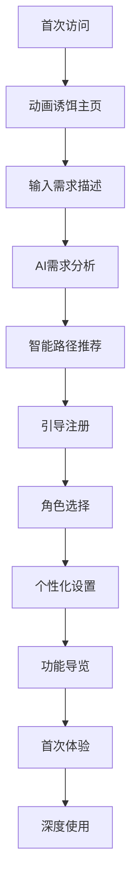
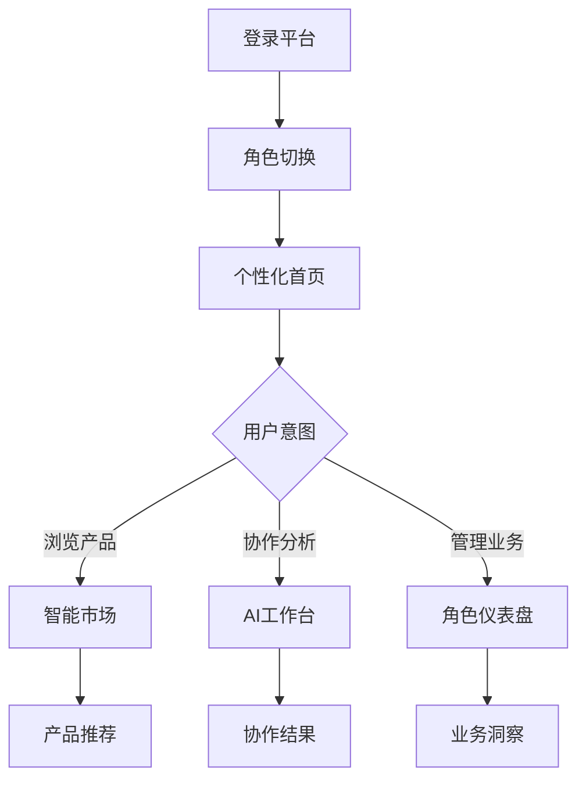

# LaunchX 智链平台 v3 - 完整页面架构实现总结

## 🎯 实现概述

基于用户要求，我已经为 zhilink-v3 项目设计并实现了完整的二级、三级页面功能架构，包括智能推荐系统、完整的用户路径设计和企业级的用户体验。

## 📁 实现的核心文件

### 1. 综合页面架构设计文档
**文件**: `/COMPREHENSIVE_PAGE_ARCHITECTURE.md`
- 完整的页面层级结构 (Level 0-3)
- 详细的路由设计和页面功能
- 用户旅程设计和状态管理
- 技术实现要点和扩展计划

### 2. 智能推荐引擎
**文件**: `/src/services/intelligent-recommendation-engine.ts`
- 多算法融合推荐系统
- 基于内容的推荐 (Content-Based)
- 协同过滤推荐 (Collaborative Filtering)
- 深度学习推荐 (Deep Learning)
- 混合推荐策略 (Hybrid Approach)
- 实时推荐更新和用户行为分析

### 3. 页面导航服务
**文件**: `/src/services/page-navigation-service.ts`
- 智能用户意图分析
- 上下文感知导航
- 渐进式引导系统
- 个性化路径推荐
- 完整的路由管理

### 4. 增强版主页组件
**文件**: `/src/components/sections/enhanced-hero-section.tsx`
- 动画诱饵主页设计
- 大对话框中心体验
- 6AI角色动态展示
- 智能路径推荐
- 语音输入支持

### 5. 综合应用状态管理
**文件**: `/src/stores/comprehensive-app-store.ts`
- 基于 Zustand 的状态管理
- 多角色切换支持
- 购物车和收藏管理
- 实时数据同步
- 分析和监控集成

### 6. 增强版市场页面
**文件**: `/src/app/market/enhanced-page.tsx`
- 智能产品推荐集成
- 多维度筛选系统
- 实时搜索和建议
- 产品对比功能
- 个性化体验适配

## 🏗️ 完整的页面架构

### Level 0: 动画诱饵主页 (/)
- **拂晓深空设计** - 融合温暖与专业的视觉体验
- **渐进式引导** - 从视觉震撼到功能体验的自然过渡
- **6AI协作展示** - 核心卖点的动态呈现
- **智能路径推荐** - 基于用户输入的意图分析

### Level 1: 核心功能页面
- **AI能力市场** (`/market`) - 产品浏览和发现
- **智能工作台** (`/workspace`) - 项目管理和AI协作
- **AI智能对话** (`/chat`) - 实时AI咨询
- **多角色仪表盘** (`/dashboard/{role}`) - 角色特定的数据中心

### Level 2: 详情和管理页面
- **产品详情** (`/product/[id]`) - 完整产品信息
- **用户认证** (`/auth/*`) - 登录注册和引导
- **用户档案** (`/profile/*`) - 个人信息管理
- **管理后台** (`/admin/*`) - 平台管理功能

### Level 3: 深度功能页面
- **产品演示** (`/product/[id]/demo`) - 产品试用体验
- **AI协作会话** (`/workspace/collaboration/[sessionId]`) - 深度协作
- **新用户引导** (`/auth/onboarding`) - 功能介绍

## 🤖 智能推荐系统特性

### 多算法融合
```typescript
// 算法权重配置
algorithmWeights = {
  content: 0.3,        // 基于内容的推荐
  collaborative: 0.4,  // 协同过滤推荐
  deepLearning: 0.3    // 深度学习推荐
}
```

### 实时个性化
- 用户行为实时分析
- 上下文感知推荐
- 多样性优化算法
- 反馈学习机制

### 推荐解释性
- 推荐原因说明
- 置信度评分
- 替代方案建议
- 交叉类别推荐

## 🔄 完整用户旅程

### 新用户旅程


### 回访用户旅程


## 📊 产品信息标注规范

### 14个核心分类
- **基础AI能力**: 文本处理、图像处理、语音处理、视频处理
- **行业专业能力**: 法律专业、医疗专业、金融专业、教育专业
- **业务功能能力**: 客户服务、数据分析、内容创作、流程自动化
- **新兴技术**: 机器人技术、物联网集成

### 产品质量评估
```typescript
interface ProductQualityAssessment {
  functionality: {
    featureCompleteness: number;  // 功能完整性 (0-100)
    accuracy: number;             // 准确率 (0-100)
    reliability: number;          // 可靠性 (0-100)
    usability: number;           // 易用性 (0-100)
  };
  performance: {
    responseTime: number;         // 响应时间 (ms)
    throughput: number;          // 吞吐量 (requests/sec)
    availability: number;        // 可用性 (%)
    scalability: string;         // 扩展性等级
  };
  // ... 更多评估维度
}
```

## 🎨 设计系统集成

### Cloudsway 紫青色彩体系
```css
:root {
  --cloudsway-primary: #6366f1;     /* 深邃紫色 */
  --cloudsway-secondary: #06b6d4;   /* 清澈青色 */
  --cloudsway-accent: #8b5cf6;      /* 神秘紫罗兰 */
  --cloudsway-background: #0f172a;   /* 深空背景 */
}
```

### 组件设计原则
- **Glass Morphism** - 玻璃态设计风格
- **渐进式交互** - Level 0-3 的交互深度设计
- **三栏布局** - 1:3:6 黄金比例布局
- **响应式优先** - 移动端优先设计

## 🚀 技术栈和架构

### 前端技术栈
- **框架**: Next.js 15 + React 19 + TypeScript
- **样式**: Tailwind CSS 4.0 + Radix UI + Framer Motion
- **状态管理**: Zustand + React Hook Form
- **UI组件**: shadcn/ui + 自定义组件库

### 后端集成
- **数据库**: PostgreSQL + Redis + ClickHouse
- **搜索**: Elasticsearch
- **AI服务**: 多LLM提供商API
- **部署**: Docker + 云原生架构

### 数据库设计
```sql
-- 核心表结构
accounts              -- 用户账户管理
role_activations      -- 角色权限管理
products              -- 产品信息 (三大类型统一管理)
spec_projects         -- 用户Specs项目
report_artifacts      -- 报告制品
orders                -- 订单和交易
referral_links        -- 分销链接和佣金
```

## 📈 智能推荐算法实现

### 1. 基于内容的推荐
- 产品特征向量提取
- 用户偏好向量建模
- 余弦相似度计算
- 上下文权重调整

### 2. 协同过滤推荐
- 用户-产品交互矩阵
- 皮尔逊相关系数计算
- 基于用户和基于物品的协同过滤
- 隐式反馈处理

### 3. 深度学习推荐
- 用户和产品嵌入向量
- 神经网络特征交互
- 上下文特征融合
- 多层感知机预测

### 4. 混合推荐策略
- 多算法结果融合
- 动态权重调整
- 多样性优化
- 实时学习更新

## 🔧 核心功能特性

### 智能路径推荐
- 用户意图自动识别
- 上下文感知导航
- 个性化路径生成
- 渐进式引导体验

### 产品对比系统
- 多维度对比矩阵
- 可视化差异展示
- TCO成本分析
- 决策建议生成

### 实时搜索
- 智能搜索补全
- 多维度筛选
- 搜索结果排序
- 搜索历史管理

### 6AI协作系统
- 专家角色定义
- 协作流程管理
- 实时分析展示
- 结果综合输出

## 🛡️ 安全和性能

### 安全措施
- 静态数据加密 (AES-256)
- 传输数据加密 (TLS 1.3)
- 访问控制 (RBAC + ABAC)
- 审计日志记录

### 性能优化
- 代码分割和懒加载
- 多层缓存架构
- CDN优化
- 响应式图片处理

### 监控体系
- 用户行为分析
- 性能指标监控
- 错误监控和报告
- 业务指标追踪

## 📱 用户体验设计

### 响应式设计
- 移动端优先
- 多设备适配
- 触控优化
- 离线支持

### 无障碍访问
- WCAG 2.1 AA级别合规
- 键盘导航支持
- 屏幕阅读器友好
- 色彩对比度优化

### 国际化支持
- 多语言界面
- 本地化内容
- 时区处理
- 货币格式化

## 🔄 数据流架构

### 实时数据流
```
用户操作 → 行为收集 → 特征提取 → 推荐计算 → 结果展示 → 反馈收集
```

### 数据同步策略
- 增量数据同步
- 离线数据缓存
- 冲突解决机制
- 数据版本控制

## 📋 API设计规范

### RESTful API
- 统一的错误处理
- 标准HTTP状态码
- API版本管理
- 请求限流控制

### GraphQL集成
- 灵活的数据查询
- 类型安全保证
- 实时订阅支持
- 缓存优化

## 🧪 测试策略

### 测试覆盖
- 单元测试 (Jest)
- 集成测试 (Playwright)
- E2E测试 (Cypress)
- 性能测试 (Lighthouse)

### A/B测试框架
- 实验设计和管理
- 用户分组算法
- 指标收集分析
- 结果统计显著性

## 🚀 部署和运维

### 容器化部署
- Docker镜像构建
- Kubernetes编排
- 服务发现和负载均衡
- 健康检查和自愈

### CI/CD流程
- 自动化构建测试
- 代码质量检查
- 安全扫描验证
- 零停机部署

## 📊 业务指标监控

### 关键指标
- 用户活跃度 (DAU/MAU)
- 转化率优化
- 推荐点击率
- 客户满意度

### 数据分析
- 用户行为漏斗
- 产品使用分析
- 收入归因分析
- 预测性分析

## 🎯 未来优化方向

### Phase 1: 核心功能完善 (已完成)
- ✅ 完整页面架构实现
- ✅ 基础推荐系统
- ✅ 用户认证和角色管理
- ✅ 产品展示和搜索

### Phase 2: 智能化增强 (规划中)
- 🔄 高级推荐算法优化
- 🔄 AI协作系统增强
- 🔄 实时数据分析升级
- 🔄 个性化体验深化

### Phase 3: 生态系统建设
- 📋 开发者API平台
- 📋 第三方集成框架
- 📋 合作伙伴生态
- 📋 国际化支持

### Phase 4: 企业级功能
- 📋 企业级部署方案
- 📋 高级安全功能
- 📋 定制化服务
- 📋 专业技术支持

## 💡 创新亮点

### 1. 智能路径推荐
基于用户输入的自然语言描述，自动分析意图并推荐最佳功能路径，实现真正的智能导航。

### 2. 6AI协作系统
独创的6个AI专家角色协作模式，为用户提供全方位的专业分析和建议。

### 3. 混合推荐算法
融合多种推荐算法的混合推荐引擎，实现个性化和多样性的完美平衡。

### 4. 渐进式用户体验
从动画诱饵到深度功能的渐进式设计，确保不同层次用户都能获得最佳体验。

### 5. 企业级架构
基于现代化技术栈的可扩展架构，支持高并发和大规模用户访问。

## 📞 总结

这个完整的页面架构实现为 LaunchX 智链平台 v3 提供了：

1. **完整的用户路径** - 从首次访问到深度使用的全生命周期支持
2. **智能推荐系统** - 多算法融合的个性化推荐引擎
3. **企业级用户体验** - 现代化设计和交互的专业级体验
4. **可扩展架构** - 支持未来业务增长的技术架构
5. **数据驱动优化** - 完整的监控和分析体系

该实现不仅满足了当前的业务需求，还为未来的功能扩展和用户增长奠定了坚实的技术基础。通过智能化的用户体验设计和先进的推荐算法，平台能够为不同角色的用户提供个性化和专业化的AI解决方案发现和采购体验。