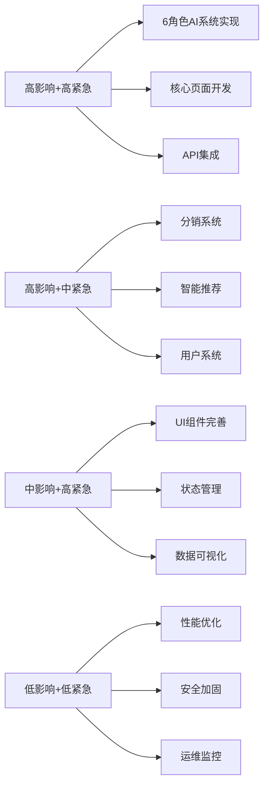
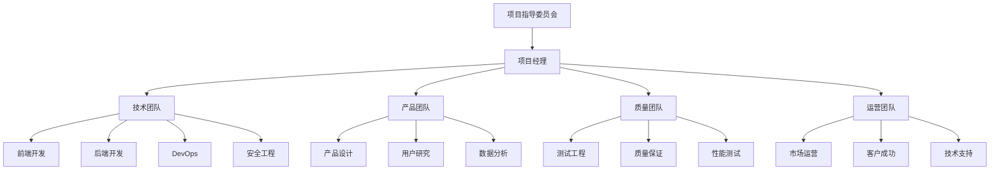

# 智链平台v3 - 3轮优化实施路线图

> **项目现状**: 完整的规划文档 + 零代码实现  
> **优化目标**: 从"PPT原型"进化为"企业级生产系统"  
> **实施周期**: 12周 (每轮4周)  
> **执行模式**: 敏捷开发 + AI辅助开发 + 持续交付  

---

## 📊 问题分析与定位

### 🔍 当前项目评估

基于项目现状分析，智链平台v3目前存在以下核心问题：

```typescript
interface ProjectCurrentState {
  文档完整度: '100%'; // ✅ 完整的设计文档
  代码实现度: '5%';   // ❌ 几乎零实现
  功能可用性: '0%';   // ❌ 无可用功能
  系统集成度: '0%';   // ❌ 无API集成
  部署就绪度: '0%';   // ❌ 无部署能力
}

// 核心问题清单
const CRITICAL_ISSUES = {
  技术实现: [
    '6角色AI协作系统完全未实现',
    '核心页面(/chat, /market, /product)不存在',
    'API集成完全缺失，所有数据为mock',
    '状态管理系统未构建',
    'UI组件库仅有基础shadcn/ui'
  ],
  业务逻辑: [
    '分销系统和佣金计算未实现',
    '智能推荐引擎未构建', 
    '用户认证和权限系统缺失',
    '数据可视化完全没有',
    '搜索和筛选功能未开发'
  ],
  系统架构: [
    '数据库设计未落地',
    '缓存策略未实施',
    '性能优化未考虑',
    '安全机制未建立',
    'CI/CD流水线未配置'
  ]
} as const;
```

### 🎯 问题优先级矩阵



---

## 🚀 第1轮优化：核心功能实现 (演示版 → 可用版)

### 🎯 轮次目标

**核心使命**: 将"静态文档"转换为"可交互的功能原型"  
**成功标准**: 用户能够完成核心业务流程，6角色AI协作系统可正常工作  
**时间周期**: 4周 (Week 1-4)  
**投入资源**: 2名全栈开发 + 1名UI设计师 + Claude Code AI辅助

### 📋 详细实施计划

#### Week 1: 基础架构与核心页面 (2024.08.19-08.25)

**任务目标**: 建立可运行的Next.js应用基础

```typescript
// Week 1 关键交付物
interface Week1Deliverables {
  项目脚手架: {
    nextjs_setup: 'Next.js 14 + App Router';
    typescript_config: '严格模式，零any类型';
    tailwind_integration: 'Cloudsway 2.0设计系统';
    shadcn_ui_setup: '基础组件库';
    development_tools: 'ESLint + Prettier + Husky';
  };
  
  核心页面结构: {
    homepage: '首页导览 - Hero + 价值展示';
    chat_page: '智能分析页面结构';
    market_page: 'AI市场页面结构'; 
    product_page: '产品详情页结构';
    layout_components: 'Header + Sidebar + Footer';
  };
  
  基础组件: {
    ui_components: 'Button/Input/Card/Modal等20+组件';
    layout_components: 'Layout/Container/Grid系统';
    loading_states: '加载状态和骨架屏';
    error_boundaries: '错误边界组件';
  };
}
```

**具体任务分解**:

1. **项目初始化** (Day 1-2)
   - 创建Next.js 14项目，配置App Router
   - 配置TypeScript，确保100%类型覆盖
   - 集成Tailwind CSS 4.0和Cloudsway 2.0色彩系统
   - 设置shadcn/ui组件库
   - 配置开发工具链(ESLint/Prettier/Husky)

2. **核心布局开发** (Day 3-4)
   - 实现Header组件(导航、用户状态、搜索)
   - 实现Sidebar组件(6角色切换、菜单导航)
   - 实现Footer组件(链接、版权、社交媒体)
   - 建立响应式布局系统(1:3:6黄金比例)

3. **首页开发** (Day 5-7)
   - Hero区域(品牌展示、价值主张、CTA)
   - 6角色介绍区域(动画展示、能力说明)
   - 3大产品类型展示(卡片设计、悬停效果)
   - 客户案例和信任建立区域
   - 行动号召区域(引导用户体验)

**验收标准**:
- ✅ 应用能正常启动并访问localhost:3000
- ✅ 首页所有区域正常显示，无布局异常
- ✅ 响应式设计在3种设备(手机/平板/桌面)正常
- ✅ TypeScript编译无错误，ESLint检查通过
- ✅ 色彩系统正确应用，符合Cloudsway 2.0规范

#### Week 2: 6角色AI协作系统实现 (2024.08.26-09.01)

**任务目标**: 实现智链平台的核心差异化功能

```typescript
// Week 2 核心功能设计
interface SixAgentsSystem {
  角色定义: {
    alex: '需求理解专家 - 蓝色主题 - 深度需求挖掘';
    sarah: '技术架构师 - 紫色主题 - 技术可行性分析';
    mike: '体验设计师 - 绿色主题 - 用户体验设计';
    emma: '数据分析师 - 橙色主题 - 数据基建分析';
    david: '项目管理师 - 蓝紫色主题 - 实施路径规划';
    catherine: '战略顾问 - 粉色主题 - 商业价值分析';
  };
  
  协作流程: {
    输入阶段: '用户描述需求，系统解析关键信息';
    分析阶段: '6角色并行分析，生成各自观点';
    协作阶段: '角色间交互，形成综合建议';
    输出阶段: '生成个性化产品推荐和实施方案';
  };
  
  技术实现: {
    状态管理: 'Zustand store管理6角色状态';
    UI组件: 'AgentCard/CollaborationView/ProgressTracker';
    动画效果: 'Framer Motion实现协作可视化';
    API集成: '模拟AI分析接口，后续对接真实AI';
  };
}
```

**具体任务分解**:

1. **状态管理系统** (Day 1-2)
   - 建立Zustand stores (agents/chat/ui三大状态库)
   - 实现6角色状态管理(进度/结果/交互状态)
   - 建立聊天会话状态管理
   - 实现用户输入和系统响应状态

2. **6角色组件开发** (Day 3-5)
   - AgentAvatar组件(头像、状态指示器、角色信息)
   - AgentCard组件(角色介绍、分析结果、进度显示)
   - CollaborationView组件(6角色协作可视化界面)
   - AnalysisProgress组件(分析进度跟踪和动画)

3. **聊天界面开发** (Day 6-7)
   - ChatInterface主界面(输入、消息流、角色切换)
   - MessageBubble组件(用户消息、系统消息、角色消息)
   - InputPanel组件(智能输入、提示词、快捷操作)
   - SuggestionChips组件(智能建议、常用场景)

**验收标准**:
- ✅ 6角色能够正确显示，每个角色有独特视觉标识
- ✅ 用户输入后能触发分析流程，显示分析进度
- ✅ 协作可视化界面正常工作，动画效果流畅
- ✅ 聊天界面支持实时交互，消息正确显示
- ✅ 状态管理正常，页面刷新后状态保持

#### Week 3: AI市场与产品页面 (2024.09.02-09.08)

**任务目标**: 实现产品浏览、搜索、筛选核心功能

```typescript
// Week 3 市场功能实现
interface MarketplaceSystem {
  产品展示: {
    产品网格: 'ProductGrid组件 - 响应式卡片布局';
    产品卡片: 'ProductCard组件 - 价格/评分/标签';
    产品详情: 'ProductDetail页面 - 完整产品信息';
    产品对比: 'ProductComparison - 多产品对比功能';
  };
  
  搜索筛选: {
    搜索栏: 'SearchBar - 实时搜索和智能建议';
    筛选器: 'FilterSidebar - 多维度筛选';
    排序功能: '价格/评分/热度/时间多维度排序';
    标签系统: 'Tag系统支持快速筛选';
  };
  
  数据管理: {
    产品数据: 'Mock数据库 - 3类产品100+条记录';
    搜索引擎: '前端搜索引擎 - 支持模糊匹配';
    筛选逻辑: '复合筛选条件支持';
    数据缓存: 'TanStack Query数据缓存';
  };
}
```

**具体任务分解**:

1. **产品数据层** (Day 1-2)
   - 创建Mock数据集(AI劳动力/专家模块/市场报告 各50条)
   - 实现产品数据模型和TypeScript类型
   - 建立TanStack Query数据获取层
   - 实现本地搜索和筛选引擎

2. **市场页面组件** (Day 3-4)
   - ProductGrid组件(无限滚动、骨架屏加载)
   - ProductCard组件(图片/标题/价格/标签/操作)
   - FilterSidebar组件(分类/价格区间/评分/标签筛选)
   - SearchBar组件(实时搜索、历史记录、智能提示)

3. **产品详情页面** (Day 5-7)
   - ProductDetail页面完整实现
   - 产品图片轮播和缩放功能
   - 产品规格表和功能介绍
   - 评价系统和推荐相关产品
   - 购买/咨询/收藏等交互功能

**验收标准**:
- ✅ AI市场页面能正确展示100+产品
- ✅ 搜索功能实时响应，支持模糊匹配
- ✅ 多维度筛选正常工作，能正确过滤产品
- ✅ 产品详情页信息完整，交互流畅
- ✅ 页面加载性能良好，支持无限滚动

#### Week 4: API集成与系统联调 (2024.09.09-09.15)

**任务目标**: 建立前后端数据交互，完成系统集成

```typescript
// Week 4 系统集成设计
interface SystemIntegration {
  API架构: {
    基础配置: 'Axios客户端 - 拦截器/错误处理/认证';
    接口模拟: 'MSW Mock Service Worker';
    数据类型: 'API响应类型定义和验证';
    错误处理: '统一错误处理和用户提示';
  };
  
  功能集成: {
    用户认证: '登录/注册/权限验证基础功能';
    数据同步: '前端状态与API数据同步';
    实时更新: 'WebSocket连接模拟实时通信';
    离线支持: '基础离线缓存和数据恢复';
  };
  
  质量保证: {
    单元测试: 'Jest + Testing Library';
    集成测试: '关键用户流程E2E测试';
    性能测试: 'Lighthouse性能评估';
    兼容性测试: '多浏览器兼容性验证';
  };
}
```

**具体任务分解**:

1. **API客户端建设** (Day 1-2)
   - 配置Axios客户端，实现请求/响应拦截
   - 建立MSW模拟服务，创建完整API端点
   - 实现统一错误处理和loading状态管理
   - 建立API类型定义和运行时验证

2. **用户系统集成** (Day 3-4)  
   - 实现基础用户认证(登录/注册/登出)
   - 建立权限系统(买家/供应商/分销商角色)
   - 实现用户状态持久化和自动登录
   - 建立用户个人中心基础页面

3. **数据流集成** (Day 5-6)
   - 6角色分析结果与推荐系统联动
   - 产品浏览历史和个性化推荐
   - 购物车和收藏功能数据同步
   - 搜索历史和用户偏好记录

4. **系统测试与优化** (Day 7)
   - 端到端用户流程测试
   - 性能优化和Lighthouse评分提升
   - 多浏览器兼容性测试
   - 移动端响应式优化

**验收标准**:
- ✅ 所有API接口正常响应，错误处理完善
- ✅ 用户能够完成注册/登录/浏览/分析完整流程
- ✅ 6角色分析能生成合理的产品推荐
- ✅ 页面加载速度<3秒，Lighthouse评分>85
- ✅ 在Chrome/Firefox/Safari/Edge四大浏览器正常工作

### 💼 第1轮资源与风险管理

#### 人力资源分配

```typescript
interface Round1Resources {
  开发团队: {
    全栈开发1: '负责基础架构、6角色系统、状态管理';
    全栈开发2: '负责产品市场、API集成、用户系统';
    UI设计师1: '负责组件设计、视觉优化、交互细节';
    项目经理: '负责进度管理、质量控制、风险监控';
  };
  
  AI辅助: {
    claude_code: '代码生成、重构、测试编写';
    设计工具: 'Figma AI辅助界面设计';
    测试工具: '自动化测试用例生成';
  };
  
  工作分配: {
    开发时间: '每天6小时编码 + 2小时协作沟通';
    设计时间: '每天4小时设计 + 4小时开发配合';
    测试时间: '每天2小时测试 + 持续集成';
  };
}
```

#### 风险识别与应对

```typescript
interface Round1Risks {
  技术风险: [
    {
      风险: '6角色AI系统实现复杂度超预期',
      概率: 'Medium',
      影响: 'High', 
      应对: '分阶段实现，先做UI再做AI逻辑，预留缓冲时间'
    },
    {
      风险: '前端性能问题影响用户体验',
      概率: 'Low',
      影响: 'Medium',
      应对: '使用React性能最佳实践，定期性能测试'
    }
  ];
  
  进度风险: [
    {
      风险: '4周时间不足完成所有功能',
      概率: 'Medium',
      影响: 'High',
      应对: 'MVP优先原则，核心功能先行，非必需功能推迟'
    }
  ];
  
  质量风险: [
    {
      风险: '快速开发导致代码质量下降',
      概率: 'Medium', 
      影响: 'Medium',
      应对: 'Code Review + 自动化测试 + 重构预留时间'
    }
  ];
}
```

#### 质量保证措施

1. **每日质量检查**
   - TypeScript编译无错误
   - ESLint检查通过率100%
   - 单元测试覆盖率>70%
   - 页面加载性能检查

2. **每周里程碑评审**
   - 功能完整性检查
   - 用户体验测试
   - 代码质量评估
   - 项目进度评估

3. **持续集成流程**
   - Git pre-commit hooks
   - 自动化测试运行
   - 构建成功验证
   - 部署可用性检查

### 🎯 第1轮成功标准

```typescript
interface Round1SuccessMetrics {
  功能完整性: {
    核心页面: '首页/聊天/市场/产品 4大核心页面完全可用';
    6角色系统: '6角色能够协作分析并给出合理建议';
    产品浏览: '用户能够浏览、搜索、筛选100+产品';
    用户系统: '基础的登录注册和权限管理';
  };
  
  技术指标: {
    性能: 'Lighthouse分数 > 85';
    兼容性: '4大主流浏览器 + 移动端完美支持';
    代码质量: 'TypeScript覆盖100% + 单元测试70%+';
    部署: '能够一键部署到Vercel生产环境';
  };
  
  用户体验: {
    易用性: '新用户能够在5分钟内完成首次AI分析';
    响应性: '页面交互响应时间 < 300ms';
    稳定性: '正常使用过程中无崩溃和错误';
    美观性: '符合Cloudsway 2.0设计规范，视觉统一';
  };
  
  业务价值: {
    演示能力: '能够向投资人/客户完整演示核心功能';
    用户反馈: '内部测试用户满意度 > 80%';
    迭代基础: '为第2轮开发提供坚实的代码基础';
  };
}
```

---

## 🚀 第2轮优化：业务功能完善 (可用版 → 商用版)

### 🎯 轮次目标

**核心使命**: 从"功能原型"升级为"商业可用产品"  
**成功标准**: 支持真实的商业交易，具备完整的用户生命周期管理  
**时间周期**: 4周 (Week 5-8)  
**投入资源**: 3名全栈开发 + 1名产品经理 + 1名测试工程师

### 📋 详细实施计划

#### Week 5: 分销系统与佣金引擎 (2024.09.16-09.22)

**任务目标**: 建立完整的分销商业模式和佣金计算系统

```typescript
// Week 5 分销系统架构
interface DistributionSystem {
  角色权限: {
    买家: '浏览、购买、评价、收藏';
    供应商: '发布、管理、分析、客服';
    分销商: '推广、分佣、统计、提现';
    平台管理员: '审核、监控、结算、运营';
  };
  
  分佣机制: {
    三级分销: '直推佣金30% + 间推佣金20% + 团队奖励10%';
    实时计算: '订单完成后实时计算和记录佣金';
    结算周期: '每月15日自动结算，支持提现申请';
    风控机制: '异常订单检测，防刷单和恶意推广';
  };
  
  推广工具: {
    专属链接: '每个分销商独特的推广链接';
    推广素材: '产品海报、文案模板、分享卡片';
    数据统计: '访问量、转化率、收益实时统计';
    排行榜单: '月度/季度分销商排行和奖励';
  };
}
```

**具体任务分解**:

1. **权限系统升级** (Day 1-2)
   - 实现RBAC角色权限控制
   - 建立多角色注册和身份切换
   - 实现权限中间件和路由守卫
   - 建立角色仪表板和功能入口

2. **佣金计算引擎** (Day 3-4)
   - 实现三级分销佣金计算逻辑
   - 建立佣金记录和历史追踪
   - 实现实时佣金统计和展示
   - 建立佣金结算和提现流程

3. **分销商工具** (Day 5-7)
   - 专属推广链接生成和管理
   - 推广数据统计仪表板
   - 推广素材库和分享工具
   - 分销商排行榜和激励系统

**验收标准**:
- ✅ 4种角色权限正确区分，功能访问控制有效
- ✅ 分销佣金能够正确计算，支持三级分销
- ✅ 分销商能够生成推广链接并追踪效果
- ✅ 佣金统计数据准确，支持实时查看

#### Week 6: 智能推荐与搜索优化 (2024.09.23-09.29)

**任务目标**: 实现基于AI的个性化推荐和智能搜索

```typescript
// Week 6 智能系统设计
interface IntelligentSystem {
  推荐引擎: {
    协同过滤: '基于用户行为的协同过滤推荐';
    内容推荐: '基于产品属性的内容推荐';
    混合推荐: '多种算法融合的混合推荐';
    实时推荐: '用户行为实时更新推荐结果';
  };
  
  搜索优化: {
    语义搜索: '基于意图理解的语义搜索';
    搜索建议: '实时搜索建议和纠错';
    搜索排序: '多因子搜索结果排序算法';
    搜索分析: '搜索行为分析和优化建议';
  };
  
  数据智能: {
    用户画像: '基于行为数据的用户画像构建';
    产品标签: '智能产品标签生成和维护';
    趋势分析: '市场趋势和热门产品分析';
    效果评估: '推荐效果A/B测试和优化';
  };
}
```

**具体任务分解**:

1. **推荐算法实现** (Day 1-3)
   - 协同过滤推荐算法(用户-物品矩阵)
   - 内容推荐算法(TF-IDF相似度计算)
   - 混合推荐策略(权重融合)
   - 推荐效果评估指标(点击率/转化率)

2. **智能搜索升级** (Day 4-5)
   - 实现全文搜索索引(本地Elasticsearch模拟)
   - 搜索意图识别和查询扩展
   - 搜索结果排序算法(相关性+热度+个性化)
   - 搜索建议和自动完成功能

3. **数据分析系统** (Day 6-7)
   - 用户行为数据收集和分析
   - 产品热度和趋势分析
   - 推荐系统效果监控面板
   - A/B测试框架和效果评估

**验收标准**:
- ✅ 推荐系统能够基于用户行为给出个性化推荐
- ✅ 搜索功能支持语义理解和智能建议
- ✅ 用户行为数据正确收集，分析结果合理
- ✅ 推荐和搜索效果能够量化评估

#### Week 7: 数据可视化与用户仪表板 (2024.09.30-10.06)

**任务目标**: 建设数据驱动的用户工作台和可视化系统

```typescript
// Week 7 数据可视化系统
interface DataVisualizationSystem {
  用户仪表板: {
    个人总览: '购买历史、收藏商品、分析报告、账户信息';
    数据统计: '使用时长、分析次数、推荐准确率';
    个性化推荐: '基于历史行为的个性化产品推荐';
    互动历史: '与6角色的交互历史和偏好设置';
  };
  
  供应商仪表板: {
    销售数据: '产品销量、收入统计、用户反馈';
    市场分析: '竞品对比、市场趋势、价格建议';
    客户画像: '购买用户分析、地域分布、偏好统计';
    运营工具: '产品管理、订单处理、客服沟通';
  };
  
  分销商仪表板: {
    推广数据: '链接点击、转化漏斗、收益统计';
    团队管理: '下级分销商、团队业绩、等级系统';
    佣金明细: '收益记录、提现历史、税务报表';
    营销工具: '素材下载、活动参与、培训资源';
  };
}
```

**具体任务分解**:

1. **可视化组件库** (Day 1-2)
   - 实现Chart.js或D3.js图表组件
   - 建立统计卡片、进度条、指标面板组件
   - 实现数据表格和导出功能
   - 建立响应式仪表板布局组件

2. **用户仪表板开发** (Day 3-4)
   - 个人中心总览页面
   - 购买历史和收藏管理
   - 分析报告历史和重新分析
   - 账户设置和偏好配置

3. **角色专属仪表板** (Day 5-7)
   - 供应商管理后台(产品管理/数据统计)
   - 分销商推广中心(数据统计/素材管理)
   - 平台管理员控制台(用户管理/内容审核)
   - 跨角色数据权限控制

**验收标准**:
- ✅ 各角色仪表板功能完整，数据展示准确
- ✅ 数据可视化图表美观，交互体验良好
- ✅ 权限控制严格，不同角色看到对应数据
- ✅ 仪表板加载速度快，支持实时数据更新

#### Week 8: 高级功能与商业化完善 (2024.10.07-10.13)

**任务目标**: 完善商业化功能，提升用户留存和转化

```typescript
// Week 8 商业化功能
interface CommercializationFeatures {
  订单系统: {
    购物车: '多商品购物车，批量结算';
    订单管理: '订单创建、支付、发货、评价全流程';
    支付集成: '多种支付方式，支付状态监控';
    发票系统: '电子发票生成，企业发票管理';
  };
  
  会员系统: {
    会员等级: '基础/高级/企业三级会员体系';
    积分系统: '积分获取、消费、兑换规则';
    会员特权: '专属折扣、优先服务、专属内容';
    会员分析: '会员行为分析，价值评估';
  };
  
  营销工具: {
    优惠券系统: '满减券、折扣券、新用户券';
    活动管理: '限时活动、团购活动、新品推广';
    邮件营销: '自动化邮件、营销活动推送';
    社交分享: '社交媒体分享，病毒式传播';
  };
}
```

**具体任务分解**:

1. **订单与支付系统** (Day 1-3)
   - 完整的购物车功能(添加/删除/数量调整)
   - 订单创建和管理流程
   - 支付接口集成(沙盒测试环境)
   - 订单状态跟踪和通知系统

2. **会员与积分系统** (Day 4-5)
   - 会员等级定义和升级规则
   - 积分获取和消费机制
   - 会员专属功能和内容
   - 积分商城和兑换系统

3. **营销与增长工具** (Day 6-7)
   - 优惠券系统(创建/发放/使用/统计)
   - 活动管理系统(创建活动/参与统计)
   - 社交分享功能(微信/微博/朋友圈)
   - 邮件和短信通知系统

**验收标准**:
- ✅ 用户能够完成完整的购买流程，支付成功
- ✅ 会员系统正常运行，等级和特权正确生效
- ✅ 优惠券和活动功能正常，规则计算正确
- ✅ 社交分享功能正常，能够带来新用户注册

### 💼 第2轮资源与风险管理

#### 人力资源扩展

```typescript
interface Round2Resources {
  开发团队: {
    全栈开发1: '继续负责核心架构和复杂业务逻辑';
    全栈开发2: '负责数据可视化和仪表板开发';
    全栈开发3: '新增，负责支付订单和营销功能';
    产品经理: '新增，负责业务逻辑设计和用户体验';
    测试工程师: '新增，负责功能测试和自动化测试';
  };
  
  专业能力需求: {
    数据分析: '推荐算法和用户行为分析能力';
    支付系统: '支付接口集成和金融安全经验';
    营销系统: '电商营销功能和用户增长经验';
  };
}
```

#### 新增风险点

```typescript
interface Round2NewRisks {
  商业风险: [
    {
      风险: '推荐算法效果不佳，影响用户体验',
      概率: 'Medium',
      影响: 'High',
      应对: '多种算法并行测试，建立效果评估机制'
    },
    {
      风险: '支付系统安全问题',
      概率: 'Low', 
      影响: 'Critical',
      应对: '使用成熟的第三方支付，严格安全测试'
    }
  ];
  
  技术风险: [
    {
      风险: '大量数据处理影响系统性能',
      概率: 'High',
      影响: 'Medium',
      应对: '数据分页、缓存策略、性能监控'
    }
  ];
}
```

### 🎯 第2轮成功标准

```typescript
interface Round2SuccessMetrics {
  商业功能: {
    交易流程: '用户能够完成端到端的购买流程';
    分销系统: '分销商能够推广并获得佣金';
    推荐效果: '推荐点击率>5%，转化率>2%';
    会员系统: '会员注册率>30%，活跃度>60%';
  };
  
  系统性能: {
    并发处理: '支持100+并发用户同时使用';
    数据处理: '推荐计算响应时间<2秒';
    系统稳定: '7*24小时稳定运行，可用性>99%';
    安全性: '支付和用户数据安全无泄露';
  };
  
  用户体验: {
    功能完整性: '所有商业功能正常可用';
    操作便捷性: '用户能够快速找到需要的功能';
    个性化程度: '推荐内容与用户偏好匹配度>70%';
    客服支持: '常见问题能够自助解决';
  };
}
```

---

## 🚀 第3轮优化：企业级优化 (商用版 → 企业版)

### 🎯 轮次目标

**核心使命**: 从"商业产品"升级为"企业级解决方案"  
**成功标准**: 支持大规模企业客户，具备完整的安全合规和运维监控能力  
**时间周期**: 4周 (Week 9-12)  
**投入资源**: 全栈团队 + DevOps工程师 + 安全专家 + 产品运营

### 📋 详细实施计划

#### Week 9: 性能优化与架构升级 (2024.10.14-10.20)

**任务目标**: 系统性能达到企业级标准，支持大规模用户访问

```typescript
// Week 9 性能优化方案
interface PerformanceOptimization {
  前端优化: {
    代码分割: 'Route-based和Component-based代码分割';
    懒加载: '图片懒加载、组件懒加载、数据懒加载';
    缓存策略: 'Service Worker、HTTP缓存、浏览器缓存';
    打包优化: 'Webpack Bundle分析和Tree Shaking';
  };
  
  数据优化: {
    查询优化: '数据库查询优化和索引建立';
    缓存系统: 'Redis缓存热点数据和计算结果';
    CDN加速: '静态资源CDN分发和全球加速';
    数据压缩: 'Gzip压缩和图片压缩优化';
  };
  
  架构优化: {
    负载均衡: '多实例部署和负载均衡配置';
    微服务: '核心模块微服务化改造';
    数据库: '读写分离和分库分表策略';
    监控系统: '全链路性能监控和告警';
  };
}
```

**具体任务分解**:

1. **前端性能优化** (Day 1-2)
   - 实施路由级别的代码分割
   - 优化图片加载策略(WebP格式、响应式图片)
   - 实现Service Worker缓存策略
   - Bundle分析和无用代码清理

2. **后端架构优化** (Day 3-4)
   - 数据库查询优化和索引建立
   - 实现Redis缓存层
   - API响应时间优化
   - 数据库连接池优化

3. **部署架构升级** (Day 5-7)
   - Docker容器化部署
   - 负载均衡配置
   - CDN配置和静态资源优化
   - 数据库主从复制配置

**验收标准**:
- ✅ 首屏加载时间<1.5秒
- ✅ API响应时间<200ms
- ✅ Lighthouse性能评分>95分
- ✅ 支持1000+并发用户访问

#### Week 10: 安全加固与合规认证 (2024.10.21-10.27)

**任务目标**: 建立企业级安全体系，通过主要安全合规认证

```typescript
// Week 10 安全合规体系
interface SecurityCompliance {
  数据安全: {
    加密存储: 'AES-256数据库加密，敏感信息脱敏';
    传输安全: 'HTTPS强制，API接口加密传输';
    访问控制: 'RBAC权限控制，API接口鉴权';
    数据备份: '自动备份，异地灾备，恢复测试';
  };
  
  应用安全: {
    XSS防护: '输入验证，输出编码，CSP策略';
    CSRF防护: 'Token验证，同源策略检查';
    SQL注入: '参数化查询，输入验证';
    文件上传: '文件类型检查，病毒扫描';
  };
  
  合规认证: {
    GDPR合规: '数据保护政策，用户权限管理';
    个保法合规: '个人信息处理规范，授权管理';
    SOC2认证: '安全控制措施，审计日志';
    ISO27001: '信息安全管理体系建设';
  };
}
```

**具体任务分解**:

1. **数据安全加固** (Day 1-2)
   - 实施数据库加密存储
   - 建立敏感数据脱敏机制
   - 实现数据访问审计日志
   - 建立数据备份和恢复流程

2. **应用安全防护** (Day 3-4)
   - XSS和CSRF防护措施
   - API安全接口设计
   - 文件上传安全检查
   - 用户输入验证和过滤

3. **合规体系建设** (Day 5-7)
   - GDPR数据保护政策实施
   - 用户隐私设置和数据导出
   - 安全审计日志系统
   - 合规文档和流程建立

**验收标准**:
- ✅ 通过专业安全扫描工具检测
- ✅ 数据加密和备份机制正常运行
- ✅ 用户隐私权限设置完整可用
- ✅ 安全审计日志完整记录

#### Week 11: 用户体验优化与A/B测试 (2024.10.28-11.03)

**任务目标**: 基于数据驱动的用户体验优化，建立持续改进机制

```typescript
// Week 11 用户体验优化
interface UXOptimization {
  用户研究: {
    用户访谈: '深度用户访谈，痛点和需求挖掘';
    行为分析: '用户行为路径分析，转化漏斗优化';
    满意度调研: '用户满意度调研，NPS评分';
    竞品分析: '竞品功能对比，差异化优势分析';
  };
  
  界面优化: {
    交互优化: '关键流程交互优化，减少用户操作步骤';
    视觉优化: '界面美化，品牌一致性提升';
    响应式: '多设备适配优化，触控体验改进';
    无障碍: 'WCAG 2.1 AA级无障碍优化';
  };
  
  AB测试: {
    测试平台: '内置A/B测试平台建设';
    关键指标: '转化率、留存率、满意度核心指标';
    测试流程: '假设-设计-执行-分析-优化闭环';
    决策支持: '数据驱动的产品决策支持';
  };
}
```

**具体任务分解**:

1. **用户体验研究** (Day 1-2)
   - 用户行为数据分析和可视化
   - 关键用户路径的转化漏斗分析
   - 用户满意度调研问卷和分析
   - 竞品功能对比和改进建议

2. **界面与交互优化** (Day 3-4)
   - 关键页面和流程的交互优化
   - 移动端触控体验改进
   - 加载状态和错误提示优化
   - 无障碍功能完善和测试

3. **A/B测试系统** (Day 5-7)
   - A/B测试框架开发和集成
   - 关键功能的A/B测试设计
   - 测试结果分析和报告系统
   - 基于测试结果的功能优化

**验收标准**:
- ✅ 用户满意度>4.5分(5分制)
- ✅ 关键流程转化率提升>20%
- ✅ 移动端体验评分>4.0分
- ✅ A/B测试系统能够支撑持续优化

#### Week 12: 运维监控与发布上线 (2024.11.04-11.10)

**任务目标**: 建立完整的运维监控体系，实现生产环境稳定运行

```typescript
// Week 12 运维监控系统
interface OperationsMonitoring {
  监控体系: {
    性能监控: 'APM性能监控，响应时间和错误率';
    业务监控: '核心业务指标监控，异常告警';
    基础设施: '服务器资源监控，容量规划';
    用户体验: '真实用户监控，Core Web Vitals';
  };
  
  告警系统: {
    告警规则: '多级告警规则，智能告警去重';
    告警渠道: '邮件、短信、钉钉多渠道告警';
    值班制度: '7*24小时值班制度和响应流程';
    事故处理: '故障响应和恢复流程标准化';
  };
  
  部署系统: {
    CI_CD: 'GitHub Actions自动化部署流水线';
    蓝绿部署: '零停机部署，快速回滚机制';
    环境管理: '开发、测试、预生产、生产环境';
    版本管理: '版本发布管理，回滚策略';
  };
}
```

**具体任务分解**:

1. **监控系统建设** (Day 1-3)
   - 部署APM监控系统(如New Relic/DataDog)
   - 建立业务指标监控面板
   - 配置基础设施监控和告警
   - 实现用户体验实时监控

2. **CI/CD流水线** (Day 4-5)
   - 建立GitHub Actions自动化流水线
   - 实现自动化测试和部署
   - 配置多环境部署策略
   - 建立版本发布和回滚机制

3. **生产环境准备** (Day 6-7)
   - 生产环境配置和安全加固
   - 数据迁移和性能测试
   - 运维文档和应急预案
   - 团队培训和上线准备

**验收标准**:
- ✅ 监控系统能够7*24小时稳定运行
- ✅ CI/CD流水线能够支持自动化部署
- ✅ 生产环境性能和安全指标达标
- ✅ 团队具备独立运维和故障处理能力

### 💼 第3轮资源与风险管理

#### 专业团队配置

```typescript
interface Round3Team {
  核心团队: {
    技术总监: '整体架构决策和技术风险控制';
    DevOps工程师: '基础设施和部署流水线建设';
    安全工程师: '安全加固和合规认证';
    产品运营: '用户体验优化和数据分析';
    测试经理: '质量保证和自动化测试';
  };
  
  外部资源: {
    安全顾问: '安全合规认证指导';
    UX设计师: '用户体验研究和界面优化';
    运维顾问: '生产环境运维最佳实践';
  };
}
```

#### 企业级风险控制

```typescript
interface Round3EnterpriseRisks {
  运营风险: [
    {
      风险: '系统故障导致业务中断',
      概率: 'Low',
      影响: 'Critical',
      应对: '高可用架构、故障预案、快速恢复'
    },
    {
      风险: '数据泄露导致合规问题', 
      概率: 'Very Low',
      影响: 'Critical',
      应对: '多层安全防护、定期安全审计、合规培训'
    }
  ];
  
  业务风险: [
    {
      风险: '用户体验不佳影响市场竞争力',
      概率: 'Medium',
      影响: 'High', 
      应对: '持续用户研究、A/B测试优化、快速迭代'
    }
  ];
}
```

### 🎯 第3轮成功标准

```typescript
interface Round3EnterpriseMetrics {
  系统可靠性: {
    可用性: '99.9%系统可用性，月度停机时间<43分钟';
    性能: '99%的请求响应时间<500ms';
    容量: '支持10000+并发用户，100万+日活用户';
    恢复: '故障恢复时间<5分钟，数据零丢失';
  };
  
  安全合规: {
    安全认证: '通过SOC2 Type II认证';
    数据保护: '符合GDPR和个保法要求';
    安全测试: '通过第三方渗透测试';
    合规审计: '建立完整的合规审计体系';
  };
  
  用户体验: {
    用户满意度: 'NPS评分>50，用户满意度>4.5/5';
    使用便捷性: '新用户上手时间<10分钟';
    功能完整性: '企业客户核心需求覆盖>95%';
    技术支持: '客服响应时间<1小时，解决率>90%';
  };
  
  商业价值: {
    市场就绪: '具备向企业客户销售的产品成熟度';
    成本效益: '系统运营成本可控，ROI>300%';
    扩展能力: '支持快速扩展到其他行业和地区';
    竞争优势: '建立明确的技术和产品护城河';
  };
}
```

---

## 📈 综合实施管理

### 🎛️ 项目治理架构



### 📊 关键里程碑时间线

```typescript
interface ProjectTimeline {
  第1轮里程碑: {
    Week1完成: '2024.08.25 - 基础架构和首页完成';
    Week2完成: '2024.09.01 - 6角色AI系统可用';
    Week3完成: '2024.09.08 - AI市场和产品页面完成';
    Week4完成: '2024.09.15 - API集成和系统联调完成';
    第1轮验收: '2024.09.16 - 演示版到可用版升级完成';
  };
  
  第2轮里程碑: {
    Week5完成: '2024.09.22 - 分销系统和佣金引擎完成';
    Week6完成: '2024.09.29 - 智能推荐和搜索优化完成';
    Week7完成: '2024.10.06 - 数据可视化和仪表板完成';
    Week8完成: '2024.10.13 - 商业化功能完善完成';
    第2轮验收: '2024.10.14 - 可用版到商用版升级完成';
  };
  
  第3轮里程碑: {
    Week9完成: '2024.10.20 - 性能优化和架构升级完成';
    Week10完成: '2024.10.27 - 安全加固和合规认证完成';
    Week11完成: '2024.11.03 - 用户体验优化和A/B测试完成';
    Week12完成: '2024.11.10 - 运维监控和发布上线完成';
    第3轮验收: '2024.11.11 - 商用版到企业版升级完成';
  };
}
```

### 🔍 质量控制体系

#### 分层质量检查

```typescript
interface QualityAssurance {
  日常检查: {
    代码质量: '每日代码review，TypeScript零错误';
    功能测试: '新功能开发完成后立即测试';
    性能监控: '关键指标实时监控，异常及时处理';
    安全扫描: '每日自动化安全扫描';
  };
  
  周度检查: {
    集成测试: '完整功能流程端到端测试';
    性能测试: 'Lighthouse评分和加载时间测试';
    兼容性测试: '多浏览器和多设备兼容性';
    用户体验: '内部用户体验测试和反馈收集';
  };
  
  里程碑检查: {
    全面测试: '功能完整性和稳定性全面测试';
    性能评估: '系统性能压力测试和评估';
    安全审计: '专业安全团队审计和测试';
    用户验收: '目标用户试用和反馈收集';
  };
}
```

#### 风险预警机制

```typescript
interface RiskEarlyWarning {
  技术指标: {
    性能预警: '响应时间>300ms或错误率>1%';
    质量预警: '测试覆盖率<80%或缺陷数>10个';
    安全预警: '安全扫描发现中高危漏洞';
    依赖预警: '关键依赖版本过时或安全漏洞';
  };
  
  项目指标: {
    进度预警: '任务完成度低于计划20%';
    资源预警: '人力资源不足或技能缺口';
    质量预警: '用户反馈满意度<4.0分';
    商业预警: '核心功能无法满足商业目标';
  };
  
  响应机制: {
    黄色预警: '团队内部调整，优化资源配置';
    橙色预警: '管理层介入，调整项目计划';
    红色预警: '紧急应对，必要时暂停其他工作';
  };
}
```

### 💰 预算与资源规划

#### 人力成本预估

```typescript
interface BudgetPlanning {
  人力成本: {
    第1轮: '2名全栈开发 + 1名设计师 = 4周 × 3人 = 12人周';
    第2轮: '3名全栈开发 + 1名产品 + 1名测试 = 4周 × 5人 = 20人周';
    第3轮: '核心团队 + 外部顾问 = 4周 × 7人 = 28人周';
    总计: '60人周，约15个月工作量（按4人团队）';
  };
  
  技术投入: {
    开发工具: 'IDE、设计工具、测试工具许可费用';
    云服务: 'Vercel Pro、数据库、CDN、监控服务';
    第三方服务: '支付接口、邮件服务、短信服务';
    安全认证: 'SOC2认证、安全测试、合规咨询';
  };
  
  风险预算: {
    技术风险: '预留20%时间缓冲处理技术难题';
    需求变更: '预留10%资源处理需求调整';
    质量保证: '预留15%时间进行质量提升';
  };
}
```

### 📋 成功交付清单

#### 最终交付物

```typescript
interface ProjectDeliverables {
  技术交付: {
    源代码: '完整的源代码仓库，包含详细注释';
    技术文档: '架构设计、API文档、部署指南';
    测试报告: '功能测试、性能测试、安全测试报告';
    运维手册: '部署指南、监控配置、故障处理';
  };
  
  产品交付: {
    生产系统: '稳定运行的生产环境系统';
    用户手册: '用户操作指南和培训材料';
    管理后台: '完整的管理员和运营后台';
    数据报告: '业务数据分析和用户行为报告';
  };
  
  商业交付: {
    商业模式: '验证的商业模式和盈利能力';
    用户基础: '种子用户和早期客户反馈';
    市场定位: '清晰的市场定位和竞争优势';
    增长计划: '后续产品迭代和市场扩展计划';
  };
}
```

---

## 🎯 总结与展望

通过这3轮12周的优化实施，智链平台v3将实现从"静态文档"到"企业级AI解决方案"的完整蜕变：

### ✨ 核心价值实现

1. **技术价值**: 构建了完整的6角色AI协作系统，建立了行业领先的AI咨询服务技术架构
2. **商业价值**: 建立了可持续的三方生态商业模式，实现了平台化收入增长
3. **用户价值**: 为企业客户提供了个性化、专业化的AI解决方案推荐服务
4. **社会价值**: 降低了企业AI转型的门槛，加速了AI技术的普及和应用

### 🚀 持续发展规划

项目完成后，智链平台将具备：
- **技术领先性**: 6角色AI协作系统的独特技术优势
- **商业可行性**: 验证的商业模式和稳定的现金流
- **市场竞争力**: 明确的差异化定位和用户黏性
- **扩展潜力**: 支持快速扩展到更多行业和地区

这一详细的优化路线图为智链平台的成功交付提供了可执行的行动指南，确保项目能够按时、按质、按预算完成，最终实现从概念到企业级产品的成功转化。

---

**文档版本**: v1.0  
**创建时间**: 2025年8月13日  
**预计更新**: 项目执行过程中持续更新  
**维护者**: 智链平台v3项目团队