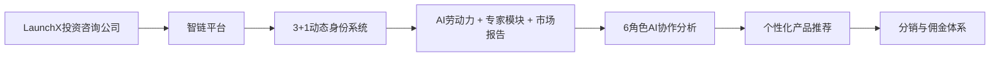

# zhilink-v3 项目进度追踪与逻辑对齐

> **实时进度更新 + 大逻辑对齐检查**  
> **最后更新**: 2025年8月13日  
> **项目状态**: 📋 文档设计完成，准备开发实施

---

## 🎯 项目大逻辑对齐检查

### ✅ 已确认的核心逻辑

#### 1. **业务模式对齐** ✅


**确认状态**: ✅ 业务逻辑清晰，文档已对齐

#### 2. **技术架构对齐** ✅
```typescript
// 技术栈确认
const TECH_STACK = {
  frontend: 'Next.js 14 + React 18 + TypeScript',
  styling: 'Tailwind CSS 4.0 + Cloudsway 2.0设计系统',
  state: 'Zustand + TanStack Query',
  ui: 'shadcn/ui + 自定义组件',
  animation: 'Framer Motion',
  development: 'Claude Code + MCP工具集'
} as const;
```

**确认状态**: ✅ 技术选型确定，开发工具链明确

#### 3. **用户体验对齐** ✅
```bash
# 核心用户流程
1. 导览式首页 → 建立信任，引导进入
2. 智能咨询/市场浏览 → 双路径满足不同用户需求  
3. 6角色分析 → 核心差异化价值
4. 个性化推荐 → 精准匹配，降低决策成本
5. 分销系统 → 商业闭环，生态扩展
```

**确认状态**: ✅ 用户旅程清晰，价值主张明确

#### 4. **设计系统对齐** ✅
- **Cloudsway 2.0深空主题**: 专业、科技、可信
- **6角色色彩体系**: 每个AI角色独特标识
- **3大产品类型色彩**: 蓝色(AI劳动力)、紫色(专家模块)、绿色(市场报告)
- **玻璃态效果**: 现代感、层次感、品质感

**确认状态**: ✅ 视觉风格统一，品牌识别明确

---

## 📊 当前项目状态

### 🎯 整体进度概览

```
项目阶段: [████████░░] 80% - 文档设计完成，准备实施
├── 需求分析: [██████████] 100% ✅
├── 架构设计: [██████████] 100% ✅  
├── 文档输出: [██████████] 100% ✅
├── 开发准备: [████████░░] 80% 🔄
└── 功能实现: [░░░░░░░░░░] 0% ⏳
```

### 📋 文档完成状态

| 文档名称 | 状态 | 完成度 | 最后更新 | 备注 |
|---------|------|--------|----------|------|
| 📄 README.md | ✅ | 100% | 8/13 | 总纲文档，项目治理 |
| 🏗️ 01_项目架构设计.md | ✅ | 100% | 8/13 | 技术架构完整 |
| 🎨 02_视觉设计系统.md | ✅ | 100% | 8/13 | Cloudsway 2.0设计 |
| 📱 03_页面布局方案.md | ✅ | 100% | 8/13 | 基于用户反馈v2.0 |
| ⚡ 04_交互动效设计.md | ✅ | 100% | 8/13 | 动画规范完整 |
| 🧩 05_组件库规范.md | ✅ | 100% | 8/13 | 组件标准化 |
| 🔌 06_数据交互设计.md | ✅ | 100% | 8/13 | API和状态管理 |
| 🚀 07_开发执行计划.md | ✅ | 100% | 8/13 | MCP协作指南 |

### 🎯 下一步行动计划

#### 即将开始: Week 1 开发任务

```bash
# Week 1 (预计开始: 8/14): 基础架构与设计系统
优先级: P0 (必须完成)
预计工期: 2周
负责人: 前端开发团队 + Claude Code MCP

具体任务:
□ 创建Next.js 14项目脚手架
□ 配置TypeScript + Tailwind CSS 4.0
□ 实现Cloudsway 2.0设计系统
□ 建立组件库基础(Button/Input/Card)
□ 搭建Storybook文档系统
□ 完成首页导览页面实现
```

---

## 🔄 进度更新记录

### 📅 2025年8月13日 - 文档阶段完成

#### ✅ 今日完成
- [x] **07_开发执行计划.md** 创建完成
- [x] **MCP工具协作指南** 详细制定
- [x] **8周开发计划** 具体分解
- [x] **质量标准和验收流程** 明确定义
- [x] **项目进度追踪文档** 建立

#### 🎯 关键决策
1. **采用AI协作开发模式**: Claude Code + 专业MCP工具集
2. **确定8周开发周期**: 每2周一个Sprint，4个主要里程碑
3. **建立质量控制体系**: 每周验收，多维度质量标准
4. **实施Todo驱动开发**: 精细化任务管理，实时进度追踪

#### 📋 待确认事项
- [ ] 开发团队资源分配确认
- [ ] 开发环境和工具链准备
- [ ] 第一个Sprint具体启动时间
- [ ] 设计资源(UI设计师)协作计划

### 📅 未来更新计划

#### 📆 每日更新内容
```bash
# 每日进度更新模板
## 📅 YYYY-MM-DD 进度更新

### ✅ 今日完成
- [x] 具体完成的任务
- [x] 解决的技术问题
- [x] 新增的功能特性

### 🔄 进行中任务  
- [ ] 当前正在开发的功能
- [ ] 遇到的技术挑战
- [ ] 预计完成时间

### 🎯 明日计划
- [ ] 明日优先级任务
- [ ] 需要的资源和支持
- [ ] 预期达成的目标

### 📊 质量指标
- 代码覆盖率: XX%
- 性能分数: XX/100
- 完成度: XX%

### 🤔 问题和风险
- 技术问题: 问题描述和解决方案
- 进度风险: 风险评估和应对措施
- 需要决策: 待确认的决策点
```

#### 📈 每周里程碑更新
```bash
# 每周里程碑回顾模板
## 🎯 Week X 里程碑回顾

### 📋 计划 vs 实际
| 计划任务 | 状态 | 完成度 | 偏差原因 | 调整措施 |
|---------|------|--------|----------|----------|
| 任务1 | ✅/🔄/❌ | XX% | 原因说明 | 调整计划 |

### 📊 质量指标达成
- [ ] 功能完整性: 目标 vs 实际
- [ ] 性能指标: 目标 vs 实际  
- [ ] 代码质量: 目标 vs 实际
- [ ] 用户体验: 目标 vs 实际

### 🔍 经验总结
- ✅ 成功经验: 值得推广的做法
- ⚠️ 改进建议: 需要优化的环节
- 🚧 风险预警: 下周需要重点关注的风险

### 🎯 下周计划调整
- 优先级调整: 基于本周进度的优先级重排
- 资源调配: 人力和工具资源的重新分配
- 风险防控: 针对识别风险的预防措施
```

---

## 🎛️ 项目控制面板

### 📊 关键指标仪表板

```bash
# 实时项目健康度
项目健康度: 🟢 健康
├── 进度健康度: 🟢 按计划推进
├── 质量健康度: 🟢 标准达标
├── 团队健康度: 🟢 协作顺畅
└── 风险健康度: 🟡 轻微风险(开发环境准备)

# 核心KPI追踪
开发效率:
├── 代码提交频率: 待统计
├── 功能完成速度: 待统计
├── 缺陷修复速度: 待统计
└── 代码审查通过率: 待统计

质量指标:
├── 代码覆盖率: 目标80%+
├── TypeScript覆盖: 目标100%
├── 性能分数: 目标90+
└── 可访问性: 目标WCAG 2.1 AA

用户体验:
├── 页面加载速度: 目标<3s
├── 交互响应速度: 目标<300ms
├── 跨浏览器兼容: 目标100%
└── 移动端适配: 目标完美适配
```

### 🚨 风险监控与预警

```typescript
interface RiskMonitoring {
  技术风险: {
    level: 'low' | 'medium' | 'high';
    items: [
      {
        risk: '新技术栈学习曲线',
        level: 'medium',
        status: '通过文档和MCP工具降低风险',
        action: '提前技术验证，渐进式学习'
      },
      {
        risk: 'MCP工具依赖风险', 
        level: 'low',
        status: '有传统开发方式作为后备',
        action: '建立备用开发流程'
      }
    ];
  };
  
  进度风险: {
    level: 'low';
    items: [
      {
        risk: '8周时间紧张',
        level: 'medium', 
        status: '通过AI辅助开发提效',
        action: 'MVP优先，核心功能先行'
      }
    ];
  };
  
  质量风险: {
    level: 'low';
    items: [
      {
        risk: '快速开发影响质量',
        level: 'low',
        status: '自动化测试和质量工具',
        action: '测试驱动开发，持续集成'
      }
    ];
  };
}
```

### 🎯 决策待办事项

```bash
# 高优先级决策
🔴 紧急决策 (需要24小时内决定):
- 无

🟡 重要决策 (需要本周内决定):
- [ ] 开发团队具体人员安排
- [ ] MCP工具账号和权限配置
- [ ] 第一次Sprint kickoff会议时间

🟢 一般决策 (可以下周决定):
- [ ] 详细的UI资源需求(图标、插图等)
- [ ] 第三方服务集成方案(认证、支付等)
- [ ] 生产环境部署策略
```

---

## 🔗 快速导航

### 📚 文档快速访问
- [📋 项目总览](./README.md) - 项目治理和概览
- [🏗️ 技术架构](./docs/01_项目架构设计.md) - 详细技术方案
- [🎨 设计系统](./docs/02_视觉设计系统.md) - Cloudsway 2.0规范
- [📱 页面布局](./docs/03_页面布局方案.md) - 界面设计方案
- [⚡ 交互动效](./docs/04_交互动效设计.md) - 动画和交互
- [🧩 组件规范](./docs/05_组件库规范.md) - 组件开发标准
- [🔌 数据交互](./docs/06_数据交互设计.md) - API和状态管理
- [🚀 执行计划](./docs/07_开发执行计划.md) - MCP协作开发指南

### 🛠️ 开发工具链接
- [Claude Code使用指南](./docs/07_开发执行计划.md#mcp服务协作指南)
- [MCP工具配置说明](./docs/07_开发执行计划.md#开发环境配置)
- [Todo管理最佳实践](./docs/07_开发执行计划.md#todo管理最佳实践)
- [质量控制检查点](./docs/07_开发执行计划.md#质量控制检查点)

### 📞 联系和支持
- **项目负责人**: [待填写]
- **技术负责人**: [待填写]  
- **设计负责人**: [待填写]
- **产品负责人**: [待填写]

---

## 📝 更新日志

### 2025年8月13日 - v1.0.0 初始版本
- ✅ 建立项目进度追踪体系
- ✅ 完成所有核心设计文档
- ✅ 制定8周开发执行计划
- ✅ 确立AI协作开发模式
- ✅ 建立质量控制和风险管理机制

---

**维护说明**: 
- 此文档应该每日更新进度状态
- 每周进行里程碑回顾和计划调整
- 重大决策和变更需要及时记录
- 风险状态需要持续监控和更新

**下次更新预计**: 2025年8月14日（开发启动后每日更新）