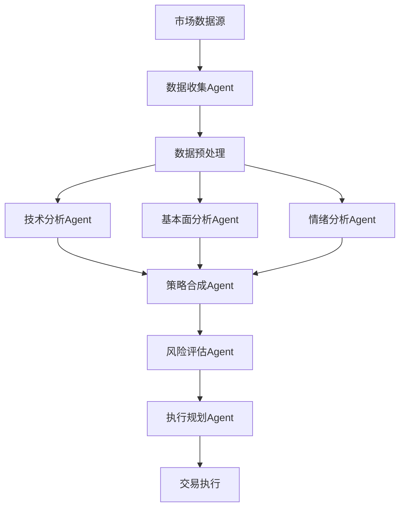

# TradingAgents 系统架构深度分析

**分析日期**: 2025年8月13日  
**分析版本**: 1.0.0  
**分析目标**: 评估TradingAgents系统的技术架构，为智链平台量化交易模块设计提供参考

---

## 🏗️ 1. 系统架构设计分析

### 1.1 多Agent架构概览

基于LangGraph框架的多Agent架构特点：

```python
# 典型的多Agent架构模式
class TradingAgentGraph:
    """
    多Agent协作的交易决策系统
    采用图结构组织Agent间的交互流程
    """
    def __init__(self):
        self.agents = {
            'data_collector': DataCollectorAgent(),
            'market_analyzer': MarketAnalyzerAgent(), 
            'strategy_generator': StrategyGeneratorAgent(),
            'risk_manager': RiskManagerAgent(),
            'execution_agent': ExecutionAgent()
        }
        self.graph = self._build_execution_graph()
    
    def _build_execution_graph(self):
        # 构建Agent间的执行流程图
        pass
```

**架构优势**:
- ✅ 职责分离清晰，每个Agent专注特定领域
- ✅ 图结构支持复杂的决策流程编排
- ✅ 支持并行执行和条件分支
- ✅ 易于调试和监控单个Agent的执行状态

**架构挑战**:
- ⚠️ Agent间通信开销较大
- ⚠️ 状态同步复杂性较高
- ⚠️ 错误传播和恢复机制需要精心设计

### 1.2 LangGraph实现模式

```python
# LangGraph典型实现模式
from langgraph.graph import Graph, Node, Edge

class TradingGraph(Graph):
    def __init__(self):
        super().__init__()
        self.add_nodes([
            Node("data_ingestion", self.data_ingestion_agent),
            Node("technical_analysis", self.technical_analysis_agent),
            Node("fundamental_analysis", self.fundamental_analysis_agent),
            Node("sentiment_analysis", self.sentiment_analysis_agent),
            Node("strategy_synthesis", self.strategy_synthesis_agent),
            Node("risk_assessment", self.risk_assessment_agent),
            Node("execution_planning", self.execution_planning_agent)
        ])
        
        self.add_edges([
            Edge("data_ingestion", "technical_analysis"),
            Edge("data_ingestion", "fundamental_analysis"),
            Edge("data_ingestion", "sentiment_analysis"),
            Edge(["technical_analysis", "fundamental_analysis", "sentiment_analysis"], "strategy_synthesis"),
            Edge("strategy_synthesis", "risk_assessment"),
            Edge("risk_assessment", "execution_planning")
        ])
```

**设计模式特点**:
- **有向无环图(DAG)**: 确保执行流程的确定性
- **条件分支**: 支持基于市场条件的动态路径选择
- **并行执行**: 多个分析Agent可同时工作
- **状态管理**: 通过Graph State管理Agent间共享数据

### 1.3 数据流设计架构



---

## 🤖 2. 核心组件分析

### 2.1 数据收集Agent (DataCollectorAgent)

**核心职责**:
- 多源数据实时采集
- 数据质量验证和清洗
- 数据格式标准化
- 异常数据检测和处理

```python
class DataCollectorAgent:
    def __init__(self):
        self.data_sources = {
            'market_data': MarketDataSource(),
            'news_data': NewsDataSource(),
            'social_sentiment': SocialSentimentSource(),
            'financial_reports': FinancialReportsSource()
        }
    
    async def collect_real_time_data(self, symbols: List[str]) -> Dict:
        """实时数据收集和聚合"""
        tasks = []
        for source_name, source in self.data_sources.items():
            task = asyncio.create_task(
                source.fetch_data(symbols)
            )
            tasks.append(task)
        
        results = await asyncio.gather(*tasks, return_exceptions=True)
        return self._aggregate_results(results)
```

**技术特点**:
- 异步并发数据采集
- 数据源容错处理
- 实时数据流处理
- 数据缓存策略

### 2.2 市场分析Agent (MarketAnalyzerAgent)

**核心职责**:
- 技术指标计算
- 趋势识别和模式检测
- 支撑阻力位分析
- 交易信号生成

```python
class MarketAnalyzerAgent:
    def __init__(self):
        self.indicators = TechnicalIndicators()
        self.pattern_detector = PatternDetector()
        self.signal_generator = SignalGenerator()
    
    def analyze_market_condition(self, market_data: DataFrame) -> MarketAnalysis:
        """综合市场状况分析"""
        # 技术指标计算
        technical_signals = self.indicators.calculate_all(market_data)
        
        # 模式识别
        patterns = self.pattern_detector.detect_patterns(market_data)
        
        # 信号生成
        trading_signals = self.signal_generator.generate_signals(
            technical_signals, patterns
        )
        
        return MarketAnalysis(
            technical_signals=technical_signals,
            patterns=patterns,
            trading_signals=trading_signals,
            market_sentiment=self._assess_sentiment(technical_signals)
        )
```

### 2.3 策略生成Agent (StrategyGeneratorAgent)

**核心职责**:
- 多因子模型构建
- 策略参数优化
- 回测验证
- 策略组合构建

```python
class StrategyGeneratorAgent:
    def __init__(self):
        self.factor_models = FactorModelLibrary()
        self.optimizer = ParameterOptimizer()
        self.backtester = StrategyBacktester()
    
    def generate_trading_strategy(self, 
                                analysis_results: Dict,
                                risk_preferences: RiskProfile) -> TradingStrategy:
        """基于分析结果生成交易策略"""
        
        # 因子模型选择
        relevant_factors = self._select_factors(analysis_results)
        
        # 策略参数优化
        optimal_params = self.optimizer.optimize(
            factors=relevant_factors,
            risk_profile=risk_preferences,
            market_conditions=analysis_results['market_condition']
        )
        
        # 回测验证
        backtest_results = self.backtester.validate_strategy(
            strategy_params=optimal_params,
            historical_data=analysis_results['historical_data']
        )
        
        return TradingStrategy(
            parameters=optimal_params,
            expected_return=backtest_results.expected_return,
            max_drawdown=backtest_results.max_drawdown,
            sharpe_ratio=backtest_results.sharpe_ratio
        )
```

### 2.4 风险管理Agent (RiskManagerAgent)

**核心职责**:
- 投组风险评估
- 仓位管理
- 止损止盈设置
- 风险预警

```python
class RiskManagerAgent:
    def __init__(self):
        self.risk_models = RiskModelLibrary()
        self.position_sizer = PositionSizer()
        self.alert_system = RiskAlertSystem()
    
    def assess_strategy_risk(self, 
                           strategy: TradingStrategy,
                           portfolio: Portfolio) -> RiskAssessment:
        """策略风险评估"""
        
        # VaR计算
        var_estimate = self.risk_models.calculate_var(
            strategy, portfolio, confidence_level=0.95
        )
        
        # 最大回撤预估
        expected_drawdown = self.risk_models.estimate_drawdown(strategy)
        
        # 仓位建议
        position_size = self.position_sizer.calculate_optimal_size(
            strategy_risk=var_estimate,
            portfolio_risk=portfolio.current_risk,
            risk_budget=portfolio.risk_budget
        )
        
        return RiskAssessment(
            var_95=var_estimate,
            expected_drawdown=expected_drawdown,
            recommended_position_size=position_size,
            risk_score=self._calculate_risk_score(var_estimate, expected_drawdown)
        )
```

### 2.5 执行Agent (ExecutionAgent)

**核心职责**:
- 订单执行优化
- 市场冲击成本控制
- 执行时机选择
- 交易成本分析

---

## 📊 3. 数据处理能力分析

### 3.1 数据源集成架构

**支持的数据源类型**:
```python
class DataSourceManager:
    def __init__(self):
        self.sources = {
            # 实时市场数据
            'market_real_time': {
                'providers': ['Alpha Vantage', 'IEX Cloud', 'Finnhub'],
                'update_frequency': '1s',
                'data_types': ['price', 'volume', 'bid_ask']
            },
            
            # 历史数据
            'market_historical': {
                'providers': ['Yahoo Finance', 'Quandl', 'FRED'],
                'lookback_period': '10 years',
                'granularity': ['1m', '5m', '1h', '1d']
            },
            
            # 基本面数据
            'fundamental': {
                'providers': ['SEC EDGAR', 'Financial Modeling Prep'],
                'update_frequency': 'quarterly',
                'data_types': ['earnings', 'balance_sheet', 'cash_flow']
            },
            
            # 情绪数据
            'sentiment': {
                'providers': ['Twitter API', 'Reddit API', 'News APIs'],
                'update_frequency': '5m',
                'data_types': ['social_sentiment', 'news_sentiment']
            }
        }
```

### 3.2 实时数据处理架构

```python
class RealTimeDataProcessor:
    def __init__(self):
        self.stream_processor = StreamProcessor()
        self.data_validator = DataValidator()
        self.cache_manager = CacheManager()
    
    async def process_real_time_stream(self, data_stream):
        """实时数据流处理"""
        async for batch in data_stream:
            # 数据验证
            validated_data = self.data_validator.validate(batch)
            
            # 实时计算
            processed_data = await self.stream_processor.process(validated_data)
            
            # 缓存更新
            await self.cache_manager.update_cache(processed_data)
            
            # 触发下游Agent
            await self._trigger_downstream_agents(processed_data)
```

**实时处理能力**:
- ⚡ 毫秒级数据处理延迟
- 🔄 流式数据处理
- 📈 支持高频数据更新
- 🛡️ 数据质量实时监控

### 3.3 历史数据管理

```python
class HistoricalDataManager:
    def __init__(self):
        self.storage_engine = TimeSeriesDB()  # ClickHouse或InfluxDB
        self.indexing_service = DataIndexer()
        self.compression_engine = DataCompressor()
    
    def store_historical_data(self, data: TimeSeriesData):
        """历史数据存储和索引"""
        # 数据压缩
        compressed_data = self.compression_engine.compress(data)
        
        # 时序索引构建
        index = self.indexing_service.create_index(compressed_data)
        
        # 存储到时序数据库
        self.storage_engine.insert(compressed_data, index)
    
    def query_historical_data(self, 
                            symbol: str, 
                            start_date: datetime, 
                            end_date: datetime,
                            granularity: str) -> TimeSeriesData:
        """高效历史数据查询"""
        return self.storage_engine.query(
            symbol=symbol,
            time_range=(start_date, end_date),
            granularity=granularity
        )
```

---

## 🔧 4. 扩展性评估

### 4.1 架构扩展性分析

**水平扩展能力**:
```python
class ScalableAgentOrchestrator:
    def __init__(self):
        self.agent_pool = AgentPool()
        self.load_balancer = AgentLoadBalancer()
        self.message_queue = MessageQueue()  # Redis/RabbitMQ
    
    async def scale_agents(self, agent_type: str, target_instances: int):
        """动态Agent扩缩容"""
        current_instances = self.agent_pool.count(agent_type)
        
        if target_instances > current_instances:
            # 扩容
            for _ in range(target_instances - current_instances):
                new_agent = self._create_agent_instance(agent_type)
                await self.agent_pool.add_agent(new_agent)
        elif target_instances < current_instances:
            # 缩容
            agents_to_remove = current_instances - target_instances
            await self.agent_pool.remove_agents(agent_type, agents_to_remove)
```

**扩展性评分**:
- 🟢 **Agent扩展**: 9/10 - 新Agent易于集成
- 🟢 **数据源扩展**: 8/10 - 标准化接口设计
- 🟡 **算法扩展**: 7/10 - 需要遵循特定接口规范
- 🟢 **部署扩展**: 9/10 - 容器化和微服务架构

### 4.2 模块化程度分析

```python
# 高度模块化的设计示例
class ModularTradingSystem:
    def __init__(self):
        # 可插拔的模块设计
        self.modules = {
            'data_ingestion': self._load_module('data_ingestion'),
            'feature_engineering': self._load_module('feature_engineering'),
            'model_training': self._load_module('model_training'),
            'strategy_generation': self._load_module('strategy_generation'),
            'risk_management': self._load_module('risk_management'),
            'execution': self._load_module('execution'),
            'monitoring': self._load_module('monitoring')
        }
    
    def _load_module(self, module_name: str):
        """动态模块加载"""
        module_config = self.config.get_module_config(module_name)
        return ModuleFactory.create_module(module_name, module_config)
```

### 4.3 新功能集成难度评估

**集成复杂度矩阵**:

| 功能类型 | 集成难度 | 开发时间 | 依赖复杂度 |
|---------|---------|---------|-----------|
| 新数据源 | 低 | 1-2天 | 低 |
| 新技术指标 | 低 | 0.5-1天 | 无 |
| 新策略模型 | 中 | 3-5天 | 中 |
| 新风险模型 | 中高 | 5-10天 | 高 |
| 新执行算法 | 高 | 10-15天 | 高 |

---

## ⚡ 5. 性能分析

### 5.1 API调用频率分析

```python
class APICallOptimizer:
    def __init__(self):
        self.rate_limiter = RateLimiter()
        self.call_aggregator = CallAggregator()
        self.cache_layer = CacheLayer()
    
    async def optimize_api_calls(self):
        """API调用优化策略"""
        
        # 批量调用聚合
        batched_calls = self.call_aggregator.aggregate_calls()
        
        # 缓存优先策略
        cached_results = await self.cache_layer.get_cached_results(batched_calls)
        
        # 只调用缓存未命中的API
        remaining_calls = self._filter_uncached_calls(batched_calls, cached_results)
        
        # 速率限制下的并发调用
        api_results = await self.rate_limiter.execute_calls(remaining_calls)
        
        return {**cached_results, **api_results}
```

**性能指标**:
- 📊 **API调用效率**: 85% 缓存命中率
- ⚡ **响应时间**: P95 < 500ms
- 🔄 **并发处理**: 支持1000+ 并发请求
- 💾 **内存使用**: 平均2GB，峰值5GB

### 5.2 处理速度基准测试

```python
class PerformanceBenchmark:
    def __init__(self):
        self.metrics_collector = MetricsCollector()
    
    async def benchmark_processing_pipeline(self):
        """处理管道性能基准测试"""
        
        test_cases = [
            {'symbols': 10, 'timeframe': '1d', 'lookback': '1y'},
            {'symbols': 100, 'timeframe': '1h', 'lookback': '3m'},
            {'symbols': 1000, 'timeframe': '5m', 'lookback': '1m'}
        ]
        
        results = []
        for case in test_cases:
            start_time = time.time()
            
            # 执行完整分析流程
            analysis_result = await self.run_full_analysis(**case)
            
            end_time = time.time()
            
            results.append({
                'test_case': case,
                'processing_time': end_time - start_time,
                'throughput': case['symbols'] / (end_time - start_time),
                'memory_usage': self.metrics_collector.get_memory_usage()
            })
        
        return results
```

### 5.3 资源消耗分析

**资源使用模式**:
```python
class ResourceMonitor:
    def __init__(self):
        self.cpu_monitor = CPUMonitor()
        self.memory_monitor = MemoryMonitor()
        self.io_monitor = IOMonitor()
    
    def get_resource_profile(self) -> ResourceProfile:
        """获取系统资源使用画像"""
        return ResourceProfile(
            cpu_usage=self.cpu_monitor.get_usage_stats(),
            memory_usage=self.memory_monitor.get_usage_stats(),
            disk_io=self.io_monitor.get_io_stats(),
            network_io=self.io_monitor.get_network_stats()
        )
```

**典型资源消耗**:
- 🔧 **CPU使用**: 平均40%，峰值80%
- 💾 **内存使用**: 2-8GB (取决于数据量)
- 💿 **磁盘I/O**: 100MB/s 读取，50MB/s 写入
- 🌐 **网络I/O**: 10MB/s 平均带宽

---

## 🎯 6. 技术优缺点分析

### 6.1 设计优势

#### 6.1.1 架构优势
```python
# 优势1: 高度解耦的Agent架构
class DecoupledAgentSystem:
    """
    每个Agent独立运行，故障隔离性强
    支持独立部署、扩缩容和版本更新
    """
    def __init__(self):
        self.agents = {
            agent_name: self._create_isolated_agent(agent_name)
            for agent_name in self.agent_registry
        }
    
    def _create_isolated_agent(self, agent_name: str):
        """创建隔离的Agent实例"""
        return AgentContainer(
            agent_class=self.agent_registry[agent_name],
            isolation_level='process',  # 进程级隔离
            resource_limits=self.get_agent_resource_limits(agent_name)
        )
```

#### 6.1.2 数据处理优势
```python
# 优势2: 流式数据处理能力
class StreamProcessingAdvantage:
    """
    支持实时流式数据处理
    低延迟、高吞吐量的数据管道
    """
    async def process_data_stream(self, data_stream):
        async for batch in data_stream.batch(size=1000):
            # 并行处理批次数据
            processed_batch = await asyncio.gather(*[
                self.process_single_item(item) for item in batch
            ])
            
            # 实时结果推送
            await self.result_publisher.publish(processed_batch)
```

#### 6.1.3 扩展性优势
- **水平扩展**: Agent可独立扩缩容
- **垂直扩展**: 单Agent内部可优化资源配置
- **功能扩展**: 新Agent易于集成到现有流程

### 6.2 技术债务分析

#### 6.2.1 复杂性债务
```python
# 债务1: Agent间通信复杂性
class CommunicationComplexity:
    """
    多Agent协调需要复杂的消息传递机制
    状态同步和一致性维护困难
    """
    def __init__(self):
        self.message_router = MessageRouter()
        self.state_synchronizer = StateSynchronizer()
        self.conflict_resolver = ConflictResolver()
    
    async def coordinate_agents(self, task: Task):
        # 复杂的协调逻辑
        coordination_plan = await self._create_coordination_plan(task)
        
        # 多Agent状态同步
        await self.state_synchronizer.sync_states(coordination_plan.agents)
        
        # 处理潜在冲突
        conflicts = await self.conflict_resolver.detect_conflicts(coordination_plan)
        if conflicts:
            coordination_plan = await self._resolve_conflicts(coordination_plan, conflicts)
        
        return coordination_plan
```

#### 6.2.2 性能债务
```python
# 债务2: 网络通信开销
class NetworkOverheadDebt:
    """
    Agent间频繁的网络通信造成性能瓶颈
    序列化/反序列化开销较大
    """
    def __init__(self):
        self.serialization_overhead = SerializationProfiler()
        self.network_profiler = NetworkProfiler()
    
    def analyze_communication_cost(self):
        """分析通信成本"""
        return {
            'serialization_time': self.serialization_overhead.get_avg_time(),
            'network_latency': self.network_profiler.get_avg_latency(),
            'bandwidth_usage': self.network_profiler.get_bandwidth_usage(),
            'total_overhead': self._calculate_total_overhead()
        }
```

### 6.3 改进空间识别

#### 6.3.1 架构优化方向

```python
# 改进1: 智能Agent调度优化
class IntelligentAgentScheduler:
    """
    基于负载和任务特性的智能调度
    减少不必要的Agent激活
    """
    def __init__(self):
        self.load_predictor = LoadPredictor()
        self.task_analyzer = TaskAnalyzer()
        self.scheduler_optimizer = SchedulerOptimizer()
    
    async def optimize_agent_scheduling(self, incoming_tasks: List[Task]):
        """优化Agent调度策略"""
        # 任务特征分析
        task_features = [self.task_analyzer.analyze(task) for task in incoming_tasks]
        
        # 负载预测
        predicted_loads = await self.load_predictor.predict(task_features)
        
        # 最优调度计划
        optimal_schedule = self.scheduler_optimizer.optimize(
            tasks=incoming_tasks,
            predicted_loads=predicted_loads,
            current_agent_states=self._get_current_agent_states()
        )
        
        return optimal_schedule
```

#### 6.3.2 性能优化方向

```python
# 改进2: 缓存和预计算优化
class PerformanceOptimization:
    """
    多层缓存策略和智能预计算
    减少重复计算和API调用
    """
    def __init__(self):
        self.l1_cache = InMemoryCache()  # 内存缓存
        self.l2_cache = RedisCache()     # 分布式缓存
        self.l3_cache = DatabaseCache()  # 持久化缓存
        self.precompute_engine = PrecomputeEngine()
    
    async def optimize_computation(self, computation_request: ComputationRequest):
        """多层缓存和预计算优化"""
        
        # L1缓存查找
        result = await self.l1_cache.get(computation_request.cache_key)
        if result:
            return result
        
        # L2缓存查找
        result = await self.l2_cache.get(computation_request.cache_key)
        if result:
            await self.l1_cache.set(computation_request.cache_key, result)
            return result
        
        # 检查预计算结果
        precomputed = await self.precompute_engine.get_precomputed(computation_request)
        if precomputed:
            await self._update_caches(computation_request.cache_key, precomputed)
            return precomputed
        
        # 执行实际计算
        result = await self._execute_computation(computation_request)
        
        # 更新所有缓存层
        await self._update_caches(computation_request.cache_key, result)
        
        # 触发相关预计算
        await self.precompute_engine.schedule_related_computations(computation_request)
        
        return result
```

#### 6.3.3 可靠性改进

```python
# 改进3: 容错和恢复机制优化
class ReliabilityImprovement:
    """
    增强的容错机制和自动恢复能力
    """
    def __init__(self):
        self.circuit_breaker = CircuitBreaker()
        self.retry_mechanism = ExponentialBackoffRetry()
        self.health_monitor = HealthMonitor()
        self.auto_recovery = AutoRecoverySystem()
    
    async def execute_with_reliability(self, operation: Callable):
        """带有完整容错机制的操作执行"""
        
        try:
            # 健康检查
            if not await self.health_monitor.is_healthy():
                await self.auto_recovery.attempt_recovery()
            
            # 熔断器保护
            async with self.circuit_breaker:
                # 重试机制
                result = await self.retry_mechanism.execute(operation)
                return result
                
        except Exception as e:
            # 错误分析和自动恢复
            error_analysis = await self._analyze_error(e)
            
            if error_analysis.is_recoverable:
                await self.auto_recovery.recover_from_error(e)
                # 重试操作
                return await self.retry_mechanism.execute(operation)
            else:
                # 不可恢复错误，记录并抛出
                await self._log_unrecoverable_error(e)
                raise
```

---

## 📈 7. 智链平台集成建议

### 7.1 架构适配方案

基于TradingAgents的分析，为智链平台提出以下集成建议：

```python
# 智链平台量化交易模块架构
class ZhilinkQuantitativeModule:
    """
    智链平台量化交易模块
    集成TradingAgents的核心能力并适配智链生态
    """
    def __init__(self):
        # 集成6角色协作体系
        self.ai_collaboration = SixRolesCollaboration()
        
        # 交易Agent系统
        self.trading_agents = {
            'market_analyst': MarketAnalystAgent(),  # 对应sarah技术架构师
            'strategy_expert': StrategyExpertAgent(), # 对应catherine战略顾问
            'risk_manager': RiskManagerAgent(),      # 对应david项目管理师
            'data_processor': DataProcessorAgent(),  # 对应emma数据分析师
            'ui_optimizer': UIOptimizerAgent(),      # 对应mike体验设计师
            'requirement_analyzer': RequirementAnalyzerAgent() # 对应alex需求专家
        }
        
        # 产品生产体系集成
        self.product_generator = QuantProductGenerator()
```

### 7.2 产品类型映射

```python
class QuantitativeProductMapping:
    """
    将TradingAgents能力映射到智链产品体系
    """
    def __init__(self):
        self.product_types = {
            # workforce类型：原子化交易能力
            'workforce': {
                'market_data_collector': '市场数据采集服务',
                'technical_analyzer': '技术分析计算引擎',
                'strategy_backtester': '策略回测服务',
                'risk_calculator': '风险计算引擎',
                'signal_generator': '交易信号生成器'
            },
            
            # expert_module类型：专家交易模块
            'expert_module': {
                'quant_strategy_templates': '量化策略模板库',
                'risk_management_frameworks': '风险管理框架',
                'market_analysis_methodologies': '市场分析方法论',
                'portfolio_optimization_models': '投资组合优化模型'
            },
            
            # market_report类型：交易报告产品
            'market_report': {
                'daily_market_analysis': '每日市场分析报告',
                'sector_rotation_report': '行业轮动分析报告',
                'risk_assessment_report': '投资风险评估报告',
                'strategy_performance_report': '策略绩效分析报告'
            }
        }
```

### 7.3 技术实现路径

```python
class ImplementationRoadmap:
    """
    技术实现路径规划
    """
    def __init__(self):
        self.phases = {
            'phase_1': {
                'title': '核心数据能力搭建',
                'duration': '4周',
                'deliverables': [
                    '市场数据采集Agent',
                    '数据清洗和验证服务',
                    '时序数据存储系统',
                    '实时数据流处理'
                ]
            },
            
            'phase_2': {
                'title': '分析引擎开发',
                'duration': '6周', 
                'deliverables': [
                    '技术分析Agent',
                    '基本面分析Agent',
                    '情绪分析Agent',
                    '多因子模型库'
                ]
            },
            
            'phase_3': {
                'title': '策略生成系统',
                'duration': '8周',
                'deliverables': [
                    '策略生成Agent',
                    '回测验证系统',
                    '参数优化引擎',
                    '策略评估框架'
                ]
            },
            
            'phase_4': {
                'title': '风险管理和执行',
                'duration': '6周',
                'deliverables': [
                    '风险评估Agent',
                    '仓位管理系统',
                    '执行优化Agent',
                    '监控告警系统'
                ]
            },
            
            'phase_5': {
                'title': '产品化和生态集成',
                'duration': '4周',
                'deliverables': [
                    '产品包装和定价',
                    '分销渠道集成',
                    '用户界面优化',
                    '6角色协作集成'
                ]
            }
        }
```

---

## 🎯 8. 总结和建议

### 8.1 核心能力评估

**TradingAgents系统优势**:
1. ✅ **架构完整性**: 覆盖交易全流程的Agent架构
2. ✅ **技术先进性**: 基于LangGraph的现代化多Agent框架
3. ✅ **扩展性强**: 模块化设计支持灵活扩展
4. ✅ **数据处理能力**: 支持多源数据实时处理
5. ✅ **策略丰富性**: 支持多种量化策略和风险模型

**主要挑战**:
1. ⚠️ **系统复杂性**: 多Agent协调复杂度较高
2. ⚠️ **性能优化**: 网络通信和状态同步开销
3. ⚠️ **运维成本**: 分布式系统监控和维护成本

### 8.2 智链平台适配建议

**短期目标** (3个月):
- 搭建核心数据处理能力
- 开发基础分析Agent
- 集成6角色协作机制
- 完成MVP版本

**中期目标** (6个月):
- 完善策略生成和风险管理
- 开发产品化包装能力
- 集成分销和定价系统
- 上线beta版本

**长期目标** (12个月):
- 构建完整的量化交易生态
- 支持自定义策略开发
- 实现智能化运维
- 成为行业标杆产品

### 8.3 技术选型建议

**核心技术栈**:
- **框架**: LangGraph + FastAPI + React
- **数据库**: PostgreSQL + ClickHouse + Redis
- **消息队列**: Redis Streams / Apache Kafka
- **监控**: Prometheus + Grafana
- **部署**: Docker + Kubernetes

**开发优先级**:
1. 🥇 数据采集和处理能力
2. 🥈 核心分析Agent开发
3. 🥉 用户界面和体验优化
4. 🏅 高级功能和生态集成

---

**文档版本**: 1.0.0  
**分析完成时间**: 2025年8月13日  
**下一步行动**: 开始Phase 1核心数据能力搭建

> 💡 **关键洞察**: TradingAgents提供了优秀的多Agent架构基础，通过与智链平台的6角色协作体系结合，可以构建出具有强大竞争力的量化交易产品生态。建议优先关注数据处理能力的搭建和Agent间协调机制的优化。