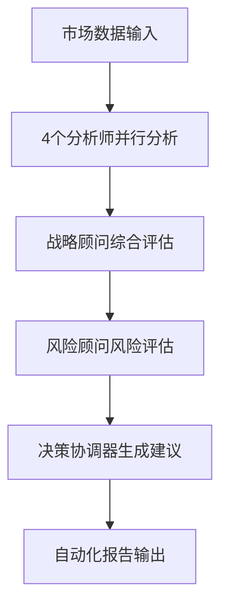

# TradingAgents 增强系统设计方案

## 🎯 系统目标

基于TradingAgents框架，打造一个**本地部署的智能量化交易分析系统**，具备：
- 📊 TradingView级别的可视化图表
- 🤖 6-Agent AI协作决策引擎  
- 📈 自动化选股和定量分析
- 📋 定时生成交易建议报告
- 🔧 专业MCP服务器集成

## 🏗️ 增强系统架构

### 整体架构图
```
┌─────────────────────────────────────────────────────────────────┐
│                     TradingAgents Enhanced                      │
├─────────────────────────────────────────────────────────────────┤
│  📊 前端展示层 (Web Dashboard)                                   │
│  ├─ React + D3.js/Plotly 可视化图表                             │
│  ├─ TradingView Charts 集成                                      │
│  └─ 实时交易建议和风险警示                                        │
├─────────────────────────────────────────────────────────────────┤
│  🧠 智能决策层 (Enhanced AI Engine)                             │
│  ├─ 6-Agent协作决策引擎                                          │
│  ├─ 量化策略算法引擎                                             │
│  ├─ 风险评估与组合优化                                            │
│  └─ 自动化报告生成器                                             │
├─────────────────────────────────────────────────────────────────┤
│  🔧 MCP服务集成层                                                │
│  ├─ 金融数据MCP服务器 (Yahoo Finance, Alpha Vantage)             │
│  ├─ 新闻情感MCP服务器 (News API, Reddit)                        │
│  ├─ 技术分析MCP服务器 (TA-Lib, Custom Indicators)               │
│  └─ 风险管理MCP服务器 (VaR, Portfolio Analytics)                 │
├─────────────────────────────────────────────────────────────────┤
│  💾 数据存储层                                                   │
│  ├─ Redis (实时数据缓存)                                         │
│  ├─ ClickHouse (时序数据存储)                                    │
│  ├─ PostgreSQL (结构化数据)                                      │
│  └─ Elasticsearch (全文搜索)                                     │
└─────────────────────────────────────────────────────────────────┘
```

## 🤖 增强AI决策引擎设计

### 6-Agent协作升级版
基于智链平台的6角色体系，升级TradingAgents的Agent架构：

```python
class EnhancedTradingAgents:
    def __init__(self):
        # 基础TradingAgents的4个角色
        self.fundamentals_analyst = FundamentalsAnalyst()  # Alex角色
        self.technical_analyst = TechnicalAnalyst()        # Sarah角色  
        self.sentiment_analyst = SentimentAnalyst()        # Mike角色
        self.news_analyst = NewsAnalyst()                  # Emma角色
        
        # 新增2个战略角色
        self.strategy_advisor = StrategyAdvisor()          # David角色
        self.risk_consultant = RiskConsultant()            # Catherine角色
        
        # 决策协调器
        self.decision_coordinator = DecisionCoordinator()
```

### 智能决策流程


## 📊 可视化系统设计

### 1. 主仪表板 (Main Dashboard)
```html
<!-- 仿TradingView的主界面布局 -->
<div class="trading-dashboard">
  <!-- 股票图表区域 (60%) -->
  <div class="chart-area">
    <div id="main-chart"></div>      <!-- K线图 + 技术指标 -->
    <div id="volume-chart"></div>    <!-- 成交量图 -->
  </div>
  
  <!-- AI分析面板 (25%) -->
  <div class="ai-panel">
    <div class="agent-insights">     <!-- 6个AI角色的分析结果 -->
      <div class="analyst-card">基础面分析师</div>
      <div class="analyst-card">技术分析师</div>
      <div class="analyst-card">情感分析师</div>
      <!-- ... 其他角色 -->
    </div>
  </div>
  
  <!-- 交易建议区域 (15%) -->
  <div class="trading-signals">
    <div class="buy-sell-signals"></div>
    <div class="risk-warnings"></div>
  </div>
</div>
```

### 2. 图表集成方案
```javascript
// 使用TradingView Advanced Charts
const chartConfig = {
  symbol: 'NASDAQ:AAPL',
  theme: 'dark',
  studies: [
    'MACD@tv-basicstudies',
    'RSI@tv-basicstudies', 
    'BB@tv-basicstudies'
  ],
  // AI分析结果叠加层
  overlays: [
    'ai-buy-signals',
    'ai-sell-signals', 
    'risk-zones'
  ]
};
```

## 🔧 MCP服务器集成方案

### 核心MCP服务器设计

#### 1. 金融数据MCP服务器
```python
# financial-data-mcp/server.py
from mcp import McpServer

class FinancialDataMCP:
    def __init__(self):
        self.server = McpServer("financial-data")
        
    @self.server.tool()
    async def get_stock_data(self, symbol: str, period: str = "1y"):
        """获取股票历史数据"""
        # 整合Yahoo Finance, Alpha Vantage, FinnHub等
        
    @self.server.tool()
    async def get_company_fundamentals(self, symbol: str):
        """获取公司基础面数据"""
        
    @self.server.tool() 
    async def get_market_sentiment(self, symbol: str):
        """获取市场情感数据"""
```

#### 2. 技术分析MCP服务器
```python
# technical-analysis-mcp/server.py
class TechnicalAnalysisMCP:
    @self.server.tool()
    async def calculate_indicators(self, data, indicators: list):
        """计算技术指标：MACD, RSI, BB, KDJ等"""
        
    @self.server.tool()
    async def detect_patterns(self, data):
        """检测图形模式：头肩顶、双底等"""
        
    @self.server.tool()
    async def support_resistance_levels(self, data):
        """计算支撑阻力位"""
```

#### 3. 风险管理MCP服务器
```python
# risk-management-mcp/server.py  
class RiskManagementMCP:
    @self.server.tool()
    async def calculate_var(self, portfolio):
        """计算风险价值VaR"""
        
    @self.server.tool()
    async def portfolio_optimization(self, assets, constraints):
        """投资组合优化"""
        
    @self.server.tool()
    async def correlation_analysis(self, symbols):
        """相关性分析"""
```

### MCP服务器配置
```json
{
  "mcpServers": {
    "financial-data": {
      "command": "python",
      "args": ["financial-data-mcp/server.py"]
    },
    "technical-analysis": {
      "command": "python", 
      "args": ["technical-analysis-mcp/server.py"]
    },
    "risk-management": {
      "command": "python",
      "args": ["risk-management-mcp/server.py"] 
    },
    "news-sentiment": {
      "command": "python",
      "args": ["news-sentiment-mcp/server.py"]
    }
  }
}
```

## 📈 自动化选股系统

### 多维度评分模型
```python
class StockScoringSystem:
    def __init__(self):
        self.scoring_weights = {
            'fundamental_score': 0.3,    # 基础面分数
            'technical_score': 0.25,     # 技术面分数  
            'sentiment_score': 0.2,      # 情感面分数
            'risk_score': 0.15,          # 风险评估分数
            'momentum_score': 0.1        # 动量分数
        }
    
    def calculate_composite_score(self, symbol):
        """计算股票综合评分 (0-100分)"""
        scores = {}
        
        # 基础面分析 (Alex角色)
        scores['fundamental'] = self.analyze_fundamentals(symbol)
        
        # 技术面分析 (Sarah角色)  
        scores['technical'] = self.analyze_technicals(symbol)
        
        # 情感面分析 (Mike角色)
        scores['sentiment'] = self.analyze_sentiment(symbol)
        
        # 风险评估 (Catherine角色)
        scores['risk'] = self.assess_risk(symbol)
        
        # 动量分析 (David角色)
        scores['momentum'] = self.analyze_momentum(symbol)
        
        # 加权综合评分
        composite_score = sum(
            scores[key] * self.scoring_weights[f'{key}_score'] 
            for key in scores
        )
        
        return composite_score, scores
```

## 📋 自动化报告系统

### 报告模板设计
```markdown
# 📊 智能交易分析报告
**生成时间**: {timestamp}  
**分析股票**: {symbol} - {company_name}

## 🎯 综合评分: {composite_score}/100
- 📈 **建议操作**: {recommendation}
- ⏰ **最佳时机**: {optimal_timing}  
- 🛡️ **风险等级**: {risk_level}

## 📊 AI角色分析

### 🔍 基础面分析师 (Alex)
**评分**: {fundamental_score}/100
{fundamental_analysis}

### 📈 技术分析师 (Sarah) 
**评分**: {technical_score}/100
{technical_analysis}

### 💭 情感分析师 (Mike)
**评分**: {sentiment_score}/100  
{sentiment_analysis}

### 📰 新闻分析师 (Emma)
**影响度**: {news_impact}/100
{news_analysis}

### 🎯 战略顾问 (David)
**策略建议**: {strategy_recommendation}

### 🛡️ 风险顾问 (Catherine)
**风险评估**: {risk_assessment}

## 📈 技术指标图表
{chart_images}

## 🔔 交易建议
- **买入信号**: {buy_signals}
- **卖出信号**: {sell_signals}  
- **止损位置**: {stop_loss}
- **目标价位**: {target_price}
```

## 🚀 部署方案

### Docker容器化部署
```yaml
# docker-compose.yml
version: '3.8'
services:
  trading-agents-enhanced:
    build: .
    ports:
      - "3000:3000"    # Web界面
      - "8000:8000"    # API服务
    environment:
      - OPENAI_API_KEY=${OPENAI_API_KEY}
      - FINNHUB_API_KEY=${FINNHUB_API_KEY}
    volumes:
      - ./data:/app/data
      - ./reports:/app/reports
      
  redis:
    image: redis:7-alpine
    ports:
      - "6379:6379"
      
  clickhouse:
    image: clickhouse/clickhouse-server
    ports:
      - "8123:8123"
    volumes:
      - ./clickhouse-data:/var/lib/clickhouse
      
  postgresql:
    image: postgres:15
    environment:
      POSTGRES_DB: trading_db
      POSTGRES_USER: trading_user
      POSTGRES_PASSWORD: ${POSTGRES_PASSWORD}
    volumes:
      - ./postgres-data:/var/lib/postgresql/data
```

### 定时任务配置
```python
# scheduler.py - 自动化任务调度
from apscheduler.schedulers.asyncio import AsyncIOScheduler

scheduler = AsyncIOScheduler()

# 每日收盘后生成分析报告
@scheduler.scheduled_job('cron', hour=16, minute=30, timezone='US/Eastern')  
async def daily_analysis():
    """美股收盘后30分钟生成日报"""
    await generate_daily_reports()

# 每周生成选股报告  
@scheduler.scheduled_job('cron', day_of_week='sun', hour=10)
async def weekly_stock_selection():
    """每周日生成选股报告"""
    await generate_weekly_stock_picks()

# 实时监控重要信号
@scheduler.scheduled_job('interval', minutes=5)
async def monitor_signals():
    """每5分钟检查交易信号"""
    await check_trading_signals()
```

## 🎯 关键特性

### 1. 智能选股功能
- **多维度筛选**: 基础面+技术面+情感面综合评分
- **行业对比**: 同行业股票相对强弱分析  
- **主题投资**: AI识别投资主题和概念股

### 2. 定量分析引擎
- **量化指标**: 夏普比率、最大回撤、胜率等
- **回测系统**: 策略历史表现验证
- **风险建模**: VaR、压力测试、情景分析

### 3. 实时监控告警
- **价格异动**: 突破关键位置自动提醒
- **新闻事件**: 重大新闻影响实时评估
- **技术信号**: 买卖点信号即时推送

### 4. 个性化报告
- **自定义模板**: 支持个人偏好的报告格式
- **多种输出**: PDF、HTML、邮件、微信推送
- **历史追踪**: 建议准确率统计和改进

这个增强系统将TradingAgents的AI决策能力与现代量化交易平台的用户体验完美结合，为个人投资者提供机构级别的分析工具。