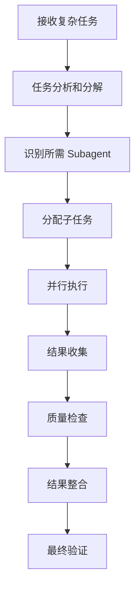

# Agent 和 Subagent 协作系统 / Agent and Subagent Collaboration System

## 系统架构概述 / System Architecture Overview
https://github.com/davepoon/claude-code-subagents-collection


Agent 和 Subagent 系统是 Claude Code 生态中的核心协作框架，通过分层任务处理和专业化分工，实现高效的代码开发和维护流程。

The Agent and Subagent system is the core collaboration framework in the Claude Code ecosystem, achieving efficient code development and maintenance workflows through hierarchical task processing and specialized division of labor.

## 分层架构设计 / Hierarchical Architecture Design

### 1. 主 Agent 层 / Main Agent Layer
```
主 Agent (Main Agent)
├── 任务协调 (Task Coordination)
├── 上下文管理 (Context Management)  
├── 质量控制 (Quality Control)
└── 结果整合 (Result Integration)
```

**职责范围 / Responsibilities:**
- 任务分解和分配
- Subagent 调度管理
- 全局上下文维护
- 最终结果验证

### 2. Subagent 专业化层 / Subagent Specialization Layer
```
专业化 Subagents (Specialized Subagents)
├── 代码审查 Subagent (Code Review Subagent)
├── 测试生成 Subagent (Test Generation Subagent)
├── 文档生成 Subagent (Documentation Subagent)
├── 重构优化 Subagent (Refactoring Subagent)
├── 安全检查 Subagent (Security Check Subagent)
└── 性能分析 Subagent (Performance Analysis Subagent)
```

## 官方 Subagent 类型 / Official Subagent Types

### 1. general-purpose (通用任务处理器)
```json
{
  "name": "general-purpose",
  "description": "通用任务处理，适用于复杂多步骤任务",
  "capabilities": [
    "代码搜索和分析 / Code search and analysis",
    "多步骤任务执行 / Multi-step task execution", 
    "文件系统操作 / File system operations",
    "复杂问题研究 / Complex problem research"
  ],
  "tools": ["*"],
  "usage": "处理需要多种工具协作的复杂任务"
}
```

**使用场景 / Use Cases:**
- 大型重构项目
- 跨模块功能开发
- 系统性问题分析
- 架构设计和实现

### 2. statusline-setup (状态栏配置专家)
```json
{
  "name": "statusline-setup", 
  "description": "专门配置用户的 Claude Code 状态栏设置",
  "capabilities": [
    "状态栏布局设计 / Status line layout design",
    "配置文件生成 / Configuration file generation",
    "主题适配 / Theme adaptation",
    "个性化定制 / Personalization customization"
  ],
  "tools": ["Read", "Edit"],
  "usage": "当用户需要定制状态栏显示时使用"
}
```

### 3. output-style-setup (输出样式设置专家)
```json
{
  "name": "output-style-setup",
  "description": "创建和配置 Claude Code 输出样式",
  "capabilities": [
    "输出格式定义 / Output format definition",
    "样式模板创建 / Style template creation",
    "色彩方案配置 / Color scheme configuration",
    "排版优化 / Typography optimization"
  ],
  "tools": ["Read", "Write", "Edit", "Glob", "LS"],
  "usage": "用于创建个性化的代码输出样式"
}
```

## 社区 Subagent 扩展 / Community Subagent Extensions

### 1. code-reviewer (代码审查专家)
```json
{
  "name": "code-reviewer",
  "description": "专业的代码审查和质量分析",
  "capabilities": [
    "代码质量评估 / Code quality assessment",
    "最佳实践检查 / Best practices checking",
    "性能问题识别 / Performance issue identification",
    "安全漏洞扫描 / Security vulnerability scanning"
  ],
  "triggers": ["编写大量代码后 / After writing significant code"],
  "outputs": [
    "详细审查报告 / Detailed review report",
    "改进建议 / Improvement suggestions",
    "风险评估 / Risk assessment"
  ]
}
```

### 2. test-generator (测试生成专家)
```json
{
  "name": "test-generator", 
  "description": "自动化测试用例生成和测试策略设计",
  "capabilities": [
    "单元测试生成 / Unit test generation",
    "集成测试设计 / Integration test design",
    "测试数据模拟 / Test data mocking",
    "覆盖率分析 / Coverage analysis"
  ],
  "workflows": [
    "分析待测试代码 / Analyze code to be tested",
    "生成测试用例 / Generate test cases", 
    "创建测试数据 / Create test data",
    "验证测试完整性 / Verify test completeness"
  ]
}
```

### 3. doc-writer (文档编写助手)
```json
{
  "name": "doc-writer",
  "description": "智能文档生成和维护",
  "capabilities": [
    "API 文档生成 / API documentation generation",
    "README 文件创建 / README file creation",
    "代码注释补全 / Code comment completion",
    "用户手册编写 / User manual writing"
  ],
  "formats": [
    "Markdown",
    "reStructuredText", 
    "AsciiDoc",
    "JSDoc"
  ]
}
```

### 4. refactoring-specialist (重构专家)
```json
{
  "name": "refactoring-specialist",
  "description": "代码重构和架构优化专家",
  "capabilities": [
    "代码重构建议 / Code refactoring suggestions",
    "架构模式识别 / Architecture pattern recognition", 
    "依赖关系优化 / Dependency optimization",
    "性能瓶颈分析 / Performance bottleneck analysis"
  ],
  "strategies": [
    "Extract Method",
    "Move Class",
    "Replace Conditional with Polymorphism",
    "Introduce Design Patterns"
  ]
}
```

## 协作工作流程 / Collaboration Workflows

### 1. 任务分解流程 / Task Decomposition Process


### 2. 协作通信协议 / Collaboration Communication Protocol
```json
{
  "communication": {
    "taskAssignment": {
      "format": "structured",
      "includes": ["context", "requirements", "constraints", "expected_output"]
    },
    "progressReporting": {
      "frequency": "milestone_based",
      "format": "standardized_status"
    },
    "resultSharing": {
      "format": "documented_deliverable",
      "includes": ["output", "metadata", "quality_metrics"]
    }
  }
}
```

### 3. 质量保证机制 / Quality Assurance Mechanisms
```json
{
  "qualityGates": {
    "pre_execution": [
      "任务明确性检查 / Task clarity check",
      "资源可用性验证 / Resource availability verification"
    ],
    "during_execution": [
      "进度监控 / Progress monitoring", 
      "中间结果验证 / Intermediate result verification"
    ],
    "post_execution": [
      "输出质量评估 / Output quality assessment",
      "完整性检查 / Completeness check",
      "集成测试 / Integration testing"
    ]
  }
}
```

## LaunchX 平台特定配置 / LaunchX Platform Specific Configuration

### 1. 智链项目 Subagent 配置 / Zhilink Project Subagent Configuration
```json
{
  "zhilink_agents": {
    "frontend_specialist": {
      "description": "React/TypeScript 前端开发专家",
      "tools": ["Read", "Write", "Edit", "Bash"],
      "context": ["Next.js", "Tailwind CSS", "TypeScript"]
    },
    "backend_specialist": {
      "description": "Node.js/Express 后端开发专家", 
      "tools": ["Read", "Write", "Edit", "Bash"],
      "context": ["Express.js", "MongoDB", "RESTful API"]
    },
    "database_specialist": {
      "description": "数据库设计和优化专家",
      "tools": ["Read", "Write", "Bash"],
      "context": ["MongoDB", "数据模型", "查询优化"]
    }
  }
}
```

### 2. 上下文感知协作 / Context-Aware Collaboration
```json
{
  "contextManagement": {
    "projectContext": {
      "zhilink": ["智能客服", "多租户架构", "实时通信"],
      "pocketcorn": ["数据分析", "可视化", "机器学习"],
      "trading": ["金融数据", "风险管理", "实时处理"]
    },
    "sharedMemory": {
      "enabled": true,
      "persistence": "project_based",
      "synchronization": "real_time"
    }
  }
}
```

## 高级协作模式 / Advanced Collaboration Patterns

### 1. 流水线协作 / Pipeline Collaboration
```json
{
  "pipeline": {
    "development_pipeline": [
      {
        "stage": "analysis",
        "agent": "general-purpose",
        "output": "requirements_specification"
      },
      {
        "stage": "implementation", 
        "agent": "code_specialist",
        "input": "requirements_specification",
        "output": "code_implementation"
      },
      {
        "stage": "testing",
        "agent": "test-generator",
        "input": "code_implementation", 
        "output": "test_suite"
      },
      {
        "stage": "review",
        "agent": "code-reviewer",
        "input": ["code_implementation", "test_suite"],
        "output": "review_report"
      },
      {
        "stage": "documentation",
        "agent": "doc-writer",
        "input": ["code_implementation", "review_report"],
        "output": "documentation"
      }
    ]
  }
}
```

### 2. 并行协作 / Parallel Collaboration
```json
{
  "parallel_execution": {
    "code_analysis": {
      "agents": ["code-reviewer", "security-scanner", "performance-analyzer"],
      "synchronization": "barrier_sync",
      "result_aggregation": "weighted_consensus"
    },
    "multi_format_documentation": {
      "agents": ["api-doc-writer", "user-manual-writer", "tutorial-writer"],
      "output_format": "consolidated_documentation_package"
    }
  }
}
```

### 3. 自适应协作 / Adaptive Collaboration
```json
{
  "adaptive_behavior": {
    "load_balancing": {
      "enabled": true,
      "strategy": "capability_based",
      "fallback": "general-purpose"
    },
    "learning": {
      "success_patterns": "记录成功协作模式",
      "failure_analysis": "分析失败原因并优化",
      "continuous_improvement": "持续改进协作效率"
    }
  }
}
```

## 监控和性能优化 / Monitoring and Performance Optimization

### 1. 协作效率监控 / Collaboration Efficiency Monitoring
```json
{
  "metrics": {
    "task_completion_time": "任务完成时间",
    "subagent_utilization": "Subagent 利用率", 
    "communication_overhead": "通信开销",
    "quality_score": "输出质量评分",
    "error_rate": "错误率"
  },
  "alerts": {
    "slow_response": "响应时间过长",
    "high_error_rate": "错误率过高",
    "resource_contention": "资源竞争"
  }
}
```

### 2. 智能调度优化 / Intelligent Scheduling Optimization
```json
{
  "scheduling": {
    "algorithms": [
      "priority_based",
      "capability_matching", 
      "load_balanced",
      "deadline_aware"
    ],
    "optimization_targets": [
      "minimize_completion_time",
      "maximize_quality",
      "optimize_resource_usage"
    ]
  }
}
```

## 故障处理和恢复 / Fault Handling and Recovery

### 1. 故障检测 / Fault Detection
```json
{
  "fault_detection": {
    "timeout_monitoring": "超时监控",
    "output_validation": "输出验证",
    "dependency_checking": "依赖检查",
    "resource_monitoring": "资源监控"
  }
}
```

### 2. 恢复策略 / Recovery Strategies
```json
{
  "recovery": {
    "retry_policies": {
      "exponential_backoff": "指数退避重试",
      "max_attempts": 3,
      "fallback_agent": "general-purpose"
    },
    "graceful_degradation": {
      "enabled": true,
      "fallback_quality": "acceptable",
      "user_notification": true
    }
  }
}
```

## 最佳实践指南 / Best Practices Guide

### 1. Subagent 设计原则 / Subagent Design Principles
- **单一职责**: 每个 Subagent 专注于特定领域
- **可组合性**: 支持灵活的组合和协作
- **状态管理**: 保持无状态或明确的状态管理
- **错误处理**: 优雅的错误处理和恢复机制

### 2. 协作效率优化 / Collaboration Efficiency Optimization
- **任务粒度**: 合理的任务分解粒度
- **通信优化**: 最小化不必要的通信开销
- **缓存策略**: 智能缓存中间结果
- **并行化**: 最大化并行执行机会

### 3. 质量保证 / Quality Assurance
- **输入验证**: 严格的输入参数验证
- **输出标准化**: 统一的输出格式和质量标准
- **测试覆盖**: 全面的单元和集成测试
- **持续改进**: 基于反馈的持续优化

---

## 相关资源 / Related Resources
- [Claude Code Agent 文档](https://docs.anthropic.com/en/docs/claude-code)
- [awesome-claude-code-agents](https://github.com/hesreallyhim/awesome-claude-code)
- [Subagent 开发指南](https://github.com/community/subagent-development-guide)