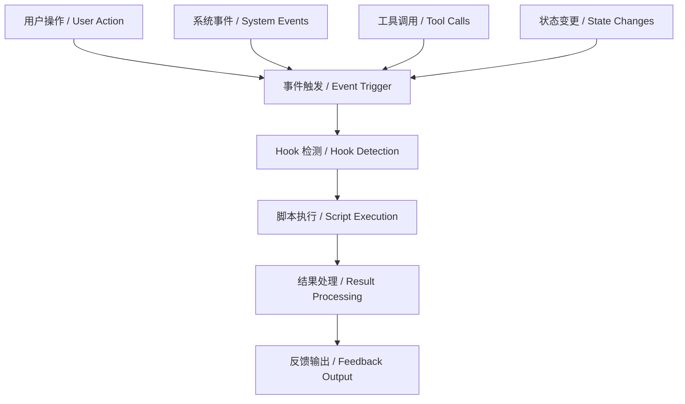

# Hook 和自动化框架完整指南 / Hook and Automation Framework Complete Guide

## 系统概述 / System Overview

Hook 和自动化框架是 Claude Code 生态系统的核心组件，提供事件驱动的自动化能力和智能工作流程编排。本指南详细介绍了 Hook 系统的架构、配置、使用方法和最佳实践。

The Hook and automation framework is a core component of the Claude Code ecosystem, providing event-driven automation capabilities and intelligent workflow orchestration. This guide provides detailed information about Hook system architecture, configuration, usage methods, and best practices.

## 核心架构 / Core Architecture

### 1. Hook 事件系统 / Hook Event System



### 2. Hook 类型分类 / Hook Type Classification

```json
{
  "hook_types": {
    "user_interaction": {
      "user-prompt-submit-hook": "用户提交提示时触发",
      "user-input-complete-hook": "用户输入完成时触发",
      "session-start-hook": "会话开始时触发",
      "session-end-hook": "会话结束时触发"
    },
    "tool_operations": {
      "tool-call-hook": "工具调用时触发",
      "edit-complete-hook": "编辑完成时触发", 
      "file-create-hook": "文件创建时触发",
      "file-delete-hook": "文件删除时触发"
    },
    "project_management": {
      "project-start-hook": "项目开始时触发",
      "task-completion-hook": "任务完成时触发",
      "build-success-hook": "构建成功时触发",
      "test-pass-hook": "测试通过时触发"
    },
    "quality_assurance": {
      "code-review-hook": "代码审查时触发",
      "lint-check-hook": "代码检查时触发",
      "security-scan-hook": "安全扫描时触发",
      "performance-check-hook": "性能检查时触发"
    }
  }
}
```

## Hook 配置管理 / Hook Configuration Management

### 1. 全局配置 / Global Configuration

#### Claude Code 设置 / Claude Code Settings
```json
{
  "hooks": {
    "enabled": true,
    "timeout": 30000,
    "retries": 3,
    "logLevel": "info",
    "parallelExecution": true,
    "maxConcurrentHooks": 5,
    "defaultShell": "/bin/bash",
    "environmentVariables": {
      "CLAUDE_HOOK_ENV": "production",
      "PROJECT_ROOT": "${workspaceFolder}",
      "HOOK_LOG_PATH": "/tmp/claude-hooks.log"
    }
  }
}
```

#### Ruler 统一配置 / Ruler Unified Configuration
```toml
# .ruler/hooks.toml
[hooks.global]
enabled = true
timeout = 30000
log_level = "info"

[hooks.sound_system]
enabled = true
project_completion_sound = true
error_notification_sound = true

[hooks.quality_assurance]
auto_lint = true
auto_test = true
auto_review = true

[hooks.project_management]
task_tracking = true
progress_notification = true
completion_celebration = true
```

### 2. 项目级配置 / Project-Level Configuration

#### .claude/hooks.json 配置 / .claude/hooks.json Configuration
```json
{
  "project": "LaunchX-智链平台",
  "hooks": {
    "user-prompt-submit-hook": {
      "enabled": true,
      "script": "./hooks/prompt-submit.sh",
      "timeout": 10000,
      "runInBackground": false
    },
    "edit-complete-hook": {
      "enabled": true,
      "script": "./hooks/edit-complete.sh",
      "timeout": 15000,
      "runInBackground": true,
      "conditions": {
        "fileTypes": [".js", ".ts", ".jsx", ".tsx", ".py", ".md"],
        "minChanges": 5
      }
    },
    "task-completion-hook": {
      "enabled": true,
      "script": "./hooks/task-completion.sh",
      "timeout": 5000,
      "conditions": {
        "taskTypes": ["coding", "review", "documentation"],
        "minDuration": 30000
      }
    }
  }
}
```

## 实用 Hook 脚本集合 / Practical Hook Script Collection

### 1. 用户交互 Hook / User Interaction Hooks

#### 提示提交处理 / Prompt Submit Handler
```bash
#!/bin/bash
# hooks/prompt-submit.sh - 用户提示提交处理

set -euo pipefail

HOOK_NAME="user-prompt-submit"
TIMESTAMP=$(date +"%Y-%m-%d %H:%M:%S")
PROMPT_TEXT="$1"
SESSION_ID="$2"

# 记录提示历史 / Log prompt history
echo "[$TIMESTAMP] Session: $SESSION_ID - Prompt: $PROMPT_TEXT" >> .claude/prompt-history.log

# 分析提示复杂度 / Analyze prompt complexity
WORD_COUNT=$(echo "$PROMPT_TEXT" | wc -w)
if [ "$WORD_COUNT" -gt 100 ]; then
    echo "📊 复杂提示检测 - 字数: $WORD_COUNT" >&2
    # 启动长任务监控 / Start long task monitoring
    touch .claude/long-task-active
fi

# 检查项目上下文 / Check project context
if [[ "$PROMPT_TEXT" =~ "智链|zhilink|LaunchX" ]]; then
    echo "🔗 LaunchX 智链项目上下文激活" >&2
    export PROJECT_CONTEXT="zhilink"
fi

# 智能工作模式检测 / Smart work mode detection
CURRENT_HOUR=$(date +%H)
if [ "$CURRENT_HOUR" -ge 22 ] || [ "$CURRENT_HOUR" -le 6 ]; then
    echo "🌙 夜间模式激活 - 启用静音通知" >&2
    export SOUND_MODE="silent"
else
    export SOUND_MODE="normal"
fi

echo "✅ 提示处理完成 - 模式: $SOUND_MODE, 上下文: ${PROJECT_CONTEXT:-general}"
```

### 2. 编辑完成 Hook / Edit Complete Hooks

#### 智能编辑分析 / Intelligent Edit Analysis
```bash
#!/bin/bash
# hooks/edit-complete.sh - 编辑完成智能分析

set -euo pipefail

FILE_PATH="$1"
EDIT_TYPE="$2"  # create, update, delete
CHANGES_COUNT="$3"

# 项目声音系统集成 / Project sound system integration
SOUND_ENGINE="./开发规范工具/sound-system/sound_engine.py"
if [ -f "$SOUND_ENGINE" ]; then
    python3 "$SOUND_ENGINE" --event "edit_complete" \
        --file "$FILE_PATH" \
        --changes "$CHANGES_COUNT" \
        --type "$EDIT_TYPE"
fi

# 智能代码质量检查 / Intelligent code quality check
case "${FILE_PATH##*.}" in
    js|ts|jsx|tsx)
        if command -v eslint >/dev/null 2>&1; then
            echo "🔍 运行 ESLint 检查..." >&2
            eslint "$FILE_PATH" --fix-dry-run --format compact
        fi
        ;;
    py)
        if command -v ruff >/dev/null 2>&1; then
            echo "🔍 运行 Ruff 检查..." >&2
            ruff check "$FILE_PATH"
        fi
        ;;
    md)
        if command -v markdownlint >/dev/null 2>&1; then
            echo "🔍 运行 Markdown 检查..." >&2
            markdownlint "$FILE_PATH"
        fi
        ;;
esac

# 自动测试触发 / Automatic test triggering
if [[ "$FILE_PATH" =~ \.(js|ts|py)$ ]] && [ "$CHANGES_COUNT" -gt 10 ]; then
    echo "🧪 变更较大，建议运行测试" >&2
    if [ -f "package.json" ] && jq -e '.scripts.test' package.json >/dev/null; then
        echo "💡 可运行: npm test" >&2
    elif [ -f "pytest.ini" ] || [ -f "pyproject.toml" ]; then
        echo "💡 可运行: pytest" >&2
    fi
fi

# 文档同步检查 / Documentation sync check
if [[ "$FILE_PATH" =~ src/ ]] && [ "$EDIT_TYPE" = "create" ]; then
    echo "📚 新文件创建，检查文档同步..." >&2
    # 检查是否需要更新 README 或文档
    if [ ! -f "docs/$(basename "$FILE_PATH" .${FILE_PATH##*.}).md" ]; then
        echo "💡 建议创建对应文档: docs/$(basename "$FILE_PATH" .${FILE_PATH##*.}).md" >&2
    fi
fi

echo "✅ 编辑分析完成 - 文件: $FILE_PATH, 变更: $CHANGES_COUNT"
```

### 3. 任务完成 Hook / Task Completion Hooks

#### 项目完成庆祝系统 / Project Completion Celebration System
```bash
#!/bin/bash
# hooks/task-completion.sh - 任务完成庆祝和分析

set -euo pipefail

TASK_TYPE="$1"
DURATION="$2"
COMPLEXITY="$3"

# 加载声音系统 / Load sound system
SOUND_ENGINE="./开发规范工具/sound-system/sound_engine.py"
SCENARIO_MANAGER="./开发规范工具/sound-system/scenarios.py"

# 任务完成声音反馈 / Task completion sound feedback
if [ -f "$SOUND_ENGINE" ]; then
    python3 "$SOUND_ENGINE" --event "task_completion" \
        --task-type "$TASK_TYPE" \
        --duration "$DURATION" \
        --complexity "$COMPLEXITY"
fi

# 任务统计更新 / Task statistics update
STATS_FILE=".claude/task-stats.json"
if [ ! -f "$STATS_FILE" ]; then
    echo '{"tasks_completed": 0, "total_time": 0, "by_type": {}}' > "$STATS_FILE"
fi

# 更新统计数据 / Update statistics
python3 -c "
import json
import sys

stats_file = '$STATS_FILE'
task_type = '$TASK_TYPE'
duration = int('$DURATION')

with open(stats_file, 'r') as f:
    stats = json.load(f)

stats['tasks_completed'] += 1
stats['total_time'] += duration

if task_type not in stats['by_type']:
    stats['by_type'][task_type] = {'count': 0, 'time': 0}

stats['by_type'][task_type]['count'] += 1
stats['by_type'][task_type]['time'] += duration

with open(stats_file, 'w') as f:
    json.dump(stats, f, indent=2)

print(f'📊 任务统计更新: {stats[\"tasks_completed\"]} 个任务完成')
"

# 智能休息建议 / Intelligent break suggestions
TOTAL_TIME=$(jq -r '.total_time' "$STATS_FILE")
RECENT_TASKS=$(jq -r '.tasks_completed' "$STATS_FILE")

if [ "$TOTAL_TIME" -gt 7200000 ]; then  # 2小时
    echo "⏰ 连续工作超过2小时，建议休息一下！" >&2
elif [ "$RECENT_TASKS" -gt 10 ]; then
    echo "🎯 完成任务较多，状态很好！建议适当休息保持效率。" >&2
fi

# 项目进度检查 / Project progress check
if [[ "$TASK_TYPE" =~ "coding|implementation" ]]; then
    echo "💻 代码任务完成，建议运行测试确保质量" >&2
elif [[ "$TASK_TYPE" =~ "review|refactor" ]]; then
    echo "🔍 审查/重构完成，代码质量得到提升" >&2
elif [[ "$TASK_TYPE" =~ "documentation" ]]; then
    echo "📝 文档任务完成，项目可维护性增强" >&2
fi

echo "🎉 任务完成! 类型: $TASK_TYPE, 耗时: ${DURATION}ms"
```

## 高级自动化模式 / Advanced Automation Patterns

### 1. 工作流程编排 / Workflow Orchestration

#### 多阶段任务自动化 / Multi-stage Task Automation
```bash
#!/bin/bash
# hooks/workflow-orchestrator.sh - 工作流程编排器

set -euo pipefail

WORKFLOW_TYPE="$1"
PROJECT_CONTEXT="$2"

case "$WORKFLOW_TYPE" in
    "feature-development")
        echo "🚀 启动功能开发工作流..." >&2
        # 1. 代码分析阶段
        ./hooks/analyze-codebase.sh "$PROJECT_CONTEXT"
        # 2. 设计确认阶段  
        ./hooks/design-review.sh "$PROJECT_CONTEXT"
        # 3. 实现阶段
        ./hooks/implementation-tracking.sh "$PROJECT_CONTEXT"
        # 4. 测试阶段
        ./hooks/testing-automation.sh "$PROJECT_CONTEXT"
        # 5. 文档更新阶段
        ./hooks/documentation-sync.sh "$PROJECT_CONTEXT"
        ;;
    "bug-fix")
        echo "🐛 启动问题修复工作流..." >&2
        # 1. 问题定位
        ./hooks/bug-analysis.sh "$PROJECT_CONTEXT"
        # 2. 影响评估
        ./hooks/impact-assessment.sh "$PROJECT_CONTEXT"
        # 3. 修复实现
        ./hooks/fix-implementation.sh "$PROJECT_CONTEXT"
        # 4. 回归测试
        ./hooks/regression-testing.sh "$PROJECT_CONTEXT"
        ;;
    "refactoring")
        echo "🔧 启动重构工作流..." >&2
        # 1. 代码质量分析
        ./hooks/quality-analysis.sh "$PROJECT_CONTEXT"
        # 2. 重构计划
        ./hooks/refactoring-plan.sh "$PROJECT_CONTEXT"
        # 3. 渐进式重构
        ./hooks/incremental-refactor.sh "$PROJECT_CONTEXT"
        # 4. 质量验证
        ./hooks/quality-verification.sh "$PROJECT_CONTEXT"
        ;;
esac

echo "✅ 工作流程 $WORKFLOW_TYPE 编排完成"
```

### 2. 智能质量监控 / Intelligent Quality Monitoring

#### 实时代码质量监控 / Real-time Code Quality Monitoring
```python
#!/usr/bin/env python3
# hooks/quality-monitor.py - 实时代码质量监控

import json
import subprocess
import sys
from pathlib import Path
from datetime import datetime
import logging

class QualityMonitor:
    def __init__(self, project_root):
        self.project_root = Path(project_root)
        self.metrics_file = self.project_root / '.claude' / 'quality-metrics.json'
        self.setup_logging()
    
    def setup_logging(self):
        logging.basicConfig(
            level=logging.INFO,
            format='%(asctime)s - %(levelname)s - %(message)s',
            handlers=[
                logging.FileHandler('.claude/quality-monitor.log'),
                logging.StreamHandler()
            ]
        )
        self.logger = logging.getLogger(__name__)
    
    def check_code_quality(self, file_path):
        """检查单个文件的代码质量"""
        file_path = Path(file_path)
        results = {
            'file': str(file_path),
            'timestamp': datetime.now().isoformat(),
            'metrics': {}
        }
        
        # 根据文件类型选择检查工具
        if file_path.suffix in ['.js', '.ts', '.jsx', '.tsx']:
            results['metrics'].update(self._check_javascript(file_path))
        elif file_path.suffix == '.py':
            results['metrics'].update(self._check_python(file_path))
        elif file_path.suffix == '.md':
            results['metrics'].update(self._check_markdown(file_path))
        
        # 更新项目质量指标
        self._update_project_metrics(results)
        return results
    
    def _check_javascript(self, file_path):
        """检查 JavaScript/TypeScript 文件"""
        metrics = {}
        
        # ESLint 检查
        try:
            result = subprocess.run(
                ['eslint', str(file_path), '--format', 'json'],
                capture_output=True, text=True, timeout=30
            )
            if result.stdout:
                eslint_data = json.loads(result.stdout)
                if eslint_data and len(eslint_data) > 0:
                    file_data = eslint_data[0]
                    metrics['eslint'] = {
                        'error_count': file_data.get('errorCount', 0),
                        'warning_count': file_data.get('warningCount', 0),
                        'fixable_error_count': file_data.get('fixableErrorCount', 0),
                        'fixable_warning_count': file_data.get('fixableWarningCount', 0)
                    }
        except (subprocess.TimeoutExpired, subprocess.CalledProcessError, json.JSONDecodeError):
            self.logger.warning(f"ESLint 检查失败: {file_path}")
        
        # TypeScript 类型检查
        if file_path.suffix in ['.ts', '.tsx']:
            try:
                result = subprocess.run(
                    ['tsc', '--noEmit', '--skipLibCheck', str(file_path)],
                    capture_output=True, text=True, timeout=30
                )
                metrics['typescript'] = {
                    'type_errors': len([line for line in result.stderr.split('\n') if 'error TS' in line])
                }
            except (subprocess.TimeoutExpired, subprocess.CalledProcessError):
                self.logger.warning(f"TypeScript 检查失败: {file_path}")
        
        return metrics
    
    def _check_python(self, file_path):
        """检查 Python 文件"""
        metrics = {}
        
        # Ruff 检查
        try:
            result = subprocess.run(
                ['ruff', 'check', str(file_path), '--format', 'json'],
                capture_output=True, text=True, timeout=30
            )
            if result.stdout:
                ruff_data = json.loads(result.stdout)
                metrics['ruff'] = {
                    'violations': len(ruff_data),
                    'fixable': len([v for v in ruff_data if v.get('fix')])
                }
        except (subprocess.TimeoutExpired, subprocess.CalledProcessError, json.JSONDecodeError):
            self.logger.warning(f"Ruff 检查失败: {file_path}")
        
        # mypy 类型检查
        try:
            result = subprocess.run(
                ['mypy', str(file_path), '--json-report', '/dev/stdout'],
                capture_output=True, text=True, timeout=30
            )
            if result.stdout:
                mypy_data = json.loads(result.stdout)
                metrics['mypy'] = {
                    'type_errors': len(mypy_data.get('reports', {}).get('summary', {}).get('errors', []))
                }
        except (subprocess.TimeoutExpired, subprocess.CalledProcessError, json.JSONDecodeError):
            self.logger.warning(f"mypy 检查失败: {file_path}")
        
        return metrics
    
    def _check_markdown(self, file_path):
        """检查 Markdown 文件"""
        metrics = {}
        
        try:
            result = subprocess.run(
                ['markdownlint', str(file_path), '--json'],
                capture_output=True, text=True, timeout=30
            )
            if result.stdout:
                md_data = json.loads(result.stdout)
                metrics['markdownlint'] = {
                    'issues': len(md_data.get(str(file_path), []))
                }
        except (subprocess.TimeoutExpired, subprocess.CalledProcessError, json.JSONDecodeError):
            self.logger.warning(f"Markdownlint 检查失败: {file_path}")
        
        return metrics
    
    def _update_project_metrics(self, file_results):
        """更新项目整体质量指标"""
        if not self.metrics_file.parent.exists():
            self.metrics_file.parent.mkdir(parents=True)
        
        # 加载现有指标
        if self.metrics_file.exists():
            with open(self.metrics_file, 'r') as f:
                project_metrics = json.load(f)
        else:
            project_metrics = {
                'files': {},
                'summary': {
                    'total_files': 0,
                    'last_updated': None,
                    'quality_trend': []
                }
            }
        
        # 更新文件指标
        project_metrics['files'][file_results['file']] = file_results
        project_metrics['summary']['total_files'] = len(project_metrics['files'])
        project_metrics['summary']['last_updated'] = datetime.now().isoformat()
        
        # 计算质量趋势
        self._calculate_quality_trend(project_metrics)
        
        # 保存更新后的指标
        with open(self.metrics_file, 'w') as f:
            json.dump(project_metrics, f, indent=2)
        
        self.logger.info(f"项目质量指标已更新: {file_results['file']}")
    
    def _calculate_quality_trend(self, project_metrics):
        """计算质量趋势"""
        total_errors = 0
        total_warnings = 0
        
        for file_data in project_metrics['files'].values():
            metrics = file_data.get('metrics', {})
            for tool_metrics in metrics.values():
                if isinstance(tool_metrics, dict):
                    total_errors += tool_metrics.get('error_count', 0) + tool_metrics.get('type_errors', 0)
                    total_warnings += tool_metrics.get('warning_count', 0) + tool_metrics.get('violations', 0)
        
        quality_score = max(0, 100 - (total_errors * 10 + total_warnings * 2))
        
        # 记录质量趋势
        trend_entry = {
            'timestamp': datetime.now().isoformat(),
            'quality_score': quality_score,
            'total_errors': total_errors,
            'total_warnings': total_warnings
        }
        
        project_metrics['summary']['quality_trend'].append(trend_entry)
        
        # 保持最近30个数据点
        if len(project_metrics['summary']['quality_trend']) > 30:
            project_metrics['summary']['quality_trend'] = project_metrics['summary']['quality_trend'][-30:]

if __name__ == '__main__':
    if len(sys.argv) != 2:
        print("使用方法: python3 quality-monitor.py <file_path>")
        sys.exit(1)
    
    file_path = sys.argv[1]
    monitor = QualityMonitor('.')
    results = monitor.check_code_quality(file_path)
    
    print(f"✅ 质量检查完成: {file_path}")
    if results['metrics']:
        print(f"📊 发现指标: {json.dumps(results['metrics'], indent=2)}")
```

### 3. 性能监控和优化 / Performance Monitoring and Optimization

#### Hook 性能分析器 / Hook Performance Analyzer
```bash
#!/bin/bash
# hooks/performance-analyzer.sh - Hook 性能分析器

set -euo pipefail

HOOK_NAME="$1"
START_TIME="$2"
END_TIME="$3"

DURATION=$((END_TIME - START_TIME))
PERF_LOG=".claude/hook-performance.log"

# 记录性能数据 / Record performance data
echo "$(date -Iseconds) | $HOOK_NAME | ${DURATION}ms" >> "$PERF_LOG"

# 性能阈值检查 / Performance threshold check
SLOW_THRESHOLD=5000  # 5秒
VERY_SLOW_THRESHOLD=15000  # 15秒

if [ "$DURATION" -gt "$VERY_SLOW_THRESHOLD" ]; then
    echo "🐌 警告: Hook '$HOOK_NAME' 执行时间过长 (${DURATION}ms)" >&2
    echo "💡 建议优化或设置为后台执行" >&2
elif [ "$DURATION" -gt "$SLOW_THRESHOLD" ]; then
    echo "⏰ 注意: Hook '$HOOK_NAME' 执行较慢 (${DURATION}ms)" >&2
fi

# 生成性能报告 / Generate performance report
if [ "$((RANDOM % 10))" -eq 0 ]; then  # 10% 概率生成报告
    python3 -c "
import re
from collections import defaultdict, Counter
from datetime import datetime, timedelta

perf_data = defaultdict(list)
with open('$PERF_LOG', 'r') as f:
    for line in f:
        if '|' in line:
            parts = line.strip().split(' | ')
            if len(parts) == 3:
                timestamp, hook_name, duration = parts
                duration_ms = int(duration.replace('ms', ''))
                perf_data[hook_name].append(duration_ms)

print('📊 Hook 性能分析报告:')
for hook_name, durations in perf_data.items():
    if durations:
        avg_duration = sum(durations) / len(durations)
        max_duration = max(durations)
        min_duration = min(durations)
        print(f'  {hook_name}:')
        print(f'    平均耗时: {avg_duration:.1f}ms')
        print(f'    最大耗时: {max_duration}ms')
        print(f'    最小耗时: {min_duration}ms')
        print(f'    执行次数: {len(durations)}')
        print()
"
fi

echo "⚡ Hook 性能分析完成: $HOOK_NAME (${DURATION}ms)"
```

## 平台特定集成 / Platform-Specific Integration

### 1. LaunchX 智链平台集成 / LaunchX Zhilink Platform Integration

#### 智链项目 Hook 配置 / Zhilink Project Hook Configuration
```json
{
  "zhilink_hooks": {
    "development": {
      "frontend-change-hook": {
        "script": "./hooks/zhilink/frontend-change.sh",
        "triggers": ["src/app/**/*.tsx", "src/components/**/*.tsx"],
        "actions": [
          "TypeScript 类型检查",
          "React 组件验证",
          "Tailwind CSS 检查",
          "自动化测试触发"
        ]
      },
      "backend-change-hook": {
        "script": "./hooks/zhilink/backend-change.sh", 
        "triggers": ["src/services/**/*.ts", "src/database/**/*.ts"],
        "actions": [
          "API 类型检查",
          "数据库模型验证",
          "单元测试运行",
          "集成测试触发"
        ]
      },
      "chat-system-hook": {
        "script": "./hooks/zhilink/chat-system.sh",
        "triggers": ["src/app/chat/**/*.tsx", "src/services/chat/**/*.ts"],
        "actions": [
          "聊天功能测试",
          "实时通信验证",
          "性能基准测试"
        ]
      }
    }
  }
}
```

#### 智链前端变更 Hook / Zhilink Frontend Change Hook
```bash
#!/bin/bash
# hooks/zhilink/frontend-change.sh - 智链前端变更处理

set -euo pipefail

CHANGED_FILE="$1"
CHANGE_TYPE="$2"

echo "🔗 LaunchX 智链前端变更检测: $CHANGED_FILE" >&2

# Next.js 项目检查 / Next.js project check
if [[ "$CHANGED_FILE" =~ src/app/ ]]; then
    echo "📱 App Router 文件变更，检查路由结构..." >&2
    
    # 检查页面组件规范 / Check page component standards
    if [[ "$CHANGED_FILE" =~ page\.tsx$ ]]; then
        echo "📄 页面组件变更，验证导出规范..." >&2
        # 检查是否有默认导出
        if ! grep -q "export default" "$CHANGED_FILE"; then
            echo "⚠️  警告: 页面组件缺少默认导出" >&2
        fi
    fi
    
    # 检查布局组件 / Check layout components
    if [[ "$CHANGED_FILE" =~ layout\.tsx$ ]]; then
        echo "🏗️  布局组件变更，检查children prop..." >&2
        if ! grep -q "children.*React\.ReactNode" "$CHANGED_FILE"; then
            echo "💡 建议: 确保布局组件包含children prop类型定义" >&2
        fi
    fi
fi

# React 组件质量检查 / React component quality check
if [[ "$CHANGED_FILE" =~ \.tsx$ ]]; then
    echo "⚛️  React 组件检查..." >&2
    
    # 检查 Hooks 使用规范 / Check Hooks usage standards
    if grep -q "useState\|useEffect\|useCallback\|useMemo" "$CHANGED_FILE"; then
        echo "🪝 检测到 Hooks 使用，验证依赖数组..." >&2
    fi
    
    # 检查 TypeScript 类型定义 / Check TypeScript type definitions
    if ! grep -q "interface\|type\|:" "$CHANGED_FILE"; then
        echo "💡 建议: 添加 TypeScript 类型定义提高代码质量" >&2
    fi
    
    # Tailwind CSS 类名检查 / Tailwind CSS class check
    if grep -q "className=" "$CHANGED_FILE"; then
        echo "🎨 检测到 Tailwind CSS 使用" >&2
        # 可以添加 Tailwind 类名验证逻辑
    fi
fi

# 自动化测试建议 / Automated testing suggestions
if [[ "$CHANGE_TYPE" = "create" ]]; then
    COMPONENT_NAME=$(basename "$CHANGED_FILE" .tsx)
    TEST_FILE="src/__tests__/${COMPONENT_NAME}.test.tsx"
    
    if [ ! -f "$TEST_FILE" ]; then
        echo "🧪 建议创建测试文件: $TEST_FILE" >&2
    fi
fi

# 声音反馈 / Sound feedback
if [ -f "./开发规范工具/sound-system/sound_engine.py" ]; then
    python3 "./开发规范工具/sound-system/sound_engine.py" \
        --event "zhilink_frontend_change" \
        --file "$CHANGED_FILE" \
        --type "$CHANGE_TYPE"
fi

echo "✅ 智链前端变更处理完成"
```

### 2. 多项目支持 / Multi-Project Support

#### 项目上下文检测 / Project Context Detection
```bash
#!/bin/bash
# hooks/project-context-detector.sh - 项目上下文检测器

set -euo pipefail

detect_project_context() {
    local current_dir="$PWD"
    
    # LaunchX 智链项目检测 / LaunchX Zhilink project detection
    if [[ "$current_dir" =~ zhilink ]] || [ -f "智链系统验收报告.md" ]; then
        echo "zhilink"
        return 0
    fi
    
    # PocketCorn 项目检测 / PocketCorn project detection  
    if [[ "$current_dir" =~ pocketcorn ]] || [ -f "pocketcorn.config.js" ]; then
        echo "pocketcorn"
        return 0
    fi
    
    # Trading Agents 项目检测 / Trading Agents project detection
    if [[ "$current_dir" =~ trading ]] || [ -f "trading-config.json" ]; then
        echo "trading"
        return 0
    fi
    
    # 知识管理项目检测 / Knowledge management project detection
    if [ -d ".obsidian" ] || [[ "$current_dir" =~ obsidian ]]; then
        echo "knowledge"
        return 0
    fi
    
    # 通用项目 / Generic project
    echo "general"
}

PROJECT_CONTEXT=$(detect_project_context)
echo "🎯 项目上下文: $PROJECT_CONTEXT" >&2

# 设置项目特定的环境变量 / Set project-specific environment variables
case "$PROJECT_CONTEXT" in
    "zhilink")
        export PROJECT_TYPE="web-platform"
        export TECH_STACK="nextjs,typescript,tailwind,mongodb"
        export SOUND_THEME="professional"
        ;;
    "pocketcorn")
        export PROJECT_TYPE="data-analysis"
        export TECH_STACK="python,jupyter,pandas,plotly"
        export SOUND_THEME="analytical"
        ;;
    "trading")
        export PROJECT_TYPE="financial-system"
        export TECH_STACK="python,fastapi,asyncio,websockets"
        export SOUND_THEME="trading"
        ;;
    "knowledge")
        export PROJECT_TYPE="knowledge-management"
        export TECH_STACK="markdown,obsidian,javascript"
        export SOUND_THEME="academic"
        ;;
    *)
        export PROJECT_TYPE="general"
        export TECH_STACK="unknown"
        export SOUND_THEME="default"
        ;;
esac

echo "PROJECT_CONTEXT=$PROJECT_CONTEXT"
echo "PROJECT_TYPE=$PROJECT_TYPE"
echo "TECH_STACK=$TECH_STACK"
echo "SOUND_THEME=$SOUND_THEME"
```

## 监控和调试 / Monitoring and Debugging

### 1. Hook 日志系统 / Hook Logging System

#### 结构化日志记录 / Structured Logging
```python
#!/usr/bin/env python3
# hooks/logger.py - Hook 结构化日志系统

import json
import logging
import sys
from datetime import datetime
from pathlib import Path
from typing import Dict, Any, Optional

class HookLogger:
    def __init__(self, log_dir: str = '.claude/logs'):
        self.log_dir = Path(log_dir)
        self.log_dir.mkdir(parents=True, exist_ok=True)
        
        # 设置日志格式 / Set up log format
        self.setup_loggers()
    
    def setup_loggers(self):
        """设置不同级别的日志记录器"""
        # 主日志记录器 / Main logger
        self.main_logger = logging.getLogger('hook_main')
        self.main_logger.setLevel(logging.INFO)
        
        # 性能日志记录器 / Performance logger
        self.perf_logger = logging.getLogger('hook_performance')
        self.perf_logger.setLevel(logging.INFO)
        
        # 错误日志记录器 / Error logger
        self.error_logger = logging.getLogger('hook_errors')
        self.error_logger.setLevel(logging.ERROR)
        
        # 配置文件处理器 / Configure file handlers
        main_handler = logging.FileHandler(self.log_dir / 'hooks.log')
        perf_handler = logging.FileHandler(self.log_dir / 'performance.log')
        error_handler = logging.FileHandler(self.log_dir / 'errors.log')
        
        # JSON 格式化器 / JSON formatter
        formatter = logging.Formatter('%(message)s')
        
        for handler in [main_handler, perf_handler, error_handler]:
            handler.setFormatter(formatter)
        
        self.main_logger.addHandler(main_handler)
        self.perf_logger.addHandler(perf_handler)
        self.error_logger.addHandler(error_handler)
    
    def log_hook_execution(self, hook_name: str, event_data: Dict[str, Any], 
                          execution_time: Optional[float] = None, 
                          status: str = 'success', error: Optional[str] = None):
        """记录 Hook 执行信息"""
        log_entry = {
            'timestamp': datetime.now().isoformat(),
            'hook_name': hook_name,
            'status': status,
            'event_data': event_data,
            'execution_time_ms': execution_time,
            'error': error
        }
        
        # 主日志记录 / Main log record
        self.main_logger.info(json.dumps(log_entry))
        
        # 性能日志记录 / Performance log record
        if execution_time is not None:
            perf_entry = {
                'timestamp': datetime.now().isoformat(),
                'hook_name': hook_name,
                'execution_time_ms': execution_time,
                'performance_category': self._categorize_performance(execution_time)
            }
            self.perf_logger.info(json.dumps(perf_entry))
        
        # 错误日志记录 / Error log record
        if error:
            error_entry = {
                'timestamp': datetime.now().isoformat(),
                'hook_name': hook_name,
                'error': error,
                'event_data': event_data
            }
            self.error_logger.error(json.dumps(error_entry))
    
    def _categorize_performance(self, execution_time: float) -> str:
        """性能分类"""
        if execution_time < 100:
            return 'fast'
        elif execution_time < 1000:
            return 'normal'
        elif execution_time < 5000:
            return 'slow'
        else:
            return 'very_slow'
    
    def generate_report(self) -> Dict[str, Any]:
        """生成性能和使用报告"""
        report = {
            'generated_at': datetime.now().isoformat(),
            'hook_statistics': self._analyze_hook_usage(),
            'performance_statistics': self._analyze_performance(),
            'error_statistics': self._analyze_errors()
        }
        
        # 保存报告 / Save report
        report_file = self.log_dir / f'report_{datetime.now().strftime("%Y%m%d_%H%M%S")}.json'
        with open(report_file, 'w') as f:
            json.dump(report, f, indent=2)
        
        return report
    
    def _analyze_hook_usage(self) -> Dict[str, Any]:
        """分析 Hook 使用情况"""
        hook_counts = {}
        success_counts = {}
        
        try:
            with open(self.log_dir / 'hooks.log', 'r') as f:
                for line in f:
                    try:
                        entry = json.loads(line.strip())
                        hook_name = entry.get('hook_name', 'unknown')
                        status = entry.get('status', 'unknown')
                        
                        hook_counts[hook_name] = hook_counts.get(hook_name, 0) + 1
                        if status == 'success':
                            success_counts[hook_name] = success_counts.get(hook_name, 0) + 1
                    except json.JSONDecodeError:
                        continue
        except FileNotFoundError:
            pass
        
        return {
            'total_executions': sum(hook_counts.values()),
            'hook_counts': hook_counts,
            'success_rates': {
                hook: (success_counts.get(hook, 0) / count * 100)
                for hook, count in hook_counts.items()
            }
        }
    
    def _analyze_performance(self) -> Dict[str, Any]:
        """分析性能统计"""
        performance_data = {}
        
        try:
            with open(self.log_dir / 'performance.log', 'r') as f:
                for line in f:
                    try:
                        entry = json.loads(line.strip())
                        hook_name = entry.get('hook_name', 'unknown')
                        exec_time = entry.get('execution_time_ms', 0)
                        
                        if hook_name not in performance_data:
                            performance_data[hook_name] = []
                        performance_data[hook_name].append(exec_time)
                    except json.JSONDecodeError:
                        continue
        except FileNotFoundError:
            pass
        
        # 计算统计指标 / Calculate statistics
        statistics = {}
        for hook_name, times in performance_data.items():
            if times:
                statistics[hook_name] = {
                    'avg_time': sum(times) / len(times),
                    'min_time': min(times),
                    'max_time': max(times),
                    'total_executions': len(times)
                }
        
        return statistics
    
    def _analyze_errors(self) -> Dict[str, Any]:
        """分析错误统计"""
        error_counts = {}
        
        try:
            with open(self.log_dir / 'errors.log', 'r') as f:
                for line in f:
                    try:
                        entry = json.loads(line.strip())
                        hook_name = entry.get('hook_name', 'unknown')
                        error_counts[hook_name] = error_counts.get(hook_name, 0) + 1
                    except json.JSONDecodeError:
                        continue
        except FileNotFoundError:
            pass
        
        return {
            'total_errors': sum(error_counts.values()),
            'error_counts': error_counts
        }

# 命令行接口 / Command line interface
if __name__ == '__main__':
    logger = HookLogger()
    
    if len(sys.argv) > 1 and sys.argv[1] == 'report':
        report = logger.generate_report()
        print(json.dumps(report, indent=2))
    else:
        # 示例日志记录 / Example logging
        logger.log_hook_execution(
            hook_name='example-hook',
            event_data={'file': 'test.py', 'action': 'edit'},
            execution_time=150.5,
            status='success'
        )
        print("✅ 日志记录完成")
```

### 2. Hook 性能优化 / Hook Performance Optimization

#### 批量处理优化 / Batch Processing Optimization
```bash
#!/bin/bash
# hooks/batch-processor.sh - Hook 批量处理优化器

set -euo pipefail

BATCH_FILE="/tmp/claude-hook-batch.txt"
BATCH_TIMEOUT=5  # 5秒批量超时
MAX_BATCH_SIZE=10

# 初始化批量文件 / Initialize batch file
if [ ! -f "$BATCH_FILE" ]; then
    touch "$BATCH_FILE"
fi

# 添加任务到批量队列 / Add task to batch queue
add_to_batch() {
    local hook_name="$1"
    local event_data="$2"
    
    echo "$(date +%s)|$hook_name|$event_data" >> "$BATCH_FILE"
    
    # 检查是否达到批量阈值 / Check if batch threshold reached
    local batch_size=$(wc -l < "$BATCH_FILE")
    if [ "$batch_size" -ge "$MAX_BATCH_SIZE" ]; then
        process_batch
    fi
}

# 处理批量任务 / Process batch tasks
process_batch() {
    if [ ! -s "$BATCH_FILE" ]; then
        return 0
    fi
    
    echo "🔄 处理批量 Hook 任务..." >&2
    
    local temp_file="/tmp/claude-hook-batch-processing.txt"
    mv "$BATCH_FILE" "$temp_file"
    touch "$BATCH_FILE"
    
    # 并行处理批量任务 / Process batch tasks in parallel
    while IFS='|' read -r timestamp hook_name event_data; do
        (
            echo "执行 Hook: $hook_name" >&2
            # 这里执行实际的 Hook 逻辑
            # Execute actual Hook logic here
        ) &
    done < "$temp_file"
    
    # 等待所有后台任务完成 / Wait for all background tasks
    wait
    
    rm -f "$temp_file"
    echo "✅ 批量处理完成" >&2
}

# 定时批量处理 / Timed batch processing
start_batch_timer() {
    (
        while true; do
            sleep "$BATCH_TIMEOUT"
            if [ -s "$BATCH_FILE" ]; then
                process_batch
            fi
        done
    ) &
    
    echo $! > "/tmp/claude-hook-batch-timer.pid"
}

# 停止批量计时器 / Stop batch timer
stop_batch_timer() {
    if [ -f "/tmp/claude-hook-batch-timer.pid" ]; then
        local timer_pid=$(cat "/tmp/claude-hook-batch-timer.pid")
        if kill -0 "$timer_pid" 2>/dev/null; then
            kill "$timer_pid"
        fi
        rm -f "/tmp/claude-hook-batch-timer.pid"
    fi
}

# 命令行接口 / Command line interface
case "${1:-}" in
    "add")
        add_to_batch "$2" "$3"
        ;;
    "process")
        process_batch
        ;;
    "start-timer")
        start_batch_timer
        echo "⏱️  批量计时器已启动"
        ;;
    "stop-timer")
        stop_batch_timer
        echo "⏹️  批量计时器已停止"
        ;;
    *)
        echo "使用方法: $0 {add|process|start-timer|stop-timer} [参数...]"
        exit 1
        ;;
esac
```

## 最佳实践总结 / Best Practices Summary

### 1. Hook 设计原则 / Hook Design Principles
- **轻量化**: Hook 应保持轻量，避免阻塞主流程
- **幂等性**: 多次执行同一 Hook 应产生相同结果
- **错误处理**: 优雅处理错误，不影响主要功能
- **日志记录**: 详细记录执行过程便于调试

### 2. 性能优化策略 / Performance Optimization Strategies
- **异步执行**: 非关键 Hook 使用后台执行
- **批量处理**: 合并相似操作减少开销
- **智能缓存**: 缓存重复计算结果
- **资源管理**: 合理管理系统资源使用

### 3. 安全考虑 / Security Considerations
- **权限控制**: 限制 Hook 的文件系统访问权限
- **输入验证**: 验证所有外部输入参数
- **安全审计**: 定期审计 Hook 脚本安全性
- **敏感信息**: 避免在日志中记录敏感信息

---

## 相关资源 / Related Resources
- [Claude Code Hooks 官方文档](https://docs.anthropic.com/en/docs/claude-code/hooks)
- [Hook 脚本示例集合](https://github.com/hesreallyhim/awesome-claude-code/tree/main/hooks)
- [自动化最佳实践](https://github.com/community/automation-best-practices)