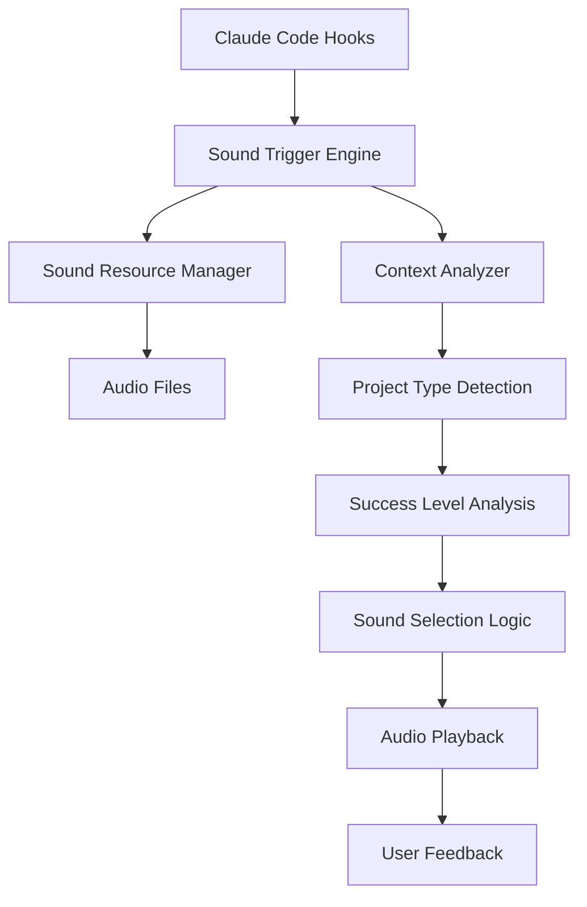

# 项目完成声音系统设计 / Project Completion Sound System Design

## 系统架构 / System Architecture

### 总体设计理念 / Overall Design Philosophy

#### 中文设计理念
基于 Claude Code Hooks 机制，创建一个智能的声音反馈系统，在项目完成、任务成功、系统状态变化时提供即时的听觉反馈，增强开发体验和工作满足感。

#### English Design Philosophy
Based on Claude Code Hooks mechanism, create an intelligent sound feedback system that provides instant auditory feedback on project completion, task success, and system state changes, enhancing development experience and work satisfaction.

### 系统组件 / System Components

---

## 声音分类体系 / Sound Classification System

### 基础声音类别 / Basic Sound Categories

#### 1. 项目完成声音 / Project Completion Sounds

**成功等级分类 / Success Level Classification:**

| 等级 / Level | 触发条件 / Trigger Condition | 声音特征 / Sound Characteristics |
|-------------|----------------------------|--------------------------------|
| 🎯 **重大成功** / Major Success | 大型项目完成、里程碑达成 | 庆祝音乐、铃声组合 |
| ✅ **常规完成** / Regular Completion | 普通任务完成、功能实现 | 清脆提示音、和弦 |
| 🔧 **小任务完成** / Minor Task | 文件保存、配置更新 | 简短提示音 |

#### 2. 错误和警告声音 / Error and Warning Sounds

| 类型 / Type | 场景 / Scenario | 声音设计 / Sound Design |
|------------|-----------------|----------------------|
| ❌ **错误** / Error | 编译失败、测试失败 | 低沉警告音 |
| ⚠️ **警告** / Warning | 代码质量问题、安全提醒 | 中性提醒音 |
| 🔄 **重试** / Retry | 自动重试、等待处理 | 循环渐进音 |

#### 3. 系统状态声音 / System Status Sounds

| 状态 / Status | 描述 / Description | 音效 / Sound Effect |
|--------------|-------------------|-------------------|
| 🚀 **启动** / Startup | 系统、项目启动 | 上升音阶 |
| 💤 **待机** / Standby | 系统空闲、等待输入 | 柔和背景音 |
| 🔌 **连接** / Connection | MCP服务连接、网络连接 | 连接确认音 |

---

## 技术实现方案 / Technical Implementation

### 核心声音引擎 / Core Sound Engine

<function_calls>
<invoke name="TodoWrite">
<parameter name="todos">[{"id": "1", "content": "\u8bbe\u8ba1\u9879\u76ee\u5b8c\u6210\u58f0\u97f3\u7cfb\u7edf\u67b6\u6784", "status": "completed"}, {"id": "2", "content": "\u521b\u5efa\u58f0\u97f3\u8d44\u6e90\u548c\u914d\u7f6e\u6587\u4ef6", "status": "in_progress"}, {"id": "3", "content": "\u5b9e\u73b0Hook\u96c6\u6210\u7684\u58f0\u97f3\u89e6\u53d1\u673a\u5236", "status": "pending"}, {"id": "4", "content": "\u6dfb\u52a0\u591a\u573a\u666f\u58f0\u97f3\u63d0\u793a\u652f\u6301", "status": "pending"}, {"id": "5", "content": "\u521b\u5efa\u58f0\u97f3\u7cfb\u7edf\u914d\u7f6e\u548c\u6d4b\u8bd5\u5de5\u5177", "status": "pending"}]