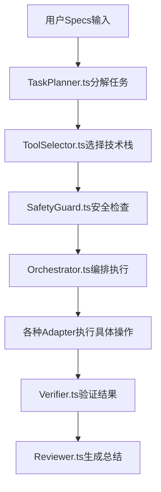

# 项目开发工具的规范和原理

基于LaunchX智链平台的开发实践，整理出现代AI驱动项目的开发工具规范和技术决策原理。

---

## 🎯 基于Specs驱动的技术栈决策框架

基于**Specs生成 + 上下文工程 + RL管理收敛**的产品理念，我们需要构建一个**动态适应性技术栈**，而不是固定的技术选型。

### 核心决策逻辑

#### 1. **Specs驱动的技术栈映射**
```typescript
interface TechStackSpec {
  // 用户需求规格
  userRequirements: {
    performance: 'low' | 'medium' | 'high' | 'realtime';
    scalability: 'startup' | 'growth' | 'enterprise' | 'global';
    complexity: 'simple' | 'moderate' | 'complex' | 'expert';
    timeline: 'prototype' | 'mvp' | 'production' | 'enterprise';
  };
  
  // 技术约束
  constraints: {
    budget: number;
    teamSize: number;
    expertiseLevel: string[];
    complianceRequirements: string[];
  };
  
  // 自动推荐的技术栈
  recommendedStack: TechStack;
  confidence: number; // RL收敛置信度
}
```

#### 2. **上下文工程的技术栈决策矩阵**

##### 前端技术栈决策树
```
用户Specs分析 → 交互复杂度判断
├── 简单 → Next.js + React
├── 中等 → Next.js + TypeScript + Zustand
├── 复杂 → Next.js + TypeScript + Redux Toolkit
└── 实时协作 → Next.js + Socket.io + Zustand

性能要求判断
├── 标准 → Tailwind CSS
├── 高性能 → Tailwind + Framer Motion
└── 企业级 → Tailwind + Design System
```

##### 后端技术栈决策树
```
Specs分析 → 并发需求判断
├── 低 → FastAPI + SQLite
├── 中 → FastAPI + PostgreSQL
├── 高 → FastAPI + PostgreSQL + Redis
└── 极高 → FastAPI + PostgreSQL + Redis + 消息队列

AI集成需求判断
├── 基础 → OpenAI SDK
├── 工作流 → LangChain + LangGraph
└── 多Agent → LangGraph + CopilotKit
```

---

## 📋 智能技术栈推荐系统

### 1. **基于Specs的自动推荐引擎**
```python
class TechStackRecommendationEngine:
    def __init__(self):
        self.decision_tree = self._load_decision_tree()
        self.rl_model = self._load_rl_model()
        
    def recommend_stack(self, specs: UserSpecs) -> TechStackRecommendation:
        # 1. 基于规则的初始推荐
        base_recommendation = self._rule_based_recommend(specs)
        
        # 2. RL模型优化
        optimized_stack = self.rl_model.optimize(
            base_recommendation, 
            specs.context
        )
        
        # 3. 置信度评估
        confidence = self._calculate_confidence(specs, optimized_stack)
        
        return TechStackRecommendation(
            frontend=optimized_stack.frontend,
            backend=optimized_stack.backend,
            database=optimized_stack.database,
            deployment=optimized_stack.deployment,
            confidence=confidence,
            reasoning=self._generate_reasoning(specs, optimized_stack)
        )
```

### 2. **上下文工程的技术栈适应策略**

#### 前端上下文适应
```typescript
// 根据用户行为动态调整技术选型
class FrontendContextEngine {
  adaptTechStack(userBehavior: UserBehavior, currentStack: FrontendStack) {
    const adaptations = [];
    
    // 用户大量使用实时功能 → 升级到WebSocket
    if (userBehavior.realtimeUsage > 0.3) {
      adaptations.push({
        component: 'communication',
        upgrade: 'Socket.io + React Query',
        reason: '实时交互需求高'
      });
    }
    
    // 用户设备性能较低 → 优化渲染策略
    if (userBehavior.devicePerformance < 0.5) {
      adaptations.push({
        component: 'rendering',
        optimize: 'React.lazy + Suspense',
        reason: '设备性能优化'
      });
    }
    
    return adaptations;
  }
}
```

#### 后端上下文适应
```python
class BackendContextEngine:
    def adapt_architecture(self, usage_patterns: UsagePatterns, current_arch: BackendArch):
        adaptations = []
        
        # 请求量激增 → 自动扩容策略
        if usage_patterns.request_volume > self.threshold:
            adaptations.append({
                'component': 'scaling',
                'action': 'horizontal_scaling',
                'config': {'min_instances': 2, 'max_instances': 10}
            })
        
        # AI调用频繁 → 缓存策略优化
        if usage_patterns.ai_call_frequency > 0.7:
            adaptations.append({
                'component': 'ai_cache',
                'action': 'enable_semantic_cache',
                'config': {'cache_ttl': 3600, 'similarity_threshold': 0.8}
            })
            
        return adaptations
```

---

## 🔄 RL收敛的技术栈管理

### 1. **技术栈性能反馈循环**
```python
class TechStackRLManager:
    def __init__(self):
        self.performance_metrics = PerformanceTracker()
        self.user_satisfaction = SatisfactionTracker()
        self.cost_efficiency = CostTracker()
        
    def collect_feedback(self, stack_config: TechStack, time_window: int):
        return {
            'performance': self.performance_metrics.get_scores(time_window),
            'user_satisfaction': self.user_satisfaction.get_scores(time_window),
            'cost_efficiency': self.cost_efficiency.get_scores(time_window),
            'developer_productivity': self._measure_dev_productivity(),
            'maintenance_burden': self._measure_maintenance_cost()
        }
    
    def update_recommendations(self, feedback: FeedbackData):
        # 基于反馈更新推荐算法权重
        reward = self._calculate_reward(feedback)
        self.rl_model.update(reward)
        
        # 动态调整技术栈推荐策略
        self._update_decision_tree(feedback)
```

### 2. **智能技术债务管理**
```typescript
interface TechDebtManagement {
  // 技术债务自动识别
  detectTechDebt(): TechDebtIssue[];
  
  // 基于业务优先级自动排序
  prioritizeByBusinessImpact(debts: TechDebtIssue[]): PrioritizedDebt[];
  
  // 自动生成重构建议
  generateRefactoringPlan(debt: TechDebtIssue): RefactoringPlan;
  
  // RL优化重构收益
  optimizeRefactoringROI(plans: RefactoringPlan[]): OptimizedPlan[];
}
```

---

## 🛠️ 具体技术栈推荐矩阵

### **基础配置** (适合MVP/原型)
```json
{
  "frontend": {
    "framework": "Next.js 15",
    "language": "TypeScript",
    "styling": "Tailwind CSS",
    "state": "useState + useContext",
    "ui_components": "shadcn/ui"
  },
  "backend": {
    "framework": "FastAPI",
    "language": "Python 3.12",
    "database": "SQLite → PostgreSQL (迁移路径)",
    "auth": "NextAuth.js",
    "ai_integration": "OpenAI SDK"
  },
  "deployment": {
    "hosting": "Vercel (前端) + Railway (后端)",
    "database": "Supabase",
    "monitoring": "基础日志"
  }
}
```

### **扩展配置** (适合成长期产品)
```json
{
  "frontend": {
    "framework": "Next.js 15",
    "language": "TypeScript",
    "styling": "Tailwind CSS + Design System",
    "state": "Zustand + React Query",
    "ui_components": "shadcn/ui + 自定义组件库",
    "performance": "React.memo + useMemo优化"
  },
  "backend": {
    "framework": "FastAPI",
    "language": "Python 3.12",
    "database": "PostgreSQL + Redis",
    "auth": "NextAuth.js + RBAC",
    "ai_integration": "LangChain + 自定义Agent",
    "api": "GraphQL (复杂查询) + REST"
  },
  "deployment": {
    "hosting": "Vercel + AWS Lambda",
    "database": "AWS RDS + ElastiCache",
    "monitoring": "Datadog + Sentry",
    "ci_cd": "GitHub Actions"
  }
}
```

### **企业配置** (适合大规模应用)
```json
{
  "frontend": {
    "framework": "Next.js 15 + Micro-frontends",
    "language": "TypeScript",
    "styling": "Tailwind + 企业Design System",
    "state": "Redux Toolkit + RTK Query",
    "ui_components": "自研组件库",
    "performance": "代码分割 + CDN优化",
    "testing": "Jest + Playwright + Storybook"
  },
  "backend": {
    "framework": "FastAPI + 微服务架构",
    "language": "Python 3.12",
    "database": "PostgreSQL 集群 + Redis 集群",
    "auth": "OAuth2 + JWT + RBAC",
    "ai_integration": "LangGraph + 分布式Agent",
    "api": "GraphQL Federation + gRPC",
    "message_queue": "RabbitMQ / Apache Kafka"
  },
  "deployment": {
    "hosting": "Kubernetes + Docker",
    "database": "多区域部署 + 读写分离",
    "monitoring": "Prometheus + Grafana + Jaeger",
    "security": "WAF + DDoS防护 + 安全扫描"
  }
}
```

---

## 🎯 决策流程建议

### 1. **Specs收集阶段**
- 使用AI Agent深度理解用户需求
- 自动识别技术复杂度和性能要求
- 评估团队技术能力和时间约束

### 2. **技术栈推荐阶段** 
- 基于决策树生成初始推荐
- RL模型优化技术选型
- 提供多个方案供选择（保守/平衡/激进）

### 3. **实施监控阶段**
- 实时监控技术栈性能表现
- 收集用户反馈和开发者体验
- 自动识别需要优化的技术组件

### 4. **迭代优化阶段**
- 基于反馈数据调整推荐算法
- 提供自动化的技术栈升级路径
- 持续优化开发效率和用户体验

---

## 💡 开发工具规范

### 代码质量工具链
```bash
# 前端工具链
pnpm add -D eslint prettier typescript
pnpm add -D @typescript-eslint/parser @typescript-eslint/eslint-plugin
pnpm add -D tailwindcss-animate class-variance-authority

# 后端工具链  
pip install black isort mypy pylint
pip install pytest pytest-asyncio pytest-cov
pip install pre-commit husky

# 容器化工具
docker-compose up -d  # 本地开发环境
```

### 监控和可观测性
```yaml
# docker-compose.monitoring.yml
version: '3.8'
services:
  prometheus:
    image: prom/prometheus
    ports: ["9090:9090"]
  
  grafana:
    image: grafana/grafana
    ports: ["3001:3000"]
    
  jaeger:
    image: jaegertracing/all-in-one
    ports: ["16686:16686"]
```

### CI/CD Pipeline
```yaml
# .github/workflows/deploy.yml
name: Deploy Pipeline
on:
  push:
    branches: [main]

jobs:
  test:
    runs-on: ubuntu-latest
    steps:
      - uses: actions/checkout@v3
      - name: Run Tests
        run: |
          pnpm test
          python -m pytest
  
  deploy:
    needs: test
    runs-on: ubuntu-latest
    steps:
      - name: Deploy to Production
        run: |
          docker build -t app .
          docker push registry.com/app
```

---

## 🎨 基于a2aink项目的开发者最佳实践

### 编程风格特征
```json
{
  "programming_style": {
    "language_approach": "双语混合编程 - 英文代码+中文注释",
    "naming_convention": "英文函数名，语义化变量命名",
    "type_safety": "100%类型覆盖，严格类型检查",
    "error_handling": "多层次防御性编程策略",
    "documentation": "分层次Markdown文档体系"
  }
}
```

### 代码质量标准示例
```typescript
// 类型安全示例
interface Expert {
    id: string;
    name: string;
    status: 'idle' | 'working' | 'completed' | 'error'; // 严格联合类型
    skills: string[];
    priority: number;
    node: string;
}

// 错误处理模式
async def perform_search(query_item):
    try:
        result = await tavily_client.search(query=query_item.query)
        return result
    except Exception as e:
        logger.error(f"搜索失败 '{query_item.query}': {str(e)}")
        return []  # 优雅降级，避免崩溃

// 异步并发模式
search_tasks = [perform_search(query) for query in sub_queries]
search_responses = await asyncio.gather(*search_tasks)
```

### 文档编写规范
```python
INSTRUCTION = """
您是一位专业的需求分析与调研规划师。

# 主要职责

## 1. 需求理解与分析
- 仔细分析需求收集助手与用户的完整对话内容
- 识别用户的明确需求和隐含需求  

## 2. 场景梳理与澄清
- 还原用户的真实业务场景和使用环境
- 分析涉及的关键角色、流程和系统
"""

def print_plan_structure(plan: Plan) -> None:
    """
    结构化打印Plan对象到命令行
    
    Args:
        plan: Plan对象，包含计划的详细信息
    """
    print("📋 生成的调研计划")  # 使用emoji增强可读性
```

---

## 🚀 Coding Agent架构集成建议

基于Coding Agent架构分析，我们发现其状态机驱动模式与LaunchX的六角色协作完美契合。

### **核心集成价值**
1. **状态机对齐**: `Discovery → Planning → Execution → Verification → Summarization` 完美映射到 `Alex → Leo → David → Kula → 整体总结`
2. **Policy-Based决策**: 解决技术栈自动选择问题
3. **Tools适配器层**: 解决多Agent身份识别问题

### **立即实施建议** (优先级排序)

#### **高优先级** (立即实施)
```python
# 1. TaskPlanner.ts - 集成到现有workflow
class EnhancedWorkflowAgent(WorkflowAgent):
    def __init__(self):
        super().__init__()
        self.task_planner = TaskPlanner()      # Specs到任务分解
        self.tool_selector = ToolSelector()    # 技术栈自动选择
        self.safety_guard = SafetyGuard()      # 安全策略

# 2. 解决多Agent身份识别
interface EnhancedTaskState {
  currentAgent: 'orchestrator' | 'planner' | 'executor' | 'verifier';
  agentContext: {
    node: string;           # 来自StateMachine.ts
    expert_info: Expert;    # 来自EXPERTS_LIST
    tools_used: string[];   # 来自ToolSelector.ts
    safety_checks: boolean; # 来自SafetyGuard.ts
  };
}

# 3. EventBus集成CopilotKit
interface AgentEvent {
  agent_id: string;        # alex, kula, leo, david
  node: string;           # coordinator, planner, researcher, reporter  
  event_type: 'start' | 'progress' | 'complete' | 'error';
  context: {
    expert_info: Expert;
    current_task: string;
    tools_used: string[];
  };
}
```

#### **中优先级** (1个月内)
- **SafetyGuard.ts**: 增加代码安全检查和白名单/黑名单机制
- **Cache.ts**: 优化AI调用成本，TTL缓存工具结果
- **Verifier.ts**: 自动化测试和验证流程

#### **长期规划** (3个月内)
- **ParallelRunner.ts**: 多工具并发执行优化
- **GitManager.ts**: 完整的Git工作流自动化
- **PRManager.ts**: 自动化Pull Request管理

### **技术栈选择自动化流程**


---

**核心理念**: 这样的技术栈决策框架既保持了**灵活性**（基于Specs动态推荐），又具备了**学习能力**（RL收敛优化），同时通过**上下文工程**确保技术选型始终与业务需求保持同步。Coding Agent架构的集成将进一步提升自动化水平和开发效率。

**最后更新**: 2025年8月14日  
**适用项目**: LaunchX智链平台及类似AI驱动的企业级应用