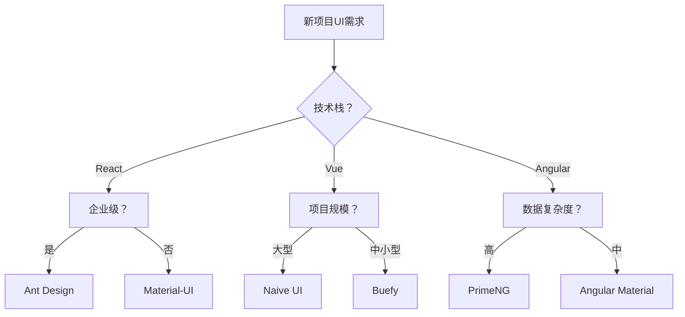

# awesome-ui-component-library - UI组件库集合

> **主要Repository**: https://github.com/anubhavsrivastava/awesome-ui-component-library  
> **官方网站**: https://anubhavsrivastava.github.io/awesome-ui-component-library/  
> **核心定位**: 跨框架UI组件库的精选集合，支持React、Vue、Angular等主流框架  
> **维护者**: anubhavsrivastava & 社区贡献者  
> **最后更新**: 2025-01-14

## 🎯 使用场景标识

### 🔧 Hook应用场景
- **UI组件选择**: 项目初始化时自动推荐合适的组件库
- **设计系统更新**: 组件库版本更新时触发兼容性检查
- **代码生成**: 基于选定组件库自动生成模板代码

### 🤖 Agent推荐场景  
- **技术选型**: 根据项目需求智能推荐最佳UI组件库
- **原型开发**: 快速搭建UI界面的组件选择
- **代码重构**: 组件库迁移和升级的自动化处理

## 📁 仓库分析 - 主要UI组件库

### 🔄 跨框架库 (Cross-Framework)

#### **AgnosticUI** 
- **特点**: 可访问的组件原语，支持React、Vue 3、Angular、Svelte
- **使用场景**: 多框架项目、组件一致性要求高的团队
- **Hook时机**: 新框架支持需求时
- **Agent建议**: 适合LaunchX智链平台的多技术栈整合

### ⚛️ React生态系统

#### **Ant Design React**
- **定位**: 企业级UI设计语言和React实现
- **核心特性**: 
  - 完整的设计规范体系
  - 60+高质量组件
  - TypeScript支持
  - 国际化支持
- **适用场景**: 
  - 企业管理后台
  - B端产品开发
  - 快速原型开发
- **LaunchX集成**: 适合智链平台的管理界面

#### **Atlaskit**
- **来源**: Atlassian官方React UI套件
- **遵循**: Atlassian Design Guidelines (ADG)
- **特色**: 企业级协作工具的UI标准
- **使用建议**: 团队协作功能开发

#### **Material-UI (MUI)**
- **设计理念**: Google Material Design
- **生态完整性**: 
  - 组件库 + 设计系统
  - 主题定制能力
  - 性能优化
- **Hook集成**: 主题切换时的自动适配

### 🟢 Vue.js生态系统

#### **Bootstrap Vue**  
- **基础**: Bootstrap 4 + Vue.js
- **特色**: 
  - 完整的Bootstrap组件实现
  - WAI-ARIA可访问性标记
  - 响应式网格系统
- **适用**: 快速开发、原型验证
- **Agent场景**: 快速UI搭建的首选

#### **Buefy**
- **基于**: Bulma CSS框架
- **特点**: 轻量级、简洁设计
- **优势**: 
  - 无jQuery依赖
  - 模块化组件
  - 灵活的CSS customization
- **使用时机**: 轻量级项目、移动端优先

#### **Naive UI**
- **版本**: Vue 3专用
- **特色**: 
  - TypeScript完全支持
  - 可定制主题系统
  - 60+组件覆盖
- **推荐**: Vue 3新项目的标准选择

### 🔺 Angular生态系统

#### **Angular Material**
- **官方支持**: Angular团队维护
- **设计基础**: Material Design 2.0
- **集成度**: 与Angular生态完美融合
- **企业级特性**: 
  - CDK (Component Dev Kit)
  - 可访问性优先
  - 国际化支持

#### **Clarity**
- **来源**: VMware开源设计系统
- **包含**: UX指南 + HTML/CSS框架 + Angular组件
- **特色**: 
  - 企业级设计系统
  - 数据密集型应用优化
  - 完整的设计Token系统

#### **PrimeNG**
- **组件数量**: 60+丰富UI组件
- **主题系统**: 多种预设主题
- **特色功能**: 
  - 数据表格高级功能
  - 图表组件集成
  - 表单验证组件

## 🎨 设计系统选择策略

### 项目类型匹配

#### **企业管理系统**
```markdown
推荐: Ant Design (React) / Angular Material / Clarity
理由: 完整的设计规范，企业级功能完善
Hook触发: 管理模块创建时自动应用企业级组件
```

#### **移动端应用** 
```markdown
推荐: Buefy (Vue) / Material-UI (React)
理由: 移动端优化，响应式设计优秀
Agent建议: 根据目标平台自动选择适配方案
```

#### **快速原型开发**
```markdown
推荐: Bootstrap Vue / Ant Design
理由: 组件丰富，快速搭建能力强
Hook场景: 原型创建时自动引入快速开发模板
```

### LaunchX智链平台集成建议

#### **主平台界面**
- **推荐**: Ant Design Pro (React) 或 Angular Material
- **理由**: 符合企业级产品定位，组件覆盖全面
- **Hook配置**: 
  ```bash
  # 新模块创建时自动配置UI组件库
  /ui-setup --framework=react --library=antd
  ```

#### **客户交互界面**
- **推荐**: Material-UI 或 Naive UI  
- **理由**: 用户体验优先，美观度高
- **Agent场景**: 根据用户画像推荐合适的UI风格

#### **移动端界面**
- **推荐**: Vant (Vue) 或 Ant Design Mobile
- **理由**: 移动端专门优化，触控体验佳

## 🔧 技术选型决策树

### 框架选择


### Hook自动化流程
```bash
# 项目初始化Hook
if [[ $PROJECT_TYPE == "enterprise" ]]; then
  setup_ui_library "antd"
elif [[ $PROJECT_TYPE == "mobile" ]]; then
  setup_ui_library "vant"
else
  setup_ui_library "material-ui"
fi
```

## 🚀 Agent工作流集成

### 1. **UI选型Agent**
```markdown
功能: 根据项目需求自动推荐UI组件库
输入: 项目类型、技术栈、设计要求
输出: 最佳匹配的组件库 + 配置建议
触发: 新项目创建或UI重构需求
```

### 2. **组件生成Agent** 
```markdown
功能: 基于选定组件库生成标准化组件模板
集成: 与代码生成工具链配合
Hook时机: 新组件需求提出时
```

### 3. **主题适配Agent**
```markdown
功能: 根据设计稿自动配置组件库主题
输入: 设计Token、品牌色彩方案
输出: 组件库主题配置文件
```

## 📊 性能和维护考虑

### 打包大小优化
- **Tree Shaking**: 支持按需引入的组件库优先
- **CDN支持**: 考虑CDN加载的组件库
- **懒加载**: 支持组件级懒加载的方案

### 维护性评估  
- **更新频率**: 定期更新、bug修复及时的库
- **社区活跃度**: GitHub stars、issues响应速度
- **文档完善度**: API文档、示例代码质量

### LaunchX特定需求
- **多语言支持**: 国际化需求的组件库
- **主题定制**: 品牌色彩适配能力
- **响应式设计**: 多设备适配要求

## 🔗 扩展资源链接

### 官方相关仓库
- **jonisar/awesome-ui-components**: React、Vue、Angular的awesome组件列表
- **brillout/awesome-react-components**: React组件专门集合
- **vuejs/awesome-vue**: Vue.js生态awesome列表

### 设计系统参考
- **Design Systems Repo**: 设计系统最佳实践
- **Component Gallery**: 组件设计灵感来源

---

**🔗 相关工具链接**:
- [[awesome-claude-code - Claude代码增强工具集]]
- [[git-mcp - Git版本控制MCP集成]]  
- [[fastapi-mcp - FastAPI MCP服务器]]
- [[mcp-use - MCP使用工具和示例]]

**📝 更新日志**: 
- 2025-01-14: 初始文档创建，分析主流UI组件库和选型策略
- 包含LaunchX智链平台的具体集成建议和Hook配置方案