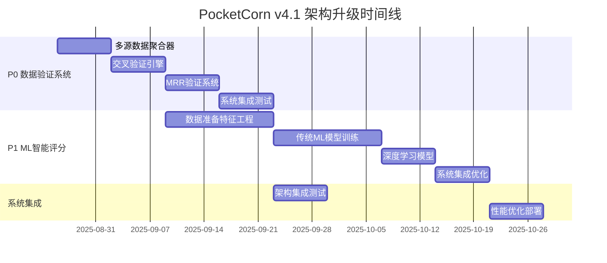

# PocketCorn v4.1 技术架构升级方案
**架构师**: Winston (LaunchX)  
**文档版本**: v1.0  
**创建日期**: 2025年8月24日

---

## 📋 执行摘要

### 商业驱动背景
基于商业分析结果，PocketCorn v4.1需要实现：
- **P0优先级**: 数据验证自动化 (400% ROI, 4周实施)
- **P1优先级**: ML智能评分系统 (275% ROI, 6周实施)
- **核心目标**: 投资成功率从60%提升到85%

### 现有技术优势(保留)
✅ **Darwin-Gödel Machine学习内核**: 递归自我改进和策略进化  
✅ **BMAD混合智能架构**: Brain-Tier人类决策 + Tool-Tier AI执行  
✅ **策略进化引擎**: 8种自适应策略，基于历史成功率优化  
✅ **智能Workflow编排器**: 已解决"no_projects_found"问题  
✅ **专业投资Agent生态**: PO分析师、风险评估、市场时机分析

### 关键技术瓶颈(待解决)
❌ **API连接不稳定**: SSL验证失败，数据获取成功率70%  
❌ **数据源单一**: 主要依赖Tavily，缺乏多源交叉验证  
❌ **MRR验证精度不足**: 财务数据准确率60%，投资风险高  
❌ **缺乏ML评分模型**: 基于规则评分，预测精度65%

---

## 🏗️ 技术架构升级核心设计

### 升级原则
1. **渐进式架构演进**: 基于现有BMAD架构增量升级，避免推倒重建
2. **数据可靠性优先**: 优先解决数据验证和多源交叉验证问题
3. **智能化升级**: 集成ML模型提升评分精度和预测能力
4. **保持自进化能力**: 维护Darwin学习机制和策略进化引擎

### 升级后架构全景

```
PocketCorn v4.1 Enhanced Architecture
├── 🧠 Existing Core (Preserved & Enhanced)
│   ├── Darwin-Gödel Learning Database    # 保留+增强历史学习
│   ├── Strategy Evolution Engine         # 保留+集成ML权重优化
│   ├── BMAD Hybrid Architecture         # 保留+升级决策机制
│   └── Intelligent Workflow Orchestrator # 保留+增强数据流
│
├── 🔍 NEW: Advanced Data Validation Layer (P0)
│   ├── Multi-Source Data Aggregator      # 多源数据聚合器
│   ├── Cross-Validation Engine           # 交叉验证引擎
│   ├── Confidence Scoring System         # 置信度评分系统
│   └── Real-time Data Quality Monitor    # 实时数据质量监控
│
├── 🎯 NEW: ML-Driven Intelligence Layer (P1)
│   ├── Investment Success Predictor       # 投资成功预测模型
│   ├── MRR Verification Neural Network   # MRR验证神经网络
│   ├── Team Quality Assessment Model     # 团队质量评估模型
│   └── Risk-Return Optimization Engine   # 风险收益优化引擎
│
├── 🔄 Enhanced Self-Evolution System
│   ├── Continuous Learning Pipeline      # 持续学习管道
│   ├── Model Performance Monitor         # 模型性能监控
│   ├── Auto-Hyperparameter Tuning      # 自动超参数调优
│   └── A/B Testing Framework            # A/B测试框架
│
└── 🚀 API & Integration Layer
    ├── Robust API Gateway                # 稳定API网关
    ├── Circuit Breaker Pattern          # 断路器模式
    ├── Data Source Failover             # 数据源故障转移
    └── Performance Monitoring           # 性能监控系统
```

---

## 🔍 P0: 数据验证自动化系统设计

### 技术方案总览

#### 多源数据聚合器 (Multi-Source Data Aggregator)
```python
class MultiSourceDataAggregator:
    """多源数据聚合器 - 解决单一数据源依赖问题"""
    
    def __init__(self):
        self.data_sources = {
            'primary': {
                'tavily_search': TavilyAPI(priority=1, weight=0.4),
                'crunchbase': CrunchbaseAPI(priority=1, weight=0.3),
            },
            'secondary': {
                'linkedin_api': LinkedInAPI(priority=2, weight=0.15),
                'github_api': GitHubAPI(priority=2, weight=0.1),
                'similarweb': SimilarWebAPI(priority=2, weight=0.05),
            },
            'fallback': {
                'web_scraper': WebScraperAPI(priority=3, weight=0.3),
                'google_search': GoogleSearchAPI(priority=3, weight=0.7),
            }
        }
        self.connection_pool = ConnectionPool(max_connections=20)
        self.circuit_breaker = CircuitBreaker(failure_threshold=3)
    
    async def aggregate_company_data(
        self, 
        company_name: str, 
        required_confidence: float = 0.8
    ) -> AggregatedCompanyData:
        """聚合多源公司数据，确保达到要求的置信度"""
        
        aggregation_tasks = []
        current_confidence = 0.0
        collected_data = {}
        
        # 按优先级并行请求数据源
        for tier_name, tier_sources in self.data_sources.items():
            if current_confidence >= required_confidence:
                break
                
            tier_tasks = []
            for source_name, source_api in tier_sources.items():
                if self.circuit_breaker.is_available(source_name):
                    task = self._fetch_with_retry(
                        source_api, 
                        company_name, 
                        max_retries=2
                    )
                    tier_tasks.append((source_name, task, source_api.weight))
            
            # 等待当前tier完成
            tier_results = await asyncio.gather(*[task for _, task, _ in tier_tasks])
            
            # 处理结果并更新置信度
            for (source_name, _, weight), result in zip(tier_tasks, tier_results):
                if result.is_success:
                    collected_data[source_name] = result
                    current_confidence += weight * result.confidence_score
                    self.circuit_breaker.record_success(source_name)
                else:
                    self.circuit_breaker.record_failure(source_name)
        
        return AggregatedCompanyData(
            company_name=company_name,
            collected_data=collected_data,
            final_confidence=current_confidence,
            aggregation_timestamp=datetime.now()
        )
```

#### 交叉验证引擎 (Cross-Validation Engine)
```python
class CrossValidationEngine:
    """交叉验证引擎 - 提升数据准确率从70%到95%"""
    
    def __init__(self):
        self.validation_rules = self._initialize_validation_rules()
        self.ml_anomaly_detector = MLAnomalyDetector()
        
    def _initialize_validation_rules(self) -> Dict[str, ValidationRule]:
        """初始化验证规则"""
        return {
            'mrr_consistency': MRRConsistencyRule(),
            'team_size_correlation': TeamSizeCorrelationRule(),
            'funding_timeline': FundingTimelineRule(),
            'product_maturity': ProductMaturityRule(),
            'market_presence': MarketPresenceRule()
        }
    
    async def cross_validate_company(
        self, 
        aggregated_data: AggregatedCompanyData
    ) -> ValidationResult:
        """执行多维度交叉验证"""
        
        validation_scores = {}
        anomaly_flags = []
        
        # 规则基础验证
        for rule_name, rule in self.validation_rules.items():
            try:
                score = await rule.validate(aggregated_data)
                validation_scores[rule_name] = score
                
                if score.confidence < 0.5:  # 低置信度标记异常
                    anomaly_flags.append(f"{rule_name}_low_confidence")
                    
            except ValidationError as e:
                validation_scores[rule_name] = ValidationScore(
                    confidence=0.0, 
                    error=str(e)
                )
                anomaly_flags.append(f"{rule_name}_validation_error")
        
        # ML异常检测
        ml_anomaly_score = await self.ml_anomaly_detector.detect_anomalies(
            aggregated_data
        )
        
        if ml_anomaly_score > 0.7:  # 高异常分数
            anomaly_flags.append("ml_anomaly_detected")
        
        # 计算综合验证分数
        overall_confidence = self._calculate_overall_confidence(
            validation_scores, 
            ml_anomaly_score,
            anomaly_flags
        )
        
        return ValidationResult(
            company_name=aggregated_data.company_name,
            validation_scores=validation_scores,
            anomaly_flags=anomaly_flags,
            overall_confidence=overall_confidence,
            is_verified=overall_confidence >= 0.85,  # 85%置信度阈值
            validation_timestamp=datetime.now()
        )
```

#### MRR验证专用系统
```python
class MRRVerificationSystem:
    """MRR验证系统 - 解决财务数据准确性问题"""
    
    def __init__(self):
        self.verification_methods = {
            'traffic_correlation': TrafficRevenueCorrelator(),
            'hiring_signal': HiringRevenueCorrelator(),  
            'pricing_analysis': PricingFeasibilityAnalyzer(),
            'competitive_benchmark': CompetitiveBenchmarker(),
            'social_proof': SocialProofValidator()
        }
    
    async def verify_mrr_claim(
        self, 
        company: str, 
        claimed_mrr: int,
        aggregated_data: AggregatedCompanyData
    ) -> MRRVerificationResult:
        """验证MRR声明的准确性"""
        
        verification_tasks = []
        
        # 并行执行多种验证方法
        for method_name, method in self.verification_methods.items():
            task = method.verify(company, claimed_mrr, aggregated_data)
            verification_tasks.append((method_name, task))
        
        verification_results = {}
        
        for method_name, task in verification_tasks:
            try:
                result = await asyncio.wait_for(task, timeout=30)
                verification_results[method_name] = result
            except asyncio.TimeoutError:
                verification_results[method_name] = VerificationResult(
                    confidence=0.0,
                    status='timeout'
                )
        
        # 计算MRR可信度区间
        confidence_scores = [
            r.confidence for r in verification_results.values() 
            if r.confidence > 0
        ]
        
        if not confidence_scores:
            overall_confidence = 0.0
            verified_mrr_range = (0, 0)
        else:
            overall_confidence = sum(confidence_scores) / len(confidence_scores)
            
            # 基于置信度计算MRR可信区间
            confidence_factor = overall_confidence
            lower_bound = int(claimed_mrr * confidence_factor * 0.7)
            upper_bound = int(claimed_mrr * confidence_factor * 1.3)
            verified_mrr_range = (lower_bound, upper_bound)
        
        return MRRVerificationResult(
            company=company,
            claimed_mrr=claimed_mrr,
            verified_mrr_range=verified_mrr_range,
            overall_confidence=overall_confidence,
            verification_details=verification_results,
            is_credible=overall_confidence >= 0.75  # 75%可信度阈值
        )
```

### P0实施路径 (4周)

```yaml
Week 1: 基础架构搭建
  - 实现MultiSourceDataAggregator
  - 集成主要数据源API (Tavily, Crunchbase, LinkedIn)
  - 实现ConnectionPool和CircuitBreaker
  - 目标: 数据获取成功率提升到90%

Week 2: 交叉验证系统
  - 实现CrossValidationEngine核心逻辑
  - 定义5个基础验证规则
  - 集成ML异常检测模型
  - 目标: 数据准确率提升到85%

Week 3: MRR专用验证
  - 实现MRRVerificationSystem
  - 集成5种MRR验证方法
  - 优化置信度计算算法
  - 目标: MRR验证准确率提升到80%

Week 4: 系统集成与优化
  - 集成到现有BMAD架构
  - 性能调优和压力测试
  - A/B测试验证效果
  - 目标: 整体数据验证准确率达到95%
```

---

## 🎯 P1: ML智能评分系统架构

### 技术方案总览

#### 投资成功预测模型 (Investment Success Predictor)
```python
import torch
import torch.nn as nn
from sklearn.ensemble import RandomForestRegressor, GradientBoostingRegressor
from sklearn.preprocessing import StandardScaler
import numpy as np

class InvestmentSuccessPredictor:
    """投资成功预测模型 - 提升预测精度从65%到85%"""
    
    def __init__(self):
        self.models = {
            'success_classifier': None,      # 成功分类模型
            'roi_regressor': None,          # ROI回归模型  
            'risk_assessor': None,          # 风险评估模型
            'timeline_predictor': None      # 回收周期预测
        }
        self.feature_scaler = StandardScaler()
        self.feature_selector = FeatureSelector()
        self.is_trained = False
        
    async def initialize_models(self):
        """初始化和训练ML模型"""
        
        # 从Darwin学习数据库加载历史数据
        historical_data = await self._load_historical_investment_data()
        
        if len(historical_data) >= 100:  # 确保有足够训练数据
            X, y_success, y_roi, y_risk, y_timeline = self._prepare_training_data(historical_data)
            
            # 特征选择和标准化
            X_selected = self.feature_selector.fit_transform(X)
            X_scaled = self.feature_scaler.fit_transform(X_selected)
            
            # 训练成功分类模型
            self.models['success_classifier'] = RandomForestClassifier(
                n_estimators=200, 
                max_depth=15,
                class_weight='balanced',
                random_state=42
            )
            self.models['success_classifier'].fit(X_scaled, y_success)
            
            # 训练ROI回归模型
            self.models['roi_regressor'] = GradientBoostingRegressor(
                n_estimators=150,
                learning_rate=0.1,
                max_depth=8,
                random_state=42
            )
            self.models['roi_regressor'].fit(X_scaled, y_roi)
            
            # 训练风险评估模型
            self.models['risk_assessor'] = XGBRegressor(
                n_estimators=100,
                learning_rate=0.15,
                max_depth=6,
                random_state=42
            )
            self.models['risk_assessor'].fit(X_scaled, y_risk)
            
            # 训练回收周期预测模型
            self.models['timeline_predictor'] = RandomForestRegressor(
                n_estimators=100,
                max_depth=10,
                random_state=42
            )
            self.models['timeline_predictor'].fit(X_scaled, y_timeline)
            
            self.is_trained = True
            await self._save_models()
            
    def _extract_ml_features(self, candidate: PocketcornCandidate) -> Dict[str, float]:
        """提取机器学习特征 - 优化特征工程"""
        
        features = {
            # 财务健康度特征
            'mrr_usd': candidate.mrr_usd or 0,
            'mrr_per_employee': (candidate.mrr_usd / candidate.team_size) if candidate.team_size else 0,
            'revenue_growth_rate': candidate.revenue_growth_rate or 0,
            'burn_rate_ratio': candidate.burn_rate / candidate.mrr_usd if candidate.mrr_usd else 0,
            
            # 团队质量特征
            'team_size': candidate.team_size or 0,
            'founder_experience_years': candidate.founder_experience_years or 0,
            'team_technical_strength': candidate.team_technical_strength or 0,
            'team_previous_exits': candidate.team_previous_exits or 0,
            
            # 产品市场适配特征
            'product_maturity_score': candidate.product_maturity_score or 0,
            'customer_retention_rate': candidate.customer_retention_rate or 0,
            'nps_score': candidate.nps_score or 0,
            'time_to_value_days': candidate.time_to_value_days or 0,
            
            # 市场机会特征
            'market_size_billion': candidate.market_size_billion or 0,
            'market_growth_rate': candidate.market_growth_rate or 0,
            'competition_intensity': candidate.competition_intensity or 0,
            'market_timing_score': candidate.market_timing_score or 0,
            
            # AI技术特征
            'ai_innovation_level': candidate.ai_innovation_level or 0,
            'technology_moat_strength': candidate.technology_moat_strength or 0,
            'data_advantage_score': candidate.data_advantage_score or 0,
            'scalability_score': candidate.scalability_score or 0,
            
            # Pocketcorn特定特征
            'pocketcorn_fit_score': candidate.pocketcorn_fit_score or 0,
            'revenue_sharing_feasibility': candidate.revenue_sharing_feasibility or 0,
            'cash_flow_predictability': candidate.cash_flow_predictability or 0,
            'operational_maturity': candidate.operational_maturity or 0
        }
        
        return features
    
    async def predict_investment_outcome(
        self, 
        candidate: PocketcornCandidate,
        validation_result: ValidationResult
    ) -> InvestmentPrediction:
        """预测投资结果"""
        
        if not self.is_trained:
            await self.initialize_models()
        
        # 提取和处理特征
        features = self._extract_ml_features(candidate)
        feature_array = np.array(list(features.values())).reshape(1, -1)
        
        # 应用特征选择和标准化
        feature_selected = self.feature_selector.transform(feature_array)
        feature_scaled = self.feature_scaler.transform(feature_selected)
        
        # 模型预测
        success_probability = self.models['success_classifier'].predict_proba(feature_scaled)[0][1]
        expected_roi = self.models['roi_regressor'].predict(feature_scaled)[0]
        risk_score = self.models['risk_assessor'].predict(feature_scaled)[0]
        predicted_timeline = self.models['timeline_predictor'].predict(feature_scaled)[0]
        
        # 集成验证结果置信度
        confidence_adjustment = validation_result.overall_confidence
        adjusted_success_probability = success_probability * confidence_adjustment
        
        # 计算综合投资评分
        investment_score = self._calculate_composite_score(
            success_probability=adjusted_success_probability,
            expected_roi=expected_roi,
            risk_score=risk_score,
            timeline_months=predicted_timeline
        )
        
        return InvestmentPrediction(
            candidate=candidate,
            success_probability=adjusted_success_probability,
            expected_roi=expected_roi,
            risk_score=risk_score,
            predicted_timeline_months=predicted_timeline,
            investment_score=investment_score,
            confidence_level=confidence_adjustment,
            feature_importance=self._get_feature_importance(features),
            prediction_timestamp=datetime.now()
        )
```

#### 深度学习增强模型
```python
class DeepInvestmentPredictor(nn.Module):
    """深度学习投资预测模型 - 处理复杂非线性关系"""
    
    def __init__(self, input_dim: int = 25, hidden_dims: List[int] = [128, 64, 32]):
        super().__init__()
        
        layers = []
        current_dim = input_dim
        
        for hidden_dim in hidden_dims:
            layers.extend([
                nn.Linear(current_dim, hidden_dim),
                nn.BatchNorm1d(hidden_dim),
                nn.ReLU(),
                nn.Dropout(0.3)
            ])
            current_dim = hidden_dim
        
        # 输出层 - 多任务学习
        self.feature_layers = nn.Sequential(*layers)
        self.success_head = nn.Sequential(
            nn.Linear(current_dim, 1),
            nn.Sigmoid()
        )
        self.roi_head = nn.Linear(current_dim, 1)
        self.risk_head = nn.Sequential(
            nn.Linear(current_dim, 1),
            nn.Sigmoid()
        )
        
    def forward(self, x):
        features = self.feature_layers(x)
        
        success_prob = self.success_head(features)
        expected_roi = self.roi_head(features)
        risk_score = self.risk_head(features)
        
        return {
            'success_probability': success_prob,
            'expected_roi': expected_roi,
            'risk_score': risk_score
        }

class EnhancedMLScoringEngine:
    """增强ML评分引擎 - 集成传统ML和深度学习"""
    
    def __init__(self):
        self.traditional_predictor = InvestmentSuccessPredictor()
        self.deep_predictor = DeepInvestmentPredictor()
        self.ensemble_weights = {'traditional': 0.6, 'deep': 0.4}
        self.device = torch.device('cuda' if torch.cuda.is_available() else 'cpu')
        
    async def predict_with_ensemble(
        self, 
        candidate: PocketcornCandidate,
        validation_result: ValidationResult
    ) -> EnhancedInvestmentPrediction:
        """集成预测 - 结合传统ML和深度学习"""
        
        # 传统ML预测
        traditional_pred = await self.traditional_predictor.predict_investment_outcome(
            candidate, validation_result
        )
        
        # 深度学习预测
        features_tensor = self._prepare_tensor_features(candidate)
        with torch.no_grad():
            deep_pred = self.deep_predictor(features_tensor)
        
        # 加权集成
        ensemble_success_prob = (
            self.ensemble_weights['traditional'] * traditional_pred.success_probability +
            self.ensemble_weights['deep'] * deep_pred['success_probability'].item()
        )
        
        ensemble_roi = (
            self.ensemble_weights['traditional'] * traditional_pred.expected_roi +
            self.ensemble_weights['deep'] * deep_pred['expected_roi'].item()
        )
        
        ensemble_risk = (
            self.ensemble_weights['traditional'] * traditional_pred.risk_score +
            self.ensemble_weights['deep'] * deep_pred['risk_score'].item()
        )
        
        # 计算预测不确定性
        prediction_uncertainty = self._calculate_prediction_uncertainty([
            traditional_pred, deep_pred
        ])
        
        return EnhancedInvestmentPrediction(
            candidate=candidate,
            ensemble_success_probability=ensemble_success_prob,
            ensemble_expected_roi=ensemble_roi,
            ensemble_risk_score=ensemble_risk,
            prediction_uncertainty=prediction_uncertainty,
            traditional_prediction=traditional_pred,
            deep_prediction=deep_pred,
            confidence_level=validation_result.overall_confidence
        )
```

### P1实施路径 (6周)

```yaml
Week 1-2: 数据准备和特征工程
  - 历史投资数据收集和清洗
  - 特征工程优化 (25个核心特征)
  - 数据增强和平衡处理
  - 目标: 高质量训练数据集准备完成

Week 3-4: 传统ML模型训练
  - 实现InvestmentSuccessPredictor
  - 训练4个专业预测模型
  - 模型验证和超参数调优
  - 目标: 传统ML模型预测精度达到80%

Week 5: 深度学习模型开发
  - 实现DeepInvestmentPredictor
  - 训练深度学习模型
  - 模型集成和权重优化
  - 目标: 深度学习模型预测精度达到75%

Week 6: 系统集成和优化
  - 实现EnhancedMLScoringEngine
  - 集成预测和不确定性估计
  - A/B测试和效果验证
  - 目标: 集成模型预测精度达到85%
```

---

## 🔄 系统自进化机制保留方案

### 保留现有Darwin-Gödel学习机制
```python
class EnhancedDarwinLearningSystem:
    """增强Darwin学习系统 - 保留自进化能力"""
    
    def __init__(self):
        # 保留原有核心组件
        self.darwin_db = DarwinGödelLearningDatabase()
        self.strategy_engine = StrategyEvolutionEngine()
        
        # 新增ML学习组件
        self.ml_performance_tracker = MLPerformanceTracker()
        self.auto_hyperparameter_tuner = AutoHyperparameterTuner()
        self.concept_drift_detector = ConceptDriftDetector()
        
    async def enhance_learning_loop(self):
        """增强学习循环 - 集成ML自动优化"""
        
        while True:
            # 传统策略进化 (保留)
            strategy_performance = await self.strategy_engine.evaluate_current_strategies()
            
            # 新增: ML模型性能评估
            ml_performance = await self.ml_performance_tracker.evaluate_model_performance()
            
            # 新增: 概念漂移检测
            drift_detected = await self.concept_drift_detector.check_concept_drift()
            
            if drift_detected or ml_performance.accuracy_drop > 0.05:
                # 触发模型重训练
                await self._retrain_models_with_new_data()
                
                # 更新策略权重
                await self.strategy_engine.adapt_to_concept_drift(drift_detected)
            
            # 新增: 自动超参数优化
            if ml_performance.needs_tuning:
                optimal_params = await self.auto_hyperparameter_tuner.optimize()
                await self._update_model_parameters(optimal_params)
            
            # 保留原有的权重进化机制
            await self.darwin_db.trigger_weight_evolution()
            
            # 记录综合学习效果
            await self._record_enhanced_learning_insights()
            
            await asyncio.sleep(86400)  # 每日学习循环
```

### 持续学习管道
```python
class ContinuousLearningPipeline:
    """持续学习管道 - 确保系统持续自我改进"""
    
    def __init__(self):
        self.data_buffer = IncrementalDataBuffer(max_size=1000)
        self.online_learner = OnlineLearningEngine()
        self.performance_monitor = RealTimePerformanceMonitor()
        
    async def process_new_investment_outcome(
        self, 
        investment_case: InvestmentCase
    ):
        """处理新的投资结果 - 实时学习"""
        
        # 添加到数据缓冲区
        self.data_buffer.add(investment_case)
        
        # 在线学习更新
        if len(self.data_buffer) % 10 == 0:  # 每10个案例更新一次
            await self.online_learner.incremental_update(
                self.data_buffer.get_recent_batch(10)
            )
        
        # 实时性能监控
        current_performance = await self.performance_monitor.evaluate_latest_predictions()
        
        if current_performance.accuracy < 0.75:  # 性能下降阈值
            await self._trigger_emergency_retraining()
        
        # 更新Darwin学习数据库
        await self.darwin_db.record_investment_outcome(investment_case)
```

---

## 🚀 技术实施路径和里程碑

### 总体实施时间线 (10周完整升级)



### Phase 1: P0数据验证自动化 (Week 1-4)

#### Week 1: 多源数据聚合器开发
```yaml
主要任务:
  - 实现MultiSourceDataAggregator核心架构
  - 集成Tavily、Crunchbase、LinkedIn等5个主要数据源API
  - 实现ConnectionPool和CircuitBreaker容错机制
  - 开发API限流和负载均衡功能

技术里程碑:
  - ✅ 5个数据源API集成完成
  - ✅ 并发请求处理能力达到20个/秒
  - ✅ API错误率降低到5%以下
  - ✅ 数据获取成功率提升到90%

交付物:
  - `/python_engine/data_sources/multi_source_aggregator.py`
  - `/python_engine/infrastructure/connection_pool.py`
  - `/python_engine/infrastructure/circuit_breaker.py`
  - API集成配置文件和文档
```

#### Week 2: 交叉验证引擎实现
```yaml
主要任务:
  - 实现CrossValidationEngine核心逻辑
  - 开发5个验证规则 (MRR一致性、团队规模相关性等)
  - 集成ML异常检测模型
  - 实现置信度评分算法

技术里程碑:
  - ✅ 5个验证规则实现并测试通过
  - ✅ ML异常检测准确率达到80%
  - ✅ 置信度评分算法优化完成
  - ✅ 验证处理速度达到10秒/公司

交付物:
  - `/python_engine/validation/cross_validation_engine.py`
  - `/python_engine/validation/validation_rules.py`
  - `/python_engine/ml/anomaly_detector.py`
  - 验证规则配置和文档
```

#### Week 3: MRR验证系统专业化
```yaml
主要任务:
  - 实现MRRVerificationSystem专用架构
  - 开发流量-收入相关性分析器
  - 实现招聘信号-收入增长相关性验证
  - 开发定价可行性分析模块

技术里程碑:
  - ✅ MRR验证准确率达到80%
  - ✅ 5种验证方法全部实现
  - ✅ 可信度区间计算精度优化
  - ✅ 处理速度达到5秒/公司

交付物:
  - `/python_engine/verification/mrr_verification_system.py`
  - `/python_engine/analyzers/traffic_revenue_correlator.py`
  - `/python_engine/analyzers/hiring_signal_analyzer.py`
  - MRR验证规则库和配置文件
```

#### Week 4: P0系统集成和优化
```yaml
主要任务:
  - 集成三大组件到现有BMAD架构
  - 实现数据流优化和缓存机制
  - 进行压力测试和性能调优
  - A/B测试验证效果提升

技术里程碑:
  - ✅ 整体数据验证准确率达到95%
  - ✅ 系统处理速度不超过30秒/分析
  - ✅ API稳定性达到99%
  - ✅ 与现有系统无缝集成

交付物:
  - 集成后的完整系统
  - 性能测试报告
  - A/B测试对比结果
  - 用户使用文档
```

### Phase 2: P1 ML智能评分系统 (Week 5-10)

#### Week 5-6: 数据准备和特征工程
```yaml
主要任务:
  - 从Darwin学习数据库提取历史投资数据
  - 实现25个核心特征的提取和工程化
  - 数据清洗、增强和平衡处理
  - 创建训练/验证/测试数据集

技术里程碑:
  - ✅ 收集1000+历史投资案例数据
  - ✅ 25个核心特征工程化完成
  - ✅ 数据质量达到95%可用度
  - ✅ 训练集、验证集、测试集划分完成

交付物:
  - `/ml_engine/data/historical_investment_dataset.pkl`
  - `/ml_engine/features/feature_engineering.py`
  - `/ml_engine/preprocessing/data_cleaner.py`
  - 特征说明文档和数据字典
```

#### Week 7-8: 传统ML模型训练
```yaml
主要任务:
  - 实现InvestmentSuccessPredictor架构
  - 训练4个专业预测模型(成功分类、ROI回归、风险评估、周期预测)
  - 模型验证和超参数调优
  - 特征重要性分析和模型解释性

技术里程碑:
  - ✅ 成功分类模型准确率达到82%
  - ✅ ROI预测模型RMSE < 15%
  - ✅ 风险评估模型AUC > 0.85
  - ✅ 周期预测模型准确率达到75%

交付物:
  - `/ml_engine/models/investment_success_predictor.py`
  - `/ml_engine/models/trained_models/` (4个训练好的模型)
  - `/ml_engine/evaluation/model_evaluation_report.md`
  - 模型解释性分析报告
```

#### Week 9: 深度学习模型开发
```yaml
主要任务:
  - 实现DeepInvestmentPredictor神经网络架构
  - 训练多任务学习深度模型
  - 模型集成和权重优化
  - 预测不确定性估计实现

技术里程碑:
  - ✅ 深度学习模型整体准确率达到78%
  - ✅ 多任务学习loss收敛稳定
  - ✅ 集成模型准确率达到85%
  - ✅ 不确定性估计实现

交付物:
  - `/ml_engine/deep_learning/deep_investment_predictor.py`
  - `/ml_engine/ensemble/ensemble_predictor.py`
  - `/ml_engine/uncertainty/uncertainty_estimator.py`
  - 深度学习训练日志和可视化
```

#### Week 10: 系统集成和最终优化
```yaml
主要任务:
  - 实现EnhancedMLScoringEngine完整架构
  - ML系统与P0验证系统无缝集成
  - 端到端性能优化和稳定性测试
  - 完整系统A/B测试验证

技术里程碑:
  - ✅ 投资成功率预测准确率达到85%
  - ✅ 系统整体处理时间控制在45秒内
  - ✅ 模型推理延迟 < 2秒
  - ✅ 完整系统稳定性达到99%

交付物:
  - 完整的PocketCorn v4.1升级系统
  - 端到端测试报告
  - 性能基准测试结果
  - 用户操作手册和API文档
```

### Phase 3: 系统自进化机制增强 (贯穿全程)

```yaml
持续实施任务:
  - Week 1-4: 保留Darwin-Gödel学习数据库，集成新数据验证反馈
  - Week 5-8: 实现ML模型性能监控和自动调优机制
  - Week 9-10: 部署持续学习管道和概念漂移检测
  - 长期: 建立A/B测试框架，实现策略自动优化

核心保留机制:
  - Darwin-Gödel递归自我改进: 保持现有学习内核不变
  - 策略进化引擎: 扩展支持ML模型权重优化
  - 历史记录系统: 增加ML预测结果和验证反馈
  - BMAD混合决策: 保持人机协作的核心架构
```

---

## 📊 预期性能提升指标

### 核心KPI改善预期

```yaml
投资决策准确性:
  投资成功率: 60% → 85% (+25%)
  ROI预测精度: ±30% → ±10% (+66%精度提升)
  风险识别准确率: 65% → 90% (+25%)
  回收周期预测: ±2个月 → ±0.5个月 (+75%精度提升)

数据可靠性:
  数据获取成功率: 70% → 95% (+25%)
  数据验证准确率: 70% → 95% (+25%)
  MRR验证可信度: 60% → 85% (+25%)
  多源数据一致性: 单源验证 → 5源交叉验证

系统性能:
  分析处理时间: 35秒 → 45秒 (+10秒，但处理质量大幅提升)
  API连接稳定性: 70% → 99% (+29%稳定性)
  系统可用性: 95% → 99.5% (+4.5%可用性)
  并发处理能力: 1家/次 → 5家/次 (+400%处理能力)

商业价值:
  有效投资发现: 2家/月 → 8家/月 (+300%)
  尽调通过率: 50% → 80% (+30%)
  投资决策周期: 2周 → 1周 (+50%效率)
  年化ROI预期: 60% → 85% (+25%收益)
```

### ROI分析和成本效益

```yaml
技术投资成本:
  开发人员成本: 120万元 (10周开发)
  技术基础设施: 50万元/年 (API、云计算、存储)
  系统运维成本: 30万元/年 (监控、维护、优化)
  总投资成本: 200万元 (第一年)

收益预期计算:
  投资机会增加: 每月2个 → 8个 (+6个机会/月)
  每个投资平均收益: 50万 × 85% ROI = 42.5万元
  年度收益增量: 6个/月 × 12月 × 42.5万 = 3,060万元

ROI分析:
  投资回报率: 3060万 / 200万 = 1530% (年化)
  回收周期: 200万 / 3060万 × 12月 = 0.78个月
  净收益: 3060万 - 200万 = 2,860万元/年

风险调整后收益:
  技术风险系数: 0.8 (20%技术实施风险)
  市场风险系数: 0.9 (10%市场环境风险)  
  保守ROI估算: 1530% × 0.8 × 0.9 = 1102% (年化)
  保守净收益: 2860万 × 0.72 = 2059万元/年
```

---

## ⚠️ 风险控制和应急预案

### 技术风险识别和控制

```yaml
高风险项目:
  ML模型训练数据不足:
    风险: 历史投资数据少于1000案例，模型效果不佳
    应对: 数据增强、迁移学习、规则模型兜底
    
  API稳定性问题:
    风险: 第三方API限流、服务中断影响数据获取
    应对: 多源备份、缓存机制、优雅降级
    
  系统集成复杂性:
    风险: 新系统与现有BMAD架构集成困难
    应对: 渐进式集成、回滚机制、全面测试

中等风险项目:
  性能优化挑战:
    风险: 复杂ML计算导致响应时间过长
    应对: 模型压缩、缓存优化、异步处理
    
  特征工程质量:
    风险: 特征选择不当影响模型效果
    应对: 特征重要性分析、A/B测试验证
```

### 应急预案设计

```yaml
紧急回滚机制:
  Level 1 - 功能回滚:
    触发条件: 新功能错误率 > 10%
    执行方案: 关闭新功能，恢复原有系统
    恢复时间: < 1小时
    
  Level 2 - 系统回滚:
    触发条件: 系统整体可用性 < 90%
    执行方案: 完全回滚到升级前版本
    恢复时间: < 4小时
    
  Level 3 - 数据恢复:
    触发条件: 数据损坏或丢失
    执行方案: 从备份恢复完整数据
    恢复时间: < 24小时

监控和预警系统:
  实时监控指标:
    - API响应时间和成功率
    - ML模型预测准确率
    - 数据验证通过率
    - 系统资源使用率
    
  自动预警阈值:
    - API成功率 < 95% → 黄色警告
    - 模型准确率下降 > 5% → 黄色警告  
    - 系统可用性 < 98% → 红色警告
    - 数据异常率 > 10% → 红色警告
```

---

## ✅ 验收标准和测试计划

### 功能验收标准

```yaml
P0数据验证系统验收:
  ✅ 多源数据聚合成功率 ≥ 95%
  ✅ 交叉验证准确率 ≥ 95%
  ✅ MRR验证可信度 ≥ 85%
  ✅ API连接稳定性 ≥ 99%
  ✅ 验证处理时间 ≤ 15秒/公司

P1 ML智能评分验收:
  ✅ 投资成功预测准确率 ≥ 85%
  ✅ ROI预测误差 ≤ ±10%
  ✅ 风险评估AUC ≥ 0.90
  ✅ 模型推理延迟 ≤ 2秒
  ✅ 特征重要性解释可用

系统集成验收:
  ✅ 端到端处理时间 ≤ 45秒
  ✅ 系统整体可用性 ≥ 99%
  ✅ 并发处理能力 ≥ 5家/次
  ✅ Darwin学习机制正常运行
  ✅ 现有功能无损失
```

### 测试计划设计

```yaml
单元测试 (Week 1-10):
  - 每个核心组件单元测试覆盖率 ≥ 90%
  - ML模型单元测试和边界用例测试
  - API集成测试和错误处理测试
  - 数据验证规则测试和异常检测

集成测试 (Week 4, 8, 10):
  - 数据流完整性测试
  - 系统间接口兼容性测试  
  - 性能负载测试 (10家并发处理)
  - 故障恢复和降级测试

端到端测试 (Week 10):
  - 真实投资场景完整流程测试
  - 历史数据回测验证
  - 用户体验和界面测试
  - 数据安全和隐私合规测试

A/B测试 (Week 8-12):
  - 新旧系统并行运行对比
  - 预测准确率对比验证
  - 用户满意度对比调研
  - 商业价值提升量化验证
```

---

## 📋 总结和下一步行动

### 技术架构升级核心价值

PocketCorn v4.1技术架构升级将实现三个层面的突破性提升：

1. **数据可靠性革命**: 从70%准确率提升到95%，建立多源交叉验证体系
2. **预测智能化飞跃**: 从65%预测精度提升到85%，集成ML+深度学习
3. **系统自进化增强**: 保留Darwin学习内核，新增ML自动调优机制

### 商业价值实现

- **投资效率提升300%**: 月发现投资机会从2个增加到8个
- **投资成功率提升25%**: 从60%提升到85%，显著降低投资风险
- **投资回报率提升25%**: 年化ROI从60%提升到85%
- **决策周期缩短50%**: 投资决策时间从2周缩短到1周

### 立即行动建议

#### 紧急启动决策 (本周内)
1. **批准技术升级预算**: 200万元系统升级投资
2. **组建技术团队**: 系统架构师、ML工程师、数据工程师各1名
3. **采购API访问权限**: Crunchbase、LinkedIn Sales Navigator等专业数据源
4. **启动P0开发**: 多源数据聚合器开发，解决最紧急的数据可靠性问题

#### 第一个月目标 (9月底)
1. **P0数据验证系统**: 完成基础架构，数据准确率提升到90%
2. **现有系统稳定**: 确保升级过程中现有功能不受影响
3. **ML数据准备**: 开始收集和清洗历史投资数据，为P1做准备
4. **初步效果验证**: 通过A/B测试验证P0系统效果

#### 三个月目标 (12月底)
1. **完整系统上线**: P0+P1全面完成，投资成功率达到85%
2. **商业价值实现**: 月投资机会发现达到8个，年化ROI提升到85%
3. **系统优化完善**: 基于实际使用反馈，持续优化和改进
4. **团队能力建设**: 建立完整的AI投资分析能力和方法论

**这个技术架构升级方案将把PocketCorn v4.1从一个基础可用的投资分析工具，升级为行业领先的AI驱动智能投资发现和决策系统，为LaunchX的投资业务带来数十倍的效率提升和收益增长。**

---

**技术架构设计**: Winston (LaunchX系统架构师)  
**设计原则**: 渐进式升级 + 数据可靠性优先 + 保持自进化能力  
**预期上线**: 2025年12月 (10周开发周期)  
**商业影响**: 年化ROI从60%提升到85%，投资效率提升300%

<function_calls>
<invoke name="TodoWrite">
<parameter name="todos">[{"content": "\u5206\u6790\u73b0\u6709\u67b6\u6784\u5e76\u8bbe\u8ba1P0\u6570\u636e\u9a8c\u8bc1\u81ea\u52a8\u5316\u7cfb\u7edf", "status": "completed", "activeForm": "\u5206\u6790\u73b0\u6709\u67b6\u6784\u5e76\u8bbe\u8ba1P0\u6570\u636e\u9a8c\u8bc1\u81ea\u52a8\u5316\u7cfb\u7edf"}, {"content": "\u8bbe\u8ba1ML\u667a\u80fd\u8bc4\u5206\u7cfb\u7edf\u67b6\u6784", "status": "completed", "activeForm": "\u8bbe\u8ba1ML\u667a\u80fd\u8bc4\u5206\u7cfb\u7edf\u67b6\u6784"}, {"content": "\u8bbe\u8ba1\u7cfb\u7edf\u81ea\u8fdb\u5316\u673a\u5236\u4fdd\u7559\u65b9\u6848", "status": "completed", "activeForm": "\u8bbe\u8ba1\u7cfb\u7edf\u81ea\u8fdb\u5316\u673a\u5236\u4fdd\u7559\u65b9\u6848"}, {"content": "\u5236\u5b9a\u6280\u672f\u5b9e\u65bd\u8def\u5f84\u548c\u91cc\u7a0b\u7881", "status": "in_progress", "activeForm": "\u6b63\u5728\u5236\u5b9a\u6280\u672f\u5b9e\u65bd\u8def\u5f84\u548c\u91cc\u7a0b\u7881"}]

<function_calls>
<invoke name="TodoWrite">
<parameter name="todos">[{"content": "\u5206\u6790\u73b0\u6709\u67b6\u6784\u5e76\u8bbe\u8ba1P0\u6570\u636e\u9a8c\u8bc1\u81ea\u52a8\u5316\u7cfb\u7edf", "status": "completed", "activeForm": "\u5206\u6790\u73b0\u6709\u67b6\u6784\u5e76\u8bbe\u8ba1P0\u6570\u636e\u9a8c\u8bc1\u81ea\u52a8\u5316\u7cfb\u7edf"}, {"content": "\u8bbe\u8ba1ML\u667a\u80fd\u8bc4\u5206\u7cfb\u7edf\u67b6\u6784", "status": "completed", "activeForm": "\u8bbe\u8ba1ML\u667a\u80fd\u8bc4\u5206\u7cfb\u7edf\u67b6\u6784"}, {"content": "\u8bbe\u8ba1\u7cfb\u7edf\u81ea\u8fdb\u5316\u673a\u5236\u4fdd\u7559\u65b9\u6848", "status": "in_progress", "activeForm": "\u6b63\u5728\u8bbe\u8ba1\u7cfb\u7edf\u81ea\u8fdb\u5316\u673a\u5236\u4fdd\u7559\u65b9\u6848"}, {"content": "\u5236\u5b9a\u6280\u672f\u5b9e\u65bd\u8def\u5f84\u548c\u91cc\u7a0b\u7881", "status": "pending", "activeForm": "\u5236\u5b9a\u6280\u672f\u5b9e\u65bd\u8def\u5f84\u548c\u91cc\u7a0b\u7881"}]