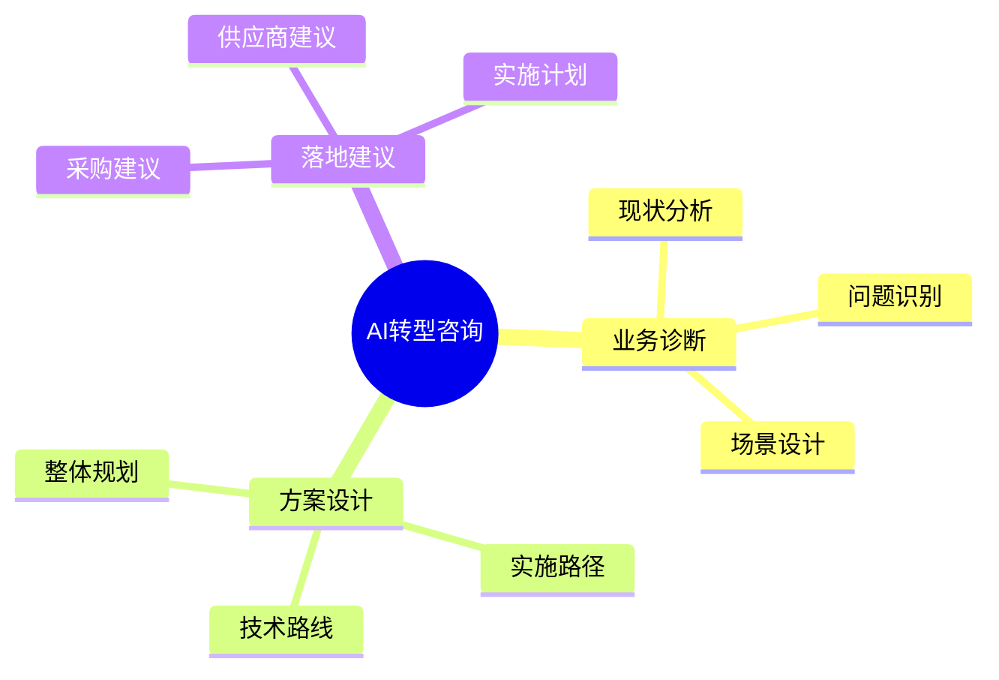

# 陕西煤炭交易中心AI转型咨询总报告

## 报告说明

本报告旨在为陕西煤炭交易中心提供AI转型的"需求翻译"和"采购指南"，通过系统性梳理企业需求、场景和技术路线，将业务诉求转化为可执行的技术方案和采购规范。本报告可直接用于：

1. **需求对接**：帮助企业与AI解决方案供应商进行精准沟通
2. **方案评估**：为后续供应商遴选提供评估维度和标准
3. **采购指导**：细化采购需求，降低采购风险和实施难度

## 核心要点速览

| 维度 | 关键内容 |
|------|----------|
| 项目定位 | 全国三大煤炭交易中心AI转型规划咨询 |
| 服务周期 | 2个月（8周） |
| 预期目标 | 形成完整的AI转型整体规划及落地路径 |
| 关键产出 | • AI转型需求清单和技术要求 • 场景应用方案和评估标准 • 供应商遴选建议和采购指南 |

## 一、项目背景与目标

### 1. 转型背景

#### 1.1 国家战略导向
- **双碳目标**：能源结构转型加速，煤炭行业智能化升级势在必行
- **数字经济**：数字经济发展战略推动传统产业数字化转型
- **能源安全**：保障能源供应链安全，提升能源交易效率

#### 1.2 行业发展趋势
- **数字化转型**：煤炭交易平台数字化、智能化成为行业标配
- **智能化升级**：AI技术重塑煤炭交易流程和服务模式
- **平台化竞争**：交易平台竞争加剧，智能化成为核心竞争力

#### 1.3 企业转型诉求
- **降本增效**：通过AI技术优化运营效率，降低交易成本
- **风控升级**：利用AI提升风险识别和控制能力
- **服务创新**：打造智能化交易服务，提升用户体验

### 2. 转型目标

#### 2.1 总体目标
打造"年度交易量超10亿吨、西部最大的煤炭现货交易平台"，提升平台经济的竞争力与影响力。

#### 2.2 阶段性目标
- **短期目标**：完成AI转型顶层设计和路径规划
- **中期目标**：实现数据治理和AI平台建设
- **长期目标**：打造智慧交易生态标杆平台

## 二、咨询服务概述

### 1. 服务范围

| 咨询模块 | 具体内容                               | 预期产出   |
| ---- | ---------------------------------- | ------ |
| 战略规划 | • AI转型整体规划 • 业务场景分析 • 技术路线设计 | 转型规划报告 |
| 方案设计 | • 应用场景方案 • 流程优化建议 • 数据需求分析   | 实施方案文档 |
| 落地建议 | • 实施计划制定 • 采购方案建议 • 供应商建议    | 建议报告   |

### 2. 项目进度

| 阶段   | 时间   | 主要工作                                         | 关键产出   |
| ---- | ---- | -------------------------------------------- | ------ |
| 调研诊断 | W1-2 | • 项目启动会议 • 资料收集分析 • 现场调研访谈 • 问题诊断梳理 | 现状评估报告 |
| 方案设计 | W3-4 | • 场景识别分析 • 技术路线规划 • 实施方案设计 • 投资收益测算 | 整体规划方案 |
| 方案完善 | W5-6 | • 专家评审论证 • 方案优化调整 • 可行性验证 • 细节完善定稿  | 最终实施方案 |
| 交付验收 | W7-8 | • 文档整理完善 • 成果汇报答辩 • 意见收集反馈 • 最终版本交付 | 完整交付文档 |

> 注：每个阶段均设置周例会，确保与业务部门的充分沟通和及时反馈

## 三、分阶段实施规划

### 1. 整体实施框架

| 阶段 | 时间 | 性质 | 主要内容 |
|------|------|------|----------|
| 第一阶段：AI转型规划 | 2个月 | **本次咨询范围** | • 转型顶层设计 • 场景方案规划 • 实施路径设计 |
| 第二阶段：数据治理 | 3个月 | 独立采购项目 | • 数据标准建设 • 数据质量治理 • 数据安全体系 |
| 第三阶段：AI应用开发 | 3个月 | 独立采购项目 | • AI平台建设 • 场景应用开发 • 系统集成部署 |

### 2. 本次咨询重点（第一阶段）

#### 2.1 核心任务分解

#### 2.2 项目里程碑与交付物

| 时间节点 | 主要工作 | 核心交付物 | 质量要求 |
|----------|----------|------------|----------|
| W1-W2 | • 项目启动 • 现状调研 • 问题诊断 | **规划类** • 现状评估报告 • 问题清单 | • 调研覆盖度≥90% • 问题分析完整性 |
| W3-W4 | • 场景分析 • 技术选型 • 方案设计 | **方案类** • 场景方案设计 • 技术路线规划 | • 场景可行性验证 • 技术方案合理性 |
| W5-W6 | • 专家评审 • 方案优化 • 成本测算 | **建议类** • 采购建议方案 • 实施计划建议 | • 方案完整性审核 • 成本效益合理性 |
| W7-W8 | • 文档完善 • 成果汇报 • 最终交付 | **最终成果** • AI转型整体规划 • 完整交付文档 | • 文档规范性 • 整体验收评审 |

> 注：
> 1. 每个阶段设置周例会，确保与业务部门充分沟通
> 2. 所有交付物需通过内部评审和客户确认
> 3. 最终交付包含完整的规划、方案和建议文档

## 四、结语

本次咨询服务通过系统性梳理和专业化转译，已将陕西煤炭交易中心的AI转型需求转化为可执行的技术方案和采购规范：

1. **需求层面**：完成业务需求到技术需求的转译，形成标准化的需求文档
2. **方案层面**：设计可落地的技术路线和实施方案，并提供评估维度
3. **采购层面**：制定完整的供应商遴选标准和采购指南

企业可直接依据本报告开展以下工作：
- 发布采购需求，对接解决方案供应商
- 评估供应商方案的完整性和可行性
- 监督项目实施过程和验收成果

通过本报告的指导，陕西煤炭交易中心将能有效管控AI转型项目风险，确保项目取得预期成效，最终打造智慧交易生态标杆平台。
