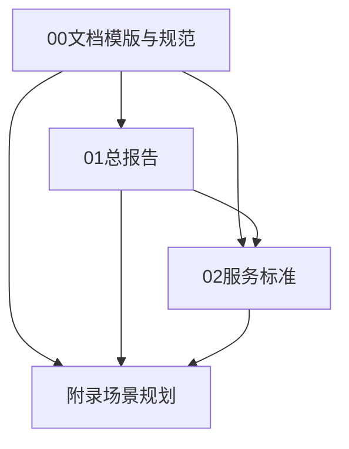

# 陕煤AI转型咨询项目文档体系说明

## 【文档定位与关系】

### 1. 文档层级关系

### 2. 各文档定位

#### 2.1 《00文档模版与规范》
- **目标读者**：项目组成员
- **核心作用**：确保文档体系统一性
- **使用场景**：文档编写与评审
- **更新建议**：
  - 补充具体行业术语规范
  - 添加专业名词使用规则
  - 统一数据指标表达方式

#### 2.2 《01AI转型咨询总报告》
- **目标读者**：决策层、管理层
- **核心作用**：战略决策参考
- **内容重点**：
  - 转型必要性论证
  - 整体规划框架
  - 投资回报分析
- **更新建议**：
  - 强化战略高度
  - 突出投资价值
  - 简化技术细节
  - 增加案例佐证

#### 2.3 《02服务标准》
- **目标读者**：项目执行团队
- **核心作用**：指导具体实施
- **内容重点**：
  - 服务流程规范
  - 质量控制标准
  - 交付要求明细
- **更新建议**：
  - 细化服务流程
  - 量化考核指标
  - 补充质量标准
  - 添加应急预案

#### 2.4 《附录：应用场景规划》
- **目标读者**：技术团队、业务团队
- **核心作用**：指导具体落地
- **内容重点**：
  - 场景详细设计
  - 技术实现方案
  - 效果评估标准
- **更新建议**：
  - 统一指标体系
  - 完善技术细节
  - 补充实施路径
  - 细化验收标准

## 【统一性要求】

### 1. 格式统一
- 遵循《00文档模版与规范》
- 保持视觉风格一致
- 统一图表样式

### 2. 内容统一
- 术语定义保持一致
- 数据指标口径统一
- 逻辑框架相互呼应

### 3. 表达统一
- 文风专业严谨
- 数据可追溯
- 案例实际可行

## 【更新建议】

### 1. 整体性更新
- 统一文档结构
- 对齐核心概念
- 校准数据口径
- 完善引用体系

### 2. 重点关注项
- 确保各文档定位清晰
- 避免内容重复冗余
- 保持逻辑链条完整
- 突出各自价值重点

### 3. 质量保障
- 建立评审机制
- 设置更新计划
- 保持版本控制
- 确保内容同步

## 【执行建议】

1. **第一步**：完善《00文档模版与规范》
2. **第二步**：更新《01总报告》核心框架
3. **第三步**：细化《02服务标准》
4. **第四步**：完善《附录场景规划》
5. **第五步**：整体审核与优化 