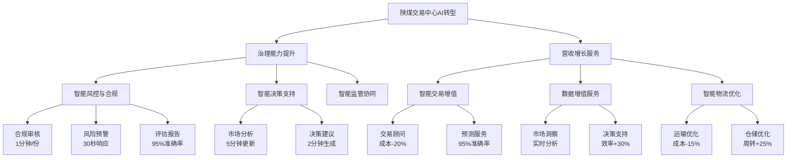

# 陕西煤炭交易中心AI转型应用场景规划

## 导读

本文档是《陕西煤炭交易中心AI转型咨询总报告》的配套附录，详细阐述AI转型的具体应用场景和价值实现路径。文档分为两大核心方向：

1. **治理能力提升**：聚焦交易中心内部治理、风控合规、决策精准度的提升
2. **营收增长服务**：基于交易中心的数据、经验和行业地位，开发面向市场的增值服务

## 核心要点速览

| 维度 | 关键内容 |
|------|----------|
| 应用方向 | 治理能力提升、营收增长服务 |
| 场景数量 | 12个核心场景 |
| 实施周期 | 分两阶段，共24个月 |
| 预期效益 | 治理效率提升40%，新增收入3000万+ |

## 第一部分：治理能力提升场景

### 1. 智能风控与合规管理

#### 1.1 交易风控场景

**交易合规性审核**
- 输入：上传新交易合同
- 处理能力：
  - 1分钟内完成审核
  - 自动提取20+个关键条款
  - 对比历史10000+份合同
  - 识别95%以上的异常条款
- 输出：异常条款清单及建议

**异常交易预警**
- 监控范围：全部实时交易
- 响应时间：30秒内
- 分析维度：
  - 交易方历史信用
  - 价格合理性
  - 数量异常检测
- 输出：异常分析报告

**风险评估报告**
- 生成周期：
  - 日报：1分钟
  - 周报：3分钟
  - 月报：5分钟
- 准确度：95%以上
- 覆盖内容：
  - 交易风险量化
  - 异常交易分析
  - 风险趋势预测
  - 管控建议

#### 1.2 合规管理场景

**政策法规解读**
- 监控范围：最新政策发布
- 处理时间：2分钟内
- 输出内容：
  - 政策要点提取
  - 影响范围分析
  - 合规建议生成

**智能合同审核**
- 处理能力：
  - 并发：50份合同
  - 速度：90秒/份
  - 准确率：98%
- 功能特点：
  - 模板比对
  - 非标条款识别
  - 风险点标注

### 2. 智能决策支持系统

#### 2.1 市场分析场景

**实时市场监测**
- 更新频率：5分钟
- 覆盖范围：
  - 8个区域市场
  - 12种煤炭品类
  - 100+价格指标
- 预警机制：实时异常预警

**市场报告生成**
- 生成速度：
  - 日报：30秒
  - 周报：2分钟
  - 月报：5分钟
- 质量指标：
  - 数据准确度99%
  - 异常值自动校验
  - 市场洞察生成

## 第二部分：营收增长服务场景

### 1. 智能交易增值服务

#### 1.1 成本优化服务

**全链路成本分析**
- 分析维度：
  - 采购成本
  - 物流成本
  - 库存成本
- 优化效果：
  - 总成本降低18-25%
  - ROI提升40%
  - 资金周转提升35%

**供应链金融服务**
- 评估维度：
  - 交易履约表现
  - 付款及时性
  - 经营稳定性
- 处理能力：
  - 5分钟完成评估
  - 覆盖2000+企业
  - 准确率95%

### 2. 数据增值服务

#### 2.1 精准对接服务

**供需智能撮合**
- 匹配维度：
  - 煤种需求匹配
  - 历史交易信用
  - 价格承受能力
  - 物流便利性
- 效果提升：
  - 撮合成功率+40%
  - 谈判周期-50%
  - 交易成本-15%

## 实施路径与收益预期

### 分阶段实施建议

| 阶段 | 重点建设内容 | 预期目标 |
|------|------------|----------|
| 治理提升期 (6-12个月) | • 风控体系智能化 • 决策支持系统建设 • 监管协同机制完善 | • 风控精准度提升40% • 决策效率提升50% • 合规性显著增强 |
| 服务创新期 (12-24个月) | • 增值服务产品开发 • 数据服务体系建设 • 智能物流服务落地 | • 新增服务收入3000万+ • 服务用户数500+ • 客户满意度90%+ |

### 预期效益分析

**治理效益**
- 风控准确率：提升至95%以上
- 合规性：达到行业最高标准
- 决策精准度：提升40-60%

**收入效益**
- 增值服务收入：年增长30-50%
- 用户粘性：提升40-60%
- 市场影响力：显著提升

## 结语

AI转型不仅是提升内部治理能力的重要手段，更是创造新业务增长点的关键抓手。通过本规划的实施，陕西煤炭交易中心将在提升治理水平的同时，充分发挥平台优势，创造更多社会价值和经济效益。

注：本规划中的收益预期基于行业实践经验，具体实现效果将取决于实施质量和市场环境。

## AI转型应用场景总览

### 关键指标总结

#### 🎯 治理能力提升
- **时效性**
  * 合规审核：1分钟/份
  * 风险预警：30秒响应
  * 决策支持：2-5分钟
- **准确性**
  * 风控评估：95%
  * 异常识别：98%
  * 合规审查：99%

#### 💰 营收增长服务
- **效益提升**
  * 采购成本：降低15-20%
  * 运营效率：提升30%
  * 库存周转：提升25%
- **服务质量**
  * 预测准确率：85-95%
  * 响应速度：30秒-5分钟
  * 方案更新：实时动态 