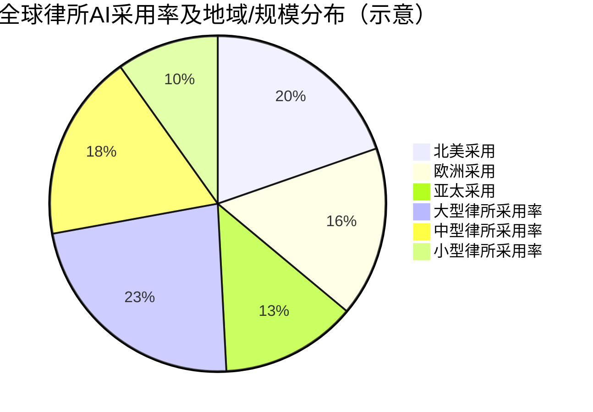
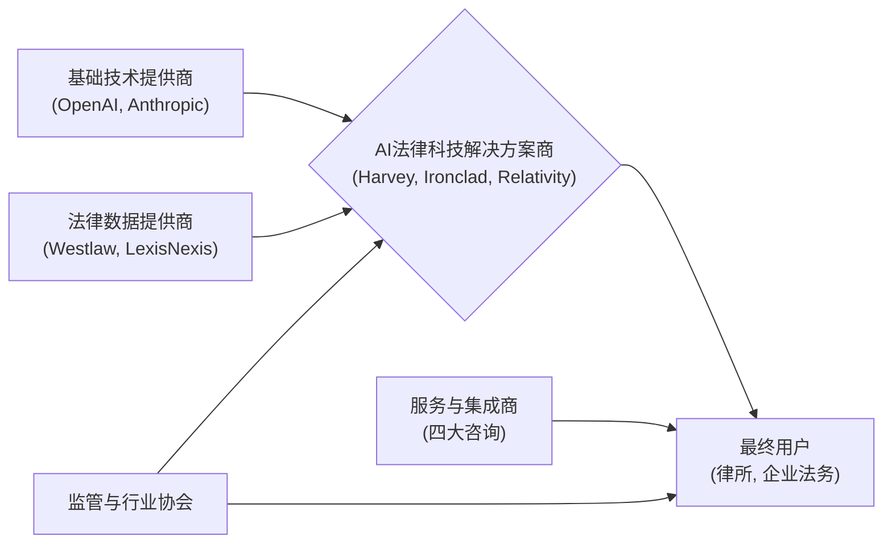
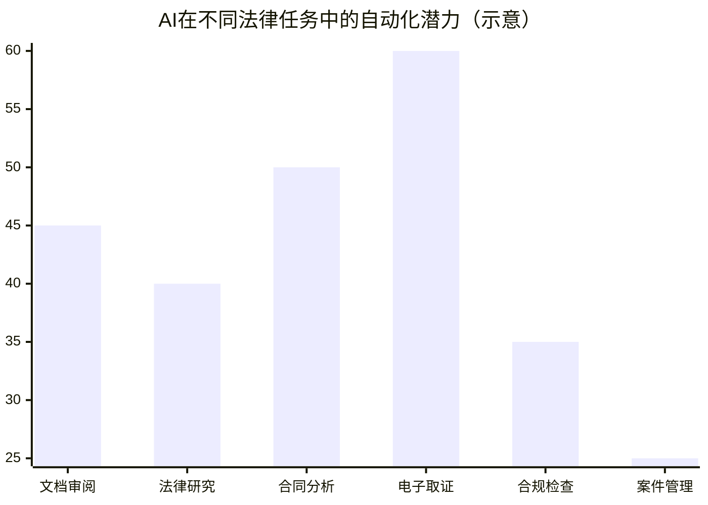
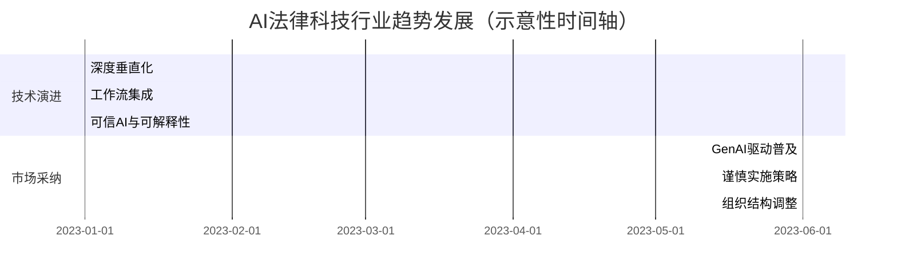
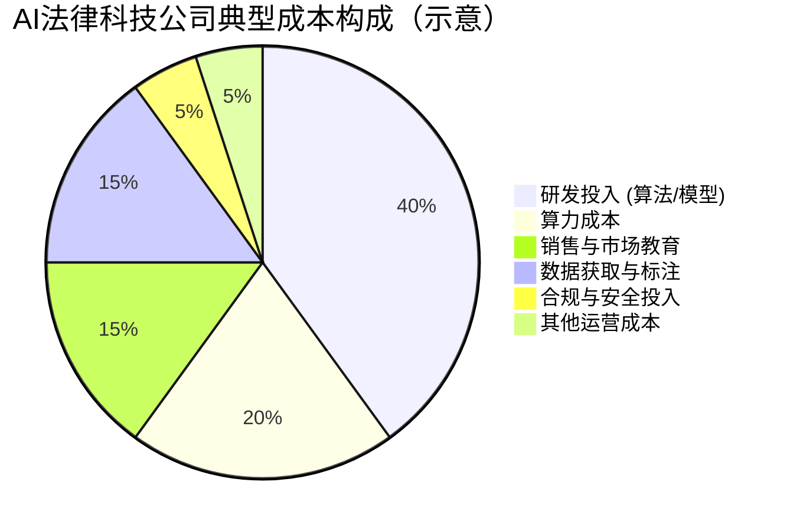

💡 **本文核心看点** 💡

*   **AI采纳现状：** 超半数律所已引入AI，GenAI是主要驱动力，但行业仍处早期。
*   **效率与价值：** AI有望替代38%的律所任务，显著提升效率，降低成本。
*   **核心应用领域：** 文档处理、法律研究、电子取证是AI应用的热点。
*   **市场潜力巨大：** 全球法律AI软件市场规模预计2033年近200亿美元。
*   **挑战与趋势：** 数据安全、模型准确性是挑战；垂直化、集成化是趋势。
*   **代表性玩家：** Harvey, Ironclad, Relativity等如何在各自赛道引领创新？

# 效率革命与谨慎前行：2024年AI法律科技应用现状、趋势与展望

## 关键发现 (Key Findings)

**核心结论:**

-   **采用提速，但仍处早期:** 全球已有 **51%** 的律所开始实施AI，但市场尚**未成熟**，缺乏主导技术。(来源: First Global Report 2024) 根据Rev (2025)的调研，已有高达 **51%** 的法律专业人士将AI视为未来五年对其行业最具变革性的力量，且有 **48%** 的律师已将AI驱动的法律研究工具融入日常工作。
-   **GenAI驱动显著:** **60%** 的AI采用发生在**过去一年内**，显示生成式AI是主要推动力。(来源: First Global Report 2024)
-   **效率提升潜力巨大:** 约 **38%** 的律所任务（如法律研究、文档审查、合同生成）被认为可由AI替代。(来源: First Global Report 2024) AI的投资回报潜力显著，例如，一项研究指出AI实施后每位律师每周可节省约12小时，每年可能产生高达30万美元的新增计费时间 (Rev, 2025, 引用 Thomson Reuters 2024)。同时，AI技术有望将律所的整体运营成本降低约50% (Market.us, LinkedIn文章)。
-   **应用聚焦核心痛点:** AI工具部署最多的领域是**文档处理自动化**和**法律研究**。
-   **实施策略普遍谨慎:** 多数律所采用**试点项目**和**预先批准**的方式引入AI，以控制风险。
-   **组织开始适应:** **43%** 的律所已设立**专门的AI创新单位**。(来源: First Global Report 2024) 值得注意的是，尽管AI采纳加速，仍有约 **60%** 的律所缺乏明确的AI使用指南，客户数据机密性是技术应用中的首要顾虑 (Rev, 2025)。
-   **核心挑战:** 数据安全、模型准确性、用户信任和监管合规是行业面临的主要障碍。

## 执行摘要 (Executive Summary)

本报告深入探讨了AI在法律科技领域的应用现状与未来。关键发现显示，尽管过半律所已开始拥抱AI（尤其受生成式AI驱动），但行业整体仍处于谨慎探索的早期阶段。AI在文档处理、法律研究等领域展现出显著的效率提升潜力（可替代约38%任务），并有望为律所节约大量成本、创造可观的新增价值 (Rev, 2025; Market.us, LinkedIn文章)，但其广泛部署仍面临信任、安全与合规挑战，具体表现为部分律所AI治理规范的缺失以及对现有系统的集成难题 (Rev, 2025; Market.us)。律所正通过设立专门团队和试点项目来应对。报告后续将详细分析行业生态链、市场潜力、竞争格局、关键趋势、盈利模式及未来预测，为理解这场"效率革命与谨慎前行"并存的行业变革提供洞察。

## 1. 引言与行业概述

本报告聚焦于人工智能（AI）及大语言模型（LLM）驱动下的AI法律科技如何重塑法律服务，深入剖析其发展现状、核心挑战与未来趋势。

**本章小结:**
- AI正成为法律行业变革的关键驱动力。
- 尽管采纳加速，行业整体仍处于应用早期。

## 2. AI法律科技行业生态链分析

AI法律科技的生态系统由多个相互关联的角色构成，共同驱动行业发展：

-   **基础技术提供商:** (如 OpenAI, Anthropic, Google) 供应底层大模型及核心AI能力。
-   **AI法律科技解决方案商 (Vendors):** 作为生态中最活跃和多样化的力量，它们基于基础AI技术与法律领域知识，开发面向特定应用场景的解决方案。这些方案高度细分和专业化，主要覆盖以下赛道：
    a.  **AI法律助理:** (如 **Harvey**, **Flank**, **Genie AI**) 提供通用或特定任务的AI支持。市场竞争激烈，深化工作流集成和领域专业化是关键。
    b.  **文档与合同管理:** (如 **Juro**, **Spellbook**, **Ironclad**) 实现合同生命周期自动化。此领域AI应用成熟度高，市场规模较大，增长稳定，聚焦智能风险分析与协商辅助。
    c.  **法律检索与分析:** (如 **Trellis**, **Casetext**, **vLex**) 高效处理案件研究与文书分析。大型法律信息服务商与AI创新公司共同参与，GenAI驱动自然语言交互与深度洞察。
    d.  **电子取证 (e-Discovery):** (如 **Relativity**, **DISCO**) 处理电子证据的识别、收集与审查。市场规模大，技术驱动型，AI/ML是核心，云化趋势显著，并购常见。
    e.  **知识管理与文档生成:** (如 **DeepJudge**, **Luminance**) 集中处理、搜索和生成法律文档，强调与工作流的深度融合。
    f.  **合规与风险管理:** (如 **Hadrius**, **Tangibly**) 自动化合规监控与风险评估。全球监管趋严驱动快速增长，AI在自动化监控和风险预测中价值突出。
    g.  **知识产权管理 (IP Management):** (如 **Huski AI** 部分功能) AI辅助专利检索、商标监控等。专业化细分市场，AI应用潜力逐步释放。
    h.  **在线法律服务与机器人:** (如 **DoNotPay**) 面向大众或中小企业的自动化服务。模式创新是关键，市场仍在探索。
-   **法律数据提供商:** (如 Westlaw, LexisNexis) 提供关键数据源，并日益集成AI能力。
-   **最终用户:** 律师事务所、企业法务部门、政府与司法机构。
-   **服务与集成商:** (如 四大咨询公司) 辅助AI部署与战略规划。
-   **监管与行业协会:** 制定行业规范与标准，影响技术应用。

**价值流动:** 技术赋能应用，数据驱动智能，服务满足用户，监管保障秩序。其中，解决方案商整合上游技术与数据，通过专业化产品服务下游用户，是价值捕获的核心。**各细分赛道的市场成熟度、增长速度和竞争格局各不相同。**

**本章小结:**
- 生态链由技术、数据、应用、用户、服务和监管等关键环节构成。
- **AI法律科技解决方案商是核心创新力量，其产品高度细分和专业化，覆盖从AI助手到合规等多个关键法律领域，各赛道发展动态各异。**
- 数据和基础模型是核心驱动，应用层创新非常活跃。

## 3. 市场潜力分析：为何潜力巨大？

AI法律科技展现出巨大潜力，主要归因于以下几个方面：

-   **巨大的可触达市场 (Large TAM):** 全球法律服务市场规模巨大，为AI应用提供了广阔空间。
-   **显著的效率提升空间 (Significant Efficiency Gains):** **约38%** 的律所任务具备AI自动化潜力。AI在文档审阅、合同分析、法律研究、电子取证等任务上可节省大量时间。例如，AI驱动的合同审阅速度可**提高40%**。根据experfy的数据，AI赋能的法律解决方案在合同审查方面能提速高达40% (Market.us)。更有研究指出，AI的实施能为每位律师每周节省约12小时的工作时间，折算下来每年可能产生高达30万美元的新增计费收益 (Rev, 2025, 引用 Thomson Reuters 2024)。
-   **成本削减潜力 (Cost Reduction Potential):** 降低人力成本（尤其是初级律师和律师助理的工作），提升服务可及性，使法律服务更普惠。
-   **提升服务质量与一致性 (Improved Quality & Consistency):** 减少人为错误，提高分析速度与全面性，保证服务标准。
-   **数据驱动决策 (Data-Driven Insights):** 从海量判例、法规、合同中提取策略性洞见，辅助诉讼策略制定和风险评估。
-   **高价值定位 (High-Value Proposition):** 法律服务本身的高价值使得效率提升和风险降低工具更容易被接受。

**多家市场研究机构的预测也印证了全球AI法律科技市场的巨大增长潜力：**
-   **Market.us 预测:**
    a.  全球法律AI软件市场规模到2033年将达到 **193亿美元** (年复合增长率 **29.1%**)。
    b.  另有分析称2033年将达到 **165亿美元** (年复合增长率 **26.3%**)。
-   **ResearchAndMarkets.com 预测:**
    a.  到2028年市场规模将达到 **64亿美元** (年复合增长率 **31.3%**)。

这些数据共同描绘了行业高速发展的蓝图。

**潜力体现：** 市场潜力的具体体现，正是在于大量初创公司和成熟企业瞄准了这些效率提升和价值创造的机会点，开发出针对性的解决方案。**尤其是在以下几个高潜力细分领域：**
-   **电子取证 (e-Discovery):** 市场规模已达百亿美元级别，预计未来仍将保持约10-11%的年复合增长率。AI是该领域的核心技术驱动力。
-   **合同生命周期管理 (CLM):** 自动化需求强烈，市场增长迅速。AI驱动的分析和自动化能力是关键卖点。
-   **法律研究与分析:** 结合生成式AI，该领域正经历变革，用户体验和洞察深度有望大幅提升。
-   **合规与风险管理:** 监管压力驱动下，AI自动化监控和风险预警的需求持续增长。

这些领域不仅吸引了大量投资（如eDiscovery领域的Everlaw融资，合同管理领域的Icertis、Ironclad等），也涌现了众多专注于解决特定痛点的创新公司，共同验证了AI技术在解决法律行业核心痛点、提升整体效率与价值方面的巨大潜力。

**本章小结:**
- 巨大的市场规模和显著的效率提升空间（约38%任务可自动化）是核心驱动力。
- AI有望在成本、质量和决策支持方面带来显著价值。
- **市场潜力已通过多个高增长细分领域（如eDiscovery、合同管理、法律研究、合规）的活跃发展和大量针对性解决方案的出现得到初步验证。**

## 4. 竞争格局：异同点分析

### 4.1. 共同特征 (Similarities)

AI法律科技市场参与者普遍呈现以下共同点：

-   **技术依赖:** 核心技术栈依赖先进的自然语言处理（NLP）、机器学习（ML），尤其是大语言模型（LLM）。
-   **核心价值:** 普遍以提升效率、降低成本、增强准确性及减少风险为主要价值主张。
-   **商业模式:** 以软件即服务（SaaS）的订阅模式为主流。
-   **面临挑战:**
    a.  数据安全与隐私保护。
    b.  模型准确性与输出结果的可靠性。
    c.  用户信任的建立与培养。
    d.  满足合规性要求，特别是AI伦理和数据使用规范。
    e.  与现有IT系统（尤其是旧有系统）的集成难题，这是普遍的技术和成本障碍 (Market.us)。
    f.  AI治理机制的滞后，例如高达60%的律所缺乏明确的AI使用指南 (Rev, 2025)。
-   **市场阶段:** 整体仍处于发展早期，多数细分领域尚未形成绝对主导者，但部分成熟领域（如电子取证、大型律所信息服务）已出现头部企业。

### 4.2. 差异性 (Differences)

尽管AI法律科技市场参与者存在诸多共同特征，但在业务切入点、技术实现路径、目标客户群体、产品具体形态、地域市场侧重以及整体竞争态势等多个维度上，它们也展现出显著的差异性。这些差异共同构成了当前丰富多样且持续演变的市场格局，具体梳理如下表所示：

| 维度         | 差异点 (示例)                                      |
|--------------|----------------------------------------------------|
| **切入点/赛道** | 通用助手 (**Harvey**) vs. 合同管理 (**Juro, Ironclad**) vs. 案例研究 (**Trellis, Casetext**) vs. eDiscovery (**Relativity, DISCO**) vs. 合规 (**Hadrius**) |
| **技术实现** | 自研/微调/API调用，知识图谱/Agent应用差异，模型专注度（通用 vs. 领域特定） |
| **目标客户** | 大型律所/企业法务部 vs. 中小型律所/特定行业（如金融、医疗） |
| **产品形态** | 独立平台 vs. 嵌入式工具 vs. API 服务             |
| **地域侧重** | 北美市场最为成熟，欧洲、亚太快速增长，部分公司有明显地域偏好 |
| **竞争态势** | 新兴创业公司 vs. 传统法律信息巨头 vs. 大型科技公司跨界 |

**本章小结:**
* 市场参与者在技术路径、目标客户和产品形态上存在显著差异，**已形成多个专业细分赛道，各赛道竞争格局不一**。
* 共同面临技术、市场与合规挑战，行业格局仍在演变中，**整合与合作是未来趋势**。

## 5. 行业趋势分布与分析

-   **深度垂直化 (Verticalization):**
    a.  **趋势描述：** AI正从通用能力向特定法律领域和具体任务深度渗透，成为行业最显著的趋势之一。这意味着解决方案更具针对性，更能解决特定场景的痛点。
    b.  **市场印证与价值：** 大量专注于细分赛道的AI法律科技公司及其解决方案印证了此趋势。例如：
        i.  *合同生命周期管理：* **Juro, Ironclad, Spellbook** 等通过自动化、审查和管理，直指效率提升核心。
        ii. *法律研究与分析：* **Casetext, vLex, Trellis** 等通过AI处理海量信息，提升研究效率与洞察力。
        iii.    *电子取证 (e-Discovery)：* **Relativity, DISCO, Lighthouse** 等利用AI应对海量电子证据挑战。
        iv. *合规与IP：* **Hadrius, Huski AI, Tangibly** 等深耕特定风险管理和资产保护，体现AI在高价值专业领域的应用。
    c.  **行业需求驱动：** 法律专业人士对技术改进的优先需求（如文档管理、电子取证等占26.4% (Rev, 2025)）也持续驱动AI在特定场景的垂直深化。
-   **工作流深度集成 (Workflow Integration):**
    a.  **趋势描述：** AI不再是孤立工具，而是日益嵌入律师日常使用的文档管理系统（DMS）、案件管理系统、邮箱等现有平台中，追求无缝的使用体验。
    b.  **核心价值：** 提升工作效率，降低工具切换成本，使AI能力在律师的自然工作流程中发挥作用。API生态在此趋势下愈发重要。
-   **可信AI与可解释性 (Trustworthy AI & Explainability):**
    a.  **趋势描述：** 面对法律场景对严谨性的高要求，市场对AI模型的透明度、决策依据的可溯源性需求日益增强，以减少"黑箱"操作。
    b.  **核心价值：** 建立用户信任，满足监管合规要求，确保AI的负责任应用。
-   **人机协作的进化 (Human-AI Collaboration):**
    a.  **趋势描述：** AI更多定位为智能助手（Co-Pilot模式，如 **Harvey, Genie AI, CoCounsel Core**），辅助并增强律师的专业判断，而非完全取代。
    b.  **核心价值：** 结合AI的效率与人类的专业知识、经验和最终决策权，实现最佳实践。
-   **生成式AI驱动快速普及 (Rapid Adoption Driven by GenAI):**
    a.  **趋势描述：** GenAI以其更低的交互门槛和更佳的体验，显著加速了AI在法律行业的采纳速度（近60%采用发生在过去一年内）。
    b.  **主要应用：** 特别是在文档起草、内容摘要、初步研究等方面展现出高效率。
-   **谨慎的实施策略 (Cautious Implementation):**
    a.  **行为表现：** 多数律所和法务部门在引入AI时，普遍采用试点项目和内部审批流程。
    b.  **主要考量：** 优先关注数据安全、模型可靠性及潜在风险控制。
-   **组织结构调整 (Organizational Adaptation):**
    a.  **行为表现：** 约43%的律所已设立AI创新单位或指定专人负责AI策略与实施。
    b.  **主要目的：** 主动适应技术变革，系统规划AI技术的引入与应用。
-   **监管科技（RegTech）的融合:**
    a.  **趋势描述：** AI在合规监控、风险预警、反洗钱（AML）、了解你的客户（KYC）等方面的应用增多。
    b.  **行业交叉：** 与金融等强监管行业的界限日益模糊，技术与需求相互促进。
-   **云优先策略 (Cloud-First Strategy):**
    a.  **趋势描述：** 绝大多数AI法律科技解决方案选择基于云部署（2023年云端部署占比达69.5% (Market.us)）。
    b.  **主要优势：** 充分利用云计算的弹性、可扩展性、数据处理能力及快速迭代优势。

**本章小结:**
- **垂直化（体现在众多细分赛道玩家）、集成化、可信化是关键技术趋势。** 人机协作的"Co-Pilot"模式成为主流。
- GenAI加速普及，但实施仍保持谨慎，组织结构开始调整适应。云部署是基础，行业整合的趋势也已显现 (ResearchAndMarkets.com)。
- **具体公司的业务方向和市场定位（如合同管理、法律研究、eDiscovery、合规等），为上述行业发展趋势提供了鲜活的案例佐证。**

## 6. 主要细分市场深度分析与展望

以下对关键的AI法律科技细分市场，从现状、潜力、竞争格局及未来趋势等维度进行深度剖析：

### 6.1. 文档与合同管理 (Document & Contract Management)
-   **市场现状与规模:** AI法律科技中最大且最成熟的细分市场之一。AI驱动的合同生命周期管理（CLM）解决方案市场规模已达数十亿美元，持续稳健增长。
    *   **案例速写：Ironclad** 作为数字合同管理平台的领导者，通过AI赋能合同创建、审批、执行和分析全流程，帮助企业如L'Oréal等实现高效合规的合同管理，其D轮融资后的高估值也反映了市场对其价值的认可。
-   **增长驱动力与潜力:**
    a.  核心驱动：企业与律所对高效处理海量合同、降低合同风险的迫切需求。
    b.  未来潜力：AI从自动化审阅向智能条款推荐、风险评分、协商辅助等高级功能演进。
-   **发展速度与趋势:** 增长稳定。趋势包括与CRM/ERP等系统深度集成，GenAI在合同条款自动生成与修改中的应用，以及更精细化的风险分析模型。
-   **市场表现与竞争:** 市场参与者众多，竞争激烈，创新活跃。包括专业CLM/合同AI公司（如 **Ironclad, Icertis, Juro, SpotDraft, Spellbook**）及大型软件公司与法律信息服务商的相关模块。
-   **融资表现:** 持续作为风险投资热点，多家头部公司获巨额融资。
-   **行业影响力:** 显著提升合同处理效率，降低人为错误，助力法务部门聚焦战略性工作。
-   **功能特点:**
    a.  合同自动化起草与模板生成
    b.  智能条款库与推荐
    c.  AI辅助风险识别与合规审查
    d.  合同数据提取与分析
    e.  电子签名与归档集成

    *   **迷你案例速写：**
        *   **Ironclad:** 作为数字合同管理平台的领导者，通过AI赋能合同创建、审批、执行和分析全流程，帮助企业（如L'Oréal, Mastercard）实现高效合规的合同管理。其高额融资（D轮$150M，估值$3.2B）也反映了市场对其在提升合同效率和降低风险方面价值的认可。
        *   **Juro:** 专注于为内部法务团队打造合同自动化平台，通过灵活的编辑器和协作功能，帮助如Deliveroo等快速成长的公司简化合同流程，提升法务敏捷性。

### 6.2. 法律研究与分析 (Legal Research & Analytics)
-   **市场现状与规模:** 传统法律信息服务市场巨大，AI正重塑此领域。AI驱动的研究分析工具市场增长迅速。
    *   **案例速写：Casetext** (现属Thomson Reuters) 以其AI法律助手CoCounsel引领潮流，通过大语言模型赋能律师进行快速的案例分析、法律备忘录起草和文档数据库检索，极大提升了法律研究的效率和深度。
-   **增长驱动力与潜力:**
    a.  根本动力：律师对快速、准确获取法律信息与案例洞察的需求。
    b.  未来潜力：AI实现更佳的自然语言查询理解，提供深层分析（如判决预测、论点强度评估）与知识发现。
-   **发展速度与趋势:** 增长迅速，尤以GenAI应用为甚。趋势包括对话式法律研究、强化案例关联分析、可视化法律数据及预测性分析应用。
-   **市场表现与竞争:** 由传统法律信息巨头（**Thomson Reuters (Westlaw), LexisNexis**）与AI初创公司（**Casetext (已被TR收购), vLex, Trellis**）共同塑造。大型服务商正积极将AI融入其平台。
-   **融资表现:** AI法律研究领域的初创公司亦吸引大量投资。
-   **行业影响力:** 大幅缩短法律研究时间，提升研究的全面性与深度，辅助律师策略制定，并可能影响法学教育。
-   **功能特点:**
    a.  自然语言案例与法规检索
    b.  AI驱动的案例摘要与关键信息提取
    c.  法律概念与关系的语义理解
    d.  判决预测与趋势分析（部分工具）
    e.  引用关系可视化与验证

    *   **迷你案例速写：**
        *   **Casetext (已被Thomson Reuters收购):** 其AI法律助手CoCounsel是GenAI在法律研究领域应用的典范。通过LLM赋能，律师可以进行自然语言提问，快速完成案例分析、法律备忘录起草、文档数据库检索等任务，显著提升研究效率和深度。
        *   **vLex:** 整合全球法律信息资源，并通过AI技术（如其Vincent AI）提供智能搜索、案例关联分析和个性化推荐，帮助用户在海量数据中快速定位相关信息并发现洞察。

### 6.3. 电子取证 (e-Discovery)
-   **市场现状与规模:** 市场规模庞大（2023/2024年约150-170亿美元），是法律科技中AI应用早且市场化程度高的领域之一。
-   **增长驱动力与潜力:**
    a.  核心驱动：诉讼与调查中电子数据量的爆炸性增长。
    b.  未来潜力：进一步提升AI在数据筛选、关联判断、隐私信息识别等方面的智能化水平。
-   **发展速度与趋势:** 市场增长稳健（CAGR约10-11%）。趋势包括AI在早期案例评估（ECA）和技术辅助审查（TAR）中的深化，对新型数据源（聊天、协作平台）的处理，云平台普及，以及与网络安全、信息治理的融合。
-   **市场表现与竞争:** 市场相对成熟，头部玩家包括 **Relativity, DISCO, Lighthouse, Nuix** 等。市场整合趋势明显，并购频繁。
-   **融资表现:** 领先的eDiscovery公司仍能获得投资，或通过IPO/并购实现发展。
-   **行业影响力:** AI极大降低了处理海量电子证据的成本与时间，但也对数据隐私和算法公平性提出挑战。
-   **功能特点:**
    a.  海量电子数据处理与索引
    b.  技术辅助审查（TAR）与预测编码
    c.  关键信息识别与文档分类
    d.  隐私数据与敏感信息屏蔽
    e.  可视化数据分析与报告

### 6.4. 合规与风险管理 (Compliance & Risk Management)
-   **市场现状与规模:** 快速增长的潜力市场，与RegTech（监管科技）高度交叉，需求旺盛。
-   **增长驱动力与潜力:**
    a.  主要驱动：日益严格复杂的全球法规（如数据隐私、金融监管、ESG）。
    b.  未来潜力：利用AI实现更主动、实时、全面的合规监控与风险预警。
-   **发展速度与趋势:** 增长快速。趋势包括AI自动化法规跟踪与解读，合同/沟通的合规性扫描，第三方风险管理，反欺诈与反洗钱监控。可解释AI（XAI）在此领域尤为重要。
-   **市场表现与竞争:** 参与者包括专业AI法律合规初创（如 **Hadrius, relyance.ai**），大型GRC平台供应商及咨询公司的解决方案。
-   **融资表现:** 监管科技热度上升，该领域AI应用吸引了更多关注和投资。
-   **行业影响力:** 助企业有效应对监管压力，降低违规风险，提升治理水平，但也需关注AI决策的合规性与公平性。
-   **功能特点:**
    a.  自动化法规变更跟踪与解读
    b.  AI驱动的合规性审计与审查
    c.  风险识别、评估与预警
    d.  反洗钱(AML)与反欺诈(Anti-Fraud)监控
    e.  第三方风险管理自动化

### 6.5. 法律助理 (Legal Assistant)
-   **市场现状与规模:** GenAI驱动下迅速兴起的热门赛道。市场处早期高速增长阶段，竞争激烈，玩家众多，尚无绝对领先者。
    *   **案例速写：Harvey** 作为面向顶级律所的AI平台，提供覆盖法律研究、文档分析与起草、尽职调查等多种场景的AI辅助，旨在增强律师能力而非取代，其高估值和顶级律所的采用证明了其在高端法律服务市场的潜力。
-   **增长驱动力与潜力:**
    a.  核心驱动：利用AI（特别是LLM）提升律师日常工作效率（研究、起草、摘要、邮件处理等）。
    b.  未来潜力：深度融入律所工作流，成为核心生产力工具，并向特定案件类型分析等专业领域深化。
-   **发展速度与趋势:** 发展极快，产品与功能迭代迅速。趋势包括从通用问答向特定工作流自动化演进，增强上下文理解与个性化，与其他法律软件集成，以及对模型准确性和可靠性的持续关注。
-   **市场表现与竞争:** 参与者包括明星初创（**Harvey, EvenUp Law, Paxton AI**），传统法律科技公司的AI模块，及特定任务/客户群的玩家（**alexi, LEGALMATION**）。竞争激烈，产品差异化与客户获取是关键。
-   **融资表现:** 当前投资热点，Harvey、EvenUp Law等获高额融资与高估值。
-   **行业影响力:** 正改变初级法律工作与信息处理方式，有望大幅提升律师效率，但也引发工作替代、信息准确性等讨论。
-   **功能特点:**
    a.  法律问题解答与初步研究
    b.  文档起草、摘要与改写
    c.  邮件与沟通辅助
    d.  任务管理与提醒
    e.  工作流自动化（部分）

    *   **迷你案例速写：**
        *   **Harvey:** 定位为面向顶级律所和专业服务机构的AI平台，提供覆盖法律研究、文档分析与起草、尽职调查等多种场景的AI辅助。其模式强调增强律师能力而非取代，高估值（$3B）和顶级律所（如A&O Shearman）的采用证明了其在高端法律服务市场的潜力。
        *   **EvenUp Law:** 专注于人身伤害索赔领域，通过AI自动生成索赔文件、计算损害赔偿，帮助律师事务所处理更多案件并提高索赔金额，展现了AI在特定垂直法律领域的强大赋能效果。

### 6.6. 知识管理 (Knowledge Management)
-   **市场现状与规模:** 法律知识管理（KM）是律所/法务的核心需求，AI为此带来新方案。市场处发展初期，AI驱动的KM工具逐步被接受。
-   **增长驱动力与潜力:**
    a.  驱动力：律所/法务部对内部知识（案例经验、模板、专家意见）沉淀、共享与高效检索的需求。
    b.  未来潜力：AI理解非结构化文档，自动进行标签、分类、关联，并智能推荐。
-   **发展速度与趋势:** 增长速度中等，依赖律所对KM价值认知与投入。趋势包括与DMS深度集成，语义搜索与上下文感知推荐，自动生成知识摘要，以及知识图谱应用。
-   **市场表现与竞争:** 参与者包括专注法律KM的初创（**DeepJudge, Decover**），大型eDiscovery/信息治理服务商模块（**Lighthouse**），及传统DMS（如 **NetDocuments**）新增的AI功能。**DARROW**虽定位诉讼情报，亦涉知识发现。
-   **融资表现:** 相对法律助理和合同管理，纯法律KM AI工具融资热度稍低，但新秀亦获投资。
-   **行业影响力:** 有望打破内部知识孤岛，提升知识复用，加速新律师成长，并为律所提供战略洞察。
-   **功能特点:**
    a.  内部文档与案例的智能检索
    b.  知识图谱构建与可视化
    c.  自动标签、分类与关联推荐
    d.  专家经验与最佳实践沉淀
    e.  协作式知识共享

### 6.7. 文档 (Documentation)
-   **市场现状与规模:** "文档"涵盖广（自动化生成、审查、分析、管理等），与合同管理、KM多有重叠。AI在文档处理方面应用广泛。
-   **增长驱动力与潜力:**
    a.  核心驱动：法律工作中海量的文档处理需求。
    b.  未来潜力：AI更智能、精准地完成文档自动化生成（诉状、专利申请）、关键信息提取、文档对比、摘要、格式调整等。
-   **发展速度与趋势:** 增长稳定。趋势包括GenAI在文档初稿生成中的应用，更精细化文档审查（如条款一致性检查），与特定法律流程（如庭审记录 **Skribe**, 尽职调查）结合，及无代码/低代码平台（**gavel**）赋能律师自定义文档自动化。
-   **市场表现与竞争:** 市场分散，参与者众多。包括大型平台功能（**Luminance**），专业文档自动化工具（**gavel, Avvoka** - 已被收购），特定文档类型处理工具（**Skribe, arteria ai** - 面向金融），及文档Q&A/摘要AI工具（**definely**）。
-   **融资表现:** 取决于具体切入点，文档自动化和特定行业文档处理公司能获融资。
-   **行业影响力:** AI显著提高各类法律文档处理效率与准确性，减少重复劳动。
-   **功能特点:**
    a.  法律文书自动化生成与填充
    b.  AI辅助文档审查与校对
    c.  关键信息提取与摘要
    d.  文档版本控制与比较
    e.  特定格式文档处理（如庭审记录）

### 6.8. 知识产权协助 (IP Assistance)
-   **市场现状与规模:** 高度专业化的细分市场。AI在专利检索、商标监测、版权管理等方面应用渐兴，市场处早期发展阶段。
-   **增长驱动力与潜力:**
    a.  驱动力：企业对IP保护与价值最大化需求，及IP流程复杂性与数据量。
    b.  未来潜力：AI进行更全面的现有技术/商标检索、侵权风险预警、IP组合管理与价值评估。
-   **发展速度与趋势:** 发展渐加快。趋势包括AI在图像识别（商标Logo搜索 **Huski.ai**）、语义分析（专利文献理解）、预测分析（如专利授权可能性）的应用，及与区块链等技术结合进行版权保护。
-   **市场表现与竞争:** 参与者主要是专注IP的科技公司（**Huski.ai, AIPLUX, tradespace**），及大型法律/商业数据库的IP分析模块。竞争格局相对早期。
-   **融资表现:** 相比通用法律科技，IP AI融资案例较少，但随技术成熟与价值显现，有望增加。
-   **行业影响力:** AI有望提高IP申请效率与成功率，加强品牌保护，并为IP战略决策提供更佳数据支持。
-   **功能特点:**
    a.  AI辅助专利与商标检索
    b.  侵权风险监测与预警
    c.  知识产权组合管理与分析
    d.  AI驱动的IP价值评估
    e.  自动化申请与续展辅助

**本章小结:**
- **文档/合同管理** 和 **eDiscovery** 是AI法律科技中相对成熟且规模较大的市场，AI应用主要聚焦效率提升。
- **法律研究/分析** 和 **合规/风险管理** 是增长迅速且潜力巨大的市场，AI应用更侧重于提供深度洞察和风险控制能力。
- 各细分市场均呈现出技术不断深化、云化部署、以及与工作流融合的趋势。

## 7. 行业盈利模式与利润分析

AI法律科技行业的盈利模式及利润状况呈现以下特点：

-   **主要盈利模式:**
    a.  **SaaS订阅:** 是核心模式，常见于各类AI助手、合同/知识管理平台（如Harvey, Juro, DeepJudge）。
    b.  其他模式：包括按需付费/API调用、定制化解决方案及增值服务（如高级分析、专家咨询）。
-   **利润驱动因素:**
    a.  高客户生命周期价值（LTV），源于法律客户的高粘性。
    b.  规模效应的逐步显现。
    c.  潜在的强定价能力，尤其在能显著降低风险或处理高价值任务的细分市场（如合同谈判辅助SpotDraft、IP智能监测Huski AI、精准eDiscovery），可探索基于价值的定价策略。
-   **主要成本构成:**
    a.  高昂的研发投入（算法开发、模型训练）。
    b.  算力资源消耗。
    c.  高质量法律数据的获取与标注。
    d.  销售与市场教育（因市场采纳谨慎，周期可能较长）。
    e.  合规与安全保障投入。
-   **整体利润表现:**
    a.  行业当前多处于投入期，市场份额拓展优先于短期盈利。
    b.  头部企业及成熟细分市场（如eDiscovery）已开始显现盈利潜力。
    c.  初创公司普遍仍在持续投入阶段。
    d.  长期来看，随着市场成熟、技术成本优化和价值主张被广泛认可，利润率有望提升。

**本章小结:**
- SaaS订阅为核心盈利模式，高客户粘性是关键。
- **细分领域的专业化和高价值任务处理能力，是实现差异化定价和提升利润的潜在途径。**
- 研发、算力及数据构成主要成本，长期盈利能力有赖于规模化运营和核心价值的持续实现。

## 8. 未来展望与预测

-   **市场持续高速增长:** 根据多方预测，未来5-10年市场规模预计将从数十亿美元增长至百亿甚至近两百亿美元级别（Market.us; ResearchAndMarkets.com），复合年增长率普遍预测在25-30%以上。未来3-5年增长潜力巨大，预计复合年增长率可观（参考各细分市场预测）。
-   **行业整合加速:** 正如ResearchAndMarkets.com所指出的，战略性收购正在塑造市场格局，这预示着未来几年整合趋势将更为明显。并购活动可能增加，大型科技公司、法律信息服务商和咨询公司可能通过收购加速布局，初创公司面临整合压力。
-   **平台化与生态化趋势:** 解决方案可能从单一工具向集成化的工作平台演进，API开放和生态合作更为重要。
-   **AI伦理与监管框架成熟:** 针对法律领域AI应用的伦理规范和监管要求将逐步明确和完善。
-   **新法律职业角色出现:** 如"法律AI提示工程师"、"AI合规官"、"法律数据科学家"等。
-   **"AI+法律服务"模式创新:** 可能出现更低成本、更便捷的自动化法律服务模式，特别是在消费者和中小企业市场。
-   **人机协作模式深化:** AI将更深度融入律师工作流程，成为不可或缺的辅助工具。此外，AI法律科技向新兴市场的扩展也带来了新的增长机遇 (Market.us)。

**本章小结:**
- 行业增长、整合、平台化是未来主要方向。
- 监管和职业角色将随技术发展演变。
- 人机协作将进一步深化。

## 9. 结论

AI法律科技正驱动法律行业经历一场效率与审慎并存的深刻变革。本报告的核心结论如下：

-   **行业现状与潜力：**
    a.  AI在法律领域的应用（尤其由GenAI推动）正加速，但整体仍处早期探索阶段，市场格局未定。
    b.  AI在提升法律工作效率（约38%任务可被替代）、降低成本方面潜力巨大，众多AI法律科技公司的涌现与发展印证了这一点。
-   **关键趋势与市场动态：**
    a.  **深度垂直化**和**人机协作（Co-Pilot模式）**是主要的技术与应用趋势。
    b.  解决方案商作为连接技术与用户的核心，在合同管理、法律研究、电子取证、合规等多个细分赛道展现出不同的发展态势与市场活力。
    c.  其中，文档/合同管理和电子取证是相对成熟的基石市场，而法律研究/分析和合规/风险管理代表了高增长的前沿。
-   **挑战与展望：**
    a.  行业仍面临数据安全、模型准确性、用户信任、系统集成及AI治理规范缺失等多重挑战。
    b.  尽管如此，AI赋能法律服务的长期趋势明确且不可逆转。
-   **成功关键：**
    a.  未来成功的关键在于将尖端AI技术与深厚的法律专业知识有效结合，切实解决行业痛点，并构建可持续的用户信任。
    b.  能够有效应对当前挑战并实现价值创造的公司，将在塑造未来法律服务市场中占据主导地位。

综上所述，AI法律科技的征途是星辰大海，既有机遇亦有挑战。参与者需在积极拥抱技术革新的同时，保持对风险的敬畏和对专业伦理的坚守。

## 💬展望与行业洞察交流

1.  **AI伦理与律师责任：** 在AI辅助下完成的法律工作，其最终责任应如何界定？律师在依赖AI工具时应遵循哪些伦理准则？
2.  **数据驱动的司法公正：** AI分析海量案例可能揭示司法趋势，这对于促进司法公正有何意义？又可能带来哪些潜在风险（如算法偏见）？
3.  **法律教育的变革：** 面对AI带来的行业变革，未来的法律教育应如何调整课程设置和培养模式，以使法律学子更好地适应新时代的需求？
4.  **您认为AI法律科技的下一个"爆款"应用会出现在哪个细分领域？为什么？欢迎留言分享您的见解！**

### 名词解释 (Glossary)
*   ^ehr_explanation **EHR**：电子健康记录（Electronic Health Record）——个人健康医疗信息的数字化版本，记录患者从出生到死亡的全部健康信息，包括病史、诊断、治疗、药物、过敏、免疫接种、实验室检查结果和影像报告等。EHR系统旨在实现医疗信息的安全共享和高效管理，支持临床决策，提升医疗质量和效率。

## 附录：AI法律科技代表性公司生态图谱 (基于AI x Legaltech 2025图谱)

**说明:**
本附录旨在展示AI法律科技领域部分代表性公司，按照主要细分赛道进行分类（参考了AI x Legaltech 2025图谱），并提供其融资情况和规模参考。数据主要来源于公开信息（如公司官网、Crunchbase、新闻报道等），可能并非完全实时或详尽，尤其是初创公司的商业规模信息。部分公司名称根据截图可能显示不全。旨在提供一个行业玩家的快照。

| 细分赛道 (中文)          | 公司名称 (Company)       | 简要描述/核心业务 (Brief Description/Focus)                                    | 融资情况 (Funding Status)                                                                      | 规模参考 (Scale Indication)                                     |
| :------------------------- | :----------------------- | :----------------------------------------------------------------------------- | :------------------------------------------------------------------------------------------- | :-------------------------------------------------------------- |
| **法律助理**             | **Harvey**               | 面向律所和专业服务机构的AI平台，提供法律研究、文档分析、起草等通用助手能力     | D轮, 估值$3B (2025.02); 投资者包括Sequoia, Kleiner Perkins, GV, OpenAI Fund, Coatue等 | 235+客户(含多家Top律所), 员工数快速增长 (C轮后翻倍)             |
|                            | **Paxton AI**            | AI法律助手，提供研究、起草、文档分析                                             | A轮, $22M (2025.01), 累计$28M; 投资者包括Unusual Ventures等                                | 收入增长迅速 (9个月内14x MRR增长)                              |
|                            | **GENIE AI**             | 开源法律模板库，AI辅助合同起草和审查                                             | A轮, $17.8M (Google Ventures领投, 2024.11), 曾获£10M A轮 (2022.11)                             | 信息暂缺                                                        |
|                            | **flank**                | AI Agent or chatbot for legal tasks                                            | 信息暂缺                                                                                     | 信息暂缺                                                        |
|                            | **Anytime AI**           | 面向原告律师的AI平台，覆盖案件管理全流程                                         | 种子轮, $4M (2024.09)                                                                        | 成立于2023年                                                    |
|                            | **ailawyer**             | AI Agent or chatbot for legal tasks                                            | 信息暂缺                                                                                     | 信息暂缺 (或已停止运营)                                         |
|                            | **SmartAdvocate**        | 案件管理软件 (可能集成AI功能)                                                    | 信息暂缺 (老牌案件管理软件公司)                                                              | Est. 51-200员工                                                 |
|                            | **JUNE**                 | AI Agent or chatbot for legal tasks                                            | 信息暂缺                                                                                     | 信息暂缺                                                        |
|                            | **eve**                  | AI Agent or chatbot for legal tasks (可能指 Evisort 的 AI 功能?)                | (若指Evisort: C轮, $100M, 2022.05, 累计$155M+)                                                  | (若指Evisort: Est. 201-500员工)                                 |
|                            | **alexi**                | AI法律研究助手，生成备忘录                                                       | 信息暂缺 (早期融资)                                                                            | Est. 11-50员工                                                  |
|                            | **OPUS2**                | 庭审和证据管理解决方案 (集成AI)                                                  | 被Astorg收购 (金额未披露, 2021.07)                                                             | Est. 201-500员工                                                |
|                            | **LEGALMATION**          | 自动化诉讼任务，如响应发现请求、起草诉状                                         | 种子轮/早期融资 (金额未披露)                                                                 | Est. 11-50员工                                                  |
|                            | **GC AI***               | 生成式AI用于法律文档起草和审查                                                   | 种子轮, $1.5M (2024.11)                                                                      | 早期初创                                                      |
|                            | **EvenUp Law**           | AI驱动的索赔评估和文书起草，面向人身伤害律师                                     | B轮, $50.5M (2023.04), 累计$65M+; 投资者包括Bessemer, SignalFire                           | Est. 51-200员工                                                 |
|                            | **Jimini**               | (信息较少，可能专注于欧洲市场)                                                   | 信息暂缺                                                                                     | 信息暂缺                                                        |
|                            | **Bigle Legal**          | 文档自动化平台 (可能集成AI)                                                      | 信息暂缺                                                                                     | Est. 11-50员工                                                  |
| **合同管理**             | **Ironclad**             | 领先的数字合同管理平台 (CLM)，覆盖合同生命周期，集成AI能力                        | D轮, $150M (2022.01), 累计$334M, 估值$3.2B; 投资者包括Accel, Sequoia, BOND等             | Est. 501-1000员工; 客户包括L'Oréal, Mastercard等大型企业    |
|                            | **Juro**                 | 面向内部法务团队的合同自动化平台                                                 | B轮, $23M (2022.01), 累计$31M+                                                                  | Est. 51-200员工; 客户包括Deliveroo, Trustpilot等                |
|                            | **Spellbook** (FKA Rally)| 基于GPT的合同起草和审查工具，集成在Word中                                       | A轮, $20M (2024.05), 累计$30M+                                                                  | Est. 11-50员工                                                  |
|                            | **Ivo**                  | AI合同审查软件                                                                   | A轮, $16M (Costanoa Ventures领投, 2025.02), 累计$22.2M                                      | 150+ 客户; Est. 11-50员工                                       |
|                            | **Robin AI**             | AI合同审查和协商平台                                                             | B轮, $26M (2023.06), 累计$43M+                                                                  | Est. 51-200员工                                                 |
|                            | **eBREVIA**              | AI合同分析和尽职调查工具                                                         | 被Donnelley Financial Solutions (DFIN) 收购 (2018)                                           | DFIN子公司                                                      |
|                            | **LegalSifter**          | AI合同审查和谈判辅助                                                             | **被Contract Logix收购 (2024.11)**; 收购前有多轮融资                                        | 已整合入Contract Logix                                          |
|                            | **ontra** (FKA InCloudCounsel) | 合同自动化和外包服务，面向私募股权等金融机构                                     | B轮, $200M (2021.10), 估值$1B+                                                                  | Est. 501-1000员工                                               |
|                            | **ZEFORT**               | 智能合同管理平台 (欧洲)                                                          | A轮, €15M (约$16M) (2023.11)                                                                   | Est. 51-200员工                                                 |
|                            | **aline**                | 合同审查和分析                                                                   | 信息暂缺                                                                                     | 信息暂缺                                                        |
|                            | **DraftWise**            | AI驱动的交易起草平台，利用知识库辅助                                             | A轮, $20M (2024.03), 累计$28M+                                                                  | Est. 11-50员工                                                  |
|                            | **BLACKBOILER**          | AI驱动的合同审查和标记工具                                                       | A轮, $3.2M (2018.10) (后续信息暂缺)                                                           | Est. 11-50员工                                                  |
|                            | **yellowpad**            | (信息较少，可能为早期或特定领域)                                                 | 信息暂缺                                                                                     | 信息暂缺                                                        |
|                            | **CLEARLAW**             | (信息较少，可能与其他公司重名或已停止运营)                                       | 信息暂缺                                                                                     | 信息暂缺                                                        |
|                            | **fynk**                 | 合同管理平台 (德语区市场)                                                        | 种子轮 (High-Tech Gründerfonds等投资, 2023.03)                                               | Est. 11-50员工                                                  |
|                            | **dSilo**                | AI驱动的合同分析，强调非结构化数据提取                                           | 信息暂缺 (早期)                                                                                | 信息暂缺                                                        |
|                            | **SPEEDLEGAL**           | 合同审查和分析                                                                   | 信息暂缺                                                                                     | 信息暂缺                                                        |
|                            | **webdox**               | 合同生命周期管理 (CLM) 平台 (拉美市场领先)                                       | 被私募股权 Thomas H. Lee Partners 收购 (2023.08)                                             | Est. 51-200员工                                                 |
|                            | **SPOTDRAFT**            | AI驱动的合同生命周期管理平台，特别关注风险分析和协商辅助                         | B轮, $26M (2023.04), 累计$30M+                                                                  | Est. 51-200员工                                                 |
|                            | **HEU**                  | (信息较少)                                                                       | 信息暂缺                                                                                     | 信息暂缺                                                        |
|                            | **Summize**              | 集成在Teams/Slack/Word中的合同审查和摘要工具                                     | A轮, £5M (约$6M) (2022.11)                                                                      | Est. 11-50员工                                                  |
| **法律研究**             | **Casetext**             | AI驱动的法律研究平台 (CoCounsel)，利用LLM进行案例分析和文档检索                    | **被Thomson Reuters以$650M收购 (2023.06)**; 收购前累计融资约$32.5M                          | 已整合入Thomson Reuters                                         |
|                            | **Clearbrief**           | AI工具，自动验证法律文书中的事实和引用准确性                                       | 种子轮, $4M+ (包括2022年追加)                                                                  | Est. 11-50员工                                                  |
|                            | **Trellis**              | 州法院数据和分析平台，提供法官分析和判决预测                                     | A轮, $14.1M (2021.08), 累计$16M+                                                                   | Est. 51-100员工                                                 |
|                            | **Predictice**           | (欧洲市场) 法律分析和预测平台                                                    | A轮, €5M (约$5.5M) (2020.09)                                                                      | Est. 11-50员工                                                  |
|                            | **vLex**                 | 全球法律信息和分析平台，整合AI能力                                               | 获Oakley Capital多数股权投资 (金额未披露, 2023.04); 曾收购Fastcase                        | Est. 201-500员工                                                |
|                            | **wexler.ai**            | (信息较少，可能为新创或专注于特定AI研究)                                         | 信息暂缺                                                                                     | 信息暂缺                                                        |
|                            | **bench iq**             | (信息较少，可能专注于法官/法院分析)                                              | 信息暂缺 (早期)                                                                                | 信息暂缺                                                        |
|                            | **moonlit**              | AI驱动的法律研究 (从Deloitte剥离)                                                | 种子轮 (金额未披露, 2024.09)                                                                 | 早期初创                                                      |
|                            | **atla**                 | (信息较少，可能专注于法律问答或研究)                                             | 信息暂缺                                                                                     | 信息暂缺                                                        |
| **知识管理**             | **DeepJudge**            | AI驱动的法律知识管理平台，理解上下文进行文档搜索                                  | 种子轮, $10.7M (2024.02)                                                                     | Est. 11-50员工                                                  |
|                            | **Lighthouse**           | eDiscovery和信息治理服务商，也提供知识管理相关方案                               | 私募股权支持 (如Lightyear Capital)                                                            | Est. 501-1000员工                                               |
|                            | **Appara**               | 实体管理和工作流自动化平台 (可能集成KM)                                          | 获Dye & Durham投资 (金额未披露, 2023.02)                                                     | Est. 51-100员工                                                 |
|                            | **Decover**              | (信息较少，可能专注于知识发现或管理)                                             | 信息暂缺                                                                                     | 信息暂缺                                                        |
|                            | **DARROW**               | AI驱动的诉讼情报平台，发现潜在的集体诉讼案件                                     | B轮, $35M (2023.08), 累计$69M+                                                                  | Est. 51-200员工                                                 |
|                            | **sem processo**         | (巴西) 法律工作流和案件管理 (可能含KM)                                           | 信息暂缺 (拉美市场)                                                                            | 信息暂缺                                                        |
|                            | **centari***             | (信息较少)                                                                       | 信息暂缺                                                                                     | 信息暂缺                                                        |
| **文档处理**             | **Luminance**            | AI平台，用于文档理解、合同分析和eDiscovery                                        | C轮, $40M (2024.01), 累计$70M+                                                                    | Est. 51-200员工                                                 |
|                            | **gavel** (FKA Documate) | 无代码平台，用于构建法律工作流和文档自动化                                       | 种子轮, $2.6M (作为Documate, 2021.04) (后续可能有新融资)                                   | Est. 11-50员工                                                  |
|                            | **definely**             | 简化法律文档阅读和编辑的工具，集成定义和引用链接                                   | A轮, $7M (2023.04), 累计$11M+                                                                     | Est. 11-50员工                                                  |
|                            | **Skribe**               | AI驱动的庭审记录和分析平台                                                       | 种子轮, $5.4M (2023.06)                                                                      | Est. 11-50员工                                                  |
|                            | **arteria ai**           | 面向金融机构的文档处理和分析平台                                                 | B轮, $30M (2023.08), 累计$47M+                                                                  | Est. 51-200员工                                                 |
|                            | **BoostDraft**           | AI辅助法律和专利文档起草                                                         | 信息暂缺 (日本市场)                                                                            | 信息暂缺                                                        |
|                            | **LifeLegacy**           | 在线遗嘱和遗产规划平台                                                           | 种子轮, $2.5M (2023.03)                                                                      | Est. 11-50员工                                                  |
|                            | **Avvoka***              | 文档自动化和合同管理                                                             | **被Relativity收购 (2022.07)**                                                              | 已整合入Relativity                                              |
|                            | **FOUNDATION AI**        | (信息较少，可能专注于文档自动化)                                                 | 信息暂缺                                                                                     | 信息暂缺                                                        |
|                            | **OPEXUS | casepoint***  | OPEXUS提供政府软件，Casepoint是eDiscovery平台 (可能指其文档功能)                 | (Casepoint: 私募股权支持)                                                                    | (Casepoint: Est. 201-500员工)                                  |
| **知识产权协助**         | **TANGIBLY**             | 保护商业秘密的智能平台                                                           | 种子轮, $1.8M (2023.07)                                                                      | Est. 1-10员工 (早期)                                            |
|                            | **Huski.ai**             | AI驱动的商标监测和检索平台                                                       | 信息暂缺 (或较早期)                                                                            | 信息暂缺                                                        |
|                            | **Solve Intelligence**   | (信息较少，可能专注于IP分析或策略)                                               | 信息暂缺                                                                                     | 信息暂缺                                                        |
|                            | **BLACKHILLS AI**        | (信息较少，可能专注于专利或IP自动化)                                             | 信息暂缺                                                                                     | 信息暂缺                                                        |
|                            | **AIPLUX**               | AI驱动的商标申请和管理平台 (亚洲市场)                                            | 信息暂缺 (或较早期)                                                                            | Est. 11-50员工                                                  |
|                            | **tradespace**           | IP管理和货币化平台                                                               | 种子轮 (金额和时间信息不明确)                                                                | Est. 11-50员工                                                  |
|                            | **IP COPILOT***          | (信息较少，可能为AI辅助IP工具)                                                   | 信息暂缺                                                                                     | 信息暂缺                                                        |
| **合规与风险管理**       | **Hadrius**              | AI驱动的合规平台，专注于SEC/FINRA法规的营销材料审查                                  | 种子轮, $4.5M (2023.08); Y Combinator校友                                                      | Est. 1-10员工 (早期)                                          |
|                            | **relyance.ai**          | 数据隐私和合规自动化平台                                                         | A轮, $25M (2022.06), 累计$30.5M                                                                 | Est. 51-200员工                                                 |
|                            | **HData**                | 面向能源行业的监管和商业智能平台                                                 | A轮, $10M (2023.02)                                                                        | Est. 11-50员工                                                  |
|                            | **dili**                 | AI驱动的尽职调查平台                                                             | 信息暂缺 (早期, 欧洲)                                                                          | 信息暂缺                                                        |
|                            | **DynamoFL**             | 隐私增强AI，用于安全训练LLM (可能应用于合规场景)                                 | A轮, $15.1M (2023.09)                                                                      | Est. 11-50员工                                                  |
|                            | **Statt***               | (信息较少，可能专注于合规自动化)                                                 | 信息暂缺                                                                                     | 信息暂缺                                                        |
|                            | **LEXVERIFY***           | (信息较少，可能专注于法规验证或合规)                                             | 信息暂缺                                                                                     | 信息暂缺                                                        |

## 参考文献

-   AI椰青. (日期不详). *77家高潜AI法律科技初创公司盘点*. 小红书. [链接](https://www.xiaohongshu.com/explore/67fde459000000001c0062c1?app_platform=ios&app_version=8.75&share_from_user_hidden=true&xsec_source=app_share&type=normal&xsec_token=CB9gBFMuRMkaIqgFtpL_6WJaYyfaWz8ydICP1xbwW9WyU=&author_share=1&xhsshare=CopyLink&shareRedId=N0hFMkdJODs6TDs0TDowNjY0QEs7Nks7&apptime=1746522559&share_id=9a09cc5e503c4bbe8df7073680605f0b)
-   53AI. (2024年4月). *First Global Report on the State of Artificial Intelligence in Legal Practice (摘要)*. [链接](https://www.53ai.com/news/hangyeyingyong/2024060381950.html)
-   Rev.com. (2025年4月4日). *The 2025 Legal Tech Survey*. [链接](https://www.rev.com/blog/legal-tech-survey)
-   Market.us. (2024年10月). *Global Legal AI Software Market Analysis and Forecast 2024-2033*. [链接](https://market.us/report/legal-ai-software-market/)
-   ResearchAndMarkets.com (via GlobeNewswire). (2024年4月29日). *LegalTech Artificial Intelligence Market Forecast to 2033*. [链接](https://www.globenewswire.com/news-release/2024/04/29/2871412/28124/en/LegalTech-Artificial-Intelligence-Market-to-Soar-to-6-4-Billion-by-2028-Global-Long-term-Forecast-to-2033-Strategic-Acquisitions-Shaping-the-Landscape-Advancement-in-Contract-Manag.html)
-   行业公开信息、标准行业分析框架 (先前报告中提及的补充来源类型)

---
信息来源:
- 主要参考：[[外部资料/小红书/AI椰青-77家高潜AI法律科技初创公司盘点]] ([原文链接](https://www.xiaohongshu.com/explore/67fde459000000001c0062c1?app_platform=ios&app_version=8.75&share_from_user_hidden=true&xsec_source=app_share&type=normal&xsec_token=CB9gBFMuRMkaIqgFtpL_6WJaYyfaWz8ydICP1xbwW9WyU=&author_share=1&xhsshare=CopyLink&shareRedId=N0hFMkdJODs6TDs0TDowNjY0QEs7Nks7&apptime=1746522559&share_id=9a09cc5e503c4bbe8df7073680605f0b))
- 补充来源：First Global Report on the State of Artificial Intelligence in Legal Practice (2024年4月) 摘要 ([参考链接](https://www.53ai.com/news/hangyeyingyong/2024060381950.html)), 行业公开信息、标准行业分析框架
