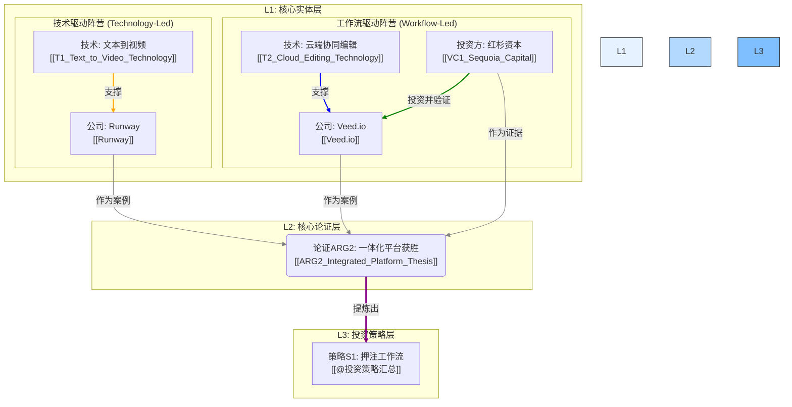

# GI1: AI视频生态知识图谱 (AI Video Ecosystem Knowledge Graph)

- **洞察ID**: GI1
- **关联实体**: `[[Runway]]`, `[[Veed.io]]`, `[[VC1_Sequoia_Capital]]`, `[[T1_Text_to_Video_Technology]]`, `[[T2_Cloud_Editing_Technology]]`
- **状态**: `初步完成 (Draft)`
- **日期**: 2025-06-11

---

## 1. 洞察概述

本文件旨在通过**知识图谱**的形式，将我们在AI视频领域分析过的所有核心实体（公司、技术、投资机构）及其相互关系进行可视化。

这个图谱直观地揭示了"技术驱动"和"工作流驱动"这两大阵营的构成，以及它们如何共同支撑起我们的核心投资论证 `[[ARG2_Integrated_Platform_Thesis]]`。它是一个动态的、可扩展的分析仪表盘。

---

## 2. AI视频生态系统知识图谱

---

## 3. 图谱解读与分析

1.  **两大阵营清晰可见**: 图谱清晰地展示了由 `Runway` 和 `T1_Text_to_Video_Technology` 构成的"技术驱动"阵营，以及由 `Veed.io`、`T2_Cloud_Editing_Technology` 和 `VC1_Sequoia_Capital` 构成的"工作流驱动"阵营。
2.  **证据链条可视化**: 从L1层的具体案例（Runway, Veed）和证据（红杉的投资），如何共同指向并支撑起L2层的核心论证 `ARG2`，这个过程一目了然。
3.  **洞察的升华路径**: 从核心论证 `ARG2` 最终提炼升华为顶级投资策略 `S1` 的路径也被清晰地呈现出来。
4.  **可扩展性**: 这个图谱是"活"的。未来当我们分析更多公司（如Pika, Captions）、技术或VC时，可以非常方便地将它们作为新的节点加入到这个图谱中，从而不断丰富和完善我们对整个生态的认知。

这个知识图谱是典型的L2层"综合洞察"的产出，它通过连接L1的分析单元，为L3的战略决策提供了坚实的可视化基础。 