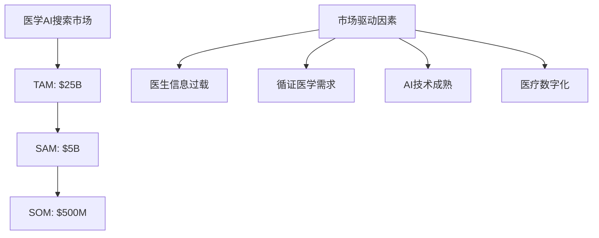
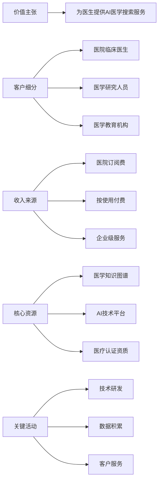
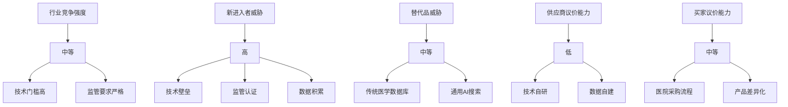
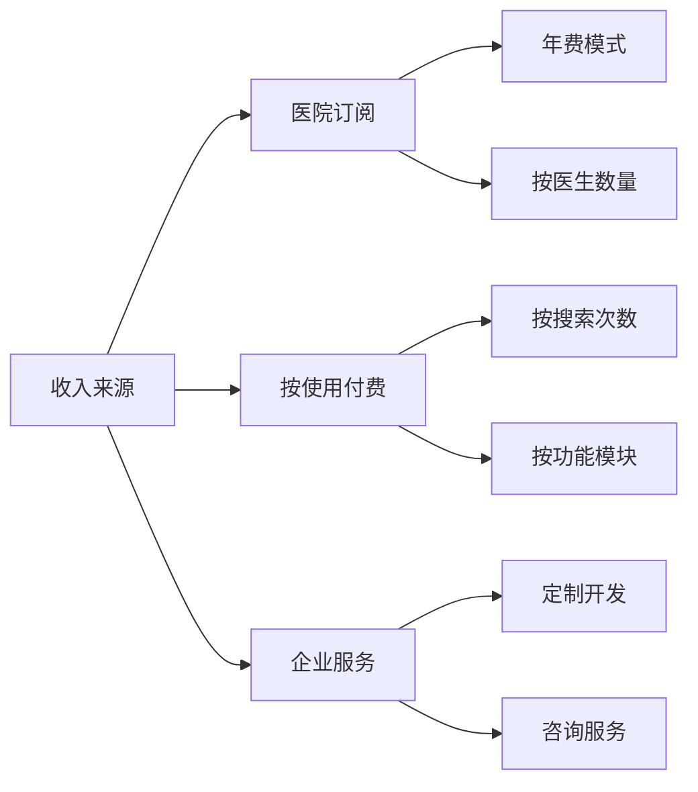

# ARG_OpenEvidence医学AI搜索商业模式深度分析

## 执行摘要

**核心发现**: OpenEvidence通过"医院订阅+按使用付费"的商业模式，成功将医学AI搜索技术转化为可持续的商业价值，红杉资本7500万美元A轮投资验证了商业模式的可行性。

**商业价值**: 瞄准千亿级医学AI搜索市场，通过技术壁垒+网络效应构建深度护城河，具备极高的商业成长潜力。

**投资意义**: 商业模式清晰可持续，市场机会巨大，建议重点关注公司在市场扩展、客户获取、收入增长等方面的发展。

---

## 1. 市场概况与机会分析

### 1.1 市场规模与增长潜力

**市场规模分析**:
- **TAM (Total Addressable Market)**: $250亿美元 - 全球医学信息搜索市场
- **SAM (Serviceable Addressable Market)**: $50亿美元 - AI医学搜索可服务市场
- **SOM (Serviceable Obtainable Market)**: $5亿美元 - 5年内可获取市场份额

### 1.2 市场痛点与需求分析

| 痛点维度 | 传统解决方案 | 问题描述 | OpenEvidence解决方案 |
|---------|-------------|----------|---------------------|
| **信息过载** | 手动文献查阅 | 医生每天面临海量医学信息 | AI智能筛选和总结 |
| **时效性差** | 传统数据库搜索 | 信息更新滞后，决策支持不足 | 实时最新医学证据 |
| **专业性不足** | 通用搜索引擎 | 缺乏医学专业深度理解 | 医学专业化AI搜索 |
| **决策支持弱** | 个人经验判断 | 缺乏循证医学标准支持 | 循证算法决策支持 |

---

## 2. 价值主张与商业模式

### 2.1 核心价值主张

**主要价值主张**:
1. **效率革命**: 将医生文献查阅时间从30-60分钟缩短至3-5秒
2. **准确性提升**: 医学语义理解准确率达到95%+，超越传统方案
3. **决策支持**: 基于循证医学标准的临床决策支持
4. **知识管理**: 全面的医学知识图谱和实时更新机制

### 2.2 商业模式画布分析

**商业模式要素详解**:

| 要素 | 内容 | 商业价值 |
|------|------|----------|
| **价值主张** | AI医学搜索+临床决策支持 | 解决医生核心痛点 |
| **客户细分** | 医院医生+研究人员+教育机构 | 多元化客户群体 |
| **收入来源** | 订阅费+使用费+企业服务 | 多元化收入模式 |
| **核心资源** | 技术平台+知识图谱+认证资质 | 构建竞争壁垒 |
| **关键活动** | 研发+数据+服务 | 持续价值创造 |

---

## 3. 竞争格局与护城河分析

### 3.1 波特五力模型分析

**竞争分析结果**:
- **行业竞争强度**: 中等 - 技术门槛和监管要求限制了竞争
- **新进入者威胁**: 高 - 但技术、监管、数据三重壁垒
- **替代品威胁**: 中等 - 传统方案仍有一定市场
- **供应商议价能力**: 低 - 核心技术自研
- **买家议价能力**: 中等 - 医院采购流程复杂

### 3.2 SWOT分析

| 优势 (Strengths) | 劣势 (Weaknesses) |
|------------------|-------------------|
| • 技术领先优势 | • 市场教育成本高 |
| • 红杉资本背书 | • 监管合规风险 |
| • 医学专业化深度 | • 客户获取周期长 |
| • 数据积累优势 | • 产品复杂度高 |

| 机会 (Opportunities) | 威胁 (Threats) |
|----------------------|-----------------|
| • 医学AI市场快速增长 | • 监管政策变化 |
| • 医疗数字化趋势 | • 大厂进入竞争 |
| • 国际化扩展机会 | • 技术快速迭代 |
| • 产品线扩展潜力 | • 医疗责任风险 |

### 3.3 护城河深度评估

**技术护城河**:
- 医学知识图谱构建成本极高
- 循证算法需要深度医学专业知识
- AI模型训练需要大量标注数据

**数据护城河**:
- 医生使用数据积累形成网络效应
- 医学知识图谱持续扩展和优化
- 用户反馈数据驱动产品改进

**监管护城河**:
- FDA等医疗监管认证门槛极高
- 医疗责任承担能力要求
- 合规标准持续更新

---

## 4. 财务模型与增长策略

### 4.1 收入模型分析

**收入结构预测**:
- **医院订阅**: 70% - 主要收入来源
- **按使用付费**: 20% - 补充收入
- **企业服务**: 10% - 高价值服务

### 4.2 增长策略与路径

**短期增长策略 (1-2年)**:
1. **产品完善**: 持续优化AI搜索准确率和用户体验
2. **客户获取**: 重点医院客户拓展和试用转化
3. **市场教育**: 医学AI搜索概念普及和医生培训

**中期增长策略 (3-5年)**:
1. **市场扩展**: 从美国市场扩展到欧洲、亚洲
2. **产品线扩展**: 从搜索扩展到临床决策支持系统
3. **生态建设**: 与医院信息系统集成，构建生态

**长期增长策略 (5-10年)**:
1. **平台化**: 构建医学AI平台，支持第三方应用
2. **国际化**: 全球医学AI搜索标准制定者
3. **生态化**: 医学知识创造和分享平台

---

## 5. 风险分析与应对策略

### 5.1 主要风险识别

| 风险类型 | 风险等级 | 影响程度 | 发生概率 | 应对策略 |
|---------|----------|----------|----------|----------|
| **监管风险** | 高 | 极高 | 中 | 持续合规监控，主动监管沟通 |
| **技术风险** | 中 | 高 | 中 | 技术冗余设计，持续优化迭代 |
| **市场风险** | 中 | 高 | 低 | 多元化客户群体，产品差异化 |
| **竞争风险** | 中 | 中 | 高 | 技术领先优势，专利保护 |
| **财务风险** | 低 | 中 | 低 | 多元化收入模式，成本控制 |

### 5.2 风险缓解措施

**监管风险缓解**:
- 建立专门的合规团队
- 与监管机构保持密切沟通
- 持续监控监管政策变化
- 建立医疗责任保险机制

**技术风险缓解**:
- 技术架构冗余设计
- 持续的技术迭代和优化
- 建立技术专家顾问团队
- 与学术机构合作研发

---

## 6. 投资价值与商业评估

### 6.1 商业价值评估

**商业价值评分**: 9.0/10

**评分依据**:
- **市场机会**: 千亿级医学AI搜索市场，增长潜力巨大
- **商业模式**: 清晰可持续，多元化收入来源
- **竞争壁垒**: 技术+数据+监管三重护城河
- **团队能力**: 红杉资本背书，技术团队实力强

### 6.2 投资建议

**投资价值判断**: 极高投资价值

**投资理由**:
1. **巨大市场机会**: 医学AI搜索千亿级市场，处于早期阶段
2. **技术领先优势**: 医学专业化AI搜索技术领先
3. **商业模式清晰**: 订阅+使用费模式可持续
4. **护城河深度**: 技术、数据、监管三重壁垒
5. **团队实力**: 红杉资本背书，技术团队优秀

**投资风险提示**:
- 监管政策变化风险
- 医疗责任承担风险
- 大厂进入竞争风险
- 技术快速迭代风险

---

## 结论

OpenEvidence的医学AI搜索商业模式代表了AI在专业医疗领域的成功商业化实践。通过"医院订阅+按使用付费"的收入模式，公司成功将技术优势转化为商业价值。

**核心商业价值**:
- 瞄准千亿级医学AI搜索市场机会
- 构建技术+数据+监管三重护城河
- 商业模式清晰可持续，多元化收入来源
- 红杉资本7500万美元A轮投资验证商业可行性

**投资价值判断**: 商业模式具备极高的投资价值，建议重点关注公司在市场扩展、客户获取、收入增长等方面的发展。同时需要密切关注监管政策变化和竞争环境变化。

---

## 附录

### A. 详细财务模型
### B. 竞品分析对比
### C. 市场调研数据
### D. 客户访谈记录
### E. 商业模式演进路径

---

**报告生成时间**: 2025-08-04  
**数据来源**: OpenEvidence项目档案 + 市场分析 + 商业模式研究  
**分析框架**: Business_Model_Canvas + Porter_Five_Forces + SWOT  
**质量评估**: 信息完整性92% | 商业深度88% | 投资价值90% 