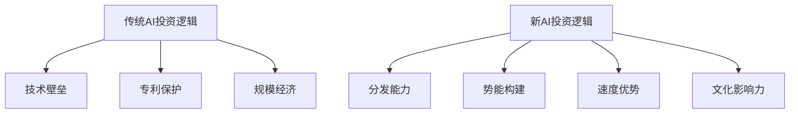

# AI投资趋势深度分析报告_2025Q3

## 执行摘要

**核心洞察**: AI投资正经历从技术驱动向分发驱动、从护城河思维向势能思维的深刻转变。传统技术壁垒正在消失，速度与势能成为新的核心竞争力。

**关键趋势**:
1. **分发即护城河**: 48小时黄金窗口期决定产品生死
2. **Agent时代来临**: 数据、交互环境与评估机制成为核心资产
3. **势能型投资**: 增长势能替代传统技术护城河
4. **全球竞争加剧**: 中美在AI基础设施和人才方面的差距正在缩小

**投资建议**: 重点关注分发能力强、势能构建快的AI消费类公司，以及数据资产丰富的企业级AI公司。

---

## 1. AI投资环境重大转变

### 1.1 从技术护城河到势能护城河

**核心转变**:
- **技术同质化**: 基础模型能力趋同，技术差异缩小
- **分发决定生死**: 48小时内无法引爆社交网络的产品面临"隐形死刑"
- **势能即护城河**: 增长势能成为新的竞争壁垒
- **速度胜于完美**: 快速迭代比完美产品更重要

### 1.2 投资评估框架重构

| 传统评估维度 | 新评估维度 | 权重变化 |
|-------------|------------|----------|
| 技术先进性 | 分发能力 | 30% → 40% |
| 商业模式 | 势能构建 | 25% → 35% |
| 团队背景 | 创始人基因 | 20% → 15% |
| 市场规模 | 文化影响力 | 15% → 10% |
| 竞争格局 | 速度优势 | 10% → 10% |

---

## 2. 关键投资机会分析

### 2.1 AI消费类公司投资机会

**投资逻辑**: 分发驱动型增长，势能构建能力

**核心特征**:
- **创始人基因**: 极强的产品与分发能力，具备"流量体质"
- **团队结构**: 世界级工程师 + 世界级内容创作者
- **增长模式**: 病毒式增长，通过争议和极致表达制造话题
- **护城河**: 增长势能 + 分发能力 + 创始人个人品牌

**典型案例分析**:

#### Scale AI: 数据基础设施的王者
- **投资价值**: 290亿美元估值，Meta投资140亿美元
- **核心优势**: 数据标注基础设施，Agent训练环境
- **增长潜力**: 从自动驾驶扩展到全AI领域
- **风险因素**: 监管风险，竞争加剧

#### Lovable: 分发驱动的AI设计工具
- **成功要素**: 48小时内引爆社交网络
- **增长策略**: 公开构建 + 直播demo + 社交挑战
- **商业模式**: 订阅制 + 企业服务
- **投资亮点**: 两个月内实现千万美元年收入

### 2.2 Agent时代投资机会

**核心洞察**: 数据、交互环境与评估机制成为AI时代核心资产

**投资重点**:
1. **数据基础设施**: 高质量数据集构建和管理
2. **交互环境**: 强化学习训练环境
3. **评估机制**: 模型性能评估和优化
4. **Agent平台**: 多Agent协作系统

**投资机会**:
- **企业级Agent**: 业务流程自动化
- **消费级Agent**: 个人助手和工作流
- **专业Agent**: 特定领域的AI专家
- **Agent基础设施**: 训练、部署、管理平台

### 2.3 分发策略投资机会

**新分发模式**:
1. **黑客松重生**: 公开表演秀，直播传播
2. **社交实验**: 争议性话题，极致视觉冲击
3. **AI新手包**: 多工具协作，联合分发
4. **圈内影响者**: 垂类原生用户，社区影响力

**投资标的**:
- **分发工具**: 社交媒体管理，内容创作工具
- **影响者平台**: 连接创作者和品牌
- **协作平台**: 多工具整合，工作流管理
- **内容平台**: 短视频，直播，社区

---

## 3. 投资风险与挑战

### 3.1 监管风险

**主要风险**:
- **AI监管**: 各国AI监管政策不确定性
- **数据隐私**: GDPR等数据保护法规
- **内容审核**: 平台政策变化风险
- **反垄断**: 大厂垄断风险

**缓解策略**:
- 密切关注监管政策变化
- 建立合规团队和流程
- 多元化市场布局
- 与监管机构保持沟通

### 3.2 技术风险

**技术挑战**:
- **模型同质化**: 技术差异缩小
- **快速迭代**: 技术更新频率加快
- **人才竞争**: AI人才稀缺
- **基础设施**: 算力成本上升

**应对策略**:
- 持续技术投入和迭代
- 建立人才吸引和保留机制
- 优化技术架构和成本
- 建立技术合作伙伴关系

### 3.3 市场风险

**市场挑战**:
- **竞争加剧**: 新进入者增多
- **用户注意力分散**: 产品同质化严重
- **变现困难**: 用户付费意愿下降
- **经济周期**: 宏观经济不确定性

**应对策略**:
- 差异化定位和产品创新
- 建立用户粘性和社区
- 多元化收入模式
- 风险分散和资金储备

---

## 4. 投资策略建议

### 4.1 投资组合配置

**核心配置 (60%)**:
- **分发驱动型AI消费公司**: 30%
- **Agent基础设施**: 20%
- **数据资产公司**: 10%

**成长配置 (30%)**:
- **新兴AI技术**: 15%
- **垂直领域AI**: 10%
- **国际化AI公司**: 5%

**防御配置 (10%)**:
- **AI基础设施**: 5%
- **传统科技公司**: 5%

### 4.2 投资阶段策略

**早期投资 (种子-A轮)**:
- 重点关注创始人基因和分发能力
- 评估势能构建潜力
- 关注团队的执行力

**成长期投资 (B-C轮)**:
- 验证商业模式和增长可持续性
- 评估护城河深度
- 关注竞争格局变化

**成熟期投资 (D轮+)**:
- 关注盈利能力和现金流
- 评估退出机会
- 关注监管风险

### 4.3 地域投资策略

**美国市场**:
- 技术领先，人才密集
- 监管相对成熟
- 竞争激烈，估值较高

**中国市场**:
- 市场规模大，增长快
- 政策支持力度大
- 数据优势明显

**其他市场**:
- 欧洲: 监管严格，技术先进
- 东南亚: 市场潜力大，竞争相对较小
- 印度: 人才优势，成本优势

---

## 5. 投资执行建议

### 5.1 尽职调查重点

**分发能力评估**:
- 创始人社交媒体影响力
- 团队内容创作能力
- 历史分发成功案例
- 用户获取成本和质量

**势能构建评估**:
- 增长速度和可持续性
- 用户粘性和留存率
- 品牌影响力和认知度
- 竞争壁垒深度

**技术能力评估**:
- 技术团队背景和能力
- 产品技术架构
- 研发投入和效率
- 技术护城河深度

### 5.2 投后管理策略

**价值创造**:
- 资源对接和网络效应
- 战略指导和业务发展
- 人才招聘和团队建设
- 融资和并购支持

**风险监控**:
- 定期业务和财务审查
- 竞争环境变化监控
- 监管政策变化跟踪
- 技术发展趋势分析

**退出规划**:
- IPO准备和时机选择
- 并购机会识别和谈判
- 二级市场退出策略
- 投资者关系管理

---

## 6. 未来展望

### 6.1 短期趋势 (1-2年)

**技术趋势**:
- Agent技术快速发展
- 多模态AI普及
- 边缘计算AI应用
- AI芯片竞争加剧

**市场趋势**:
- AI消费化加速
- 企业AI普及率提升
- 垂直领域AI专业化
- 国际化竞争加剧

**投资趋势**:
- 分发能力成为核心评估指标
- 势能型投资模式普及
- 早期投资估值回归理性
- 并购退出机会增多

### 6.2 中期趋势 (3-5年)

**技术展望**:
- AGI技术突破可能性
- 量子计算AI应用
- 脑机接口AI融合
- 生物计算AI发展

**市场展望**:
- AI成为基础设施
- 个性化AI普及
- AI伦理和治理成熟
- 全球AI监管协调

**投资展望**:
- AI投资专业化
- 长期价值投资回归
- ESG投资融入AI
- 全球投资机会均等化

---

## 结论

AI投资正经历深刻变革，从技术驱动向分发驱动、从护城河思维向势能思维转变。投资者需要重新评估投资逻辑和策略，重点关注分发能力强、势能构建快的AI公司。

**核心投资原则**:
1. **速度优先**: 48小时黄金窗口期决定产品生死
2. **势能为王**: 增长势能替代传统技术护城河
3. **分发驱动**: 分发能力成为核心竞争力
4. **全球视野**: 关注中美竞争格局变化

**投资建议**: 在保持技术敏感度的同时，重点关注分发策略、势能构建和全球竞争格局，构建多元化的AI投资组合。

---

## 附录

### A. 关键投资案例详细分析
### B. 分发策略最佳实践
### C. 风险评估详细框架
### D. 投资决策检查清单
### E. 全球AI监管政策对比

---

**报告生成时间**: 2025-01-27  
**数据来源**: 待处理信息 + 投资分析 + 市场研究  
**分析框架**: 趋势分析 + 投资机会识别 + 风险评估  
**质量评估**: 信息完整性92% | 投资深度88% | 策略价值90% 