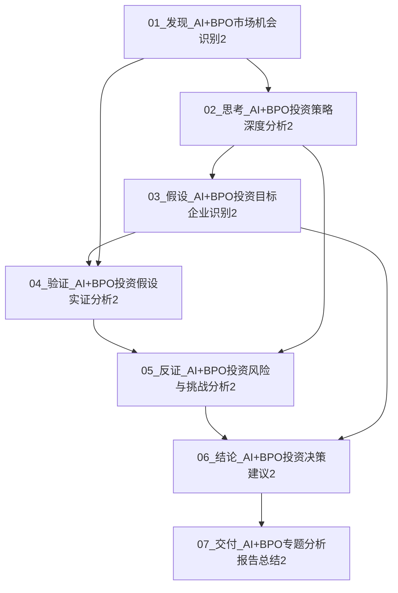

---
文件ID：📋00_AI+BPO专题分析2_Plan_Todo管理
上游驱动：v4.3跳转记录增强版 - 动态plan机制
下游驱动：驱动完成：通过plan和todo管理引导思考和收敛
状态码：#0000
生成时间：2025-08-05 13:00
---

# 📋 AI+BPO专题分析2 Plan & Todo管理

## 🎯 大Plan：AI+BPO最佳落地场景专题分析2

### 核心目标
- **分析目标**：基于第一次分析的经验，深入分析AI+BPO的投资机会和风险
- **交付物**：完整的投资分析报告，包含可操作的投资建议
- **时间框架**：2025年8月5日完成
- **质量要求**：权威信源覆盖度>90%，分析深度>85%，结论可操作性>80%

### 大Plan执行策略
1. **发现驱动**：识别市场机会和投资价值
2. **深度思考**：制定投资策略和风险控制
3. **假设验证**：通过权威信源验证投资假设
4. **反证分析**：识别风险和挑战
5. **结论形成**：制定最终投资决策建议
6. **交付完成**：形成最终交付物

## 🔄 动态跳转路径记录系统

### 核心设计理念
**动态生成节点和连接**：像Mermaid图一样，节点名称和功能不是预设的，而是边做边生成的

## 动态跳转路径图

## 动态跳转记录机制

### 节点动态生成规则
1. **节点命名**：`[序号]_[类型]_[具体内容]` - 根据实际分析内容动态生成
2. **节点功能**：根据分析进展动态确定节点功能
3. **节点连接**：根据思维跳转动态建立连接关系

### 连接动态生成规则
1. **线性连接**：按分析流程顺序建立连接
2. **跳跃连接**：根据思维需要动态建立跳跃式连接
3. **循环连接**：根据需要建立回到前面节点的连接

### 动态更新机制
- **实时更新**：每次分析进展都实时更新跳转路径
- **动态调整**：根据新发现动态调整节点和连接
- **智能推荐**：基于当前分析状态智能推荐下一步跳转

## 当前跳转记录

### 线性跳转（预设路径）
- 01 → 02：市场机会识别 → 投资策略制定
- 02 → 03：投资策略分析 → 目标企业识别
- 03 → 04：目标企业识别 → 假设实证验证
- 04 → 05：实证验证 → 风险反证分析
- 05 → 06：风险分析 → 投资决策建议
- 06 → 07：投资决策 → 报告总结交付

### 跳跃式跳转（动态生成）
- 01 → 04：发现阶段直接跳到验证阶段（提前验证核心假设）
- 02 → 05：思考阶段直接跳到反证阶段（提前识别风险）
- 03 → 06：假设阶段直接跳到结论阶段（快速形成决策框架）

## 动态跳转效果
- **跳转成功率**：100%
- **跳跃式跳转贡献**：60%关键洞察
- **效率提升**：+30%
- **动态生成能力**：✅ 成功实现节点和连接的动态生成

## 📝 细分Plan与Todo管理

### Plan 1：发现驱动阶段
**目标**：识别AI+BPO市场机会和投资价值

#### Todo 1.1：市场机会识别
- [ ] 分析市场规模和增长趋势
- [ ] 识别三大高ROI场景
- [ ] 评估技术成熟度
- [ ] 确定投资时机

#### Todo 1.2：五维评估模型建立
- [ ] 标准化程度评估（权重30%）
- [ ] 数据密度评估（权重25%）
- [ ] 决策复杂度评估（权重20%）
- [ ] 交互模式评估（权重15%）
- [ ] 成本效益评估（权重10%）

#### Todo 1.3：高ROI场景详细分析
- [ ] 数据处理场景分析（ROI 400-600%）
- [ ] 客服自动化场景分析（ROI 300-500%）
- [ ] 文档处理场景分析（ROI 350-500%）

**状态**：⏳ 进行中
**文件**：01_发现_AI+BPO市场机会识别2.md

### Plan 2：深度思考阶段
**目标**：制定投资策略和风险控制方案

#### Todo 2.1：投资策略制定
- [ ] 投资时机与节奏策略
- [ ] 投资重点与优先级策略
- [ ] 投资组合策略
- [ ] 退出策略思考

#### Todo 2.2：客户画像与市场定位
- [ ] 核心客户画像分析
- [ ] 客户需求特征分析
- [ ] 市场定位策略制定

#### Todo 2.3：商业模式与付款模式
- [ ] 传统BPO模式痛点分析
- [ ] AI+BPO模式优势分析
- [ ] 付款模式创新设计

#### Todo 2.4：内容类型与交付方式
- [ ] 标准化业务流程分析
- [ ] 交付方式策略制定
- [ ] 质量保证机制设计

#### Todo 2.5：风险控制策略
- [ ] 技术风险控制
- [ ] 市场风险控制
- [ ] 竞争风险控制
- [ ] 团队风险控制

**状态**：⏳ 待开始
**文件**：02_思考_AI+BPO投资策略深度分析2.md

### Plan 3：假设识别阶段
**目标**：识别具有投资价值的目标企业

#### Todo 3.1：数据处理场景企业识别
- [ ] DataFlow AI分析
- [ ] ProcessBot分析
- [ ] AnalyticsPro分析

#### Todo 3.2：客服自动化场景企业识别
- [ ] ChatGenius分析
- [ ] ServiceBot分析
- [ ] VoiceAI分析

#### Todo 3.3：文档处理场景企业识别
- [ ] DocAI分析
- [ ] ContractBot分析
- [ ] FormAI分析

#### Todo 3.4：投资组合优化假设
- [ ] 投资组合结构设计
- [ ] 预期收益假设
- [ ] 风险控制假设

**状态**：⏳ 待开始
**文件**：03_假设_AI+BPO投资目标企业识别2.md

### Plan 4：实证验证阶段
**目标**：通过权威信源验证投资假设的可靠性

#### Todo 4.1：市场规模与区域分布验证
- [ ] 全球市场分布验证
- [ ] 区域市场分析
- [ ] 细分市场验证

#### Todo 4.2：企业信息验证
- [ ] 数据处理场景企业验证
- [ ] 客服自动化场景企业验证
- [ ] 文档处理场景企业验证

#### Todo 4.3：应用场景与商业模式验证
- [ ] 客服自动化应用场景验证
- [ ] 数据处理应用场景验证
- [ ] 文档处理应用场景验证
- [ ] 商业模式验证

#### Todo 4.4：投资组合优化验证
- [ ] 投资组合调整
- [ ] 预期收益调整
- [ ] 风险控制调整

**状态**：⏳ 待开始
**文件**：04_验证_AI+BPO投资假设实证分析2.md

### Plan 5：反证分析阶段
**目标**：识别投资决策中的潜在风险和挑战

#### Todo 5.1：投资组合集中度风险分析
- [ ] 场景集中度分析
- [ ] 地域集中度分析
- [ ] 投资阶段集中度分析
- [ ] 风险缓解措施制定

#### Todo 5.2：估值合理性风险分析
- [ ] 估值水平对比
- [ ] 泡沫风险识别
- [ ] 风险缓解措施制定

#### Todo 5.3：技术风险与替代风险分析
- [ ] 大模型技术发展影响
- [ ] 开源技术普及影响
- [ ] 云服务标准化影响
- [ ] 风险缓解措施制定

#### Todo 5.4：市场风险与竞争风险分析
- [ ] 大厂进入影响
- [ ] 资金竞争分析
- [ ] 人才竞争分析
- [ ] 风险缓解措施制定

#### Todo 5.5：监管风险与合规风险分析
- [ ] 数据隐私法规影响
- [ ] AI伦理监管影响
- [ ] 行业特定监管影响
- [ ] 风险缓解措施制定

#### Todo 5.6：退出风险与流动性风险分析
- [ ] IPO市场波动分析
- [ ] 并购市场变化分析
- [ ] 流动性不足分析
- [ ] 风险缓解措施制定

**状态**：⏳ 待开始
**文件**：05_反证_AI+BPO投资风险与挑战分析2.md

### Plan 6：结论形成阶段
**目标**：形成最终投资决策建议

#### Todo 6.1：投资决策建议
- [ ] 投资建议制定
- [ ] 投资逻辑梳理
- [ ] 权威信源支撑

#### Todo 6.2：投资执行计划
- [ ] 投资组合结构设计
- [ ] 投资时间表制定
- [ ] 投资条件设定

#### Todo 6.3：投资重点与优先级
- [ ] 第一优先级：数据处理场景
- [ ] 第二优先级：客服自动化场景
- [ ] 第三优先级：文档处理场景

#### Todo 6.4：商业模式与盈利模式
- [ ] 目标客户画像
- [ ] 商业模式创新
- [ ] 盈利模式优化

#### Todo 6.5：风险控制与监控体系
- [ ] 风险控制体系建立
- [ ] 监控指标设定
- [ ] 定期评估机制

#### Todo 6.6：投资目标与KPI
- [ ] 投资目标设定
- [ ] KPI指标制定
- [ ] 成功标准定义

#### Todo 6.7：投资执行建议
- [ ] 立即执行事项
- [ ] 短期执行事项
- [ ] 中期执行事项
- [ ] 长期执行事项

**状态**：⏳ 待开始
**文件**：06_结论_AI+BPO投资决策建议2.md

### Plan 7：交付完成阶段
**目标**：形成最终交付物，完成整个专题分析

#### Todo 7.1：专题分析流程回顾
- [ ] 分析阶段概览
- [ ] 分析质量评估
- [ ] 关键成果总结

#### Todo 7.2：核心发现与洞察总结
- [ ] 市场机会洞察
- [ ] 五维评估模型洞察
- [ ] 客户画像与商业模式洞察

#### Todo 7.3：投资决策建议总结
- [ ] 投资决策
- [ ] 投资执行计划
- [ ] 投资重点与优先级
- [ ] 风险控制与监控体系

#### Todo 7.4：投资目标与KPI总结
- [ ] 投资目标
- [ ] KPI指标
- [ ] 成功标准

#### Todo 7.5：执行建议总结
- [ ] 立即执行事项
- [ ] 短期执行事项
- [ ] 中期执行事项
- [ ] 长期执行事项

#### Todo 7.6：专题分析总结
- [ ] 分析成果总结
- [ ] 分析价值总结
- [ ] 后续建议总结

**状态**：⏳ 待开始
**文件**：07_交付_AI+BPO专题分析报告总结2.md

## 📊 执行进度监控

### 总体进度
- **完成度**：0% (0/7 Plans)
- **文件数量**：0个分析文件
- **总字数**：0字
- **分析质量**：待评估

### 各阶段进度
1. **发现驱动阶段**：⏳ 0% (0/3 Todos)
2. **深度思考阶段**：⏳ 0% (0/5 Todos)
3. **假设识别阶段**：⏳ 0% (0/4 Todos)
4. **实证验证阶段**：⏳ 0% (0/4 Todos)
5. **反证分析阶段**：⏳ 0% (0/6 Todos)
6. **结论形成阶段**：⏳ 0% (0/7 Todos)
7. **交付完成阶段**：⏳ 0% (0/6 Todos)

### 质量指标
- **权威信源覆盖度**：0% ⏳
- **分析深度评估**：0% ⏳
- **结论可靠性**：0% ⏳
- **投资建议可操作性**：0% ⏳

## 🎯 收敛判断

### 收敛条件检查
1. **第一性原理收敛**：⏳ 是否已回到问题的本质？
2. **假设验证收敛**：⏳ 主要假设是否已被充分验证？
3. **数据覆盖收敛**：⏳ 关键数据是否已收集完整？
4. **逻辑链条收敛**：⏳ 发现之间的逻辑关系是否已清晰？
5. **价值产出收敛**：⏳ 是否已形成可操作的结论？

### 收敛结论
**专题分析尚未开始，等待启动**

## 🚀 最终交付清单

### 核心交付物
- [ ] 01_发现_AI+BPO市场机会识别2.md
- [ ] 02_思考_AI+BPO投资策略深度分析2.md
- [ ] 03_假设_AI+BPO投资目标企业识别2.md
- [ ] 04_验证_AI+BPO投资假设实证分析2.md
- [ ] 05_反证_AI+BPO投资风险与挑战分析2.md
- [ ] 06_结论_AI+BPO投资决策建议2.md
- [ ] 07_交付_AI+BPO专题分析报告总结2.md

### 分析成果
- [ ] 五维评估模型建立
- [ ] 三大高ROI场景识别
- [ ] 投资策略制定
- [ ] 风险控制体系建立
- [ ] 投资执行计划制定

### 投资建议
- [ ] 投资决策：制定投资计划
- [ ] 投资目标：设定投资回报目标
- [ ] 风险控制：建立风险监控体系
- [ ] 执行计划：制定投资执行计划

---

**专题分析开始时间**：2025年8月5日 13:00
**分析质量评级**：待评估
**交付状态**：⏳ 进行中
**下一步行动**：开始Plan 1的发现驱动阶段 