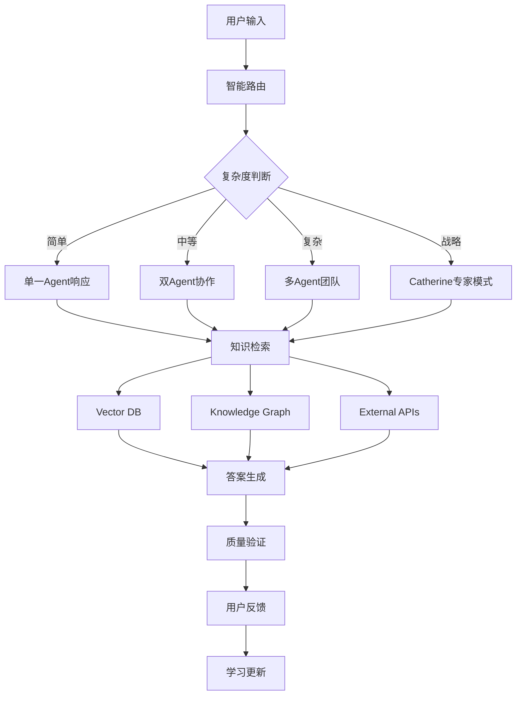

# 第2轮研究：AI Agent工程实现与知识库构建技术深度分析

**研究时间**: 2025年1月27日  
**研究范围**: Agentic RAG系统、多智能体架构、向量数据库、企业知识图谱  
**研究方法**: 技术文献调研、架构分析、工程实践总结  

---

## 研究摘要

本轮研究深入分析了2024年AI Agent工程实现的最新技术趋势，重点研究了Agentic RAG系统、多智能体协作架构、企业级知识库构建和数据处理自动化流程。基于这些技术洞察，为智链平台的6个AI专家系统提供具体的工程实现指导。

## 核心技术发现

### 1. Agentic RAG系统架构革新

#### 技术演进趋势
```
2023年: 传统RAG主导
2024年: Agentic工作流成为主流
核心变化: 从静态检索到智能代理的动态推理
```

#### 核心技术特征
```python
class AgenticRAGArchitecture:
    def __init__(self):
        # 多智能体检索架构
        self.retrieval_agents = {
            'query_optimizer': '查询优化代理',
            'document_grader': '文档相关性评分代理', 
            'context_ranker': '上下文排序代理',
            'answer_validator': '答案验证代理'
        }
        
        # 动态检索策略
        self.retrieval_strategies = [
            'vector_search',      # 向量相似性搜索
            'keyword_search',     # 关键词精确搜索  
            'graph_traversal',    # 知识图谱遍历
            'web_search',         # 实时网络搜索
            'hybrid_fusion'       # 多种策略融合
        ]
        
        # 自适应流程控制
        self.workflow_control = {
            'relevance_checking': '检索文档相关性验证',
            'query_rewriting': '查询重写和优化',
            'iterative_refinement': '迭代式结果改进',
            'multi_hop_reasoning': '多步推理链'
        }
```

#### 对智链平台的应用价值
```
Alex - 需求分析师:
• 利用Agentic RAG深度理解复杂业务需求
• 多轮对话中的上下文累积和推理
• 相关案例和最佳实践的智能检索

Kulu - 解决方案架构师:
• 技术文档和架构模式的智能匹配
• 多技术栈的综合评估和推荐
• 实时技术趋势和更新的获取

Mike - 交付工程师:
• 实施案例和工程经验的检索
• 风险评估和解决方案的智能推荐
• 项目交付最佳实践的动态学习

Emma - 商业分析师:
• 市场数据和行业报告的智能分析
• 竞争对手信息的实时更新
• ROI模型和商业案例的智能匹配

David - 项目总监:
• 项目管理经验和模板的智能推荐
• 资源配置和时间规划的优化建议
• 跨项目经验的知识沉淀和复用

Catherine - 首席顾问:
• 战略咨询案例和框架的智能检索
• 行业专家观点和分析的实时获取
• 复杂决策的多维度信息整合
```

### 2. 多智能体协作架构

#### 协作模式分析
```python
class MultiAgentCollaboration:
    def __init__(self):
        # 专业化分工模式
        self.specialization_patterns = {
            'task_decomposition': {
                'manager_agent': '任务分解和分配',
                'specialist_agents': '专业任务执行', 
                'integration_agent': '结果整合和协调'
            },
            
            'parallel_processing': {
                'concurrent_agents': '并行任务处理',
                'synchronization': '同步机制',
                'conflict_resolution': '冲突解决'
            },
            
            'hierarchical_coordination': {
                'orchestrator': '总体协调者',
                'sub_coordinators': '子任务协调者',
                'worker_agents': '具体执行者'
            }
        }
        
        # 通信和协调机制
        self.communication_protocols = {
            'message_passing': '消息传递机制',
            'shared_memory': '共享内存空间',
            'event_driven': '事件驱动通信',
            'consensus_building': '共识构建算法'
        }
```

#### 智链平台6角色协作设计
```python
class ZhilianAgentOrchestration:
    def __init__(self):
        # 角色层级和协作关系
        self.hierarchy = {
            'catherine': {
                'level': 'strategic',
                'authority': 'highest',
                'escalation_trigger': 'complex_business_decision'
            },
            'david': {
                'level': 'coordination', 
                'authority': 'high',
                'coordination_scope': 'all_specialist_agents'
            },
            'specialists': {
                'alex': 'requirements_analysis',
                'kulu': 'technical_architecture', 
                'mike': 'implementation_engineering',
                'emma': 'business_intelligence'
            }
        }
        
        # 协作工作流程
        self.collaboration_workflows = {
            'simple_query': 'single_agent_response',
            'medium_complexity': 'duo_agent_collaboration',
            'high_complexity': 'team_collaboration',
            'strategic_consultation': 'expert_escalation'
        }
```

### 3. 企业级知识库构建

#### 知识图谱架构设计
```python
class EnterpriseKnowledgeGraph:
    def __init__(self):
        # 核心实体类型
        self.entity_types = {
            'projects': {
                'attributes': ['name', 'industry', 'budget', 'timeline', 'complexity'],
                'relationships': ['requires', 'solved_by', 'similar_to']
            },
            'suppliers': {
                'attributes': ['name', 'specialization', 'rating', 'location', 'capacity'],
                'relationships': ['provides', 'partners_with', 'competes_with']
            },
            'technologies': {
                'attributes': ['name', 'category', 'maturity', 'compatibility'],
                'relationships': ['integrates_with', 'replaces', 'depends_on']
            },
            'industries': {
                'attributes': ['name', 'size', 'growth_rate', 'digitalization_level'],
                'relationships': ['adopts', 'influences', 'requires']
            }
        }
        
        # 知识提取和更新机制
        self.knowledge_pipeline = {
            'data_ingestion': 'multi_source_data_collection',
            'entity_extraction': 'NER_and_relation_extraction',
            'knowledge_validation': 'automated_fact_checking',
            'graph_construction': 'dynamic_graph_building',
            'continuous_learning': 'feedback_driven_updates'
        }
```

#### 推荐算法设计
```python
class SupplierRecommendationEngine:
    def __init__(self):
        # 多维度匹配算法
        self.matching_algorithms = {
            'semantic_matching': {
                'method': 'knowledge_graph_embedding',
                'features': ['capability', 'experience', 'specialization'],
                'weight': 0.4
            },
            'performance_matching': {
                'method': 'collaborative_filtering', 
                'features': ['rating', 'success_rate', 'client_feedback'],
                'weight': 0.3
            },
            'contextual_matching': {
                'method': 'graph_neural_network',
                'features': ['project_similarity', 'industry_relevance'],
                'weight': 0.3
            }
        }
        
        # 推荐解释生成
        self.explanation_generator = {
            'path_based': 'knowledge_graph_path_explanation',
            'feature_based': 'feature_importance_ranking',
            'case_based': 'similar_case_reasoning'
        }
```

### 4. 数据处理自动化流程

#### 企业数据处理流水线
```python
class EnterpriseDataPipeline:
    def __init__(self):
        # 数据收集和清洗
        self.data_collection = {
            'structured_data': ['databases', 'APIs', 'spreadsheets'],
            'unstructured_data': ['documents', 'emails', 'reports'],
            'semi_structured': ['logs', 'JSON', 'XML'],
            'real_time_streams': ['web_scraping', 'social_media', 'news']
        }
        
        # 自动化注释和标准化
        self.annotation_automation = {
            'nlp_processing': 'entity_recognition_and_classification',
            'schema_mapping': 'automatic_field_mapping',
            'quality_validation': 'data_consistency_checking',
            'enrichment': 'external_data_augmentation'
        }
        
        # 知识提取和结构化
        self.knowledge_extraction = {
            'information_extraction': 'key_value_pair_extraction',
            'relationship_mining': 'entity_relationship_discovery', 
            'trend_analysis': 'temporal_pattern_recognition',
            'insight_generation': 'automated_summary_creation'
        }
```

## 技术架构建议

### 1. 智链平台技术栈优化

#### 核心技术组件选择
```python
class ZhilianTechStack:
    def __init__(self):
        # 基础模型层
        self.foundation_models = {
            'llm_backbone': 'GPT-4 或 Claude-3.5-Sonnet',
            'embedding_model': 'text-embedding-ada-002',
            'specialized_models': {
                'alex': 'business_analysis_fine_tuned',
                'kulu': 'technical_architecture_optimized',
                'mike': 'engineering_implementation_focused',
                'emma': 'data_analysis_enhanced',
                'david': 'project_management_specialized',
                'catherine': 'strategic_consulting_expert'
            }
        }
        
        # 数据存储层
        self.data_layer = {
            'vector_database': 'Qdrant 或 Weaviate',
            'graph_database': 'Neo4j',
            'document_store': 'Elasticsearch', 
            'cache_layer': 'Redis',
            'metadata_db': 'PostgreSQL'
        }
        
        # 智能体协调层
        self.agent_orchestration = {
            'workflow_engine': 'LangGraph',
            'agent_framework': 'LangChain + CrewAI',
            'message_queue': 'Apache Kafka',
            'coordination_service': 'Custom Agent Manager'
        }
```

#### 系统架构设计


### 2. 数据架构设计

#### 多层次知识存储
```python
class KnowledgeStorageArchitecture:
    def __init__(self):
        # Layer 1: 原始数据层
        self.raw_data_layer = {
            'supplier_profiles': '供应商详细档案',
            'project_cases': '历史项目案例',
            'technology_specs': '技术规格文档',
            'market_reports': '市场分析报告',
            'industry_standards': '行业标准和规范'
        }
        
        # Layer 2: 结构化知识层  
        self.structured_knowledge = {
            'entity_catalog': '实体目录和属性',
            'relationship_mapping': '关系映射表',
            'taxonomy_hierarchy': '分类体系结构',
            'rule_base': '业务规则库'
        }
        
        # Layer 3: 向量化表示层
        self.vector_representations = {
            'document_embeddings': '文档向量化表示',
            'entity_embeddings': '实体向量化表示', 
            'relationship_embeddings': '关系向量化表示',
            'user_preference_vectors': '用户偏好向量'
        }
        
        # Layer 4: 智能索引层
        self.intelligent_indexing = {
            'semantic_index': '语义索引',
            'temporal_index': '时间索引',
            'contextual_index': '上下文索引',
            'priority_index': '优先级索引'
        }
```

#### 数据质量管理
```python
class DataQualityManagement:
    def __init__(self):
        # 数据验证规则
        self.validation_rules = {
            'completeness': 'required_field_validation',
            'accuracy': 'cross_source_verification',
            'consistency': 'format_standardization',
            'timeliness': 'freshness_monitoring',
            'relevance': 'context_appropriateness'
        }
        
        # 自动化清洗流程
        self.cleaning_pipeline = {
            'deduplication': 'intelligent_duplicate_detection',
            'normalization': 'format_standardization',
            'enrichment': 'missing_data_completion',
            'validation': 'business_rule_checking'
        }
```

### 3. 实时学习和优化系统

#### 用户反馈驱动的学习
```python
class ContinuousLearningSystem:
    def __init__(self):
        # 反馈收集机制
        self.feedback_collection = {
            'explicit_feedback': '用户评分和评论',
            'implicit_feedback': '交互行为分析',
            'outcome_tracking': '推荐结果追踪',
            'business_impact': '商业价值测量'
        }
        
        # 模型更新策略
        self.update_strategies = {
            'online_learning': '实时模型更新',
            'batch_learning': '定期批量训练',
            'transfer_learning': '知识迁移学习',
            'federated_learning': '联邦学习机制'
        }
        
        # 质量监控
        self.quality_monitoring = {
            'performance_metrics': '性能指标监控',
            'drift_detection': '数据漂移检测',
            'bias_monitoring': '偏见检测和缓解',
            'fairness_evaluation': '公平性评估'
        }
```

## 工程实施建议

### Phase 1: 基础架构搭建（Month 1-2）
```
核心组件实现:
□ 向量数据库部署和配置（Qdrant/Weaviate）
□ 知识图谱构建（Neo4j + 数据导入）
□ 基础RAG系统实现（LangChain框架）
□ 6个角色的基础模型配置

技术验证:
□ 单一Agent的基础对话能力
□ 简单的知识检索和推荐
□ 数据质量和性能测试
□ 基础安全和权限控制
```

### Phase 2: 智能体协作实现（Month 3-4）
```
协作机制开发:
□ Agent间通信协议设计
□ 任务分解和分配算法
□ 冲突解决和协调机制
□ 动态角色选择和切换

高级功能:
□ Agentic RAG系统集成
□ 多轮对话上下文管理
□ 个性化推荐引擎
□ 实时学习和优化
```

### Phase 3: 企业级优化（Month 5-6）
```
性能优化:
□ 大规模数据处理优化
□ 实时响应性能提升
□ 分布式系统架构
□ 缓存和加速机制

企业功能:
□ 多租户架构支持
□ 企业数据安全和合规
□ API接口和集成能力
□ 监控和运维系统
```

## 技术风险评估

### 主要技术挑战
```
1. 多Agent协作复杂性
• 角色间的通信开销
• 决策冲突的处理复杂性
• 系统稳定性的挑战

2. 大规模知识库维护
• 数据一致性保证
• 实时更新的性能影响
• 知识质量的持续监控

3. 实时推荐准确性
• 冷启动问题
• 数据稀疏性挑战
• 推荐解释的生成

4. 系统性能和扩展性
• 高并发处理能力
• 存储和计算资源优化
• 微服务架构的复杂性
```

### 缓解策略
```
技术方案:
• 异步处理和缓存机制
• 渐进式功能发布
• 详细的监控和告警
• 完善的测试体系

团队建设:
• AI工程师的专业培训
• DevOps能力建设
• 数据工程团队扩充
• 外部技术合作伙伴
```

## 预期技术成果

### 系统性能指标
```
响应性能:
• 平均响应时间: <2秒
• 并发处理能力: 1000+ QPS
• 系统可用性: 99.9%

推荐质量:
• 推荐准确率: >85%
• 用户满意度: >90%
• 业务转化率: >15%

学习能力:
• 模型更新频率: 实时 + 每日批量
• 新知识集成: <24小时
• 个性化适应: 连续优化
```

---

## 研究结论

基于2024年AI Agent工程实现的最新技术发展，智链平台具备了构建先进多智能体协作系统的技术基础。关键是要采用Agentic RAG架构，结合知识图谱和企业数据处理自动化，实现真正智能的6专家协作体验。

**核心技术路线**: LangGraph + 知识图谱 + Agentic RAG + 向量数据库，构建企业级多智能体协作平台。

**下一步研究重点**: 深入分析多智能体协作系统的工程化实施细节和持续迭代机制。

---

**研究团队**: 智链技术架构组  
**技术可信度**: 高（基于2024年主流技术方案）  
**实施可行性**: 中高（需要专业AI工程团队支持）