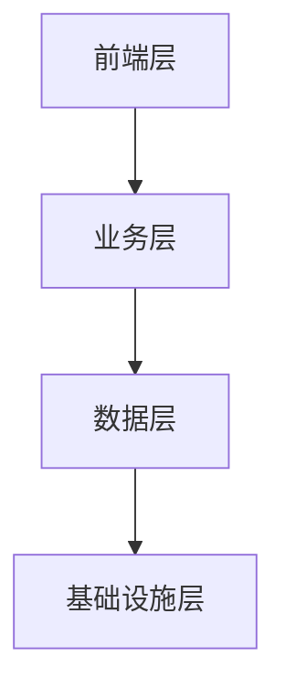
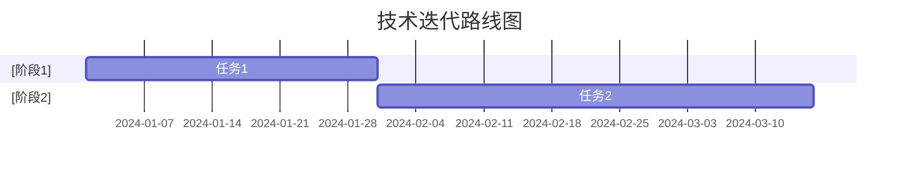

# TheMisto.ai技术深度分析报告

**版本号**: v1.0 | **更新日期**: 2025-03-03

---

## 一、核心技术评估

### 1.1 技术架构

### 1.2 关键技术指标
| 技术指标 | 当前水平 | 行业基准 | 技术壁垒 |
|----------|----------|----------|----------|
| [指标1] | [水平1] | [基准1] | [壁垒1] |
| [指标2] | [水平2] | [基准2] | [壁垒2] |
| [指标3] | [水平3] | [基准3] | [壁垒3] |

### 1.3 技术创新点
- [创新点1]
- [创新点2]
- [创新点3]

## 二、技术成熟度分析

### 2.1 技术就绪度评估
| 技术模块 | 成熟度等级 | 验证状态 | 风险评估 |
|----------|------------|----------|----------|
| [模块1] | [等级1] | [状态1] | [风险1] |
| [模块2] | [等级2] | [状态2] | [风险2] |
| [模块3] | [等级3] | [状态3] | [风险3] |

### 2.2 技术迭代路线

## 三、技术团队评估

### 3.1 团队构成
| 职能 | 人数 | 经验水平 | 技术背景 |
|------|------|----------|----------|
| [职能1] | [人数1] | [水平1] | [背景1] |
| [职能2] | [人数2] | [水平2] | [背景2] |
| [职能3] | [人数3] | [水平3] | [背景3] |

### 3.2 技术积累
- **专利情况**: [专利数量]项，其中[核心专利]项为核心专利
- **技术文档**: [文档完整度]
- **代码质量**: [代码评级]

## 四、技术风险分析

### 4.1 主要风险点
| 风险类型 | 风险描述 | 影响程度 | 应对措施 |
|----------|----------|----------|----------|
| [类型1] | [描述1] | [程度1] | [措施1] |
| [类型2] | [描述2] | [程度2] | [措施2] |
| [类型3] | [描述3] | [程度3] | [措施3] |

### 4.2 技术依赖分析
- [依赖项1]
- [依赖项2]
- [依赖项3]

## 五、技术发展规划

### 5.1 短期规划（6-12个月）
- [短期目标1]
- [短期目标2]
- [短期目标3]

### 5.2 中期规划（1-2年）
- [中期目标1]
- [中期目标2]
- [中期目标3]

### 5.3 长期规划（2年以上）
- [长期目标1]
- [长期目标2]
- [长期目标3]

## 六、技术竞争力分析

### 6.1 竞品技术对比
| 技术维度 | 本产品 | 竞品A | 竞品B | 竞品C |
|----------|--------|--------|--------|--------|
| [维度1] | [水平1] | [A1] | [B1] | [C1] |
| [维度2] | [水平2] | [A2] | [B2] | [C2] |
| [维度3] | [水平3] | [A3] | [B3] | [C3] |

### 6.2 技术优势分析
- [优势1]
- [优势2]
- [优势3]

## 七、验证方法与数据来源

### 7.1 技术验证方法
- [方法1]
- [方法2]
- [方法3]

### 7.2 数据来源
- [来源1]
- [来源2]
- [来源3]

---

#技术分析 #AI创意与内容生成 #AI创意生成 
## 数据可信度说明

🟢 **高置信度数据**
- 已完成融资、财务等历史数据
- 已公开披露的公司信息
- 经过审计的财务数据
- 可直接验证的技术指标

🟡 **中等置信度数据**
- 基于可靠来源的市场预测
- 行业分析师估计
- 内部跟踪的运营指标
- 短期业务预测

🔴 **低置信度数据**
- 远期（>2年）预测数据
- 市场规模远期预测
- 未经验证的竞争对手数据
- 技术发展路径预测

## 相关项目
- [[被投企业/AI创意与内容生成/TheMisto.ai/README]] #AI创意与内容生成

## 决策框架参考

---

## 标签
#人工智能 #成熟度/developing #技术/AI创意生成 #技术分析 #技术创新 #技术架构 #技术栈/ControlNet #技术栈/PyTorch #技术栈/Python #技术栈/SDXL #技术评估 #项目/状态/尽调中 #项目/行业/AI创意与内容生成 #项目/轮次/种子轮 #高扩展性