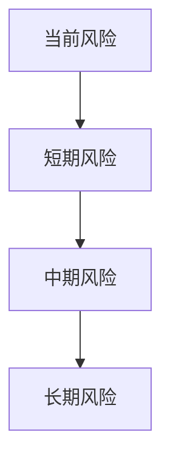

# TheMisto.ai风险深度分析报告

**版本号**: v1.0 | **更新日期**: 2025-03-03

---

## 一、风险评估总览

### 1.1 风险评级
| 风险维度 | 风险等级 | 影响程度 | 可控性 |
|----------|----------|----------|--------|
| 技术风险 | [等级1] | [程度1] | [可控1] |
| 市场风险 | [等级2] | [程度2] | [可控2] |
| 运营风险 | [等级3] | [程度3] | [可控3] |
| 财务风险 | [等级4] | [程度4] | [可控4] |
| 政策风险 | [等级5] | [程度5] | [可控5] |

### 1.2 风险趋势

## 二、技术风险分析

### 2.1 核心技术风险
| 风险点 | 风险描述 | 发生概率 | 影响范围 | 应对措施 |
|--------|----------|----------|----------|----------|
| [风险1] | [描述1] | [概率1] | [范围1] | [措施1] |
| [风险2] | [描述2] | [概率2] | [范围2] | [措施2] |
| [风险3] | [描述3] | [概率3] | [范围3] | [措施3] |

### 2.2 技术依赖风险
- [依赖风险1]
- [依赖风险2]
- [依赖风险3]

## 三、市场风险分析

### 3.1 竞争风险
| 竞争对手 | 威胁程度 | 可能影响 | 应对策略 |
|----------|----------|----------|----------|
| [竞争对手1] | [程度1] | [影响1] | [策略1] |
| [竞争对手2] | [程度2] | [影响2] | [策略2] |
| [竞争对手3] | [程度3] | [影响3] | [策略3] |

### 3.2 市场环境风险
- [环境风险1]
- [环境风险2]
- [环境风险3]

## 四、运营风险分析

### 4.1 团队风险
| 风险类型 | 风险描述 | 影响程度 | 缓解措施 |
|----------|----------|----------|----------|
| [类型1] | [描述1] | [程度1] | [措施1] |
| [类型2] | [描述2] | [程度2] | [措施2] |
| [类型3] | [描述3] | [程度3] | [措施3] |

### 4.2 运营效率风险
- [效率风险1]
- [效率风险2]
- [效率风险3]

## 五、财务风险分析

### 5.1 现金流风险
| 指标 | 当前水平 | 警戒线 | 应对措施 |
|------|----------|--------|----------|
| [指标1] | [水平1] | [警戒1] | [措施1] |
| [指标2] | [水平2] | [警戒2] | [措施2] |
| [指标3] | [水平3] | [警戒3] | [措施3] |

### 5.2 融资风险
- [融资风险1]
- [融资风险2]
- [融资风险3]

## 六、政策风险分析

### 6.1 监管风险
| 政策领域 | 风险描述 | 影响程度 | 应对策略 |
|----------|----------|----------|----------|
| [领域1] | [描述1] | [程度1] | [策略1] |
| [领域2] | [描述2] | [程度2] | [策略2] |
| [领域3] | [描述3] | [程度3] | [策略3] |

### 6.2 合规风险
- [合规风险1]
- [合规风险2]
- [合规风险3]

## 七、风险缓释建议

### 7.1 短期缓释措施
- [短期措施1]
- [短期措施2]
- [短期措施3]

### 7.2 中长期防范策略
- [长期策略1]
- [长期策略2]
- [长期策略3]

## 八、风险监测指标

### 8.1 关键监测指标
| 指标名称 | 当前值 | 警戒值 | 监测频率 |
|----------|--------|--------|----------|
| [指标1] | [值1] | [警戒1] | [频率1] |
| [指标2] | [值2] | [警戒2] | [频率2] |
| [指标3] | [值3] | [警戒3] | [频率3] |

### 8.2 定期评估机制
[评估机制说明]

---

#风险分析 #AI创意与内容生成 #[项目阶段] 
## 数据可信度说明

🟢 **高置信度数据**
- 已完成融资、财务等历史数据
- 已公开披露的公司信息
- 经过审计的财务数据
- 可直接验证的技术指标

🟡 **中等置信度数据**
- 基于可靠来源的市场预测
- 行业分析师估计
- 内部跟踪的运营指标
- 短期业务预测

🔴 **低置信度数据**
- 远期（>2年）预测数据
- 市场规模远期预测
- 未经验证的竞争对手数据
- 技术发展路径预测

## 相关项目
- [[被投企业/AI创意与内容生成/TheMisto.ai/README]] #AI创意与内容生成

## 决策框架参考

---

## 标签
#人工智能 #合规风险 #市场风险 #技术风险 #竞争风险 #项目/状态/尽调中 #项目/行业/AI创意与内容生成 #项目/轮次/种子轮 #风险/市场风险 #风险/技术风险 #风险分析 #风险等级/medium #风险评估