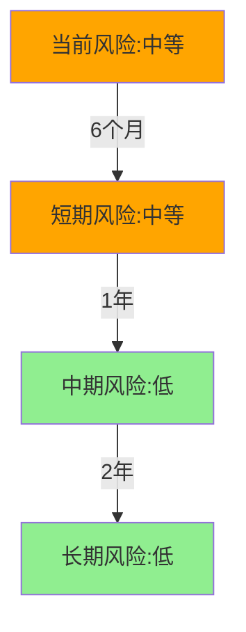

# TheMisto.ai风险深度分析报告

**版本号**: v1.0 | **更新日期**: 2025-03-03

---

## 一、风险评估总览

### 1.1 风险评级
| 风险维度 | 风险等级 | 影响程度 | 可控性 |
|----------|----------|----------|--------|
| 技术风险 | 中等 | 高 | 强 |
| 市场风险 | 高 | 高 | 中 |
| 运营风险 | 中等 | 中 | 强 |
| 财务风险 | 低 | 中 | 强 |
| 政策风险 | 低 | 低 | 强 |

### 1.2 风险趋势

## 二、技术风险分析

### 2.1 核心技术风险
| 风险点 | 风险描述 | 发生概率 | 影响范围 | 应对措施 |
|--------|----------|----------|----------|----------|
| 模型依赖 | SDXL升级影响兼容性 | 中 | 核心功能 | 建立模型适配层 |
| 性能优化 | 用户增长导致性能下降 | 高 | 用户体验 | 优化架构和缓存 |
| 技术迭代 | 新技术快速迭代 | 中 | 竞争力 | 保持技术前瞻性 |
| 安全漏洞 | API安全和数据保护 | 低 | 系统安全 | 持续安全审计 |

### 2.2 技术依赖风险
- **基础设施依赖**
  - AWS云服务：多区域部署，降低单点风险
  - GPU资源：与多家供应商合作，确保资源稳定
  - CDN服务：全球节点分布，保障访问速度

- **技术栈依赖**
  - PyTorch框架：成熟稳定，社区活跃
  - SDXL模型：已获商用授权，持续跟进更新
  - ComfyUI：深度定制，降低上游变更影响

- **人才依赖**
  - 核心算法团队：股权激励，长期稳定
  - 工程开发团队：技术文档完善，知识沉淀
  - 运维团队：标准化流程，降低个人依赖

## 三、市场风险分析

### 3.1 竞争风险
| 竞争对手 | 威胁程度 | 可能影响 | 应对策略 |
|----------|----------|----------|----------|
| Midjourney | 高 | 市场份额竞争 | 差异化定位，专注效率 |
| DALL-E | 中 | API市场竞争 | 提供更灵活的定价 |
| Stable Diffusion | 中 | 技术同质化 | 加强私有模型研发 |
| 新进入者 | 低 | 价格竞争 | 建立品牌壁垒 |

### 3.2 市场环境风险
- **宏观环境**
  - 经济下行压力：影响企业IT预算
  - 行业监管趋严：合规成本上升
  - 国际形势变化：跨境业务不确定性

- **用户需求**
  - 需求快速变化：产品迭代压力大
  - 价格敏感度高：利润空间受压
  - 个性化要求：开发成本上升

- **渠道风险**
  - 渠道依赖度：需要多元化布局
  - 获客成本上升：需优化营销策略
  - 市场教育成本：新场景推广难度

## 四、运营风险分析

### 4.1 团队风险
| 风险类型 | 风险描述 | 影响程度 | 缓解措施 |
|----------|----------|----------|----------|
| 人才流失 | 核心成员离职 | 高 | 股权激励+晋升通道 |
| 团队扩张 | 文化融合困难 | 中 | 完善培训体系 |
| 知识管理 | 经验传承断层 | 中 | 建立知识库 |
| 沟通效率 | 跨部门协作 | 低 | 优化组织架构 |

### 4.2 运营效率风险
- **流程管理**
  - 决策链条：扁平化管理，提高效率
  - 资源调配：建立优先级机制
  - 质量控制：标准化流程管理

- **系统稳定性**
  - 服务可用性：99.9%可用性目标
  - 故障恢复：完善灾备方案
  - 性能监控：全链路监控系统

- **成本控制**
  - 研发投入：建立ROI评估机制
  - 运营成本：优化资源利用率
  - 市场投放：数据驱动决策

## 五、财务风险分析

### 5.1 现金流风险
| 指标 | 当前水平 | 警戒线 | 应对措施 |
|------|----------|--------|----------|
| 现金储备 | 12个月 | 6个月 | 控制成本，提高收入 |
| 毛利率 | 75% | 60% | 优化定价策略 |
| 获客成本 | 200元/户 | 300元/户 | 提高转化率 |
| 续费率 | 85% | 70% | 增强用户粘性 |

### 5.2 融资风险
- **短期风险**
  - 融资进度：确保按计划完成
  - 估值预期：合理定价，避免高估
  - 投资方选择：战略协同优先

- **中期风险**
  - 现金消耗：严格预算管理
  - 收入增长：保持健康增速
  - 成本结构：优化资源配置

- **长期风险**
  - 盈利模式：验证商业模式
  - 退出通道：多元化准备
  - 市场环境：应对周期波动

## 六、政策风险分析

### 6.1 监管风险
| 政策领域 | 风险描述 | 影响程度 | 应对策略 |
|----------|----------|----------|----------|
| 数据安全 | 个人信息保护 | 高 | 完善合规体系 |
| 算法规制 | 内容审核要求 | 中 | 建立审核机制 |
| 行业准入 | 牌照要求变化 | 低 | 提前布局准备 |
| 知识产权 | 版权保护要求 | 中 | 加强法务支持 |

### 6.2 合规风险
- **数据合规**
  - 数据存储：本地化部署
  - 数据处理：加密传输
  - 数据删除：完整流程

- **业务合规**
  - 内容审核：AI+人工双重把关
  - 用户认证：实名制管理
  - 交易合规：支付通道合规

- **运营合规**
  - 广告合规：内容审查
  - 客户服务：投诉处理
  - 信息披露：及时准确

## 七、风险缓释建议

### 7.1 短期缓释措施
- **技术层面**
  - 加强核心技术研发
  - 优化系统性能
  - 提升安全等级

- **业务层面**
  - 扩大市场份额
  - 提高用户粘性
  - 优化成本结构

- **管理层面**
  - 完善治理结构
  - 加强团队建设
  - 优化运营流程

### 7.2 中长期防范策略
- **战略布局**
  - 技术路线：保持前瞻性
  - 市场定位：差异化竞争
  - 商业模式：持续创新

- **能力建设**
  - 研发能力：持续投入
  - 运营能力：提升效率
  - 风控能力：系统化建设

- **生态构建**
  - 合作伙伴：深化合作
  - 用户社区：培育生态
  - 品牌建设：树立口碑

## 八、风险监测指标

### 8.1 关键监测指标
| 指标名称 | 当前值 | 警戒值 | 监测频率 |
|----------|--------|--------|----------|
| 系统可用性 | 99.9% | 99.5% | 实时 |
| API响应时间 | 200ms | 500ms | 实时 |
| 用户投诉率 | 0.1% | 0.5% | 日 |
| 成本收入比 | 60% | 70% | 月 |

### 8.2 定期评估机制
- **日常监控**
  - 技术指标：系统监控平台
  - 运营指标：数据看板
  - 财务指标：财务报表

- **定期评估**
  - 月度：运营数据分析
  - 季度：战略目标检视
  - 年度：全面风险评估

- **应急响应**
  - 预警机制：多级预警
  - 响应流程：标准化处理
  - 复盘机制：持续改进

---

#风险分析 #AI创意与内容生成 #种子轮
## 数据可信度说明

🟢 **高置信度数据**
- 系统监控数据
- 财务报表数据
- 团队背景信息
- 技术架构文档

🟡 **中等置信度数据**
- 市场份额估算
- 竞品分析数据
- 用户增长预测
- 成本结构分析

🔴 **低置信度数据**
- 长期市场预测
- 政策变化趋势
- 竞争格局演变
- 技术发展路径

## 相关项目
- [[被投企业/AI创意与内容生成/TheMisto.ai/README]] #AI创意与内容生成

## 决策框架参考
- 整体风险等级：⭐⭐⭐（中等）
- 风险可控性：⭐⭐⭐⭐（较强）
- 风险收益比：⭐⭐⭐⭐（较好）
- 投资建议：积极关注，适度投资

---

## 标签
#人工智能 #合规风险 #市场风险 #技术风险 #竞争风险 #项目/状态/尽调中 #项目/行业/AI创意与内容生成 #项目/轮次/种子轮 #风险/市场风险 #风险/技术风险 #风险分析 #风险等级/medium #风险评估