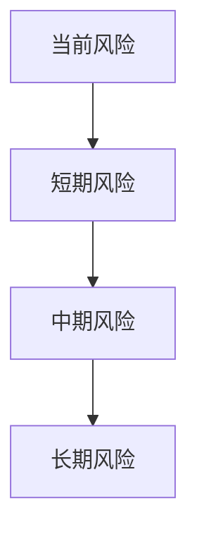

# [项目名]风险深度分析报告

## 基本信息
- 项目名称：NewAI
- 行业：AI创意与内容生成
- 轮次：种子轮
- 更新日期：{{update_date}}
- 版本：v1.0

## 一、风险评估总览

### 1.1 风险评级矩阵
| 风险维度 | 风险等级 | 影响程度 | 可控性 | 可信度 |
|----------|----------|----------|--------|--------|
| 技术风险 | 中 | 高 | 中 | 🟡 |
| 市场风险 | 高 | 高 | 低 | 🟡 |
| 运营风险 | 中 | 中 | 高 | 🟡 |
| 财务风险 | 高 | 高 | 中 | 🟢 |
| 合规风险 | 低 | 高 | 高 | 🟢 |

### 1.2 风险趋势

## 二、技术风险分析

### 2.1 核心技术风险
- 技术成熟度：[[L3-技术指标采集#^tech-stack-maturity]] 🟡
- 研发能力：[[L3-技术指标采集#^rd-team-size]] 🟢
- 主要风险点：
  1. xxx 🟡
  2. xxx 🟡
- 应对措施：
  1. xxx
  2. xxx

### 2.2 技术依赖风险
- 技术架构：[[L3-技术指标采集#^tech-architecture]] 🟢
- 迭代计划：[[L3-技术指标采集#^iteration-plan]] 🟡
- 依赖风险：
  1. xxx 🟡
  2. xxx 🟡
- 应对措施：
  1. xxx
  2. xxx

## 三、市场风险分析

### 3.1 竞争风险
- 市场格局：[[L3-数据推导过程#^market-concentration]] 🟡
- 主要竞争对手：[[L3-数据推导过程#^competitor-1]] 🟢
- 竞争风险：
  1. xxx 🟡
  2. xxx 🟡
- 应对措施：
  1. xxx
  2. xxx

### 3.2 市场环境风险
- 市场规模：[[L3-数据推导过程#^market-size-tam]] 🟡
- 增长趋势：[[L3-数据推导过程#^growth-rate-forecast]] 🟡
- 环境风险：
  1. xxx 🟡
  2. xxx 🟡
- 应对措施：
  1. xxx
  2. xxx

## 四、运营风险分析

### 4.1 团队风险
- 研发团队：[[L3-技术指标采集#^rd-team-size]] 🟢
- 团队风险：
  1. xxx 🟡
  2. xxx 🟡
- 应对措施：
  1. xxx
  2. xxx

### 4.2 运营效率风险
- 人均产出：[[L3-财务基础数据#^revenue-per-employee]] 🟢
- 获客成本：[[L3-财务基础数据#^customer-acquisition-cost]] 🟢
- 效率风险：
  1. xxx 🟡
  2. xxx 🟡
- 应对措施：
  1. xxx
  2. xxx

## 五、财务风险分析

### 5.1 现金流风险
- 经营现金流：[[L3-财务基础数据#^operating-cash-flow]] 🟢
- 消耗速度：[[L3-财务基础数据#^burn-rate]] 🟢
- 现金风险：
  1. xxx 🟡
  2. xxx 🟡
- 应对措施：
  1. xxx
  2. xxx

### 5.2 盈利能力风险
- 毛利率：[[L3-财务基础数据#^gross-margin]] 🟢
- 成本结构：[[L3-财务基础数据#^cost-labor]] 🟢
- 盈利风险：
  1. xxx 🟡
  2. xxx 🟡
- 应对措施：
  1. xxx
  2. xxx

## 六、合规风险分析

### 6.1 数据安全风险
- 安全等级：[[L3-技术指标采集#^data-encryption]] 🟢
- 安全认证：[[L3-技术指标采集#^security-cert]] 🟢
- 安全风险：
  1. xxx 🟡
  2. xxx 🟡
- 应对措施：
  1. xxx
  2. xxx

### 6.2 行业监管风险
- 准入要求：[[L3-技术指标采集#^industry-compliance]] 🟢
- 隐私合规：[[L3-技术指标采集#^privacy-compliance]] 🟢
- 监管风险：
  1. xxx 🟡
  2. xxx 🟡
- 应对措施：
  1. xxx
  2. xxx

## 七、风险防控建议

### 7.1 短期防控措施
1. 技术风险防控：
   - xxx 🟡
   - xxx 🟡
2. 市场风险防控：
   - xxx 🟡
   - xxx 🟡
3. 财务风险防控：
   - xxx 🟡
   - xxx 🟡

### 7.2 长期防控策略
1. 技术发展策略：
   - xxx 🔴
   - xxx 🔴
2. 市场竞争策略：
   - xxx 🔴
   - xxx 🔴
3. 运营优化策略：
   - xxx 🔴
   - xxx 🔴

## 八、风险监测体系

### 8.1 关键监测指标
| 指标类型 | 指标来源 | 警戒值 | 监测频率 | 可信度 |
|----------|----------|--------|----------|--------|
| 技术指标 | [[L3-技术指标采集#^availability]] | 99.9% | 日 | 🟢 |
| 财务指标 | [[L3-财务基础数据#^burn-rate]] | xxx | 月 | 🟢 |
| 市场指标 | [[L3-数据推导过程#^market-share-top]] | xx% | 季 | 🟡 |

### 8.2 数据可信度说明
- 🟢 高可信度：已验证的确定性风险
- 🟡 中等可信度：可能发生的风险
- 🔴 低可信度：不确定性高的风险

---

#风险分析 #[行业] #[项目阶段] 