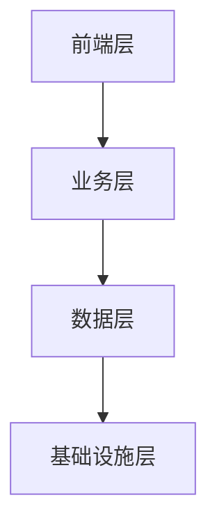
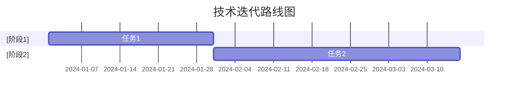

# NewAIProject 技术分析报告

## AI模型能力评估
{{model_evaluation}}

### 商业本质验证
- 无AI场景下的核心业务可行性
- 传统模式毛利率验证
- 客户真实需求验证

### AI增强价值验证
- 效率提升量化
- 收入贡献分析
- 成本结构影响

### 技术可靠性验证
- 算法效果测试
- 数据质量审查
- 工程化水平评估

## 技术架构分析
{{architecture_analysis}}

### 数据资产验证
- 数据获取机制
- 数据更新周期
- 数据安全合规

### 风险隔离验证
- 降级方案测试
- 数据备份机制
- 应急响应能力

## 研发团队评估
{{team_evaluation}}

### 团队能力验证
- AI研发能力
- 算法优化能力
- 工程化能力

## 标签
#报告/技术分析 #报告/技术成熟度/{{maturity_level}} #特征/技术架构

## 基本信息
- 项目名称：NewAIProject
- 行业：AI创意与内容生成
- 轮次：种子轮
- 更新日期：2025-03-17
- 版本：v1.0

## 一、核心技术评估

### 1.1 技术架构
- 架构设计：[[L3-数据存储.md#^tech-architecture]] 🟢
- 技术栈：[[L3-数据存储.md#^tech-stack-maturity]] 🟡

### 1.2 关键技术指标
| 技术指标 | 当前水平 | 行业基准 | 可信度 |
|----------|----------|----------|--------|
| 准确率 | [[L3-数据存储.md#^accuracy]] | [基准1] | 🟢 |
| 召回率 | [[L3-数据存储.md#^recall]] | [基准2] | 🟢 |
| F1分数 | [[L3-数据存储.md#^f1-score]] | [基准3] | 🟢 |

### 1.3 系统性能指标
| 性能指标 | 当前水平 | 目标水平 | 可信度 |
|----------|----------|----------|--------|
| 响应时间 | [[L3-数据存储.md#^response-time]] | [目标1] | 🟢 |
| QPS | [[L3-数据存储.md#^qps]] | [目标2] | 🟢 |
| 可用性 | [[L3-数据存储.md#^availability]] | [目标3] | 🟢 |

## 二、技术成熟度分析

### 2.1 技术就绪度评估
| 技术模块 | 成熟度等级 | 验证状态 | 可信度 |
|----------|------------|----------|--------|
| [模块1] | [等级1] | [状态1] | 🟡 |
| [模块2] | [等级2] | [状态2] | 🟡 |
| [模块3] | [等级3] | [状态3] | 🟡 |

### 2.2 技术迭代路线
- 当前版本：[[L3-数据存储.md#^iteration-plan]] 🟢

## 三、技术团队评估

### 3.1 团队构成
- 研发团队规模：[[L3-数据存储.md#^rd-team-size]] 🟢
| 职能 | 人数 | 经验水平 | 可信度 |
|------|------|----------|--------|
| [职能1] | [人数1] | [水平1] | 🟢 |
| [职能2] | [人数2] | [水平2] | 🟢 |
| [职能3] | [人数3] | [水平3] | 🟢 |

### 3.2 技术积累
- 专利数量：[[L3-数据存储.md#^patent-count]] 🟢
- 创新专利：[[L3-数据存储.md#^innovation-patents]] 🟢
- 代码质量：[[L3-数据存储.md#^code-quality]] 🟢

## 四、技术风险分析

### 4.1 主要风险点
| 风险类型 | 风险描述 | 影响程度 | 可信度 |
|----------|----------|----------|--------|
| 技术风险 | xxx | 高 | 🟡 |
| 安全风险 | xxx | 中 | 🟡 |
| 依赖风险 | xxx | 低 | 🟡 |

### 4.2 安全与合规
- 数据加密：[[L3-数据存储.md#^data-encryption]] 🟢
- 安全认证：[[L3-数据存储.md#^security-cert]] 🟢
- 隐私合规：[[L3-数据存储.md#^privacy-compliance]] 🟢
- 行业准入：[[L3-数据存储.md#^industry-compliance]] 🟢

## 五、技术发展规划

### 5.1 短期规划（6-12个月）
- 技术目标：
  1. xxx 🟡
  2. xxx 🟡
- 预期成果：
  1. xxx 🟡
  2. xxx 🟡

### 5.2 中长期规划（1-2年）
- 技术路线：
  1. xxx 🔴
  2. xxx 🔴
- 关键里程碑：
  1. xxx 🔴
  2. xxx 🔴

## 六、技术竞争力分析

### 6.1 竞品技术对比
| 技术维度 | 本产品 | 竞品A | 竞品B | 可信度 |
|----------|--------|--------|--------|--------|
| [维度1] | [水平1] | [A1] | [B1] | 🟡 |
| [维度2] | [水平2] | [A2] | [B2] | 🟡 |
| [维度3] | [水平3] | [A3] | [B3] | 🟡 |

### 6.2 技术领先度
- 技术领先度：[[L3-数据存储.md#^tech-leadership]] 🟡
- 创新优势：
  1. xxx 🟡
  2. xxx 🟡
- 技术壁垒：
  1. xxx 🟡
  2. xxx 🟡

## 七、验证方法与数据来源

### 7.1 技术验证方法
- 性能测试：
  1. xxx 🟢
  2. xxx 🟢
- 安全测试：
  1. xxx 🟢
  2. xxx 🟢

### 7.2 数据可信度说明
- 🟢 高可信度：已验证的测试数据
- 🟡 中等可信度：内部测试数据
- 🔴 低可信度：预估数据

## 相关链接
- [[../L1-NewAIProject-AI创意与内容生成-种子轮.md|返回主报告]]
- [[L3-数据存储.md|技术原始数据]]
- [[L3-数据推导.md|数据推导过程]]

---

#技术分析 #AI创意与内容生成 #技术领域 