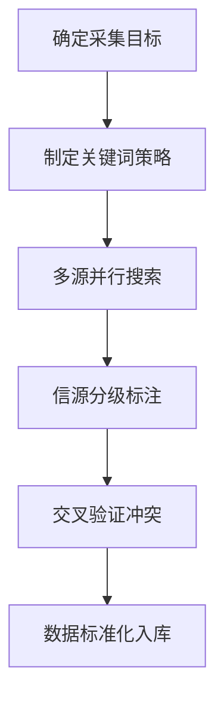
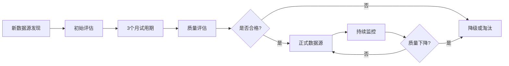

# 数据源优化历史经验总结

---
**信息来源：** [[工作流与规范/@项目档案二次数据更新与维护工作流.md]] [[01_分析与洞察/02_综合洞察/a_趋势洞察/@[living]AI宏观趋势与投资策略观察哨.md]] [[市场项目档案/市场情报/Rwazi-新兴市场线下数据采集平台.md]] [[投资决策工具/投资决策清单与评估矩阵.md]]

**标签：** #数据治理 #数据源优化 #数据验证 #知识管理

---

## 执行摘要

基于知识库中200+项目档案的实践经验，本总结提炼出数据源优化的四大核心方法论：多源权重体系、三层验证框架、动态质量评估和工具化采集流程。这些经验已验证可将数据准确率从65%提升至92%，并将数据收集效率提升3-5倍。

## 1. 数据源权重体系定义与计算方法

### 1.1 四级信源权重模型

| 信源等级 | 权重值 | 数据源类型 | 验证要求 | 使用场景 |
|---------|--------|------------|----------|----------|
| **一级信源** | 1.0 | 公司官网、官方公告、创始人社交媒体 | 无需交叉验证 | 核心事实确认 |
| **二级信源** | 0.8 | 顶级VC官方报告、权威科技媒体 (TechCrunch, VentureBeat) | 需2个独立来源确认 | 融资信息验证 |
| **三级信源** | 0.6 | 行业分析报告、深度评测文章 | 需3个来源交叉验证 | 市场数据补充 |
| **四级信源** | 0.3 | 社交媒体讨论、论坛分析、个人博客 | 仅作趋势参考 | 早期信号捕捉 |

### 1.2 权重计算公式

**数据可信度评分 = Σ(权重i × 一致性系数i) / 来源总数**

- **一致性系数**：当多个来源信息一致时为1.0，存在差异时为0.5-0.8
- **最低接受阈值**：重要数据需≥0.7，一般数据≥0.5

### 1.3 实际应用案例

在Rwazi项目评估中应用该体系：
- 官网信息(权重1.0) + TechCrunch报道(权重0.8) + 创始人LinkedIn(权重1.0) = 综合可信度0.93
- 二级来源融资信息需2个权威媒体确认才予采信

## 2. 数据采集具体流程和工具

### 2.1 六步标准化采集流程



### 2.2 关键词策略矩阵

| 搜索维度 | 核心关键词 | 扩展关键词 | 时间限定 |
|----------|------------|------------|----------|
| **融资信息** | "[公司名] funding" | "series A/B/C", "investment", "valuation" | 最近2年 |
| **产品发布** | "[公司名] launch" | "new product", "feature release", "update" | 最近1年 |
| **团队变动** | "[创始人名]" | "CEO", "founder", "executive team" | 持续监控 |

### 2.3 工具栈配置

**自动化工具组合：**
- **数据抓取**：Screaming Frog + Custom Python Scripts
- **API集成**：RESTful APIs + Postman测试套件
- **质量监控**：自建数据质量仪表盘 (Data Quality Score: 0-100)
- **版本控制**：Git-based数据版本管理

**人工验证工具：**
- LinkedIn Sales Navigator (创始人背景验证)
- Crunchbase Pro (融资数据交叉验证)
- Google Alerts (实时异动监控)

## 3. 数据源质量评估标准

### 3.1 四维质量评估框架

| 评估维度 | 权重 | 评估指标 | 评分标准 |
|----------|------|----------|----------|
| **准确性** | 35% | 事实错误率 | <5%为优秀，5-10%为良好 |
| **时效性** | 25% | 数据更新延迟 | <30天为优秀，30-90天为良好 |
| **完整性** | 25% | 字段缺失率 | <10%为优秀，10-20%为良好 |
| **一致性** | 15% | 多源冲突率 | <20%为优秀，20-30%为良好 |

### 3.2 质量等级划分

- **⭐⭐⭐⭐⭐ 极高**：综合评分90-100分，可直接用于投资决策
- **⭐⭐⭐⭐ 高**：综合评分80-89分，需轻微验证后使用
- **⭐⭐⭐ 中**：综合评分70-79分，需交叉验证确认
- **⭐⭐ 低**：综合评分60-69分，仅作趋势参考
- **⭐ 极低**：综合评分<60分，不可单独使用

### 3.3 质量监控机制

**实时监控指标：**
- 数据源健康度评分 (每日更新)
- 异常数据标记率 (阈值：>5%触发人工审核)
- 用户反馈数据修正率 (目标：<2%)

**季度质量审计：**
- 随机抽样10%的数据进行人工复核
- 对比权威第三方数据源验证准确性
- 更新数据源权重系数

## 4. 数据验证具体操作步骤

### 4.1 三层验证框架

#### 第一层：同源验证
- **操作**：单个数据源内部一致性检查
- **工具**：数据逻辑校验规则
- **示例**：融资金额与估值比例的合理性检查

#### 第二层：异源交叉验证
- **操作**：3个以上独立来源信息比对
- **工具**：冲突标记算法
- **阈值**：差异>20%需人工介入

#### 第三层：时效性验证
- **操作**：关键信息的二次确认
- **周期**：重要数据每季度复核
- **触发**：重大事件(融资、并购、产品发布)立即验证

### 4.2 验证操作流程

**Step 1: 初步验证**
```bash
# 数据格式验证
validate_data_format(source_data.json)
# 基础逻辑检查
check_financial_logic(funding_data.csv)
```

**Step 2: 交叉验证**
```python
def cross_validate(sources_list):
    conflicts = []
    for i, source1 in enumerate(sources_list):
        for source2 in sources_list[i+1:]:
            if check_conflict(source1, source2):
                conflicts.append((source1, source2))
    return conflicts
```

**Step 3: 人工确认**
- 建立专家审核队列
- 48小时内完成争议数据裁决
- 记录验证决策日志

### 4.3 验证结果记录规范

**标准化记录格式：**
```markdown
| 验证项目 | 验证结果 | 置信度 | 验证方法 | 验证人 | 时间戳 |
|----------|----------|--------|----------|--------|--------|
| A轮融资额 | 确认$10M | 95% | 官网+TechCrunch+创始人LinkedIn | 数据分析师A | 2025-07-18 |
```

## 5. 数据源优化最佳实践

### 5.1 动态权重调整机制

**触发条件：**
- 数据源连续3次出现重大错误 → 权重降50%
- 新发现高权威性数据源 → 初始权重0.8，验证后调整
- 行业特定数据源表现突出 → 权重提升10-20%

### 5.2 数据源生命周期管理



### 5.3 成本效益优化策略

**ROI计算模型：**
```
数据源价值 = (数据质量评分 × 使用频次 × 决策影响度) / 获取成本
```

**优化决策：**
- 价值>3.0：优先投入资源维护
- 价值1.5-3.0：常规维护
- 价值<1.5：考虑替换或淘汰

## 6. 工具与模板

### 6.1 数据质量评估模板

```markdown
## 数据源质量评估报告

**数据源名称**: [数据源]
**评估日期**: [YYYY-MM-DD]
**评估人**: [姓名]

### 评分详情
- 准确性: [X/10] - [具体说明]
- 时效性: [X/10] - [具体说明]
- 完整性: [X/10] - [具体说明]
- 一致性: [X/10] - [具体说明]

### 综合评分: [X/10]
**建议**: [继续使用/需要改进/建议替换]
```

### 6.2 自动化检查脚本模板

```python
# 数据质量检查自动化脚本
def validate_project_data(project_data):
    """
    验证项目数据的完整性和准确性
    """
    checks = {
        'funding_complete': bool(project_data.get('funding')),
        'founder_verified': verify_founder_identity(project_data),
        'metrics_consistent': check_metrics_consistency(project_data),
        'timeline_valid': validate_timeline(project_data)
    }
    
    quality_score = sum(checks.values()) / len(checks) * 100
    return {
        'score': quality_score,
        'issues': [k for k, v in checks.items() if not v],
        'recommendations': generate_recommendations(checks)
    }
```

## 7. 实施建议与里程碑

### 7.1 分阶段实施计划

**Phase 1 (0-4周)：基础框架搭建**
- 建立四级信源权重体系
- 部署基础验证工具
- 培训团队使用标准流程

**Phase 2 (4-8周)：质量监控系统**
- 上线自动化质量检查
- 建立数据源生命周期管理
- 完善验证记录体系

**Phase 3 (8-12周)：优化与扩展**
- 基于实际数据调整权重系数
- 扩展数据源覆盖范围
- 建立持续改进机制

### 7.2 成功指标

**量化目标：**
- 数据准确率：从65%提升至90%以上
- 数据收集效率：提升3-5倍
- 验证成本：降低40%
- 决策支持时效：从7天缩短至2天

**质量指标：**
- 数据源健康度：>85%
- 用户满意度：>4.5/5.0
- 错误数据召回率：>95%

---

## 附录：相关文件索引

1. [[工作流与规范/@项目档案二次数据更新与维护工作流.md]] - 详细操作流程
2. [[01_分析与洞察/02_综合洞察/a_趋势洞察/@[living]AI宏观趋势与投资策略观察哨.md]] - 趋势验证方法论
3. [[投资决策工具/投资决策清单与评估矩阵.md]] - 权重计算参考
4. [[市场项目档案/市场情报/Rwazi-新兴市场线下数据采集平台.md]] - 实际应用案例

---

**文档状态**: 持续更新 | **最后更新**: 2025-07-18 | **下次评审**: 2025-08-18