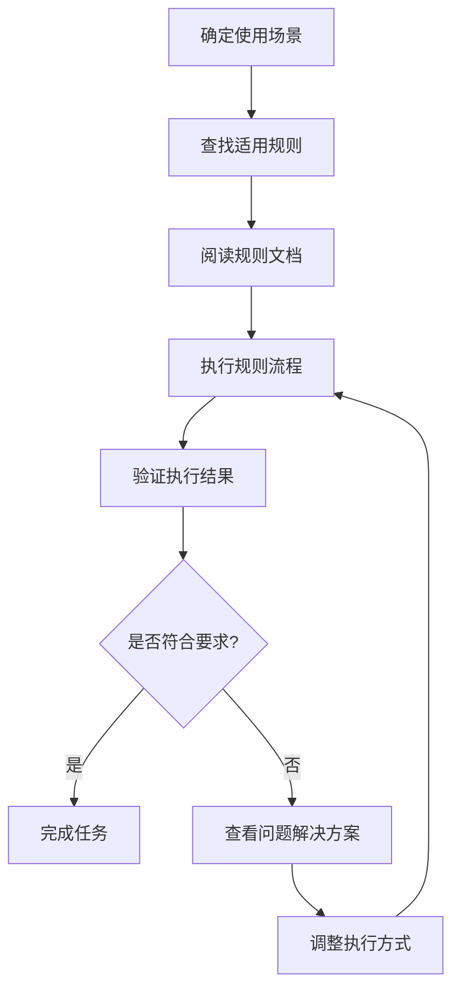

# 规则索引 - 快速查找指南

## 📋 规则文档快速索引

### 按业务场景分类

#### 🔍 AI项目研究分析
| 场景 | 适用规则 | 文件位置 |
|------|----------|----------|
| 新项目信息录入 | 内容归档规则 | `内容归档规则.md` |
| 项目档案更新 | 项目档案维护工作流 | `@项目档案二次数据更新与维护工作流.md` |
| 数据源管理 | 数据源优化经验 | `数据源优化经验总结.md` |

#### 💼 投资决策支持
| 场景 | 适用规则 | 文件位置 |
|------|----------|----------|
| 投资项目分析 | 内容归档规则 | `内容归档规则.md` |
| 数据更新维护 | 项目档案维护工作流 | `@项目档案二次数据更新与维护工作流.md` |
| 工作流程优化 | 工作流完善总结 | `工作流完善总结.md` |

#### 📢 知识传播与品牌
| 场景 | 适用规则 | 文件位置 |
|------|----------|----------|
| 内容生产规范 | 内容归档规则 | `内容归档规则.md` |
| 工作流程管理 | 工作流引用文件清单 | `工作流引用文件清单.md` |

#### 🏢 内部运营管理
| 场景 | 适用规则 | 文件位置 |
|------|----------|----------|
| 流程标准化 | 工作流完善总结 | `工作流完善总结.md` |
| 文件管理 | 工作流引用文件清单 | `工作流引用文件清单.md` |

### 按规则类型分类

#### 📊 数据处理规则
- **内容归档规则.md**
  - 适用场景: 知识生成、内容归档、项目分析
  - 核心内容: 归档标准、模板使用、质量控制
  - 更新频率: 月度更新

- **数据源优化经验总结.md**
  - 适用场景: 数据源管理、质量控制、历史经验参考
  - 核心内容: 优化策略、问题解决、最佳实践
  - 更新频率: 季度更新

#### 🔄 流程管理规则
- **@项目档案二次数据更新与维护工作流.md**
  - 适用场景: 项目档案维护、数据更新、质量保证
  - 核心内容: 更新流程、验证标准、维护周期
  - 更新频率: 需要时更新

- **工作流完善总结.md**
  - 适用场景: 流程改进、效率提升、经验总结
  - 核心内容: 改进经验、问题解决、优化建议
  - 更新频率: 季度更新

#### 📁 文件管理规则
- **工作流引用文件清单.md**
  - 适用场景: 文件索引、资源管理、协作支持
  - 核心内容: 文件清单、引用关系、使用说明
  - 更新频率: 月度更新

### 按紧急程度分类

#### 🚨 高优先级（必须遵循）
1. **内容归档规则.md** - 所有内容创建必须遵循
2. **@项目档案二次数据更新与维护工作流.md** - 项目维护必须遵循

#### ⚠️ 中优先级（建议遵循）
1. **数据源优化经验总结.md** - 数据质量管理建议遵循
2. **工作流完善总结.md** - 流程改进建议遵循

#### ℹ️ 低优先级（参考使用）
1. **工作流引用文件清单.md** - 需要时参考使用

## 🔍 快速查找指南

### 常见问题快速解答

#### Q: 如何创建新的项目档案？
**A**: 参考 `内容归档规则.md` → 第2节"项目档案创建流程"

#### Q: 项目信息发生变化如何更新？
**A**: 参考 `@项目档案二次数据更新与维护工作流.md` → 完整更新流程

#### Q: 数据源质量有问题怎么办？
**A**: 参考 `数据源优化经验总结.md` → 第3节"质量问题解决方案"

#### Q: 工作流程效率低如何改进？
**A**: 参考 `工作流完善总结.md` → 第4节"效率优化建议"

#### Q: 找不到某个文件在哪里？
**A**: 参考 `工作流引用文件清单.md` → 文件位置索引

### 规则使用流程

### 规则更新通知

#### 最近更新
- **2025-01-22**: 创建规则索引系统
- **2025-01-22**: 整合分散的规则文档
- **2025-01-22**: 建立统一的规则管理体系

#### 即将更新
- 规则执行效果评估机制
- 跨模块协作规范
- 自动化工具集成指南

## 📞 支持与反馈

### 获取帮助
1. **查阅文档**: 首先查看相关规则文档的详细说明
2. **参考案例**: 查看历史执行案例和经验总结
3. **咨询同事**: 向有经验的团队成员咨询
4. **联系管理员**: 向知识库管理员寻求帮助

### 提供反馈
1. **问题反馈**: 发现规则执行中的问题
2. **改进建议**: 提出规则优化的建议
3. **新需求**: 提出新的规则需求
4. **经验分享**: 分享规则使用的经验和技巧

---

*本索引文档会随着规则文档的更新而同步更新，确保信息的准确性和时效性。*

**管理信息**:
- 文档类型: 规则索引
- 维护责任: 知识库管理员
- 更新频率: 规则变更时同步更新
- 最后更新: 2025-01-22

#规则索引 #快速查找 #工作流程