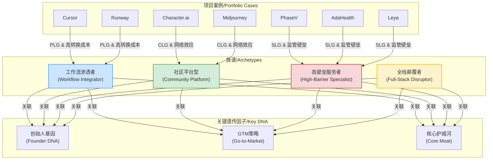

# AI项目族谱与模式分析

**版本**: 1.0
**创建日期**: 2025-06-10
**作者**: AI助手

---

## 1. 核心思想：从"项目"到"物种"

在评估早期AI项目时，我们不仅要看其独立的业务指标，更要识别它属于哪个"物种"或"族谱" (Archetype)。不同的族谱遵循着截然不同的进化路径，其成功要素、增长模式和最终形态也大相径庭。

本分析框架旨在从您现有的项目库中，提炼并定义几种关键的AI项目族谱，并揭示其内在的关联规律，从而为未来的投资决策提供一个更高维度的视角。

## 2. 三大关键"遗传因子"

每个AI项目都可以通过以下三个核心的"遗传因子"来定义其"物种"属性。这三者紧密关联，互为因果。

1.  **创始人基因 (Founder DNA)**: 创始团队的背景和核心能力。是技术极客、产品经理、领域专家还是商业精英？这往往决定了项目的起点和路径依赖。
2.  **市场进入策略 (Go-to-Market Strategy)**: 项目如何获取第一批核心用户并规模化。主要分为：
    *   **产品驱动增长 (PLG - Product-Led Growth)**: 以产品自身为核心营销工具，自下而上渗透。
    *   **销售驱动增长 (SLG - Sales-Led Growth)**: 依赖销售团队进行大客户攻坚，自上而下覆盖。
    *   **社区驱动增长 (CLG - Community-Led Growth)**: 通过构建社区、内容和开放生态来吸引用户，形成网络效应。
3.  **核心护城河 (Core Moat)**: 项目赖以生存和抵御竞争的根本。在AI时代，护城河的形式愈发多样：
    *   **技术/模型壁垒**: 拥有领先的、难以复制的核心算法或模型。
    *   **数据壁垒**: 拥有独特、专有且能形成闭环的数据集。
    *   **工作流集成/高转换成本**: 深度嵌入用户或企业的核心流程，使其难以替换。
    *   **监管/合规壁垒**: 在医疗、法律、金融等强监管行业，牌照和合规本身就是护城河。
    *   **网络效应/生态壁垒**: 用户越多，产品/服务价值越大，形成赢家通吃的局面。

## 3. 四大AI项目族谱（Archetypes）

基于对您项目库的分析，我们识别出以下四种主要的AI项目族谱：

---

### **族谱一：工作流渗透者 (The Workflow Integrator)**

*   **一句话描述**: 像水和电一样，将AI能力无缝嵌入到特定人群（如开发者、设计师、研究员）的核心工作流中，成为不可或缺的一部分。
*   **遗传特征**:
    *   **创始人基因**: **技术/产品专家**。他们往往自身就是目标用户（"为自己做产品"），对用户痛点有深刻的理解。
    *   **GTM策略**: 典型的 **PLG (产品驱动增长)**。产品体验是最好的营销，通过个人用户的口碑传播，自下而上地渗透到团队和企业。
    *   **核心护城河**: **极高的转换成本**。一旦用户习惯了这种AI增强的工作流，就很难再回到"石器时代"。护城河的深度与产品对工作流的渗透程度成正比。
*   **案例分析**:
    *   **`Cursor`**: 绝佳的范例。创始团队是顶尖技术精英，产品深度集成VSCode生态，通过极致的AI编程体验迅速俘获开发者，ARR增长迅猛，完美演绎了PLG路径。
    *   **`Runway` / `Photoroom`**: 面向创意设计人群的工作流渗透者。它们将复杂的AIGC能力封装成简单易用的工具，嵌入到设计师的创作流程中。
*   **投资启示**:
    *   **评估要点**: 创始人是否是领域内的"自己人"？产品是否足够"惊艳"以驱动口碑传播？是否能巧妙地利用现有生态（如VSCode, Figma）加速渗透？
    *   **风险预警**: 容易受到上游大平台（如Microsoft, Adobe）的直接竞争和"围剿"。需要快速迭代，建立用户忠诚度。

---

### **族谱二：社区平台型 (The Community Platform)**

*   **一句话描述**: 构建一个AI驱动的平台，其核心价值由用户生成的内容（UGC）和用户间的互动（网络效应）共同创造。
*   **遗传特征**:
    *   **创始人基因**: **技术远见者 + 社区领袖**。通常拥有强大的底层模型能力，并对人性、社交和社区运营有深刻洞察。
    *   **GTM策略**: **CLG (社区驱动增长)**。通过开放性、趣味性和病毒式传播机制，快速吸引海量用户参与内容创作和互动，引爆网络效应。
    *   **核心护城河**: **UGC生态 + 网络效应**。平台上的内容和关系链是独一无二的，用户越多，对新用户的吸引力就越大，形成强大的正反馈循环。
*   **案例分析**:
    *   **`Character.ai`**: 典型的社区平台。创始人是Transformer的创造者，技术实力雄厚。其核心资产不是模型本身，而是用户创造的数百万个AI角色以及由此形成的用户关系网络。极高的用户使用时长（2小时/天）是其护城河深度的最佳证明。
    *   **`Midjourney`**: 最初完全生长于Discord社区，通过独特的"咒语"和社区共创文化，建立了强大的用户生态和品牌护城河。
*   **投资启示**:
    *   **评估要点**: 早期用户增长是否具有爆发性？社区氛围和文化是否健康、独特？产品机制是否能有效激励UGC和网络效应？
    *   **风险预警**: 内容安全和合规是悬在头上的达摩克利斯之剑。商业化通常后置，需要对"先圈地后变现"的模式有足够耐心。

---

### **族谱三：高壁垒服务者 (The High-Barrier Specialist)**

*   **一句话描述**: 针对高度管制或专业知识密集的垂直行业（如医疗、法律、金融、科研），提供AI解决方案，用"牌照"和"Know-How"构建壁垒。
*   **遗传特征**:
    *   **创始人基因**: **领域专家 + 技术专家**的黄金组合。创始人必须对目标行业的复杂规则、隐性知识和工作流程有深刻的理解。
    *   **GTM策略**: **SLG (销售驱动增长)**。产品客单价高，决策流程复杂，需要专业的销售团队进行大客户攻坚，销售周期长，但客户忠诚度高。
    *   **核心护城河**: **监管/合规壁垒 + 专有数据/Know-How**。获取行业准入（如FDA认证）本身就是一道巨大的门槛。在合规框架内积累的专有数据和行业知识会进一步加深护城河。
*   **案例分析**:
    *   **`PhaseV` / `AdaHealth`**: 医疗AI领域的典型代表。创始人团队包含医学博士和AI科学家。"FDA认证"是其最坚固的护城河之一。GTM策略必然是与大型医院、保险公司和制药企业合作，是典型的SLG模式。
    *   **`Leya` (预判)**: 法律AI服务。同样需要处理高度敏感的数据，并遵守严格的行业规范，其发展路径必然是与头部的律所和企业法务部门合作。
*   **投资启示**:
    *   **评估要点**: 创始人团队是否拥有"领域专家+技术专家"的双重背景？项目是否在早期就将"合规"作为核心战略？目标客户的付费能力和意愿是否足够强？
    *   **风险预警**: 销售周期可能远超预期，对现金流要求高。行业本身的技术采用速度可能很慢，需要有长期的耐心。

---

### **族谱四：全栈颠覆者 (The Full-Stack Disruptor)**

*   **一句话描述**: 不满足于只做"工具"或"服务"，而是希望利用AI技术，对一个传统行业的价值链进行端到端的重塑和颠覆。
*   **遗传特征**:
    *   **创始人基因**: **商业战略家 + 顶尖产品/技术团队**。创始人通常具备极强的行业终局思考能力和资源整合能力。
    *   **GTM策略**: **混合模式**。早期可能通过PLG/CLG获取用户和数据，但中后期必然会深入产业上下游，通过BD、并购等方式进行重资产整合。
    *   **核心护城河**: **闭环生态系统**。通过整合价值链的多个环节，实现数据、服务和体验的闭环，从而建立最深的护城河。
*   **案例分析**:
    *   **`Anduril` (外部案例)**: 国防科技领域的全栈颠覆者。它不只卖软件，而是提供从硬件（无人机、传感器）到软件（AI分析平台）再到服务（情报系统）的完整解决方案，重塑了国防采购和作战模式。
    *   **您项目库中的潜在颠覆者 (待发现)**: 需要寻找那些不满足于只做一个SaaS工具，而是试图进入交易、服务、甚至硬件领域的项目。
*   **投资启示**:
    *   **评估要点**: 创始人的野心和格局是否足够大？是否对目标行业的价值链有深刻的洞察？是否有能力进行复杂的资源整合和资本运作？
    *   **风险预警**: 这是最高风险、最高回报的模式。对资本的需求量极大，执行难度极高，失败率也最高。

## 4. 动态演化与族谱融合

### 分发驱动型AI消费公司（补充）
- **定义**：以分发能力为核心壁垒，依托短视频、社交媒体等新渠道实现病毒式增长，创始人/团队具备极强内容制造与流量引爆能力。
- **六大深度洞察**：
  1. 极致分发与“创始人即流量”
  2. 产品与分发的深度一体化
  3. 争议性与文化冲击
  4. 盈利模式与商业化
  5. 行业影响与伦理争议
  6. 风险与未来展望
- **典型特征**：组织极简、成员具备社交影响力、分发即产品、增长势能护城河。
- **GTM策略**：CLG（社区驱动增长）+PLG（产品驱动增长），内容与产品深度融合。
- **案例**：Cluely（2025年a16z领投，10周百万美金营收，分发驱动型增长）。
- **交叉链接**：详见《AI消费类公司投资方法论.md》《AI消费类公司运营与分发模式分析.md》。

项目的族谱不是一成不变的。随着公司的发展，可能会出现族谱的"演化"或"融合"。

*   一个"工作流渗透者"（如Notion）在积累了大量用户后，可能会通过开放API、举办用户大会等方式，逐渐演化出"社区平台"的特征。
*   一个"高壁垒服务者"（如某个医疗影像AI公司），可能会向下游延伸，开设自己的诊断中心，向"全栈颠覆者"演化。

理解这种演化路径，有助于我们判断一个项目的长期潜力和天花板。

---
## 5. 投资组合族谱分布图 (示例)

