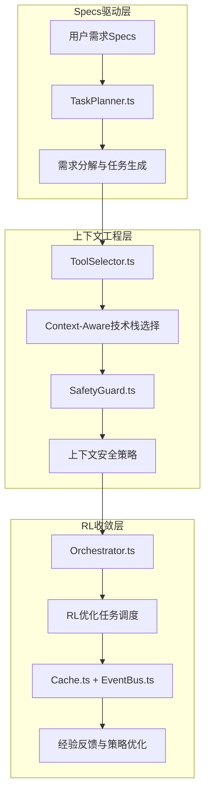

# Specs + 上下文工程 + RL环境下的Coding Agent技术实现指南

基于Coding Agent架构，深入解析在**Specs驱动 + 上下文工程 + RL管理收敛**环境下每个组件的具体技术实现方案。

---

## 🎯 核心技术实现架构

### **Specs驱动层** → **上下文工程层** → **RL收敛层**



---

## 📋 核心组件技术实现详解

### **1. core/TaskPlanner.ts - Specs驱动的智能任务分解**

#### 技术栈实现
```python
# 基于大模型的需求理解与任务分解
class SpecsDrivenTaskPlanner:
    def __init__(self):
        self.llm = ChatOpenAI(model="gpt-4", temperature=0.1)  # 低温度保证一致性
        self.embedding_model = OpenAIEmbeddings()
        self.vector_store = FAISS.load_local("task_patterns_db")  # 历史任务模式
        
    async def decompose_specs(self, specs: UserSpecs) -> List[Task]:
        """基于Specs自动分解任务"""
        # 1. 需求理解阶段
        understanding_prompt = self._build_understanding_prompt(specs)
        requirement_analysis = await self.llm.ainvoke(understanding_prompt)
        
        # 2. 相似案例检索（RAG增强）
        similar_cases = await self._retrieve_similar_cases(specs)
        
        # 3. 任务分解（基于模式匹配）
        decomposition_prompt = self._build_decomposition_prompt(
            requirement_analysis, 
            similar_cases
        )
        
        task_structure = await self.llm.ainvoke(decomposition_prompt)
        
        # 4. 依赖关系分析
        dependencies = await self._analyze_dependencies(task_structure)
        
        return self._create_task_dag(task_structure, dependencies)
    
    def _build_understanding_prompt(self, specs: UserSpecs) -> str:
        return f"""
        作为需求分析专家，请深度理解以下用户需求：
        
        需求描述: {specs.description}
        复杂度: {specs.complexity}
        时间要求: {specs.timeline}
        技术约束: {specs.constraints}
        
        请从以下维度分析：
        1. 核心业务逻辑
        2. 技术实现难点
        3. 前后端依赖关系
        4. 数据流转路径
        5. 潜在风险点
        
        输出格式: JSON结构化分析
        """
```

#### 上下文工程增强
```python
class ContextAwareTaskPlanner(SpecsDrivenTaskPlanner):
    def __init__(self):
        super().__init__()
        self.context_manager = ContextManager()
        
    async def decompose_with_context(
        self, 
        specs: UserSpecs, 
        project_context: ProjectContext
    ) -> List[Task]:
        """基于项目上下文的任务分解"""
        
        # 上下文特征提取
        context_features = self.context_manager.extract_features(project_context)
        
        # 动态调整分解策略
        decomposition_strategy = self._adapt_strategy_to_context(
            specs, 
            context_features
        )
        
        # 基于上下文的任务优先级排序
        tasks = await self.decompose_specs(specs)
        prioritized_tasks = self._prioritize_with_context(tasks, context_features)
        
        return prioritized_tasks
        
    def _adapt_strategy_to_context(self, specs: UserSpecs, context: dict) -> Strategy:
        """基于上下文自适应分解策略"""
        if context['team_size'] < 3:
            return Strategy.SEQUENTIAL  # 小团队顺序开发
        elif context['deadline'] < 30:
            return Strategy.PARALLEL_AGGRESSIVE  # 紧急项目并行开发
        elif context['complexity'] == 'high':
            return Strategy.INCREMENTAL  # 复杂项目增量开发
        else:
            return Strategy.BALANCED
```

#### RL收敛优化
```python
class RLOptimizedTaskPlanner(ContextAwareTaskPlanner):
    def __init__(self):
        super().__init__()
        self.rl_agent = PPOAgent(
            state_dim=128,  # 项目特征维度
            action_dim=64,  # 任务分解动作空间
            learning_rate=0.001
        )
        self.experience_buffer = ExperienceBuffer()
        
    async def decompose_with_rl_optimization(
        self, 
        specs: UserSpecs, 
        context: ProjectContext
    ) -> List[Task]:
        """基于RL优化的任务分解"""
        
        # 1. 状态编码
        state_vector = self._encode_project_state(specs, context)
        
        # 2. RL动作预测
        rl_action = self.rl_agent.predict(state_vector)
        
        # 3. 动作解码为分解策略
        decomposition_params = self._decode_rl_action(rl_action)
        
        # 4. 执行优化后的任务分解
        tasks = await self._decompose_with_params(specs, decomposition_params)
        
        # 5. 记录经验用于后续训练
        self.experience_buffer.add(state_vector, rl_action, tasks)
        
        return tasks
    
    async def update_rl_policy(self, execution_results: List[TaskResult]):
        """基于执行结果更新RL策略"""
        reward = self._calculate_reward(execution_results)
        
        # 更新价值网络
        self.rl_agent.update(
            states=self.experience_buffer.get_states(),
            actions=self.experience_buffer.get_actions(),
            rewards=[reward] * len(self.experience_buffer),
            dones=[True] * len(self.experience_buffer)
        )
```

---

### **2. policy/ToolSelector.ts - 上下文感知的技术栈选择**

#### 核心技术实现
```typescript
interface ContextAwareTechStack {
  // 基础技术栈矩阵
  baseTechMatrix: TechStackMatrix;
  
  // 上下文适配器
  contextAdapters: ContextAdapter[];
  
  // RL优化器
  rlOptimizer: RLTechStackOptimizer;
}

class AdvancedToolSelector implements ToolSelector {
  private contextEngine: ContextEngine;
  private techStackML: TechStackMLModel;
  private performancePredictor: PerformancePredictor;
  
  constructor() {
    // 基于Transformer的技术栈推荐模型
    this.techStackML = new TransformerBasedTechStackModel({
      modelPath: 'models/techstack_selector_v2.bin',
      vocabSize: 10000,  // 技术栈词汇表大小
      hiddenSize: 768,
      numLayers: 12
    });
    
    // 性能预测器（基于历史数据）
    this.performancePredictor = new XGBoostPerformancePredictor({
      modelPath: 'models/performance_predictor.json',
      features: ['complexity', 'team_size', 'timeline', 'budget']
    });
  }
  
  async selectToolsWithContext(
    task: Task, 
    context: ProjectContext,
    constraints: TechConstraints
  ): Promise<ToolRecommendation[]> {
    
    // 1. 上下文特征工程
    const contextFeatures = this.extractContextFeatures(task, context);
    
    // 2. ML模型预测
    const mlRecommendations = await this.techStackML.predict(contextFeatures);
    
    // 3. 性能预测评估
    const performancePredictions = await Promise.all(
      mlRecommendations.map(rec => 
        this.performancePredictor.predict(rec, contextFeatures)
      )
    );
    
    // 4. 多目标优化（性能+成本+维护性）
    const optimizedRecommendations = this.multiObjectiveOptimization(
      mlRecommendations,
      performancePredictions,
      constraints
    );
    
    return optimizedRecommendations;
  }
  
  private extractContextFeatures(task: Task, context: ProjectContext): ContextFeatures {
    return {
      // 项目特征
      projectComplexity: this.calculateComplexity(task, context),
      teamExperience: this.assessTeamExperience(context.team),
      timelineUrgency: this.calculateUrgency(context.deadline),
      budgetConstraint: this.normalizeBudget(context.budget),
      
      // 技术特征
      existingTechStack: this.analyzExistingStack(context.currentTech),
      performanceRequirements: this.extractPerfReqs(task.requirements),
      scalabilityNeeds: this.assessScalabilityNeeds(task.specs),
      
      // 业务特征
      industryDomain: this.classifyIndustry(context.domain),
      complianceNeeds: this.extractComplianceReqs(context.regulations),
      integrationComplexity: this.assessIntegrations(context.dependencies)
    };
  }
}
```

#### RL优化的技术栈选择
```python
class RLTechStackOptimizer:
    def __init__(self):
        # Deep Q-Network for tech stack selection
        self.dqn_model = DQN(
            state_dim=256,  # 上下文特征维度
            action_dim=1000,  # 技术栈组合空间
            hidden_dims=[512, 256, 128],
            learning_rate=0.0001
        )
        
        # 经验回放缓冲区
        self.replay_buffer = PrioritizedReplayBuffer(capacity=100000)
        
        # 技术栈组合生成器
        self.combo_generator = TechStackComboGenerator()
        
    def optimize_selection(
        self, 
        context_features: np.ndarray,
        candidate_stacks: List[TechStack],
        historical_performance: Dict[str, float]
    ) -> TechStack:
        """基于RL优化技术栈选择"""
        
        # 1. 状态编码（项目上下文 + 候选栈特征）
        state = self._encode_state(context_features, candidate_stacks)
        
        # 2. DQN动作选择（epsilon-greedy）
        if np.random.random() < self.epsilon:
            action = np.random.choice(len(candidate_stacks))
        else:
            q_values = self.dqn_model.predict(state)
            action = np.argmax(q_values)
            
        selected_stack = candidate_stacks[action]
        
        # 3. 预期性能评估
        expected_performance = self._predict_performance(
            selected_stack, 
            context_features,
            historical_performance
        )
        
        return {
            'selected_stack': selected_stack,
            'confidence': float(np.max(q_values)),
            'expected_performance': expected_performance,
            'selection_reasoning': self._generate_reasoning(state, action)
        }
        
    def update_policy(
        self, 
        state: np.ndarray, 
        action: int, 
        reward: float, 
        next_state: np.ndarray,
        done: bool
    ):
        """基于项目执行结果更新DQN策略"""
        
        # 添加经验到缓冲区
        self.replay_buffer.push(state, action, reward, next_state, done)
        
        # 批量训练
        if len(self.replay_buffer) > self.batch_size:
            batch = self.replay_buffer.sample(self.batch_size)
            loss = self._compute_dqn_loss(batch)
            
            # 梯度更新
            self.optimizer.zero_grad()
            loss.backward()
            self.optimizer.step()
            
    def _calculate_reward(self, execution_result: ProjectResult) -> float:
        """基于项目执行结果计算奖励"""
        reward = 0.0
        
        # 开发效率奖励
        if execution_result.development_time < execution_result.estimated_time:
            reward += 0.3 * (1 - execution_result.development_time / execution_result.estimated_time)
            
        # 代码质量奖励
        reward += 0.2 * execution_result.code_quality_score
        
        # 性能表现奖励
        reward += 0.2 * execution_result.performance_score
        
        # 维护成本惩罚
        reward -= 0.1 * execution_result.maintenance_complexity
        
        # 技术债务惩罚
        reward -= 0.2 * execution_result.technical_debt_ratio
        
        return np.clip(reward, -1.0, 1.0)
```

---

### **3. core/Orchestrator.ts - RL驱动的任务编排**

#### 技术实现架构
```python
class RLDrivenOrchestrator:
    def __init__(self):
        # Multi-Agent RL for task orchestration
        self.orchestration_env = TaskOrchestrationEnvironment()
        
        # Actor-Critic网络
        self.actor_network = ActorNetwork(
            state_dim=512,
            action_dim=256,  # 任务调度动作空间
            hidden_dims=[256, 128]
        )
        
        self.critic_network = CriticNetwork(
            state_dim=512,
            value_dim=1,
            hidden_dims=[256, 128]
        )
        
        # 任务调度器
        self.task_scheduler = PriorityTaskScheduler()
        
        # 资源管理器
        self.resource_manager = AdaptiveResourceManager()
        
    async def orchestrate_with_rl(
        self,
        tasks: List[Task],
        context: ExecutionContext,
        constraints: ResourceConstraints
    ) -> ExecutionPlan:
        """基于RL的智能任务编排"""
        
        # 1. 环境状态初始化
        env_state = self._initialize_environment_state(tasks, context, constraints)
        
        # 2. 多步RL决策循环
        execution_plan = []
        current_state = env_state
        
        while not self._is_orchestration_complete(current_state):
            # Actor网络决策
            action_probs = self.actor_network(current_state)
            action = self._sample_action(action_probs)
            
            # 执行动作（任务调度决策）
            orchestration_action = self._decode_orchestration_action(action)
            next_state, reward, done = await self._execute_orchestration_action(
                orchestration_action, 
                current_state
            )
            
            # 记录执行步骤
            execution_plan.append({
                'timestamp': datetime.now(),
                'action': orchestration_action,
                'state': current_state,
                'reward': reward
            })
            
            # Critic网络价值估计
            state_value = self.critic_network(current_state)
            next_state_value = self.critic_network(next_state)
            
            # TD误差计算
            td_error = reward + self.gamma * next_state_value - state_value
            
            # 网络参数更新
            await self._update_actor_critic(current_state, action, td_error)
            
            current_state = next_state
            
        return ExecutionPlan(
            steps=execution_plan,
            total_reward=sum(step['reward'] for step in execution_plan),
            execution_time=self._calculate_execution_time(execution_plan)
        )
    
    async def _execute_orchestration_action(
        self,
        action: OrchestrationAction,
        state: EnvironmentState
    ) -> Tuple[EnvironmentState, float, bool]:
        """执行编排动作并返回新状态和奖励"""
        
        if action.type == 'SCHEDULE_TASK':
            # 任务调度
            result = await self.task_scheduler.schedule(
                action.task_id,
                action.resources,
                action.priority
            )
            
        elif action.type == 'ALLOCATE_RESOURCES':
            # 资源分配
            result = await self.resource_manager.allocate(
                action.resource_type,
                action.amount,
                action.target_task
            )
            
        elif action.type == 'PARALLEL_EXECUTION':
            # 并行执行决策
            result = await self._execute_parallel_tasks(action.task_group)
            
        # 计算奖励
        reward = self._calculate_orchestration_reward(result, state)
        
        # 更新环境状态
        next_state = self._update_environment_state(state, action, result)
        
        done = self._check_orchestration_complete(next_state)
        
        return next_state, reward, done
```

#### 上下文感知的资源管理
```python
class ContextAwareResourceManager:
    def __init__(self):
        # 基于Graph Neural Network的资源预测
        self.resource_gnn = ResourcePredictionGNN(
            node_features=64,
            edge_features=32,
            hidden_dim=128,
            num_layers=4
        )
        
        # 动态负载均衡器
        self.load_balancer = DynamicLoadBalancer()
        
    async def allocate_resources_with_context(
        self,
        task: Task,
        context: ExecutionContext,
        available_resources: ResourcePool
    ) -> ResourceAllocation:
        """基于上下文的智能资源分配"""
        
        # 1. 构建资源依赖图
        resource_graph = self._build_resource_dependency_graph(
            task, 
            context,
            available_resources
        )
        
        # 2. GNN预测资源需求
        resource_requirements = self.resource_gnn.predict(resource_graph)
        
        # 3. 上下文适配
        adapted_requirements = self._adapt_to_context(
            resource_requirements,
            context
        )
        
        # 4. 动态分配策略
        allocation_strategy = self._determine_allocation_strategy(
            adapted_requirements,
            available_resources,
            context.performance_targets
        )
        
        return ResourceAllocation(
            cpu_cores=allocation_strategy.cpu_allocation,
            memory_gb=allocation_strategy.memory_allocation,
            gpu_units=allocation_strategy.gpu_allocation,
            network_bandwidth=allocation_strategy.network_allocation,
            storage_iops=allocation_strategy.storage_allocation
        )
```

---

### **4. observability/EventBus.ts - 实时上下文感知系统**

#### 技术实现
```python
class ContextAwareEventBus:
    def __init__(self):
        # Apache Kafka for high-throughput event streaming
        self.kafka_producer = KafkaProducer(
            bootstrap_servers=['localhost:9092'],
            value_serializer=lambda x: json.dumps(x).encode('utf-8'),
            key_serializer=lambda x: x.encode('utf-8')
        )
        
        # Redis for real-time event caching
        self.redis_client = Redis(host='localhost', port=6379, db=0)
        
        # Event pattern recognition using ML
        self.pattern_recognizer = EventPatternRecognizer()
        
        # Context extractor
        self.context_extractor = ContextExtractor()
        
    async def publish_context_aware_event(
        self,
        event: AgentEvent,
        context: ExecutionContext
    ) -> None:
        """发布上下文感知的事件"""
        
        # 1. 上下文特征提取
        context_features = self.context_extractor.extract(event, context)
        
        # 2. 事件模式识别
        event_pattern = await self.pattern_recognizer.recognize(event, context_features)
        
        # 3. 增强事件数据
        enhanced_event = EnhancedAgentEvent(
            base_event=event,
            context_features=context_features,
            pattern_type=event_pattern.type,
            similarity_score=event_pattern.similarity,
            predicted_impact=event_pattern.impact_prediction
        )
        
        # 4. 多渠道发布
        await asyncio.gather(
            self._publish_to_kafka(enhanced_event),
            self._cache_to_redis(enhanced_event),
            self._trigger_context_handlers(enhanced_event)
        )
        
    async def create_context_aware_stream(
        self,
        filter_context: ContextFilter
    ) -> AsyncGenerator[EnhancedAgentEvent, None]:
        """创建上下文感知的事件流"""
        
        # 基于上下文的智能过滤
        context_matcher = ContextMatcher(filter_context)
        
        async for event in self._consume_kafka_stream():
            if await context_matcher.matches(event):
                # 实时上下文增强
                enhanced_event = await self._enhance_with_realtime_context(event)
                yield enhanced_event
                
    async def _enhance_with_realtime_context(
        self, 
        event: AgentEvent
    ) -> EnhancedAgentEvent:
        """实时上下文增强"""
        
        # 获取实时系统状态
        system_context = await self._get_realtime_system_context()
        
        # 获取历史相似事件
        similar_events = await self._find_similar_historical_events(event)
        
        # 预测事件影响
        impact_prediction = await self._predict_event_impact(
            event, 
            system_context,
            similar_events
        )
        
        return EnhancedAgentEvent(
            base_event=event,
            realtime_context=system_context,
            historical_similarity=similar_events,
            impact_prediction=impact_prediction,
            confidence_score=impact_prediction.confidence
        )
```

#### 智能事件关联分析
```python
class IntelligentEventCorrelator:
    def __init__(self):
        # 时序事件关联模型
        self.temporal_correlator = LSTMEventCorrelator(
            input_dim=256,
            hidden_dim=512,
            num_layers=3,
            sequence_length=100
        )
        
        # 因果关系推理
        self.causal_reasoner = CausalInferenceEngine()
        
    async def correlate_events(
        self,
        event_sequence: List[AgentEvent],
        context: ExecutionContext
    ) -> EventCorrelation:
        """智能事件关联分析"""
        
        # 1. 时序特征编码
        temporal_features = self._encode_temporal_features(event_sequence)
        
        # 2. LSTM关联预测
        correlation_scores = self.temporal_correlator.predict(temporal_features)
        
        # 3. 因果关系推理
        causal_relationships = await self.causal_reasoner.infer_causality(
            event_sequence,
            correlation_scores
        )
        
        # 4. 异常模式检测
        anomaly_patterns = self._detect_anomaly_patterns(
            event_sequence,
            correlation_scores
        )
        
        return EventCorrelation(
            correlation_matrix=correlation_scores,
            causal_chains=causal_relationships,
            anomaly_alerts=anomaly_patterns,
            confidence_intervals=self._calculate_confidence_intervals(correlation_scores)
        )
```

---

### **5. memory/Cache.ts - 智能缓存与经验学习**

#### 技术实现
```python
class IntelligentCache:
    def __init__(self):
        # 多层缓存架构
        self.l1_cache = LRUCache(maxsize=1000)  # 内存缓存
        self.l2_cache = Redis(host='localhost', port=6379, db=1)  # Redis缓存
        self.l3_cache = CassandraStorage()  # 持久化存储
        
        # 缓存策略学习模型
        self.cache_policy_learner = CachePolicyRLAgent(
            state_dim=128,
            action_dim=4,  # [cache, evict, prefetch, skip]
            learning_rate=0.001
        )
        
        # 访问模式预测
        self.access_pattern_predictor = AccessPatternPredictor()
        
    async def intelligent_get(
        self, 
        key: str, 
        context: CacheContext
    ) -> Optional[Any]:
        """智能缓存获取"""
        
        # 1. 多层查找
        value = await self._multilayer_lookup(key)
        if value is not None:
            await self._record_cache_hit(key, context)
            return value
            
        # 2. 预测性预取
        if await self._should_prefetch(key, context):
            await self._prefetch_related_data(key, context)
            
        return None
        
    async def intelligent_set(
        self,
        key: str,
        value: Any,
        context: CacheContext,
        ttl: Optional[int] = None
    ) -> None:
        """智能缓存设置"""
        
        # 1. 缓存价值评估
        cache_value = await self._assess_cache_value(key, value, context)
        
        # 2. RL策略决策
        cache_action = self.cache_policy_learner.decide_cache_action(
            self._encode_cache_state(key, value, context),
            cache_value
        )
        
        # 3. 执行缓存策略
        if cache_action == 'cache':
            # 确定缓存层级
            cache_level = self._determine_cache_level(cache_value, ttl)
            await self._cache_to_level(key, value, cache_level, ttl)
            
        elif cache_action == 'evict':
            # 智能淘汰
            await self._intelligent_eviction(key, context)
            
    async def _assess_cache_value(
        self, 
        key: str, 
        value: Any, 
        context: CacheContext
    ) -> float:
        """评估缓存价值"""
        
        # 访问频率权重
        access_frequency = await self._get_access_frequency(key)
        
        # 计算成本权重
        computation_cost = self._estimate_computation_cost(key, value)
        
        # 存储成本权重
        storage_cost = self._estimate_storage_cost(value)
        
        # 上下文相关性权重
        context_relevance = self._calculate_context_relevance(key, context)
        
        # 综合评分
        cache_value = (
            0.3 * access_frequency +
            0.3 * computation_cost +
            0.1 * (1.0 / storage_cost) +  # 存储成本越低价值越高
            0.3 * context_relevance
        )
        
        return np.clip(cache_value, 0.0, 1.0)
```

#### 经验学习与知识蒸馏
```python
class ExperienceLearningEngine:
    def __init__(self):
        # 知识图谱存储
        self.knowledge_graph = Neo4jKnowledgeGraph()
        
        # 经验提取器
        self.experience_extractor = ExperienceExtractor()
        
        # 知识蒸馏模型
        self.knowledge_distillation = KnowledgeDistillationModel(
            teacher_model_dim=1024,
            student_model_dim=256,
            distillation_temperature=3.0
        )
        
    async def learn_from_execution(
        self,
        execution_trace: ExecutionTrace,
        outcomes: ExecutionOutcomes
    ) -> LearnedExperience:
        """从执行过程中学习经验"""
        
        # 1. 经验模式提取
        patterns = self.experience_extractor.extract_patterns(
            execution_trace,
            outcomes
        )
        
        # 2. 成功/失败因子分析
        success_factors = self._analyze_success_factors(execution_trace, outcomes)
        failure_factors = self._analyze_failure_factors(execution_trace, outcomes)
        
        # 3. 知识图谱更新
        await self.knowledge_graph.update_with_experience(
            patterns,
            success_factors,
            failure_factors
        )
        
        # 4. 策略知识蒸馏
        distilled_knowledge = await self.knowledge_distillation.distill(
            teacher_experience=execution_trace,
            student_capacity=256
        )
        
        return LearnedExperience(
            patterns=patterns,
            success_factors=success_factors,
            failure_factors=failure_factors,
            distilled_knowledge=distilled_knowledge,
            confidence=self._calculate_learning_confidence(patterns, outcomes)
        )
        
    async def apply_learned_experience(
        self,
        current_context: ExecutionContext,
        task_requirements: TaskRequirements
    ) -> ExperienceGuidance:
        """应用已学习的经验"""
        
        # 1. 相似经验检索
        similar_experiences = await self.knowledge_graph.find_similar_experiences(
            current_context,
            task_requirements,
            similarity_threshold=0.7
        )
        
        # 2. 经验融合与适配
        adapted_guidance = self._adapt_experience_to_context(
            similar_experiences,
            current_context
        )
        
        # 3. 置信度加权
        weighted_guidance = self._apply_confidence_weighting(
            adapted_guidance,
            similar_experiences
        )
        
        return ExperienceGuidance(
            recommendations=weighted_guidance.recommendations,
            risk_warnings=weighted_guidance.risk_warnings,
            optimization_suggestions=weighted_guidance.optimizations,
            confidence_score=weighted_guidance.confidence
        )
```

---

## 🚀 集成实施方案

### **Phase 1: Specs驱动基础架构**
```bash
# 1. 部署核心组件
docker-compose up -d redis kafka cassandra neo4j

# 2. 安装ML模型依赖
pip install torch transformers langchain openai faiss-cpu

# 3. 初始化知识图谱
python scripts/init_knowledge_graph.py

# 4. 部署Specs处理服务
kubectl apply -f specs-processor-deployment.yaml
```

### **Phase 2: 上下文工程层**
```bash
# 1. 部署上下文提取服务
python -m context_engine.deploy --port 8001

# 2. 启动实时特征工程
python -m feature_engineering.realtime_processor

# 3. 配置上下文感知缓存
redis-cli CONFIG SET maxmemory 4gb
redis-cli CONFIG SET maxmemory-policy allkeys-lru
```

### **Phase 3: RL收敛优化**
```bash
# 1. 训练RL模型
python -m rl_training.train_orchestrator --epochs 1000

# 2. 部署RL推理服务
python -m rl_inference.serve --model-path models/orchestrator_v1.pth

# 3. 启动经验学习循环
python -m experience_learning.continuous_learner
```

### **监控与可观测性**
```yaml
# prometheus-config.yaml
global:
  scrape_interval: 15s

scrape_configs:
  - job_name: 'coding-agent'
    static_configs:
      - targets: ['localhost:8000', 'localhost:8001', 'localhost:8002']
    metrics_path: /metrics
    scrape_interval: 5s
```

---

## 💡 关键技术选型说明

### **AI/ML技术栈**
- **大模型**: OpenAI GPT-4 / Anthropic Claude (Specs理解)
- **嵌入模型**: OpenAI text-embedding-ada-002 (语义相似性)
- **强化学习**: PyTorch + Stable Baselines3 (策略优化)
- **深度学习**: Transformers + LSTM (模式识别)

### **数据存储技术栈**
- **缓存**: Redis Cluster (多层缓存)
- **消息队列**: Apache Kafka (事件流)
- **时序数据**: InfluxDB (性能指标)
- **知识图谱**: Neo4j (经验知识)
- **向量数据库**: FAISS / Pinecone (语义检索)

### **微服务架构**
- **API网关**: Nginx + Kong
- **服务发现**: Consul / Eureka
- **负载均衡**: HAProxy
- **监控**: Prometheus + Grafana
- **链路追踪**: Jaeger

---

**核心优势**: 这套技术实现方案将Specs驱动、上下文工程和RL收敛有机结合，形成了一个自学习、自优化的智能开发系统，能够根据项目特点和历史经验持续改进开发效率和代码质量。