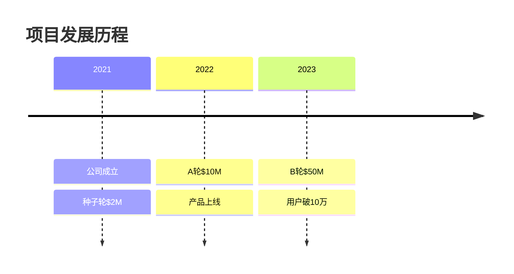
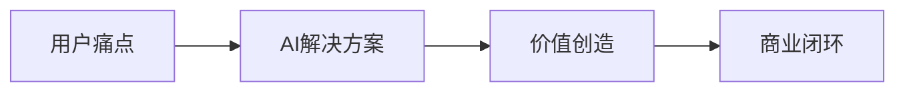
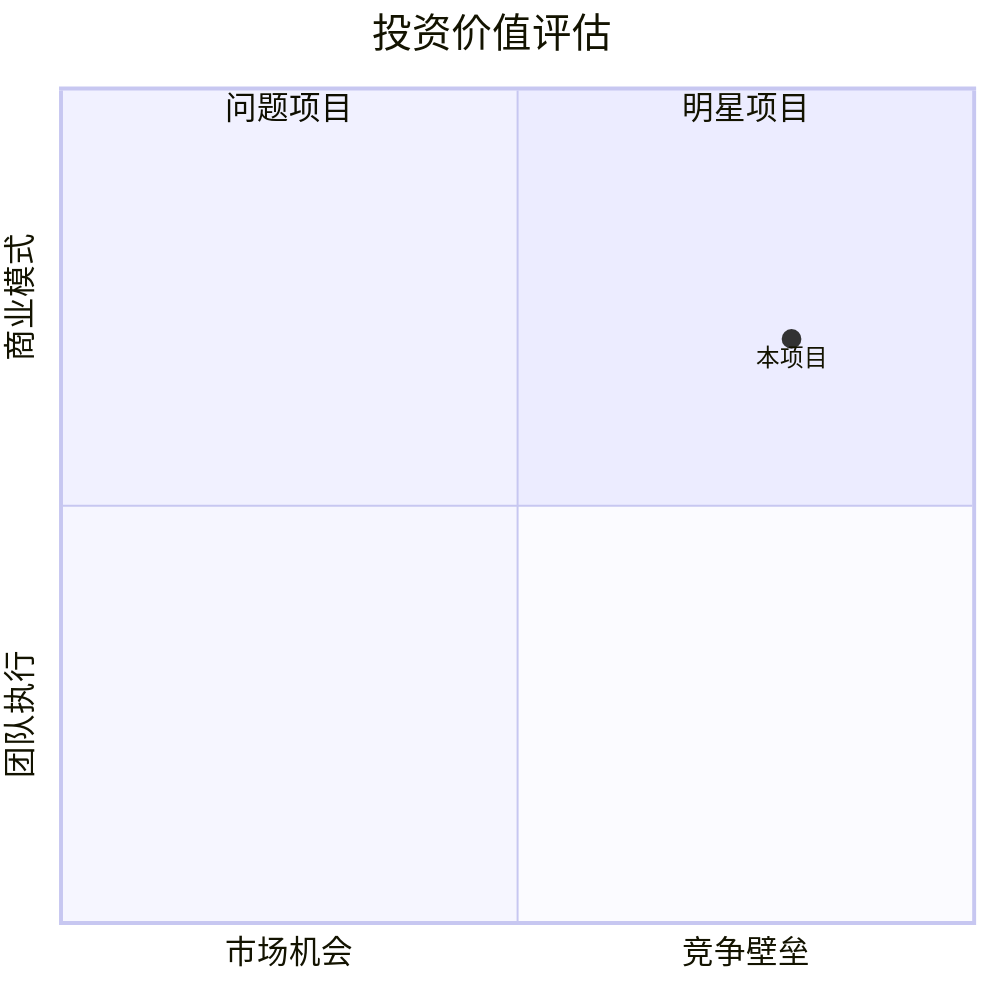
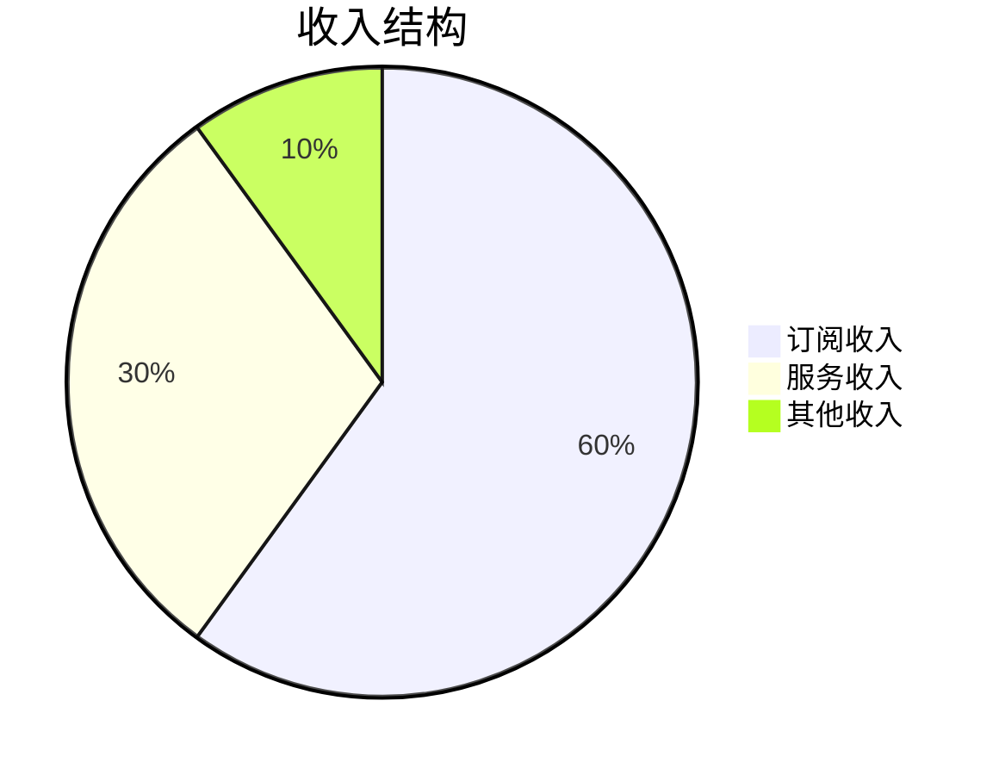
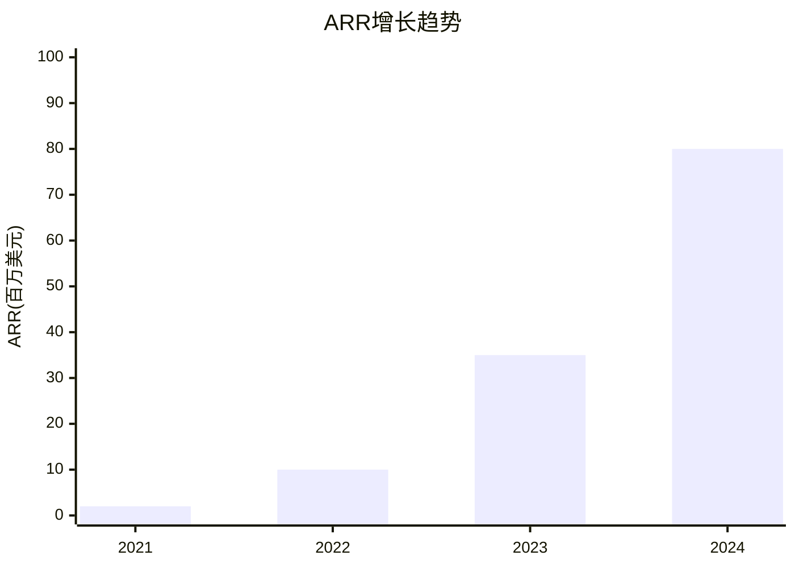
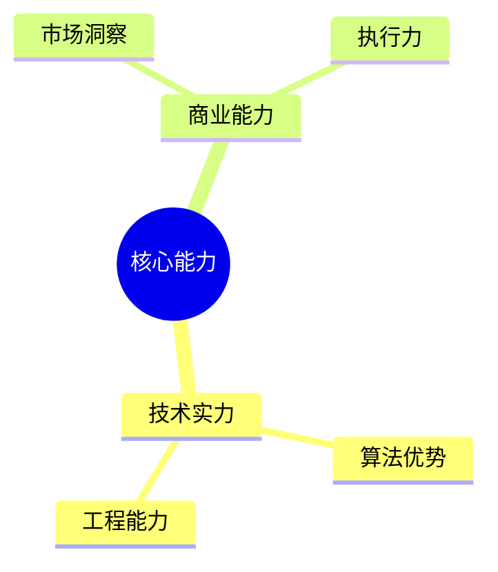
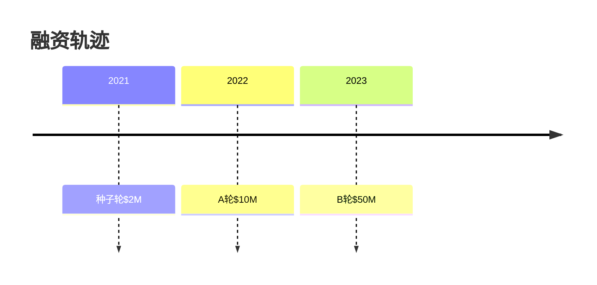
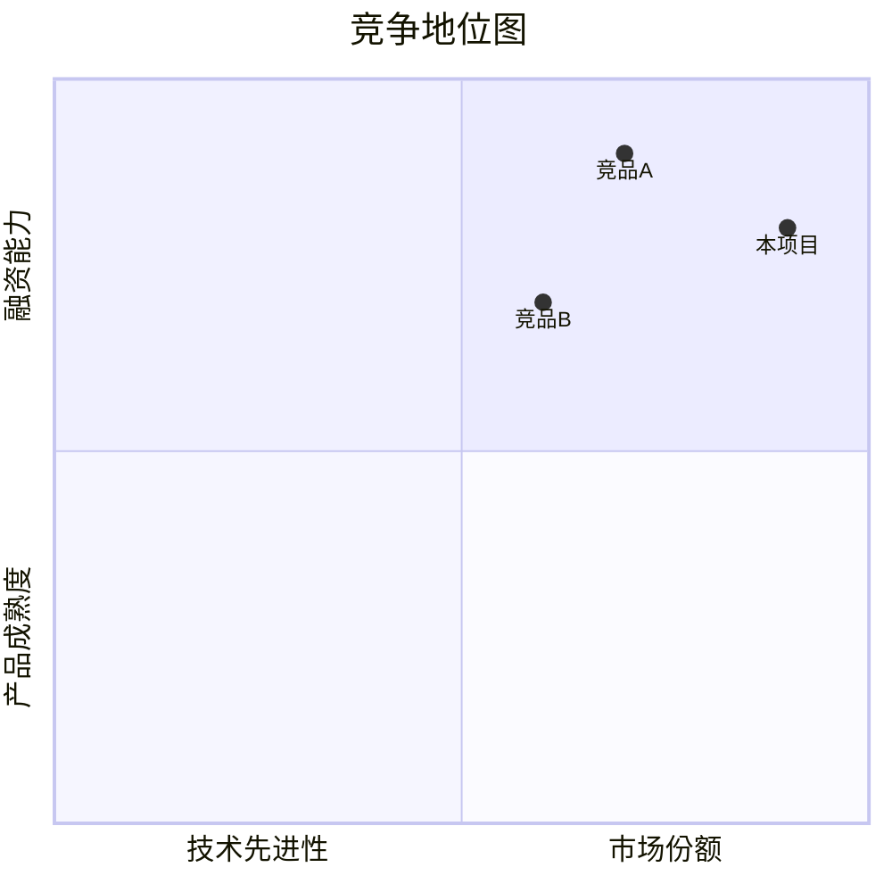

# 图文一体化设计指南

## 核心理念

图文一体化不是为了装饰，而是为了**用图表来解释和强化文字内容**，让复杂的数据和洞察更容易理解。

## 设计原则

### 1. 图表服务于内容
- ✅ **好的设计**: 融资轨迹图 + 融资洞察分析
- ❌ **差的设计**: 纯装饰性的ASCII艺术图

### 2. 数据驱动图表
- ✅ **好的设计**: 基于VI区真实数据生成的趋势图
- ❌ **差的设计**: 使用占位符的模板图表

### 3. 左图右文或上图下文
- ✅ **好的设计**: 图表在左，分析在右，相互呼应
- ❌ **差的设计**: 图表和文字分离，各说各话

## 图表类型与应用场景

### 1. 时间轴图表 (Timeline)
**适用场景**: 项目发展历程、融资历程、技术演进
**Mermaid语法**:


### 2. 流程图 (Flowchart)
**适用场景**: 商业模式、技术架构、决策流程
**Mermaid语法**:


### 3. 象限图 (Quadrant Chart)
**适用场景**: 竞争地位、投资价值、学习价值评估
**Mermaid语法**:


### 4. 饼图 (Pie Chart)
**适用场景**: 收入结构、市场份额、用户分布
**Mermaid语法**:


### 5. 柱状图 (Bar Chart)
**适用场景**: 指标对比、增长趋势、竞品分析
**Mermaid语法**:


### 6. 思维导图 (Mind Map)
**适用场景**: 团队能力、技术栈、商业要素
**Mermaid语法**:


## 图文结合模式

### 模式1: 上图下文
```markdown
### 📈 融资历程分析



**💡 融资洞察**: 从种子轮到B轮，估值增长25倍，体现了投资人对AI赛道和团队执行力的高度认可。每轮融资间隔12个月，节奏稳健。
```

### 模式2: 左图右文
```markdown
### 🏁 竞争地位分析

| 竞争维度 | 本项目 | 竞品A | 竞品B |
|----------|:------:|:-----:|:-----:|
| 技术先进性 | 9/10 | 7/10 | 6/10 |
| 市场份额 | 6/10 | 8/10 | 5/10 |
| 产品成熟度 | 8/10 | 9/10 | 7/10 |



**🏆 竞争优势**: 在技术先进性方面领先，但市场份额仍有提升空间。建议加强市场推广和渠道建设。
```

## MCP工具集成建议

### 推荐的图表生成工具

1. **Mermaid图表生成器**
```json
"mermaid-charts": {
  "command": "npx",
  "args": ["-y", "@mermaid-js/mermaid-cli"],
  "autoApprove": ["generate_diagram", "create_chart"]
}
```

2. **QuickChart API**
```json
"quickchart": {
  "command": "npx", 
  "args": ["-y", "quickchart-cli"],
  "autoApprove": ["create_chart", "generate_graph"]
}
```

3. **Plotly图表**
```json
"plotly-charts": {
  "command": "python",
  "args": ["-m", "plotly_mcp_server"],
  "autoApprove": ["create_interactive_chart"]
}
```

## 实施步骤

### 第一步: 数据准备
1. 确保VI区数据完整且真实
2. 识别需要可视化的关键数据点
3. 选择合适的图表类型

### 第二步: 图表生成
1. 使用MCP工具生成基础图表
2. 调整图表参数和样式
3. 确保在Obsidian中显示正常

### 第三步: 图文整合
1. 将图表放置在相关文字附近
2. 编写图表解读和洞察分析
3. 确保图文逻辑一致

### 第四步: 质量检查
1. 检查图表数据准确性
2. 验证图文呼应关系
3. 确认整体视觉效果

## 质量标准

### 图表质量标准
- ✅ 数据准确性: 100%基于VI区真实数据
- ✅ 视觉清晰度: 在Obsidian中显示清晰
- ✅ 信息密度: 图表信息量适中，不过载
- ✅ 色彩搭配: 使用一致的色彩方案

### 图文结合标准
- ✅ 逻辑一致: 图表和文字相互支撑
- ✅ 位置合理: 图表位置便于理解
- ✅ 解读深入: 不仅展示数据，更要分析洞察
- ✅ 行动导向: 图文结合指向明确结论

## 常见问题与解决方案

### Q1: 图表在Obsidian中不显示？
**A**: 确保使用Mermaid语法，检查语法错误，启用Obsidian的Mermaid插件。

### Q2: 图表数据如何保持更新？
**A**: 建立数据更新触发机制，当VI区数据更新时，自动重新生成图表。

### Q3: 如何选择合适的图表类型？
**A**: 根据数据类型和分析目的选择：
- 时间序列 → 时间轴/折线图
- 分类对比 → 柱状图/雷达图  
- 结构分析 → 饼图/树状图
- 关系分析 → 流程图/网络图

### Q4: 图表太复杂怎么办？
**A**: 遵循"少即是多"原则，一个图表只表达一个核心观点，复杂数据可以拆分为多个简单图表。

## 成功案例模板

参考 `knowledge/@外部项目内容模版_图文一体版.md` 中的具体实现，这个模板展示了如何将数据可视化与内容分析完美结合。