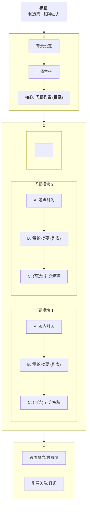

'''
# 深度内容传播策略与风格指南

## 引言

本指南旨在提炼和总结将专业、深度的分析报告转化为适合社交媒体（如微信公众号）传播的高质量内容的策略与风格。通过持续借鉴行业内多样化的优秀案例（例如**"数据驱动"深度分析风格**、**"专家与实践者分享系列"**（其下细分为专业方法拆解、创业历程叙事、行业趋势洞察等子类型）、以及**"思想领袖级"深度对话/论述风格**等），我们力求为内容创作者提供一个动态更新、实用性强的参考框架，以打造更具吸引力和传播力的深度内容。

## 核心思考：借鉴融合，风格自成

本指南旨在提供多元化的优秀传播风格作为参考，但更鼓励内容创作者在学习和借鉴的基础上，进行灵活的融合与创新。每种风格都有其适用的场景和独特优势，理解其底层逻辑和核心要素，是为了更好地服务于具体的内容目标和受众需求。

**传播版内容的核心风格定位与融合策略：**
*   **核心风格基础：** 传播版稿件应以原始深度报告的"数据驱动、逻辑清晰、分析专业"为基础核心风格。这是确保内容价值和可信度的基石。
*   **风格融合的艺术：** 在保持核心风格的基础上，鼓励根据具体内容特性和传播目标，策略性地融入其他高级风格元素，以增强内容的吸引力、思想性和传播力。例如：
    *   **思想性与前瞻性融入：** 在引言、关键转折点或结论部分，适度融入"思想领袖级深度对话/论述风格"的元素（参考第三大类风格），以提升内容的思辨高度和前瞻性洞察。
    *   **观点多元性体现：** 在讨论行业趋势、市场挑战、不同解决方案或商业模式时，可以适度采用"多方专家观点综述与趋势研判风格"的笔触（参考第二大类风格2.4），通过暗示或简述不同视角/讨论的存在，来体现分析的全面性和客观性，避免单一视角带来的片面感。
    *   **案例呈现的生动性：**
        *   若原始报告中包含丰富的案例背景、创始人故事、产品迭代细节等叙事性素材，可在传播稿中对核心案例进行适当展开，融入"创业历程与产品叙事风格"（参考第二大类风格2.2），使案例更生动、更具可读性和启发性。
        *   若原始报告中的案例信息偏向于事实和数据陈述，传播稿中对案例的介绍应保持简洁、精准，突出其与核心观点的关联性，此时可侧重"数据驱动分析风格"（参考第一大类风格）的呈现方式。

**（删除）实践中的经验与偏好总结：**
（此部分具体操作细则已迁移至《深度报告传播版优化指引》）

本指南本身亦是一个持续迭代和完善的文档。当我们接触到新的优秀传播案例时，我们的思考和处理流程如下：

1.  **评估新案例的风格归属与创新级别：**
    *   **选项一：创建全新的大类风格。** 如果案例展现出与所有现有大类风格都显著不同的核心传播逻辑和一系列独特手法，并具有成为全新独立范式的潜力时，我们会考虑增设新的大类风格（例如，"第四大类风格：XXX"等）。
    *   **选项二：在现有大类下创建新的子风格。** 如果案例的核心特质与某一现有大类风格的整体方向一致（例如，同属"专家与实践者分享系列"），但在具体应用场景、侧重点或表现形式上又展现出值得独立归纳的典型特征，且与该大类下已有的子风格有所区别，我们会考虑在该大类风格下增设新的子风格（例如，"第二大类风格"下继2.1, 2.2, 2.3之后的"2.4：YYY"风格等）。
    *   **选项三：优化现有的风格（大类或子风格）。** 如果案例的核心特质与某一现有风格（无论是某个大类，还是该大类下已有的某个子风格）高度吻合，但其在具体策略、结构、表达或呈现上提供了新的"闪光点"或更佳实践，我们会将其优秀之处融入对该现有风格的描述中进行优化（详见下一条）。
    我们在做此判断时，会力求避免风格分类过于细碎，优先考虑现有框架的包容性和可扩展性。

2.  **提炼闪光点以优化现有风格（对应上述选项三的后续操作）：** 若判断案例适合用于优化某一现有风格（大类或子风格），我们会深入分析其具体策略、结构、表达或呈现上的独到之处。将这些"闪光点"和可复制的经验提炼出来，用以补充、细化和深化对该风格的描述，使其更具指导性和操作性，并提供更鲜活、更具说服力的参照（如此前我们用"拾象"分析Exa的案例来强化"第一大类风格"，以及用赫拉利访谈案例来印证和丰富"第三大类风格"）。

3.  **客观看待借鉴价值，允许"无增益"：** 我们也认识到，并非每一个遇到的优秀案例都必然带来对指南文本的修改。某些案例可能仅仅是很好地印证了现有风格的有效性，但并未提供超越当前描述的、新的、可操作的元素。在这种情况下，我们会将其视为有益的参考或已有风格的又一佐证，而不必强求对指南本身进行调整。这也是一个正常的评估结果。

通过这种持续的观察、分析、判断和迭代，我们力求使本指南能够动态地吸收行业智慧，不断提升其作为深度内容传播策略框架的有效性和生命力。

秉持此种持续学习与迭代的精神，我们对内容创作者的核心建议如下：

*   **借鉴而非照搬：** 深入理解不同风格的精髓，而非简单复制其表象。
*   **融合以求创新：** 尝试将不同风格的优点进行有机结合，创造出更具表现力和适应性的内容形式。例如，可以在数据驱动的分析中融入访谈洞察的生动案例，或在思想领袖的对话中穿插必要的数据支撑。
*   **情境决定选择：** 根据原始内容的特性、目标受众的偏好、期望达成的传播效果以及平台调性，来决定最适合的风格或风格组合。
*   **实践中持续优化：** 通过不断的内容创作实践、数据反馈和用户洞察，逐步打磨和完善自成一体的、独特且高效的传播风格。

最终目标是"形神兼备"——既掌握各类优秀风格的"形"（结构、技巧），更能领会其"神"（核心理念、传播逻辑），从而游刃有余地驾驭深度内容，实现最佳传播效果。

---

## 顶层策略：双轨内容——区分"内核报告"与"外化传播"

在深入探讨具体的内容风格之前，我们必须建立一个至关重要的顶层策略：**根据目标受众和使用场景，明确区分内容是用于"内核报告"还是"外化传播"。** 这两种产品的目标截然不同，因此在风格和润色策略上也应有显著区别。

### 1. 内核报告 (Internal-Facing Report)
*   **目标：** **精准、严谨、客观、高效。** 服务于内部决策、专业研究和深度归档。
*   **读者：** 团队成员、决策者、投资人等专业人士。他们追求快速获取信息、理解严密的逻辑链条。
*   **核心风格：** 强烈推荐使用**《第一大类风格："数据驱动"深度分析风格》**。
*   **润色要点：**
    *   **目标：专业而不僵硬，权威而不疏远。** 在保留AI带来的结构清晰、逻辑严谨等核心优势的基础上，精细化地消除其机械感。
    *   **核心方法：** 请参考**《专项指南：内容"去AI化"与人性化润色》**中针对"严肃报告/内核报告"场景的**精细化应用指南**。其中详细列明了推荐采纳和应谨慎避免的具体技巧。
*   **质量标准：** 逻辑无懈可击，数据引用清晰准确，信息密度高。

### 2. 外化传播 (Public-Facing Communication)
*   **目标：** **吸引、共鸣、启发、传播。** 服务于品牌建设、用户增长和公众教育。
*   **读者：** 行业新人、潜在用户、媒体、以及对该领域感兴趣的更广泛人群。他们更看重内容的可读性、趣味性和价值启发。
*   **核心风格：** 在**"内核报告"**的基础上进行二次创作。可灵活选用**《第二大类风格：专家与实践者分享系列》**、**《第三大类风格："思想领袖级"深度对话/论述风格》**等，进行融合创新。
*   **润色要点：**
    *   **人性化是关键：** 这是**《内容"去AI化"与人性化润色指南》**的核心应用场景。应大量运用其中的技巧，为内容注入"灵魂"。
    *   **故事化改编：** 将报告中枯燥的数据和案例，转化为生动的故事或有代入感的叙述。
    *   **激发互动：** 通过提出开放性问题、分享个人见解、引导讨论等方式，增强内容的社交属性。
    *   **质量标准：** 观点鲜明易懂，故事引人入胜，能引发读者思考和分享欲。

### 工作流建议
1.  **第一步：生产"内核报告"。** 与AI协作，以"数据驱动"风格为核心，产出一份高质量、高信息密度的分析报告。
2.  **第二步：打造"传播外衣"。** 基于已完成的内核报告，明确传播目标和受众，选择合适的风格并进行深度的"去AI化"与人性化润色，创作出适于公开发布的稿件。

**简而言之：报告求"真"，传播求"人"。** 建立这一双轨策略，是高效、规模化产出高质量深度内容的基础。

---

## 第一大类风格："数据驱动"深度分析风格

*（适用场景：此风格是构建**"内核报告"**的基石，同样也为各类"外化传播"内容提供专业性与逻辑性的核心骨架。）*

### 【新增】1.1 硬核科技突破报道子类型（融合优化版）

**适用场景：** AI、医学、工程、认知科学等前沿领域的重大突破、顶刊论文、跨学科创新成果解读。适合"内核报告"与"高端外化传播"，可作为"科技突破类"深度稿件的标准模板。

**结构特征与操作细则（递进表达）**

1. **标题与引言**
   - 标题突出"首创性/里程碑+领域+影响"，如"AI首次精准模拟人类大脑行为状态，Nature重磅发表"。
   - 引言采用三段式递进（背景→突破→意义），可加"编者按/专家点评"模块，快速交代行业难题、核心突破及其影响。

2. **正文递进结构（八步法）**
   1) 背景与问题定义：交代行业现状、存在的核心难题或技术瓶颈，用简明数据或权威报告引发关注。
   2) 理论基础：介绍相关学科的基本原理、核心概念，对深奥知识用比喻、案例、简明公式辅助解释。
   3) 技术路线/创新点：详细拆解本次突破采用的新方法、新模型或新思路，首次出现术语时括号内给出中英文、缩写及一句话解释。
   4) 实验设计/数据集：说明实验方案、数据来源、样本规模等，突出科学性，并引用权威数据集（如ImageNet、Psych-101等）及其权威性。
   5) 核心数据与结果：用表格、图形、流程图等可视化方式展示关键数据和实验结果，每一结论都配有数据支撑，数据来源注明出处。
   6) 对比分析：与主流竞品/前人工作做定量对比，突出创新点和实际提升，用对比表、雷达图等方式直观呈现差异。
   7) 行业意义与影响：分析本项成果对行业、学科、应用场景的深远影响，可引用专家观点、行业报告、顶刊论文等权威分析。
   8) 未来展望/结论：总结核心观点，对未来趋势、潜在风险、应用前景做出判断，结尾可加入行动号召或开放性问题，激发读者思考。

3. **术语与附录管理**
   - 首次出现专业术语时，括号内中英文+缩写+一句话解释。
   - 文末附"术语表/名词解释"，并同步更新至"AI术语地图"。
   - 正文与附录分明，便于不同层次读者查阅。

4. **权威数据与分析引入方法**
   - 每一核心观点、结论、对比分析均需有权威数据支撑，注明来源（如Nature、Science、官方数据库、顶级会议论文等）。
   - 适时引用领域专家、行业领袖的评论或分析，提升稿件权威感。
   - 用图表、流程图、数据卡片等方式直观呈现复杂信息，增强说服力。
   - 采用统一的参考文献格式，正文中用"[1]"等标注，文末列出详细出处。

5. **语言风格**
   - 专业、密集、逻辑递进、适度科普、权威感强。
   - 每段"数据+观点+解释"三要素齐备，避免空洞表述。
   - 段落间有明确的因果、递进或对比关系，行文流畅。

**递进表达机制总结：**
- 由浅入深：先讲行业痛点和背景，再逐步引入理论、技术、实验、数据，最后升华到行业意义和未来展望。
- 分层解释：每遇到深奥知识，先用通俗语言/比喻解释，再给出专业定义，最后用实际案例或数据佐证。
- 可视化辅助：复杂内容用图表、流程图、术语卡片等方式分解，降低理解门槛。
- 权威背书：每一关键结论都配权威数据、专家观点或顶刊引用，增强信服力。

### 1. 标题与引言

*   **标题特点：**
    *   **核心定位/颠覆性主张优先：** 直接点出分析对象的核心价值主张或其试图解决的关键行业问题，例如"**Exa**：为**AI Agent**重新设计搜索"、"医疗**AI**的'破局点'" 。
    *   **数据/核心发现辅助：** 用关键数据或发现来支撑核心主张，例如"万亿'效率黑洞'"、"**AI**渗透率仅0.X%"。
    *   **点明核心议题与价值：** 清晰指出文章将探讨的核心问题及其对行业或读者的意义，例如"解密**AI**的价值锚点"、"**GenAI**如何引爆下一轮行业变革？"
    *   **专业且具引导性：** 语气专业，引导读者对深度内容产生阅读期待。
*   **引言特点：**
    *   **开宗明义，亮出核心观点/目录：** 迅速阐明文章的核心论点或价值主张，可开篇即用"本文核心观点"或"💡目录💡"等形式抓住读者注意力，并预告文章结构。
    *   **行业背景与痛点引入：** 快速勾勒相关行业背景，精准点出存在的关键痛点、现有解决方案的不足以及新技术的变革机遇。
    *   **核心数据/趋势概览：** 简要呈现报告的核心数据支撑或主要趋势判断，例如**Agentic AI**的三要素、**MCP**的共识等。
    *   **阐述报告主旨与框架：** 清晰说明本文的分析目的、主要内容结构。
    *   **（新增）对于节选或改编的传播版：** 若内容主要提炼自更完整的分析报告，可在引言（或"编者按"）中明确指出，例如："本文节选自相关的深度行业分析，带你一同探寻风暴中心的答案。"以管理读者预期并体现内容的深度来源。
    *   **（新增）"编者按"式引言的策略意义：** 对于访谈、编译或特定视角解读的内容，设置醒目的"编者按"模块是提升文章专业感和引导性的重要手段。具体排版和视觉设计建议参见《深度报告传播版优化指引》。

### 2. 核心内容结构与逻辑安排

*   **典型结构模块（可灵活组合与调整）：**
    1.  `01 为什么重要 (Why it Matters) / 背景与问题定义：` 深入阐述所探讨领域的重要性，现有市场/技术的痛点和局限，以及为什么需要新的解决方案。
    2.  `02 Why now (时机与催化剂)：` 分析当前出现此机遇或变革的时间窗口、技术驱动因素（如**LRM**、**MCP**）、市场共识等。
    3.  `03 是什么 (What it is) / 产品与技术解析：` 详细介绍核心分析对象（如**Exa**公司、某项技术）。
        *   **公司定位与愿景：** 如"**LLM**时代的**Bing API**"。
        *   **核心产品/服务拆解：** 例如**Exa**的**API**（**Search API**, **Get Contents API**等）和**Websets**产品，包括其功能、目标用户（B端开发者、**Prosumer**等）。
        *   **关键技术原理解析：** 如**Exa**的自研嵌入模型、**Transformer**基础上的改进、索引策略、可投入更多计算换取更优结果的架构特点。
    4.  `04 如何使用 (How to use) / 应用场景与案例：` 展示产品或技术的具体使用场景、Demo、**API**调用示例、用户案例（如VC用**Exa**做投研）。
    5.  `05 价值主张与差异化 (Value Proposition & Differentiation)：` 清晰阐明其独特价值，与现有方案（如**Google**, **Bing API**, **Perplexity**）的对比优势和差异化竞争点。
    6.  `06 商业模式与数据 (Business Model & Metrics)：` 分析其商业模式（如**API**收费）、定价策略（与竞品对比）、关键运营数据或潜力预估（如**ARR**）。
    7.  `07 团队与融资 (Team & Funding)：` 介绍核心团队背景、融资历程和主要投资方。
    8.  `08 挑战与竞争格局 (Challenges & Competition)：` 客观分析面临的挑战、潜在风险以及所处的竞争环境。
    9.  `09 未来展望/结论 (Future Outlook / Conclusion)：` 总结核心观点，对技术/行业未来趋势做出判断和展望。
    10. `（可选）附录 (Appendix)：` 对于包含较多专业术语、特定项目/平台名称或需要额外背景解释的内容，可在文末使用二级标题（如 `## 附：文中AI项目/平台/术语引用解释`）设置附录进行集中说明，以保持正文的流畅性和聚焦性。
*   **逻辑特点：**
    *   **问题导向，逐层深入：** 从定义问题出发，到分析解决方案，再到评估其价值与前景，逻辑链条清晰且层层递进。
    *   **数据驱动，论据扎实：** 大量引用第一方数据、第三方报告、市场数据、融资信息、价格对比等来支撑观点。**引用具体操作规范参见《深度报告传播版优化指引》。**
    *   **框架清晰，引导阅读：** 使用明确的章节标题和序号（如01, 02...），并可能在文初提供目录，帮助读者理解文章结构和快速导航。
    *   **对比分析，凸显优势：** 通过与现有解决方案或竞争对手的对比，清晰展现分析对象的独特性和优势。
    *   **图表辅助，信息可视化：** 强调运用逻辑图、产品截图、数据图表、市场格局图等可视化方式呈现复杂信息。**具体图表制作、占位符使用、Markdown表格应用及AI作图提示词规范等参见《深度报告传播版优化指引》。**
    *   **引用权威观点与行业共识：** 适当引用领域专家、行业报告或已形成的社区共识来增强论证的权威性。
*   **语言风格：**
    *   **专业、严谨、客观：** 用词准确，表述清晰，避免过度口语化或情绪化表达。
    *   **信息密度高，洞察力强：** 在有限篇幅内传递大量有价值的信息和深刻见解。
    *   **行文流畅，结构清晰：** 注重段落之间的逻辑衔接和整体行文的流畅性。
    *   **（删除）专有名词与企业名称强化细节** （具体操作已移至《深度报告传播版优化指引》）。强化重要专有名词和企业名称是提升专业性和可读性的手段。
    *   **（删除）内容完整性与来源提示细节** （具体操作已移至《深度报告传播版优化指引》）。必要时对内容来源或完整性进行标注。

### 4. 结尾

*   **核心观点再强调：** 精炼回顾报告的主要发现、核心判断和对分析对象的价值定位。
*   **趋势展望或战略启示：** 对行业未来发展趋势进行预判（如**AI Agent**将成为搜索主力），或提炼对企业、投资人、开发者的战略启示。
*   **（可选）开放性问题引导持续思考。**
*   **（新增）强化行动号召力：** 在总结和展望之余，可以更进一步，加入直接且有力的行动号召或深刻寄语，激发读者的共鸣与行动意愿。例如："**行动起来！主动学习AI知识，探索AI与法律实践的结合点...这不仅是从业者和机构在未来竞争中立于不败之地的关键，更关乎如何在智能时代继续捍卫法治精神与社会公正。未来已来，唯变不变。**"

---

## 第二大类风格：专家与实践者分享系列

*（适用场景：本系列风格主要应用于**"外化传播"**内容，旨在通过引入人的视角和故事，增强内容的可读性、真实感和共鸣。）*

本系列风格旨在通过与各领域顶尖专家、资深实践者和富有经验的创业者的深度交流或其视角分享，为读者提供具有高度实用性、真实感、借鉴价值和思想启发的内容。根据侧重点不同，本系列包含以下几种子风格：

### 2.1："专业手艺与机构心法深度拆解"风格 (灵感来源：**20VC**对**Sarah Tavel**的访谈等)

此风格的核心在于通过与特定领域（如投资、顶尖技术研发、战略咨询等）的资深专家或机构核心人物的深度对话，系统性地拆解该专业领域的核心方法论、决策逻辑、操作技巧、以及代表性机构的运作哲学与文化。

**强调：** "揭秘感"、"方法论"、"可迁移的思维框架"、"机构运作的内部视角"。

#### 1. 标题与引言

*   **标题特点：**
    *   突出"核心人物/机构 + 核心专业领域/方法论 + （可选）关键成果/争议点"，例如"**Benchmark**合伙人**Sarah Tavel**：顶级VC的决策艺术与**AI**时代投资法则"。
*   **引言/编者按特点：**
    *   （可包含"**Highlights**"核心观点前置）强调访谈对象的专业地位和访谈内容对于理解某一专业领域或机构运作的"稀缺价值"和"深度洞察"。
    *   介绍访谈背景和核心议题。
    *   **悬念式开头：** 提出一个引人入胜的问题或制造一个认知反差。
    *   **痛点共鸣：** 直接点出目标读者普遍关心、焦虑或好奇的问题。
    *   **权威引用/惊人数据：** 用具有冲击力的信息迅速抓住眼球。
    *   **故事化引入：** 用一个简短、相关的小故事或具体场景自然地带入主题。
    *   **（新增）"编者按"式引言的策略意义：** 同第一大类风格。具体排版和视觉设计建议参见《深度报告传播版优化指引》。

#### 2. 核心内容结构与逻辑安排

*   **典型结构：**
    *   围绕该专业领域的核心环节（如投资流程、产品研发关键阶段、战略制定步骤）或机构运作的关键方面（如人才理念、决策机制、文化建设）展开。
    *   问题设计需体现深度和专业性，能够引导嘉宾系统性输出其方法论、思考框架和实践经验。
    *   可包含对个人成长经历、关键转折点的回顾，以丰富"人"的维度。
*   **逻辑特点：**
    *   以深度访谈为基础，通过结构化的提问与回答，层层剖析专业方法和机构运作的内核。
    *   案例驱动，用具体事例（成功的、失败的）来阐释抽象的方法论和决策逻辑。
    *   **引用方式建议：** **引用具体操作规范参见《深度报告传播版优化指引》。**

#### 3. 内容组织与呈现

*   **内容特点：**
    *   大量第一人称的经验、思考、甚至"失败经验"或"遗憾"的分享。
    *   对特定"术语"、"行话"或"内部逻辑"的解释和运用。
    *   通过具体案例（投资案例、决策过程、项目经验）来佐证方法论。
    *   展现对行业痛点、争议点或未来趋势的深刻见解。
*   **语言风格：**
    *   专业、坦诚、富有洞察，条理清晰。
    *   因个人经验的融入而具有一定的故事性和亲和力，但整体基调偏向理性分析和经验传授。
    *   **（删除）专有名词与企业名称强化细节** （具体操作已移至《深度报告传播版优化指引》）。

#### 4. 结尾

*   总结核心方法论或机构心法。
*   或提出对相关领域从业者的具体建议和启发。
*   或对该专业领域的未来发展趋势进行展望。

### 2.2："创业历程与产品叙事"风格 (灵感来源：**Bolt.new**创始人访谈等)

此风格的核心在于通过创业者第一视角，以故事化、历程回顾的方式，生动展现产品/公司的创建、发展、挑战、转折和成长，分享其中的实践经验、决策思考和心路历程。

**强调：** 故事性、真实感、代入感、创业经验的细节、产品迭代的逻辑、情感共鸣。

#### 1. 标题与引言

*   **标题特点：**
    *   **核心人物/身份 + 核心议题/经验分享 + （可选）成果/痛点/戏剧性反差：** 例如"**XX**公司创始人**XX**：我们是如何用**AI**解决**YY**行业痛点的"、"**Bolt.new**：厚积七年，一夜薄发——从濒临关闭到年入4000万美元的**AI**产品之路"。
    *   **问题导向、经验导向或故事悬念：** 明确指出文章能为读者带来哪些具体问题的解答、可借鉴的经验，或通过"厚积薄发"、"关键转折"等叙事钩子吸引读者。
*   **引言/编者按特点：**
    *   **（可选）开篇核心观点摘要 (**Highlights**)：** 在文章开头用列表等形式提炼数条核心观点或"金句"，帮助读者快速抓住精华。
    *   **人物背景与专业性/故事性强调：** 突出访谈对象在该领域的专业积累、实践经验，或其创业故事的独特性与吸引力。
    *   **核心议题与价值点明：** 清晰告知读者本次对话将聚焦哪些实际问题，能从中获得哪些有价值的经验、见解或情感共鸣。

#### 2. 核心内容结构与逻辑安排

*   **典型结构（Q&A、创业历程回顾、案例分析、经验总结）：**
    *   **围绕核心问题/故事线展开：** 对话或阐述通常围绕1-3个行业核心问题、实践痛点或一条清晰的创业/成长故事线展开。
    *   **经验与案例驱动/创业历程与关键转折点：** 大量运用实际操作案例、个人经验总结、甚至失败教训来支撑观点；或按照时间顺序、关键里程碑事件来组织创业故事。
    *   **结构化梳理：** 编辑可将访谈内容或故事叙述按主题模块、问题类型、时间阶段或解决步骤进行结构化整理，辅以小标题。
    *   **问题-探索-解决方案-成果的逻辑链：** 在阐述产品或技术创新时，可遵循此逻辑链条，清晰展示价值创造过程。
*   **逻辑特点：**
    *   **实践逻辑优先/故事逻辑引人入胜：** 强调方法论、操作步骤、避坑指南等可直接应用于实践的逻辑；或通过情节的起承转合、挑战与应对来增强故事的吸引力。
    *   **细节丰富，情境真实：** 通过对具体场景、决策过程、数据结果、心路历程的描述，增强内容的可信度和代入感。
    *   **引用方式建议：** 若涉及外部数据或报告引用，**引用具体操作规范参见《深度报告传播版优化指引》。**

#### 3. 内容组织与呈现

*   **内容特点：**
    *   **聚焦实战与可操作性/真实创业故事：** 内容紧密围绕行业实践，提供可借鉴的解决方案、工具方法或思考框架；或真实展现创业的艰辛、喜悦与关键决策。
    *   **"干货"密集/情感共鸣强烈：** 提供高价值的行业经验、内部视角、数据洞察或独家资源信息；或通过真实的创业故事引发读者的情感共鸣和价值认同。
    *   **坦诚分享成功与失败：** 鼓励嘉宾/创业者分享真实的历程、决策思考，包括遇到的挑战、曾经犯过的错误和关键的转折点，增加内容的真实性和启发性。
    *   **接地气，易理解，善用类比：** 即便讨论专业问题或复杂技术，也力求用通俗易懂的语言表达，可适当运用大众熟知事物的类比来帮助理解（如将**Web containers**类比**Figma**的渲染引擎）。
    *   **核心技术/产品价值的通俗化解释：** 清晰阐述核心技术或产品解决了什么问题，为用户带来了什么核心价值。
    *   **用户洞察驱动产品迭代的故事化呈现：** 生动讲述如何通过用户反馈和市场洞察来调整产品方向和功能。
    *   **（可选）小团队运作优势与经验分享：** 展现小团队在效率、创新、成本控制等方面的独特优势和实践经验。
    *   **突出"即时成功体验 (A-ha moment)"的设计思考：** 强调产品设计如何帮助用户快速感知价值，降低使用门槛。
    *   **平衡不同用户群体需求：** 探讨如何服务不同专业背景和使用深度的用户群体（如浅度v.s.深度用户）。
*   **语言风格：**
    *   **真诚、务实、接地气，富有故事感：** 语言风格平易近人，如同与一位经验丰富的前辈或富有激情的创业者交流。
    *   **叙事性与总结性结合：** 既有生动的案例故事、创业情节，也有清晰的经验提炼和观点总结。
    *   **坦诚直率：** 勇于分享过程中的困惑、挑战甚至失败，更能赢得读者信任。
    *   **（删除）专有名词与企业名称强化细节** （具体操作已移至《深度报告传播版优化指引》）。

#### 4. 结尾

*   **核心经验/观点总结/精神感召：** 提炼本次对话/故事最值得借鉴的1-3条核心经验或建议，或传递一种积极的创业精神和价值观。
*   **行动指引或资源链接：** （如果适用）提供相关的工具、报告、社群等进一步学习或实践的资源。
*   **对未来的展望或开放性问题：** 鼓励读者思考或对行业未来、个人发展等进行展望。

### 2.3："行业趋势与专家洞察"风格 (灵感来源：行业分析师、资深投资人如戴雨森谈**AI Agent**等)

此风格的核心在于邀请行业专家（如分析师、资深投资人、技术大牛等），就某一特定行业、技术趋势、市场热点或投资赛道，进行深入的分析解读、趋势预判、机会与风险评估，并分享其独到的洞察和见解。

**强调：** 专业分析的深度、趋势判断的前瞻性、观点洞察的独特性、对特定领域的聚焦。

#### 1. 标题与引言

*   **标题特点：**
    *   突出"专家身份/机构 + 核心议题/赛道分析 + （可选）颠覆性观点/关键数据"，例如"**XX**分析师解读：**AI Agent**的下一个爆发点在哪里？"或"资深投资人**XX**：我看未来十年人形机器人的投资逻辑"。
*   **引言/编者按特点：**
    *   （可包含"**Highlights**"核心观点前置）介绍专家的背景和在该领域的权威性。
    *   点明本次访谈/文章所聚焦的核心议题及其对读者的价值（如了解前沿趋势、获取投资参考等）。

#### 2. 核心内容结构与逻辑安排

*   **典型结构：**
    *   通常围绕一个核心议题或赛道，从不同维度展开分析（如市场规模、技术瓶颈、产业链格局、关键玩家、投资机会、潜在风险等）。
    *   逻辑可以是由宏观到微观，或按时间线（现状-趋势-未来）展开。
    *   大量运用数据、图表（如有）、行业案例来支撑观点。
*   **逻辑特点：**
    *   以专家访谈或专家撰稿为基础，结构清晰，论证严谨。
    *   观点鲜明，并有充分的论据支撑。
    *   **引用方式建议：** **引用具体操作规范参见《深度报告传播版优化指引》。**

#### 3. 内容组织与呈现

*   **内容特点：**
    *   提供对复杂行业/技术问题的清晰梳理和深度解读。
    *   包含对未来趋势的明确判断和预测，并阐述理由。
    *   分享独特的行业洞察或投资逻辑，可能是反共识的。
    *   客观评估机会与风险，避免一边倒。
*   **语言风格：**
    *   专业、客观、逻辑严谨，数据翔实（若有）。
    *   观点鲜明，直接切入核心。
    *   **（删除）专有名词与企业名称强化细节** （具体操作已移至《深度报告传播版优化指引》）。

#### 4. 结尾

*   总结核心观点和洞察。
*   或给出对行业参与者（创业者、投资人、从业者）的具体建议。
*   或对所分析领域的未来发展路径进行总结性展望。

### 2.4："多方专家观点综述与趋势研判"风格 (灵感来源："**Z Potentials**"编译**TechCrunch**多VC访谈等)

此风格的核心在于围绕一个特定议题或行业趋势，系统性地收集、整合、编译来自多个专家、多份报告或多个信息源的观点、数据和预测，并通过编辑的梳理和提炼，为读者呈现一个相对全面和多元的认知图景。

**强调：** 观点的多元性、信息的时效性、编辑的整合与提炼能力、趋势的清晰呈现。

#### 1. 标题与引言

*   **标题特点：**
    *   通常会点明议题焦点和"多方预测/展望"的性质，例如："20位VC展望2025年**AI**投资：哪些赛道将受热捧？"或"**AI Agents**未来走向何方？多位专家解读核心趋势与挑战"。
*   **引言/开篇：**
    *   **（可包含"Highlights"核心观点前置）：** 如"**Z Highlights**"的形式，在文初提炼数个最核心的观点摘要。
    *   点明文章主题、信息来源（如"**TechCrunch**采访了20位...VC"）以及本文旨在回答的核心问题或提供的核心价值。

#### 2. 核心内容结构与逻辑安排

*   **典型结构：**
    *   **按核心议题/分论点组织：** 将收集到的多方观点按照不同的子主题进行归类和呈现，例如"聚焦特定任务的**AI**解决方案"、"避免重复2021年**SaaS**热潮的错误"等。
    *   **观点并列与引用：** 在每个子主题下，清晰地呈现不同专家的观点，通常会直接引用其原话或核心判断，并注明专家身份和机构。 **引用方式建议：** **引用具体操作规范参见《深度报告传播版优化指引》。**
    *   **（可选）编辑的总结与串联：** 在不同观点之间或每个子主题结束时，编辑可进行简要的总结、对比或过渡，以增强文章的连贯性和深度。
*   **逻辑特点：**
    *   以议题为中心，通过整合不同视角的信息来构建对趋势的全面认知。
    *   结构清晰，便于读者快速把握不同子议题下的主要观点。
    *   **（删除）专有名词与企业名称强化细节** （具体操作已移至《深度报告传播版优化指引》）。

#### 4. 结尾

*   **总结核心趋势/共识与分歧：** 对多方观点进行总结，提炼出主要的共识性判断和仍存分歧的领域，帮助读者形成整体判断。
*   **（可选）提出编辑自身的观察或留给读者思考的问题。**
*   **（常见）提供原文链接或进一步阅读的指引，尊重并注明编译来源。**

### 2.5："行业领袖'暴论'盘点与观点集锦"风格 (灵感来源："机器之心PRO"对硅谷AI Leaders近期「暴论」的盘点)

此风格的核心在于通过快速捕捉并集中呈现行业领袖（如头部公司的CEO、核心科学家）近期发表的、具有争议性或颠覆性的观点（即"暴论"），并围绕一系列精心设计、引人好奇的核心问题进行组织和摘要，旨在为读者提供高时效性、高信息密度、强话题性的前沿动态与思想碰撞。

**强调：** "热点追踪"、"观点冲突"、"问题驱动"、"摘要式呈现"、"话题引爆力"。

#### 文章展示逻辑与结构拆解

这种风格的魅力在于它像一个信息策展人，将零散、高价值的观点巧妙地组织起来，让读者能高效地"窥见"行业顶层的思想碰撞。其核心结构可以用"**设问-集锦-摘要**"的模式来概括。

**1. 标题：制造第一眼冲击力**
这是吸引读者点击的第一步，通常遵循一个公式：
- **公式：** `[吸引眼球的群体/人物]` + `[定性词: "暴论", "金句"]` + `[形式: "大盘点", "合集"]`
- **示例：** `硅谷 AI Leaders` + `近期「暴论」` + `大盘点！`

**2. 引言：抛出钩子，引导预期**
引言部分是关键，它要完成三件事：
1.  **背景设定：** 快速点明事件背景和核心人物，强调其重要性。
    > *示例:* "OpenAI CEO Sam Altman 近期参与了多场访谈...与此同时，谷歌、微软、Meta...高层...同样给出了带有鲜明立场的观点。"
2.  **价值主张：** 阐明文章的核心价值，即揭示行业内部的理念差异和战略动向。
    > *示例:* "...这些 AI Leaders 的「暴论」在一定程度上反映了各团队在目标和理念上的差异。"
3.  **目录/问题列表 (结构核心)：** 这是该风格的 **标志性结构**。将文章内容包装成一系列悬念式问题，作为导航，强烈激发读者的好奇心。
    > *示例:*
    > - `01. OpenAI 想做的「终极产品」是什么？`
    > - `02. AI 存在什么「能力断层」?`
    > - `...`

**3. 正文：模块化呈现，逐一击破**
正文部分严格按照引言中的问题列表展开，每一个问题都是一个独立的内容模块。

- **模块内部结构：**
    - **A. 观点引入/情景再现：** 简单描述该观点的来源或背景。
        > *示例:* "Sam Altman 近期频繁出镜...先后分别参与了...访谈...介绍了他对 AI 能力发展到一定程度的「终极」定义..."
    - **B. "暴论"摘要 (核心干货)：** 使用列表（如`1, 2, 3...`或`①, ②, ③...`）或直接引用的方式，清晰、摘要式地列出核心观点。
        > *示例:* `① 在 AI 发展的时间线下...` `② 对于...Altman 描绘了一项「AI 伴侣」的概念...`
    - **C. (可选) 补充解释：** 对观点中的关键术语或背景进行简要说明，帮助读者更好地理解。
        > *示例:* `① Altman 提到的「AI 伴侣」不是某个具体的设备...`

**4. 结尾：强行动号召 (Call to Action)**
这种风格的文章，结尾往往不是进行内容总结，而是服务于明确的商业目的。
- **常见形式：**
    - **设置悬念/付费墙：** 故意在引人入胜之处中断，引导用户付费或订阅。
        > *示例:* "Pichai...对主持人「通用人工智能（AGI）是否可能永远无法实现？」的问题给出了「完全有可能」的回答..." -> 然后紧跟 `关注...查看完整解读`
    - **引导关注/订阅：**
        > *示例:* `更多往期专题解读内容，关注...`

**5. 结构可视化**

---

## 第三大类风格："思想领袖级"深度对话/论述风格 (灵感来源：腾讯科技对话赫拉利等)

*（适用场景：本系列风格主要应用于**"外化传播"**内容，旨在通过引入顶尖思想，为内容注入高度、深度与前瞻性，塑造品牌影响力。）*

此风格的核心在于通过与**具有广泛影响力的思想家、科学家、哲学家或战略家的深度对话或其独立论述，以极具思辨性、前瞻性和哲学高度的方式**，探讨关乎人类社会、科技伦理、文明走向等宏大而根本的议题，旨在**启发深度思考、拓展认知边界、引发社会层面的广泛讨论**。

### 1. 标题与引言

*   **标题特点：**
    *   **核心人物 + 颠覆性/根本性议题 + （可选）核心隐喻/警示：** 例如："**尤瓦尔·赫拉利**：我们无法控制超级智能，**AI**时代的根本风险在于'无意识的掌控'"、"**XX**院士：人类文明的下一次跃迁——从碳基到硅基？"
    *   **思想的冲击力与议题的深远性：** 标题直指核心矛盾或未来方向，引发读者对重大议题的关注与好奇。
    *   **权威光环与思想灯塔效应：** 借核心人物的公信力和思想深度吸引高端读者群。
*   **引言/编者按特点：**
    *   **场景化引入与人物速写：** 例如通过场景描述和对核心人物身份的快速定位，迅速将读者带入情境。
    *   **（可选）开篇核心观点摘要 (**Highlights**) / 核心观点前置与悬念设置：** 在文章开头用列表、引用块等形式提炼数条最核心、最吸引人的观点或"金句"，帮助读者快速抓住精华；或在正式对话开始前，编辑就摘录数个极具冲击力和话题性的核心观点，并用加粗突出，作为强烈的"钩子"。
    *   **时代背景与议题重要性渲染：** 揭示所探讨议题在当前社会发展阶段的紧迫性、重要性和深远影响。
    *   **核心人物思想体系简介：** 简要介绍核心人物的主要思想脉络、代表性观点及其影响力，为读者理解对话内容提供必要背景。
    *   **（可选）编辑视角的核心问题抛出 / 编辑视角的解读与升华：** 编辑可以"引玉之砖"的形式，提出引导整篇对话走向的关键问题或核心关切；或在引言中加入编辑对访谈内容立意和深度的提炼解读。

### 2. 核心内容结构与逻辑安排

*   **典型结构（深度对话、主题演讲精华整理、系列观点阐述）：**
    *   **议题驱动的逻辑深化 / 主题式分段与引导性小标题：** 围绕一个核心的宏大议题，通过不同维度（历史、哲学、科技、伦理等）的追问与阐述，不断深化对该议题的理解。对于长篇对话，可按核心主题划分段落，并使用高度概括核心议题或观点的引导性小标题。
    *   **思辨的螺旋式上升：** 可能不是简单的线性逻辑，而是通过正反诘问、多角度审视、历史与未来对照等方式，展现思考的复杂性和动态演进过程。
    *   **编辑的"隐形之手"：** 对于高密度的思想内容，编辑通过精炼的小标题、承上启下的按语、关键论断的摘要等方式，帮助读者梳理脉络、把握重点，降低阅读门槛。
*   **逻辑特点：**
    *   **跨学科的视野与整合能力：** 观点往往融合了历史学、哲学、社会学、科技等多个学科的洞察。
    *   **对根本性问题的追问：** 不满足于现象描述，而是持续追问"为什么"、"是什么"、"未来会怎样"，触及问题的本质。
    *   **批判性思维与建设性构想并存：** 既有对现状的深刻批判，也包含对未来的前瞻性思考和可能的解决方案探讨。
    *   **引用方式建议：** 若引用外部数据或报告佐证观点，**引用具体操作规范参见《深度报告传播版优化指引》。**

### 3. 内容组织与呈现

*   **内容特点：**
    *   **思想的原创性与颠覆性：** 呈现具有高度原创性、甚至挑战主流认知的思想观点。
    *   **"金句"频出且富有哲理 / "金句"的提炼与强化：** 核心人物的表达往往凝练而深刻，充满哲理和启发性，值得反复品味。编辑需敏锐捕捉并突出核心人物的"金句"，这些是思想传播的"加速器"。
    *   **宏大叙事与生动例证的结合：** 用宏大的历史视角和文明尺度来审视问题，同时也会运用贴切的比喻或具体的思想实验来阐释观点。
    *   **超越具体解决方案，侧重认知框架的构建：** 更多的是提供一种看待问题的新视角、新框架，而非给出具体的"操作手册"。
    *   **彰显人文关怀与终极价值追问：** 在探讨科技与未来的同时，始终不离对人类命运、价值和意义的关怀与追问。
    *   **（新增图片考量）图片的辅助作用：** 可穿插核心人物照片、相关著作图片或对话现场图片，增强文章的真实感和可读性。
*   **语言风格：**
    *   **精炼、深刻、富有张力：** 语言既有学术的严谨性，又不失表达的力度和思想的锐度。
    *   **前瞻性与思辨性突出：** 语言中充满对未来的洞察和对复杂问题的多角度思辨。
    *   **具有穿透力和启发性：** 能够穿透现象直达本质，引发读者的深度共鸣和长久思考。
    *   **（删除）专有名词与人名强化细节** （具体操作已移至《深度报告传播版优化指引》）。

### 4. 结尾

*   **思想的余音与开放性 / 开放式结尾的价值：** 结尾往往不是给出封闭的答案，而是留下更广阔的思考空间，或提出需要持续探讨的开放性问题。或呼应议题的宏大性，给读者留下意犹未尽的思考空间。
*   **对未来的警示或展望：** 基于前面的论述，对未来可能出现的风险进行警示，或对理想的未来图景进行展望。
*   **（可选）呼吁共同行动或持续关注：** 针对所探讨的重大议题，呼吁社会各界共同关注、深入研究或采取行动。

---

## 第四大类风格："洞察本质"的深度分析风格

*（适用场景：本系列风格主要应用于**"外化传播"**内容，旨在通过独特的分析框架揭示事物深层规律，为读者提供醍醐灌顶般的认知价值。）*

此风格的核心在于通过**提出一个引人深思的核心问题，运用清晰的分析框架和严密的因果逻辑，结合生动的案例与数据，层层递进地揭示复杂现象背后的深层机制与"隐藏规则"**，最终将分析与现实议题紧密相连，为读者提供醍醐灌顶般的认知体验。其精髓在于**"把脉问诊"式的深刻洞察与"庖丁解牛"式的清晰解读**。

### 1. 标题与引言

*   **标题特点：**
    *   **直击本质的设问：** 以一个看似简单却直指核心矛盾或关键现象的问题作为标题，引发读者强烈的好奇心和探究欲。例如："为什么发达国家中只有美国的人均GDP没有停滞和失去？"
    *   **（可选）辅以核心概念或框架预告：** 简要提及文内将用于分析的核心框架或独特视角。
*   **引言特点：**
    *   **重申核心问题：** 再次强调标题中的核心问题，并简要阐述其重要性或普遍性。
    *   **（可选）预告分析框架：** 简要介绍即将用于剖析问题的核心理论框架或分析路径，让读者对文章的论证结构有一个初步预期。
    *   **激发阅读期待：** 暗示文章将揭示一些不为人知或被忽视的关键因素。

### 2. 核心内容结构与逻辑安排

*   **典型结构模块（围绕核心框架展开）：**
    1.  `核心概念定义与框架搭建：` 清晰定义文中所讨论的核心概念（如经济转型、债务转移等），并搭建起用于分析的宏观框架（如"三次经济转型"）。
    2.  `框架内各阶段/要素的深入剖析：` 对框架中的每一个组成部分进行详细解读，阐述其特征、驱动因素、内在逻辑及典型案例。
    3.  `要素间的互动与演化：` 分析框架内不同要素之间的相互作用、动态演变及其对整体系统的影响。
    4.  `机制揭示与规律总结：` 基于以上分析，提炼出驱动现象发展的核心机制、普遍规律或"隐藏规则"。
    5.  `现实印证与未来展望：` 将总结出的规律与现实世界的具体案例（国家发展、国际竞争等）相印证，并据此对未来趋势或潜在影响做出预判。
*   **逻辑特点：**
    *   **问题驱动，框架支撑：** 以核心问题为牵引，运用统一的分析框架进行系统性、结构化的论证。
    *   **因果链条清晰，逻辑严密：** 强调事物发展的前因后果，每一个论点都有充分的逻辑支撑，层层推导，令人信服。
    *   **由浅入深，逐层剥茧：** 从现象描述到本质揭示，从个体分析到系统互动，论证过程逐步深化。
    *   **例证丰富，数据佐证：** 广泛运用具有代表性的国家案例、历史事件、关键数据来支撑和具体化抽象的理论分析。
    *   **对比分析，凸显差异：** 通过对比不同对象（如不同国家、不同发展阶段）在同一框架下的表现，来强化论点，揭示差异背后的原因。

### 3. 内容组织与呈现

*   **内容特点：**
    *   **观点鲜明，洞察深刻：** 能够提出超越表面现象、触及问题本质的独到见解。
    *   **"解密感"强：** 让读者在阅读过程中不断有"原来如此"的恍然大悟之感。
    *   **宏大叙事与微观洞察结合：** 既能从宏观层面把握历史进程和国家战略，又能深入分析具体产业、政策的运作逻辑。
    *   **理论联系实际：** 将抽象的经济学、社会学理论与具体的现实案例紧密结合，易于理解和应用。
*   **语言风格：**
    *   **精炼、准确、有力：** 用词精准，避免冗余，力求每一句话都承载有效信息。
    *   **逻辑清晰，条理分明：** 即使讨论复杂问题，也能保持清晰的论述脉络。
    *   **富有洞察力与启发性：** 语言中蕴含着对事物本质的深刻理解，能够引发读者深入思考。

### 4. 结尾

*   **核心规律再强调：** 回顾并再次强调文章所揭示的核心机制或"隐藏规则"。
*   **现实意义与启示：** 点明这些洞察对于理解当前世界格局、国家发展、甚至个人选择的现实意义和启示。
*   **（可选）引发进一步思考：** 以开放性的问题或对未来的展望结束，鼓励读者进行更深层次的思考和讨论。

---

## 通用增强策略（适用于多种风格）

### 1. 精心设计"钩子"(Hook)
*   **开篇核心观点摘要 (**Highlights**)：** 在文章开头用列表、引用块等形式提炼数条最核心、最吸引人的观点或"金句"，帮助读者快速抓住精华，决定是否继续阅读。
*   **悬念式开头：** 提出一个引人入胜的问题或制造一个认知反差。
*   **痛点共鸣：** 直接点出目标读者普遍关心、焦虑或好奇的问题。
*   **权威引用/惊人数据：** 用具有冲击力的信息迅速抓住眼球。
*   **故事化引入：** 用一个简短、相关的小故事或具体场景自然地带入主题。

### 2. 全面提升可读性与易读性
*   **排版友好（策略层面）：** 强调通过合理的排版提升阅读体验是核心目标之一。**具体操作如短段落、短句子、多级标题、视觉锚点等参见《深度报告传播版优化指引》。**
*   **结构化呈现（策略层面）：** 强调多用列表、项目符号等方式拆解复杂信息。
*   **高频小标题（策略层面）：** 强调其对于快速把握段落大意、方便跳读和回顾的重要性。**具体操作参见《深度报告传播版优化指引》。**
*   **重点突出（策略层面）：** 强调对关键信息、核心观点、重要数据、专有名词等进行突出的必要性。**具体操作如加粗、颜色标记等参见《深度报告传播版优化指引》。**
*   **善用类比：** 对于复杂或抽象的概念，使用读者熟悉的事物进行类比，帮助理解。
*   **语言的平衡艺术：** 根据目标受众和平台调性，适当运用口语化表达增强亲和力，但在阐述核心逻辑和专业内容时保持清晰与严谨。
*   **（新增）引用简化原则（策略层面）：** 强调为保证阅读流畅性，正文中引用外部数据或观点时，应采取简化策略。**具体引用规范及文末参考文献处理参见《深度报告传播版优化指引》。**

### 3. 增强互动性与参与感
*   **文末引导提问（策略层面）：** 强调通过开放性问题鼓励读者在评论区发表看法或分享经验的重要性。**具体互动模块设计建议参见《深度报告传播版优化指引》。**
*   **（可选）设置投票/互动话题：** 围绕文章的某个观点或争议点设计投票，增加读者的参与度。
*   **引导分享与传播：** 在适当位置提示读者将有价值的内容分享给更多人。

### 4. 强化情感连接与价值传递
*   **展现同理心：** 理解并回应读者的需求、困惑、焦虑或期望。
*   **明确价值主张：** 清晰地告知读者阅读本文能获得什么（新知识、解决方案、独特观点、行业趋势等）。
*   **激发积极情绪：** 通过启发性的内容、积极的案例、对未来的展望或解决问题的信心，引发读者的乐观、期待或共鸣。

### 5. 视觉化元素的策略性思考
*   **图文结合的必要性：** 强调高质量、高度相关的图片和图表对于提升阅读体验、辅助理解复杂信息、打破文字单调感的关键作用。
*   **图表设计的原则：** 以"清晰传递信息"为首要目标，追求简洁明了、数据突出、视觉美观。避免信息过载。
*   **图片选择的考量：** 与内容主题高度相关，能够辅助表达观点、营造氛围或增强真实感。图注应简洁准确。

---

## 结论

选择何种传播风格，甚至融合不同风格的优点，应取决于原始内容的特性、目标受众的偏好以及期望达成的传播效果。"数据驱动分析风格"更适合系统性、论证型的深度分析，旨在构建专业权威；"行业专家访谈/创业故事风格"侧重于传递实战经验、具体见解和引发情感共鸣；"思想领袖级深度对话/论述风格"则更擅长传递前沿思想、引发行业深度思考，强调观点的引领性与启发性。内容创作者应持续学习优秀案例，灵活运用本指南中的策略，不断打磨，创造出独特且高效的深度传播内容。
''' 