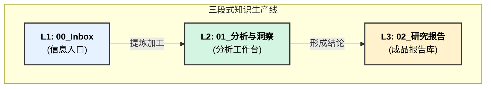

# 知识生产系统总纲

---
**版本**: 1.0
**状态**: 已生效
**核心理念**: 将信息处理流程化，分离"输入"、"处理"、"输出"，构建一个从原始信号到可行动洞察的高效、可追溯的知识生产线。
---

## 核心工作流：三段式信息流水线

本系统由三个一级目录构成，分别对应知识生产的三个核心阶段。

---

## 各模块职责与规则

### 1. `00_Inbox` (信息入口)
- **职责**: **快速、无压力地捕获一切原始信息**。这是所有知识的起点。
- **内容示例**: 网页剪藏、PDF笔记、会议纪要、一闪而过的想法、文章链接等。
- **核心规则**:
    - **只进不出**: 此处只做收集，不做深度处理和归类。
    - **快速记录**: 优先保证信息不丢失，格式不限。

### 2. `01_分析与洞察` (分析工作台)
- **职责**: **核心的分析、思考与洞察发生地**。这里是"厨房"，负责将来自`00_Inbox`的"食材"加工成"半成品"。
- **内部结构**:
    - `01_分析单元/`: 用于构建标准化的**"画像"**（公司、人物、产品等），是分析的基础模块。
    - `02_综合洞察/`: 用于进行**交叉分析、趋势判断、论点推导**，是形成洞察的核心区域。
- **核心规则**:
    - **过程导向**: 允许"混乱"和迭代，记录思考的过程。
    - **深度链接**: 所有分析都应尽可能链接到`00_Inbox`中的原始信号，以及`01_分析单元`中的相关画像，确保可追溯性。

### 3. `02_研究报告` (成品报告库)
- **职责**: **只存放最终的、经过精炼的、高价值的输出成果**。这里是"餐厅"，所有内容都应是可直接"消费"的成品。
- **内容示例**: 专题分析报告、投资策略备忘录、市场趋势判断、项目评估结论等。
- **核心规则**:
    - **结论导向**: 内容应简洁、清晰，突出核心结论和行动指南。
    - **高度结构化**: 使用标准化的报告模板，便于查阅和引用。
    - **链接到过程**: 报告可以链接回`01_分析与洞察`中的详细分析过程，但其自身必须是独立的、可完整理解的。

---
*本文档是本知识库的最高指导原则，所有操作应遵循此工作流。* 